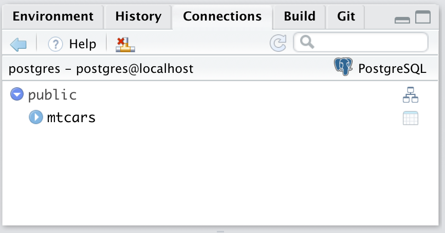
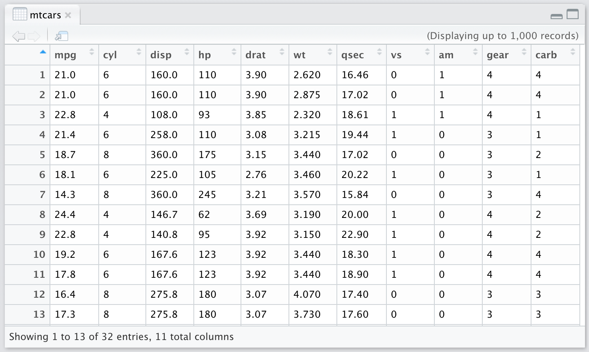

# Connecting Docker, PostgreSQL, and R {#chapter_connect-docker-postgresql-r}

> This chapter demonstrates how to:
>
>  * Run, clean-up and close PostgreSQL in Docker containers.
>  * Keep necessary credentials secret while being available to R when it executes.
>  * Interact with PostgreSQL when it's running inside a Docker container.
>  * Read and write to PostgreSQL from R.

Please install the `sqlpetr` package if not already installed:
```{r sqlpetr, echo = TRUE, message=FALSE, warning=FALSE}
library(devtools)
if (!require(sqlpetr)) {
    remotes::install_github(
      "smithjd/sqlpetr",
      force = TRUE, build = FALSE, quiet = TRUE)
}

```
Note that when you install the package the first time, it will ask you to update the packages it uses and that can take some time.

The following packages are used in this chapter:
```{r setup, echo=TRUE, message=FALSE, warning=FALSE}
library(tidyverse)
library(DBI)
library(RPostgres)
require(knitr)
library(sqlpetr)
```

## Verify that Docker is running

Docker commands can be run from a terminal (e.g., the Rstudio Terminal pane) or with a `system2()` command.  (We discuss the diffeent ways of interacting with Docker and other elements in your environment in a [separate chapter](#your-local-environment).)  The necessary functions to start, stop Docker containers and do other busy work are provided in the `sqlpetr` package.  As time permits and curiosity dictates, feel free to look at those functions to see how they work.

### Check that Docker is up and running

> Note: The `sqlpetr` package is written to accompany this book.  The functions in the package are designed to help you focus on interacting with a dbms from R.  You can ignore how they work until you are ready to delve into the details.  They are all named to begin with `sp_`.  The first time a function is called in the book, we provide a note explaining its use.

> The `sp_check_that_docker_is_up` function from the `sqlpetr` package checks whether Docker is up and running.  If it's not, then you need to install, launch or re-install Docker.

```{r check on Docker}
sp_check_that_docker_is_up()
```

## Remove previous containers if they exist
Force remove the `cattle` and `sql-pet` containers if they exist (e.g., from prior experiments).  

> The `sp_docker_remove_container` function from the `sqlpetr` package forcibly removes a Docker container. If it is running it will be forcibly terminated and removed. If it doesn't exist you won't get an error message. Note that the `images` out of which a container is built will still exist on your system.

```{r remove docker containers if they exist}
sp_docker_remove_container("cattle")
sp_docker_remove_container("sql-pet")
```

We name containers `cattle` for "throw-aways" and `pet` for ones we treasure and keep around.  :-)

> The `sp_docker_remove_container` function from the `sqlpetr` package creates a container and runs the PostgreSQL 10 image (`docker.io/postgres:10`) in it. The image will be downloaded if it doesn't exist locally.

```{r setup cattle Docker container, eval=TRUE, echo=TRUE}
sp_make_simple_pg("cattle")

```
The first time you run this, Docker downloads the PostgreSQL image, which takes a bit of time. Did it work? The following command should show that a container named `cattle` is running `postgres:10`.

```{r }
sp_check_that_docker_is_up()

```

> The `sp_docker_containers_tibble` function from the `sqlpetr` package provides more on the containers that Docker is running.  Basically this function creates a tibble of containers using `docker ps`.

```{r show the contatiners}
sp_docker_containers_tibble()

```

## Connecting, reading and writing to PostgreSQL from R


### Connecting to PostgreSQL
The `sp_make_simple_pg` function we called above created a container from the
`postgres:10` library image downloaded from Docker Hub. As part of the process, it set the password for the PostgreSQL database superuser `postgres` to the value 
"postgres".

For simplicity, we are using a weak password at this point and it's shown here 
and in the code in plain text. That is bad practice because user credentials 
should not be shared in open code like that.  A [subsequent chapter](#dbms-login)
demonstrates how to store and use credentials to access the DBMS so that they 
are kept private.

> The `sp_get_postgres_connection` function from the `sqlpetr` package gets a DBI connection string to a PostgreSQL database, waiting if it is not ready. This function connects to an instance of PostgreSQL and we assign it to a symbol, `con`, for subsequent use. The `connctions_tab = TRUE` parameter opens a connections tab that's useful for navigating a database.

> Note that we are using port 5439 for PostgreSQL inside the container and published to `localhost`. Why? If you have PostgreSQL already running on the host or another container, it probably claimed port 5432, since that's the default. So we need to use a different port for *our* PostgreSQL container.

```{r}
con <- sp_get_postgres_connection(
  host = "localhost",
  port = 5439,
  user = "postgres",
  password = "postgres",
  dbname = "postgres",
  seconds_to_test = 30, 
  connection_tab = TRUE
)

```

If you have been executing the code from this tutorial, the database will not contain any tables yet, but you will be connected to the database:

```{r}
DBI::dbListTables(con)
```
The Connections tab shows that you are connected but that the database has no tables in it:


### Interact with PostgreSQL

Write `mtcars` to PostgreSQL
```{r}
DBI::dbWriteTable(con, "mtcars", mtcars, overwrite = TRUE)
```

List the tables in the PostgreSQL database to show that `mtcars` is now there:

```{r}
DBI::dbListTables(con)
```
The Connections tab has not been updated, so it still shows no tables.  When the code to connect to the database is executed again, the connections tab is updated.
```{r}
con <- sp_get_postgres_connection(
  host = "localhost",
  port = 5439,
  user = "postgres",
  password = "postgres",
  dbname = "postgres",
  seconds_to_test = 30, 
  connection_tab = TRUE
)

```
The Connections tab now shows:


Clicking on the triangle on the left next to `mtcars` will list the table's fields.  That's equivalent to listing the fields with:

```{r}
DBI::dbListFields(con, "mtcars")
```
Here is the same information on the Connections tab:

Clicking on the rectangle on the right of `mtcars` opens a `View` tab on the first 1,000 rows of a table.  That's equivalent to excuting this code to download the table from the DBMS to a local data frame:
```{r}
mtcars_df <- DBI::dbReadTable(con, "mtcars")
```

> The `sp_print_df` function from the `sqlpetr` package shows (or print) a data frame depending on appropriate output type.  That is when running interactively or generating HTML it prints a `DT::datatable()` while it prints a `knitr::kable()` otherwise.

```{r}
sp_print_df(head(mtcars_df))

```
Interactively, you can also click on the mtcars table in the Connections tab to see:

The number of rows and columns shown in the View pane depends on the size of the window.

## Clean up

Afterwards, always disconnect from the dbms:
```{r}
DBI::dbDisconnect(con)
```
The Connection tab equivalent is to click on the connection icon next to `Help` on the Connctions tab.

> The `sp_docker_stop` function from the `sqlpetr` package stops the container given by the `container_name` parameter.

Tell Docker to stop the `cattle` container:
```{r}
sp_docker_stop("cattle")
```

> The `sp_docker_remove_container` function from the `sqlpetr` package removes the container given by the `container_name` parameter.

Tell Docker to *remove* the `cattle` container from it's library of active containers:

```{r}
sp_docker_remove_container("cattle")
```

Verify that `cattle` is gone:
```{r}
sp_docker_containers_tibble()

```

If we just **stop** the Docker container but don't remove it (as we did with the `sp_docker_remove_container("cattle")` command), the `cattle` container will persist and we can start it up again later with `sp_docker_start("cattle")`.  In that case, `mtcars` would still be there and we could retrieve it from PostgreSQL again.  Since `sp_docker_remove_container("cattle")`  has removed it, the updated database has been deleted.  (There are enough copies of `mtcars` in the world, so no great loss.)
