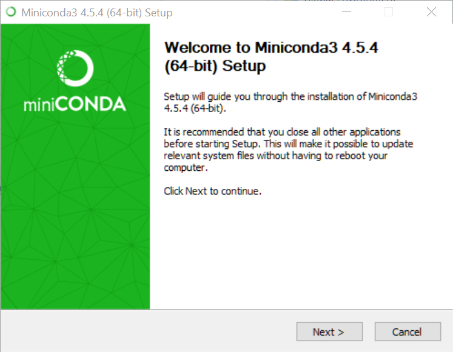
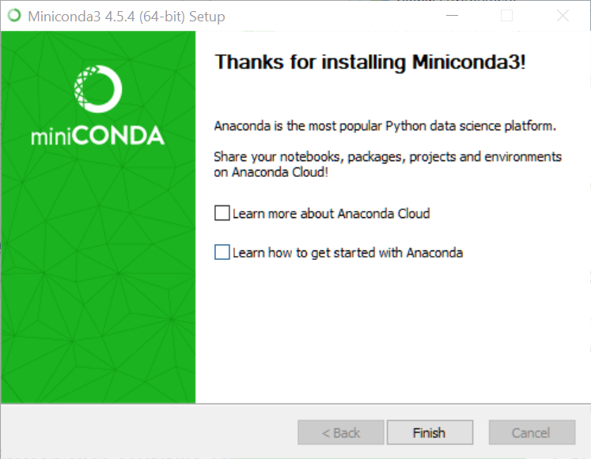

```{r setup, include=FALSE}
knitr::opts_chunk$set(echo = TRUE)
```

## Why do this?

A number of R deep learning packages use Python under the hood. RStudio's `keras`package, for example, works this way. Also, the R `docker` package works by calling a Python Docker API library from R via `reticulate`. And, of course, you'll probably end up receiving a Jupyter notebook or two even if you're a die-hard RStudio user. So ... here we go!

## Install the `installr` package.
There's an R package called `installr` that can run a Windows installer.
```{r}
if (!require(installr)) install.packages("installr")
library(installr)
```

## Install Miniconda3
The following R code chunk will install Miniconda3. I've commented it out because I already ran it.

```{r}
#install.URL("https://repo.continuum.io/miniconda/Miniconda3-latest-Windows-x86_64.exe")
```

Here are the screenshots you'll see:

```{r echo=FALSE}

```
<br>Click `Next`.

***

```{r echo=FALSE}
knitr::include_graphics("screenshots/2018-08-31 16_13_57-Miniconda3 4.5.4 (64-bit) Setup.png")
```
<br>Click `I Agree`.

***

```{r echo=FALSE}
knitr::include_graphics("screenshots/2018-08-31 16_14_23-Miniconda3 4.5.4 (64-bit) Setup.png")
```
<br>`Just Me`, `Next`.

***

```{r echo=FALSE}
knitr::include_graphics("screenshots/2018-08-31 16_16_11-Miniconda3 4.5.4 (64-bit) Setup.png")
```
<br>Choose the install location. The default is your home directory, which on my laptop is a small SSD. So I changed it to the `D` drive, which is a terabyte spinning disk. After you've set the install location, click `Next`.

***

```{r echo=FALSE}
knitr::include_graphics("screenshots/2018-08-31 16_18_47-Miniconda3 4.5.4 (64-bit) Setup.png")
```
<br>Clear both check boxes and click `Install`.

***

```{r echo=FALSE}
knitr::include_graphics("screenshots/2018-08-31 16_21_12-Miniconda3 4.5.4 (64-bit) Setup.png")
```
<br>Click `Next`.

***

```{r echo=FALSE}

```
<br>Clear the check boxes and click `Finish`.

## Install `reticulate`
```{r}
if (!require(reticulate)) install.packages("reticulate")
library(reticulate)
```
<br>Did it work?
```{r}
py_discover_config()
```

