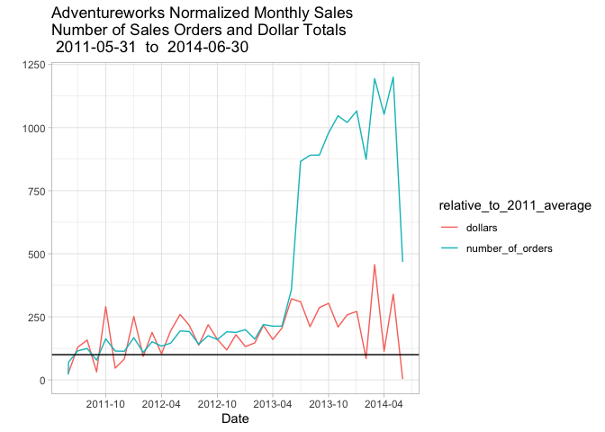

Digging into Adventureworks sales data
======================================

This chapter explores one table, illustrating the kind of detective work
that’s needed to understand one table. We’ll investigate the
`salesorderheader` table in the `sales` schema.

This code currently uses the new `pivot_longer` function. You may need
to install

`devtools::install_github("tidyverse/tidyr")`

    sp_docker_start("adventureworks")
    Sys.sleep(sleep_default)
    con <- sp_get_postgres_connection(
      host = "localhost",
      port = 5432,
      user = "postgres",
      password = "postgres",
      dbname = "adventureworks",
      seconds_to_test = sleep_default, connection_tab = TRUE
    )

    ## <PqConnection> adventureworks@localhost:5432

<a href="https://www.rstudio.com/wp-content/uploads/2015/03/rmarkdown-reference.pdf" class="uri">https://www.rstudio.com/wp-content/uploads/2015/03/rmarkdown-reference.pdf</a>

(moved a big chunk about schemas to 050 - setup adventureworks and
connect with rstudio)

Poke around the Adventure Works Sales table
-------------------------------------------

Take some time now and poke around the salesorderheader table. The
`summary` function is always a good first step:

    tbl(con, in_schema("sales", "salesorderheader")) %>% 
    collect(n = 1000) %>% summary()

    ##   salesorderid      revisionnumber   orderdate                  
    ##  Min.   :43659.00   Min.   :8      Min.   :2011-05-31 00:00:00  
    ##  1st Qu.:43908.75   1st Qu.:8      1st Qu.:2011-07-01 00:00:00  
    ##  Median :44158.50   Median :8      Median :2011-08-05 00:00:00  
    ##  Mean   :44158.50   Mean   :8      Mean   :2011-08-09 06:18:43  
    ##  3rd Qu.:44408.25   3rd Qu.:8      3rd Qu.:2011-09-15 00:00:00  
    ##  Max.   :44658.00   Max.   :8      Max.   :2011-10-14 00:00:00  
    ##                                                                 
    ##     duedate                       shipdate                       status 
    ##  Min.   :2011-06-12 00:00:00   Min.   :2011-06-07 00:00:00   Min.   :5  
    ##  1st Qu.:2011-07-13 00:00:00   1st Qu.:2011-07-08 00:00:00   1st Qu.:5  
    ##  Median :2011-08-17 00:00:00   Median :2011-08-12 00:00:00   Median :5  
    ##  Mean   :2011-08-21 06:18:43   Mean   :2011-08-16 06:18:43   Mean   :5  
    ##  3rd Qu.:2011-09-27 00:00:00   3rd Qu.:2011-09-22 00:00:00   3rd Qu.:5  
    ##  Max.   :2011-10-26 00:00:00   Max.   :2011-10-21 00:00:00   Max.   :5  
    ##                                                                         
    ##  onlineorderflag purchaseordernumber accountnumber        customerid      
    ##  Mode :logical   Length:1000         Length:1000        Min.   :11000.00  
    ##  FALSE:303       Class :character    Class :character   1st Qu.:16587.50  
    ##  TRUE :697       Mode  :character    Mode  :character   Median :25904.00  
    ##                                                         Mean   :22634.07  
    ##                                                         3rd Qu.:29570.00  
    ##                                                         Max.   :30117.00  
    ##                                                                           
    ##  salespersonid       territoryid     billtoaddressid    shiptoaddressid   
    ##  Min.   :274.0000   Min.   : 1.000   Min.   :  446.00   Min.   :   28.00  
    ##  1st Qu.:276.0000   1st Qu.: 4.000   1st Qu.: 1013.00   1st Qu.: 1015.00  
    ##  Median :278.0000   Median : 6.000   Median :16403.00   Median :16403.00  
    ##  Mean   :278.5116   Mean   : 5.937   Mean   :14558.48   Mean   :14587.49  
    ##  3rd Qu.:281.0000   3rd Qu.: 9.000   3rd Qu.:23448.75   3rd Qu.:23448.75  
    ##  Max.   :283.0000   Max.   :10.000   Max.   :29827.00   Max.   :29827.00  
    ##  NA's   :697                                                              
    ##   shipmethodid    creditcardid      creditcardapprovalcode
    ##  Min.   :1.000   Min.   :   10.00   Length:1000           
    ##  1st Qu.:1.000   1st Qu.: 4945.50   Class :character      
    ##  Median :1.000   Median : 9665.50   Mode  :character      
    ##  Mean   :2.212   Mean   : 9580.48                         
    ##  3rd Qu.:5.000   3rd Qu.:14105.75                         
    ##  Max.   :5.000   Max.   :19207.00                         
    ##                  NA's   :28                               
    ##  currencyrateid         subtotal              taxamt          
    ##  Min.   :   2.0000   Min.   :     5.700   Min.   :    0.4940  
    ##  1st Qu.: 411.0000   1st Qu.:  3399.990   1st Qu.:  271.9992  
    ##  Median : 834.0000   Median :  3578.270   Median :  286.2616  
    ##  Mean   : 907.2789   Mean   :  8617.432   Mean   :  792.5531  
    ##  3rd Qu.:1348.0000   3rd Qu.:  3578.270   3rd Qu.:  286.2616  
    ##  Max.   :1777.0000   Max.   :126198.336   Max.   :12277.2447  
    ##  NA's   :455                                                  
    ##     freight             totaldue             comment         
    ##  Min.   :   0.1544   Min.   :     6.3484   Length:1000       
    ##  1st Qu.:  84.9998   1st Qu.:  3756.9890   Class :character  
    ##  Median :  89.4568   Median :  3953.9884   Mode  :character  
    ##  Mean   : 247.6729   Mean   :  9657.6579                     
    ##  3rd Qu.:  89.4568   3rd Qu.:  3953.9884                     
    ##  Max.   :3836.6390   Max.   :142312.2199                     
    ##                                                              
    ##    rowguid           modifieddate                
    ##  Length:1000        Min.   :2011-06-07 00:00:00  
    ##  Class :character   1st Qu.:2011-07-08 00:00:00  
    ##  Mode  :character   Median :2011-08-12 00:00:00  
    ##                     Mean   :2011-08-16 06:18:43  
    ##                     3rd Qu.:2011-09-22 00:00:00  
    ##                     Max.   :2011-10-21 00:00:00  
    ## 

The first item we examine is Adventure Works’ sales dollars over the
span of data available at different levels of detail. On an annual
basis, are sales dollars trending up, down or flat?

    annual_sales <- dbGetQuery(
      con,
      "SELECT date_trunc('year', orderdate)::date DATE
        ,min(orderdate)::date min_orderdate
        ,max(orderdate)::date max_orderdate
        ,round(sum(subtotal),2) so_dollars
        ,round(avg(subtotal),2) avg_so_dollars
        ,count(*) so_cnt
    FROM sales.salesorderheader sh
    GROUP BY date_trunc('year', orderdate)
    ORDER BY DATE
    "
    )

    sp_print_df(annual_sales)

repeat in dplyr code

    annual_sales_d <-  tbl(con, in_schema("sales", "salesorderheader")) %>%
      mutate(date = substr(as.character(orderdate), 1, 4)) %>%
      group_by(date) %>%
      summarize(
        min_orderdate = min(orderdate),
        max_orderdate = max(orderdate),
        so_dollars = round(sum(subtotal, na.rm = TRUE), 2),
        so_cnt = n()
      ) %>%
      arrange(date) %>%
      select(date, min_orderdate, max_orderdate, so_dollars, so_cnt) %>%
      collect() %>%
      as.data.frame()

    ## Warning: Missing values are always removed in SQL.
    ## Use `MIN(x, na.rm = TRUE)` to silence this warning
    ## This warning is displayed only once per session.

    ## Warning: Missing values are always removed in SQL.
    ## Use `MAX(x, na.rm = TRUE)` to silence this warning
    ## This warning is displayed only once per session.

    annual_sales_d

    ##   date min_orderdate max_orderdate  so_dollars so_cnt
    ## 1 2011    2011-05-31    2011-12-31 12641672.21   1607
    ## 2 2012    2012-01-01    2012-12-31 33524301.33   3915
    ## 3 2013    2013-01-01    2013-12-31 43622479.05  14182
    ## 4 2014    2014-01-01    2014-06-30 20057928.81  11761

    min_dt <- min(annual_sales$min_orderdate)
    max_dt <- max(annual_sales$max_orderdate)

    ggplot(data = annual_sales, aes(x = date, y = so_dollars)) +
      geom_col(fill = "lightblue", color = "blue") +
      xlab("Year") +
      ylab("Sales $") +
      ggtitle(paste("Adventure Works Sales Dollars by Year\n  ", min_dt, " - ", max_dt))

From the title we see that the available data covers the last seven
months of 2011 through the first six months of 2014. From 2011 through
2013, sales are trending up and the growth between years is slowing
down. 2014 sales dollars look a little behind 2013. Are sales dollars
for 2014 really down or are sales dollars seasonal? To see if the sales
dollars are sesonal, we will drill in and look at the monthly sales.
Let’s first clean up the y-axis labels and include the number of sales
orders and the average sales order dollars associated with the annual
dollars?

Sales Orders and Dollars
========================

How are the sales dollars related to the number of orders and what is
the average order amount? In the next plot, the title is centered, the
y-axis is rescaled, and number of orders and average order dollar amount
is added to the top of each bar.

    ggplot(data = annual_sales, aes(x = date, y = so_dollars)) +
      geom_col(fill = "lightblue", color = "blue") +
      xlab("Year") +
      ylab("Sales Dollars") +
      scale_y_continuous(labels = dollar) + # clean up y-axis
      geom_text(aes(label = paste(
        "orders", so_cnt, "
    ",
        "avg $ ", avg_so_dollars
      )), vjust = 1.5) + # orders inside each bar at top
      theme(plot.title = element_text(hjust = 0.5)) + # Center ggplot title
      ggtitle(paste("Sales by Year\n", min_dt, " - ", max_dt))

The following 3 plots show how odd the sales data is:

Look at average dollars per sale sale:

    ggplot(data = annual_sales, aes(x = date, y = avg_so_dollars)) +
      geom_col(fill = "lightblue", color = "blue") +
      xlab("Year") +
      ylab("Average sale amount") +
      scale_y_continuous(labels = dollar) + # clean up y-axis
      ggtitle(paste("Average Dollars per Sale\n", min_dt, " - ", max_dt))

Look at number of orders per year:

    ggplot(data = annual_sales, aes(x = date, y = as.numeric(so_cnt))) +
      geom_col(fill = "lightblue", color = "blue") +
      xlab("Year") +
      ylab("Total number of orders") +
      ggtitle(paste("Number of Orders per Year\n", min_dt, " - ", max_dt))

Look at number of orders by the the average sales per order for the four
years:

    ggplot(data = annual_sales, aes(x = avg_so_dollars, y = as.numeric(so_cnt))) +
      geom_point(fill = "lightblue", color = "blue", alpha = .2) +
      geom_text(aes(label = lubridate::year(date), ,hjust=.5, vjust=0)) +
      xlab("Average dollars per order") +
      ylab("Total number of orders") +
      ggtitle(paste("Number of Orders by Average Order Amount\n", min_dt, " - ", max_dt))

The orders in 2012 are about 30% of the 2013 sales, but the 2012 average
sales order dollars are 2.75 larger than the 2013 average sales order.

**Why are the number of orders increasing, but the average order dollar
amount dropping? **

Adventure Works Monthly Sales.
------------------------------

The next code block drills down from annual sales dollars to monthly
sales dollars.

    monthly_sales <- dbGetQuery(
      con,
      "
    SELECT *
          ,sum(so_dollars) over (partition by mo order by yr) cum_so_dollars
      FROM (
            SELECT EXTRACT(MONTH FROM orderdate) mo
                  ,EXTRACT(YEAR FROM orderdate) yr
                  ,min(orderdate)::date min_orderdate
                  ,max(orderdate)::date max_orderdate
                  ,round(sum(subtotal),2) so_dollars
                  ,count(*) * 1.0  so_cnt   -- Suppress msg:Don't know how to automatically pick scale for object of type integer64. 
                  ,round(AVG(subtotal),2) avg_so_dollars
    --              ,round(sum(subtotal),2) order_amt
              FROM sales.salesorderheader sh
            GROUP BY EXTRACT(MONTH FROM orderdate),EXTRACT(YEAR FROM orderdate) 
           ) AS SRC
    ORDER BY mo,yr
    "
    )

    sp_print_df(monthly_sales)

 Do the
same query in dplyr

    monthly_sales_d <-  tbl(con, in_schema("sales", "salesorderheader")) %>%
      mutate(yr = year(orderdate), mo = month(orderdate)) %>%
      group_by(yr, mo) %>%
      summarize(
        min_orderdate = min(orderdate, na.rm = TRUE),
        max_orderdate = max(orderdate, na.rm = TRUE),
        so_dollars = round(sum(subtotal, na.rm = TRUE), 2),
        so_cnt = n()
      ) %>%
      arrange(yr, mo) %>%
      select(yr, mo, min_orderdate, max_orderdate, so_dollars, so_cnt) %>%
      collect() %>%
      as.data.frame()
    sp_print_df(monthly_sales_d)

    min_dt <- min(monthly_sales$min_orderdate)
    max_dt <- max(monthly_sales$max_orderdate)

    ggplot(data = monthly_sales, aes(x = mo, y = so_dollars, fill = yr)) +
      geom_col() +
      xlab("Month") +
      ylab("Sales Dollars") +
      scale_y_continuous(labels = dollar) +
      geom_text(aes(label = so_cnt), vjust = 1.5) + # Add nbr of orders
      theme(plot.title = element_text(hjust = 0.5)) + # Center ggplot title
      ggtitle(paste("Sales by Month\n", min_dt, " - ", max_dt))

That is one ugly and useless graph. It is hard to read/interpret \* the
dollar amounts associated with each color/year in each bar \* the number
of orders/month for each year, \* the x-axis labels and associated
months.

SQL does not have a factor data type. The ‘mo’ and ‘yr’ INT data types
are converted to factors. This changes the yr legend on the right from
the default black to blue to the default factor colors. The bar text
positioned based on cum\_so\_dollars and adjusted down 1.5 units.

    monthly_sales$mo <- as.factor(monthly_sales$mo)
    monthly_sales$yr <- as.factor(monthly_sales$yr) # changes color scale from continuous blue to distinct colors
    ggplot(data = monthly_sales, aes(x = mo, y = so_dollars, fill = yr)) +
      geom_col(position = position_stack(reverse = TRUE)) + # reverse stacked bars 2011 bottom 2014 top
      guides(fill = guide_legend(reverse = TRUE)) + # reverse bar/legend fill
      xlab("Month") +
      ylab("Sales Dollars") +
      scale_y_continuous(labels = dollar) +
      geom_text(aes(y = cum_so_dollars, label = so_cnt), vjust = 1.5) + # Add so_cnt based on mo/yr cumulative $ amounts
      theme(plot.title = element_text(hjust = 0.5)) + # Center ggplot title
      ggtitle(paste("Sales by Month by Year\nWith Number of Sales Orders\n", min_dt, " - ", max_dt))

This plot is better. The colors associated with each year and the number
of orders by year are much easier to read and the x-axis now reflect the
months.

Having stacked bars, it is difficult to compare the monthly dollar
amounts between the different years. The next plot fixes some of these
short comings. Instead of stacking the bars vertically, the next plot
shows the bars horizontally in ascending year order for each month and
the plot width is increased from the default 7 to 16. Note that the
first four months only have three years and that the bars are wider than
those with four bars. The overall width of for each month is same.

        # The next two statements were done in the previous code block
        # Why do the need to be done again in this code block
        
        monthly_sales$mo <- as.factor(monthly_sales$mo)
        
        monthly_sales$yr <- as.factor(monthly_sales$yr)

    min_dt <- min(monthly_sales_d$min_orderdate)
    max_dt <- max(monthly_sales_d$max_orderdate)

    start_year <- monthly_sales_d %>% 
      filter(yr == min(yr)) %>% 
      group_by(yr) %>% 
      summarize(so_dollars = sum(so_dollars), 
                so_cnt = sum(so_cnt), 
                n_months = n(),
                avg_dollars = so_dollars / n_months,
                avg_cnt = so_cnt / n_months)
    start_year

    ## # A tibble: 1 x 6
    ##      yr so_dollars so_cnt  n_months avg_dollars avg_cnt
    ##   <dbl>      <dbl> <int64>    <int>       <dbl>   <dbl>
    ## 1  2011  12641672. 1607           8    1580209.    201.

    normalized_monthly_sales <-  monthly_sales_d %>% 
      mutate(dollars = (100 * so_dollars) / start_year$avg_dollars,
             number_of_orders = (100 * so_cnt) / start_year$avg_cnt)

    normalized_monthly_sales <- normalized_monthly_sales %>% 
      mutate(date = as.Date(min_orderdate)) %>% 
      select(date, dollars, number_of_orders) %>% 
      pivot_longer(-date, names_to = "relative_to_2011_average", values_to = "amount" )

    normalized_monthly_sales %>% 
      ggplot(aes(date, amount, color = relative_to_2011_average)) +
      geom_line() +
      geom_hline(yintercept = 100) +
      xlab("Date") +
      ylab("") +
      scale_x_date(date_labels = "%Y-%m", date_breaks = "6 months") +
      ggtitle(paste("Adventureworks Normalized Monthly Sales\nNumber of Sales Orders and Dollar Totals\n", min_dt, " to ", max_dt))

    ggplot(data = monthly_sales, aes(x = mo, y = so_dollars, fill = yr)) +
      geom_col(position = position_stack(reverse = TRUE)) + # reverse stacked bars 2011 bottom 2014 top
      guides(fill = guide_legend(reverse = TRUE)) + # reverse bar/legend fill
      xlab("Month") +
      ylab("Sales Dollars") +
      scale_y_continuous(labels = dollar) +
      geom_text(aes(y = cum_so_dollars, label = so_cnt), vjust = 1.5) + # Add so_cnt based on mo/yr cumulative $ amounts
      theme(plot.title = element_text(hjust = 0.5)) + # Center ggplot title
      ggtitle(paste("Sales by Month by Year\nWith Number of Sales Orders\n", min_dt, " - ", max_dt))

    # The next two statements were done in the previous code block
    # Why do the need to be done again in this code block
    monthly_sales$mo <- as.factor(monthly_sales$mo)
    monthly_sales$yr <- as.factor(monthly_sales$yr)

    # ggplot(data=monthly_sales,aes(x=mo,y=so_dollars,fill=yr)) +
    ggplot(data = monthly_sales, aes(x = mo, y = so_dollars, fill = yr)) +
      geom_col(position = "dodge", color = "black") + # unstack columns and outline in black
      xlab("Month") +
      ylab("Sales Dollars") +
      scale_y_continuous(labels = dollar) +
      geom_text(aes(label = paste(so_cnt, "
    ", avg_so_dollars)),
        size = 2.5,
        color = "black",
        vjust = 1.5,
        position = position_dodge(.9)
      ) +
      theme(plot.title = element_text(hjust = 0.5)) + # Center ggplot title
      ggtitle(paste("Sales by Month by Year\nWith Number of Sales Orders\nAnd Average SO $ Amount\n", min_dt, " - ", max_dt))

The next plot shows the same data as a line graph.

    # sp_print_df(monthly_sales)

    ggplot(
      data = monthly_sales,
      aes(
        x = mo, y = so_dollars, color = as.factor(yr),
        group = as.factor(yr)
      )
    ) + # Removes msg: Each group consists of only one observation. Do you need to adjust the group aesthetic?

      geom_line() +
      geom_point() +
      xlab("Month") +
      ylab("Sales Dollars") +
      scale_y_continuous(labels = dollar) +
      geom_text(aes(label = paste(so_cnt, "
    ", avg_so_dollars)),
        size = 2.5,
        color = "black",
        vjust = 1.5,
        position = position_dodge(.5)
      ) + # orders => avg so $ amt
      theme(plot.title = element_text(hjust = .5)) + # Center ggplot title
      ggtitle(paste("Sales by Month by Year\nWith Number of Sales Orders\nAnd Average SO $ Amount\n", min_dt, " - ", max_dt))

A couple of things jump out from the graph.

1.  2012 and 2013 have similar sales dollar plots and peak every three
    months. This may reflect the closing as many sales orders as
    possible to make the quarterly sales numbers look good.
2.  2011 has more variation than 2012 and 2013 and peaks every two
    months.
3.  2014 has the most variation and also peaks every two months. Both
    the number of sales, 939, and the average sales order size, $52.19
    plumet in June 2014.

<!-- -->

    so_cnt_2011 <- monthly_sales %>%
      filter(yr == 2011) %>%
      select(so_cnt)
    so_cnt_2012_5_12 <- monthly_sales %>%
      filter(yr == 2012 & mo %in% c(5, 6, 7, 8, 9, 10, 11, 12)) %>%
      select(so_cnt)
    so_cnt_2012 <- monthly_sales %>%
      filter(yr == 2012) %>%
      select(so_cnt)
    so_cnt_2013 <- monthly_sales %>%
      filter(yr == 2013) %>%
      select(so_cnt)
    so_cnt_2013_1_6 <- monthly_sales %>%
      filter(yr == 2013 & mo %in% c(1, 2, 3, 4, 5, 6)) %>%
      select(so_cnt)
    so_cnt_2014 <- monthly_sales %>%
      filter(yr == 2014) %>%
      select(so_cnt)
    so_cnt_2012_2011 <- so_cnt_2012_5_12 / so_cnt_2011
    so_cnt_2013_2012 <- so_cnt_2013 / so_cnt_2012
    so_cnt_2014_2013 <- so_cnt_2014 / so_cnt_2013_1_6

    cat("2012 vs 2011 sales order ratios for May - December
    ", unlist(so_cnt_2012_2011))

    ## 2012 vs 2011 sales order ratios for May - December
    ##  6.813953488 2.765957447 1.666666667 1.14 2.242038217 0.9816513761 1.665217391 1.657894737

    cat("

    2013 vs 2012 sales order ratios
    ", unlist(so_cnt_2013_2012))

    ## 
    ## 
    ## 2013 vs 2012 sales order ratios
    ##  1.19047619 1.484018265 1.450657895 1.591078067 1.460750853 1.843589744 4.519480519 6.277192982 5.088068182 6.130841121 5.490861619 5.423280423

    cat("

    2014 vs 2013 sales order ratios for January - June
    ", unlist(so_cnt_2014_2013))

    ## 
    ## 
    ## 2014 vs 2013 sales order ratios for January - June
    ##  5.3525 5.403076923 5.439909297 4.941588785 5.63317757 1.305980529

Comparing the number of sales orders year over year by month for 2013
and 2012, one can see that the 2013 sales are between 1.2 and 1.8 times
larger than the corresponding month of 2012 from January through June.
In July the 2013 sales are 5 to 6 times the 2012 sales orders.

This trend continues into 2014 before the number of sales plumet to just
1.3 time in June.

**What happened in July 2013?**

    mo_onl_pct <- dbGetQuery(
      con,
      "
    SELECT *
          ,round(orders/mo_orders * 100.0,2) mo_pct
          ,round(sales_dollars/mo_sales * 100.0,2) mo_dlr_pct
      FROM (SELECT EXTRACT(MONTH FROM orderdate) mo, EXTRACT(YEAR FROM orderdate) yr
                 , min(orderdate)::DATE min_orderdate, max(orderdate)::DATE max_orderdate
                 , round(sum(subtotal), 2) sales_dollars
                 , round(sum(sum(subtotal)) over (partition by EXTRACT(MONTH FROM orderdate),EXTRACT(YEAR FROM orderdate)
                                 order by EXTRACT(YEAR FROM orderdate)),2) mo_sales
                 , count(*) * 1.0 orders
                 , sum(count(*)) over (partition by EXTRACT(MONTH FROM orderdate),EXTRACT(YEAR FROM orderdate)
                                 order by EXTRACT(YEAR FROM orderdate)) mo_orders
                 , case when sh.onlineorderflag then 'online' else 'sales rep' end sales_type
            FROM sales.salesorderheader sh
            GROUP BY EXTRACT(MONTH FROM orderdate), EXTRACT(YEAR FROM orderdate), 
                     case when sh.onlineorderflag then 'online' else 'sales rep' end
           ) as src
    ORDER BY mo, yr, sales_type
    "
    )

    sp_print_df(mo_onl_pct)

    min_dt <- min(monthly_sales$min_orderdate)
    max_dt <- max(monthly_sales$max_orderdate)
    mo_onl_pct$mo <- as.factor(mo_onl_pct$mo)
    mo_onl_pct$yr <- as.factor(mo_onl_pct$yr)
    mo_onl_pct$sales_type <- as.factor(mo_onl_pct$sales_type)
    mo_2011 <- mo_onl_pct %>% filter(yr == 2011)
    mo_2012 <- mo_onl_pct %>% filter(yr == 2012)
    mo_2013 <- mo_onl_pct %>% filter(yr == 2013)
    mo_2014 <- mo_onl_pct %>% filter(yr == 2014)

    ggplot(data = NULL) +
      # data=mo_2011 first results in the x axis months out of order.
      geom_line(data = mo_2012, aes(x = mo, y = mo_pct, color = yr, group = sales_type)) +
      geom_line(data = mo_2011, aes(x = mo, y = mo_pct, color = yr, group = sales_type)) +
      geom_line(data = mo_2013, aes(x = mo, y = mo_pct, color = yr, group = sales_type)) +
      geom_line(data = mo_2014, aes(x = mo, y = mo_pct, color = yr, group = sales_type)) +

      geom_point(data = mo_2011, aes(x = mo, y = mo_pct, color = sales_type)) +
      geom_point(data = mo_2012, aes(x = mo, y = mo_pct, color = sales_type)) +
      geom_point(data = mo_2013, aes(x = mo, y = mo_pct, color = sales_type)) +
      geom_point(data = mo_2014, aes(x = mo, y = mo_pct, color = sales_type)) +

      geom_text(
        data = mo_2011, aes(x = mo, y = mo_pct, label = paste(orders, ":$", sales_dollars, ":", mo_dlr_pct, "%")),
        position = position_dodge(.3), size = 2.5, hjust = 0
      ) +
      geom_text(
        data = mo_2012, aes(x = mo, y = mo_pct, label = paste(orders, ":$", sales_dollars, ":", mo_dlr_pct, "%")),
        position = position_dodge(.3), size = 2.5, hjust = 0
      ) +
      geom_text(
        data = mo_2013, aes(x = mo, y = mo_pct, label = paste(orders, ":$", sales_dollars, ":", mo_dlr_pct, "%")),
        position = position_dodge(.3), size = 2.5, hjust = 0
      ) +
      geom_text(
        data = mo_2014, aes(x = mo, y = mo_pct, label = paste(orders, ":$", sales_dollars, ":", mo_dlr_pct, "%")), color = "blue",
        position = position_dodge(.3), size = 2.5, hjust = 0, vjust = 1.5
      ) +

      xlab("Month") +
      ylab("% Online Sales\nvs\n%Rep Sales") +
      theme(plot.title = element_text(hjust = .50)) +
      ggtitle(paste(
        "Sales by Month\n",
        "Online Orders Versus Rep Orders\n",
        min_dt, " - ", max_dt, "
    ",
        "Each Point shows Number of Orders: $ Amount: % of Total $ For the Month"
      ))

The sales rep orders brought in over half the monthly sales dollars for
every month except three, February, Arpil, and June of 2014. The monthly
sales rep orders for those months are 3, 2, and 0 respectively.

Monthly Sales Rep Performance Analysis
======================================

    mo_so_sreps <- dbGetQuery(
      con,
      "
    SELECT *
          ,round(orders/mo_orders * 100.0,2) mo_pct
          ,round(sales_dollars/mo_sales * 100.0,2) mo_dlr_pct
      FROM (SELECT EXTRACT(MONTH FROM orderdate) mo, EXTRACT(YEAR FROM orderdate) yr
                 , min(orderdate)::DATE min_orderdate, max(orderdate)::DATE max_orderdate
                 , round(sum(subtotal), 2) sales_dollars
                 , round(sum(sum(subtotal)) over (partition by EXTRACT(MONTH FROM orderdate),EXTRACT(YEAR FROM orderdate)
                                 order by EXTRACT(YEAR FROM orderdate)),2) mo_sales
                 , count(*) * 1.0 orders
                 , sum(count(*)) over (partition by EXTRACT(MONTH FROM orderdate),EXTRACT(YEAR FROM orderdate)
                                 order by EXTRACT(YEAR FROM orderdate)) mo_orders
                 , case when sh.onlineorderflag then 'online' else 'sales rep' end sales_type
            FROM sales.salesorderheader sh
                 INNER JOIN sales.salesorderdetail sd
                    ON sh.salesorderid = sd.salesorderid
           WHERE not sh.onlineorderflag
            GROUP BY EXTRACT(MONTH FROM orderdate), EXTRACT(YEAR FROM orderdate), 
                     case when sh.onlineorderflag then 'online' else 'sales rep' end
           ) as src
    ORDER BY mo, yr, sales_type
    "
    )

    sp_print_df(mo_so_sreps)

    monthly_sales_online <- dbGetQuery(
      con,
      "
    SELECT EXTRACT(MONTH FROM orderdate) mo, EXTRACT(YEAR FROM orderdate) yr
         , min(orderdate)::DATE min_orderdate, max(orderdate)::DATE max_orderdate
         , so.category
         , round(sum(subtotal), 2) sales_dollars
         , count(*) * 1.0 orders
     FROM sales.salesorderheader sh
          JOIN sales.salesorderdetail sd ON SH.salesorderid = sd.salesorderid
          JOIN sales.specialoffer so ON Sd.specialofferid = so.specialofferid
    GROUP BY EXTRACT(MONTH FROM orderdate), EXTRACT(YEAR FROM orderdate), so.category
    ORDER BY mo, yr
    "
    )

    sp_print_df(monthly_sales_online)

    ggplot(data = monthly_sales_online, aes(x = factor(mo), y = sales_dollars, fill = factor(yr))) +
      geom_col(position = "dodge", color = "black") + # unstack columns and outline in black
      xlab("Month") +
      ylab("Sales Dollars") +
      scale_y_continuous(labels = dollar) +
      geom_text(aes(label = category),
        size = 2.5
        #           ,color = 'black'
        , vjust = 1.5,
        position = position_dodge(.9)
      ) + # orders => avg so $ amt
      theme(plot.title = element_text(hjust = .50)) + # Center ggplot title
      ggtitle(paste("Sales by Month\nBy Online Flag"))

    monthly_sales_onl_pct <- dbGetQuery(
      con,
      "
    select EXTRACT(MONTH FROM orderdate) mo
          ,EXTRACT(YEAR FROM orderdate) yr
          ,sum(ORDERQTY)
          ,sum(case when salespersonid is null and onlineorderflag then 1 else 0 end) onl
          ,sum(case when salespersonid is not null and not onlineorderflag then 1 else 0 end) sp
          ,round(sum(case when onlineorderflag then 1 else 0 end )*1.0/count(*) * 100.0,2) onl_pct
          ,round(sum(case when not onlineorderflag then 1 else 0 end )*1.0/count(*) * 100.0,2) sp_pct
          ,onlineorderflag
          ,count(*)
      FROM sales.salesorderheader sh
      INNER JOIN sales.salesorderdetail sd
              ON sh.salesorderid = sd.salesorderid
      INNER JOIN production.product p
              ON sd.productid = p.productid
      INNER JOIN sales.specialoffer so
              ON sd.specialofferid = so.specialofferid
      LEFT OUTER JOIN sales.specialofferproduct sop
              ON sd.specialofferid = sop.specialofferid
             and sd.productid = sop.productid
     WHERE sop.productid is not null
    group by EXTRACT(MONTH FROM orderdate) 
            ,EXTRACT(YEAR FROM orderdate) 
            ,onlineorderflag
    order by mo,yr
    "
    )

    sp_print_df(monthly_sales_onl_pct)

    mo_onl_pct <- dbGetQuery(
      con,
      "
    SELECT *
          ,round(orders/mo_orders * 100.0,2) mo_pct
          ,round(sales_dollars/mo_sales * 100.0,2) mo_dlr_pct
      FROM (SELECT EXTRACT(MONTH FROM orderdate) mo, EXTRACT(YEAR FROM orderdate) yr
                 , min(orderdate)::DATE min_orderdate, max(orderdate)::DATE max_orderdate
                 , round(sum(subtotal), 2) sales_dollars
                 , round(sum(sum(subtotal)) over (partition by EXTRACT(MONTH FROM orderdate),EXTRACT(YEAR FROM orderdate)
                                 order by EXTRACT(YEAR FROM orderdate)),2) mo_sales
                 , count(*) * 1.0 orders
                 , sum(count(*)) over (partition by EXTRACT(MONTH FROM orderdate),EXTRACT(YEAR FROM orderdate)
                                 order by EXTRACT(YEAR FROM orderdate)) mo_orders
                 , case when sh.onlineorderflag then 'online' else 'sales rep' end sales_type
            FROM sales.salesorderheader sh
            GROUP BY EXTRACT(MONTH FROM orderdate), EXTRACT(YEAR FROM orderdate), 
                     case when sh.onlineorderflag then 'online' else 'sales rep' end
           ) as src
    ORDER BY mo, yr, sales_type
    "
    )

    sp_print_df(mo_onl_pct)

    min_dt <- min(monthly_sales$min_orderdate)
    max_dt <- max(monthly_sales$max_orderdate)
    mo_onl_pct$mo <- as.factor(mo_onl_pct$mo)
    mo_onl_pct$yr <- as.factor(mo_onl_pct$yr)
    mo_onl_pct$sales_type <- as.factor(mo_onl_pct$sales_type)
    mo_2011 <- mo_onl_pct %>% filter(yr == 2011)
    mo_2012 <- mo_onl_pct %>% filter(yr == 2012)
    mo_2013 <- mo_onl_pct %>% filter(yr == 2013)
    mo_2014 <- mo_onl_pct %>% filter(yr == 2014)

    ggplot(data = NULL) +
      # data=mo_2011 first results in the x axis months out of order.
      geom_line(data = mo_2012, aes(x = mo, y = mo_pct, color = yr, group = sales_type)) +
      geom_line(data = mo_2011, aes(x = mo, y = mo_pct, color = yr, group = sales_type)) +
      geom_line(data = mo_2013, aes(x = mo, y = mo_pct, color = yr, group = sales_type)) +
      geom_line(data = mo_2014, aes(x = mo, y = mo_pct, color = yr, group = sales_type)) +

      geom_point(data = mo_2011, aes(x = mo, y = mo_pct, color = sales_type)) +
      geom_point(data = mo_2012, aes(x = mo, y = mo_pct, color = sales_type)) +
      geom_point(data = mo_2013, aes(x = mo, y = mo_pct, color = sales_type)) +
      geom_point(data = mo_2014, aes(x = mo, y = mo_pct, color = sales_type)) +

      geom_text(
        data = mo_2011, aes(x = mo, y = mo_pct, label = paste(orders, ":$", sales_dollars, ":", mo_dlr_pct, "%")),
        position = position_dodge(.3), size = 2.25, hjust = 1.0
      ) +
      geom_text(
        data = mo_2012, aes(x = mo, y = mo_pct, label = paste(orders, ":$", sales_dollars, ":", mo_dlr_pct, "%")),
        position = position_dodge(.3), size = 2.25, hjust = 1.0
      ) +
      geom_text(
        data = mo_2013, aes(x = mo, y = mo_pct, label = paste(orders, ":$", sales_dollars, ":", mo_dlr_pct, "%")),
        position = position_dodge(.3), size = 2.25, hjust = 1.0
      ) +
      geom_text(
        data = mo_2014, aes(x = mo, y = mo_pct, label = paste(orders, ":$", sales_dollars, ":", mo_dlr_pct, "%")), color = "blue",
        position = position_dodge(.3), size = 2.25, hjust = 1.0, vjust = 1.5
      ) +

      xlab("Month") +
      ylab("% Online Sales\nvs\n%Rep Sales") +
      theme(plot.title = element_text(hjust = .50)) +
      ggtitle(paste(
        "Sales by Month\n",
        "Online Orders Versus Rep Orders\n",
        min_dt, " - ", max_dt, "
    ",
        "Each Point shows Number of Orders: $ Amount: % of Total $ For the Month"
      ))

This plot is much easier to read, but the sales orders =&gt; avg\_s From
the tidyR overview,
<a href="https://tidyr.tidyverse.org/" class="uri">https://tidyr.tidyverse.org/</a>:

Tidy data is data where:

-   Each variable is in a column.
-   Each observation is a row.
-   Each value is a cell.

The gather command throws the following warning:

    attributes are not identical across measure variables;
    they will be dropped

Adventure Works Monthly Sales
=============================

Instead of annual sales, we drill into the monthly sales to see how
sales dollars are generated over the year. We also clean up our next
graph a bit. The y-axis is rescaled to make it easier to read and center
the title.

    monthly_sales <- dbGetQuery(
      con,
      "SELECT to_char(orderdate,'YYMM') yymm
        ,min(orderdate)::date min_orderdate
        ,max(orderdate)::date max_orderdate
        ,count(*) nbr_of_orders
        ,round(sum(subtotal),2) subtotal
    FROM sales.salesorderheader sh
    GROUP BY to_char(orderdate,'YYMM') 
    ORDER BY to_char(orderdate,'YYMM')
    "
    )

    monthly_sales

    ##    yymm min_orderdate max_orderdate nbr_of_orders   subtotal
    ## 1  1105    2011-05-31    2011-05-31            43  503805.92
    ## 2  1106    2011-06-01    2011-06-30           141  458910.82
    ## 3  1107    2011-07-01    2011-07-31           231 2044600.00
    ## 4  1108    2011-08-01    2011-08-31           250 2495816.73
    ## 5  1109    2011-09-01    2011-09-30           157  502073.85
    ## 6  1110    2011-10-01    2011-10-31           327 4588761.82
    ## 7  1111    2011-11-01    2011-11-30           230  737839.82
    ## 8  1112    2011-12-01    2011-12-31           228 1309863.25
    ## 9  1201    2012-01-01    2012-01-31           336 3970627.28
    ## 10 1202    2012-02-01    2012-02-29           219 1475426.91
    ## 11 1203    2012-03-01    2012-03-31           304 2975748.24
    ## 12 1204    2012-04-01    2012-04-30           269 1634600.80
    ## 13 1205    2012-05-01    2012-05-31           293 3074602.81
    ## 14 1206    2012-06-01    2012-06-30           390 4099354.36
    ## 15 1207    2012-07-01    2012-07-31           385 3417953.87
    ## 16 1208    2012-08-01    2012-08-31           285 2175637.22
    ## 17 1209    2012-09-01    2012-09-30           352 3454151.94
    ## 18 1210    2012-10-01    2012-10-31           321 2544091.11
    ## 19 1211    2012-11-01    2012-11-30           383 1872701.98
    ## 20 1212    2012-12-01    2012-12-31           378 2829404.82
    ## 21 1301    2013-01-01    2013-01-31           400 2087872.46
    ## 22 1302    2013-02-01    2013-02-28           325 2316922.15
    ## 23 1303    2013-03-01    2013-03-31           441 3412068.97
    ## 24 1304    2013-04-01    2013-04-30           428 2532265.91
    ## 25 1305    2013-05-01    2013-05-31           428 3245623.76
    ## 26 1306    2013-06-01    2013-06-30           719 5081069.13
    ## 27 1307    2013-07-01    2013-07-31          1740 4896353.74
    ## 28 1308    2013-08-01    2013-08-31          1789 3333964.07
    ## 29 1309    2013-09-01    2013-09-30          1791 4532908.71
    ## 30 1310    2013-10-01    2013-10-31          1968 4795813.29
    ## 31 1311    2013-11-01    2013-11-30          2103 3312130.25
    ## 32 1312    2013-12-01    2013-12-31          2050 4075486.63
    ## 33 1401    2014-01-01    2014-01-31          2141 4289817.95
    ## 34 1402    2014-02-01    2014-02-28          1756 1337725.04
    ## 35 1403    2014-03-01    2014-03-31          2399 7217531.09
    ## 36 1404    2014-04-01    2014-04-30          2115 1797173.92
    ## 37 1405    2014-05-01    2014-05-31          2411 5366674.97
    ## 38 1406    2014-06-01    2014-06-30           939   49005.84

translate previous query with dplyr

    monthly_sales_d <- tbl(con, in_schema("sales", "salesorderheader")) %>%
      mutate(order_date = substr(as.character(orderdate), 1, 7)) %>%
      group_by(order_date) %>%
      summarize(
        min_orderdate = min(orderdate),
        max_orderdate = max(orderdate),
        nbr_of_orders = n(),
        subtotal = round(sum(subtotal, na.rm = TRUE), 2)
      ) %>%
      arrange(order_date) %>%
      select(order_date, min_orderdate, max_orderdate, nbr_of_orders, subtotal) %>%
      collect() %>%
      as.data.frame()
    monthly_sales_d

    ##    order_date min_orderdate max_orderdate nbr_of_orders   subtotal
    ## 1     2011-05    2011-05-31    2011-05-31            43  503805.92
    ## 2     2011-06    2011-06-01    2011-06-30           141  458910.82
    ## 3     2011-07    2011-07-01    2011-07-31           231 2044600.00
    ## 4     2011-08    2011-08-01    2011-08-31           250 2495816.73
    ## 5     2011-09    2011-09-01    2011-09-30           157  502073.85
    ## 6     2011-10    2011-10-01    2011-10-31           327 4588761.82
    ## 7     2011-11    2011-11-01    2011-11-30           230  737839.82
    ## 8     2011-12    2011-12-01    2011-12-31           228 1309863.25
    ## 9     2012-01    2012-01-01    2012-01-31           336 3970627.28
    ## 10    2012-02    2012-02-01    2012-02-29           219 1475426.91
    ## 11    2012-03    2012-03-01    2012-03-31           304 2975748.24
    ## 12    2012-04    2012-04-01    2012-04-30           269 1634600.80
    ## 13    2012-05    2012-05-01    2012-05-31           293 3074602.81
    ## 14    2012-06    2012-06-01    2012-06-30           390 4099354.36
    ## 15    2012-07    2012-07-01    2012-07-31           385 3417953.87
    ## 16    2012-08    2012-08-01    2012-08-31           285 2175637.22
    ## 17    2012-09    2012-09-01    2012-09-30           352 3454151.94
    ## 18    2012-10    2012-10-01    2012-10-31           321 2544091.11
    ## 19    2012-11    2012-11-01    2012-11-30           383 1872701.98
    ## 20    2012-12    2012-12-01    2012-12-31           378 2829404.82
    ## 21    2013-01    2013-01-01    2013-01-31           400 2087872.46
    ## 22    2013-02    2013-02-01    2013-02-28           325 2316922.15
    ## 23    2013-03    2013-03-01    2013-03-31           441 3412068.97
    ## 24    2013-04    2013-04-01    2013-04-30           428 2532265.91
    ## 25    2013-05    2013-05-01    2013-05-31           428 3245623.76
    ## 26    2013-06    2013-06-01    2013-06-30           719 5081069.13
    ## 27    2013-07    2013-07-01    2013-07-31          1740 4896353.74
    ## 28    2013-08    2013-08-01    2013-08-31          1789 3333964.07
    ## 29    2013-09    2013-09-01    2013-09-30          1791 4532908.71
    ## 30    2013-10    2013-10-01    2013-10-31          1968 4795813.29
    ## 31    2013-11    2013-11-01    2013-11-30          2103 3312130.25
    ## 32    2013-12    2013-12-01    2013-12-31          2050 4075486.63
    ## 33    2014-01    2014-01-01    2014-01-31          2141 4289817.95
    ## 34    2014-02    2014-02-01    2014-02-28          1756 1337725.04
    ## 35    2014-03    2014-03-01    2014-03-31          2399 7217531.09
    ## 36    2014-04    2014-04-01    2014-04-30          2115 1797173.92
    ## 37    2014-05    2014-05-01    2014-05-31          2411 5366674.97
    ## 38    2014-06    2014-06-01    2014-06-30           939   49005.84

    sp_print_df(monthly_sales)

    ggplot(data = monthly_sales, aes(x = yymm, y = subtotal)) +
      geom_col() + # fill = 'green', color = 'blue') +
      xlab("Year") +
      ylab("Sales") +
      scale_y_continuous(labels = dollar) + # see scales library
      ggtitle(paste("Sales by Month\n", min_dt, " - ", max_dt)) +
      theme(plot.title = element_text(hjust = 0.5)) + # Center ggplot title
      theme(axis.text.x = element_text(angle = 60, hjust = 1))

Views
-----

### Explore the vsalelsperson and vsalespersonsalesbyfiscalyearsdata views

The following trick goes later in the book, where it’s used to prove the
finding that to make sense of othe data you need to

    cat(unlist(dbGetQuery(con, "select pg_get_viewdef('sales.vsalesperson', true)")))

    ##  SELECT s.businessentityid,
    ##     p.title,
    ##     p.firstname,
    ##     p.middlename,
    ##     p.lastname,
    ##     p.suffix,
    ##     e.jobtitle,
    ##     pp.phonenumber,
    ##     pnt.name AS phonenumbertype,
    ##     ea.emailaddress,
    ##     p.emailpromotion,
    ##     a.addressline1,
    ##     a.addressline2,
    ##     a.city,
    ##     sp.name AS stateprovincename,
    ##     a.postalcode,
    ##     cr.name AS countryregionname,
    ##     st.name AS territoryname,
    ##     st."group" AS territorygroup,
    ##     s.salesquota,
    ##     s.salesytd,
    ##     s.saleslastyear
    ##    FROM sales.salesperson s
    ##      JOIN humanresources.employee e ON e.businessentityid = s.businessentityid
    ##      JOIN person.person p ON p.businessentityid = s.businessentityid
    ##      JOIN person.businessentityaddress bea ON bea.businessentityid = s.businessentityid
    ##      JOIN person.address a ON a.addressid = bea.addressid
    ##      JOIN person.stateprovince sp ON sp.stateprovinceid = a.stateprovinceid
    ##      JOIN person.countryregion cr ON cr.countryregioncode::text = sp.countryregioncode::text
    ##      LEFT JOIN sales.salesterritory st ON st.territoryid = s.territoryid
    ##      LEFT JOIN person.emailaddress ea ON ea.businessentityid = p.businessentityid
    ##      LEFT JOIN person.personphone pp ON pp.businessentityid = p.businessentityid
    ##      LEFT JOIN person.phonenumbertype pnt ON pnt.phonenumbertypeid = pp.phonenumbertypeid;

    ##                                                                                                                                                                                                                                                                                                                                                                                                                                                                                                                                                                                                                                                                                                                                                                                                                                                                                                                                                                                                                                                           pg_get_viewdef
    ## 1  SELECT granular.salespersonid,\n    granular.fullname,\n    granular.jobtitle,\n    granular.salesterritory,\n    sum(granular.subtotal) AS salestotal,\n    granular.fiscalyear\n   FROM ( SELECT soh.salespersonid,\n            ((p.firstname::text || ' '::text) || COALESCE(p.middlename::text || ' '::text, ''::text)) || p.lastname::text AS fullname,\n            e.jobtitle,\n            st.name AS salesterritory,\n            soh.subtotal,\n            date_part('year'::text, soh.orderdate + '6 mons'::interval) AS fiscalyear\n           FROM sales.salesperson sp\n             JOIN sales.salesorderheader soh ON sp.businessentityid = soh.salespersonid\n             JOIN sales.salesterritory st ON sp.territoryid = st.territoryid\n             JOIN humanresources.employee e ON soh.salespersonid = e.businessentityid\n             JOIN person.person p ON p.businessentityid = sp.businessentityid) granular\n  GROUP BY granular.salespersonid, granular.fullname, granular.jobtitle, granular.salesterritory, granular.fiscalyear;

Close and clean up
==================

    dbDisconnect(con)
    sp_docker_stop("adventureworks")
