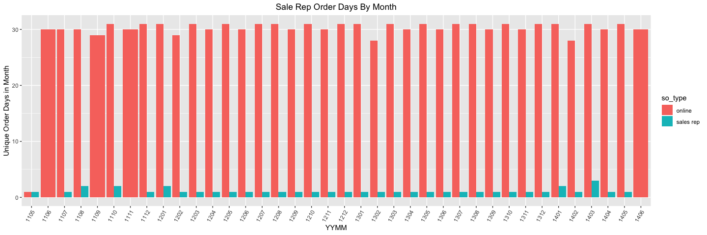
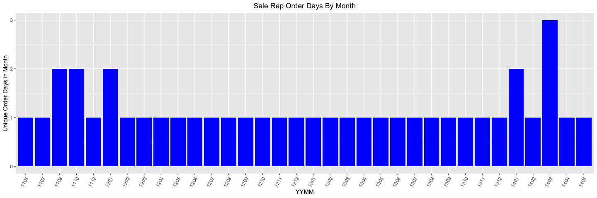
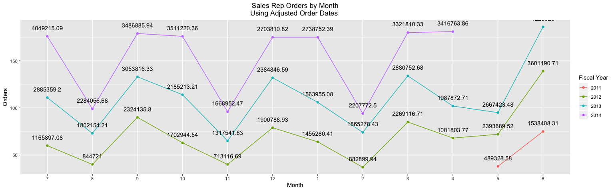
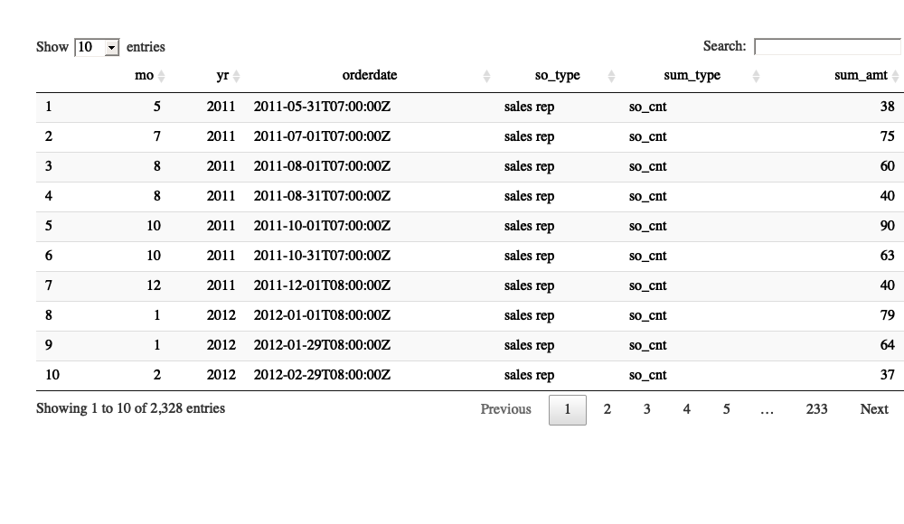
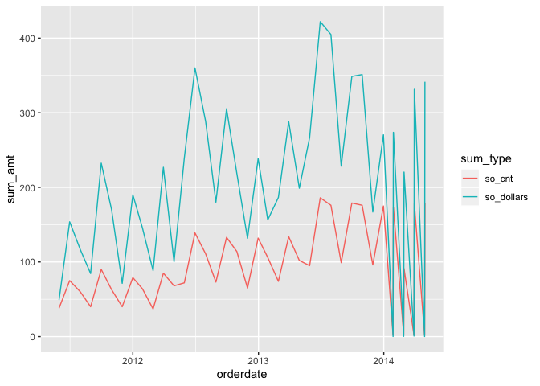

    sp_docker_start('adventureworks')
    # Sys.sleep(10)
    con <- sp_get_postgres_connection(
      host = "localhost",
      port = 5432,
      user = "postgres",
      password = "postgres",
      dbname = "adventureworks",
      seconds_to_test = 60, connection_tab = TRUE
    )

    ## <PqConnection> adventureworks@localhost:5432

Online Orders Versus Sales Rep Orders
=====================================

In a previous section, we examined how many orders are placed during the
month, the associated dollars associated with online orders versus sales
rep orders. In the next code block we look at the number of distinct
days associated with the online versus sales rep orders.

    mo_so_mo_dt_dist_sum <- dbGetQuery(con,
    "
    SELECT to_char(orderdate,'YYMM') yymm
         ,EXTRACT(YEAR FROM soh.orderdate) yr
         , EXTRACT(MONTH FROM soh.orderdate) mo 
    --     , EXTRACT(DAY FROM soh.orderdate) dd 
         , case when onlineorderflag then 'online' else 'sales rep' end so_type
         , COUNT(DISTINCT soh.orderdate) *1.0 unique_days
         , COUNT(*) so_cnt
         , sum(subtotal) so_dollars
      FROM sales.salesorderheader soh
    where 1 = 1 --not onlineorderflag
    group by to_char(orderdate,'YYMM') 
         , EXTRACT(MONTH FROM orderdate) 
         , EXTRACT(YEAR FROM orderdate)
         , case when onlineorderflag then 'online' else 'sales rep' end 
    --     , soh.orderdate
    ORDER BY to_char(orderdate,'YYMM')
    ")

    mo_so_mo_dt_dist_sum

    ##    yymm   yr mo   so_type unique_days so_cnt   so_dollars
    ## 1  1105 2011  5    online           1      5   14477.3382
    ## 2  1105 2011  5 sales rep           1     38  489328.5787
    ## 3  1106 2011  6    online          30    141  458910.8248
    ## 4  1107 2011  7    online          30    156  506191.6912
    ## 5  1107 2011  7 sales rep           1     75 1538408.3122
    ## 6  1108 2011  8    online          30    150  485198.6594
    ## 7  1108 2011  8 sales rep           2    100 2010618.0741
    ## 8  1109 2011  9    online          29    157  502073.8458
    ## 9  1110 2011 10    online          31    174  561681.4758
    ## 10 1110 2011 10 sales rep           2    153 4027080.3402
    ## 11 1111 2011 11    online          30    230  737839.8214
    ## 12 1112 2011 12    online          31    188  596746.5568
    ## 13 1112 2011 12 sales rep           1     40  713116.6943
    ## 14 1201 2012  1    online          31    193  614557.9350
    ## 15 1201 2012  1 sales rep           2    143 3356069.3440
    ## 16 1202 2012  2    online          29    182  592526.9676
    ## 17 1202 2012  2 sales rep           1     37  882899.9424
    ## 18 1203 2012  3    online          31    219  706631.5268
    ## 19 1203 2012  3 sales rep           1     85 2269116.7117
    ## 20 1204 2012  4    online          30    201  632797.0314
    ## 21 1204 2012  4 sales rep           1     68 1001803.7670
    ## 22 1205 2012  5    online          31    221  680913.2906
    ## 23 1205 2012  5 sales rep           1     72 2393689.5232
    ## 24 1206 2012  6    online          30    251  498163.6436
    ## 25 1206 2012  6 sales rep           1    139 3601190.7136
    ## 26 1207 2012  7    online          31    274  532594.6708
    ## 27 1207 2012  7 sales rep           1    111 2885359.1991
    ## 28 1208 2012  8    online          31    212  373483.0054
    ## 29 1208 2012  8 sales rep           1     73 1802154.2126
    ## 30 1209 2012  9    online          30    219  400335.6145
    ## 31 1209 2012  9 sales rep           1    133 3053816.3260
    ## 32 1210 2012 10    online          31    207  358877.8907
    ## 33 1210 2012 10 sales rep           1    114 2185213.2149
    ## 34 1211 2012 11    online          30    318  555160.1428
    ## 35 1211 2012 11 sales rep           1     65 1317541.8334
    ## 36 1212 2012 12    online          31    246  444558.2281
    ## 37 1212 2012 12 sales rep           1    132 2384846.5908
    ## 38 1301 2013  1    online          31    294  523917.3815
    ## 39 1301 2013  1 sales rep           1    106 1563955.0808
    ## 40 1302 2013  2    online          28    251  451643.7176
    ## 41 1302 2013  2 sales rep           1     74 1865278.4340
    ## 42 1303 2013  3    online          31    307  531316.2871
    ## 43 1303 2013  3 sales rep           1    134 2880752.6805
    ## 44 1304 2013  4    online          30    326  544393.2060
    ## 45 1304 2013  4 sales rep           1    102 1987872.7063
    ## 46 1305 2013  5    online          31    333  578200.2778
    ## 47 1305 2013  5 sales rep           1     95 2667423.4773
    ## 48 1306 2013  6    online          30    533  860141.1300
    ## 49 1306 2013  6 sales rep           1    186 4220928.0019
    ## 50 1307 2013  7    online          31   1564  847138.6500
    ## 51 1307 2013  7 sales rep           1    176 4049215.0886
    ## 52 1308 2013  8    online          31   1690 1049907.3900
    ## 53 1308 2013  8 sales rep           1     99 2284056.6777
    ## 54 1309 2013  9    online          30   1612 1046022.7700
    ## 55 1309 2013  9 sales rep           1    179 3486885.9354
    ## 56 1310 2013 10    online          31   1792 1284592.9300
    ## 57 1310 2013 10 sales rep           1    176 3511220.3598
    ## 58 1311 2013 11    online          30   2007 1643177.7800
    ## 59 1311 2013 11 sales rep           1     96 1668952.4657
    ## 60 1312 2013 12    online          31   1875 1371675.8100
    ## 61 1312 2013 12 sales rep           1    175 2703810.8157
    ## 62 1401 2014  1    online          31   1966 1551065.5600
    ## 63 1401 2014  1 sales rep           2    175 2738752.3914
    ## 64 1402 2014  2    online          28   1753 1334494.3900
    ## 65 1402 2014  2 sales rep           1      3    3230.6456
    ## 66 1403 2014  3    online          31   2128 1691178.9100
    ## 67 1403 2014  3 sales rep           3    271 5526352.1820
    ## 68 1404 2014  4    online          30   2113 1795889.1300
    ## 69 1404 2014  4 sales rep           1      2    1284.7930
    ## 70 1405 2014  5    online          31   2232 1951195.9000
    ## 71 1405 2014  5 sales rep           1    179 3415479.0693
    ## 72 1406 2014  6    online          30    939   49005.8400

    ggplot(data=mo_so_mo_dt_dist_sum,aes(x=yymm,y=unique_days,fill=so_type)) +
      geom_col(position='dodge') +
      xlab("YYMM") +
      ylab("Unique Order Days in Month") +
      ggtitle("Sale Rep Order Days By Month") +
      theme(plot.title = element_text(hjust = 0.5)) +           # Center ggplot title
      theme(axis.text.x=element_text(angle=60, hjust=1))

The online orders are placed through out the month as one would expect.
However, there are a number of months where the company had a 0 on-line
order day. Are these associated with possible maintenance or
scheduled/unscheduled downtimes. What is going on with the salesreps?
They are placing orders on less than five days out of each month.

Sales Rep Orderdate Distribution
================================

    mo_so_mo_dt_dist_sum <- dbGetQuery(con,
    "
    SELECT to_char(orderdate,'YYMM') yymm
         ,EXTRACT(YEAR FROM soh.orderdate) yr
         , EXTRACT(MONTH FROM soh.orderdate) mo 
    --     , EXTRACT(DAY FROM soh.orderdate) dd 
         , COUNT(DISTINCT soh.orderdate) *1.0 unique_days
         , COUNT(*) so_cnt
         , sum(subtotal) so_dollars
      FROM sales.salesorderheader soh
    where not onlineorderflag
    group by to_char(orderdate,'YYMM') 
         , EXTRACT(MONTH FROM orderdate) 
         , EXTRACT(YEAR FROM orderdate)
    --     , soh.orderdate
    ORDER BY to_char(orderdate,'YYMM')
    ")

    mo_so_mo_dt_dist_sum

    ##    yymm   yr mo unique_days so_cnt   so_dollars
    ## 1  1105 2011  5           1     38  489328.5787
    ## 2  1107 2011  7           1     75 1538408.3122
    ## 3  1108 2011  8           2    100 2010618.0741
    ## 4  1110 2011 10           2    153 4027080.3402
    ## 5  1112 2011 12           1     40  713116.6943
    ## 6  1201 2012  1           2    143 3356069.3440
    ## 7  1202 2012  2           1     37  882899.9424
    ## 8  1203 2012  3           1     85 2269116.7117
    ## 9  1204 2012  4           1     68 1001803.7670
    ## 10 1205 2012  5           1     72 2393689.5232
    ## 11 1206 2012  6           1    139 3601190.7136
    ## 12 1207 2012  7           1    111 2885359.1991
    ## 13 1208 2012  8           1     73 1802154.2126
    ## 14 1209 2012  9           1    133 3053816.3260
    ## 15 1210 2012 10           1    114 2185213.2149
    ## 16 1211 2012 11           1     65 1317541.8334
    ## 17 1212 2012 12           1    132 2384846.5908
    ## 18 1301 2013  1           1    106 1563955.0808
    ## 19 1302 2013  2           1     74 1865278.4340
    ## 20 1303 2013  3           1    134 2880752.6805
    ## 21 1304 2013  4           1    102 1987872.7063
    ## 22 1305 2013  5           1     95 2667423.4773
    ## 23 1306 2013  6           1    186 4220928.0019
    ## 24 1307 2013  7           1    176 4049215.0886
    ## 25 1308 2013  8           1     99 2284056.6777
    ## 26 1309 2013  9           1    179 3486885.9354
    ## 27 1310 2013 10           1    176 3511220.3598
    ## 28 1311 2013 11           1     96 1668952.4657
    ## 29 1312 2013 12           1    175 2703810.8157
    ## 30 1401 2014  1           2    175 2738752.3914
    ## 31 1402 2014  2           1      3    3230.6456
    ## 32 1403 2014  3           3    271 5526352.1820
    ## 33 1404 2014  4           1      2    1284.7930
    ## 34 1405 2014  5           1    179 3415479.0693

    ggplot(data=mo_so_mo_dt_dist_sum,aes(x=yymm,y=unique_days)) +
      geom_col(fill = 'blue') +
      xlab("YYMM") +
      ylab("Unique Order Days in Month") +
      ggtitle("Sale Rep Order Days By Month") +
      theme(plot.title = element_text(hjust = 0.5)) +           # Center ggplot title
      theme(axis.text.x=element_text(angle=60, hjust=1))

That is unexpected. A couple of things immediately jump out from the
first page of data:

-   July, September, and November are missing for 2011.
-   Most of the sales reps’ orders are entered on a single day of the
    month, unique days = 1. It is possible that these are monthly
    recurring orders that get released on a given day of the month. If
    that is the case, what are the sales reps doing the rest of the
    month?
-   The lines with multiple days, unique\_days &gt; 1, have a noticeable
    higher number of orders, so\_cnt, and associated so dollars.

The plot clearly shows that two months with multiple sales rep order
days for 2011, (1108 and 1110), one for 2012, (1201), and two in 2014,
(1401 and 1403). The 1403 is the only three day sales rep order month.

In the next code block, we flesh out the dates associatd with the sales
reps’ orders. Since 4 out of the 5 months with multiple order days only
have two dates, the code block captures them with a min/max orderdate.

    mo_so_mo_dt_dist_sum <- dbGetQuery(con,
    "
    SELECT EXTRACT(YEAR FROM soh.orderdate) yr
         , EXTRACT(MONTH FROM soh.orderdate) mo
    --     , EXTRACT(DOW FROM soh.orderdate) dow
    --     , case when onlineorderflag then 'online' else 'sales rep' end so_type
         , COUNT(*) so_cnt
         , sum(subtotal) so_dollars
         , min(soh.orderdate) min_dt
         , max(soh.orderdate) max_dt
         , EXTRACT(DAY FROM max(soh.orderdate)) - EXTRACT(DAY FROM min(soh.orderdate)) + 1 days
         , count(distinct soh.orderdate) unique_days
      FROM sales.salesorderheader soh
     where not onlineorderflag
    group by EXTRACT(YEAR FROM orderdate)  
         , EXTRACT(MONTH FROM orderdate)
    --     , EXTRACT(DOW FROM soh.orderdate) 
         , case when onlineorderflag then 'online' else 'sales rep' end
    order by yr, mo
    ")
    mo_so_mo_dt_dist_sum

    ##      yr mo so_cnt   so_dollars     min_dt     max_dt days unique_days
    ## 1  2011  5     38  489328.5787 2011-05-31 2011-05-31    1           1
    ## 2  2011  7     75 1538408.3122 2011-07-01 2011-07-01    1           1
    ## 3  2011  8    100 2010618.0741 2011-08-01 2011-08-31   31           2
    ## 4  2011 10    153 4027080.3402 2011-10-01 2011-10-31   31           2
    ## 5  2011 12     40  713116.6943 2011-12-01 2011-12-01    1           1
    ## 6  2012  1    143 3356069.3440 2012-01-01 2012-01-29   29           2
    ## 7  2012  2     37  882899.9424 2012-02-29 2012-02-29    1           1
    ## 8  2012  3     85 2269116.7117 2012-03-30 2012-03-30    1           1
    ## 9  2012  4     68 1001803.7670 2012-04-30 2012-04-30    1           1
    ## 10 2012  5     72 2393689.5232 2012-05-30 2012-05-30    1           1
    ## 11 2012  6    139 3601190.7136 2012-06-30 2012-06-30    1           1
    ## 12 2012  7    111 2885359.1991 2012-07-31 2012-07-31    1           1
    ## 13 2012  8     73 1802154.2126 2012-08-30 2012-08-30    1           1
    ## 14 2012  9    133 3053816.3260 2012-09-30 2012-09-30    1           1
    ## 15 2012 10    114 2185213.2149 2012-10-30 2012-10-30    1           1
    ## 16 2012 11     65 1317541.8334 2012-11-30 2012-11-30    1           1
    ## 17 2012 12    132 2384846.5908 2012-12-31 2012-12-31    1           1
    ## 18 2013  1    106 1563955.0808 2013-01-28 2013-01-28    1           1
    ## 19 2013  2     74 1865278.4340 2013-02-28 2013-02-28    1           1
    ## 20 2013  3    134 2880752.6805 2013-03-30 2013-03-30    1           1
    ## 21 2013  4    102 1987872.7063 2013-04-30 2013-04-30    1           1
    ## 22 2013  5     95 2667423.4773 2013-05-30 2013-05-30    1           1
    ## 23 2013  6    186 4220928.0019 2013-06-30 2013-06-30    1           1
    ## 24 2013  7    176 4049215.0886 2013-07-31 2013-07-31    1           1
    ## 25 2013  8     99 2284056.6777 2013-08-30 2013-08-30    1           1
    ## 26 2013  9    179 3486885.9354 2013-09-30 2013-09-30    1           1
    ## 27 2013 10    176 3511220.3598 2013-10-30 2013-10-30    1           1
    ## 28 2013 11     96 1668952.4657 2013-11-30 2013-11-30    1           1
    ## 29 2013 12    175 2703810.8157 2013-12-31 2013-12-31    1           1
    ## 30 2014  1    175 2738752.3914 2014-01-28 2014-01-29    2           2
    ## 31 2014  2      3    3230.6456 2014-02-28 2014-02-28    1           1
    ## 32 2014  3    271 5526352.1820 2014-03-01 2014-03-31   31           3
    ## 33 2014  4      2    1284.7930 2014-04-30 2014-04-30    1           1
    ## 34 2014  5    179 3415479.0693 2014-05-01 2014-05-01    1           1

    # so_rep_dist <- mo_so_mo_dt_dist_sum %>% filter (unique_days > 1)
    # so_rep_dist

Looking at the min-max dt columns, most sales rep orders are entered on
or near the last day of the month and or the first day of the month.

Looking at 2011 we see an entry for May, but not June. However, July
only has an entry 7-1, but not a 7-31 entry. Perhaps the missing 6-30
entry is actually the 7-1 entry. If the 7-1 is really the 6-30 entry,
then the same pattern would make the 8-1 entry, the real 7-31 entry.
There is no 9-31 entry, but there is a 10-1 and a 10-31 entry. The same
patterns adjustment has the 10-1 entry for the missing 9-31 entry. The
same adjustment pattern holds for the missing 11-30 entry is the 12-1-29
entries.

The next code block shows the details associated with the sales rep
orders with multiple order days.

    mo_so_mo_dt_dist_xdays <- dbGetQuery(con,
    "
    SELECT to_char(orderdate,'YYMM') yymm
         ,soh.orderdate
         , COUNT(DISTINCT soh.orderdate) *1.0 unique_days
         , COUNT(*) so_cnt
         , sum(subtotal) so_dollars
      FROM sales.salesorderheader soh
    where not onlineorderflag
      and to_char(orderdate,'YYMM') in ('1108','1110','1201','1401','1403')
    group by to_char(orderdate,'YYMM') 
         , soh.orderdate
    ORDER BY soh.orderdate
    ")
    mo_so_mo_dt_dist_xdays

    ##    yymm  orderdate unique_days so_cnt   so_dollars
    ## 1  1108 2011-08-01           1     60 1165897.0778
    ## 2  1108 2011-08-31           1     40  844720.9963
    ## 3  1110 2011-10-01           1     90 2324135.7975
    ## 4  1110 2011-10-31           1     63 1702944.5427
    ## 5  1201 2012-01-01           1     79 1900788.9304
    ## 6  1201 2012-01-29           1     64 1455280.4136
    ## 7  1401 2014-01-28           1      2    1564.7840
    ## 8  1401 2014-01-29           1    173 2737187.6074
    ## 9  1403 2014-03-01           1     91 2204541.8477
    ## 10 1403 2014-03-30           1      2    7291.1144
    ## 11 1403 2014-03-31           1    178 3314519.2199

Adjusted Sales Rep Order Dates
==============================

In the next code block, the orders entered on the first of the month are
adjusted backwards one day to put them in the prior month.

    x <- dbGetQuery(con,
    "
    select to_char(orderdate_adj,'YYMM') yymm
          ,YR_adj yr,mo_adj mo
          ,sales_type
          ,sum(so_cnt) so_cnt
          ,sum(so_dollars) so_dollars
      from (
    SELECT EXTRACT(YEAR FROM soh.orderdate) yr
         , EXTRACT(MONTH FROM soh.orderdate) mo
         , EXTRACT(DAY FROM soh.orderdate) dd
         , case when EXTRACT(DAY FROM soh.orderdate) = 1
                THEN  soh.orderdate - '1 day'::interval
                ELSE  soh.orderdate
           END AS orderdate_adj
         , case when EXTRACT(DAY FROM soh.orderdate) = 1
                THEN EXTRACT(YEAR FROM soh.orderdate - '1 day'::interval)
                ELSE  EXTRACT(YEAR FROM soh.orderdate) 
           END AS YR_adj

         , case when EXTRACT(DAY FROM soh.orderdate) = 1
                THEN EXTRACT(MONTH FROM soh.orderdate - '1 day'::interval)
                ELSE EXTRACT(MONTH FROM soh.orderdate) 
           END mo_adj
         , case when EXTRACT(DAY FROM soh.orderdate) = 1
                THEN EXTRACT(DAY FROM soh.orderdate - '1 day'::interval)
                ELSE EXTRACT(DAY FROM soh.orderdate) 
           END dd_adj
         , COUNT(*) * 1.0 so_cnt 
         , sum(subtotal) so_dollars
         , min(soh.orderdate) min_dt
         , max(soh.orderdate) max_dt
         , EXTRACT(DAY FROM max(soh.orderdate)) - EXTRACT(DAY FROM min(soh.orderdate)) + 1 days
         , count(distinct soh.orderdate) unique_days
         , case when soh.onlineorderflag then 'online' else 'sales rep' end sales_type
      FROM sales.salesorderheader soh
     where not onlineorderflag
    group by EXTRACT(YEAR FROM soh.orderdate)
         , EXTRACT(MONTH FROM soh.orderdate)
         , EXTRACT(DAY FROM soh.orderdate)
         , case when EXTRACT(DAY FROM soh.orderdate) = 1
                THEN  soh.orderdate - '1 day'::interval
                ELSE  soh.orderdate
           END
         , case when EXTRACT(DAY FROM soh.orderdate) = 1
                THEN EXTRACT(YEAR FROM soh.orderdate - '1 day'::interval)
                ELSE  EXTRACT(YEAR FROM soh.orderdate) 
           END
         , case when EXTRACT(DAY FROM soh.orderdate) = 1
                THEN EXTRACT(MONTH FROM soh.orderdate - '1 day'::interval)
                ELSE EXTRACT(MONTH FROM soh.orderdate) 
           END
         , case when EXTRACT(DAY FROM soh.orderdate) = 1
                THEN EXTRACT(DAY FROM soh.orderdate - '1 day'::interval)
                ELSE EXTRACT(DAY FROM soh.orderdate) 
           END
         , case when onlineorderflag then 'online' else 'sales rep' end
    ) as src
    group by yymm,YR_adj ,mo_adj ,sales_type
    ORDER BY mo, yr, sales_type
    ")
    x

    ##    yymm   yr mo sales_type so_cnt   so_dollars
    ## 1  1201 2012  1  sales rep     64 1455280.4136
    ## 2  1301 2013  1  sales rep    106 1563955.0808
    ## 3  1401 2014  1  sales rep    175 2738752.3914
    ## 4  1202 2012  2  sales rep     37  882899.9424
    ## 5  1302 2013  2  sales rep     74 1865278.4340
    ## 6  1402 2014  2  sales rep     94 2207772.4933
    ## 7  1203 2012  3  sales rep     85 2269116.7117
    ## 8  1303 2013  3  sales rep    134 2880752.6805
    ## 9  1403 2014  3  sales rep    180 3321810.3343
    ## 10 1204 2012  4  sales rep     68 1001803.7670
    ## 11 1304 2013  4  sales rep    102 1987872.7063
    ## 12 1404 2014  4  sales rep    181 3416763.8623
    ## 13 1105 2011  5  sales rep     38  489328.5787
    ## 14 1205 2012  5  sales rep     72 2393689.5232
    ## 15 1305 2013  5  sales rep     95 2667423.4773
    ## 16 1106 2011  6  sales rep     75 1538408.3122
    ## 17 1206 2012  6  sales rep    139 3601190.7136
    ## 18 1306 2013  6  sales rep    186 4220928.0019
    ## 19 1107 2011  7  sales rep     60 1165897.0778
    ## 20 1207 2012  7  sales rep    111 2885359.1991
    ## 21 1307 2013  7  sales rep    176 4049215.0886
    ## 22 1108 2011  8  sales rep     40  844720.9963
    ## 23 1208 2012  8  sales rep     73 1802154.2126
    ## 24 1308 2013  8  sales rep     99 2284056.6777
    ## 25 1109 2011  9  sales rep     90 2324135.7975
    ## 26 1209 2012  9  sales rep    133 3053816.3260
    ## 27 1309 2013  9  sales rep    179 3486885.9354
    ## 28 1110 2011 10  sales rep     63 1702944.5427
    ## 29 1210 2012 10  sales rep    114 2185213.2149
    ## 30 1310 2013 10  sales rep    176 3511220.3598
    ## 31 1111 2011 11  sales rep     40  713116.6943
    ## 32 1211 2012 11  sales rep     65 1317541.8334
    ## 33 1311 2013 11  sales rep     96 1668952.4657
    ## 34 1112 2011 12  sales rep     79 1900788.9304
    ## 35 1212 2012 12  sales rep    132 2384846.5908
    ## 36 1312 2013 12  sales rep    175 2703810.8157

    x$yymm <- as.factor(x$yymm)
    x$mo <- as.factor(x$mo)
    x$yr <- as.factor(x$yr)

    #  x$sales_type <- as.factor(mo_onl_pct$sales_type)
    mo_2011 <- x %>% filter (yr == 2011)
    mo_2012 <- x %>% filter (yr == 2012)
    mo_2013 <- x %>% filter (yr == 2013)
    mo_2014 <- x %>% filter (yr == 2014)

    ggplot(data=NULL) +
      # data=mo_2011 first results in the x axis months out of order.
      geom_line (data=mo_2012,aes(x=mo,y=so_cnt,color = yr,group = sales_type)) +
      geom_line (data=mo_2011,aes(x=mo,y=so_cnt,color = yr,group = sales_type)) +
      geom_line (data=mo_2013,aes(x=mo,y=so_cnt,color = yr,group = sales_type)) +
      geom_line (data=mo_2014,aes(x=mo,y=so_cnt,color = yr,group = sales_type)) +
      
      geom_point(data=mo_2011,aes(x=mo,y=so_cnt,color = sales_type)) +  
      geom_point(data=mo_2012,aes(x=mo,y=so_cnt,color = sales_type)) +
      geom_point(data=mo_2013,aes(x=mo,y=so_cnt,color = sales_type)) +
      geom_point(data=mo_2014,aes(x=mo,y=so_cnt,color = sales_type)) +
      
      xlab("Month") + 
      ylab("Sales Rep") +
      theme(plot.title = element_text(hjust = .50)) +  
      ggtitle(paste("Sales Rep Orders by Month"))

Sales Rep Orders By Fiscal Year
-------------------------------

    SalesRepOrders_Fiscal_Year <- dbGetQuery(con,
    "
    select to_char(orderdate_adj,'YYMM') yymm
          ,fiscalyear_adj
          ,YR_adj yr,mo_adj mo
          ,sales_type
          ,sum(so_cnt) so_cnt
          ,sum(so_dollars) so_dollars
      from (
    SELECT date_part('year'::text, soh.orderdate + '6 mons'::interval) AS fiscalyear
         , EXTRACT(YEAR FROM soh.orderdate) yr
         , EXTRACT(MONTH FROM soh.orderdate) mo
         , EXTRACT(DAY FROM soh.orderdate) dd
         , date_part('year'::text,case when EXTRACT(DAY FROM soh.orderdate) = 1
                                       THEN  soh.orderdate - '1 day'::interval
                                       ELSE  soh.orderdate
                                  END+ '6 months'::interval) AS fiscalyear_adj 
         , case when EXTRACT(DAY FROM soh.orderdate) = 1
                THEN  soh.orderdate - '1 day'::interval
                ELSE  soh.orderdate
           END AS orderdate_adj
         , case when EXTRACT(DAY FROM soh.orderdate) = 1
                THEN EXTRACT(YEAR FROM soh.orderdate - '1 day'::interval)
                ELSE  EXTRACT(YEAR FROM soh.orderdate) 
           END AS YR_adj

         , case when EXTRACT(DAY FROM soh.orderdate) = 1
                THEN EXTRACT(MONTH FROM soh.orderdate - '1 day'::interval)
                ELSE EXTRACT(MONTH FROM soh.orderdate) 
           END mo_adj
         , case when EXTRACT(DAY FROM soh.orderdate) = 1
                THEN EXTRACT(DAY FROM soh.orderdate - '1 day'::interval)
                ELSE EXTRACT(DAY FROM soh.orderdate) 
           END dd_adj
         , COUNT(*) * 1.0 so_cnt 
         , ROUND(sum(subtotal),2) so_dollars
         , min(soh.orderdate) min_dt
         , max(soh.orderdate) max_dt
         , EXTRACT(DAY FROM max(soh.orderdate)) - EXTRACT(DAY FROM min(soh.orderdate)) + 1 days
         , count(distinct soh.orderdate) unique_days
         , case when soh.onlineorderflag then 'online' else 'sales rep' end sales_type
      FROM sales.salesorderheader soh
     where not onlineorderflag
    group by date_part('year'::text, soh.orderdate + '6 mons'::interval) 
         , EXTRACT(YEAR FROM soh.orderdate)
         , EXTRACT(MONTH FROM soh.orderdate)
         , EXTRACT(DAY FROM soh.orderdate)
         , date_part('year'::text,case when EXTRACT(DAY FROM soh.orderdate) = 1
                                       THEN  soh.orderdate - '1 day'::interval
                                       ELSE  soh.orderdate
                                  END+ '6 months'::interval)
         , case when EXTRACT(DAY FROM soh.orderdate) = 1
                THEN  soh.orderdate - '1 day'::interval
                ELSE  soh.orderdate
           END
         , case when EXTRACT(DAY FROM soh.orderdate) = 1
                THEN EXTRACT(YEAR FROM soh.orderdate - '1 day'::interval)
                ELSE  EXTRACT(YEAR FROM soh.orderdate) 
           END
         , case when EXTRACT(DAY FROM soh.orderdate) = 1
                THEN EXTRACT(MONTH FROM soh.orderdate - '1 day'::interval)
                ELSE EXTRACT(MONTH FROM soh.orderdate) 
           END
         , case when EXTRACT(DAY FROM soh.orderdate) = 1
                THEN EXTRACT(DAY FROM soh.orderdate - '1 day'::interval)
                ELSE EXTRACT(DAY FROM soh.orderdate) 
           END
         , case when onlineorderflag then 'online' else 'sales rep' end
    ) as src
    group by yymm,fiscalyear_adj,YR_adj ,mo_adj ,sales_type
    ORDER BY case when mo_adj > 6 then mo_adj - 6 else mo_adj + 6 end,fiscalyear_adj
    --ORDER BY fiscalyear_adj,case when mo_adj > 6 then mo_adj - 6 else mo_adj + 6 end
    --ORDER BY mo, yr, sales_type
    ")

    SalesRepOrders_Fiscal_Year$mo <- factor(SalesRepOrders_Fiscal_Year$mo,levels=c('7','8','9','10','11','12','1','2','3','4','5','6'))

    ggplot(data=SalesRepOrders_Fiscal_Year
           ,aes(x=mo,y=so_cnt,color=as.factor(fiscalyear_adj),group = as.factor(fiscalyear_adj))) + 
      geom_line() +
      geom_point() +
      geom_text(aes(x=mo,y=so_cnt,label=so_dollars)
               ,color = 'black'
               ,vjust = -1.5) +
      labs(color='Fiscal Year') +
      xlab("Month") + 
      ylab("Orders") +
      theme(plot.title = element_text(hjust = .50)) +  
      ggtitle(paste("Sales Rep Orders by Month\nUsing Adjusted Order Dates "))

    mo_so_mo_dt_dist_det <- dbGetQuery(con,
    "
    SELECT EXTRACT(MONTH FROM soh.orderdate) mo
         , EXTRACT(YEAR FROM soh.orderdate) yr
         , soh.orderdate
         , case when onlineorderflag then 'online' else 'sales rep' end so_type
         , sum(subtotal)/10000 so_dollars
         , COUNT(*) * 1.0 so_cnt
      FROM sales.salesorderheader soh
    group by EXTRACT(MONTH FROM orderdate) 
         , EXTRACT(YEAR FROM orderdate) 
         , case when onlineorderflag then 'online' else 'sales rep' end
         ,soh.orderdate
    order by case when onlineorderflag then 'online' else 'sales rep' end desc,soh.orderdate
    ")
    long <- gather(data=mo_so_mo_dt_dist_det,key='sum_type','sum_amt',so_cnt,so_dollars)
    sp_print_df(long)

    long_online <- long %>% filter(so_type == 'sales rep')

    ggplot(data = long_online, aes(x=orderdate,y=sum_amt,color=sum_type)) +
      geom_line() 

