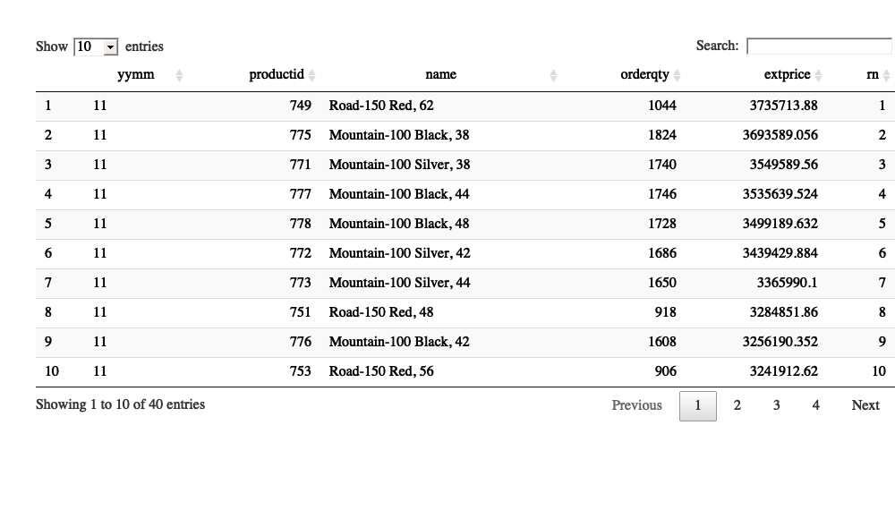
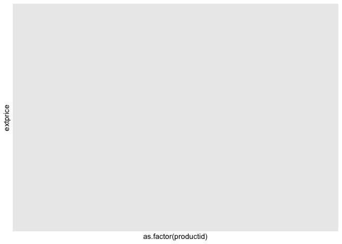
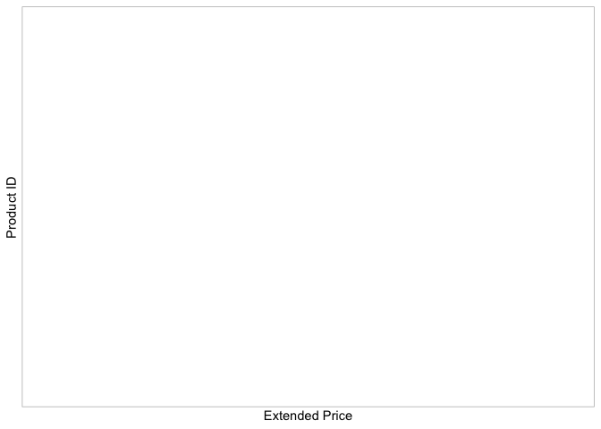
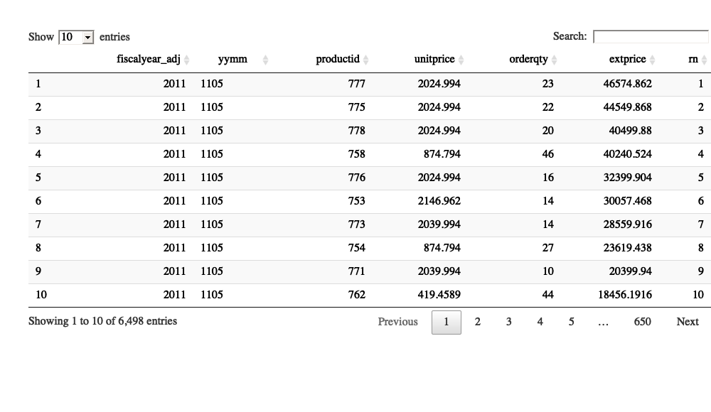

    sp_docker_start('adventureworks')
    # Sys.sleep(10)
    con <- sp_get_postgres_connection(
      host = "localhost",
      port = 5432,
      user = "postgres",
      password = "postgres",
      dbname = "adventureworks",
      seconds_to_test = 60, connection_tab = TRUE
    )

    ## <PqConnection> adventureworks@localhost:5432

    top10_products_by_month <- dbGetQuery(con,
    "
    select yymm
          ,productid,name
          ,orderqty
          ,extprice 
          ,rn
      from (
    select date_part('year'::text,case when EXTRACT(DAY FROM soh.orderdate) = 1
                                       THEN  soh.orderdate - '1 day'::interval
                                       ELSE  soh.orderdate
                                  END+ '6 months'::interval) AS fiscalyear_adj 
          ,to_char(case when EXTRACT(DAY FROM soh.orderdate) = 1 THEN  soh.orderdate - '1 day'::interval ELSE soh.orderdate END,'YY') AS YYMM
          ,sod.productid,name
          ,unitprice
          ,sum(orderqty) orderqty,sum(unitprice*orderqty) extprice 
          ,ROW_NUMBER () OVER (PARTITION BY to_char(case when EXTRACT(DAY FROM soh.orderdate) = 1 
                                                         THEN soh.orderdate - '1 day'::interval 
                                                         ELSE soh.orderdate 
                                                    END,'YY')
                               ORDER BY sum(unitprice*orderqty) desc) rn
      from sales.salesorderheader soh,sales.salesorderdetail sod, production.vproductanddescription p
     where soh.salesorderid = sod.salesorderid
       and sod.productid = p.productid 
    group by date_part('year'::text,case when EXTRACT(DAY FROM soh.orderdate) = 1
                                       THEN  soh.orderdate - '1 day'::interval
                                       ELSE  soh.orderdate
                                  END+ '6 months'::interval)
            ,to_char(case when EXTRACT(DAY FROM soh.orderdate) = 1 THEN  soh.orderdate - '1 day'::interval ELSE soh.orderdate END,'YY')
            ,sod.productid,name
            ,unitprice
    ) as src
    where rn <= 10
    order by yymm, extprice desc 
    ")
    # View(top10_products_by_month)
    sp_print_df(top10_products_by_month)

    x <- top10_products_by_month %>% filter(yymm %in% c('1105'))
    ggplot(data=x,aes(x=as.factor(productid),y=extprice))+
      geom_col()  

    ggplot(data=x,aes(x=extprice,y=reorder(productid,extprice)) ) +
      geom_point() +
      theme_light() +
      theme(panel.grid.major.x = element_blank()
           ,panel.grid.minor.x = element_blank()
           ,panel.grid.minor.y = element_line(color='grey60',linetype = 'dashed')
           ) +
      xlab('Extended Price') +
      ylab('Product ID') 

    x <- dbGetQuery(con,
    "
    select date_part('year'::text,case when EXTRACT(DAY FROM soh.orderdate) = 1
                                       THEN  soh.orderdate - '1 day'::interval
                                       ELSE  soh.orderdate
                                  END+ '6 months'::interval) AS fiscalyear_adj 
          ,to_char(case when EXTRACT(DAY FROM soh.orderdate) = 1 THEN  soh.orderdate - '1 day'::interval ELSE soh.orderdate END,'YYMM') AS YYMM
          ,productid
          ,unitprice
          ,sum(orderqty) orderqty,sum(unitprice*orderqty) extprice 
          ,ROW_NUMBER () OVER (PARTITION BY to_char(case when EXTRACT(DAY FROM soh.orderdate) = 1 
                                                         THEN soh.orderdate - '1 day'::interval 
                                                         ELSE soh.orderdate 
                                                    END,'YYMM')
                               ORDER BY sum(unitprice*orderqty) desc) rn
      from sales.salesorderheader soh,sales.salesorderdetail sod
     where soh.salesorderid = sod.salesorderid
    group by date_part('year'::text,case when EXTRACT(DAY FROM soh.orderdate) = 1
                                       THEN  soh.orderdate - '1 day'::interval
                                       ELSE  soh.orderdate
                                  END+ '6 months'::interval)
            ,to_char(case when EXTRACT(DAY FROM soh.orderdate) = 1 THEN  soh.orderdate - '1 day'::interval ELSE soh.orderdate END,'YYMM')
            ,productid
            ,unitprice
    order by yymm,rn
    ")
    # View(x)
    sp_print_df(x)

