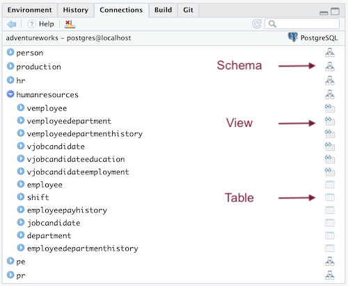
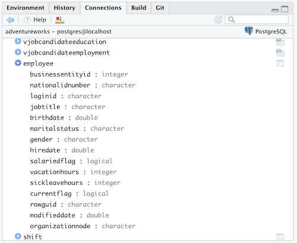

# Create and connect to the adventureworks database in PostgreSQL{#chapter_setup-adventureworks-db}

> This chapter demonstrates how to:
>
>  * Create and connect to the PostgreSQL `adventureworks` database in Docker
>  * Keep necessary credentials secret while being available to R when it executes.
>  * Leverage Rstudio features to get a peek at your data,
>  * Set up the environment for subsequent chapters

## Overview

Docker commands can be run from a terminal (e.g., the Rstudio Terminal pane) or with a `system2()` command.  The necessary functions to start, stop Docker containers and do other busy work are provided in the `sqlpetr` package.  

> Note: The functions in the package are designed to help you focus on interacting with a dbms from R.  You can ignore how they work until you are ready to delve into the details.  They are all named to begin with `sp_`.  The first time a function is called in the book, we provide a note explaining its use.


Please install the `sqlpetr` package if not already installed:

```r
library(devtools)
if (!require(sqlpetr)) {
    remotes::install_github(
      "smithjd/sqlpetr",
      force = TRUE, build = FALSE, quiet = TRUE)
}
```
Note that when you install this package the first time, it will ask you to update the packages it uses and that may take some time.

These packages are called in this Chapter:

```r
library(tidyverse)
library(DBI)
library(RPostgres)
library(glue)
require(knitr)
library(dbplyr)
library(sqlpetr)
library(bookdown)
library(here)
```

## Verify that Docker is up, running, and clean up if necessary

> The `sp_check_that_docker_is_up` function from the `sqlpetr` package checks whether Docker is up and running.  If it's not, then you need to install, launch or re-install Docker.


```r
sp_check_that_docker_is_up()
```

```
## [1] "Docker is up but running no containers"
```

## Clean up if appropriate

Force-remove the `adventureworks` container if it was left over (e.g., from a prior runs):

```r
sp_docker_remove_container("adventureworks")
```

```
## [1] 0
```
## Build the adventureworks Docker image

Now we set up a "realistic" database named `adventureworks` in Docker. 

> NOTE: This chapter doesn't go into the details of *creating* or *restoring* the `adventureworks` database.  For more detail on what's going on behind the scenes, you can examine the step-by-step code in:
>
> ` source('book-src/restore-adventureworks-postgres-on-docker.R') `

 To save space here in the book, we've created a function
in `sqlpetr` to build this image, called *OUT OF DATE!!* [`sp_make_dvdrental_image`](https://smithjd.github.io/sqlpetr/reference/sp_make_dvdrental_image.html). Vignette [Building the `adventureworks` Docker Image
](https://smithjd.github.io/sqlpetr/articles/building-the-dvdrental-docker-image.html) describes the build process.

*Ignore the errors in the following step:

```r
# sp_make_dvdrental_image("postgres-dvdrental")
source(here("book-src", "restore-adventureworks-postgres-on-docker.R"))
```

```
## docker  run --detach  --name adventureworks --publish 5432:5432 --mount type=bind,source="/Users/jimtyhurst/src/r/sql-pet",target=/petdir postgres:11
```

## Run the adventureworks Docker Image

Now we can run the image in a container and connect to the database. To run the
image we use an `sqlpetr` function called *OUT OF DATE*  [`sp_pg_docker_run`](https://smithjd.github.io/sqlpetr/reference/sp_pg_docker_run.html)
For the rest of the book we will assume that you have a Docker container called
`adventureworks` that can be stopped and started.  In that sense each chapter in the book is independent.


```r
sp_docker_start("adventureworks")
```


## Connect to PostgreSQL with R

*CHECK for `sqlpetr` update!`  The `sp_make_simple_pg` function we called above created a container from the
`postgres:11` library image downloaded from Docker Hub. As part of the process, it set the password for the PostgreSQL database superuser `postgres` to the value 
"postgres".

For simplicity, we are using a weak password at this point and it's shown here 
and in the code in plain text. That is bad practice because user credentials 
should not be shared in open code like that.  A [subsequent chapter](#dbms-login)
demonstrates how to store and use credentials to access the DBMS so that they 
are kept private.

> The `sp_get_postgres_connection` function from the `sqlpetr` package gets a DBI connection string to a PostgreSQL database, waiting if it is not ready. This function connects to an instance of PostgreSQL and we assign it to a symbol, `con`, for subsequent use. The `connctions_tab = TRUE` parameter opens a connections tab that's useful for navigating a database.

> Note that we are using port *5439* for PostgreSQL inside the container and published to `localhost`. Why? If you have PostgreSQL already running on the host or another container, it probably claimed port 5432, since that's the default. So we need to use a different port for *our* PostgreSQL container.

Use the DBI package to connect to the `adventureworks` database in PostgreSQL.  Remember the settings discussion about [keeping passwords hidden][Pause for some security considerations]


```r
con <- sp_get_postgres_connection(
  host = "localhost",
  port = 5432,  # this version still using 5432!!!
  user = "postgres",
  password = "postgres",
  dbname = "adventureworks",
  seconds_to_test = 20, connection_tab = TRUE
)
```

## Investigate the database using Rstudio 

The Rstudio Connections tab shows that you are connected to Postgres and that the `adventureworks` database has a many schemas each of which has multiple tables in it:



Clicking on the icon to the left of a `schema` expands the list of `tables` and `views` in that `schema`.  Clicking on the `View` or `Table` icon opens up Rstudio's `View` pane to get a peek at the data:


The number of rows and columns shown in the View pane depends on the size of the window.

Back on the Rstudio Connections tab, clicking on the icon to the left of a `table` or `view` displays a list of columns and their corresponding data types:




Disconnect from the database:

```r
dbDisconnect(con)
```
## Stop and start to demonstrate persistence

Stop the container:

```r
sp_docker_stop("adventureworks")
sp_docker_containers_tibble()
```

```
## # A tibble: 0 x 0
```

When we stopped `adventureworks`, it no longer appeared in the tibble. But the
container is still there. `sp_docker_containers_tibble` by default only lists
the *running* containers. But we can use the `list_all` option and see it:


```r
sp_docker_containers_tibble(list_all = TRUE)
```

```
<<<<<<< HEAD
## # A tibble: 3 x 12
##   container_id image command created_at created ports status size  names
##   <chr>        <chr> <chr>   <chr>      <chr>   <chr> <chr>  <chr> <chr>
## 1 21053106fc9a post… docker… 2019-08-1… 28 sec… <NA>  Exite… 63B … adve…
## 2 f15839235dc7 memg… /usr/l… 2019-03-3… 4 mont… <NA>  Exite… 0B (… eleg…
## 3 a722c21a4228 coli… /bin/s… 2019-03-1… 4 mont… 0.0.… Exite… 134M… neo4r
=======
## # A tibble: 1 x 12
##   container_id image command created_at created ports status size  names
##   <chr>        <chr> <chr>   <chr>      <chr>   <chr> <chr>  <chr> <chr>
## 1 0105899fe547 post… docker… 2019-08-2… 16 sec… <NA>  Exite… 0B (… adve…
>>>>>>> b6501daaa228eb07c28ed412fb8e30891823ef72
## # … with 3 more variables: labels <chr>, mounts <chr>, networks <chr>
```


Restart the container and verify that the adventureworks tables are still there:

```r
sp_docker_start("adventureworks")
sp_docker_containers_tibble()
```

```
## # A tibble: 1 x 12
##   container_id image command created_at created ports status size  names
##   <chr>        <chr> <chr>   <chr>      <chr>   <chr> <chr>  <chr> <chr>
<<<<<<< HEAD
## 1 21053106fc9a post… docker… 2019-08-1… 30 sec… 0.0.… Up Le… 63B … adve…
=======
## 1 0105899fe547 post… docker… 2019-08-2… 17 sec… 0.0.… Up Le… 63B … adve…
>>>>>>> b6501daaa228eb07c28ed412fb8e30891823ef72
## # … with 3 more variables: labels <chr>, mounts <chr>, networks <chr>
```
Connect to the `adventureworks` database in PostgreSQL:

```r
con <- sp_get_postgres_connection(
  host = "localhost",
  port = 5432,
  user = "postgres",
  password = "postgres",
  dbname = "adventureworks",
  seconds_to_test = 30
)
```

The database is still there, in the same state as it was when it was originally built.

## Cleaning up

Always have R disconnect from the database when you're done.

```r
dbDisconnect(con)
```

Stop the `adventureworks` container:

```r
sp_docker_stop("adventureworks")
```
Show that the container still exists even though it's not running


```r
sp_show_all_docker_containers()
```

```
<<<<<<< HEAD
## CONTAINER ID        IMAGE                   COMMAND                  CREATED             STATUS                                PORTS                    NAMES
## 21053106fc9a        postgres:11             "docker-entrypoint.s…"   43 seconds ago      Exited (137) Less than a second ago                            adventureworks
## f15839235dc7        memgraph                "/usr/lib/memgraph/m…"   4 months ago        Exited (0) 4 months ago                                        elegant_mcclintock
## a722c21a4228        colinfay/neo4r-docker   "/bin/sh -c 'cd /hom…"   4 months ago        Exited (255) 4 months ago             0.0.0.0:8787->8787/tcp   neo4r
=======
## CONTAINER ID        IMAGE               COMMAND                  CREATED             STATUS                              PORTS               NAMES
## 0105899fe547        postgres:11         "docker-entrypoint.s…"   18 seconds ago      Exited (0) Less than a second ago                       adventureworks
>>>>>>> b6501daaa228eb07c28ed412fb8e30891823ef72
```

Next time, you can just use this command to start the container: 

> `sp_docker_start("adventureworks")`

And once stopped, the container can be removed with:

> `sp_check_that_docker_is_up("adventureworks")`

## Using the `adventureworks` container in the rest of the book

After this point in the book, we assume that Docker is up and that we can always start up our *adventureworks database* with:

> `sp_docker_start("adventureworks")`

