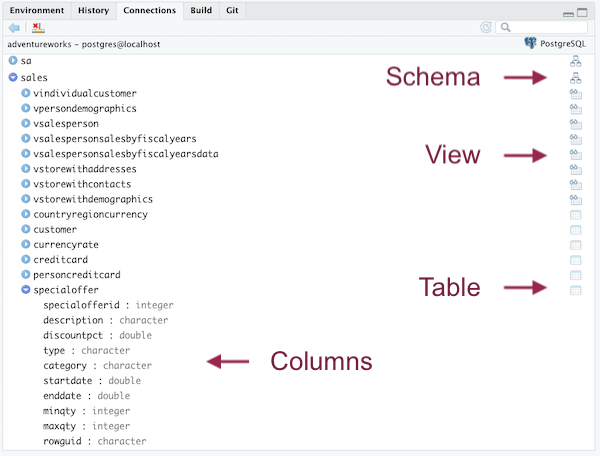
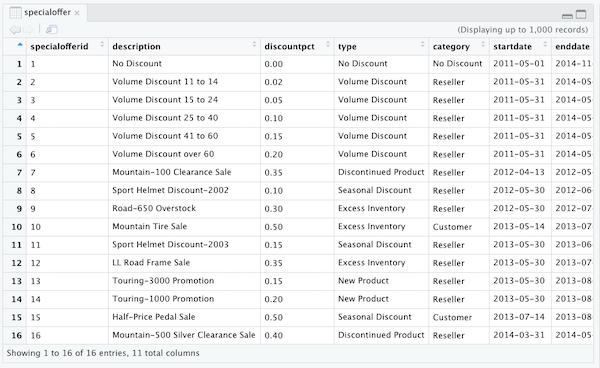

# Create and connect to the adventureworks database in PostgreSQL{#chapter_setup-adventureworks-db}

> This chapter demonstrates how to:
>
>  * Create and connect to the PostgreSQL `adventureworks` database in Docker
>  * Keep necessary credentials secret while being available to R when it executes.
>  * Leverage Rstudio features to get an overview of the database
>  * Set up the environment for subsequent chapters

## Overview

Docker commands can be run from a terminal (e.g., the Rstudio Terminal pane) or with a `system2()` command.  The necessary functions to start, stop Docker containers and do other busy work are provided in the `sqlpetr` package.  

> Note: The functions in the package are designed to help you focus on interacting with a dbms from R.  You can ignore how they work until you are ready to delve into the details.  They are all named to begin with `sp_`.  The first time a function is called in the book, we provide a note explaining its use.


Please install the `sqlpetr` package if not already installed:

```r
library(devtools)
if (!require(sqlpetr)) {
    remotes::install_github(
      "smithjd/sqlpetr",
      force = TRUE, build = FALSE, quiet = TRUE)
}
```
Note that when you install this package the first time, it will ask you to update the packages it uses and that may take some time.

These packages are called in this Chapter:

```r
library(tidyverse)
library(DBI)
library(RPostgres)
library(glue)
require(knitr)
library(dbplyr)
library(sqlpetr)
library(bookdown)
library(here)
```

## Verify that Docker is up, running, and clean up if necessary

> The `sp_check_that_docker_is_up` function from the `sqlpetr` package checks whether Docker is up and running.  If it's not, then you need to install, launch or re-install Docker.


```r
sp_check_that_docker_is_up()
```

```
## [1] "Docker is up but running no containers"
```

## Clean up if appropriate

Force-remove the `adventureworks` container if it was left over (e.g., from a prior runs):

```r
sp_docker_remove_container("adventureworks")
```

```
## [1] 0
```
## Build the adventureworks Docker image

Now we set up a "realistic" database named `adventureworks` in Docker. 

> NOTE: This chapter doesn't go into the details of *creating* or *restoring* the `adventureworks` database.  For more detail on what's going on behind the scenes, you can examine the step-by-step code in:
>
> ` source('book-src/restore-adventureworks-postgres-on-docker.R') `

 To save space here in the book, we've created a function
in `sqlpetr` to build this image, called *OUT OF DATE!!* . Vignette [Building the `adventureworks` Docker Image
](https://smithjd.github.io/sqlpetr/articles/building-the-dvdrental-docker-image.html) describes the build process.

*Ignore the errors in the following step:

```r
source(here("book-src", "restore-adventureworks-postgres-on-docker.R"))
```

```
## docker  run --detach  --name adventureworks --publish 5432:5432 --mount type=bind,source="/home/znmeb/Projects/sql-pet",target=/petdir postgres:11
```

## Run the adventureworks Docker Image

Now we can run the image in a container and connect to the database. To run the
image we use an `sqlpetr` function called *OUT OF DATE*  [`sp_pg_docker_run`](https://smithjd.github.io/sqlpetr/reference/sp_pg_docker_run.html)
For the rest of the book we will assume that you have a Docker container called
`adventureworks` that can be stopped and started.  In that sense each chapter in the book is independent.


```r
sp_docker_start("adventureworks")
```


## Connect to PostgreSQL

*CHECK for `sqlpetr` update!`  The `sp_make_simple_pg` function we called above created a container from the
`postgres:11` library image downloaded from Docker Hub. As part of the process, it set the password for the PostgreSQL database superuser `postgres` to the value 
"postgres".

For simplicity, we are using a weak password at this point and it's shown here 
and in the code in plain text. That is bad practice because user credentials 
should not be shared in open code like that.  A [subsequent chapter](#dbms-login)
demonstrates how to store and use credentials to access the DBMS so that they 
are kept private.

> The `sp_get_postgres_connection` function from the `sqlpetr` package gets a DBI connection string to a PostgreSQL database, waiting if it is not ready. This function connects to an instance of PostgreSQL and we assign it to a symbol, `con`, for subsequent use. The `connctions_tab = TRUE` parameter opens a connections tab that's useful for navigating a database.

> Note that we are using port *5439* for PostgreSQL inside the container and published to `localhost`. Why? If you have PostgreSQL already running on the host or another container, it probably claimed port 5432, since that's the default. So we need to use a different port for *our* PostgreSQL container.

Use the DBI package to connect to the `adventureworks` database in PostgreSQL.  Remember the settings discussion about [keeping passwords hidden][Pause for some security considerations]


```r
con <- sp_get_postgres_connection(
  host = "localhost",
  port = 5432,  # this version still using 5432!!!
  user = "postgres",
  password = "postgres",
  dbname = "adventureworks",
  seconds_to_test = 20, connection_tab = TRUE
)
```

## Adventureworks Schemas

Think of the Adventureworks database as a model of the Adventureworks business.  The business is organized around different departments (humanresources, sales, and purchasing), business processes (production), and resources (person).  Each schema is a container for the all the database objects needed to model the departments, business processes, and resources.  As a data analyst, the connections tab has three of the five database objects of interest.  These are schemas, tables and views.  The other two database objects of interest not shown in the connetions tab are the table primary and foreign keys, PK and FK.  Those database objects enforce the referential integrity of the data and the performance of the application.  Let the DBA's worry about them.

The Connections tab has three icons.  The node icon represents a schema.  The schema helps organize the structure and design of the database.  The schema contains the views, the grid with the glasses, and tables, the grids without the glasses, that are of interest to the data analyst.  A table is a database object usually represents something useful to a business process.  For example, a sales person may enter a new order.  The first screen is typically called the sales order header screen which contains information about the customer placing the order.  This information is captured in *salesorderheader* table.  The customers ordered items are typically entered via multiple screens.  These are captured in the *salesorderdetail* table.  

A view is a database object that maybe a subset of either the columns or rows of a single table.  For example, the customer table has information on all the customers, but the customer view, *c*, shows only a single customer.  

Or a view may have data from a primary/driving table and joined to other tables to provide a better understanding/view of the information in the primary table.  For example, the primary table typically has a primary key column, *PK*, and zero or more foreign key columns, *FK*.  The *PK* and *FK* are usually an integer which is great for a computer, but not so nice us mere mortals.  An extended view pulls information associated with the *FK*.  For example a sales order view a customer foreign key, can show the  actual customer name.


## Investigate the database using Rstudio 

The Rstudio Connections tab shows that you are connected to Postgres and that the `adventureworks` database has a many schemas each of which has multiple tables  and views in it.  The drop-down icon to the left of a table lists the table's columns.



Clicking on the icon to the left of a `schema` expands the list of `tables` and `views` in that `schema`.  Clicking on the `View` or `Table` icon opens up Rstudio's `View` pane to get a peek at the data:



The number of rows and columns shown in the View pane depends on the size of the window.

Disconnect from the database:

```r
dbDisconnect(con)
```

## Cleaning up

Always have R disconnect from the database when you're done.

```r
dbDisconnect(con)
```

```
## Warning in connection_release(conn@ptr): Already disconnected
```

Stop the `adventureworks` container:

```r
sp_docker_stop("adventureworks")
```
Show that the container still exists even though it's not running


```r
sp_show_all_docker_containers()
```

```
## CONTAINER ID        IMAGE               COMMAND                  CREATED             STATUS                              PORTS               NAMES
## ee0f6ee5a1cc        postgres:11         "docker-entrypoint.s…"   30 seconds ago      Exited (0) Less than a second ago                       adventureworks
## 8435d4b7ee78        znmeb/postgis       "docker-entrypoint.s…"   9 days ago          Exited (0) 8 days ago                                   containers_postgis_1
## da60e11b3727        6b2784b116df        "/bin/sh -c 'mkdir /…"   9 days ago          Exited (2) 9 days ago                                   condescending_carson
## 4bbb083cba07        443540ec5848        "/bin/sh -c 'R -e 'i…"   9 days ago          Exited (1) 9 days ago                                   trusting_euler
## 186b3ced7ad2        4ca242b1c323        "/bin/sh -c 'R -e 'i…"   9 days ago          Exited (1) 9 days ago                                   angry_varahamihira
## 010df0104f51        znmeb/pgadmin4      "/entrypoint.sh"         9 days ago          Exited (0) 8 days ago                                   containers_pgadmin4_1
```

Next time, you can just use this command to start the container: 

> `sp_docker_start("adventureworks")`

And once stopped, the container can be removed with:

> `sp_check_that_docker_is_up("adventureworks")`

## Using the `adventureworks` container in the rest of the book

After this point in the book, we assume that Docker is up and that we can always start up our *adventureworks database* with:

> `sp_docker_start("adventureworks")`

