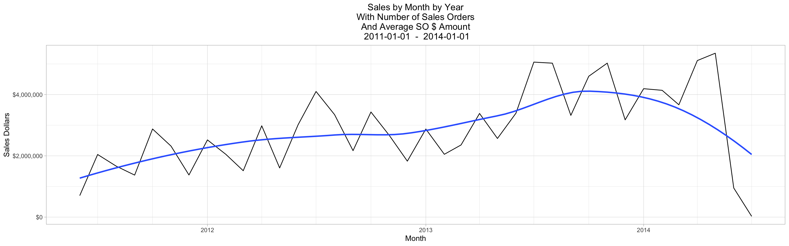
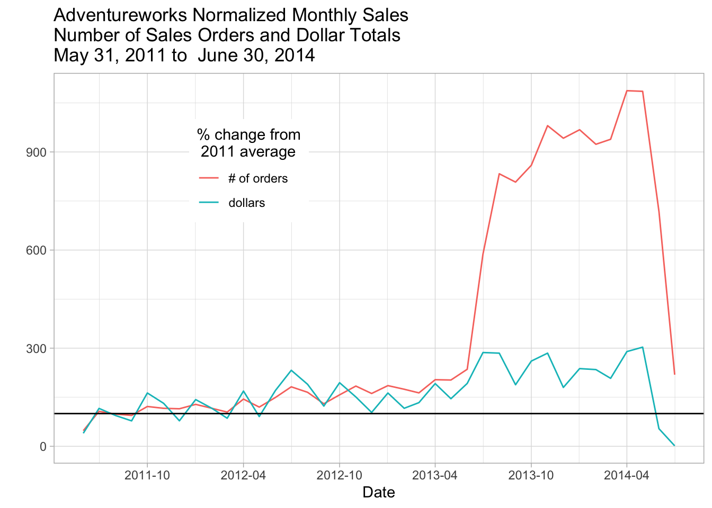
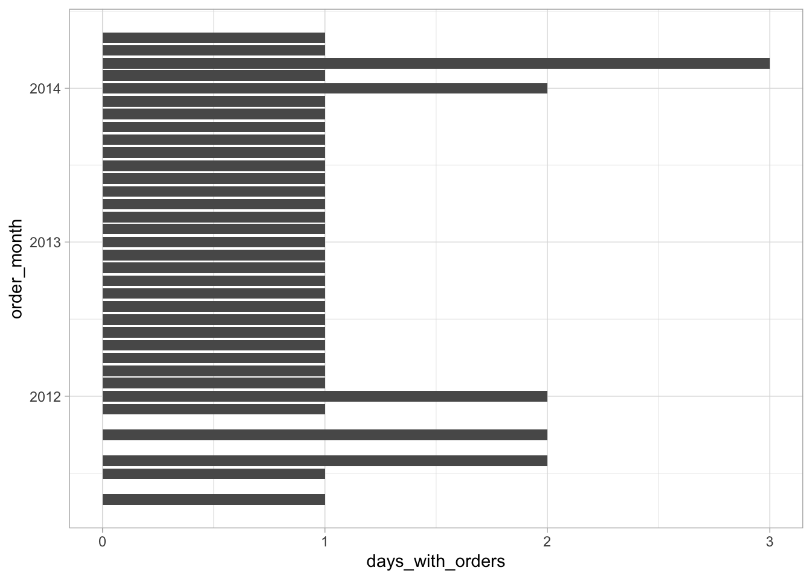
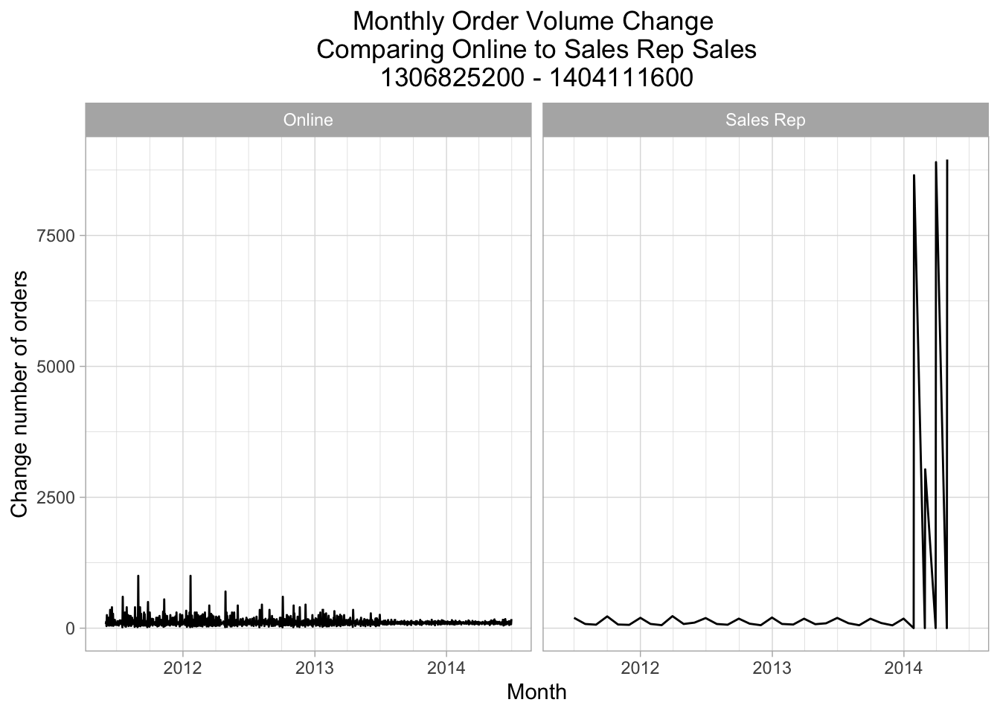
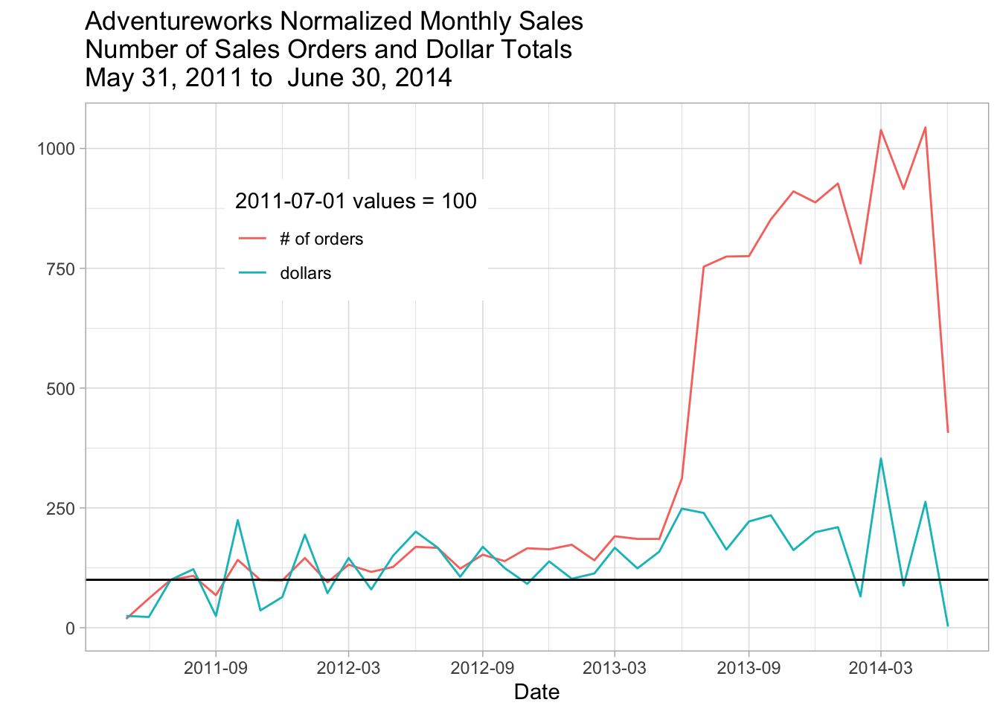
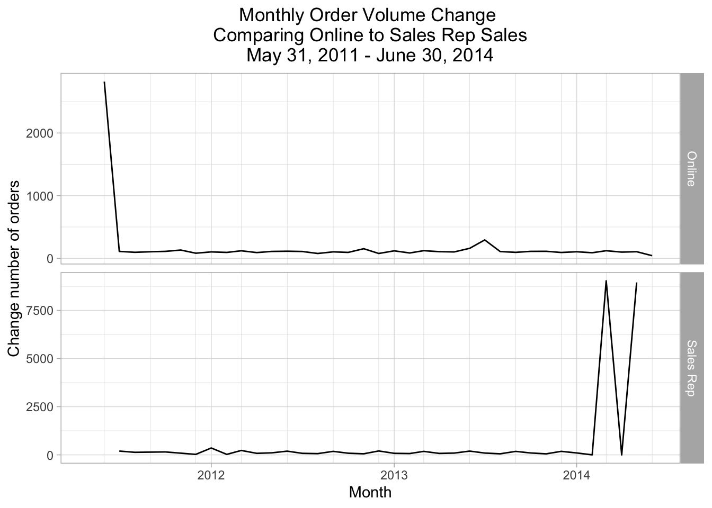
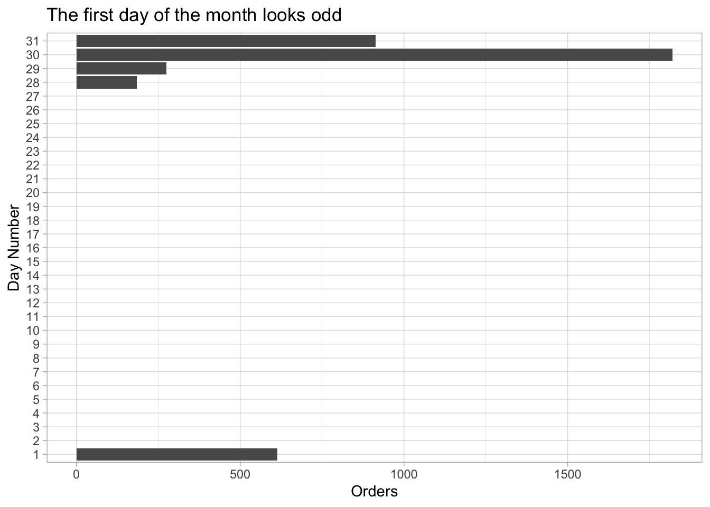
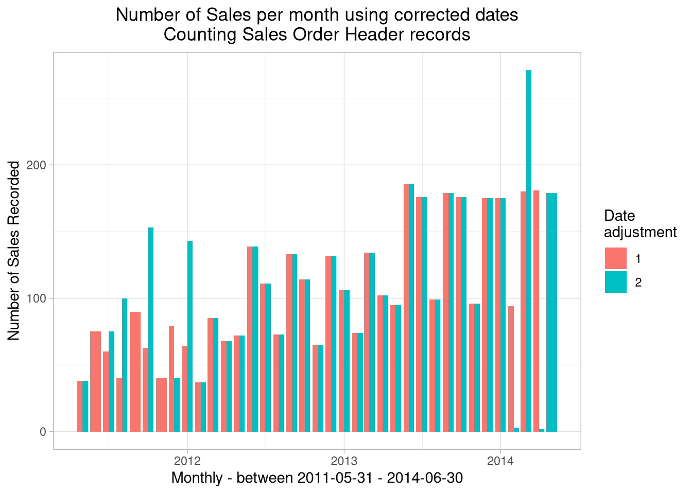
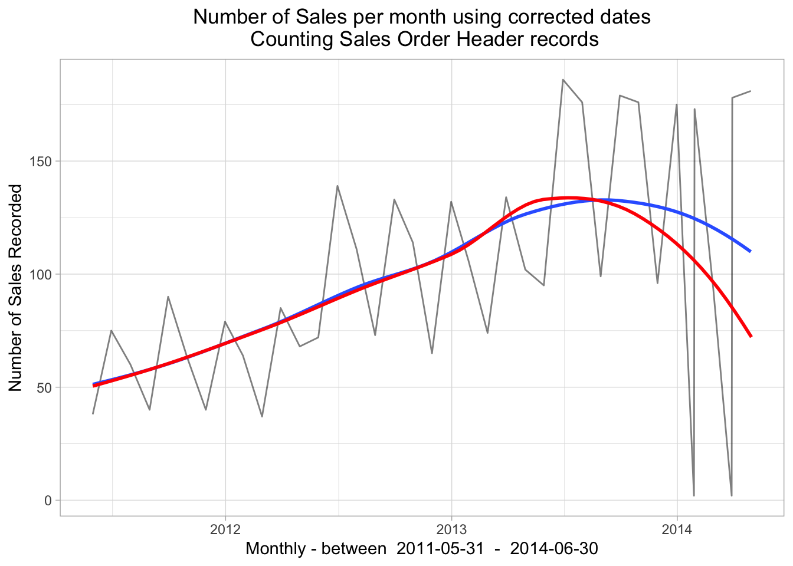

# Asking Business Questions From a Single Table {#chapter_exploring-a-single-table}

> This chapter demonstrates how to:
>
>   * Investigate a database from a business perspective
>   * Dig into a single Adventureworks table containing sales data
>   * Show the multiple data anomalies found in a single AdventureWorks table
>   * Suggest the interplay between "data questions" and "business questions"

The previous chapter has demonstrated some of the automated techniques for showing what's in a table using specific R functions and packages.  Now we demonstrate a step-by-step process of making sense of what's in one table with more of a business perspective.  We illustrate the kind of detective work that's often involved as we investigate the meaning of the data in a table.  We'll investigate the `salesorderheader` table in the `sales` schema in this example with an eye on the AdventureWorks business' sales.  We show that there are quite a few interpretation issues even when we are examining just 3 out of the 25 columns in the `salesorderheader` table.

For this kind of detective work we are seeking to understand the following elements separately and as they interact with each other (and they all do):

  * The data that's stored in the database and how information is represented
  * How the data is entered at a day-to-day level to represent business activities
  * How the business itself is changing

## Setup our standard working environment


Use these libraries:

```r
library(tidyverse)
library(DBI)
library(RPostgres)
library(glue)
require(knitr)
library(dbplyr)
library(sqlpetr)
library(bookdown)
library(here)
library(lubridate)
library(gt)

library(scales) # ggplot xy scales
theme_set(theme_light())
```

Connect to `adventureworks`:

```r
sp_docker_start("adventureworks")
Sys.sleep(sleep_default)
con <- sp_get_postgres_connection(
  host = "localhost",
  port = 5432,
  user = "postgres",
  password = "postgres",
  dbname = "adventureworks",
  seconds_to_test = sleep_default, connection_tab = TRUE
)
```

## A word on naming 

> You will find that many columns have the same name in an enterprise database.  For example, in the adventureworks database, almost all tables have columns named `rowguid` and `modifieddate` and there are many other examples of names that are reused.  The meaning of a column depends on the table that contains it, so as you pull a column out of a table, naming its provenance is important.
>
> Naming columns carefully (whether retrieved from the database or calculated)  will pay off, especially as our queries become more complex. Using `soh` to tag statistics that are derived from the `salesorderheader` table as we do in this book is one example of an intentional naming strategy: it reminds you  of the original source of a column.  You, future you, and your collaborators will appreciate the effort although different naming conventions are completely valid.  And a naming convention when rigidly applied can yield some long and ugly names.
>
> In the following example `soh` appears in different positions in the column name but it is easy to guess at a glance that the data comes from the `salesorderheader` table.
>
> Naming derived tables is just as important as naming derived columns.

## The overall AdventureWorks sales picture

## Annual sales

On an annual basis, are sales dollars trending up, down or flat? We begin with total revenue and number of orders at different levels of detail.  


```r
annual_sales <- tbl(con, in_schema("sales", "salesorderheader")) %>% 
  mutate(year = substr(as.character(orderdate), 1, 4)) %>%
  group_by(year) %>%
  summarize(
    min_soh_orderdate = min(orderdate, na.rm = TRUE),
    max_soh_orderdate = max(orderdate, na.rm = TRUE),
    total_soh_dollars = round(sum(subtotal, na.rm = TRUE), 2),
    avg_total_soh_dollars = round(mean(subtotal, na.rm = TRUE), 2),
    soh_count = n()
  ) %>%
  arrange(year) %>%
  select(
    year, min_soh_orderdate, max_soh_orderdate, total_soh_dollars,
    avg_total_soh_dollars, soh_count
  ) %>%
  show_query() %>%
  collect()
```

```
## <SQL>
## SELECT "year", "min_soh_orderdate", "max_soh_orderdate", "total_soh_dollars", "avg_total_soh_dollars", "soh_count"
## FROM (SELECT *
## FROM (SELECT "year", MIN("orderdate") AS "min_soh_orderdate", MAX("orderdate") AS "max_soh_orderdate", ROUND((SUM("subtotal")) :: numeric, 2) AS "total_soh_dollars", ROUND((AVG("subtotal")) :: numeric, 2) AS "avg_total_soh_dollars", COUNT(*) AS "soh_count"
## FROM (SELECT "salesorderid", "revisionnumber", "orderdate", "duedate", "shipdate", "status", "onlineorderflag", "purchaseordernumber", "accountnumber", "customerid", "salespersonid", "territoryid", "billtoaddressid", "shiptoaddressid", "shipmethodid", "creditcardid", "creditcardapprovalcode", "currencyrateid", "subtotal", "taxamt", "freight", "totaldue", "comment", "rowguid", "modifieddate", SUBSTR(CAST("orderdate" AS TEXT), 1, 4) AS "year"
## FROM sales.salesorderheader) "dbplyr_001"
## GROUP BY "year") "dbplyr_002"
## ORDER BY "year") "dbplyr_003"
```

```r
annual_sales
```

```
## # A tibble: 4 x 6
##   year  min_soh_orderdate   max_soh_orderdate   total_soh_dolla…
##   <chr> <dttm>              <dttm>                         <dbl>
## 1 2011  2011-05-31 00:00:00 2011-12-31 00:00:00        12641672.
## 2 2012  2012-01-01 00:00:00 2012-12-31 00:00:00        33524301.
## 3 2013  2013-01-01 00:00:00 2013-12-31 00:00:00        43622479.
## 4 2014  2014-01-01 00:00:00 2014-06-30 00:00:00        20057929.
## # … with 2 more variables: avg_total_soh_dollars <dbl>, soh_count <int64>
```

```r
min_soh_dt <- min(annual_sales$min_soh_orderdate)
max_soh_dt <- max(annual_sales$max_soh_orderdate)
```

Both 2011 and 2014 are shorter time spans than the other two years, making comparison across the years more difficult. We might normalize the totals based on the number of months in each year, but we first graph total dollars.

### Total sales by year


```r
ggplot(data = annual_sales, aes(x = year, y = total_soh_dollars)) +
  geom_col() +
  scale_y_continuous(labels = scales::dollar_format()) +
  labs(
    title = "Adventure Works Sales Dollars by Year",
    x = glue("Year - between ", min_soh_dt, " - ", max_soh_dt),
    y = "Sales $"
  )
```


From 2011 through 2013, sales are trending up. Are sales dollars for 2014 really down? We only have a half year of data, but the 2014 total is less than half of the 2013 total. Could it be that sales are seasonal? Maybe AdventureWorks has larger sales volumes in the fourth quarter.  To see if the sales dollars are seasonal, we drill down and look at the monthly sales.  But first, let's look at the number of orders and whether there's a pattern in the sales data.  

### Total order volume

Look at number of orders per year:

```r
ggplot(data = annual_sales, aes(x = year, y = as.numeric(soh_count))) +
  geom_col() +
  geom_text(aes(label = round(as.numeric(soh_count), digits = 0)), vjust = -0.25) +
  labs(
    title = "Number of orders per year",
    x = glue("Years between ", min_soh_dt, " - ", max_soh_dt),
    y = "Total Number of Orders"
  )
```


That's a huge jump in the number of orders between 2012 and 2013.  Given the total annual dollars, we ask whether the size of a sale has changed.

### Average dollars per sale


```r
ggplot(data = annual_sales, aes(x = year, y = avg_total_soh_dollars)) +
  geom_col() +
  scale_y_continuous(labels = scales::dollar_format()) +
  geom_text(aes(label = round(avg_total_soh_dollars, digits = 0)), vjust = -0.25) +
  labs(
    title = "Average Dollars per Sale",
    x = glue("Year - between ", min_soh_dt, " - ", max_soh_dt),
    y = "Average Sale Amount"
  )
```


That's a remarkable drop between average sale of more than $7,000 to less than $3,000.  Some kind of remarkable change has taken place in this business.

From 2012 to 2013 the average dollars per order dropped from more than $8,500 to nearly $3,000 while the total number of orders shot up from less than 4,000 to more than 14,000.  **Why are the number of orders increasing, but the average dollar amount of a sale is dropping?  **

We need to drill down to look at monthly sales, adapting the first query to group by month and year.

## Monthly Sales

Our next investigation drills down from annual sales dollars to monthly sales dollars. For that we download the orderdate, rather than a character variable for the year.  R handles the conversion from the PostgreSQL date-time to an R date-time.  We then convert it to a simple date with a `lubridate` function.


```r
monthly_sales <- tbl(con, in_schema("sales", "salesorderheader")) %>%
  select(orderdate, subtotal) %>%
  collect() %>% # From here on we're in R

  mutate(
    orderdate = date(orderdate),
    orderdate = round_date(orderdate, "month")
  ) %>%
  group_by(orderdate) %>%
  summarize(
    min_soh_orderdate = min(orderdate, na.rm = TRUE),
    max_soh_orderdate = max(orderdate, na.rm = TRUE),
    total_soh_dollars = round(sum(subtotal, na.rm = TRUE), 2),
    avg_total_soh_dollars = round(mean(subtotal, na.rm = TRUE), 2),
    soh_count = n()
  )
```

Plotting the monthly sales data:


```r
ggplot(data = monthly_sales, aes(x = orderdate, y = total_soh_dollars)) +
  geom_col() +
  scale_y_continuous(labels = dollar) +
  theme(plot.title = element_text(hjust = 0.5)) + # Center the title
  labs(
    title = glue("Sales by Month\n", min_soh_dt, " - ", max_soh_dt),
    x = "Month",
    y = "Sales Dollars"
  )
```


### Check lagged monthly data

The total sales are trending up but suspiciously uneven.  Looking at lags might confirm just how much month-to-month difference there is:


```r
monthly_sales_lagged <- monthly_sales %>%
  mutate(monthly_sales_change = (lag(total_soh_dollars, 1)) -
    total_soh_dollars)
```


```r
(sum_lags <- summary(monthly_sales_lagged$monthly_sales_change))
```

```
##        Min.     1st Qu.      Median        Mean     3rd Qu.        Max. 
## -1667368.56 -1082792.47    52892.65    18287.07   816048.02  4399378.90 
##        NA's 
##           1
```

The trend is positive on average 18,287 but half of the months have swings greater than 1,898,840!


```r
ggplot(monthly_sales_lagged, aes(x = orderdate, y = monthly_sales_change)) +
  scale_x_date(date_breaks = "year", date_labels = "%Y", date_minor_breaks = "3 months") +
  geom_line() +
  scale_y_continuous(labels = scales::dollar_format()) +
  theme(plot.title = element_text(hjust = .5)) + # Center ggplot title
  labs(
    title = glue(
      "Monthly Sales Change \n",
      "Between ", min_soh_dt, " and ", max_soh_dt
    ),
    x = "Month",
    y = "Dollar Change"
  )
```

```
## Warning: Removed 1 rows containing missing values (geom_path).
```



AdventureWorks sales are *very* uneven.

### Comparing dollars and orders to a base year

To look at dollars and the number of orders together, we compare the monthly data to the yearly average for 2011.


```r
start_year <- monthly_sales %>%
  mutate(yr = year(orderdate)) %>%
  group_by(yr) %>%
  summarize(
    total_soh_dollars = sum(total_soh_dollars),
    soh_count = sum(soh_count),
    n_months = n(),
    avg_dollars = total_soh_dollars / n_months,
    avg_count = soh_count / n_months
  ) %>%
  filter(yr == min(yr))
```

Use 2011 as a baseline:


```r
start_year
```

```
## # A tibble: 1 x 6
##      yr total_soh_dollars soh_count n_months avg_dollars avg_count
##   <dbl>             <dbl>     <int>    <int>       <dbl>     <dbl>
## 1  2011         12354206.      1513        7    1764887.      216.
```

Re express monthly data in terms of the baseline and plot:


```r
monthly_sales_base_year_normalized_to_2011 <- monthly_sales %>%
  mutate(
    dollars = (100 * total_soh_dollars) / start_year$avg_dollars,
    number_of_orders = (100 * soh_count) / start_year$avg_count
  ) %>%
  ungroup()

monthly_sales_base_year_normalized_to_2011 <- monthly_sales_base_year_normalized_to_2011 %>%
  select(orderdate, dollars, number_of_orders) %>%
  pivot_longer(-orderdate,
    names_to = "relative_to_2011_average",
    values_to = "amount"
  )

monthly_sales_base_year_normalized_to_2011 %>%
  ggplot(aes(orderdate, amount, color = relative_to_2011_average)) +
  geom_line() +
  geom_hline(yintercept = 100) +
  scale_x_date(date_labels = "%Y-%m", date_breaks = "6 months") +
  labs(
    title = glue(
      "Adventureworks Normalized Monthly Sales\n",
      "Number of Sales Orders and Dollar Totals\n",
      min_soh_dt, " to ", max_soh_dt
    ),
    x = "Date",
    y = "",
    color = "% change from\n 2011 average"
  )
```



## The effect of online sales

We suspect that the business has changed a lot with the advent of online orders so we check the impact of `onlineorderflag` on annual sales.  The `onlineorderflag` indicates which sales channel accounted for the sale, **Sales Reps** or **Online**.

### Add `onlineorderflag` to our annual sales query


```r
annual_sales_w_channel <- tbl(con, in_schema("sales", "salesorderheader")) %>%
  select(orderdate, subtotal, onlineorderflag) %>%
  collect() %>%
  mutate(
    orderdate = date(orderdate),
    orderdate = round_date(orderdate, "year"),
    onlineorderflag = if_else(onlineorderflag == FALSE,
      "Sales Rep", "Online"
    ),
    onlineorderflag = as.factor(onlineorderflag)
  ) %>%
  group_by(orderdate, onlineorderflag) %>%
  summarize(
    min_soh_orderdate = min(orderdate, na.rm = TRUE),
    max_soh_orderdate = max(orderdate, na.rm = TRUE),
    total_soh_dollars = round(sum(subtotal, na.rm = TRUE), 2),
    avg_total_soh_dollars = round(mean(subtotal, na.rm = TRUE), 2),
    soh_count = n()
  ) %>%
  select(
    orderdate, onlineorderflag, min_soh_orderdate,
    max_soh_orderdate, total_soh_dollars,
    avg_total_soh_dollars, soh_count
  )
```

### Annual Sales comparison

Start by looking at total sales.


```r
ggplot(data = annual_sales_w_channel, aes(x = orderdate, y = total_soh_dollars)) +
  geom_col() +
  scale_y_continuous(labels = scales::dollar_format()) +
  facet_wrap("onlineorderflag") +
  labs(
    title = "Adventure Works Sales Dollars by Year",
    caption = glue("Between", min_soh_dt, " and ", max_soh_dt),
    subtitle = "Comparing Online and Sales Rep sales channels",
    x = "Year",
    y = "Sales $"
  )
```


Indeed the total sales are quite different as are the number of orders and the average order size!

### Order volume comparison

Look at number of orders per year:

```r
ggplot(data = annual_sales_w_channel, aes(x = orderdate, y = as.numeric(soh_count))) +
  geom_col() +
  facet_wrap("onlineorderflag") +
  labs(
    title = "Adventure Works Number of orders per Year",
    caption = glue("Between", min_soh_dt, " and ", max_soh_dt),
    subtitle = "Comparing Online and Sales Rep sales channels",
    x = "Year",
    y = "Total number of orders"
  )
```


### Comparing **Sales Rep** sales to **Online** Orders


```r
ggplot(data = annual_sales_w_channel, aes(x = orderdate, y = avg_total_soh_dollars)) +
  geom_col() +
  facet_wrap("onlineorderflag") +
  scale_y_continuous(labels = scales::dollar_format()) +
  labs(
    title = "Average Dollars per Sale",
    x = glue("Year, between", min_soh_dt, " and ", max_soh_dt),
    y = "Average sale amount"
  )
```


## Impact of order type on monthly sales

Digging into the difference between **Sales Rep** and **Online** sales. 

### Retrieve monthly sales with the `onlineorderflag` 

This query puts the `collect` statement earlier than the previous queries.


```r
monthly_sales_w_channel <- tbl(con, in_schema("sales", "salesorderheader")) %>%
  select(orderdate, subtotal, onlineorderflag) %>%
  collect() %>% # From here on we're in R

  mutate(
    orderdate = date(orderdate),
    orderdate_rounded = round_date(orderdate, "month"),
    onlineorderflag = if_else(onlineorderflag == FALSE,
      "Sales Rep", "Online"
    ),
  ) %>% #
  group_by(orderdate, onlineorderflag) %>%
  summarize(
    min_soh_orderdate = min(orderdate, na.rm = TRUE),
    max_soh_orderdate = max(orderdate, na.rm = TRUE),
    total_soh_dollars = round(sum(subtotal, na.rm = TRUE), 2),
    avg_total_soh_dollars = round(mean(subtotal, na.rm = TRUE), 2),
    soh_count = n()
  ) %>%
  ungroup()
```


```r
monthly_sales_w_channel %>%
  rename(`Sales Channel` = onlineorderflag) %>%
  group_by(`Sales Channel`) %>%
  summarize(
    unique_dates = n(),
    start_date = min(min_soh_orderdate),
    end_date = max(max_soh_orderdate),
    total_sales = sum(total_soh_dollars)
  ) %>%
  gt()
```

<!--html_preserve--><style>html {
  font-family: -apple-system, BlinkMacSystemFont, 'Segoe UI', Roboto, Oxygen, Ubuntu, Cantarell, 'Helvetica Neue', 'Fira Sans', 'Droid Sans', Arial, sans-serif;
}

#pzveloiefp .gt_table {
  display: table;
  border-collapse: collapse;
  margin-left: auto;
  margin-right: auto;
  color: #000000;
  font-size: 16px;
  background-color: #FFFFFF;
  /* table.background.color */
  width: auto;
  /* table.width */
  border-top-style: solid;
  /* table.border.top.style */
  border-top-width: 2px;
  /* table.border.top.width */
  border-top-color: #A8A8A8;
  /* table.border.top.color */
  border-bottom-style: solid;
  /* table.border.bottom.style */
  border-bottom-width: 2px;
  /* table.border.bottom.width */
  border-bottom-color: #A8A8A8;
  /* table.border.bottom.color */
}

#pzveloiefp .gt_heading {
  background-color: #FFFFFF;
  /* heading.background.color */
  border-bottom-color: #FFFFFF;
}

#pzveloiefp .gt_title {
  color: #000000;
  font-size: 125%;
  /* heading.title.font.size */
  padding-top: 4px;
  /* heading.top.padding */
  padding-bottom: 4px;
  border-bottom-color: #FFFFFF;
  border-bottom-width: 0;
}

#pzveloiefp .gt_subtitle {
  color: #000000;
  font-size: 85%;
  /* heading.subtitle.font.size */
  padding-top: 2px;
  padding-bottom: 2px;
  /* heading.bottom.padding */
  border-top-color: #FFFFFF;
  border-top-width: 0;
}

#pzveloiefp .gt_bottom_border {
  border-bottom-style: solid;
  /* heading.border.bottom.style */
  border-bottom-width: 2px;
  /* heading.border.bottom.width */
  border-bottom-color: #A8A8A8;
  /* heading.border.bottom.color */
}

#pzveloiefp .gt_column_spanner {
  border-bottom-style: solid;
  border-bottom-width: 2px;
  border-bottom-color: #A8A8A8;
  padding-top: 4px;
  padding-bottom: 4px;
}

#pzveloiefp .gt_col_heading {
  color: #000000;
  background-color: #FFFFFF;
  /* column_labels.background.color */
  font-size: 16px;
  /* column_labels.font.size */
  font-weight: initial;
  /* column_labels.font.weight */
  vertical-align: middle;
  padding: 10px;
  margin: 10px;
  overflow-x: hidden;
}

#pzveloiefp .gt_columns_top_border {
  border-top-style: solid;
  border-top-width: 2px;
  border-top-color: #A8A8A8;
}

#pzveloiefp .gt_columns_bottom_border {
  border-bottom-style: solid;
  border-bottom-width: 2px;
  border-bottom-color: #A8A8A8;
}

#pzveloiefp .gt_sep_right {
  border-right: 5px solid #FFFFFF;
}

#pzveloiefp .gt_group_heading {
  padding: 8px;
  color: #000000;
  background-color: #FFFFFF;
  /* row_group.background.color */
  font-size: 16px;
  /* row_group.font.size */
  font-weight: initial;
  /* row_group.font.weight */
  border-top-style: solid;
  /* row_group.border.top.style */
  border-top-width: 2px;
  /* row_group.border.top.width */
  border-top-color: #A8A8A8;
  /* row_group.border.top.color */
  border-bottom-style: solid;
  /* row_group.border.bottom.style */
  border-bottom-width: 2px;
  /* row_group.border.bottom.width */
  border-bottom-color: #A8A8A8;
  /* row_group.border.bottom.color */
  vertical-align: middle;
}

#pzveloiefp .gt_empty_group_heading {
  padding: 0.5px;
  color: #000000;
  background-color: #FFFFFF;
  /* row_group.background.color */
  font-size: 16px;
  /* row_group.font.size */
  font-weight: initial;
  /* row_group.font.weight */
  border-top-style: solid;
  /* row_group.border.top.style */
  border-top-width: 2px;
  /* row_group.border.top.width */
  border-top-color: #A8A8A8;
  /* row_group.border.top.color */
  border-bottom-style: solid;
  /* row_group.border.bottom.style */
  border-bottom-width: 2px;
  /* row_group.border.bottom.width */
  border-bottom-color: #A8A8A8;
  /* row_group.border.bottom.color */
  vertical-align: middle;
}

#pzveloiefp .gt_striped {
  background-color: #f2f2f2;
}

#pzveloiefp .gt_from_md > :first-child {
  margin-top: 0;
}

#pzveloiefp .gt_from_md > :last-child {
  margin-bottom: 0;
}

#pzveloiefp .gt_row {
  padding: 8px;
  /* row.padding */
  margin: 10px;
  vertical-align: middle;
  overflow-x: hidden;
}

#pzveloiefp .gt_stub {
  border-right-style: solid;
  border-right-width: 2px;
  border-right-color: #A8A8A8;
  padding-left: 12px;
}

#pzveloiefp .gt_summary_row {
  color: #000000;
  background-color: #FFFFFF;
  /* summary_row.background.color */
  padding: 8px;
  /* summary_row.padding */
  text-transform: inherit;
  /* summary_row.text_transform */
}

#pzveloiefp .gt_grand_summary_row {
  color: #000000;
  background-color: #FFFFFF;
  /* grand_summary_row.background.color */
  padding: 8px;
  /* grand_summary_row.padding */
  text-transform: inherit;
  /* grand_summary_row.text_transform */
}

#pzveloiefp .gt_first_summary_row {
  border-top-style: solid;
  border-top-width: 2px;
  border-top-color: #A8A8A8;
}

#pzveloiefp .gt_first_grand_summary_row {
  border-top-style: double;
  border-top-width: 6px;
  border-top-color: #A8A8A8;
}

#pzveloiefp .gt_table_body {
  border-top-style: solid;
  /* table_body.border.top.style */
  border-top-width: 2px;
  /* table_body.border.top.width */
  border-top-color: #A8A8A8;
  /* table_body.border.top.color */
  border-bottom-style: solid;
  /* table_body.border.bottom.style */
  border-bottom-width: 2px;
  /* table_body.border.bottom.width */
  border-bottom-color: #A8A8A8;
  /* table_body.border.bottom.color */
}

#pzveloiefp .gt_footnotes {
  border-top-style: solid;
  /* footnotes.border.top.style */
  border-top-width: 2px;
  /* footnotes.border.top.width */
  border-top-color: #A8A8A8;
  /* footnotes.border.top.color */
}

#pzveloiefp .gt_footnote {
  font-size: 90%;
  /* footnote.font.size */
  margin: 0px;
  padding: 4px;
  /* footnote.padding */
}

#pzveloiefp .gt_sourcenotes {
  border-top-style: solid;
  /* sourcenotes.border.top.style */
  border-top-width: 2px;
  /* sourcenotes.border.top.width */
  border-top-color: #A8A8A8;
  /* sourcenotes.border.top.color */
}

#pzveloiefp .gt_sourcenote {
  font-size: 90%;
  /* sourcenote.font.size */
  padding: 4px;
  /* sourcenote.padding */
}

#pzveloiefp .gt_center {
  text-align: center;
}

#pzveloiefp .gt_left {
  text-align: left;
}

#pzveloiefp .gt_right {
  text-align: right;
  font-variant-numeric: tabular-nums;
}

#pzveloiefp .gt_font_normal {
  font-weight: normal;
}

#pzveloiefp .gt_font_bold {
  font-weight: bold;
}

#pzveloiefp .gt_font_italic {
  font-style: italic;
}

#pzveloiefp .gt_super {
  font-size: 65%;
}

#pzveloiefp .gt_footnote_glyph {
  font-style: italic;
  font-size: 65%;
}
</style>
<div id="pzveloiefp" style="overflow-x:auto;overflow-y:auto;width:auto;height:auto;"><table class="gt_table">
  
  <tr>
    <th class="gt_col_heading gt_columns_bottom_border gt_columns_top_border gt_left" rowspan="1" colspan="1">Sales Channel</th>
    <th class="gt_col_heading gt_columns_bottom_border gt_columns_top_border gt_center" rowspan="1" colspan="1">unique_dates</th>
    <th class="gt_col_heading gt_columns_bottom_border gt_columns_top_border gt_left" rowspan="1" colspan="1">start_date</th>
    <th class="gt_col_heading gt_columns_bottom_border gt_columns_top_border gt_left" rowspan="1" colspan="1">end_date</th>
    <th class="gt_col_heading gt_columns_bottom_border gt_columns_top_border gt_center" rowspan="1" colspan="1">total_sales</th>
  </tr>
  <body class="gt_table_body">
    <tr>
      <td class="gt_row gt_left">Online</td>
      <td class="gt_row gt_center">1124</td>
      <td class="gt_row gt_left">2011-05-31</td>
      <td class="gt_row gt_left">2014-06-30</td>
      <td class="gt_row gt_right">29358677.46</td>
    </tr>
    <tr>
      <td class="gt_row gt_left gt_striped">Sales Rep</td>
      <td class="gt_row gt_center gt_striped">40</td>
      <td class="gt_row gt_left gt_striped">2011-05-31</td>
      <td class="gt_row gt_left gt_striped">2014-05-01</td>
      <td class="gt_row gt_right gt_striped">80487704.18</td>
    </tr>
  </body>
  
  
</table></div><!--/html_preserve-->

As we will see later on, the **Sales Rep** data doesn't match the **Online** data.  The **Online** data includes 2 months that are not included in the main sales channel.

### Monthly variation compared to a trend line

Jumping to the trend line comparison, we see the source of the variation.


```r
# sp_print_df(monthly_sales_w_channel)

ggplot(
  data = monthly_sales_w_channel,
  aes(
    x = orderdate, y = total_soh_dollars
  )
) +
  geom_line() +
  geom_smooth(se = FALSE) +
  facet_wrap("onlineorderflag") +
  scale_y_continuous(labels = dollar) +
  scale_x_date(date_breaks = "year", date_labels = "%Y", date_minor_breaks = "3 months") +
  theme(plot.title = element_text(hjust = .5)) + # Center ggplot title
  labs(
    title = glue(
      "Sales by Month by Year"),
    x = paste0("Month - between ", min_soh_dt, " - ", max_soh_dt),
    y = "Sales Dollars"
  )
```

```
## `geom_smooth()` using method = 'gam' and formula 'y ~ s(x, bs = "cs")'
```

<div class="figure">

<p class="caption">(\#fig:unnamed-chunk-9)SO, SO Dollars, and Average SO Dollars-b </p>
</div>

The monthly variation is happening on the Sales Rep side.

### Compare monthly lagged data by order type

First consider month-to-month change.

```r
monthly_sales_w_channel_lagged_by_month <- monthly_sales_w_channel %>%
  group_by(onlineorderflag) %>%
  mutate(
    pct_monthly_soh_dollar_change =
      total_soh_dollars / (lag(total_soh_dollars, 1)) * 100,
    pct_monthly_soh_count_change =
      soh_count / (lag(soh_count, 1)) * 100
  )

ggplot(monthly_sales_w_channel_lagged_by_month, aes(x = orderdate, y = pct_monthly_soh_dollar_change)) +
  scale_x_date(date_breaks = "year", date_labels = "%Y", date_minor_breaks = "3 months") +
  facet_wrap("onlineorderflag") +
  geom_line() +
  theme(plot.title = element_text(hjust = .5)) + # Center ggplot title
  labs(
    title = glue(
      "Monthly Percent Sales Change \n",
      "Comparing Online to Sales Rep Sales"
    ),
    x = paste0("Month - between ", min_soh_dt, " - ", max_soh_dt),
    y = "% Dollar Change"
  )
```

```
## Warning: Removed 1 rows containing missing values (geom_path).
```



For **Sales Reps** it looks like the variation is in the number of orders, not just dollars, as shown in the following plot.

```r
ggplot(monthly_sales_w_channel_lagged_by_month, aes(x = orderdate, y = pct_monthly_soh_count_change)) +
  scale_x_date(date_breaks = "year", date_labels = "%Y", date_minor_breaks = "3 months") +
  facet_wrap("onlineorderflag") +
  geom_line() +
  theme(plot.title = element_text(hjust = .5)) + # Center ggplot title
  labs(
    title = glue(
      "Monthly Order Volume Change \n",
      "Comparing Online to Sales Rep Sales\n",
      min_soh_dt, " - ", max_soh_dt
    ),
    x = "Month",
    y = "Change number of orders"
  )
```

```
## Warning: Removed 1 rows containing missing values (geom_path).
```




Let's examine whether there is a large year-to-year change.

```r
monthly_sales_w_channel_lagged_by_year <- monthly_sales_w_channel %>%
  group_by(onlineorderflag) %>%
  mutate(
    pct_monthly_soh_dollar_change =
      total_soh_dollars / (lag(total_soh_dollars, 12)) * 100,
    pct_monthly_soh_count_change =
      soh_count / (lag(soh_count, 12)) * 100
  )

ggplot(monthly_sales_w_channel_lagged_by_year, 
       aes(x = orderdate, y = pct_monthly_soh_dollar_change)) +
  scale_x_date(date_breaks = "year", date_labels = "%Y", 
               date_minor_breaks = "3 months") +
  scale_y_continuous(limits = c(-10, 300)) +
  facet_wrap("onlineorderflag") +
  geom_line() +
  theme(plot.title = element_text(hjust = .5)) + # Center ggplot title
  labs(
    title = glue(
      "Year-on-Year Total Monthly Sales Change \n",
      "Comparing Online to Sales Rep Sales"),
    x = paste0("Month - between ", min_soh_dt, " - ", max_soh_dt),
    y = "% Dollar Change"
  )
```

```
## Warning: Removed 12 rows containing missing values (geom_path).
```



That's much smaller than the month-to-month change.

> ??? Comparing the number of sales orders year over year by month for 2013 and 2012, one can see that the 2013 sales are between 1.2 and 1.8 times larger than the corresponding month of 2012 from January through June.  In July the 2013 sales are 5 to 6 times the 2012 sales orders. ???

This trend continues into 2014 before the number of sales plummet to just 1.3 time in June.

We suspect that the business has changed a lot with the advent of **Online** orders.

## Detect and diagnose the day of the month problem

Looking at the raw data leads us to suspect that there is a problem with the dates on which Sales Rep orders are entered.

### Sales Rep Orderdate Distribution

Look at the dates when sales are entered for sales by **Sales Reps**.  The following query merits some discussion.


```r
sales_rep_day_of_month_sales <- tbl(con, in_schema("sales", "salesorderheader")) %>%
  filter(onlineorderflag == FALSE) %>% # Drop online orders
  select(orderdate, subtotal) %>%
  mutate(
    year = year(orderdate),
    month = month(orderdate),
    day = day(orderdate)
  ) %>%
  count(year, month, day, name = "orders") %>%
  group_by(year, month) %>%
  summarize(
    days_with_orders = n(),
    total_orders = sum(orders, na.rm = TRUE),
    min_day = min(day, na.rm = FALSE)
  ) %>%
  show_query() %>%
  collect() %>%
  mutate(
    days_with_orders = as.numeric(days_with_orders),
    order_month = as.Date(paste0(year, "-", month, "-01")),
    min_day_factor = if_else(min_day < 2, "Month start", "Month end")
  ) %>%
  complete(order_month = seq(min(order_month), max(order_month), by = "month")) %>%
  mutate(days_with_orders = replace_na(days_with_orders, 0)) %>%
  ungroup()
```

```
## <SQL>
```

```
## Warning: Missing values are always removed in SQL.
## Use `MIN(x, na.rm = TRUE)` to silence this warning
## This warning is displayed only once per session.
```

```
## SELECT "year", "month", COUNT(*) AS "days_with_orders", SUM("orders") AS "total_orders", MIN("day") AS "min_day"
## FROM (SELECT "year", "month", "day", COUNT(*) AS "orders"
## FROM (SELECT "orderdate", "subtotal", EXTRACT(year FROM "orderdate") AS "year", EXTRACT(MONTH FROM "orderdate") AS "month", EXTRACT(day FROM "orderdate") AS "day"
## FROM (SELECT *
## FROM sales.salesorderheader
## WHERE ("onlineorderflag" = FALSE)) "dbplyr_007") "dbplyr_008"
## GROUP BY "year", "month", "day") "dbplyr_009"
## GROUP BY "year", "month"
```


```r
sales_rep_day_of_month_sales %>%
  ggplot(aes(order_month, days_with_orders, fill = min_day_factor)) +
  geom_col() +
  coord_flip() +
  labs(
    title = "How many days had Sales Rep orders posted",
    subtitle = "At the beginning or end of the month?",
    fill = "Day Sales were posted",
    y = "Number of days with transactions",
    x = "Date"
  )
```



Suspicious months are those where sales were recorded on more than one day or there were no sales recorded in the month at all.

```r
suspicious_months <- sales_rep_day_of_month_sales %>%
  filter(days_with_orders == 0 | days_with_orders > 1) %>%
  arrange(order_month) %>%
  select(order_month) %>%
  unique()
```

Here are the 8 **suspicious months**:

```r
suspicious_months
```

```
## # A tibble: 8 x 1
##   order_month
##   <date>     
## 1 2011-06-01 
## 2 2011-08-01 
## 3 2011-09-01 
## 4 2011-10-01 
## 5 2011-11-01 
## 6 2012-01-01 
## 7 2014-01-01 
## 8 2014-03-01
```


```r
months_to_inspect <- tibble(target_month = suspicious_months) %>%
  mutate(
    current_month = target_month$order_month,
    next_month = current_month %m+% months(1),
    last_month = current_month %m-% months(1)
  ) %>%
  select(current_month, next_month, last_month) %>%
  pivot_longer(cols = tidyselect::peek_vars()) %>%
  select(value) %>%
  distinct()
```
We have 15 months when we add the month before and the month after the **suspicious months**.  We don't know whether the problem postings have been carried forward or backward.  We check for and eliminate duplicates as well.


```r
monthly_sales_w_channel_to_inspect <- monthly_sales_w_channel %>%
  filter(onlineorderflag == "Sales Rep") %>%
  mutate(order_month = round_date(orderdate, "month")) %>%
  right_join(months_to_inspect, by = c("order_month" = "value")) %>%
  select(-onlineorderflag, -min_soh_orderdate, -max_soh_orderdate) %>%
  arrange(desc(orderdate))

monthly_sales_w_channel_to_inspect
```

```
## # A tibble: 18 x 5
##    orderdate  total_soh_dollars avg_total_soh_dollars soh_count order_month
##    <date>                 <dbl>                 <dbl>     <int> <date>     
##  1 2014-03-31          3314519.                18621.       178 2014-04-01 
##  2 2014-03-30             7291.                 3646.         2 2014-04-01 
##  3 2014-03-01          2204542.                24226.        91 2014-03-01 
##  4 2014-02-28             3231.                 1077.         3 2014-03-01 
##  5 2014-01-29          2737188.                15822.       173 2014-02-01 
##  6 2014-01-28             1565.                  782.         2 2014-02-01 
##  7 2013-12-31          2703811.                15450.       175 2014-01-01 
##  8 2013-11-30          1668952.                17385.        96 2013-12-01 
##  9 2012-01-29          1455280.                22739.        64 2012-02-01 
## 10 2012-01-01          1900789.                24061.        79 2012-01-01 
## 11 2011-12-01           713117.                17828.        40 2011-12-01 
## 12 2011-10-31          1702945.                27031.        63 2011-11-01 
## 13 2011-10-01          2324136.                25824.        90 2011-10-01 
## 14 2011-08-31           844721                 21118.        40 2011-09-01 
## 15 2011-08-01          1165897.                19432.        60 2011-08-01 
## 16 2011-07-01          1538408.                20512.        75 2011-07-01 
## 17 2011-05-31           489329.                12877.        38 2011-06-01 
## 18 NA                       NA                    NA         NA 2011-05-01
```
That is unexpected.  A couple of  things immediately jump out from the first page of data:

*  July, September, and November are missing for 2011. 
*  Most of the **Sales Reps**' orders are entered on a single day of the month, unique days = 1. It is possible that these are monthly recurring orders that get released on a given day of the month.  If that is the case, what are the **Sales Reps** doing the rest of the month?
*  ** ?? The lines with multiple days, unique_days > 1, have a noticeable higher number of orders, so_cnt, and associated so dollars.?? **

The plot clearly shows that two months with multiple sales rep order days for 2011, (11/08 and 11/10), one for 2012, (1201), and two in 2014, (14/01 and 14/03).  The 14/03 is the only three day sales rep order month.

In the next code block, we flesh out the dates associated with the **Sales Reps**' orders.  Since 4 out of the 5 months with multiple order days only have two dates, the code block captures them with a min/max orderdate.

## Correcting the order date for **Sales Reps**


```r
monthly_sales_rep_adjusted <- tbl(con, in_schema("sales", "salesorderheader")) %>%
  select(orderdate, subtotal, onlineorderflag) %>%
  mutate(
    orderdate = as.Date(orderdate),
    day = day(orderdate)
  ) %>%
  show_query() %>%
  collect() # From here on we're in R
```

```
## <SQL>
## SELECT "orderdate", "subtotal", "onlineorderflag", EXTRACT(day FROM "orderdate") AS "day"
## FROM (SELECT CAST("orderdate" AS DATE) AS "orderdate", "subtotal", "onlineorderflag"
## FROM sales.salesorderheader) "dbplyr_013"
```


```r
monthly_sales_rep_adjusted %>%
  filter(day == 1 & onlineorderflag == FALSE) %>%
  count(orderdate) %>%
  as.data.frame()
```

```
##    orderdate   n
## 1 2011-07-01  75
## 2 2011-08-01  60
## 3 2011-10-01  90
## 4 2011-12-01  40
## 5 2012-01-01  79
## 6 2014-03-01  91
## 7 2014-05-01 179
```


```r
dbGetQuery(
  con,
  "
with udays as (
SELECT to_char(orderdate,'YYMM') yymm
     ,EXTRACT(YEAR FROM soh.orderdate) yr
     , EXTRACT(MONTH FROM soh.orderdate) mo 
     , COUNT(DISTINCT soh.orderdate) *1.0 unique_days
     , COUNT(*) so_cnt
     , sum(subtotal) so_dollars
  FROM sales.salesorderheader soh
where not onlineorderflag
group by to_char(orderdate,'YYMM') 
     , EXTRACT(MONTH FROM orderdate) 
     , EXTRACT(YEAR FROM orderdate)
ORDER BY to_char(orderdate,'YYMM')
)
select soh.orderdate,count(*) from udays 
join sales.salesorderheader soh on to_char(soh.orderdate,'YYMM')  = udays.yymm
where unique_days > 1
  and not onlineorderflag
group by soh.orderdate
having count(*) > 1
order by orderdate
"
)
```

```
##     orderdate count
## 1  2011-08-01    60
## 2  2011-08-31    40
## 3  2011-10-01    90
## 4  2011-10-31    63
## 5  2012-01-01    79
## 6  2012-01-29    64
## 7  2014-01-28     2
## 8  2014-01-29   173
## 9  2014-03-01    91
## 10 2014-03-30     2
## 11 2014-03-31   178
```

### Define a date correction function in R


```r
monthly_sales_rep_adjusted <- tbl(con, in_schema("sales", "salesorderheader")) %>%
  select(orderdate, subtotal, onlineorderflag) %>%
  mutate(
    orderdate = as.Date(orderdate),
    day = day(orderdate)
  ) %>%
  show_query() %>%
  collect() %>%

  # From here on we're in R
  # Writing the mutate statement in a generic form, so it applies only
  #   to Sales Rep orders

  mutate(
    adjusted_orderdate = case_when(
      onlineorderflag == FALSE & day == 1L ~ orderdate - 1,
      TRUE ~ orderdate
    )
  ) %>%
  filter(onlineorderflag == FALSE) %>%
  group_by(adjusted_orderdate) %>%
  summarize(
    total_soh_dollars = round(sum(subtotal, na.rm = TRUE), 2),
    avg_total_soh_dollars = round(mean(subtotal, na.rm = TRUE), 2),
    soh_count = n()
  ) %>%
  ungroup()
```

```
## <SQL>
## SELECT "orderdate", "subtotal", "onlineorderflag", EXTRACT(day FROM "orderdate") AS "day"
## FROM (SELECT CAST("orderdate" AS DATE) AS "orderdate", "subtotal", "onlineorderflag"
## FROM sales.salesorderheader) "dbplyr_015"
```

### Define and store a PostgreSQL function to correct the date


```r
dbExecute(
  con,
  "CREATE OR REPLACE FUNCTION so_adj_date(so_date timestamp, ONLINE_ORDER boolean) RETURNS timestamp AS $$
     BEGIN
        IF (ONLINE_ORDER) THEN
            RETURN (SELECT so_date);
        ELSE
            RETURN(SELECT CASE WHEN EXTRACT(DAY FROM so_date) = 1
                               THEN  so_date - '1 day'::interval
                               ELSE  so_date
                          END
                  );
        END IF;
 END; $$
LANGUAGE PLPGSQL;
"
)
```

```
## [1] 0
```

### Use the PostgreSQL function

If you can do the heavy lifting on the database side, that's good.  R can do it, but it's best for finding the issues.


```r
monthly_sales_rep_adjusted_with_psql_function <- tbl(con, in_schema("sales", "salesorderheader")) %>%
  select(orderdate, subtotal, onlineorderflag) %>%
  mutate(
    orderdate = as.Date(orderdate),
    day = day(orderdate)
  ) %>%
  mutate(adjusted_orderdate = as.Date(so_adj_date(orderdate, onlineorderflag))) %>%
  filter(onlineorderflag == FALSE) %>%
  group_by(adjusted_orderdate) %>%
  summarize(
    total_soh_dollars = round(sum(subtotal, na.rm = TRUE), 2),
    avg_total_soh_dollars = round(mean(subtotal, na.rm = TRUE), 2),
    soh_count = n()
  ) %>%
  show_query() %>%
  collect() %>%
  ungroup()
```

```
## <SQL>
## SELECT "adjusted_orderdate", ROUND((SUM("subtotal")) :: numeric, 2) AS "total_soh_dollars", ROUND((AVG("subtotal")) :: numeric, 2) AS "avg_total_soh_dollars", COUNT(*) AS "soh_count"
## FROM (SELECT "orderdate", "subtotal", "onlineorderflag", "day", CAST(so_adj_date("orderdate", "onlineorderflag") AS DATE) AS "adjusted_orderdate"
## FROM (SELECT "orderdate", "subtotal", "onlineorderflag", EXTRACT(day FROM "orderdate") AS "day"
## FROM (SELECT CAST("orderdate" AS DATE) AS "orderdate", "subtotal", "onlineorderflag"
## FROM sales.salesorderheader) "dbplyr_017") "dbplyr_018") "dbplyr_019"
## WHERE ("onlineorderflag" = FALSE)
## GROUP BY "adjusted_orderdate"
```

There's one minor difference between the two:

```r
all_equal(monthly_sales_rep_adjusted, monthly_sales_rep_adjusted_with_psql_function)
```

```
## [1] "Incompatible type for column `soh_count`: x integer, y integer64"
```


```r
monthly_sales_rep_adjusted %>% 
  mutate(day_of_month = day(adjusted_orderdate)) %>% 
ggplot( aes(x = day_of_month, y = soh_count)) +
  geom_col() +
  scale_x_continuous(limits = c(1, 32)) +
  labs(
    title = glue(
      "Transactions Entered by Day of Month \n",
      "Comparing Online to Sales Rep Sales\n",
      min_soh_dt, " - ", max_soh_dt
    ),
    x = "Day of the Month",
    y = "Recorded Sales"
  ) +
  theme(plot.title = element_text(hjust = .5)) # Center ggplot title
```



### Monthly Sales by Order Type with corrected dates -- relative to a trend line


```r
monthly_sales_rep_as_is <- monthly_sales_w_channel %>% 
  filter(onlineorderflag == "Sales Rep")
  

ggplot(
  data = monthly_sales_rep_adjusted,
  aes(x = adjusted_orderdate, y = soh_count)
) +
  geom_line(alpha = .5) +
  geom_smooth(se = FALSE) +
  geom_smooth(data = monthly_sales_rep_as_is, aes(
    orderdate, soh_count
  ), color = "red", alpha = .5,
  se = FALSE) +
  theme(plot.title = element_text(hjust = .5)) + # Center ggplot title
  labs(
    title = glue(
      "Number of Sales per month using corrected dates\n",
      "Counting Sales Order Header records"
    ),
    x = paste0("Monthly - between ", min_soh_dt, " - ", max_soh_dt),
    y = "Number of Sales Recorded"
  )
```

```
## `geom_smooth()` using method = 'loess' and formula 'y ~ x'
## `geom_smooth()` using method = 'loess' and formula 'y ~ x'
```




## Disconnect from the database and stop Docker


```r
dbDisconnect(con)
sp_docker_stop("adventureworks")
```
