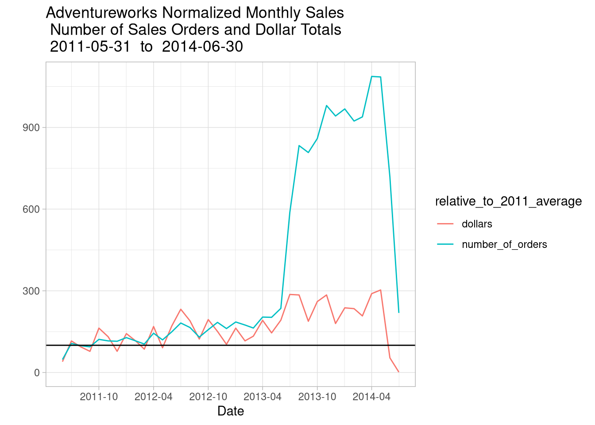
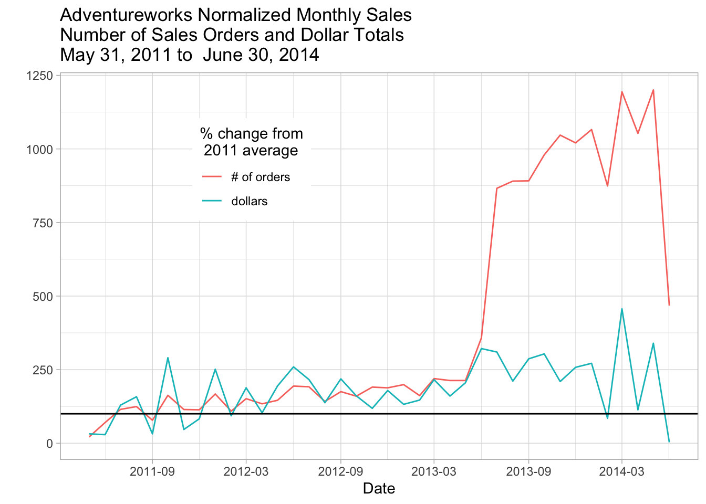
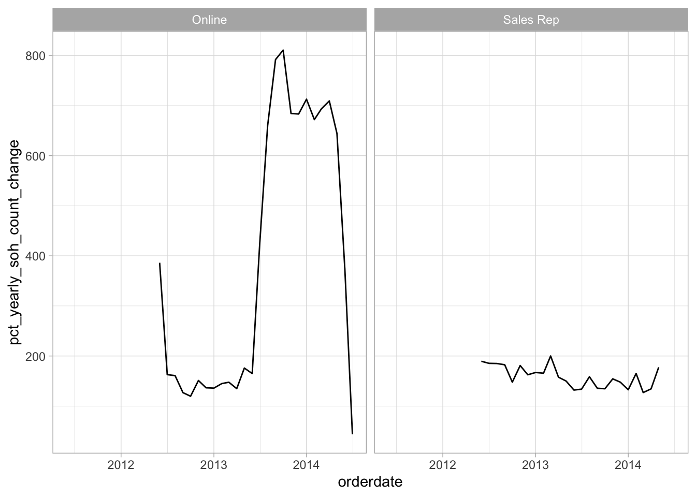
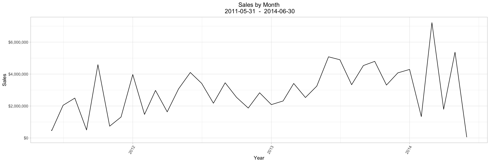

# Exploring a Single Table (asking Business Questions) {#chapter_exploring-a-single-table}

> This chapter demonstrates how to:
>
>   * Begin the process of investigating a database from a business perspective
>   * Dig into a single Adventureworks table containing sales data
>   * Investigate the data from a business value perspective

The previous chapter has demonstrated some of the automated techniques for showing what's in the table using specific R functions and packages.  Now we demonstrate a step-by-step process of making sense of what's in a table from a business perspective.  We explore one table, illustrating the kind of detective work that's often involved in understand the meaning of the data in a single table.  We'll investigate the `salesorderheader` table in the `sales` schema in this example with an eye on the AdventureWorks busieness' sales.

For this kind of detective work we are seeking to undertand the following elements separately and as they interact with each other (and they all do):

  * The data that's stored in the database
  * The overall structure of the data (how different tables connect with each other and affect how to interpet each other)
  * How the data is entered at a day-to-day level to represent business activities
  * How the business itself is changing

## Setup our standard working environment


Use these libraries:

```r
library(tidyverse)
library(DBI)
library(RPostgres)
library(glue)
require(knitr)
library(dbplyr)
library(sqlpetr)
library(bookdown)
library(here)
library(lubridate)

library(scales) # ggplot xy scales
theme_set(theme_light())
```

Connect to `adventureworks`:

```r
sp_docker_start("adventureworks")
Sys.sleep(sleep_default)
con <- sp_get_postgres_connection(
  host = "localhost",
  port = 5432,
  user = "postgres",
  password = "postgres",
  dbname = "adventureworks",
  seconds_to_test = sleep_default, connection_tab = TRUE
)
```

## The overall AdventureWorks sales picture

On an annual basis, are sales dollars trending up, down or flat? We begin with total revenue and number of orders at different levels of detail.  

> You will find that many columns have the same name in an enterprise database.  For example, in the adventureworks database, almost all tables have columns named `rowguid` and `modifieddate`.
>
>> Naming columns carefully (whether retrieved from the database or calculated)  will pay off as our queries become more complex. Using `soh` to tag statistics that are derived from the `salesorderheader` table is one example of careful naming.  A naming convention that reminds you  of the original source of a column is a matter of applying some logic to how things are named; you, future you, and your collaborators will appreciate it although different naming conventions are completely valid.
>
> In the following example `soh` appears in different positions in the column name but it is easy to guess at a glance that the data comes from the `salesorderheader` table.

## Annual sales

```r
annual_sales <-  tbl(con, in_schema("sales", "salesorderheader")) %>%
  mutate(year = substr(as.character(orderdate), 1, 4)) %>%
  group_by(year) %>%
  summarize(
    min_soh_orderdate = min(orderdate, na.rm = TRUE),
    max_soh_orderdate = max(orderdate, na.rm = TRUE),
    total_soh_dollars = round(sum(subtotal, na.rm = TRUE), 2),
    avg_total_soh_dollars = round(mean(subtotal, na.rm = TRUE),2),
    soh_count = n()
  ) %>%
  arrange(year) %>%
  select(year, min_soh_orderdate, max_soh_orderdate, total_soh_dollars, 
         avg_total_soh_dollars, soh_count) %>% show_query %>% 
  collect() 
```

```
## <SQL>
## SELECT "year", "min_soh_orderdate", "max_soh_orderdate", "total_soh_dollars", "avg_total_soh_dollars", "soh_count"
## FROM (SELECT *
## FROM (SELECT "year", MIN("orderdate") AS "min_soh_orderdate", MAX("orderdate") AS "max_soh_orderdate", ROUND((SUM("subtotal")) :: numeric, 2) AS "total_soh_dollars", ROUND((AVG("subtotal")) :: numeric, 2) AS "avg_total_soh_dollars", COUNT(*) AS "soh_count"
## FROM (SELECT "salesorderid", "revisionnumber", "orderdate", "duedate", "shipdate", "status", "onlineorderflag", "purchaseordernumber", "accountnumber", "customerid", "salespersonid", "territoryid", "billtoaddressid", "shiptoaddressid", "shipmethodid", "creditcardid", "creditcardapprovalcode", "currencyrateid", "subtotal", "taxamt", "freight", "totaldue", "comment", "rowguid", "modifieddate", SUBSTR(CAST("orderdate" AS TEXT), 1, 4) AS "year"
## FROM sales.salesorderheader) "dbplyr_001"
## GROUP BY "year") "dbplyr_002"
## ORDER BY "year") "dbplyr_003"
```

```r
annual_sales
```

```
## # A tibble: 4 x 6
##   year  min_soh_orderdate   max_soh_orderdate   total_soh_dolla…
##   <chr> <dttm>              <dttm>                         <dbl>
## 1 2011  2011-05-31 00:00:00 2011-12-31 00:00:00        12641672.
## 2 2012  2012-01-01 00:00:00 2012-12-31 00:00:00        33524301.
## 3 2013  2013-01-01 00:00:00 2013-12-31 00:00:00        43622479.
## 4 2014  2014-01-01 00:00:00 2014-06-30 00:00:00        20057929.
## # … with 2 more variables: avg_total_soh_dollars <dbl>, soh_count <int64>
```

Both 2011 and 2014 are shorter time spans than the other two years, making comparison across the years more difficult. We might normalize the totals based on the number of months in each year, but we first graph total dollars:

### Total sales by year


```r
min_soh_dt <- min(annual_sales$min_soh_orderdate)
max_soh_dt <- max(annual_sales$max_soh_orderdate)

ggplot(data = annual_sales, aes(x = year, y = total_soh_dollars)) +
  geom_col() +
  xlab("Year") +
  ylab("Sales $") +
  scale_y_continuous(labels = scales::dollar_format()) + 
  ggtitle(paste("Adventure Works Sales Dollars by Year\n  ", 
                min_soh_dt, " - ", max_soh_dt))
```


From 2011 through 2013, sales are trending up. Are sales dollars for 2014 really down, is it a shorter year (are sales seasonal)?  To see if the sales dollars are seasonal, we will drill in and look at the monthly sales.  But first, let's look at the number of orders and whether there's a pattern in the sales data.  

### Total  order volume

Look at number of orders per year:

```r
ggplot(data = annual_sales, aes(x = year, y = as.numeric(soh_count))) +
  geom_col() +  
  xlab("Year") +
  ylab("Total number of orders") +
  ggtitle(paste("Number of Orders per Year\n", 
                min_soh_dt, " - ", max_soh_dt))
```


That's a huge jump in the number of orders between 2012 and 2013.  Given the total annual dollars, we ask whether the size of a sale has changed.

### Average dollars per sale


```r
ggplot(data = annual_sales, aes(x = year, y = avg_total_soh_dollars)) +
  geom_col() +
  xlab("Year") +
  ylab("Average sale amount") +
  scale_y_continuous(labels = scales::dollar_format()) + 
  ggtitle(paste("Average Dollars per Sale\n", 
                min_soh_dt, " - ", max_soh_dt))
```


That's a remarkable drop between average sale of more than $7,000 to less than $3,000.

### Order volume and average sale together

Looking at order volume and average sales size together suggests that indeed something big happened between 2012 and 2013.


```r
annual_sales %>% arrange(min_soh_orderdate) %>% 
ggplot(aes(x = avg_total_soh_dollars, y = as.numeric(soh_count))) +
  geom_point() +
  geom_text(aes(label = year, hjust = .5, vjust = 0)) +
  geom_path() +
  xlab("Average dollars per order") +
  ylab("Total number of orders") +
  scale_y_continuous(labels = scales::dollar_format()) + 
  scale_x_continuous(labels = scales::dollar_format()) + 
  ggtitle(paste("Number of Orders by Average Order Amount\n", 
                min_soh_dt, " - ", max_soh_dt))
```


From 2012 to 2013 the average dollars per order dropped from more than $8,500 to nearly $3,000 while the total number of order shot up from less than 4,000 to more than 14,000.  **Why are the number of orders increasing, but the average dollar amount of a sale is dropping?  **

We need to drill down to look at monthly sales, adapting the first query to group by month and year.

## Monthly Sales

The next code block drills down from annual sales dollars to monthly sales dollars. We adopt a more R-like strategy; rather than `yr` as a character variable, we just download the orderdate.  R handles the coversion from the postgres date-time to an R date-time.  We then convert it to a simple date with a `lubridate` function.


```r
monthly_sales <-  tbl(con, in_schema("sales", "salesorderheader")) %>%
  select(orderdate, subtotal) %>% 
  
  collect() %>% # From here on we're in R
  
  mutate(orderdate = date(orderdate), 
         orderdate = round_date(orderdate, "month")) %>%  # 
  group_by( orderdate) %>%
  summarize(
    min_soh_orderdate = min(orderdate, na.rm = TRUE),
    max_soh_orderdate = max(orderdate, na.rm = TRUE),
    total_soh_dollars = round(sum(subtotal, na.rm = TRUE), 2),
    avg_total_soh_dollars = round(mean(subtotal, na.rm = TRUE), 2),
    soh_count = n()
  ) 
```

Plotting the monthly sales data:


```r
ggplot(data = monthly_sales, aes(x = orderdate, y = total_soh_dollars)) +
  geom_col() +
  xlab("Month") +
  ylab("Sales Dollars") +
  scale_y_continuous(labels = dollar) +
  theme(plot.title = element_text(hjust = 0.5)) + # Center the title
  ggtitle(paste("Sales by Month\n", min_soh_dt, " - ", max_soh_dt))
```


The total sales are trending up but suspiciously uneven.  Looking at lags might confirm just how much month-to-month difference there is:


```r
lagged_monthly_sales <- monthly_sales %>% 
  mutate(monthly_sales_change = (lag(total_soh_dollars, 1)) -
           total_soh_dollars)

summary(lagged_monthly_sales$monthly_sales_change)
```

```
##        Min.     1st Qu.      Median        Mean     3rd Qu.        Max. 
## -1667368.56 -1082792.47    52892.65    18287.07   816048.02  4399378.90 
##        NA's 
##           1
```
Although median monthly sales rise by about $53 thousand, it's curious that in one fourth of the months the drop between one month and the next is between fifteen hundred and a million dollars. AventureWorks sales are *very* uneven.

### Comparing dollars and orders to a baseline

To look at dollars and the number of orders together, we compare the monthly data to the yearly average for 2011.


```r
start_year <- monthly_sales %>% 
  mutate(yr = year(orderdate)) %>% 
  group_by(yr) %>%
  summarize(total_soh_dollars = sum(total_soh_dollars), 
            soh_count = sum(soh_count), 
            n_months = n(),
            avg_dollars = total_soh_dollars / n_months,
            avg_count = soh_count / n_months) %>% 
    filter(yr == min(yr))
```

Use 2011 as a baseline:


```r
start_year
```

```
## # A tibble: 1 x 6
##      yr total_soh_dollars soh_count n_months avg_dollars avg_count
##   <dbl>             <dbl>     <int>    <int>       <dbl>     <dbl>
## 1  2011         12354206.      1513        7    1764887.      216.
```

Re express monthly data in terms of the baseline and plot:


```r
normalized_monthly_sales <-  monthly_sales %>% 
  mutate(dollars = (100 * total_soh_dollars) / start_year$avg_dollars,
         number_of_orders = (100 * soh_count) / start_year$avg_count) %>% 
  ungroup()

normalized_monthly_sales <- normalized_monthly_sales %>% 
  select(orderdate, dollars, number_of_orders) %>% 
  pivot_longer(-orderdate, names_to = "relative_to_2011_average", 
               values_to = "amount" )

normalized_monthly_sales %>% 
  ggplot(aes(orderdate, amount, color = relative_to_2011_average)) +
  geom_line() +
  geom_hline(yintercept = 100) +
  xlab("Date") +
  ylab("") +
  scale_x_date(date_labels = "%Y-%m", date_breaks = "6 months") +
  ggtitle(paste("Adventureworks Normalized Monthly Sales\n",
                "Number of Sales Orders and Dollar Totals\n", 
                min_soh_dt, " to ", max_soh_dt))
```



## The effect of online sales

We have suspected that the business has changed a lot with the advent of online orders so we check the impact of `onlineorderflag` on annual sales.

### Add `onlineorderflag` to our query


```r
annual_sales <-  tbl(con, in_schema("sales", "salesorderheader")) %>%
   select(orderdate, subtotal, onlineorderflag) %>% 
   collect() %>% 
  mutate(orderdate = date(orderdate), 
         orderdate = round_date(orderdate, "year"),
         onlineorderflag = if_else(onlineorderflag == FALSE, 
                                   "Sales Rep", "Online"),
         onlineorderflag = as.factor(onlineorderflag)) %>%
  group_by(orderdate, onlineorderflag) %>%
  summarize(
    min_soh_orderdate = min(orderdate, na.rm = TRUE),
    max_soh_orderdate = max(orderdate, na.rm = TRUE),
    total_soh_dollars = round(sum(subtotal, na.rm = TRUE), 2),
    avg_total_soh_dollars = round(mean(subtotal, na.rm = TRUE),2),
    soh_count = n()
  ) %>%
  select(orderdate, onlineorderflag, min_soh_orderdate, 
         max_soh_orderdate, total_soh_dollars, avg_total_soh_dollars, soh_count)
```

### Annual Sales comparison

Start by looking at total sales.


```r
ggplot(data = annual_sales, aes(x = orderdate, y = total_soh_dollars)) +
  geom_col() +
  xlab("Year") +
  ylab("Sales $") +
  scale_y_continuous(labels = scales::dollar_format()) + 
  facet_wrap("onlineorderflag") +
  ggtitle(paste("Adventure Works Sales Dollars by Year\n  ", 
                min_soh_dt, " - ", max_soh_dt))
```


Indeed the total sales are quite different as are the number of orders and the average order size!

### Order volume comparison

Look at number of orders per year:

```r
ggplot(data = annual_sales, aes(x = orderdate, y = as.numeric(soh_count))) +
  geom_col() +  
  xlab("Year") +
  facet_wrap("onlineorderflag") +
  ylab("Total number of orders") +
  ggtitle(paste("Number of Orders per Year\n", 
                min_soh_dt, " - ", max_soh_dt))
```


### Average sale comparison


```r
ggplot(data = annual_sales, aes(x = orderdate, y = avg_total_soh_dollars)) +
  geom_col() +
  xlab("Year") +
  ylab("Average sale amount") +
  facet_wrap("onlineorderflag") +
  scale_y_continuous(labels = scales::dollar_format()) + 
  ggtitle(paste("Average Dollars per Sale\n", 
                min_soh_dt, " - ", max_soh_dt))
```


### Comparing order volume and average sale together

Look at number of orders by the the average sales per order for the four years:

```r
annual_sales %>% arrange(orderdate) %>% 
ggplot(aes(x = avg_total_soh_dollars, y = as.numeric(soh_count))) +
  geom_point() +
  geom_text(aes(label = orderdate, hjust = .5, vjust = 0)) +
  geom_path() +
  xlab("Average dollars per order") +
  ylab("Total number of orders") +
    facet_wrap("onlineorderflag", scales = "free") +
  scale_y_continuous(labels = scales::dollar_format()) + 
  scale_x_continuous(labels = scales::dollar_format()) + 
  ggtitle(paste("Number of Orders by Average Order Amount\n", 
                min_soh_dt, " - ", max_soh_dt))
```


From 2012 to 2013 the average dollars per order dropped from more than $8,500 to nearly $3,000 while the total number of order shot up from less than 4,000 to more than 14,000.  **Why are the number of orders increasing, but the average order dollar amount dropping?  **

## Impact of order type on monthly sales

Digging into the difference between *Sales Rep* and *Online* sales. 

### Retrieve monthly sales with the `onlineorderflag` 

This query puts the `collect` statement earlier than the previous queries.


```r
monthly_sales <-  tbl(con, in_schema("sales", "salesorderheader")) %>%
  select(orderdate, subtotal, onlineorderflag) %>% 
  
  collect() %>% # From here on we're in R
  
  mutate(orderdate = date(orderdate), 
         orderdate = round_date(orderdate, "month"),
          onlineorderflag = if_else(onlineorderflag == FALSE, 
                                   "Sales Rep", "Online"),) %>%  # 
  group_by(orderdate, onlineorderflag) %>%
  summarize(
    min_soh_orderdate = min(orderdate, na.rm = TRUE),
    max_soh_orderdate = max(orderdate, na.rm = TRUE),
    total_soh_dollars = round(sum(subtotal, na.rm = TRUE), 2),
    avg_total_soh_dollars = round(mean(subtotal, na.rm = TRUE), 2),
    soh_count = n()
  ) 
```

### Monthly variation compared to a trend line

Jumping to the trend line comparison, we see that the variation 


```r
# sp_print_df(monthly_sales)

ggplot(
  data = monthly_sales,
  aes(
    x = orderdate, y = total_soh_dollars)) +
  geom_line() +
  geom_smooth(se = FALSE) +
  xlab("Month") +
  ylab("Sales Dollars") +
  facet_wrap("onlineorderflag") +
  scale_y_continuous(labels = dollar) +
  scale_x_date(date_breaks = "year", date_labels = "%Y", date_minor_breaks = "3 months") +
  theme(plot.title = element_text(hjust = .5)) + # Center ggplot title
  ggtitle(paste("Sales by Month by Year\n",
                "With Number of Sales Orders\nAnd Average SO $ Amount\n", 
                min_soh_dt, " - ", max_soh_dt))
```

```
## `geom_smooth()` using method = 'loess' and formula 'y ~ x'
```

<div class="figure">

<p class="caption">(\#fig:unnamed-chunk-6)SO, SO Dollars, and Average SO Dollars-b </p>
</div>

A couple of things jump out from the graph.

1.  2012 and 2013 have similar sales dollar plots and peak every three months.  This may reflect the closing as many sales orders as possible to make the quarterly sales numbers look good.
2.  2011 has more variation than 2012 and 2013 and peaks every two months.
3.  2014 has the most variation and also peaks every two months.  Both the number of sales, 939, and the average sales order size, $52.19 plummet in June 2014.

### Looking at lagged data


```r
lagged <- monthly_sales %>% 
  group_by(onlineorderflag) %>% 
  mutate(pct_yearly_soh_dollar_change = 
           total_soh_dollars / (lag(total_soh_dollars, 12)) * 100,
         pct_yearly_soh_count_change = 
           soh_count / (lag(soh_count, 12)) * 100)

ggplot(lagged, aes(x = orderdate, y = pct_yearly_soh_dollar_change)) +
  facet_wrap("onlineorderflag") +
  geom_line()
```

```
## Warning: Removed 12 rows containing missing values (geom_path).
```



```r
ggplot(lagged, aes(x = orderdate, y = pct_yearly_soh_count_change)) +
  facet_wrap("onlineorderflag") +
  geom_line()
```

```
## Warning: Removed 12 rows containing missing values (geom_path).
```



Comparing the number of sales orders year over year by month for 2013 and 2012, one can see that the 2013 sales are between 1.2 and 1.8 times larger than the corresponding month of 2012 from January through June.  In July the 2013 sales are 5 to 6 times the 2012 sales orders.

This trend continues into 2014 before the number of sales plummet to just 1.3 time in June.

We suspect that the business has changed a lot with the adventn of online orders.


### Something happend in July 2013


```r
mo_onl_pct <- dbGetQuery(
  con,
  "
SELECT *
      ,round(orders/mo_orders * 100.0,2) mo_pct
      ,round(sales_dollars/mo_sales * 100.0,2) mo_dlr_pct
  FROM (SELECT EXTRACT(MONTH FROM orderdate) mo, EXTRACT(YEAR FROM orderdate) yr
             , min(orderdate)::DATE min_soh_orderdate, max(orderdate)::DATE max_soh_orderdate
             , round(sum(subtotal), 2) sales_dollars
             , round(sum(sum(subtotal)) over (partition by EXTRACT(MONTH FROM orderdate),EXTRACT(YEAR FROM orderdate)
                             order by EXTRACT(YEAR FROM orderdate)),2) mo_sales
             , count(*) * 1.0 orders
             , sum(count(*)) over (partition by EXTRACT(MONTH FROM orderdate),EXTRACT(YEAR FROM orderdate)
                             order by EXTRACT(YEAR FROM orderdate)) mo_orders
             , case when sh.onlineorderflag then 'online' else 'sales rep' end sales_type
        FROM sales.salesorderheader sh
        GROUP BY EXTRACT(MONTH FROM orderdate), EXTRACT(YEAR FROM orderdate), 
                 case when sh.onlineorderflag then 'online' else 'sales rep' end
       ) as src
ORDER BY mo, yr, sales_type
"
)

sp_print_df(head(mo_onl_pct))
```

<!--html_preserve--><div id="htmlwidget-1b4ff99564eb6e8884a5" style="width:100%;height:auto;" class="datatables html-widget"></div>
<script type="application/json" data-for="htmlwidget-1b4ff99564eb6e8884a5">{"x":{"filter":"none","data":[["1","2","3","4","5","6"],[1,1,1,1,1,1],[2012,2012,2013,2013,2014,2014],["2012-01-01","2012-01-01","2013-01-01","2013-01-28","2014-01-01","2014-01-28"],["2012-01-31","2012-01-29","2013-01-31","2013-01-28","2014-01-31","2014-01-29"],[614557.94,3356069.34,523917.38,1563955.08,1551065.56,2738752.39],[3970627.28,3970627.28,2087872.46,2087872.46,4289817.95,4289817.95],[193,143,294,106,1966,175],[336,336,400,400,2141,2141],["online","sales rep","online","sales rep","online","sales rep"],[57.44,42.56,73.5,26.5,91.83,8.17],[15.48,84.52,25.09,74.91,36.16,63.84]],"container":"<table class=\"display\">\n  <thead>\n    <tr>\n      <th> <\/th>\n      <th>mo<\/th>\n      <th>yr<\/th>\n      <th>min_soh_orderdate<\/th>\n      <th>max_soh_orderdate<\/th>\n      <th>sales_dollars<\/th>\n      <th>mo_sales<\/th>\n      <th>orders<\/th>\n      <th>mo_orders<\/th>\n      <th>sales_type<\/th>\n      <th>mo_pct<\/th>\n      <th>mo_dlr_pct<\/th>\n    <\/tr>\n  <\/thead>\n<\/table>","options":{"columnDefs":[{"className":"dt-right","targets":[1,2,5,6,7,8,10,11]},{"orderable":false,"targets":0}],"order":[],"autoWidth":false,"orderClasses":false}},"evals":[],"jsHooks":[]}</script><!--/html_preserve-->

```r
mo_onl_pct$mo <- as.factor(mo_onl_pct$mo)
mo_onl_pct$yr <- as.factor(mo_onl_pct$yr)
mo_onl_pct$sales_type <- as.factor(mo_onl_pct$sales_type)
mo_2011 <- mo_onl_pct %>% filter(yr == 2011)
mo_2012 <- mo_onl_pct %>% filter(yr == 2012)
mo_2013 <- mo_onl_pct %>% filter(yr == 2013)
mo_2014 <- mo_onl_pct %>% filter(yr == 2014)


ggplot(data = NULL) +
  # data=mo_2011 first results in the x axis months out of order.
  geom_line(data = mo_2012, aes(x = mo, y = mo_pct, color = yr, group = sales_type)) +
  geom_line(data = mo_2011, aes(x = mo, y = mo_pct, color = yr, group = sales_type)) +
  geom_line(data = mo_2013, aes(x = mo, y = mo_pct, color = yr, group = sales_type)) +
  geom_line(data = mo_2014, aes(x = mo, y = mo_pct, color = yr, group = sales_type)) +

  geom_point(data = mo_2011, aes(x = mo, y = mo_pct, color = sales_type)) +
  geom_point(data = mo_2012, aes(x = mo, y = mo_pct, color = sales_type)) +
  geom_point(data = mo_2013, aes(x = mo, y = mo_pct, color = sales_type)) +
  geom_point(data = mo_2014, aes(x = mo, y = mo_pct, color = sales_type)) +

  geom_text(
    data = mo_2011, aes(x = mo, y = mo_pct, label = paste(orders, ":$", sales_dollars, ":", mo_dlr_pct, "%")),
    position = position_dodge(.3), size = 2.5, hjust = 0
  ) +
  geom_text(
    data = mo_2012, aes(x = mo, y = mo_pct, label = paste(orders, ":$", sales_dollars, ":", mo_dlr_pct, "%")),
    position = position_dodge(.3), size = 2.5, hjust = 0
  ) +
  geom_text(
    data = mo_2013, aes(x = mo, y = mo_pct, label = paste(orders, ":$", sales_dollars, ":", mo_dlr_pct, "%")),
    position = position_dodge(.3), size = 2.5, hjust = 0
  ) +
  geom_text(
    data = mo_2014, aes(x = mo, y = mo_pct, label = paste(orders, ":$", sales_dollars, ":", mo_dlr_pct, "%")), color = "lightblue",
    position = position_dodge(.3), size = 2.5, hjust = 0, vjust = 1.5
  ) +

  xlab("Month") +
  ylab("% Online Sales\nvs\n%Rep Sales") +
  theme(plot.title = element_text(hjust = .50)) +
  ggtitle(paste(
    "Sales by Month\n",
    "Online Orders Versus Rep Orders\n",
    min_soh_dt, " - ", max_soh_dt, "
",
    "Each Point shows Number of Orders: $ Amount: % of Total $ For the Month"
  ))
```


The sales rep orders brought in over half the monthly sales dollars for every month except three, February, April, and June of 2014.  The monthly sales rep orders for those months are 3, 2, and 0 respectively. 

## Monthly Sales Rep Performance Analysis


```r
mo_soh_sreps <- dbGetQuery(
  con,
  "
SELECT *
      ,round(orders/mo_orders * 100.0,2) mo_pct
      ,round(sales_dollars/mo_sales * 100.0,2) mo_dlr_pct
  FROM (SELECT EXTRACT(MONTH FROM orderdate) mo, EXTRACT(YEAR FROM orderdate) yr
             , min(orderdate)::DATE min_soh_orderdate, max(orderdate)::DATE max_soh_orderdate
             , round(sum(subtotal), 2) sales_dollars
             , round(sum(sum(subtotal)) over (partition by EXTRACT(MONTH FROM orderdate),EXTRACT(YEAR FROM orderdate)
                             order by EXTRACT(YEAR FROM orderdate)),2) mo_sales
             , count(*) * 1.0 orders
             , sum(count(*)) over (partition by EXTRACT(MONTH FROM orderdate),EXTRACT(YEAR FROM orderdate)
                             order by EXTRACT(YEAR FROM orderdate)) mo_orders
             , case when sh.onlineorderflag then 'online' else 'sales rep' end sales_type
        FROM sales.salesorderheader sh
             INNER JOIN sales.salesorderdetail sd
                ON sh.salesorderid = sd.salesorderid
       WHERE not sh.onlineorderflag
        GROUP BY EXTRACT(MONTH FROM orderdate), EXTRACT(YEAR FROM orderdate), 
                 case when sh.onlineorderflag then 'online' else 'sales rep' end
       ) as src
ORDER BY mo, yr, sales_type
"
)

sp_print_df(head(mo_soh_sreps))
```

<!--html_preserve--><div id="htmlwidget-8f836166d559454ecd73" style="width:100%;height:auto;" class="datatables html-widget"></div>
<script type="application/json" data-for="htmlwidget-8f836166d559454ecd73">{"x":{"filter":"none","data":[["1","2","3","4","5","6"],[1,1,1,2,2,2],[2012,2013,2014,2012,2013,2014],["2012-01-01","2013-01-28","2014-01-28","2012-02-29","2013-02-28","2014-02-28"],["2012-01-29","2013-01-28","2014-01-29","2012-02-29","2013-02-28","2014-02-28"],[50403482.88,40081731.5,66924961.04,15335522.48,71803004.54,11658.08],[50403482.88,40081731.5,66924961.04,15335522.48,71803004.54,11658.08],[1519,1215,2180,494,1449,8],[1519,1215,2180,494,1449,8],["sales rep","sales rep","sales rep","sales rep","sales rep","sales rep"],[100,100,100,100,100,100],[100,100,100,100,100,100]],"container":"<table class=\"display\">\n  <thead>\n    <tr>\n      <th> <\/th>\n      <th>mo<\/th>\n      <th>yr<\/th>\n      <th>min_soh_orderdate<\/th>\n      <th>max_soh_orderdate<\/th>\n      <th>sales_dollars<\/th>\n      <th>mo_sales<\/th>\n      <th>orders<\/th>\n      <th>mo_orders<\/th>\n      <th>sales_type<\/th>\n      <th>mo_pct<\/th>\n      <th>mo_dlr_pct<\/th>\n    <\/tr>\n  <\/thead>\n<\/table>","options":{"columnDefs":[{"className":"dt-right","targets":[1,2,5,6,7,8,10,11]},{"orderable":false,"targets":0}],"order":[],"autoWidth":false,"orderClasses":false}},"evals":[],"jsHooks":[]}</script><!--/html_preserve-->


```r
monthly_sales_online <- dbGetQuery(
  con,
  "
SELECT EXTRACT(MONTH FROM orderdate) mo, EXTRACT(YEAR FROM orderdate) yr
     , min(orderdate)::DATE min_soh_orderdate, max(orderdate)::DATE max_soh_orderdate
     , so.category
     , round(sum(subtotal), 2) sales_dollars
     , count(*) * 1.0 orders
 FROM sales.salesorderheader sh
      JOIN sales.salesorderdetail sd ON SH.salesorderid = sd.salesorderid
      JOIN sales.specialoffer so ON Sd.specialofferid = so.specialofferid
GROUP BY EXTRACT(MONTH FROM orderdate), EXTRACT(YEAR FROM orderdate), so.category
ORDER BY mo, yr
"
)

sp_print_df(head(monthly_sales_online))
```

<div class="figure">
<!--html_preserve--><div id="htmlwidget-0d7db73d03839427d3b7" style="width:100%;height:auto;" class="datatables html-widget"></div>
<script type="application/json" data-for="htmlwidget-0d7db73d03839427d3b7">{"x":{"filter":"none","data":[["1","2","3","4","5","6"],[1,1,1,1,1,1],[2012,2012,2013,2013,2014,2014],["2012-01-01","2012-01-01","2013-01-01","2013-01-01","2014-01-01","2014-01-01"],["2012-01-31","2012-01-29","2013-01-31","2013-01-29","2014-01-31","2014-01-31"],["No Discount","Reseller","No Discount","Reseller","No Discount","Reseller"],[50814178.74,203862.08,40032506.6,573142.28,69742390.8,1582808.9],[1708,4,1455,54,6867,178]],"container":"<table class=\"display\">\n  <thead>\n    <tr>\n      <th> <\/th>\n      <th>mo<\/th>\n      <th>yr<\/th>\n      <th>min_soh_orderdate<\/th>\n      <th>max_soh_orderdate<\/th>\n      <th>category<\/th>\n      <th>sales_dollars<\/th>\n      <th>orders<\/th>\n    <\/tr>\n  <\/thead>\n<\/table>","options":{"columnDefs":[{"className":"dt-right","targets":[1,2,6,7]},{"orderable":false,"targets":0}],"order":[],"autoWidth":false,"orderClasses":false}},"evals":[],"jsHooks":[]}</script><!--/html_preserve-->
<p class="caption">(\#fig:unnamed-chunk-9)caption goes here</p>
</div>

```r
ggplot(data = monthly_sales_online, 
       aes(x = factor(mo), 
           y = sales_dollars, fill = factor(yr))) +
  geom_col(position = "dodge", color = "black") + # unstack columns and outline in black
  xlab("Month") +
  ylab("Sales Dollars") +
  scale_y_continuous(labels = dollar) +
  geom_text(aes(label = category),
    size = 2.5
    #           ,color = 'black'
    , vjust = 1.5,
    position = position_dodge(.9)
  ) + # orders => avg so $ amt
  theme(plot.title = element_text(hjust = .50)) + # Center ggplot title
  ggtitle(paste("Sales by Month\nBy Online Flag"))
```

<div class="figure">

<p class="caption">(\#fig:unnamed-chunk-9)caption goes here</p>
</div>


```r
monthly_sales_onl_pct <- dbGetQuery(
  con,
  "
select EXTRACT(MONTH FROM orderdate) mo
      ,EXTRACT(YEAR FROM orderdate) yr
      ,sum(ORDERQTY)
      ,sum(case when salespersonid is null and onlineorderflag then 1 else 0 end) onl
      ,sum(case when salespersonid is not null and not onlineorderflag then 1 else 0 end) sp
      ,round(sum(case when onlineorderflag then 1 else 0 end )*1.0/count(*) * 100.0,2) onl_pct
      ,round(sum(case when not onlineorderflag then 1 else 0 end )*1.0/count(*) * 100.0,2) sp_pct
      ,onlineorderflag
      ,count(*)
  FROM sales.salesorderheader sh
  INNER JOIN sales.salesorderdetail sd
          ON sh.salesorderid = sd.salesorderid
  INNER JOIN production.product p
          ON sd.productid = p.productid
  INNER JOIN sales.specialoffer so
          ON sd.specialofferid = so.specialofferid
  LEFT OUTER JOIN sales.specialofferproduct sop
          ON sd.specialofferid = sop.specialofferid
         and sd.productid = sop.productid
 WHERE sop.productid is not null
group by EXTRACT(MONTH FROM orderdate) 
        ,EXTRACT(YEAR FROM orderdate) 
        ,onlineorderflag
order by mo,yr
"
)

sp_print_df(head(monthly_sales_onl_pct))
```

<!--html_preserve--><div id="htmlwidget-c2e3fede5c798441fdae" style="width:100%;height:auto;" class="datatables html-widget"></div>
<script type="application/json" data-for="htmlwidget-c2e3fede5c798441fdae">{"x":{"filter":"none","data":[["1","2","3","4","5","6"],[1,1,1,1,1,1],[2012,2012,2013,2013,2014,2014],[3774,193,3860,294,6598,4865],[0,193,0,294,0,4865],[1519,0,1215,0,2180,0],[0,100,0,100,0,100],[100,0,100,0,100,0],[false,true,false,true,false,true],[1519,193,1215,294,2180,4865]],"container":"<table class=\"display\">\n  <thead>\n    <tr>\n      <th> <\/th>\n      <th>mo<\/th>\n      <th>yr<\/th>\n      <th>sum<\/th>\n      <th>onl<\/th>\n      <th>sp<\/th>\n      <th>onl_pct<\/th>\n      <th>sp_pct<\/th>\n      <th>onlineorderflag<\/th>\n      <th>count<\/th>\n    <\/tr>\n  <\/thead>\n<\/table>","options":{"columnDefs":[{"className":"dt-right","targets":[1,2,3,4,5,6,7,9]},{"orderable":false,"targets":0}],"order":[],"autoWidth":false,"orderClasses":false}},"evals":[],"jsHooks":[]}</script><!--/html_preserve-->


```r
mo_onl_pct <- dbGetQuery(
  con,
  "
SELECT *
      ,round(orders/mo_orders * 100.0,2) mo_pct
      ,round(sales_dollars/mo_sales * 100.0,2) mo_dlr_pct
  FROM (SELECT EXTRACT(MONTH FROM orderdate) mo, EXTRACT(YEAR FROM orderdate) yr
             , min(orderdate)::DATE min_soh_orderdate, max(orderdate)::DATE max_soh_orderdate
             , round(sum(subtotal), 2) sales_dollars
             , round(sum(sum(subtotal)) over (partition by EXTRACT(MONTH FROM orderdate),EXTRACT(YEAR FROM orderdate)
                             order by EXTRACT(YEAR FROM orderdate)),2) mo_sales
             , count(*) * 1.0 orders
             , sum(count(*)) over (partition by EXTRACT(MONTH FROM orderdate),EXTRACT(YEAR FROM orderdate)
                             order by EXTRACT(YEAR FROM orderdate)) mo_orders
             , case when sh.onlineorderflag then 'online' else 'sales rep' end sales_type
        FROM sales.salesorderheader sh
        GROUP BY EXTRACT(MONTH FROM orderdate), EXTRACT(YEAR FROM orderdate), 
                 case when sh.onlineorderflag then 'online' else 'sales rep' end
       ) as src
ORDER BY mo, yr, sales_type
"
)

sp_print_df(head(mo_onl_pct))
```

<!--html_preserve--><div id="htmlwidget-a77ad32f6b82562872f5" style="width:100%;height:auto;" class="datatables html-widget"></div>
<script type="application/json" data-for="htmlwidget-a77ad32f6b82562872f5">{"x":{"filter":"none","data":[["1","2","3","4","5","6"],[1,1,1,1,1,1],[2012,2012,2013,2013,2014,2014],["2012-01-01","2012-01-01","2013-01-01","2013-01-28","2014-01-01","2014-01-28"],["2012-01-31","2012-01-29","2013-01-31","2013-01-28","2014-01-31","2014-01-29"],[614557.94,3356069.34,523917.38,1563955.08,1551065.56,2738752.39],[3970627.28,3970627.28,2087872.46,2087872.46,4289817.95,4289817.95],[193,143,294,106,1966,175],[336,336,400,400,2141,2141],["online","sales rep","online","sales rep","online","sales rep"],[57.44,42.56,73.5,26.5,91.83,8.17],[15.48,84.52,25.09,74.91,36.16,63.84]],"container":"<table class=\"display\">\n  <thead>\n    <tr>\n      <th> <\/th>\n      <th>mo<\/th>\n      <th>yr<\/th>\n      <th>min_soh_orderdate<\/th>\n      <th>max_soh_orderdate<\/th>\n      <th>sales_dollars<\/th>\n      <th>mo_sales<\/th>\n      <th>orders<\/th>\n      <th>mo_orders<\/th>\n      <th>sales_type<\/th>\n      <th>mo_pct<\/th>\n      <th>mo_dlr_pct<\/th>\n    <\/tr>\n  <\/thead>\n<\/table>","options":{"columnDefs":[{"className":"dt-right","targets":[1,2,5,6,7,8,10,11]},{"orderable":false,"targets":0}],"order":[],"autoWidth":false,"orderClasses":false}},"evals":[],"jsHooks":[]}</script><!--/html_preserve-->

```r
mo_onl_pct$mo <- as.factor(mo_onl_pct$mo)
mo_onl_pct$yr <- as.factor(mo_onl_pct$yr)
mo_onl_pct$sales_type <- as.factor(mo_onl_pct$sales_type)
mo_2011 <- mo_onl_pct %>% filter(yr == 2011)
mo_2012 <- mo_onl_pct %>% filter(yr == 2012)
mo_2013 <- mo_onl_pct %>% filter(yr == 2013)
mo_2014 <- mo_onl_pct %>% filter(yr == 2014)


ggplot(data = NULL) +
  # data=mo_2011 first results in the x axis months out of order.
  geom_line(data = mo_2012, aes(x = mo, y = mo_pct, color = yr, group = sales_type)) +
  geom_line(data = mo_2011, aes(x = mo, y = mo_pct, color = yr, group = sales_type)) +
  geom_line(data = mo_2013, aes(x = mo, y = mo_pct, color = yr, group = sales_type)) +
  geom_line(data = mo_2014, aes(x = mo, y = mo_pct, color = yr, group = sales_type)) +

  geom_point(data = mo_2011, aes(x = mo, y = mo_pct, color = sales_type)) +
  geom_point(data = mo_2012, aes(x = mo, y = mo_pct, color = sales_type)) +
  geom_point(data = mo_2013, aes(x = mo, y = mo_pct, color = sales_type)) +
  geom_point(data = mo_2014, aes(x = mo, y = mo_pct, color = sales_type)) +

  geom_text(
    data = mo_2011, aes(x = mo, y = mo_pct, label = paste(orders, ":$", sales_dollars, ":", mo_dlr_pct, "%")),
    position = position_dodge(.3), size = 2.25, hjust = 1.0
  ) +
  geom_text(
    data = mo_2012, aes(x = mo, y = mo_pct, label = paste(orders, ":$", sales_dollars, ":", mo_dlr_pct, "%")),
    position = position_dodge(.3), size = 2.25, hjust = 1.0
  ) +
  geom_text(
    data = mo_2013, aes(x = mo, y = mo_pct, label = paste(orders, ":$", sales_dollars, ":", mo_dlr_pct, "%")),
    position = position_dodge(.3), size = 2.25, hjust = 1.0
  ) +
  geom_text(
    data = mo_2014, aes(x = mo, y = mo_pct, label = paste(orders, ":$", sales_dollars, ":", mo_dlr_pct, "%")), color = "lightblue",
    position = position_dodge(.3), size = 2.25, hjust = 1.0, vjust = 1.5
  ) +

  xlab("Month") +
  ylab("% Online Sales\nvs\n%Rep Sales") +
  theme(plot.title = element_text(hjust = .50)) +
  ggtitle(paste(
    "Sales by Month\n",
    "Online Orders Versus Rep Orders\n",
    min_soh_dt, " - ", max_soh_dt, "
",
    "Each Point shows Number of Orders: $ Amount: % of Total $ For the Month"
  ))
```


This plot is much easier to read, but the sales orders => avg_s
From the tidy point of view  overview, https://tidyr.tidyverse.org/:

Tidy data is data where:

*  Each variable is in a column.
*  Each observation is a row.
*  Each value is a cell.

The gather command throws the following warning:

    attributes are not identical across measure variables;
    they will be dropped


## Adventure Works Monthly Sales

Instead of annual sales, we drill into the monthly sales to see how sales dollars are generated over the year.  We also clean up our next graph a bit.  The y-axis is re-scaled to make it easier to read and center the title.


```r
monthly_sales <- tbl(con, in_schema("sales", "salesorderheader")) %>%
  mutate(order_date = substr(as.character(orderdate), 1, 7)) %>%
  group_by(order_date) %>%
  summarize(
    min_soh_orderdate = min(orderdate),
    max_soh_orderdate = max(orderdate),
    nbr_of_orders = n(),
    total_soh_dollars = round(sum(subtotal, na.rm = TRUE), 2)
  ) %>%
  arrange(order_date) %>%
  select(order_date, min_soh_orderdate, max_soh_orderdate, 
         nbr_of_orders, total_soh_dollars) %>%
  collect() %>%
  as.data.frame()
```

```
## Warning: Missing values are always removed in SQL.
## Use `MIN(x, na.rm = TRUE)` to silence this warning
## This warning is displayed only once per session.
```

```
## Warning: Missing values are always removed in SQL.
## Use `MAX(x, na.rm = TRUE)` to silence this warning
## This warning is displayed only once per session.
```

```r
head(monthly_sales)
```

```
##   order_date min_soh_orderdate max_soh_orderdate nbr_of_orders
## 1    2011-05        2011-05-31        2011-05-31            43
## 2    2011-06        2011-06-01        2011-06-30           141
## 3    2011-07        2011-07-01        2011-07-31           231
## 4    2011-08        2011-08-01        2011-08-31           250
## 5    2011-09        2011-09-01        2011-09-30           157
## 6    2011-10        2011-10-01        2011-10-31           327
##   total_soh_dollars
## 1         503805.92
## 2         458910.82
## 3        2044600.00
## 4        2495816.73
## 5         502073.85
## 6        4588761.82
```


```r
sp_print_df(head(monthly_sales))
```

<!--html_preserve--><div id="htmlwidget-e3479f292a01744eb530" style="width:100%;height:auto;" class="datatables html-widget"></div>
<script type="application/json" data-for="htmlwidget-e3479f292a01744eb530">{"x":{"filter":"none","data":[["1","2","3","4","5","6"],["2011-05","2011-06","2011-07","2011-08","2011-09","2011-10"],["2011-05-31T07:00:00Z","2011-06-01T07:00:00Z","2011-07-01T07:00:00Z","2011-08-01T07:00:00Z","2011-09-01T07:00:00Z","2011-10-01T07:00:00Z"],["2011-05-31T07:00:00Z","2011-06-30T07:00:00Z","2011-07-31T07:00:00Z","2011-08-31T07:00:00Z","2011-09-30T07:00:00Z","2011-10-31T07:00:00Z"],[43,141,231,250,157,327],[503805.92,458910.82,2044600,2495816.73,502073.85,4588761.82]],"container":"<table class=\"display\">\n  <thead>\n    <tr>\n      <th> <\/th>\n      <th>order_date<\/th>\n      <th>min_soh_orderdate<\/th>\n      <th>max_soh_orderdate<\/th>\n      <th>nbr_of_orders<\/th>\n      <th>total_soh_dollars<\/th>\n    <\/tr>\n  <\/thead>\n<\/table>","options":{"columnDefs":[{"className":"dt-right","targets":[4,5]},{"orderable":false,"targets":0}],"order":[],"autoWidth":false,"orderClasses":false}},"evals":[],"jsHooks":[]}</script><!--/html_preserve-->

```r
ggplot(data = monthly_sales, aes(x = min_soh_orderdate, y = total_soh_dollars)) +
  geom_line() + # fill = 'green', color = 'blue') +
  xlab("Year") +
  ylab("Sales") +
  scale_y_continuous(labels = dollar) + # see scales library
  ggtitle(paste("Sales by Month\n", min_soh_dt, " - ", max_soh_dt)) +
  theme(plot.title = element_text(hjust = 0.5)) + # Center ggplot title
  theme(axis.text.x = element_text(angle = 60, hjust = 1))
```




## Close and clean up


```r
dbDisconnect(con)
sp_docker_stop("adventureworks")
```

