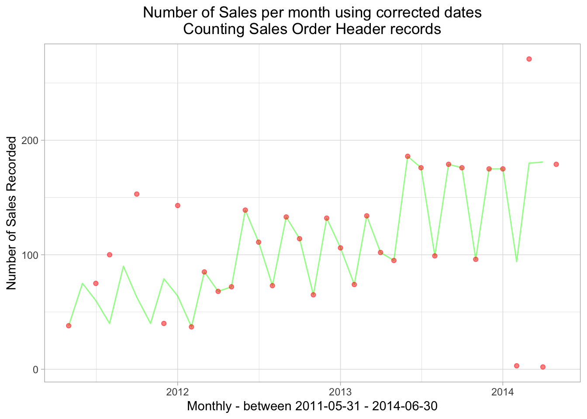

# Asking Business Questions From a Single Table {#chapter_exploring-a-single-table}

> This chapter explores:
>
>   * Issues that come up when investigating a single table from a business perspective
>   * Show the multiple data anomalies found in a single AdventureWorks table (*salesorderheader*)
>   * The interplay between "data questions" and "business questions"

The previous chapter has demonstrated some of the automated techniques for showing what's in a table using some standard R functions and packages.  Now we demonstrate a step-by-step process of making sense of what's in one table with more of a business perspective.  We illustrate the kind of detective work that's often involved as we investigate the *organizational meaning* of the data in a table.  We'll investigate the `salesorderheader` table in the `sales` schema in this example to understand the sales profile of the "AdventureWorks" business.  We show that there are quite a few interpretation issues even when we are examining just 3 out of the 25 columns in one table.

For this kind of detective work we are seeking to understand the following elements separately and as they interact with each other:

  * What data is stored in the database
  * How information is represented
  * How the data is entered at a day-to-day level to represent business activities
  * How the business itself is changing over time

## Setup our standard working environment


Use these libraries:

```r
library(tidyverse)
library(DBI)
library(RPostgres)
library(connections)
library(glue)
require(knitr)
library(dbplyr)
library(sqlpetr)
library(bookdown)
library(here)
library(lubridate)
library(gt)
library(scales)
theme_set(theme_light())
```

Connect to `adventureworks`.  In an interactive session we prefer to use `connections::connection_open` instead of dbConnect


```r
sp_docker_start("adventureworks")
Sys.sleep(sleep_default)
con <- dbConnect(
  RPostgres::Postgres(),
  # without the previous and next lines, some functions fail with bigint data 
  #   so change int64 to integer
  bigint = "integer",  
  host = "localhost",
  port = 5432,
  user = "postgres",
  password = "postgres",
  dbname = "adventureworks")
```

Some queries generate big integers, so we need to include `RPostgres::Postgres()` and `bigint = "integer"` in the connections statement because some functions in the tidyverse object to the **bigint** datatype.


## A word on naming 

> You will find that many tables will have columns with the same name in an enterprise database.  For example, in the *AdventureWorks* database, almost all tables have columns named `rowguid` and `modifieddate` and there are many other examples of names that are reused throughout the database.  Duplicate columns are best renamed or deliberately dropped.  The meaning of a column depends on the table that contains it, so as you pull a column out of a table, when renaming it the collumns provenance should be reflected in the new name.
>
> Naming columns carefully (whether retrieved from the database or calculated)  will pay off, especially as our queries become more complex. Using `soh` as an abbreviation of *sales order header* to tag columns or statistics that are derived from the `salesorderheader` table, as we do in this book, is one example of an intentional naming strategy: it reminds us of the original source of the data.  You, future you, and your collaborators will appreciate the effort no matter what naming convention you adopt.  And a naming convention when rigidly applied can yield some long and ugly names.
>
> In the following example `soh` appears in different positions in the column name but it is easy to guess at a glance that the data comes from the `salesorderheader` table.
>
> Naming derived tables is just as important as naming derived columns.

## The overall AdventureWorks sales picture

We begin by looking at Sales on a yearly basis, then consider monthly sales.  We discover that half way through the period represented in the database, the business appears to begin selling online, which has very different characteristics than sales by Sales Reps.  We then look at the details of how Sales Rep sales are recorded in the system and discover a data anomaly that we can correct. 

## Annual sales

On an annual basis, are sales dollars trending up, down or flat? We begin with annual revenue and number of orders.  


```r
annual_sales <- tbl(con, in_schema("sales", "salesorderheader")) %>%
  mutate(year = substr(as.character(orderdate), 1, 4)) %>%
  group_by(year) %>%
  summarize(
    min_soh_orderdate = min(orderdate, na.rm = TRUE),
    max_soh_orderdate = max(orderdate, na.rm = TRUE),
    total_soh_dollars = round(sum(subtotal, na.rm = TRUE), 2),
    avg_total_soh_dollars = round(mean(subtotal, na.rm = TRUE), 2),
    soh_count = n()
  ) %>%
  arrange(year) %>%
  select(
    year, min_soh_orderdate, max_soh_orderdate, total_soh_dollars,
    avg_total_soh_dollars, soh_count
  ) %>% 
  collect() 
```

Note that all of this query is running on the server since the `collect()` statement is at the very end. 


```r
annual_sales %>% str()
```

```
## Classes 'tbl_df', 'tbl' and 'data.frame':	4 obs. of  6 variables:
##  $ year                 : chr  "2011" "2012" "2013" "2014"
##  $ min_soh_orderdate    : POSIXct, format: "2011-05-31" "2012-01-01" ...
##  $ max_soh_orderdate    : POSIXct, format: "2011-12-31" "2012-12-31" ...
##  $ total_soh_dollars    : num  12641672 33524301 43622479 20057929
##  $ avg_total_soh_dollars: num  7867 8563 3076 1705
##  $ soh_count            : int  1607 3915 14182 11761
```

We hang on to some date information for later use in plot titles.


```r
min_soh_dt <- min(annual_sales$min_soh_orderdate)
max_soh_dt <- max(annual_sales$max_soh_orderdate)
```

### Total sales by year


```r
ggplot(data = annual_sales, aes(x = year, y = total_soh_dollars)) +
  geom_col() +
  geom_text(aes(label = round(as.numeric(total_soh_dollars), digits = 0)), vjust = -0.25) +
  scale_y_continuous(labels = scales::dollar_format()) +
  labs(
    title = "AdventureWorks Total Sales by Year",
    x = glue("Years between ", {format(min_soh_dt, "%B %d, %Y")} , " and  ", 
            {format(max_soh_dt, "%B %d, %Y")}),
    y = "Sales $"
  )
```


Both 2011 and 2014 turn out to be are shorter time spans than the other two years, making comparison interpretation difficult.  Still, it's clear that 2013 was the best year for annual sales dollars.

### Total order volume

Comparing the number of orders per year has roughly the same overall pattern (2013 ranks highest, etc.) but the proportions between the years are quite different.


```r
ggplot(data = annual_sales, aes(x = year, y = as.numeric(soh_count))) +
  geom_col() +
  geom_text(aes(label = round(as.numeric(soh_count), digits = 0)), vjust = -0.25) +
  labs(
    title = "Total Number of orders by year",
    x = glue("Years between ", {format(min_soh_dt, "%B %d, %Y")} , " and  ", 
            {format(max_soh_dt, "%B %d, %Y")}),
    y = "Total Number of Orders"
  )
```

<div class="figure">

<p class="caption">(\#fig:Average dollars per sale - v2)Total Number of orders by year</p>
</div>

Although 2013 was the best year in terms of total number of orders, there were many more in 2014 compared with 2012.  That suggests looking at the average dollars per sale for each year.

### Average dollars per sale

```r
ggplot(data = annual_sales, aes(x = year, y = avg_total_soh_dollars)) +
  geom_col() +
  scale_y_continuous(labels = scales::dollar_format()) +
  geom_text(aes(label = round(avg_total_soh_dollars, digits = 0)), vjust = -0.25) +
  labs(
    title = "Yearly Average Dollars per Sale",
    x = glue("Years between ", {format(min_soh_dt, "%B %d, %Y")} , " to  ", 
            {format(max_soh_dt, "%B %d, %Y")}),
    y = "Average Sale Amount"
  )
```

<div class="figure">

<p class="caption">(\#fig:average dollars per sale - )Yearly Average Dollars per Sale</p>
</div>

That's a big drop between average sale of more than $7,000 in the first two years down to the $3,000 range in the last two.  There has been a remarkable change in this business.  At the same time the total number of orders shot up from less than 4,000 a year to more than 14,000.  **Why are the number of orders increasing, but the average dollar amount of a sale is dropping?  **

Perhaps monthly monthly sales has the anser.  We adapt the first query to group by month and year.

## Monthly Sales

Our next iteration drills down from annual sales dollars to monthly sales dollars. For that we download the orderdate as a date, rather than a character variable for the year.  R handles the conversion from the PostgreSQL date-time to an R date-time.  We then convert it to a simple date with a `lubridate` function.

The following query uses the [postgreSQL function `date_trunc`](https://www.postgresqltutorial.com/postgresql-date_trunc/), which is equivalent to `lubridate`'s `round_date` function in R.  If you want to push as much of the processing as possible onto the database server and thus possibly deal with smaller datasets in R, interleaving [postgreSQL functions](https://www.postgresql.org/docs/current/functions.html) into your dplyr code will help.


```r
monthly_sales <- tbl(con, in_schema("sales", "salesorderheader")) %>%
  select(orderdate, subtotal) %>%
  mutate(
    orderdate = date_trunc('month', orderdate)
  ) %>%
  group_by(orderdate) %>%
  summarize(
    total_soh_dollars = round(sum(subtotal, na.rm = TRUE), 2),
    avg_total_soh_dollars = round(mean(subtotal, na.rm = TRUE), 2),
    soh_count = n()
  ) %>% 
  show_query() %>% 
  collect() 
```

```
## <SQL>
## SELECT "orderdate", ROUND((SUM("subtotal")) :: numeric, 2) AS "total_soh_dollars", ROUND((AVG("subtotal")) :: numeric, 2) AS "avg_total_soh_dollars", COUNT(*) AS "soh_count"
## FROM (SELECT date_trunc('month', "orderdate") AS "orderdate", "subtotal"
## FROM sales.salesorderheader) "dbplyr_004"
## GROUP BY "orderdate"
```

> Note that ` date_trunc('month', orderdate)` gets passed through exactly "as is."

In many cases we don't really care whether our queries are executed by R or by the SQL server, but if we do care we need to substitute the `postgreSQL` equivalent for the R functions we might ordinarily use.  In those cases we have to check whether functions from R packages like `lubridate` and the equivalent `postgreSQL` functions are exactly alike.  Often they are subtly different: in the previous query the `postgreSQL` function produces a `POSIXct` column, not a `Date` so we need to tack on a mutate function once the data is on the R side as shown here:


```r
monthly_sales <-  monthly_sales %>% 
  mutate(orderdate = as.Date(orderdate))
```

Next let's plot the monthly sales data:


```r
ggplot(data = monthly_sales, aes(x = orderdate, y = total_soh_dollars)) +
  geom_col() +
  scale_y_continuous(labels = dollar) +
  theme(plot.title = element_text(hjust = 0.5)) + 
  labs(
    title = glue("Sales by Month\n", {format(min_soh_dt, "%B %d, %Y")} , " to  ", 
            {format(max_soh_dt, "%B %d, %Y")}),
    x = "Month",
    y = "Sales Dollars"
  )
```

<div class="figure">

<p class="caption">(\#fig:Total monthly sales bar chart)Total Monthly Sales</p>
</div>

That graph doesn't show how the business might have changed, but it is remarkable how much variation there is from one month to another -- particularly in 2012 and 2014.

### Check lagged monthly data

Because of the  month-over-month sales  variation. We'll use `dplyr::lag` to help find the delta and later visualize just how much month-to-month difference there is.


```r
monthly_sales <- arrange(monthly_sales, orderdate)

monthly_sales_lagged <- monthly_sales %>%
  mutate(monthly_sales_change = (dplyr::lag(total_soh_dollars)) - total_soh_dollars)

monthly_sales_lagged[is.na(monthly_sales_lagged)] = 0
```


```r
median(monthly_sales_lagged$monthly_sales_change, na.rm = TRUE)
```

```
## [1] -221690.505
```

```r
(sum_lags <- summary(monthly_sales_lagged$monthly_sales_change))
```

```
##        Min.     1st Qu.      Median        Mean     3rd Qu.        Max. 
## -5879806.05 -1172995.19  -221690.51    11968.42  1159252.70  5420357.17
```

The average month over month change in sales looks OK ($ 11,968) although the Median is negative: $ 11,968. There is a very wide spread in our month-over-month sales data between the lower and upper quartile. We can plot the variation as follows:


```r
ggplot(monthly_sales_lagged, aes(x = orderdate, y = monthly_sales_change)) +
  scale_x_date(date_breaks = "year", date_labels = "%Y", date_minor_breaks = "3 months") +
  geom_line() +
  # geom_point() +
  scale_y_continuous(limits = c(-6000000,5500000), labels = scales::dollar_format()) +
  theme(plot.title = element_text(hjust = .5)) + 
  labs(
    title = glue(
      "Monthly Sales Change \n",
      "Between ", {format(min_soh_dt, "%B %d, %Y")} , " and  ", 
            {format(max_soh_dt, "%B %d, %Y")}
    ),
    x = "Month",
    y = "Dollar Change"
  )
```

<div class="figure">

<p class="caption">(\#fig:unnamed-chunk-4)Monthly Sales Change</p>
</div>

It looks like the big change in the business occurred in the summer of 2013 when the number of orders jumped but the dollar volume just continued to bump along.

### Comparing dollars and orders to a base year

To look at dollars and the number of orders together, we compare the monthly data to the yearly average for 2011.


```r
start_year <- monthly_sales %>%
  mutate(yr = year(orderdate)) %>%
  group_by(yr) %>%
  summarize(
    total_soh_dollars = sum(total_soh_dollars),
    soh_count = sum(soh_count),
    n_months = n(),
    avg_dollars = total_soh_dollars / n_months,
    avg_count = soh_count / n_months
  ) %>%
  filter(yr == min(yr))
```

Use 2011 as a baseline:


```r
start_year
```

```
## # A tibble: 1 x 6
##      yr total_soh_dollars soh_count n_months avg_dollars avg_count
##   <dbl>             <dbl>     <int>    <int>       <dbl>     <dbl>
## 1  2011         12641672.      1607        8    1580209.      201.
```

Express monthly data relative to 2011`


```r
monthly_sales_base_year_normalized_to_2011 <- monthly_sales %>%
  mutate(
    dollars = (100 * total_soh_dollars) / start_year$avg_dollars,
    number_of_orders = (100 * soh_count) / start_year$avg_count
  ) %>%
  ungroup()

monthly_sales_base_year_normalized_to_2011 <- monthly_sales_base_year_normalized_to_2011 %>%
  select(orderdate, dollars, `# of orders` = number_of_orders) %>%
  pivot_longer(-orderdate,
    names_to = "relative_to_2011_average",
    values_to = "amount"
  )

monthly_sales_base_year_normalized_to_2011 %>%
  ggplot(aes(orderdate, amount, color = relative_to_2011_average)) +
  geom_line() +
  geom_hline(yintercept = 100) +
  scale_x_date(date_labels = "%Y-%m", date_breaks = "6 months") +
  labs(
    title = glue(
      "Adventureworks Normalized Monthly Sales\n",
      "Number of Sales Orders and Dollar Totals\n",
      {format(min_soh_dt, "%B %d, %Y")} , " to  ", 
            {format(max_soh_dt, "%B %d, %Y")}),
    x = "Date",
    y = "",
    color = "% change from\n 2011 average"
  ) +
  theme(legend.position = c(.3,.75))
```

<div class="figure">

<p class="caption">(\#fig:unnamed-chunk-7)Miscellaneous plots</p>
</div>

## The effect of online sales

We suspect that the business has changed a lot with the advent of online orders so we check the impact of `onlineorderflag` on annual sales.  The `onlineorderflag` indicates which sales channel accounted for the sale, **Sales Reps** or **Online**.

### Add `onlineorderflag` to our annual sales query


```r
annual_sales_w_channel <- tbl(con, in_schema("sales", "salesorderheader")) %>%
  select(orderdate, subtotal, onlineorderflag) %>%
  collect() %>%
  mutate(
    orderdate = date(orderdate),
    orderdate = round_date(orderdate, "year"),
    onlineorderflag = if_else(onlineorderflag == FALSE,
      "Sales Rep", "Online"
    ),
    onlineorderflag = as.factor(onlineorderflag)
  ) %>%
  group_by(orderdate, onlineorderflag) %>%
  summarize(
    min_soh_orderdate = min(orderdate, na.rm = TRUE),
    max_soh_orderdate = max(orderdate, na.rm = TRUE),
    total_soh_dollars = round(sum(subtotal, na.rm = TRUE), 2),
    avg_total_soh_dollars = round(mean(subtotal, na.rm = TRUE), 2),
    soh_count = n()
  ) %>%
  select(
    orderdate, onlineorderflag, min_soh_orderdate,
    max_soh_orderdate, total_soh_dollars,
    avg_total_soh_dollars, soh_count
  )
```

Note that we are creating a factor and doing most of the calculations on the R side, not on the DBMS side.

### Annual Sales comparison

Start by looking at total sales.


```r
ggplot(data = annual_sales_w_channel, aes(x = orderdate, y = total_soh_dollars)) +
  geom_col() +
  scale_y_continuous(labels = scales::dollar_format()) +
  facet_wrap("onlineorderflag") +
  labs(
    title = "AdventureWorks Sales Dollars by Year",
    caption = glue( "Between ", {format(min_soh_dt, "%B %d, %Y")} , " - ", 
            {format(max_soh_dt, "%B %d, %Y")}),
    subtitle = "Comparing Online and Sales Rep sales channels",
    x = "Year",
    y = "Sales $"
  )
```

<div class="figure">

<p class="caption">(\#fig:Calculate annual sales dollars )Sales Channel Breakdown</p>
</div>

Based on annual sales, it looks like there are two businesses represented in the AdventureWorks database that have very different growth profiles. 

### Order volume comparison


```r
ggplot(data = annual_sales_w_channel, aes(x = orderdate, y = as.numeric(soh_count))) +
  geom_col() +
  facet_wrap("onlineorderflag") +
  labs(
    title = "AdventureWorks Number of orders per Year",
    caption = glue( "Between ", {format(min_soh_dt, "%B %d, %Y")} , " - ", 
            {format(max_soh_dt, "%B %d, %Y")}),
    subtitle = "Comparing Online and Sales Rep sales channels",
    x = "Year",
    y = "Total number of orders"
  )
```

<div class="figure">

<p class="caption">(\#fig:average dollars per sale - v4)Average Dollars by Channel</p>
</div>

Comparing Online and Sales Rep sales, the difference in the number of orders is even more striking than the difference between annual sales.

### Comparing average order size: **Sales Reps** to **Online** orders


```r
ggplot(data = annual_sales_w_channel, aes(x = orderdate, y = avg_total_soh_dollars)) +
  geom_col() +
  facet_wrap("onlineorderflag") +
  scale_y_continuous(labels = scales::dollar_format()) +
  labs(
    title = "AdventureWorks Average Dollars per Sale",
    x = glue( "Year - between ", {format(min_soh_dt, "%B %d, %Y")} , " - ", 
            {format(max_soh_dt, "%B %d, %Y")}),
    y = "Average sale amount"
  )
```

<div class="figure">

<p class="caption">(\#fig:average dollars per sale 3)Sales Rep to Online comparison</p>
</div>


## Impact of order type on monthly sales

To dig into the difference between **Sales Rep** and **Online** sales we can look at monthly data.

### Retrieve monthly sales with the `onlineorderflag` 

This query puts the `collect` statement earlier than the previous queries.


```r
monthly_sales_w_channel <- tbl(con, in_schema("sales", "salesorderheader")) %>%
  select(orderdate, subtotal, onlineorderflag) %>%
  collect() %>% # From here on we're in R
  mutate(
    orderdate = date(orderdate),
    orderdate = floor_date(orderdate, unit = "month"),
    onlineorderflag = if_else(onlineorderflag == FALSE,
      "Sales Rep", "Online")
  ) %>% 
  group_by(orderdate, onlineorderflag) %>%
  summarize(
    min_soh_orderdate = min(orderdate, na.rm = TRUE),
    max_soh_orderdate = max(orderdate, na.rm = TRUE),
    total_soh_dollars = round(sum(subtotal, na.rm = TRUE), 2),
    avg_total_soh_dollars = round(mean(subtotal, na.rm = TRUE), 2),
    soh_count = n()
  ) %>%
  ungroup()
```


```r
monthly_sales_w_channel %>%
  rename(`Sales Channel` = onlineorderflag) %>%
  group_by(`Sales Channel`) %>%
  summarize(
    unique_dates = n(),
    start_date = min(min_soh_orderdate),
    end_date = max(max_soh_orderdate),
    total_sales = round(sum(total_soh_dollars)), 
    days_span = end_date - start_date
  ) %>%
  gt()
```

<!--html_preserve--><style>html {
  font-family: -apple-system, BlinkMacSystemFont, 'Segoe UI', Roboto, Oxygen, Ubuntu, Cantarell, 'Helvetica Neue', 'Fira Sans', 'Droid Sans', Arial, sans-serif;
}

#pzveloiefp .gt_table {
  display: table;
  border-collapse: collapse;
  margin-left: auto;
  /* table.margin.left */
  margin-right: auto;
  /* table.margin.right */
  color: #333333;
  font-size: 16px;
  /* table.font.size */
  background-color: #FFFFFF;
  /* table.background.color */
  width: auto;
  /* table.width */
  border-top-style: solid;
  /* table.border.top.style */
  border-top-width: 2px;
  /* table.border.top.width */
  border-top-color: #A8A8A8;
  /* table.border.top.color */
  border-bottom-style: solid;
  /* table.border.bottom.style */
  border-bottom-width: 2px;
  /* table.border.bottom.width */
  border-bottom-color: #A8A8A8;
  /* table.border.bottom.color */
}

#pzveloiefp .gt_heading {
  background-color: #FFFFFF;
  /* heading.background.color */
  border-bottom-color: #FFFFFF;
  /* table.background.color */
  border-left-style: hidden;
  /* heading.border.lr.style */
  border-left-width: 1px;
  /* heading.border.lr.width */
  border-left-color: #D3D3D3;
  /* heading.border.lr.color */
  border-right-style: hidden;
  /* heading.border.lr.style */
  border-right-width: 1px;
  /* heading.border.lr.width */
  border-right-color: #D3D3D3;
  /* heading.border.lr.color */
}

#pzveloiefp .gt_title {
  color: #333333;
  font-size: 125%;
  /* heading.title.font.size */
  font-weight: initial;
  /* heading.title.font.weight */
  padding-top: 4px;
  /* heading.top.padding - not yet used */
  padding-bottom: 4px;
  border-bottom-color: #FFFFFF;
  /* table.background.color */
  border-bottom-width: 0;
}

#pzveloiefp .gt_subtitle {
  color: #333333;
  font-size: 85%;
  /* heading.subtitle.font.size */
  font-weight: initial;
  /* heading.subtitle.font.weight */
  padding-top: 0;
  padding-bottom: 4px;
  /* heading.bottom.padding - not yet used */
  border-top-color: #FFFFFF;
  /* table.background.color */
  border-top-width: 0;
}

#pzveloiefp .gt_bottom_border {
  border-bottom-style: solid;
  /* heading.border.bottom.style */
  border-bottom-width: 2px;
  /* heading.border.bottom.width */
  border-bottom-color: #D3D3D3;
  /* heading.border.bottom.color */
}

#pzveloiefp .gt_column_spanner {
  border-bottom-style: solid;
  border-bottom-width: 2px;
  border-bottom-color: #D3D3D3;
  padding-top: 4px;
  padding-bottom: 4px;
}

#pzveloiefp .gt_col_headings {
  border-top-style: solid;
  /* column_labels.border.top.style */
  border-top-width: 2px;
  /* column_labels.border.top.width */
  border-top-color: #D3D3D3;
  /* column_labels.border.top.color */
  border-bottom-style: solid;
  /* column_labels.border.bottom.style */
  border-bottom-width: 2px;
  /* column_labels.border.bottom.width */
  border-bottom-color: #D3D3D3;
  /* column_labels.border.bottom.color */
  border-left-style: none;
  /* column_labels.border.lr.style */
  border-left-width: 1px;
  /* column_labels.border.lr.width */
  border-left-color: #D3D3D3;
  /* column_labels.border.lr.color */
  border-right-style: none;
  /* column_labels.border.lr.style */
  border-right-width: 1px;
  /* column_labels.border.lr.width */
  border-right-color: #D3D3D3;
  /* column_labels.border.lr.color */
}

#pzveloiefp .gt_col_heading {
  color: #333333;
  background-color: #FFFFFF;
  /* column_labels.background.color */
  font-size: 100%;
  /* column_labels.font.size */
  font-weight: initial;
  /* column_labels.font.weight */
  text-transform: inherit;
  /* column_labels.text_transform */
  vertical-align: middle;
  padding: 5px;
  margin: 10px;
  overflow-x: hidden;
}

#pzveloiefp .gt_sep_right {
  border-right: 5px solid #FFFFFF;
}

#pzveloiefp .gt_group_heading {
  padding: 8px;
  /* row_group.padding */
  color: #333333;
  background-color: #FFFFFF;
  /* row_group.background.color */
  font-size: 100%;
  /* row_group.font.size */
  font-weight: initial;
  /* row_group.font.weight */
  text-transform: inherit;
  /* row_group.text_transform */
  border-top-style: solid;
  /* row_group.border.top.style */
  border-top-width: 2px;
  /* row_group.border.top.width */
  border-top-color: #D3D3D3;
  /* row_group.border.top.color */
  border-bottom-style: solid;
  /* row_group.border.bottom.style */
  border-bottom-width: 2px;
  /* row_group.border.bottom.width */
  border-bottom-color: #D3D3D3;
  /* row_group.border.bottom.color */
  border-left-style: none;
  /* row_group.border.left.style */
  border-left-width: 1px;
  /* row_group.border.left.width */
  border-left-color: #D3D3D3;
  /* row_group.border.left.color */
  border-right-style: none;
  /* row_group.border.right.style */
  border-right-width: 1px;
  /* row_group.border.right.width */
  border-right-color: #D3D3D3;
  /* row_group.border.right.color */
  vertical-align: middle;
}

#pzveloiefp .gt_empty_group_heading {
  padding: 0.5px;
  color: #333333;
  background-color: #FFFFFF;
  /* row_group.background.color */
  font-size: 100%;
  /* row_group.font.size */
  font-weight: initial;
  /* row_group.font.weight */
  border-top-style: solid;
  /* row_group.border.top.style */
  border-top-width: 2px;
  /* row_group.border.top.width */
  border-top-color: #D3D3D3;
  /* row_group.border.top.color */
  border-bottom-style: solid;
  /* row_group.border.bottom.style */
  border-bottom-width: 2px;
  /* row_group.border.bottom.width */
  border-bottom-color: #D3D3D3;
  /* row_group.border.bottom.color */
  vertical-align: middle;
}

#pzveloiefp .gt_striped {
  background-color: #8080800D;
  /* row.striping.background_color */
}

#pzveloiefp .gt_from_md > :first-child {
  margin-top: 0;
}

#pzveloiefp .gt_from_md > :last-child {
  margin-bottom: 0;
}

#pzveloiefp .gt_row {
  padding-top: 8px;
  /* data_row.padding */
  padding-bottom: 8px;
  /* data_row.padding */
  padding-left: 5px;
  padding-right: 5px;
  margin: 10px;
  border-top-style: solid;
  /* table_body.hlines.style */
  border-top-width: 1px;
  /* table_body.hlines.width */
  border-top-color: #D3D3D3;
  /* table_body.hlines.color */
  border-left-style: none;
  /* table_body.vlines.style */
  border-left-width: 1px;
  /* table_body.vlines.width */
  border-left-color: #D3D3D3;
  /* table_body.vlines.color */
  border-right-style: none;
  /* table_body.vlines.style */
  border-right-width: 1px;
  /* table_body.vlines.width */
  border-right-color: #D3D3D3;
  /* table_body.vlines.color */
  vertical-align: middle;
  overflow-x: hidden;
}

#pzveloiefp .gt_stub {
  color: #333333;
  background-color: #FFFFFF;
  /* stub.background.color */
  font-weight: initial;
  /* stub.font.weight */
  text-transform: inherit;
  /* stub.text_transform */
  border-right-style: solid;
  /* stub.border.style */
  border-right-width: 2px;
  /* stub.border.width */
  border-right-color: #D3D3D3;
  /* stub.border.color */
  padding-left: 12px;
}

#pzveloiefp .gt_summary_row {
  color: #333333;
  background-color: #FFFFFF;
  /* summary_row.background.color */
  text-transform: inherit;
  /* summary_row.text_transform */
  padding-top: 8px;
  /* summary_row.padding */
  padding-bottom: 8px;
  /* summary_row.padding */
  padding-left: 5px;
  padding-right: 5px;
}

#pzveloiefp .gt_first_summary_row {
  padding-top: 8px;
  /* summary_row.padding */
  padding-bottom: 8px;
  /* summary_row.padding */
  padding-left: 5px;
  padding-right: 5px;
  border-top-style: solid;
  /* summary_row.border.style */
  border-top-width: 2px;
  /* summary_row.border.width */
  border-top-color: #D3D3D3;
  /* summary_row.border.color */
}

#pzveloiefp .gt_grand_summary_row {
  color: #333333;
  background-color: #FFFFFF;
  /* grand_summary_row.background.color */
  text-transform: inherit;
  /* grand_summary_row.text_transform */
  padding-top: 8px;
  /* grand_summary_row.padding */
  padding-bottom: 8px;
  /* grand_summary_row.padding */
  padding-left: 5px;
  padding-right: 5px;
}

#pzveloiefp .gt_first_grand_summary_row {
  padding-top: 8px;
  /* grand_summary_row.padding */
  padding-bottom: 8px;
  /* grand_summary_row.padding */
  padding-left: 5px;
  padding-right: 5px;
  border-top-style: double;
  /* grand_summary_row.border.style */
  border-top-width: 6px;
  /* grand_summary_row.border.width */
  border-top-color: #D3D3D3;
  /* grand_summary_row.border.color */
}

#pzveloiefp .gt_table_body {
  border-top-style: solid;
  /* table_body.border.top.style */
  border-top-width: 2px;
  /* table_body.border.top.width */
  border-top-color: #D3D3D3;
  /* table_body.border.top.color */
  border-bottom-style: solid;
  /* table_body.border.bottom.style */
  border-bottom-width: 2px;
  /* table_body.border.bottom.width */
  border-bottom-color: #D3D3D3;
  /* table_body.border.bottom.color */
}

#pzveloiefp .gt_footnotes {
  color: #333333;
  background-color: #FFFFFF;
  /* footnotes.background.color */
  border-bottom-style: none;
  /* footnotes.border.bottom.style */
  border-bottom-width: 2px;
  /* footnotes.border.bottom.width */
  border-bottom-color: #D3D3D3;
  /* footnotes.border.bottom.color */
  border-left-style: none;
  /* footnotes.border.lr.color */
  border-left-width: 2px;
  /* footnotes.border.lr.color */
  border-left-color: #D3D3D3;
  /* footnotes.border.lr.color */
  border-right-style: none;
  /* footnotes.border.lr.color */
  border-right-width: 2px;
  /* footnotes.border.lr.color */
  border-right-color: #D3D3D3;
  /* footnotes.border.lr.color */
}

#pzveloiefp .gt_footnote {
  margin: 0px;
  font-size: 90%;
  /* footnotes.font.size */
  padding: 4px;
  /* footnotes.padding */
}

#pzveloiefp .gt_sourcenotes {
  color: #333333;
  background-color: #FFFFFF;
  /* source_notes.background.color */
  border-bottom-style: none;
  /* source_notes.border.bottom.style */
  border-bottom-width: 2px;
  /* source_notes.border.bottom.width */
  border-bottom-color: #D3D3D3;
  /* source_notes.border.bottom.color */
  border-left-style: none;
  /* source_notes.border.lr.style */
  border-left-width: 2px;
  /* source_notes.border.lr.style */
  border-left-color: #D3D3D3;
  /* source_notes.border.lr.style */
  border-right-style: none;
  /* source_notes.border.lr.style */
  border-right-width: 2px;
  /* source_notes.border.lr.style */
  border-right-color: #D3D3D3;
  /* source_notes.border.lr.style */
}

#pzveloiefp .gt_sourcenote {
  font-size: 90%;
  /* source_notes.font.size */
  padding: 4px;
  /* source_notes.padding */
}

#pzveloiefp .gt_left {
  text-align: left;
}

#pzveloiefp .gt_center {
  text-align: center;
}

#pzveloiefp .gt_right {
  text-align: right;
  font-variant-numeric: tabular-nums;
}

#pzveloiefp .gt_font_normal {
  font-weight: normal;
}

#pzveloiefp .gt_font_bold {
  font-weight: bold;
}

#pzveloiefp .gt_font_italic {
  font-style: italic;
}

#pzveloiefp .gt_super {
  font-size: 65%;
}

#pzveloiefp .gt_footnote_marks {
  font-style: italic;
  font-size: 65%;
}
</style>
<div id="pzveloiefp" style="overflow-x:auto;overflow-y:auto;width:auto;height:auto;"><table class="gt_table">
  
  <thead class="gt_col_headings">
    <tr>
      <th class="gt_col_heading gt_columns_bottom_border gt_left" rowspan="1" colspan="1">Sales Channel</th>
      <th class="gt_col_heading gt_columns_bottom_border gt_center" rowspan="1" colspan="1">unique_dates</th>
      <th class="gt_col_heading gt_columns_bottom_border gt_left" rowspan="1" colspan="1">start_date</th>
      <th class="gt_col_heading gt_columns_bottom_border gt_left" rowspan="1" colspan="1">end_date</th>
      <th class="gt_col_heading gt_columns_bottom_border gt_right" rowspan="1" colspan="1">total_sales</th>
      <th class="gt_col_heading gt_columns_bottom_border gt_center" rowspan="1" colspan="1">days_span</th>
    </tr>
  </thead>
  <tbody class="gt_table_body">
    <tr>
      <td class="gt_row gt_left">Online</td>
      <td class="gt_row gt_center">38</td>
      <td class="gt_row gt_left">2011-05-01</td>
      <td class="gt_row gt_left">2014-06-01</td>
      <td class="gt_row gt_right">29358677</td>
      <td class="gt_row gt_center">1127 days</td>
    </tr>
    <tr>
      <td class="gt_row gt_left gt_striped">Sales Rep</td>
      <td class="gt_row gt_center gt_striped">34</td>
      <td class="gt_row gt_left gt_striped">2011-05-01</td>
      <td class="gt_row gt_left gt_striped">2014-05-01</td>
      <td class="gt_row gt_right gt_striped">80487704</td>
      <td class="gt_row gt_center gt_striped">1096 days</td>
    </tr>
  </tbody>
  
  
</table></div><!--/html_preserve-->

As this table shows, the **Sales Rep** dates don't match the **Online** dates.  They start on the same date, but have a different end.  The **Online** dates include 2 months that are not included in the Sales Rep sales (which are the main sales channel by dollar volume).

### Monthly variation compared to a trend line

Jumping to the trend line comparison, we see that the big the source of variation is on the Sales Rep side.


```r
ggplot(
  data = monthly_sales_w_channel,
  aes(
    x = orderdate, y = total_soh_dollars
  )
) +
  geom_line() +
  geom_smooth(se = FALSE) +
  facet_grid("onlineorderflag", scales = "free") +
  scale_y_continuous(labels = dollar) +
  scale_x_date(date_breaks = "year", date_labels = "%Y", date_minor_breaks = "3 months") +
  theme(plot.title = element_text(hjust = .5)) + # Center ggplot title
  labs(
    title = glue(
      "AdventureWorks Monthly Sales Trend"
    ),
    x = glue( "Month - between ", {format(min_soh_dt, "%B %d, %Y")} , " - ", 
           {format(max_soh_dt, "%B %d, %Y")}),
    y = "Sales Dollars"
  )
```

<div class="figure">

<p class="caption">(\#fig:average dollars)Monthly Sales Trend</p>
</div>

The **monthly** gyrations are much larger on the Sales Rep side, amounting to differences in a million dollars compared to small monthly variations of around $25,000 for the Online orders.

### Compare monthly lagged data by Sales Channel

First consider month-to-month change.

```r
monthly_sales_w_channel_lagged_by_month <- monthly_sales_w_channel %>%
  group_by(onlineorderflag) %>%
  mutate(
    lag_soh_count = lag(soh_count, 1),
    lag_soh_total_dollars = lag(total_soh_dollars, 1),
    pct_monthly_soh_dollar_change =
      (total_soh_dollars - lag_soh_total_dollars) / lag_soh_total_dollars * 100,
    pct_monthly_soh_count_change =
      (soh_count - lag_soh_count) / lag_soh_count * 100
  )
```


```r
ggplot(monthly_sales_w_channel_lagged_by_month, aes(x = orderdate, y = pct_monthly_soh_dollar_change)) +
  scale_x_date(date_breaks = "year", date_labels = "%Y", date_minor_breaks = "3 months") +
  scale_y_continuous() +
  facet_grid("onlineorderflag", scale = "free") +
  geom_line() +
  theme(plot.title = element_text(hjust = .5)) + # Center ggplot title
  labs(
    title = glue(
      "Monthly Percent Sales Change \n",
      "Comparing Online to Sales Rep Sales"
    ),
    x = paste0("Month - between ", 
               glue({format(min_soh_dt, "%B %d, %Y")} , " - ", 
           {format(max_soh_dt, "%B %d, %Y")})),
    y = "% Dollar Change"
  )
```

<div class="figure">

<p class="caption">(\#fig:unnamed-chunk-10)Percent change - Channel Comparison</p>
</div>

For **Sales Reps** it looks like the variation is in the number of orders, not just dollars, as shown in the following plot.

```r
ggplot(monthly_sales_w_channel_lagged_by_month, aes(x = orderdate, y = pct_monthly_soh_count_change)) +
  scale_x_date(date_breaks = "year", date_labels = "%Y", date_minor_breaks = "3 months") +
  facet_grid("onlineorderflag" , scales = "free") +
  geom_line() +
  theme(plot.title = element_text(hjust = .5)) + # Center ggplot title
  labs(
    title = glue(
      "Monthly Order Volume Change \n",
      "Comparing Online to Sales Rep Sales\n",
      glue({format(min_soh_dt, "%B %d, %Y")} , " - ", 
           {format(max_soh_dt, "%B %d, %Y")})
    ),
    x = "Month",
    y = "Change number of orders"
  )
```

<div class="figure">

<p class="caption">(\#fig:unnamed-chunk-11)Number of Sales Orders by Channel</p>
</div>

The last two plots may not be so illuminating.  Here's a table that might be improved.


```r
monthly_sales_w_channel_lagged_by_month %>%
  filter(abs(pct_monthly_soh_count_change) > 150 | 
         abs(pct_monthly_soh_dollar_change) > 150 ) %>% 
  ungroup() %>% 
  arrange(onlineorderflag, orderdate) %>% 
  mutate(
    total_soh_dollars = round(total_soh_dollars),
    lag_soh_total_dollars = round(lag_soh_total_dollars),
    pct_monthly_soh_dollar_change = round(pct_monthly_soh_dollar_change),
    pct_monthly_soh_count_change = round(pct_monthly_soh_count_change)) %>% 
  select(orderdate, onlineorderflag,  total_soh_dollars, lag_soh_total_dollars, 
         soh_count, lag_soh_count, pct_monthly_soh_dollar_change, pct_monthly_soh_count_change) %>% 
  # names()
  gt() %>%
  fmt_number(
    columns = c(3:4), decimals = 0) %>%
  fmt_percent(
    columns = c(7:8), decimals = 0) %>%
  cols_label(
    onlineorderflag = "Channel",
    total_soh_dollars = "$ this Month",
    lag_soh_total_dollars = "$ last Month",
    soh_count = "# this Month",
    lag_soh_count = "# last Month",
    pct_monthly_soh_dollar_change = "$ change",
    pct_monthly_soh_count_change = "# change"
  )
```

<!--html_preserve--><style>html {
  font-family: -apple-system, BlinkMacSystemFont, 'Segoe UI', Roboto, Oxygen, Ubuntu, Cantarell, 'Helvetica Neue', 'Fira Sans', 'Droid Sans', Arial, sans-serif;
}

#dbgvzfontn .gt_table {
  display: table;
  border-collapse: collapse;
  margin-left: auto;
  /* table.margin.left */
  margin-right: auto;
  /* table.margin.right */
  color: #333333;
  font-size: 16px;
  /* table.font.size */
  background-color: #FFFFFF;
  /* table.background.color */
  width: auto;
  /* table.width */
  border-top-style: solid;
  /* table.border.top.style */
  border-top-width: 2px;
  /* table.border.top.width */
  border-top-color: #A8A8A8;
  /* table.border.top.color */
  border-bottom-style: solid;
  /* table.border.bottom.style */
  border-bottom-width: 2px;
  /* table.border.bottom.width */
  border-bottom-color: #A8A8A8;
  /* table.border.bottom.color */
}

#dbgvzfontn .gt_heading {
  background-color: #FFFFFF;
  /* heading.background.color */
  border-bottom-color: #FFFFFF;
  /* table.background.color */
  border-left-style: hidden;
  /* heading.border.lr.style */
  border-left-width: 1px;
  /* heading.border.lr.width */
  border-left-color: #D3D3D3;
  /* heading.border.lr.color */
  border-right-style: hidden;
  /* heading.border.lr.style */
  border-right-width: 1px;
  /* heading.border.lr.width */
  border-right-color: #D3D3D3;
  /* heading.border.lr.color */
}

#dbgvzfontn .gt_title {
  color: #333333;
  font-size: 125%;
  /* heading.title.font.size */
  font-weight: initial;
  /* heading.title.font.weight */
  padding-top: 4px;
  /* heading.top.padding - not yet used */
  padding-bottom: 4px;
  border-bottom-color: #FFFFFF;
  /* table.background.color */
  border-bottom-width: 0;
}

#dbgvzfontn .gt_subtitle {
  color: #333333;
  font-size: 85%;
  /* heading.subtitle.font.size */
  font-weight: initial;
  /* heading.subtitle.font.weight */
  padding-top: 0;
  padding-bottom: 4px;
  /* heading.bottom.padding - not yet used */
  border-top-color: #FFFFFF;
  /* table.background.color */
  border-top-width: 0;
}

#dbgvzfontn .gt_bottom_border {
  border-bottom-style: solid;
  /* heading.border.bottom.style */
  border-bottom-width: 2px;
  /* heading.border.bottom.width */
  border-bottom-color: #D3D3D3;
  /* heading.border.bottom.color */
}

#dbgvzfontn .gt_column_spanner {
  border-bottom-style: solid;
  border-bottom-width: 2px;
  border-bottom-color: #D3D3D3;
  padding-top: 4px;
  padding-bottom: 4px;
}

#dbgvzfontn .gt_col_headings {
  border-top-style: solid;
  /* column_labels.border.top.style */
  border-top-width: 2px;
  /* column_labels.border.top.width */
  border-top-color: #D3D3D3;
  /* column_labels.border.top.color */
  border-bottom-style: solid;
  /* column_labels.border.bottom.style */
  border-bottom-width: 2px;
  /* column_labels.border.bottom.width */
  border-bottom-color: #D3D3D3;
  /* column_labels.border.bottom.color */
  border-left-style: none;
  /* column_labels.border.lr.style */
  border-left-width: 1px;
  /* column_labels.border.lr.width */
  border-left-color: #D3D3D3;
  /* column_labels.border.lr.color */
  border-right-style: none;
  /* column_labels.border.lr.style */
  border-right-width: 1px;
  /* column_labels.border.lr.width */
  border-right-color: #D3D3D3;
  /* column_labels.border.lr.color */
}

#dbgvzfontn .gt_col_heading {
  color: #333333;
  background-color: #FFFFFF;
  /* column_labels.background.color */
  font-size: 100%;
  /* column_labels.font.size */
  font-weight: initial;
  /* column_labels.font.weight */
  text-transform: inherit;
  /* column_labels.text_transform */
  vertical-align: middle;
  padding: 5px;
  margin: 10px;
  overflow-x: hidden;
}

#dbgvzfontn .gt_sep_right {
  border-right: 5px solid #FFFFFF;
}

#dbgvzfontn .gt_group_heading {
  padding: 8px;
  /* row_group.padding */
  color: #333333;
  background-color: #FFFFFF;
  /* row_group.background.color */
  font-size: 100%;
  /* row_group.font.size */
  font-weight: initial;
  /* row_group.font.weight */
  text-transform: inherit;
  /* row_group.text_transform */
  border-top-style: solid;
  /* row_group.border.top.style */
  border-top-width: 2px;
  /* row_group.border.top.width */
  border-top-color: #D3D3D3;
  /* row_group.border.top.color */
  border-bottom-style: solid;
  /* row_group.border.bottom.style */
  border-bottom-width: 2px;
  /* row_group.border.bottom.width */
  border-bottom-color: #D3D3D3;
  /* row_group.border.bottom.color */
  border-left-style: none;
  /* row_group.border.left.style */
  border-left-width: 1px;
  /* row_group.border.left.width */
  border-left-color: #D3D3D3;
  /* row_group.border.left.color */
  border-right-style: none;
  /* row_group.border.right.style */
  border-right-width: 1px;
  /* row_group.border.right.width */
  border-right-color: #D3D3D3;
  /* row_group.border.right.color */
  vertical-align: middle;
}

#dbgvzfontn .gt_empty_group_heading {
  padding: 0.5px;
  color: #333333;
  background-color: #FFFFFF;
  /* row_group.background.color */
  font-size: 100%;
  /* row_group.font.size */
  font-weight: initial;
  /* row_group.font.weight */
  border-top-style: solid;
  /* row_group.border.top.style */
  border-top-width: 2px;
  /* row_group.border.top.width */
  border-top-color: #D3D3D3;
  /* row_group.border.top.color */
  border-bottom-style: solid;
  /* row_group.border.bottom.style */
  border-bottom-width: 2px;
  /* row_group.border.bottom.width */
  border-bottom-color: #D3D3D3;
  /* row_group.border.bottom.color */
  vertical-align: middle;
}

#dbgvzfontn .gt_striped {
  background-color: #8080800D;
  /* row.striping.background_color */
}

#dbgvzfontn .gt_from_md > :first-child {
  margin-top: 0;
}

#dbgvzfontn .gt_from_md > :last-child {
  margin-bottom: 0;
}

#dbgvzfontn .gt_row {
  padding-top: 8px;
  /* data_row.padding */
  padding-bottom: 8px;
  /* data_row.padding */
  padding-left: 5px;
  padding-right: 5px;
  margin: 10px;
  border-top-style: solid;
  /* table_body.hlines.style */
  border-top-width: 1px;
  /* table_body.hlines.width */
  border-top-color: #D3D3D3;
  /* table_body.hlines.color */
  border-left-style: none;
  /* table_body.vlines.style */
  border-left-width: 1px;
  /* table_body.vlines.width */
  border-left-color: #D3D3D3;
  /* table_body.vlines.color */
  border-right-style: none;
  /* table_body.vlines.style */
  border-right-width: 1px;
  /* table_body.vlines.width */
  border-right-color: #D3D3D3;
  /* table_body.vlines.color */
  vertical-align: middle;
  overflow-x: hidden;
}

#dbgvzfontn .gt_stub {
  color: #333333;
  background-color: #FFFFFF;
  /* stub.background.color */
  font-weight: initial;
  /* stub.font.weight */
  text-transform: inherit;
  /* stub.text_transform */
  border-right-style: solid;
  /* stub.border.style */
  border-right-width: 2px;
  /* stub.border.width */
  border-right-color: #D3D3D3;
  /* stub.border.color */
  padding-left: 12px;
}

#dbgvzfontn .gt_summary_row {
  color: #333333;
  background-color: #FFFFFF;
  /* summary_row.background.color */
  text-transform: inherit;
  /* summary_row.text_transform */
  padding-top: 8px;
  /* summary_row.padding */
  padding-bottom: 8px;
  /* summary_row.padding */
  padding-left: 5px;
  padding-right: 5px;
}

#dbgvzfontn .gt_first_summary_row {
  padding-top: 8px;
  /* summary_row.padding */
  padding-bottom: 8px;
  /* summary_row.padding */
  padding-left: 5px;
  padding-right: 5px;
  border-top-style: solid;
  /* summary_row.border.style */
  border-top-width: 2px;
  /* summary_row.border.width */
  border-top-color: #D3D3D3;
  /* summary_row.border.color */
}

#dbgvzfontn .gt_grand_summary_row {
  color: #333333;
  background-color: #FFFFFF;
  /* grand_summary_row.background.color */
  text-transform: inherit;
  /* grand_summary_row.text_transform */
  padding-top: 8px;
  /* grand_summary_row.padding */
  padding-bottom: 8px;
  /* grand_summary_row.padding */
  padding-left: 5px;
  padding-right: 5px;
}

#dbgvzfontn .gt_first_grand_summary_row {
  padding-top: 8px;
  /* grand_summary_row.padding */
  padding-bottom: 8px;
  /* grand_summary_row.padding */
  padding-left: 5px;
  padding-right: 5px;
  border-top-style: double;
  /* grand_summary_row.border.style */
  border-top-width: 6px;
  /* grand_summary_row.border.width */
  border-top-color: #D3D3D3;
  /* grand_summary_row.border.color */
}

#dbgvzfontn .gt_table_body {
  border-top-style: solid;
  /* table_body.border.top.style */
  border-top-width: 2px;
  /* table_body.border.top.width */
  border-top-color: #D3D3D3;
  /* table_body.border.top.color */
  border-bottom-style: solid;
  /* table_body.border.bottom.style */
  border-bottom-width: 2px;
  /* table_body.border.bottom.width */
  border-bottom-color: #D3D3D3;
  /* table_body.border.bottom.color */
}

#dbgvzfontn .gt_footnotes {
  color: #333333;
  background-color: #FFFFFF;
  /* footnotes.background.color */
  border-bottom-style: none;
  /* footnotes.border.bottom.style */
  border-bottom-width: 2px;
  /* footnotes.border.bottom.width */
  border-bottom-color: #D3D3D3;
  /* footnotes.border.bottom.color */
  border-left-style: none;
  /* footnotes.border.lr.color */
  border-left-width: 2px;
  /* footnotes.border.lr.color */
  border-left-color: #D3D3D3;
  /* footnotes.border.lr.color */
  border-right-style: none;
  /* footnotes.border.lr.color */
  border-right-width: 2px;
  /* footnotes.border.lr.color */
  border-right-color: #D3D3D3;
  /* footnotes.border.lr.color */
}

#dbgvzfontn .gt_footnote {
  margin: 0px;
  font-size: 90%;
  /* footnotes.font.size */
  padding: 4px;
  /* footnotes.padding */
}

#dbgvzfontn .gt_sourcenotes {
  color: #333333;
  background-color: #FFFFFF;
  /* source_notes.background.color */
  border-bottom-style: none;
  /* source_notes.border.bottom.style */
  border-bottom-width: 2px;
  /* source_notes.border.bottom.width */
  border-bottom-color: #D3D3D3;
  /* source_notes.border.bottom.color */
  border-left-style: none;
  /* source_notes.border.lr.style */
  border-left-width: 2px;
  /* source_notes.border.lr.style */
  border-left-color: #D3D3D3;
  /* source_notes.border.lr.style */
  border-right-style: none;
  /* source_notes.border.lr.style */
  border-right-width: 2px;
  /* source_notes.border.lr.style */
  border-right-color: #D3D3D3;
  /* source_notes.border.lr.style */
}

#dbgvzfontn .gt_sourcenote {
  font-size: 90%;
  /* source_notes.font.size */
  padding: 4px;
  /* source_notes.padding */
}

#dbgvzfontn .gt_left {
  text-align: left;
}

#dbgvzfontn .gt_center {
  text-align: center;
}

#dbgvzfontn .gt_right {
  text-align: right;
  font-variant-numeric: tabular-nums;
}

#dbgvzfontn .gt_font_normal {
  font-weight: normal;
}

#dbgvzfontn .gt_font_bold {
  font-weight: bold;
}

#dbgvzfontn .gt_font_italic {
  font-style: italic;
}

#dbgvzfontn .gt_super {
  font-size: 65%;
}

#dbgvzfontn .gt_footnote_marks {
  font-style: italic;
  font-size: 65%;
}
</style>
<div id="dbgvzfontn" style="overflow-x:auto;overflow-y:auto;width:auto;height:auto;"><table class="gt_table">
  
  <thead class="gt_col_headings">
    <tr>
      <th class="gt_col_heading gt_columns_bottom_border gt_left" rowspan="1" colspan="1">orderdate</th>
      <th class="gt_col_heading gt_columns_bottom_border gt_left" rowspan="1" colspan="1">Channel</th>
      <th class="gt_col_heading gt_columns_bottom_border gt_right" rowspan="1" colspan="1">$ this Month</th>
      <th class="gt_col_heading gt_columns_bottom_border gt_right" rowspan="1" colspan="1">$ last Month</th>
      <th class="gt_col_heading gt_columns_bottom_border gt_center" rowspan="1" colspan="1"># this Month</th>
      <th class="gt_col_heading gt_columns_bottom_border gt_center" rowspan="1" colspan="1"># last Month</th>
      <th class="gt_col_heading gt_columns_bottom_border gt_right" rowspan="1" colspan="1">$ change</th>
      <th class="gt_col_heading gt_columns_bottom_border gt_right" rowspan="1" colspan="1"># change</th>
    </tr>
  </thead>
  <tbody class="gt_table_body">
    <tr>
      <td class="gt_row gt_left">2011-06-01</td>
      <td class="gt_row gt_left">Online</td>
      <td class="gt_row gt_right">458,911</td>
      <td class="gt_row gt_right">14,477</td>
      <td class="gt_row gt_center">141</td>
      <td class="gt_row gt_center">5</td>
      <td class="gt_row gt_right">307,000&percnt;</td>
      <td class="gt_row gt_right">272,000&percnt;</td>
    </tr>
    <tr>
      <td class="gt_row gt_left gt_striped">2013-07-01</td>
      <td class="gt_row gt_left gt_striped">Online</td>
      <td class="gt_row gt_right gt_striped">847,139</td>
      <td class="gt_row gt_right gt_striped">860,141</td>
      <td class="gt_row gt_center gt_striped">1564</td>
      <td class="gt_row gt_center gt_striped">533</td>
      <td class="gt_row gt_right gt_striped">&minus;200&percnt;</td>
      <td class="gt_row gt_right gt_striped">19,300&percnt;</td>
    </tr>
    <tr>
      <td class="gt_row gt_left">2011-07-01</td>
      <td class="gt_row gt_left">Sales Rep</td>
      <td class="gt_row gt_right">1,538,408</td>
      <td class="gt_row gt_right">489,329</td>
      <td class="gt_row gt_center">75</td>
      <td class="gt_row gt_center">38</td>
      <td class="gt_row gt_right">21,400&percnt;</td>
      <td class="gt_row gt_right">9,700&percnt;</td>
    </tr>
    <tr>
      <td class="gt_row gt_left gt_striped">2012-01-01</td>
      <td class="gt_row gt_left gt_striped">Sales Rep</td>
      <td class="gt_row gt_right gt_striped">3,356,069</td>
      <td class="gt_row gt_right gt_striped">713,117</td>
      <td class="gt_row gt_center gt_striped">143</td>
      <td class="gt_row gt_center gt_striped">40</td>
      <td class="gt_row gt_right gt_striped">37,100&percnt;</td>
      <td class="gt_row gt_right gt_striped">25,800&percnt;</td>
    </tr>
    <tr>
      <td class="gt_row gt_left">2012-03-01</td>
      <td class="gt_row gt_left">Sales Rep</td>
      <td class="gt_row gt_right">2,269,117</td>
      <td class="gt_row gt_right">882,900</td>
      <td class="gt_row gt_center">85</td>
      <td class="gt_row gt_center">37</td>
      <td class="gt_row gt_right">15,700&percnt;</td>
      <td class="gt_row gt_right">13,000&percnt;</td>
    </tr>
    <tr>
      <td class="gt_row gt_left gt_striped">2014-03-01</td>
      <td class="gt_row gt_left gt_striped">Sales Rep</td>
      <td class="gt_row gt_right gt_striped">5,526,352</td>
      <td class="gt_row gt_right gt_striped">3,231</td>
      <td class="gt_row gt_center gt_striped">271</td>
      <td class="gt_row gt_center gt_striped">3</td>
      <td class="gt_row gt_right gt_striped">17,096,000&percnt;</td>
      <td class="gt_row gt_right gt_striped">893,300&percnt;</td>
    </tr>
    <tr>
      <td class="gt_row gt_left">2014-05-01</td>
      <td class="gt_row gt_left">Sales Rep</td>
      <td class="gt_row gt_right">3,415,479</td>
      <td class="gt_row gt_right">1,285</td>
      <td class="gt_row gt_center">179</td>
      <td class="gt_row gt_center">2</td>
      <td class="gt_row gt_right">26,573,900&percnt;</td>
      <td class="gt_row gt_right">885,000&percnt;</td>
    </tr>
  </tbody>
  
  
</table></div><!--/html_preserve-->

Let's examine whether there is a large year-to-year change.


```r
monthly_sales_w_channel_lagged_by_year <- monthly_sales_w_channel %>%
  group_by(onlineorderflag) %>%
  mutate(
    pct_monthly_soh_dollar_change =
      total_soh_dollars / (lag(total_soh_dollars, 12)) * 100,
    pct_monthly_soh_count_change =
      soh_count / (lag(soh_count, 12)) * 100
  )

ggplot(
  monthly_sales_w_channel_lagged_by_year,
  aes(x = orderdate, y = pct_monthly_soh_dollar_change)
) +
  scale_x_date(
    date_breaks = "year", date_labels = "%Y",
    date_minor_breaks = "3 months"
  ) +
   scale_y_continuous(limits = c(-50, 400)) +
  facet_grid("onlineorderflag") +
  geom_line() +
  theme(plot.title = element_text(hjust = .5)) + # Center ggplot title
  labs(
    title = glue(
      "Year-on-Year Change in Total Monthly Sales\n",
      "Comparing Online to Sales Rep Sales"
    ),
    x = paste0("Month - between ", min_soh_dt, " - ", max_soh_dt),
    y = "% Dollar Change"
  )
```

<div class="figure">

<p class="caption">(\#fig:unnamed-chunk-12)Lagged Sales by Channel</p>
</div>

That's much more stable than the month-to-month change.

> ??? Comparing the number of sales orders year over year by month for 2013 and 2012, one can see that the 2013 sales are between 1.2 and 1.8 times larger than the corresponding month of 2012 from January through June.  In July the 2013 sales are 5 to 6 times the 2012 sales orders. ???

This trend continues into 2014 before the number of sales plummet to just 1.3 time in June.

We suspect that the business has changed a lot with the advent of **Online** orders.

## Detect and diagnose the day of the month problem

There have been several indications that Sales Rep sales are recorded once a month while Online sales are recorded on a daily basis.

### Sales Rep Orderdate Distribution

Look at the dates when sales are entered for sales by **Sales Reps**.  The following query / plot combination shows this pattern.  and the exception for transactions entered on the first day of the month.


```r
  tbl(con, in_schema("sales", "salesorderheader")) %>%
  filter(onlineorderflag == FALSE) %>% # Drop online orders
  mutate(orderday = day(orderdate)) %>%
  count(orderday, name = "Orders") %>% 
  collect() %>% 
  full_join(tibble(orderday = seq(1:31))) %>% 
  mutate(orderday = as.factor(orderday)) %>% 
  ggplot(aes(orderday, Orders)) +
  geom_col() +
  coord_flip() +
  labs(title = "The first day of the month looks odd",
       x = "Day Number")
```

```
## Joining, by = "orderday"
```

```
## Warning: Removed 26 rows containing missing values (position_stack).
```

<div class="figure">

<p class="caption">(\#fig:unnamed-chunk-13)Days of the month with Sales Rep activity recorded</p>
</div>

We can check on which months have orders entered on the first of the month.

```r
sales_rep_day_of_month_sales <- tbl(con, in_schema("sales", "salesorderheader")) %>%
  filter(onlineorderflag == FALSE) %>% # Drop online orders
  select(orderdate, subtotal) %>%
  mutate(
    year = year(orderdate),
    month = month(orderdate),
    day = day(orderdate)
  ) %>%
  count(year, month, day) %>% 
  collect() %>%
  pivot_wider(names_from = day, values_from = n, names_prefix = "day_", values_fill = 0 ) %>% 
  as.data.frame() %>% 
  select(year, month, day_1, day_28, day_29, day_30, day_31) %>% 
  filter(day_1 > 0) %>% 
  arrange(year, month)

sales_rep_day_of_month_sales
```

```
##   year month day_1 day_28 day_29 day_30 day_31
## 1 2011     7    75      0      0      0      0
## 2 2011     8    60      0      0      0     40
## 3 2011    10    90      0      0      0     63
## 4 2011    12    40      0      0      0      0
## 5 2012     1    79      0     64      0      0
## 6 2014     3    91      0      0      2    178
## 7 2014     5   179      0      0      0      0
```

There are two months with multiple sales rep order days for 2011, (11/08 and 11/10), one for 2012, (1201), and two in 2014, (14/01 and 14/03).  The 14/03 is the only three day sales rep order month.

Are there months where there were no sales recorded for the sales reps?

There are two approaches.  The first is to generate a list of months between the beginning and end of history and compare that to the Sales Rep records

```r
monthly_sales_rep_sales <- monthly_sales_w_channel %>% 
  filter(onlineorderflag == "Sales Rep") %>% 
  mutate(orderdate = as.Date(floor_date(orderdate, "month"))) %>% 
  count(orderdate)

str(monthly_sales_rep_sales)
```

```
## Classes 'tbl_df', 'tbl' and 'data.frame':	34 obs. of  2 variables:
##  $ orderdate: Date, format: "2011-05-01" "2011-07-01" ...
##  $ n        : int  1 1 1 1 1 1 1 1 1 1 ...
```

```r
date_list <- tibble(month_date = seq.Date(floor_date(as.Date(min_soh_dt), "month"), 
         floor_date(as.Date(max_soh_dt), "month"), 
         by = "month"),
         date_exists = FALSE)

date_list %>% 
  anti_join(monthly_sales_rep_sales, 
            by = c("month_date" = "orderdate") )
```

```
## # A tibble: 4 x 2
##   month_date date_exists
##   <date>     <lgl>      
## 1 2011-06-01 FALSE      
## 2 2011-09-01 FALSE      
## 3 2011-11-01 FALSE      
## 4 2014-06-01 FALSE
```


  * June, September, and November are missing for 2011. 
  * June for 2014

The second approach is to use the dates found in the database for online orders.  Defining "complete" may not always be as simple as generating a complete list of months.

```r
sales_order_header_online <- tbl(con, in_schema("sales", "salesorderheader")) %>% 
  filter(onlineorderflag == TRUE) %>% 
  mutate(
    orderdate = date_trunc('month', orderdate)
  ) %>%
  count(orderdate, name = "online_count") 

sales_order_header_sales_rep <- tbl(con, in_schema("sales", "salesorderheader")) %>% 
  filter(onlineorderflag == FALSE) %>% 
  mutate(
    orderdate = date_trunc('month', orderdate)
  ) %>%
  count(orderdate, name = "sales_rep_count") 

missing_dates <- sales_order_header_sales_rep %>% 
  full_join(sales_order_header_online) %>% 
  show_query() %>% 
  collect()
```

```
## Joining, by = "orderdate"
```

```
## <SQL>
## SELECT COALESCE("LHS"."orderdate", "RHS"."orderdate") AS "orderdate", "LHS"."sales_rep_count" AS "sales_rep_count", "RHS"."online_count" AS "online_count"
## FROM (SELECT "orderdate", COUNT(*) AS "sales_rep_count"
## FROM (SELECT "salesorderid", "revisionnumber", date_trunc('month', "orderdate") AS "orderdate", "duedate", "shipdate", "status", "onlineorderflag", "purchaseordernumber", "accountnumber", "customerid", "salespersonid", "territoryid", "billtoaddressid", "shiptoaddressid", "shipmethodid", "creditcardid", "creditcardapprovalcode", "currencyrateid", "subtotal", "taxamt", "freight", "totaldue", "comment", "rowguid", "modifieddate"
## FROM (SELECT *
## FROM sales.salesorderheader
## WHERE ("onlineorderflag" = FALSE)) "dbplyr_010") "dbplyr_011"
## GROUP BY "orderdate") "LHS"
## FULL JOIN (SELECT "orderdate", COUNT(*) AS "online_count"
## FROM (SELECT "salesorderid", "revisionnumber", date_trunc('month', "orderdate") AS "orderdate", "duedate", "shipdate", "status", "onlineorderflag", "purchaseordernumber", "accountnumber", "customerid", "salespersonid", "territoryid", "billtoaddressid", "shiptoaddressid", "shipmethodid", "creditcardid", "creditcardapprovalcode", "currencyrateid", "subtotal", "taxamt", "freight", "totaldue", "comment", "rowguid", "modifieddate"
## FROM (SELECT *
## FROM sales.salesorderheader
## WHERE ("onlineorderflag" = TRUE)) "dbplyr_012") "dbplyr_013"
## GROUP BY "orderdate") "RHS"
## ON ("LHS"."orderdate" = "RHS"."orderdate")
```

```r
missing_dates <- sales_order_header_online %>% 
  anti_join(sales_order_header_sales_rep) %>% 
  arrange(orderdate) %>% 
  collect()
```

```
## Joining, by = "orderdate"
```

```r
missing_dates
```

```
## # A tibble: 4 x 2
##   orderdate           online_count
##   <dttm>                     <int>
## 1 2011-06-01 00:00:00          141
## 2 2011-09-01 00:00:00          157
## 3 2011-11-01 00:00:00          230
## 4 2014-06-01 00:00:00          939
```

```r
str(missing_dates)
```

```
## Classes 'tbl_df', 'tbl' and 'data.frame':	4 obs. of  2 variables:
##  $ orderdate   : POSIXct, format: "2011-06-01" "2011-09-01" ...
##  $ online_count: int  141 157 230 939
```

And in this case they agree!

discuss February issues.  and stuff. 

look at each year sepraately as a diagnostic

Use the same pivot strategy on the corrected data.

difference between detective work with a graph and just print it out.  "now I see what's driving the hint." 

We have xx months when we add the month before and the month after the **suspicious months**.  We don't know whether the problem postings have been carried forward or backward.  We check for and eliminate duplicates as well.

*  Most of the **Sales Reps**' orders are entered on a single day of the month, unique days = 1. It is possible that these are monthly recurring orders that get released on a given day of the month.  If that is the case, what are the **Sales Reps** doing the rest of the month?
*  ** ?? The lines with multiple days, unique_days > 1, have a noticeable higher number of orders, so_cnt, and associated so dollars.?? **


## Correcting the order date for **Sales Reps**


### Define a date correction function in R

This code does the date-correction work on the R side:


```r
monthly_sales_rep_adjusted <- tbl(con, in_schema("sales", "salesorderheader")) %>%
  filter(onlineorderflag == FALSE) %>% 
  select(orderdate, subtotal, onlineorderflag) %>%
  group_by(orderdate) %>%
  summarize(
    total_soh_dollars = round(sum(subtotal, na.rm = TRUE), 2),
    soh_count = n()
  ) %>%
  mutate(
    orderdate = as.Date(orderdate),
    day = day(orderdate)
  ) %>%
  collect() %>%
  ungroup() %>% 
  mutate(
    adjusted_orderdate = case_when(
      day == 1L ~ orderdate -1,
      TRUE ~ orderdate
    ),
    year_month = floor_date(adjusted_orderdate, "month")
  ) %>% 
  group_by(year_month) %>% 
  summarize(
      total_soh_dollars = round(sum(total_soh_dollars, na.rm = TRUE), 2),
      soh_count = sum(soh_count)
    ) %>%
  ungroup()
```
Inspect:


```r
str(monthly_sales_rep_adjusted)
```

```
## Classes 'tbl_df', 'tbl' and 'data.frame':	36 obs. of  3 variables:
##  $ year_month       : Date, format: "2011-05-01" "2011-06-01" ...
##  $ total_soh_dollars: num  489329 1538408 1165897 844721 2324136 ...
##  $ soh_count        : int  38 75 60 40 90 63 40 79 64 37 ...
```

```r
monthly_sales_rep_adjusted %>% filter(year(year_month) %in% c(2011,2014))
```

```
## # A tibble: 12 x 3
##    year_month total_soh_dollars soh_count
##    <date>                 <dbl>     <int>
##  1 2011-05-01           489329.        38
##  2 2011-06-01          1538408.        75
##  3 2011-07-01          1165897.        60
##  4 2011-08-01           844721         40
##  5 2011-09-01          2324136.        90
##  6 2011-10-01          1702945.        63
##  7 2011-11-01           713117.        40
##  8 2011-12-01          1900789.        79
##  9 2014-01-01          2738752.       175
## 10 2014-02-01          2207772.        94
## 11 2014-03-01          3321810.       180
## 12 2014-04-01          3416764.       181
```

### Define and store a PostgreSQL function to correct the date{#define-postgres-date-function}

The following code defines a function on the server side to correct the date:


```r
dbExecute(
  con,
  "CREATE OR REPLACE FUNCTION so_adj_date(so_date timestamp, ONLINE_ORDER boolean) RETURNS timestamp AS $$
     BEGIN
        IF (ONLINE_ORDER) THEN
            RETURN (SELECT so_date);
        ELSE
            RETURN(SELECT CASE WHEN EXTRACT(DAY FROM so_date) = 1
                               THEN  so_date - '1 day'::interval
                               ELSE  so_date
                          END
                  );
        END IF;
 END; $$
LANGUAGE PLPGSQL;
"
)
```

```
## [1] 0
```

### Use the PostgreSQL function

If you can do the heavy lifting on the database side, that's good.  R can do it, but it's best for finding the issues.


```r
monthly_sales_rep_adjusted_with_psql_function <- tbl(con, in_schema("sales", "salesorderheader")) %>%
  select(orderdate, subtotal, onlineorderflag) %>%
  mutate(
    orderdate = as.Date(orderdate)) %>%
  mutate(adjusted_orderdate = as.Date(so_adj_date(orderdate, onlineorderflag))) %>%
  filter(onlineorderflag == FALSE) %>%
  group_by(adjusted_orderdate) %>%
  summarize(
    total_soh_dollars = round(sum(subtotal, na.rm = TRUE), 2),
    soh_count = n()
  ) %>%
  collect() %>%
  mutate( year_month = floor_date(adjusted_orderdate, "month")) %>% 
    group_by(year_month) %>%
  ungroup() %>% 
  arrange(year_month)
```


```r
monthly_sales_rep_adjusted_with_psql_function %>% 
  filter(year(year_month) %in% c(2011,2014))
```

```
## # A tibble: 14 x 4
##    adjusted_orderdate total_soh_dollars soh_count year_month
##    <date>                         <dbl>     <int> <date>    
##  1 2011-05-31                   489329.        38 2011-05-01
##  2 2011-06-30                  1538408.        75 2011-06-01
##  3 2011-07-31                  1165897.        60 2011-07-01
##  4 2011-08-31                   844721         40 2011-08-01
##  5 2011-09-30                  2324136.        90 2011-09-01
##  6 2011-10-31                  1702945.        63 2011-10-01
##  7 2011-11-30                   713117.        40 2011-11-01
##  8 2011-12-31                  1900789.        79 2011-12-01
##  9 2014-01-28                     1565.         2 2014-01-01
## 10 2014-01-29                  2737188.       173 2014-01-01
## 11 2014-02-28                  2207772.        94 2014-02-01
## 12 2014-03-30                     7291.         2 2014-03-01
## 13 2014-03-31                  3314519.       178 2014-03-01
## 14 2014-04-30                  3416764.       181 2014-04-01
```

There's one minor difference between the two:

```r
all_equal(monthly_sales_rep_adjusted, monthly_sales_rep_adjusted_with_psql_function)
```

```
## [1] "Cols in y but not x: `adjusted_orderdate`. "
```


### Monthly Sales by Order Type with corrected dates -- relative to a trend line


```r
monthly_sales_rep_as_is <- monthly_sales_w_channel %>%
  filter(onlineorderflag == "Sales Rep")


ggplot(
  data = monthly_sales_rep_adjusted,
  aes(x = year_month, y = soh_count)
) +
  geom_line(alpha = .5) +
  geom_smooth(se = FALSE) +
  geom_smooth(
    data = monthly_sales_rep_as_is, aes(
      orderdate, soh_count
    ), color = "red", alpha = .5,
    se = FALSE
  ) +
  theme(plot.title = element_text(hjust = .5)) + # Center ggplot title
  labs(
    title = glue(
      "Number of Sales per month using corrected dates\n",
      "Counting Sales Order Header records"
    ),
    x = paste0("Monthly - between ", min_soh_dt, " - ", max_soh_dt),
    y = "Number of Sales Recorded"
  )
```
 
 

```r
monthly_sales_rep_as_is <- monthly_sales_w_channel %>%
  filter(onlineorderflag == "Sales Rep") %>% 
  mutate(orderdate = as.Date(floor_date(orderdate, unit = "month"))) %>% 
  group_by(orderdate) %>% 
  summarize(
      total_soh_dollars = round(sum(total_soh_dollars, na.rm = TRUE), 2),
      soh_count = sum(soh_count)
    ) 

monthly_sales_rep_as_is %>% 
  filter(year(orderdate) %in% c(2011,2014))
```

```
## # A tibble: 10 x 3
##    orderdate  total_soh_dollars soh_count
##    <date>                 <dbl>     <int>
##  1 2011-05-01           489329.        38
##  2 2011-07-01          1538408.        75
##  3 2011-08-01          2010618.       100
##  4 2011-10-01          4027080.       153
##  5 2011-12-01           713117.        40
##  6 2014-01-01          2738752.       175
##  7 2014-02-01             3231.         3
##  8 2014-03-01          5526352.       271
##  9 2014-04-01             1285.         2
## 10 2014-05-01          3415479.       179
```

```r
ggplot(
  data = monthly_sales_rep_adjusted,
  aes(x = year_month, y = soh_count)
) +
  geom_line(alpha = .5 , color = "green") +
  geom_point(alpha = .5 , color = "green") +
  geom_point(
    data = monthly_sales_rep_as_is, aes(
      orderdate, soh_count), color = "red", alpha = .5) +
  theme(plot.title = element_text(hjust = .5)) + # Center ggplot title
  annotate(geom = "text", y = 250, x = as.Date("2011-06-01"), 
           label = "Green dots: corrected data\nOrange dots: original data\nBrown dots: unchanged",
           hjust = 0) +
  labs(
    title = glue(
      "Number of Sales per month \nOriginal and corrected amounts"
    ),
    subtitle = glue("Subtitle"),
    caption = glue("Datasets Include: \n
                   monthly_sales_rep_adjusted, monthly_sales_rep_as_is"),
    x = paste0("Monthly - between ", min_soh_dt, " - ", max_soh_dt),
    y = "Number of Sales Recorded"
  )
```




```r
mon_sales <- monthly_sales_rep_adjusted %>% 
  rename(orderdate = year_month)

sales_original_and_adjusted <- bind_rows(mon_sales, monthly_sales_rep_as_is, .id = "date_kind")
```

Does this graph add anything important?


```r
ggplot(
  data = sales_original_and_adjusted,
  aes(x = orderdate, y = soh_count, fill = date_kind)
) +
  geom_col(position = "dodge") +
  theme(plot.title = element_text(hjust = .5)) + # Center ggplot title
  labs(
    title = glue(
      "Number of Sales per month using corrected dates\n",
      "Counting Sales Order Header records"
    ),
    subtitle = glue("Subtitle"),
    caption = glue("Datasets Include: \n
                   monthly_sales_rep_adjusted, monthly_sales_rep_as_is"),
    x = paste0("Monthly - between ", min_soh_dt, " - ", max_soh_dt),
    y = "Number of Sales Recorded",
    fill = "Date\nadjustment"
  ) 
```

<div class="figure">

<p class="caption">(\#fig:unnamed-chunk-26)Could be dumped?</p>
</div>

additive graph showing how correction adds in some months and subtracts in others.

only show months where there is a mis-match.


```r
ggplot(data = monthly_sales_rep_adjusted, aes(x = year_month, y = total_soh_dollars)) +
  geom_line() +
  scale_y_continuous(labels = dollar) +
  theme(plot.title = element_text(hjust = 0.5)) + # Center the title
  labs(
    title = glue("Sales by Month - Sales Reps only\n", {format(min_soh_dt, "%B %d, %Y")} , " to  ", 
            {format(max_soh_dt, "%B %d, %Y")}),
    x = "Month - Adjusted dates",
    y = "Sales Dollars"
  )
```


Sales still seem to gyrate!  We have found that sales rep sales data is often very strange.

## Disconnect from the database and stop Docker


```r
dbDisconnect(con)
# when running interactively use:
connection_close(con) 
```

```
## Warning in connection_release(conn@ptr): Already disconnected
```

```r
sp_docker_stop("adventureworks")
```
