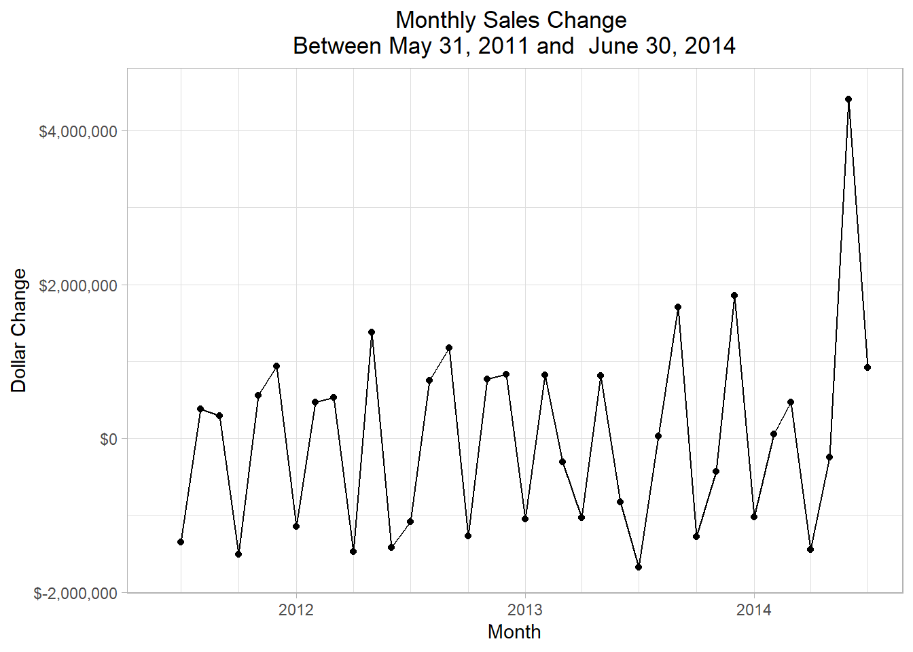

# Exploring a Single Table (with a Business Perspective) {#chapter_exploring-a-single-table}

> This chapter demonstrates how to:
>
>   * Dig into a single Adventureworks table containing sales data
>   * Investigate the ddata from a business value perspective

This chapter explores one table, illustrating the kind of detective work that's often involved in understand a single table.  We'll investigate the `salesorderheader` table in the `sales` schema in this example.

## Setup our standard working environment


Use these libraries:

```r
library(tidyverse)
library(DBI)
library(RPostgres)
library(glue)
require(knitr)
library(dbplyr)
library(sqlpetr)
library(bookdown)
library(here)
library(lubridate)

library(scales) # ggplot xy scales
theme_set(theme_light())
```

Connect to `adventureworks`:

```r
sp_docker_start("adventureworks")
Sys.sleep(sleep_default)
con <- sp_get_postgres_connection(
  host = "localhost",
  port = 5432,
  user = "postgres",
  password = "postgres",
  dbname = "adventureworks",
  seconds_to_test = sleep_default, connection_tab = TRUE
)
```

The previous chapter has demonstrated some of the automated techniques for showing what's in the table using specific functions and packages.  Now we demonstrate a step-by-step process of making sense of what's in a table from a business perspective.

## Sales Orders and Dollars

We begin with counts and totals at different levels of detail.  On an annual basis, are sales dollars trending up, down or flat?

>> Naming the various statistics carefully will pay off as our queries become more complex.  Using `soh` to tag statistics that are derived from the `salesorderheader` table is one example of careful naming.  Tables and columns in an enterprise database will often have *very* long and very explicit names, so consisten abreviation is your friend.


```r
annual_sales <-  tbl(con, in_schema("sales", "salesorderheader")) %>%
  mutate(year = substr(as.character(orderdate), 1, 4)) %>%
  group_by(year) %>%
  summarize(
    min_soh_orderdate = min(orderdate, na.rm = TRUE),
    max_soh_orderdate = max(orderdate, na.rm = TRUE),
    soh_dollars = round(sum(subtotal, na.rm = TRUE), 2),
    avg_soh_dollars = round(mean(subtotal, na.rm = TRUE),2),
    soh_count = n()
  ) %>%
  arrange(year) %>%
  select(year, min_soh_orderdate, max_soh_orderdate, soh_dollars, avg_soh_dollars, soh_count) %>%
  collect() 

annual_sales 
```

```
## # A tibble: 4 x 6
##   year  min_soh_orderdate   max_soh_orderdate   soh_dollars avg_soh_dollars
##   <chr> <dttm>              <dttm>                    <dbl>           <dbl>
## 1 2011  2011-05-31 00:00:00 2011-12-31 00:00:00   12641672.           7867.
## 2 2012  2012-01-01 00:00:00 2012-12-31 00:00:00   33524301.           8563.
## 3 2013  2013-01-01 00:00:00 2013-12-31 00:00:00   43622479.           3076.
## 4 2014  2014-01-01 00:00:00 2014-06-30 00:00:00   20057929.           1705.
## # … with 1 more variable: soh_count <int64>
```

Both 2011 and 2014 are shorter time spans than the other two years, making comparison across the years more difficult. 


```r
min_soh_dt <- min(annual_sales$min_soh_orderdate)
max_soh_dt <- max(annual_sales$max_soh_orderdate)

ggplot(data = annual_sales, aes(x = year, y = soh_dollars)) +
  geom_col() +
  #   geom_text(aes(label = paste(
  #   "avg $ ", avg_soh_dollars
  # )), vjust = 1.5) + # orders inside each bar at top
  xlab("Year") +
  ylab("Sales $") +
  scale_y_continuous(labels = scales::dollar_format()) + 
  ggtitle(paste("Adventure Works Sales Dollars by Year\n  ", min_soh_dt, " - ", max_soh_dt))
```


From 2011 through 2013, sales are trending up and the growth between years is slowing down.  2014 sales dollars look a little behind 2013.  Are sales dollars for 2014 really down or are sales dollars seasonal?  To see if the sales dollars are sesonal, we will drill in and look at the monthly sales. 
 
libfa
## ?

How are the sales dollars related to the number of orders and what is the average order amount?  In the next plot, the title is centered, the y-axis is rescaled, and number of orders and average order dollar amount is added to the top of each bar. 

The following 3 plots show how odd the sales data is:

Look at average dollars per sale sale:

```r
ggplot(data = annual_sales, aes(x = year, y = avg_soh_dollars)) +
#     geom_text(aes(label = paste(
#     "orders", soh_count, "
# ",
#     "avg $ ", avg_soh_dollars
#   )), vjust = 1.5) + # orders inside each bar at top

  geom_col() +
  xlab("Year") +
  ylab("Average sale amount") +
  scale_y_continuous(labels = scales::dollar_format()) + 
  ggtitle(paste("Average Dollars per Sale\n", min_soh_dt, " - ", max_soh_dt))
```


Look at number of orders per year:

```r
ggplot(data = annual_sales, aes(x = year, y = as.numeric(soh_count))) +
  geom_col() +  
  # geom_text(aes(label = paste("orders", soh_count), vjust = 1.5)) + # orders inside each bar at top
  xlab("Year") +
  ylab("Total number of orders") +
  ggtitle(paste("Number of Orders per Year\n", min_soh_dt, " - ", max_soh_dt))
```


Look at number of orders by the the average sales per order for the four years:

```r
annual_sales %>% arrange(min_soh_orderdate) %>% 
ggplot(aes(x = avg_soh_dollars, y = as.numeric(soh_count))) +
  geom_point() +
  geom_text(aes(label = year, hjust = .5, vjust = 0)) +
  geom_path() +
  xlab("Average dollars per order") +
  ylab("Total number of orders") +
  scale_y_continuous(labels = scales::dollar_format()) + 
  scale_x_continuous(labels = scales::dollar_format()) + 
  ggtitle(paste("Number of Orders by Average Order Amount\n", min_soh_dt, " - ", max_soh_dt))
```


From 2012 to 2013 the average dollars per order dropped from more than $8,500 to nearly $3,000 while the total number of order shot up from less than 4,000 to more than 14,000.  **Why are the number of orders increasing, but the average order dollar amount dropping?  **

We need to drill down to look at monthly sales, adapting the first query to group by month and year.

## Adventure Works Monthly Sales

The next code block drills down from annual sales dollars to monthly sales dollars.


```r
monthly_sales <-  tbl(con, in_schema("sales", "salesorderheader")) %>%
  mutate(yr = year(orderdate), mo = month(orderdate)) %>%
  group_by(yr, mo) %>%
  summarize(
    min_soh_orderdate = min(orderdate, na.rm = TRUE),
    max_soh_orderdate = max(orderdate, na.rm = TRUE),
    soh_dollars = round(sum(subtotal, na.rm = TRUE), 2),
    avg_soh_dollars = round(mean(subtotal, na.rm = TRUE), 2),
    soh_count = n()
  ) %>%
  arrange(yr, mo) %>%
  mutate(soh_date = as.Date(min_soh_orderdate)) %>% 
  select(yr, mo, soh_date, min_soh_orderdate, max_soh_orderdate,
         soh_dollars, avg_soh_dollars, soh_count) %>%
  collect()
sp_print_df(head(monthly_sales))
```

<!--html_preserve--><div id="htmlwidget-1b4ff99564eb6e8884a5" style="width:100%;height:auto;" class="datatables html-widget"></div>
<script type="application/json" data-for="htmlwidget-1b4ff99564eb6e8884a5">{"x":{"filter":"none","data":[["1","2","3","4","5","6"],[2011,2011,2011,2011,2011,2011],[5,6,7,8,9,10],["2011-05-31","2011-06-01","2011-07-01","2011-08-01","2011-09-01","2011-10-01"],["2011-05-31T07:00:00Z","2011-06-01T07:00:00Z","2011-07-01T07:00:00Z","2011-08-01T07:00:00Z","2011-09-01T07:00:00Z","2011-10-01T07:00:00Z"],["2011-05-31T07:00:00Z","2011-06-30T07:00:00Z","2011-07-31T07:00:00Z","2011-08-31T07:00:00Z","2011-09-30T07:00:00Z","2011-10-31T07:00:00Z"],[503805.92,458910.82,2044600,2495816.73,502073.85,4588761.82],[11716.42,3254.69,8851.08,9983.27,3197.92,14032.91],[43,141,231,250,157,327]],"container":"<table class=\"display\">\n  <thead>\n    <tr>\n      <th> <\/th>\n      <th>yr<\/th>\n      <th>mo<\/th>\n      <th>soh_date<\/th>\n      <th>min_soh_orderdate<\/th>\n      <th>max_soh_orderdate<\/th>\n      <th>soh_dollars<\/th>\n      <th>avg_soh_dollars<\/th>\n      <th>soh_count<\/th>\n    <\/tr>\n  <\/thead>\n<\/table>","options":{"columnDefs":[{"className":"dt-right","targets":[1,2,6,7,8]},{"orderable":false,"targets":0}],"order":[],"autoWidth":false,"orderClasses":false}},"evals":[],"jsHooks":[]}</script><!--/html_preserve-->


```r
min_soh_dt <- min(monthly_sales$min_soh_orderdate)
max_soh_dt <- max(monthly_sales$max_soh_orderdate)

ggplot(data = monthly_sales, aes(x = min_soh_orderdate, y = soh_dollars)) +
  # geom_line(stat = "identity") +
  geom_line() +
  xlab("Month") +
  ylab("Sales Dollars") +
  scale_y_continuous(labels = dollar) +
  # geom_text(aes(label = soh_count), vjust = 1.5) + # Add nbr of orders
  theme(plot.title = element_text(hjust = 0.5)) + # Center ggplot title
  ggtitle(paste("Sales by Month\n", min_soh_dt, " - ", max_soh_dt))
```


```r
min_soh_dt <- min(monthly_sales$min_soh_orderdate)
max_soh_dt <- max(monthly_sales$max_soh_orderdate)

start_year <- monthly_sales %>% 
  group_by(yr) %>%
  summarize(soh_dollars = sum(soh_dollars), 
            soh_count = sum(soh_count), 
            n_months = n(),
            avg_dollars = soh_dollars / n_months,
            avg_count = soh_count / n_months) %>% 
    filter(yr == min(yr)) 

start_year
```

```
## # A tibble: 1 x 6
##      yr soh_dollars soh_count n_months avg_dollars avg_count
##   <dbl>       <dbl> <int64>      <int>       <dbl>     <dbl>
## 1  2011   12641672. 1607             8    1580209.      201.
```

```r
normalized_monthly_sales <-  monthly_sales %>% 
  # select(-yr) %>% 
  mutate(dollars = (100 * soh_dollars) / start_year$avg_dollars,
         number_of_orders = (100 * soh_count) / start_year$avg_count) %>% 
  ungroup()

normalized_monthly_sales <- normalized_monthly_sales %>% 
  mutate(date = as.Date(min_soh_orderdate)) %>% 
  select(date, dollars, number_of_orders) %>% 
  pivot_longer(-date, names_to = "relative_to_2011_average", values_to = "amount" )

normalized_monthly_sales %>% 
  ggplot(aes(date, amount, color = relative_to_2011_average)) +
  geom_line() +
  geom_hline(yintercept = 100) +
  xlab("Date") +
  ylab("") +
  scale_x_date(date_labels = "%Y-%m", date_breaks = "6 months") +
  ggtitle(paste("Adventureworks Normalized Monthly Sales\nNumber of Sales Orders and Dollar Totals\n", min_soh_dt, " to ", max_soh_dt))
```


```r
ggplot(data = monthly_sales, aes(x = mo, y = soh_dollars, fill = yr)) +
  geom_col(position = position_stack(reverse = TRUE)) + # reverse stacked bars 2011 bottom 2014 top
  guides(fill = guide_legend(reverse = TRUE)) + # reverse bar/legend fill
  xlab("Month") +
  ylab("Sales Dollars") +
  scale_y_continuous(labels = dollar) +
  theme(plot.title = element_text(hjust = 0.5)) + # Center ggplot title
  ggtitle(paste("Sales by Month by Year\nWith Number of Sales Orders\n", min_soh_dt, " - ", max_soh_dt))
```


```r
# The next two statements were done in the previous code block
# Why do the need to be done again in this code block
monthly_sales$mo <- as.factor(monthly_sales$mo)
monthly_sales$yr <- as.factor(monthly_sales$yr)

# ggplot(data=monthly_sales,aes(x=mo,y=soh_dollars,fill=yr)) +
ggplot(data = monthly_sales, aes(x = mo, y = soh_dollars, fill = yr)) +
  geom_col(position = "dodge", color = "black") + # unstack columns and outline in black
  xlab("Month") +
  ylab("Sales Dollars") +
  scale_y_continuous(labels = dollar) +
#   geom_text(aes(label = paste(soh_count, "
# ", avg_soh_dollars)),
#     size = 2.5,
#     color = "black",
#     vjust = 1.5,
#     position = position_dodge(.9)
#   ) +
  theme(plot.title = element_text(hjust = 0.5)) + # Center ggplot title
  ggtitle(paste("Sales by Month by Year\nWith Number of Sales Orders\nAnd Average SO $ Amount\n", min_soh_dt, " - ", max_soh_dt))
```


The next plot shows the same data as a line graph.


```r
# sp_print_df(monthly_sales)

ggplot(
  data = monthly_sales,
  aes(
    x = mo, y = soh_dollars, color = as.factor(yr),
    group = as.factor(yr)
  )
) + # Removes msg: Each group consists of only one observation. Do you need to adjust the group aesthetic?

  geom_line() +
  geom_point() +
  xlab("Month") +
  ylab("Sales Dollars") +
  scale_y_continuous(labels = dollar) +
  geom_text(aes(label = paste(soh_count, "
", avg_soh_dollars)),
    size = 2.5,
    color = "black",
    vjust = 1.5,
    position = position_dodge(.5)
  ) + # orders => avg so $ amt
  theme(plot.title = element_text(hjust = .5)) + # Center ggplot title
  ggtitle(paste("Sales by Month by Year\nWith Number of Sales Orders\nAnd Average SO $ Amount\n", min_soh_dt, " - ", max_soh_dt))
```

<div class="figure">

<p class="caption">(\#fig:unnamed-chunk-3)SO, SO Dollars, and Average SO Dollars</p>
</div>

A couple of things jump out from the graph.

1.  2012 and 2013 have similar sales dollar plots and peak every three months.  This may reflect the closing as many sales orders as possible to make the quarterly sales numbers look good.
2.  2011 has more variation than 2012 and 2013 and peaks every two months.
3.  2014 has the most variation and also peaks every two months.  Both the number of sales, 939, and the average sales order size, $52.19 plumet in June 2014.


```r
# sp_print_df(monthly_sales)

ggplot(
  data = monthly_sales,
  aes(
    x = soh_date, y = soh_dollars)
  # , color = as.factor(yr),
  #   group = as.factor(yr)
  # )
) +
  geom_line() +
  geom_smooth(se = FALSE) +
  xlab("Month") +
  ylab("Sales Dollars") +
  scale_y_continuous(labels = dollar) +
  scale_x_date(date_breaks = "year", date_labels = "%Y", date_minor_breaks = "3 months") +
  theme(plot.title = element_text(hjust = .5)) + # Center ggplot title
  ggtitle(paste("Sales by Month by Year\nWith Number of Sales Orders\nAnd Average SO $ Amount\n", min_soh_dt, " - ", max_soh_dt))
```

```
## `geom_smooth()` using method = 'loess' and formula 'y ~ x'
```

<div class="figure">

<p class="caption">(\#fig:unnamed-chunk-4)SO, SO Dollars, and Average SO Dollars-b </p>
</div>

A couple of things jump out from the graph.

1.  2012 and 2013 have similar sales dollar plots and peak every three months.  This may reflect the closing as many sales orders as possible to make the quarterly sales numbers look good.
2.  2011 has more variation than 2012 and 2013 and peaks every two months.
3.  2014 has the most variation and also peaks every two months.  Both the number of sales, 939, and the average sales order size, $52.19 plumet in June 2014.


```r
# soh_count_2011 <- monthly_sales %>%
#   filter(yr == 2011) %>%
#   select(soh_count, min_soh_orderdate, mo)
# soh_count_2012_5_12 <- monthly_sales %>%
#   filter(yr == 2012 & mo %in% c(5, 6, 7, 8, 9, 10, 11, 12)) %>%
#   select(soh_count, min_soh_orderdate, mo)
# soh_count_2012 <- monthly_sales %>%
#   filter(yr == 2012) %>%
#   select(soh_count, min_soh_orderdate, mo)
# soh_count_2013 <- monthly_sales %>%
#   filter(yr == 2013) %>%
#   select(soh_count, min_soh_orderdate, mo)
# soh_count_2013_1_6 <- monthly_sales %>%
#   filter(yr == 2013 & mo %in% c(1, 2, 3, 4, 5, 6)) %>%
#   select(soh_count, min_oderdate, mo)
# soh_count_2014 <- monthly_sales %>%
#   filter(yr == 2014) %>%
#   select(soh_count, min_oderdate, mo)

# STOPPED HERE.  need to join the data frames and plot the lags.
# soh_count_2012_2011 <- soh_count_2012_5_12 / soh_count_2011
# soh_count_2013_2012 <- soh_count_2013 / soh_count_2012
# soh_count_2014_2013 <- soh_count_2014 / soh_count_2013_1_6
# 
# cat("2012 vs 2011 sales order ratios for May - December
# ", unlist(soh_count_2012_2011))
# 
# cat("2013 vs 2012 sales order ratios
# ", unlist(soh_count_2013_2012))
# 
# cat("2014 vs 2013 sales order ratios for January - June
# ", unlist(soh_count_2014_2013))
```

Comparing the number of sales orders year over year by month for 2013 and 2012, one can see that the 2013 sales are between 1.2 and 1.8 times larger than the corresponding month of 2012 from January through June.  In July the 2013 sales are 5 to 6 times the 2012 sales orders.

This trend continues into 2014 before the number of sales plumet to just 1.3 time in June.

**What happened in July 2013?**


```r
mo_onl_pct <- dbGetQuery(
  con,
  "
SELECT *
      ,round(orders/mo_orders * 100.0,2) mo_pct
      ,round(sales_dollars/mo_sales * 100.0,2) mo_dlr_pct
  FROM (SELECT EXTRACT(MONTH FROM orderdate) mo, EXTRACT(YEAR FROM orderdate) yr
             , min(orderdate)::DATE min_soh_orderdate, max(orderdate)::DATE max_soh_orderdate
             , round(sum(subtotal), 2) sales_dollars
             , round(sum(sum(subtotal)) over (partition by EXTRACT(MONTH FROM orderdate),EXTRACT(YEAR FROM orderdate)
                             order by EXTRACT(YEAR FROM orderdate)),2) mo_sales
             , count(*) * 1.0 orders
             , sum(count(*)) over (partition by EXTRACT(MONTH FROM orderdate),EXTRACT(YEAR FROM orderdate)
                             order by EXTRACT(YEAR FROM orderdate)) mo_orders
             , case when sh.onlineorderflag then 'online' else 'sales rep' end sales_type
        FROM sales.salesorderheader sh
        GROUP BY EXTRACT(MONTH FROM orderdate), EXTRACT(YEAR FROM orderdate), 
                 case when sh.onlineorderflag then 'online' else 'sales rep' end
       ) as src
ORDER BY mo, yr, sales_type
"
)

sp_print_df(mo_onl_pct)
```

<!--html_preserve--><div id="htmlwidget-8f836166d559454ecd73" style="width:100%;height:auto;" class="datatables html-widget"></div>
<script type="application/json" data-for="htmlwidget-8f836166d559454ecd73">{"x":{"filter":"none","data":[["1","2","3","4","5","6","7","8","9","10","11","12","13","14","15","16","17","18","19","20","21","22","23","24","25","26","27","28","29","30","31","32","33","34","35","36","37","38","39","40","41","42","43","44","45","46","47","48","49","50","51","52","53","54","55","56","57","58","59","60","61","62","63","64","65","66","67","68","69","70","71","72"],[1,1,1,1,1,1,2,2,2,2,2,2,3,3,3,3,3,3,4,4,4,4,4,4,5,5,5,5,5,5,5,5,6,6,6,6,6,6,7,7,7,7,7,7,8,8,8,8,8,8,9,9,9,9,9,10,10,10,10,10,10,11,11,11,11,11,12,12,12,12,12,12],[2012,2012,2013,2013,2014,2014,2012,2012,2013,2013,2014,2014,2012,2012,2013,2013,2014,2014,2012,2012,2013,2013,2014,2014,2011,2011,2012,2012,2013,2013,2014,2014,2011,2012,2012,2013,2013,2014,2011,2011,2012,2012,2013,2013,2011,2011,2012,2012,2013,2013,2011,2012,2012,2013,2013,2011,2011,2012,2012,2013,2013,2011,2012,2012,2013,2013,2011,2011,2012,2012,2013,2013],["2012-01-01","2012-01-01","2013-01-01","2013-01-28","2014-01-01","2014-01-28","2012-02-01","2012-02-29","2013-02-01","2013-02-28","2014-02-01","2014-02-28","2012-03-01","2012-03-30","2013-03-01","2013-03-30","2014-03-01","2014-03-01","2012-04-01","2012-04-30","2013-04-01","2013-04-30","2014-04-01","2014-04-30","2011-05-31","2011-05-31","2012-05-01","2012-05-30","2013-05-01","2013-05-30","2014-05-01","2014-05-01","2011-06-01","2012-06-01","2012-06-30","2013-06-01","2013-06-30","2014-06-01","2011-07-01","2011-07-01","2012-07-01","2012-07-31","2013-07-01","2013-07-31","2011-08-01","2011-08-01","2012-08-01","2012-08-30","2013-08-01","2013-08-30","2011-09-01","2012-09-01","2012-09-30","2013-09-01","2013-09-30","2011-10-01","2011-10-01","2012-10-01","2012-10-30","2013-10-01","2013-10-30","2011-11-01","2012-11-01","2012-11-30","2013-11-01","2013-11-30","2011-12-01","2011-12-01","2012-12-01","2012-12-31","2013-12-01","2013-12-31"],["2012-01-31","2012-01-29","2013-01-31","2013-01-28","2014-01-31","2014-01-29","2012-02-29","2012-02-29","2013-02-28","2013-02-28","2014-02-28","2014-02-28","2012-03-31","2012-03-30","2013-03-31","2013-03-30","2014-03-31","2014-03-31","2012-04-30","2012-04-30","2013-04-30","2013-04-30","2014-04-30","2014-04-30","2011-05-31","2011-05-31","2012-05-31","2012-05-30","2013-05-31","2013-05-30","2014-05-31","2014-05-01","2011-06-30","2012-06-30","2012-06-30","2013-06-30","2013-06-30","2014-06-30","2011-07-31","2011-07-01","2012-07-31","2012-07-31","2013-07-31","2013-07-31","2011-08-31","2011-08-31","2012-08-31","2012-08-30","2013-08-31","2013-08-30","2011-09-30","2012-09-30","2012-09-30","2013-09-30","2013-09-30","2011-10-31","2011-10-31","2012-10-31","2012-10-30","2013-10-31","2013-10-30","2011-11-30","2012-11-30","2012-11-30","2013-11-30","2013-11-30","2011-12-31","2011-12-01","2012-12-31","2012-12-31","2013-12-31","2013-12-31"],[614557.94,3356069.34,523917.38,1563955.08,1551065.56,2738752.39,592526.97,882899.94,451643.72,1865278.43,1334494.39,3230.65,706631.53,2269116.71,531316.29,2880752.68,1691178.91,5526352.18,632797.03,1001803.77,544393.21,1987872.71,1795889.13,1284.79,14477.34,489328.58,680913.29,2393689.52,578200.28,2667423.48,1951195.9,3415479.07,458910.82,498163.64,3601190.71,860141.13,4220928,49005.84,506191.69,1538408.31,532594.67,2885359.2,847138.65,4049215.09,485198.66,2010618.07,373483.01,1802154.21,1049907.39,2284056.68,502073.85,400335.61,3053816.33,1046022.77,3486885.94,561681.48,4027080.34,358877.89,2185213.21,1284592.93,3511220.36,737839.82,555160.14,1317541.83,1643177.78,1668952.47,596746.56,713116.69,444558.23,2384846.59,1371675.81,2703810.82],[3970627.28,3970627.28,2087872.46,2087872.46,4289817.95,4289817.95,1475426.91,1475426.91,2316922.15,2316922.15,1337725.04,1337725.04,2975748.24,2975748.24,3412068.97,3412068.97,7217531.09,7217531.09,1634600.8,1634600.8,2532265.91,2532265.91,1797173.92,1797173.92,503805.92,503805.92,3074602.81,3074602.81,3245623.76,3245623.76,5366674.97,5366674.97,458910.82,4099354.36,4099354.36,5081069.13,5081069.13,49005.84,2044600,2044600,3417953.87,3417953.87,4896353.74,4896353.74,2495816.73,2495816.73,2175637.22,2175637.22,3333964.07,3333964.07,502073.85,3454151.94,3454151.94,4532908.71,4532908.71,4588761.82,4588761.82,2544091.11,2544091.11,4795813.29,4795813.29,737839.82,1872701.98,1872701.98,3312130.25,3312130.25,1309863.25,1309863.25,2829404.82,2829404.82,4075486.63,4075486.63],[193,143,294,106,1966,175,182,37,251,74,1753,3,219,85,307,134,2128,271,201,68,326,102,2113,2,5,38,221,72,333,95,2232,179,141,251,139,533,186,939,156,75,274,111,1564,176,150,100,212,73,1690,99,157,219,133,1612,179,174,153,207,114,1792,176,230,318,65,2007,96,188,40,246,132,1875,175],[336,336,400,400,2141,2141,219,219,325,325,1756,1756,304,304,441,441,2399,2399,269,269,428,428,2115,2115,43,43,293,293,428,428,2411,2411,141,390,390,719,719,939,231,231,385,385,1740,1740,250,250,285,285,1789,1789,157,352,352,1791,1791,327,327,321,321,1968,1968,230,383,383,2103,2103,228,228,378,378,2050,2050],["online","sales rep","online","sales rep","online","sales rep","online","sales rep","online","sales rep","online","sales rep","online","sales rep","online","sales rep","online","sales rep","online","sales rep","online","sales rep","online","sales rep","online","sales rep","online","sales rep","online","sales rep","online","sales rep","online","online","sales rep","online","sales rep","online","online","sales rep","online","sales rep","online","sales rep","online","sales rep","online","sales rep","online","sales rep","online","online","sales rep","online","sales rep","online","sales rep","online","sales rep","online","sales rep","online","online","sales rep","online","sales rep","online","sales rep","online","sales rep","online","sales rep"],[57.44,42.56,73.5,26.5,91.83,8.17,83.11,16.89,77.23,22.77,99.83,0.17,72.04,27.96,69.61,30.39,88.7,11.3,74.72,25.28,76.17,23.83,99.91,0.09,11.63,88.37,75.43,24.57,77.8,22.2,92.58,7.42,100,64.36,35.64,74.13,25.87,100,67.53,32.47,71.17,28.83,89.89,10.11,60,40,74.39,25.61,94.47,5.53,100,62.22,37.78,90.01,9.99,53.21,46.79,64.49,35.51,91.06,8.94,100,83.03,16.97,95.44,4.56,82.46,17.54,65.08,34.92,91.46,8.54],[15.48,84.52,25.09,74.91,36.16,63.84,40.16,59.84,19.49,80.51,99.76,0.24,23.75,76.25,15.57,84.43,23.43,76.57,38.71,61.29,21.5,78.5,99.93,0.07,2.87,97.13,22.15,77.85,17.81,82.19,36.36,63.64,100,12.15,87.85,16.93,83.07,100,24.76,75.24,15.58,84.42,17.3,82.7,19.44,80.56,17.17,82.83,31.49,68.51,100,11.59,88.41,23.08,76.92,12.24,87.76,14.11,85.89,26.79,73.21,100,29.64,70.36,49.61,50.39,45.56,54.44,15.71,84.29,33.66,66.34]],"container":"<table class=\"display\">\n  <thead>\n    <tr>\n      <th> <\/th>\n      <th>mo<\/th>\n      <th>yr<\/th>\n      <th>min_soh_orderdate<\/th>\n      <th>max_soh_orderdate<\/th>\n      <th>sales_dollars<\/th>\n      <th>mo_sales<\/th>\n      <th>orders<\/th>\n      <th>mo_orders<\/th>\n      <th>sales_type<\/th>\n      <th>mo_pct<\/th>\n      <th>mo_dlr_pct<\/th>\n    <\/tr>\n  <\/thead>\n<\/table>","options":{"columnDefs":[{"className":"dt-right","targets":[1,2,5,6,7,8,10,11]},{"orderable":false,"targets":0}],"order":[],"autoWidth":false,"orderClasses":false}},"evals":[],"jsHooks":[]}</script><!--/html_preserve-->

```r
min_soh_dt <- min(monthly_sales$min_soh_orderdate)
max_soh_dt <- max(monthly_sales$max_soh_orderdate)
mo_onl_pct$mo <- as.factor(mo_onl_pct$mo)
mo_onl_pct$yr <- as.factor(mo_onl_pct$yr)
mo_onl_pct$sales_type <- as.factor(mo_onl_pct$sales_type)
mo_2011 <- mo_onl_pct %>% filter(yr == 2011)
mo_2012 <- mo_onl_pct %>% filter(yr == 2012)
mo_2013 <- mo_onl_pct %>% filter(yr == 2013)
mo_2014 <- mo_onl_pct %>% filter(yr == 2014)


ggplot(data = NULL) +
  # data=mo_2011 first results in the x axis months out of order.
  geom_line(data = mo_2012, aes(x = mo, y = mo_pct, color = yr, group = sales_type)) +
  geom_line(data = mo_2011, aes(x = mo, y = mo_pct, color = yr, group = sales_type)) +
  geom_line(data = mo_2013, aes(x = mo, y = mo_pct, color = yr, group = sales_type)) +
  geom_line(data = mo_2014, aes(x = mo, y = mo_pct, color = yr, group = sales_type)) +

  geom_point(data = mo_2011, aes(x = mo, y = mo_pct, color = sales_type)) +
  geom_point(data = mo_2012, aes(x = mo, y = mo_pct, color = sales_type)) +
  geom_point(data = mo_2013, aes(x = mo, y = mo_pct, color = sales_type)) +
  geom_point(data = mo_2014, aes(x = mo, y = mo_pct, color = sales_type)) +

  geom_text(
    data = mo_2011, aes(x = mo, y = mo_pct, label = paste(orders, ":$", sales_dollars, ":", mo_dlr_pct, "%")),
    position = position_dodge(.3), size = 2.5, hjust = 0
  ) +
  geom_text(
    data = mo_2012, aes(x = mo, y = mo_pct, label = paste(orders, ":$", sales_dollars, ":", mo_dlr_pct, "%")),
    position = position_dodge(.3), size = 2.5, hjust = 0
  ) +
  geom_text(
    data = mo_2013, aes(x = mo, y = mo_pct, label = paste(orders, ":$", sales_dollars, ":", mo_dlr_pct, "%")),
    position = position_dodge(.3), size = 2.5, hjust = 0
  ) +
  geom_text(
    data = mo_2014, aes(x = mo, y = mo_pct, label = paste(orders, ":$", sales_dollars, ":", mo_dlr_pct, "%")), color = "lightblue",
    position = position_dodge(.3), size = 2.5, hjust = 0, vjust = 1.5
  ) +

  xlab("Month") +
  ylab("% Online Sales\nvs\n%Rep Sales") +
  theme(plot.title = element_text(hjust = .50)) +
  ggtitle(paste(
    "Sales by Month\n",
    "Online Orders Versus Rep Orders\n",
    min_soh_dt, " - ", max_soh_dt, "
",
    "Each Point shows Number of Orders: $ Amount: % of Total $ For the Month"
  ))
```


The sales rep orders brought in over half the monthly sales dollars for every month except three, February, Arpil, and June of 2014.  The monthly sales rep orders for those months are 3, 2, and 0 respectively. 

## Monthly Sales Rep Performance Analysis


```r
mo_soh_sreps <- dbGetQuery(
  con,
  "
SELECT *
      ,round(orders/mo_orders * 100.0,2) mo_pct
      ,round(sales_dollars/mo_sales * 100.0,2) mo_dlr_pct
  FROM (SELECT EXTRACT(MONTH FROM orderdate) mo, EXTRACT(YEAR FROM orderdate) yr
             , min(orderdate)::DATE min_soh_orderdate, max(orderdate)::DATE max_soh_orderdate
             , round(sum(subtotal), 2) sales_dollars
             , round(sum(sum(subtotal)) over (partition by EXTRACT(MONTH FROM orderdate),EXTRACT(YEAR FROM orderdate)
                             order by EXTRACT(YEAR FROM orderdate)),2) mo_sales
             , count(*) * 1.0 orders
             , sum(count(*)) over (partition by EXTRACT(MONTH FROM orderdate),EXTRACT(YEAR FROM orderdate)
                             order by EXTRACT(YEAR FROM orderdate)) mo_orders
             , case when sh.onlineorderflag then 'online' else 'sales rep' end sales_type
        FROM sales.salesorderheader sh
             INNER JOIN sales.salesorderdetail sd
                ON sh.salesorderid = sd.salesorderid
       WHERE not sh.onlineorderflag
        GROUP BY EXTRACT(MONTH FROM orderdate), EXTRACT(YEAR FROM orderdate), 
                 case when sh.onlineorderflag then 'online' else 'sales rep' end
       ) as src
ORDER BY mo, yr, sales_type
"
)

sp_print_df(mo_soh_sreps)
```

<!--html_preserve--><div id="htmlwidget-0d7db73d03839427d3b7" style="width:100%;height:auto;" class="datatables html-widget"></div>
<script type="application/json" data-for="htmlwidget-0d7db73d03839427d3b7">{"x":{"filter":"none","data":[["1","2","3","4","5","6","7","8","9","10","11","12","13","14","15","16","17","18","19","20","21","22","23","24","25","26","27","28","29","30","31","32","33","34"],[1,1,1,2,2,2,3,3,3,4,4,4,5,5,5,5,6,6,7,7,7,8,8,8,9,9,10,10,10,11,11,12,12,12],[2012,2013,2014,2012,2013,2014,2012,2013,2014,2012,2013,2014,2011,2012,2013,2014,2012,2013,2011,2012,2013,2011,2012,2013,2012,2013,2011,2012,2013,2012,2013,2011,2012,2013],["2012-01-01","2013-01-28","2014-01-28","2012-02-29","2013-02-28","2014-02-28","2012-03-30","2013-03-30","2014-03-01","2012-04-30","2013-04-30","2014-04-30","2011-05-31","2012-05-30","2013-05-30","2014-05-01","2012-06-30","2013-06-30","2011-07-01","2012-07-31","2013-07-31","2011-08-01","2012-08-30","2013-08-30","2012-09-30","2013-09-30","2011-10-01","2012-10-30","2013-10-30","2012-11-30","2013-11-30","2011-12-01","2012-12-31","2013-12-31"],["2012-01-29","2013-01-28","2014-01-29","2012-02-29","2013-02-28","2014-02-28","2012-03-30","2013-03-30","2014-03-31","2012-04-30","2013-04-30","2014-04-30","2011-05-31","2012-05-30","2013-05-30","2014-05-01","2012-06-30","2013-06-30","2011-07-01","2012-07-31","2013-07-31","2011-08-31","2012-08-30","2013-08-30","2012-09-30","2013-09-30","2011-10-31","2012-10-30","2013-10-30","2012-11-30","2013-11-30","2011-12-01","2012-12-31","2013-12-31"],[50403482.88,40081731.5,66924961.04,15335522.48,71803004.54,11658.08,43058301.41,104511185.26,186277902.38,21890294.9,72159451.26,4941.62,7174123.22,105012806.67,112718974.22,114624079.99,149177897.11,171233641.32,22655820.8,124954864.42,167739700.18,33272164.17,66745681.72,80194321.92,108204546.77,116019864.91,75576022.46,78671739.6,118198139.39,34775957.79,43717807.86,9164880.69,58164639.46,66783163.73],[50403482.88,40081731.5,66924961.04,15335522.48,71803004.54,11658.08,43058301.41,104511185.26,186277902.38,21890294.9,72159451.26,4941.62,7174123.22,105012806.67,112718974.22,114624079.99,149177897.11,171233641.32,22655820.8,124954864.42,167739700.18,33272164.17,66745681.72,80194321.92,108204546.77,116019864.91,75576022.46,78671739.6,118198139.39,34775957.79,43717807.86,9164880.69,58164639.46,66783163.73],[1519,1215,2180,494,1449,8,1112,2306,4647,819,1698,7,352,1723,2189,3002,2964,3766,785,2185,3768,1092,1406,1813,2345,2911,1909,1732,3032,983,1385,377,1664,2082],[1519,1215,2180,494,1449,8,1112,2306,4647,819,1698,7,352,1723,2189,3002,2964,3766,785,2185,3768,1092,1406,1813,2345,2911,1909,1732,3032,983,1385,377,1664,2082],["sales rep","sales rep","sales rep","sales rep","sales rep","sales rep","sales rep","sales rep","sales rep","sales rep","sales rep","sales rep","sales rep","sales rep","sales rep","sales rep","sales rep","sales rep","sales rep","sales rep","sales rep","sales rep","sales rep","sales rep","sales rep","sales rep","sales rep","sales rep","sales rep","sales rep","sales rep","sales rep","sales rep","sales rep"],[100,100,100,100,100,100,100,100,100,100,100,100,100,100,100,100,100,100,100,100,100,100,100,100,100,100,100,100,100,100,100,100,100,100],[100,100,100,100,100,100,100,100,100,100,100,100,100,100,100,100,100,100,100,100,100,100,100,100,100,100,100,100,100,100,100,100,100,100]],"container":"<table class=\"display\">\n  <thead>\n    <tr>\n      <th> <\/th>\n      <th>mo<\/th>\n      <th>yr<\/th>\n      <th>min_soh_orderdate<\/th>\n      <th>max_soh_orderdate<\/th>\n      <th>sales_dollars<\/th>\n      <th>mo_sales<\/th>\n      <th>orders<\/th>\n      <th>mo_orders<\/th>\n      <th>sales_type<\/th>\n      <th>mo_pct<\/th>\n      <th>mo_dlr_pct<\/th>\n    <\/tr>\n  <\/thead>\n<\/table>","options":{"columnDefs":[{"className":"dt-right","targets":[1,2,5,6,7,8,10,11]},{"orderable":false,"targets":0}],"order":[],"autoWidth":false,"orderClasses":false}},"evals":[],"jsHooks":[]}</script><!--/html_preserve-->


```r
monthly_sales_online <- dbGetQuery(
  con,
  "
SELECT EXTRACT(MONTH FROM orderdate) mo, EXTRACT(YEAR FROM orderdate) yr
     , min(orderdate)::DATE min_soh_orderdate, max(orderdate)::DATE max_soh_orderdate
     , so.category
     , round(sum(subtotal), 2) sales_dollars
     , count(*) * 1.0 orders
 FROM sales.salesorderheader sh
      JOIN sales.salesorderdetail sd ON SH.salesorderid = sd.salesorderid
      JOIN sales.specialoffer so ON Sd.specialofferid = so.specialofferid
GROUP BY EXTRACT(MONTH FROM orderdate), EXTRACT(YEAR FROM orderdate), so.category
ORDER BY mo, yr
"
)

sp_print_df(monthly_sales_online)
```

<div class="figure">
<!--html_preserve--><div id="htmlwidget-c2e3fede5c798441fdae" style="width:100%;height:auto;" class="datatables html-widget"></div>
<script type="application/json" data-for="htmlwidget-c2e3fede5c798441fdae">{"x":{"filter":"none","data":[["1","2","3","4","5","6","7","8","9","10","11","12","13","14","15","16","17","18","19","20","21","22","23","24","25","26","27","28","29","30","31","32","33","34","35","36","37","38","39","40","41","42","43","44","45","46","47","48","49","50","51","52","53","54","55","56","57","58","59","60","61","62","63","64","65","66","67","68","69","70","71"],[1,1,1,1,1,1,2,2,2,2,2,2,3,3,3,3,3,3,4,4,4,4,4,4,5,5,5,5,5,5,5,6,6,6,6,6,6,7,7,7,7,7,7,8,8,8,8,8,8,9,9,9,9,9,10,10,10,10,10,10,11,11,11,11,11,12,12,12,12,12,12],[2012,2012,2013,2013,2014,2014,2012,2012,2013,2013,2014,2014,2012,2012,2013,2013,2014,2014,2012,2012,2013,2013,2014,2014,2011,2012,2012,2013,2013,2014,2014,2011,2012,2012,2013,2013,2014,2011,2011,2012,2012,2013,2013,2011,2011,2012,2012,2013,2013,2011,2012,2012,2013,2013,2011,2011,2012,2012,2013,2013,2011,2012,2012,2013,2013,2011,2011,2012,2012,2013,2013],["2012-01-01","2012-01-01","2013-01-01","2013-01-01","2014-01-01","2014-01-01","2012-02-29","2012-02-01","2013-02-01","2013-02-01","2014-02-01","2014-02-01","2012-03-01","2012-03-30","2013-03-03","2013-03-01","2014-03-01","2014-03-01","2012-04-01","2012-04-30","2013-04-02","2013-04-01","2014-04-01","2014-04-01","2011-05-31","2012-05-30","2012-05-01","2013-05-01","2013-05-03","2014-05-01","2014-05-01","2011-06-01","2012-06-01","2012-06-01","2013-06-01","2013-06-01","2014-06-01","2011-07-01","2011-07-01","2012-07-01","2012-07-01","2013-07-01","2013-07-01","2011-08-01","2011-08-01","2012-08-01","2012-08-02","2013-08-01","2013-08-01","2011-09-01","2012-09-01","2012-09-01","2013-09-01","2013-09-01","2011-10-01","2011-10-01","2012-10-01","2012-10-01","2013-10-01","2013-10-01","2011-11-01","2012-11-01","2012-11-02","2013-11-01","2013-11-01","2011-12-01","2011-12-01","2012-12-01","2012-12-01","2013-12-01","2013-12-01"],["2012-01-31","2012-01-29","2013-01-31","2013-01-29","2014-01-31","2014-01-31","2012-02-29","2012-02-29","2013-02-28","2013-02-28","2014-02-28","2014-02-28","2012-03-31","2012-03-30","2013-03-31","2013-03-31","2014-03-31","2014-03-31","2012-04-30","2012-04-30","2013-04-30","2013-04-30","2014-04-30","2014-04-30","2011-05-31","2012-05-30","2012-05-31","2013-05-31","2013-05-31","2014-05-30","2014-05-31","2011-06-30","2012-06-30","2012-06-30","2013-06-30","2013-06-30","2014-06-30","2011-07-31","2011-07-01","2012-07-31","2012-07-31","2013-07-31","2013-07-31","2011-08-31","2011-08-31","2012-08-31","2012-08-31","2013-08-31","2013-08-31","2011-09-30","2012-09-30","2012-09-30","2013-09-30","2013-09-30","2011-10-31","2011-10-31","2012-10-31","2012-10-31","2013-10-31","2013-10-31","2011-11-30","2012-11-30","2012-11-30","2013-11-30","2013-11-30","2011-12-01","2011-12-31","2012-12-31","2012-12-31","2013-12-31","2013-12-31"],["No Discount","Reseller","No Discount","Reseller","No Discount","Reseller","Reseller","No Discount","Reseller","No Discount","Reseller","No Discount","No Discount","Reseller","Reseller","No Discount","No Discount","Reseller","No Discount","Reseller","Reseller","No Discount","No Discount","Reseller","No Discount","Reseller","No Discount","No Discount","Reseller","Reseller","No Discount","No Discount","No Discount","Reseller","Reseller","No Discount","No Discount","No Discount","Reseller","No Discount","Reseller","Reseller","No Discount","Reseller","No Discount","No Discount","Reseller","Reseller","No Discount","No Discount","No Discount","Reseller","Reseller","No Discount","Reseller","No Discount","Reseller","No Discount","No Discount","Reseller","No Discount","No Discount","Reseller","No Discount","Reseller","Reseller","No Discount","No Discount","Reseller","Reseller","No Discount"],[50814178.74,203862.08,40032506.6,573142.28,69742390.8,1582808.9,135602.36,15792447.09,2431525.1,69823123.17,140504.74,3564639.51,43269899.65,495033.29,2058467.73,102984033.81,175580040.56,15311788.24,20066327.48,2456764.46,3403198.67,69300645.79,4868938.43,169884.72,7188600.56,13222330.92,92471389.04,90801676.88,22589476.76,8776700.95,111385241.78,458910.82,142674141.64,7001919.11,25496946.18,148114982.82,132262.27,22607387.56,554624.94,115318277.98,10169181.11,27791752.83,142366262.77,388930.53,33368432.3,64698983.5,2420181.23,6707055.72,76411822.26,502073.85,107124609.23,1480273.15,5496530.81,113534809.59,1262024.59,74875679.34,3430213.31,75600404.19,116470799.53,5284860.77,737839.82,34859214.28,471903.66,47215501.22,1135975.6,39547.85,9722079.4,57673867.81,935329.88,1459131.36,69238560.79],[1708,4,1455,54,6867,178,3,673,70,1630,144,4137,1323,8,67,2546,9443,512,880,140,89,1935,5126,176,357,219,1725,2143,429,372,8254,141,3058,157,509,4701,2130,933,8,2311,148,697,6864,8,1234,1554,64,269,5631,157,2509,55,241,6649,17,2066,73,1866,7179,252,230,1257,44,6222,188,1,564,1858,52,185,6568]],"container":"<table class=\"display\">\n  <thead>\n    <tr>\n      <th> <\/th>\n      <th>mo<\/th>\n      <th>yr<\/th>\n      <th>min_soh_orderdate<\/th>\n      <th>max_soh_orderdate<\/th>\n      <th>category<\/th>\n      <th>sales_dollars<\/th>\n      <th>orders<\/th>\n    <\/tr>\n  <\/thead>\n<\/table>","options":{"columnDefs":[{"className":"dt-right","targets":[1,2,6,7]},{"orderable":false,"targets":0}],"order":[],"autoWidth":false,"orderClasses":false}},"evals":[],"jsHooks":[]}</script><!--/html_preserve-->
<p class="caption">(\#fig:unnamed-chunk-7)caption goes here</p>
</div>

```r
ggplot(data = monthly_sales_online, aes(x = factor(mo), y = sales_dollars, fill = factor(yr))) +
  geom_col(position = "dodge", color = "black") + # unstack columns and outline in black
  xlab("Month") +
  ylab("Sales Dollars") +
  scale_y_continuous(labels = dollar) +
  geom_text(aes(label = category),
    size = 2.5
    #           ,color = 'black'
    , vjust = 1.5,
    position = position_dodge(.9)
  ) + # orders => avg so $ amt
  theme(plot.title = element_text(hjust = .50)) + # Center ggplot title
  ggtitle(paste("Sales by Month\nBy Online Flag"))
```

<div class="figure">

<p class="caption">(\#fig:unnamed-chunk-7)caption goes here</p>
</div>


```r
monthly_sales_onl_pct <- dbGetQuery(
  con,
  "
select EXTRACT(MONTH FROM orderdate) mo
      ,EXTRACT(YEAR FROM orderdate) yr
      ,sum(ORDERQTY)
      ,sum(case when salespersonid is null and onlineorderflag then 1 else 0 end) onl
      ,sum(case when salespersonid is not null and not onlineorderflag then 1 else 0 end) sp
      ,round(sum(case when onlineorderflag then 1 else 0 end )*1.0/count(*) * 100.0,2) onl_pct
      ,round(sum(case when not onlineorderflag then 1 else 0 end )*1.0/count(*) * 100.0,2) sp_pct
      ,onlineorderflag
      ,count(*)
  FROM sales.salesorderheader sh
  INNER JOIN sales.salesorderdetail sd
          ON sh.salesorderid = sd.salesorderid
  INNER JOIN production.product p
          ON sd.productid = p.productid
  INNER JOIN sales.specialoffer so
          ON sd.specialofferid = so.specialofferid
  LEFT OUTER JOIN sales.specialofferproduct sop
          ON sd.specialofferid = sop.specialofferid
         and sd.productid = sop.productid
 WHERE sop.productid is not null
group by EXTRACT(MONTH FROM orderdate) 
        ,EXTRACT(YEAR FROM orderdate) 
        ,onlineorderflag
order by mo,yr
"
)

sp_print_df(monthly_sales_onl_pct)
```

<!--html_preserve--><div id="htmlwidget-a77ad32f6b82562872f5" style="width:100%;height:auto;" class="datatables html-widget"></div>
<script type="application/json" data-for="htmlwidget-a77ad32f6b82562872f5">{"x":{"filter":"none","data":[["1","2","3","4","5","6","7","8","9","10","11","12","13","14","15","16","17","18","19","20","21","22","23","24","25","26","27","28","29","30","31","32","33","34","35","36","37","38","39","40","41","42","43","44","45","46","47","48","49","50","51","52","53","54","55","56","57","58","59","60","61","62","63","64","65","66","67","68","69","70","71","72"],[1,1,1,1,1,1,2,2,2,2,2,2,3,3,3,3,3,3,4,4,4,4,4,4,5,5,5,5,5,5,5,5,6,6,6,6,6,6,7,7,7,7,7,7,8,8,8,8,8,8,9,9,9,9,9,10,10,10,10,10,10,11,11,11,11,11,12,12,12,12,12,12],[2012,2012,2013,2013,2014,2014,2012,2012,2013,2013,2014,2014,2012,2012,2013,2013,2014,2014,2012,2012,2013,2013,2014,2014,2011,2011,2012,2012,2013,2013,2014,2014,2011,2012,2012,2013,2013,2014,2011,2011,2012,2012,2013,2013,2011,2011,2012,2012,2013,2013,2011,2012,2012,2013,2013,2011,2011,2012,2012,2013,2013,2011,2012,2012,2013,2013,2011,2011,2012,2012,2013,2013],[193,3774,294,3860,6598,4865,182,1260,5400,251,14,4273,2965,219,307,7943,17274,5308,201,2204,326,6123,18,5295,5,820,7502,221,383,9877,5624,10260,141,11044,251,1444,15167,2130,2053,156,274,8868,14796,3793,150,2754,5355,212,7461,4087,157,8075,219,10597,3979,5208,174,6342,207,10585,4399,230,318,3288,5025,4642,852,188,5159,246,4671,6378],[193,0,294,0,0,4865,182,0,0,251,0,4273,0,219,307,0,0,5308,201,0,326,0,0,5295,5,0,0,221,383,0,5624,0,141,0,251,1444,0,2130,0,156,274,0,0,3793,150,0,0,212,0,4087,157,0,219,0,3979,0,174,0,207,0,4399,230,318,0,5025,0,0,188,0,246,4671,0],[0,1519,0,1215,2180,0,0,494,1449,0,8,0,1112,0,0,2306,4647,0,0,819,0,1698,7,0,0,352,1723,0,0,2189,0,3002,0,2964,0,0,3766,0,785,0,0,2185,3768,0,0,1092,1406,0,1813,0,0,2345,0,2911,0,1909,0,1732,0,3032,0,0,0,983,0,1385,377,0,1664,0,0,2082],[100,0,100,0,0,100,100,0,0,100,0,100,0,100,100,0,0,100,100,0,100,0,0,100,100,0,0,100,100,0,100,0,100,0,100,100,0,100,0,100,100,0,0,100,100,0,0,100,0,100,100,0,100,0,100,0,100,0,100,0,100,100,100,0,100,0,0,100,0,100,100,0],[0,100,0,100,100,0,0,100,100,0,100,0,100,0,0,100,100,0,0,100,0,100,100,0,0,100,100,0,0,100,0,100,0,100,0,0,100,0,100,0,0,100,100,0,0,100,100,0,100,0,0,100,0,100,0,100,0,100,0,100,0,0,0,100,0,100,100,0,100,0,0,100],[true,false,true,false,false,true,true,false,false,true,false,true,false,true,true,false,false,true,true,false,true,false,false,true,true,false,false,true,true,false,true,false,true,false,true,true,false,true,false,true,true,false,false,true,true,false,false,true,false,true,true,false,true,false,true,false,true,false,true,false,true,true,true,false,true,false,false,true,false,true,true,false],[193,1519,294,1215,2180,4865,182,494,1449,251,8,4273,1112,219,307,2306,4647,5308,201,819,326,1698,7,5295,5,352,1723,221,383,2189,5624,3002,141,2964,251,1444,3766,2130,785,156,274,2185,3768,3793,150,1092,1406,212,1813,4087,157,2345,219,2911,3979,1909,174,1732,207,3032,4399,230,318,983,5025,1385,377,188,1664,246,4671,2082]],"container":"<table class=\"display\">\n  <thead>\n    <tr>\n      <th> <\/th>\n      <th>mo<\/th>\n      <th>yr<\/th>\n      <th>sum<\/th>\n      <th>onl<\/th>\n      <th>sp<\/th>\n      <th>onl_pct<\/th>\n      <th>sp_pct<\/th>\n      <th>onlineorderflag<\/th>\n      <th>count<\/th>\n    <\/tr>\n  <\/thead>\n<\/table>","options":{"columnDefs":[{"className":"dt-right","targets":[1,2,3,4,5,6,7,9]},{"orderable":false,"targets":0}],"order":[],"autoWidth":false,"orderClasses":false}},"evals":[],"jsHooks":[]}</script><!--/html_preserve-->


```r
mo_onl_pct <- dbGetQuery(
  con,
  "
SELECT *
      ,round(orders/mo_orders * 100.0,2) mo_pct
      ,round(sales_dollars/mo_sales * 100.0,2) mo_dlr_pct
  FROM (SELECT EXTRACT(MONTH FROM orderdate) mo, EXTRACT(YEAR FROM orderdate) yr
             , min(orderdate)::DATE min_soh_orderdate, max(orderdate)::DATE max_soh_orderdate
             , round(sum(subtotal), 2) sales_dollars
             , round(sum(sum(subtotal)) over (partition by EXTRACT(MONTH FROM orderdate),EXTRACT(YEAR FROM orderdate)
                             order by EXTRACT(YEAR FROM orderdate)),2) mo_sales
             , count(*) * 1.0 orders
             , sum(count(*)) over (partition by EXTRACT(MONTH FROM orderdate),EXTRACT(YEAR FROM orderdate)
                             order by EXTRACT(YEAR FROM orderdate)) mo_orders
             , case when sh.onlineorderflag then 'online' else 'sales rep' end sales_type
        FROM sales.salesorderheader sh
        GROUP BY EXTRACT(MONTH FROM orderdate), EXTRACT(YEAR FROM orderdate), 
                 case when sh.onlineorderflag then 'online' else 'sales rep' end
       ) as src
ORDER BY mo, yr, sales_type
"
)

sp_print_df(mo_onl_pct)
```

<!--html_preserve--><div id="htmlwidget-e3479f292a01744eb530" style="width:100%;height:auto;" class="datatables html-widget"></div>
<script type="application/json" data-for="htmlwidget-e3479f292a01744eb530">{"x":{"filter":"none","data":[["1","2","3","4","5","6","7","8","9","10","11","12","13","14","15","16","17","18","19","20","21","22","23","24","25","26","27","28","29","30","31","32","33","34","35","36","37","38","39","40","41","42","43","44","45","46","47","48","49","50","51","52","53","54","55","56","57","58","59","60","61","62","63","64","65","66","67","68","69","70","71","72"],[1,1,1,1,1,1,2,2,2,2,2,2,3,3,3,3,3,3,4,4,4,4,4,4,5,5,5,5,5,5,5,5,6,6,6,6,6,6,7,7,7,7,7,7,8,8,8,8,8,8,9,9,9,9,9,10,10,10,10,10,10,11,11,11,11,11,12,12,12,12,12,12],[2012,2012,2013,2013,2014,2014,2012,2012,2013,2013,2014,2014,2012,2012,2013,2013,2014,2014,2012,2012,2013,2013,2014,2014,2011,2011,2012,2012,2013,2013,2014,2014,2011,2012,2012,2013,2013,2014,2011,2011,2012,2012,2013,2013,2011,2011,2012,2012,2013,2013,2011,2012,2012,2013,2013,2011,2011,2012,2012,2013,2013,2011,2012,2012,2013,2013,2011,2011,2012,2012,2013,2013],["2012-01-01","2012-01-01","2013-01-01","2013-01-28","2014-01-01","2014-01-28","2012-02-01","2012-02-29","2013-02-01","2013-02-28","2014-02-01","2014-02-28","2012-03-01","2012-03-30","2013-03-01","2013-03-30","2014-03-01","2014-03-01","2012-04-01","2012-04-30","2013-04-01","2013-04-30","2014-04-01","2014-04-30","2011-05-31","2011-05-31","2012-05-01","2012-05-30","2013-05-01","2013-05-30","2014-05-01","2014-05-01","2011-06-01","2012-06-01","2012-06-30","2013-06-01","2013-06-30","2014-06-01","2011-07-01","2011-07-01","2012-07-01","2012-07-31","2013-07-01","2013-07-31","2011-08-01","2011-08-01","2012-08-01","2012-08-30","2013-08-01","2013-08-30","2011-09-01","2012-09-01","2012-09-30","2013-09-01","2013-09-30","2011-10-01","2011-10-01","2012-10-01","2012-10-30","2013-10-01","2013-10-30","2011-11-01","2012-11-01","2012-11-30","2013-11-01","2013-11-30","2011-12-01","2011-12-01","2012-12-01","2012-12-31","2013-12-01","2013-12-31"],["2012-01-31","2012-01-29","2013-01-31","2013-01-28","2014-01-31","2014-01-29","2012-02-29","2012-02-29","2013-02-28","2013-02-28","2014-02-28","2014-02-28","2012-03-31","2012-03-30","2013-03-31","2013-03-30","2014-03-31","2014-03-31","2012-04-30","2012-04-30","2013-04-30","2013-04-30","2014-04-30","2014-04-30","2011-05-31","2011-05-31","2012-05-31","2012-05-30","2013-05-31","2013-05-30","2014-05-31","2014-05-01","2011-06-30","2012-06-30","2012-06-30","2013-06-30","2013-06-30","2014-06-30","2011-07-31","2011-07-01","2012-07-31","2012-07-31","2013-07-31","2013-07-31","2011-08-31","2011-08-31","2012-08-31","2012-08-30","2013-08-31","2013-08-30","2011-09-30","2012-09-30","2012-09-30","2013-09-30","2013-09-30","2011-10-31","2011-10-31","2012-10-31","2012-10-30","2013-10-31","2013-10-30","2011-11-30","2012-11-30","2012-11-30","2013-11-30","2013-11-30","2011-12-31","2011-12-01","2012-12-31","2012-12-31","2013-12-31","2013-12-31"],[614557.94,3356069.34,523917.38,1563955.08,1551065.56,2738752.39,592526.97,882899.94,451643.72,1865278.43,1334494.39,3230.65,706631.53,2269116.71,531316.29,2880752.68,1691178.91,5526352.18,632797.03,1001803.77,544393.21,1987872.71,1795889.13,1284.79,14477.34,489328.58,680913.29,2393689.52,578200.28,2667423.48,1951195.9,3415479.07,458910.82,498163.64,3601190.71,860141.13,4220928,49005.84,506191.69,1538408.31,532594.67,2885359.2,847138.65,4049215.09,485198.66,2010618.07,373483.01,1802154.21,1049907.39,2284056.68,502073.85,400335.61,3053816.33,1046022.77,3486885.94,561681.48,4027080.34,358877.89,2185213.21,1284592.93,3511220.36,737839.82,555160.14,1317541.83,1643177.78,1668952.47,596746.56,713116.69,444558.23,2384846.59,1371675.81,2703810.82],[3970627.28,3970627.28,2087872.46,2087872.46,4289817.95,4289817.95,1475426.91,1475426.91,2316922.15,2316922.15,1337725.04,1337725.04,2975748.24,2975748.24,3412068.97,3412068.97,7217531.09,7217531.09,1634600.8,1634600.8,2532265.91,2532265.91,1797173.92,1797173.92,503805.92,503805.92,3074602.81,3074602.81,3245623.76,3245623.76,5366674.97,5366674.97,458910.82,4099354.36,4099354.36,5081069.13,5081069.13,49005.84,2044600,2044600,3417953.87,3417953.87,4896353.74,4896353.74,2495816.73,2495816.73,2175637.22,2175637.22,3333964.07,3333964.07,502073.85,3454151.94,3454151.94,4532908.71,4532908.71,4588761.82,4588761.82,2544091.11,2544091.11,4795813.29,4795813.29,737839.82,1872701.98,1872701.98,3312130.25,3312130.25,1309863.25,1309863.25,2829404.82,2829404.82,4075486.63,4075486.63],[193,143,294,106,1966,175,182,37,251,74,1753,3,219,85,307,134,2128,271,201,68,326,102,2113,2,5,38,221,72,333,95,2232,179,141,251,139,533,186,939,156,75,274,111,1564,176,150,100,212,73,1690,99,157,219,133,1612,179,174,153,207,114,1792,176,230,318,65,2007,96,188,40,246,132,1875,175],[336,336,400,400,2141,2141,219,219,325,325,1756,1756,304,304,441,441,2399,2399,269,269,428,428,2115,2115,43,43,293,293,428,428,2411,2411,141,390,390,719,719,939,231,231,385,385,1740,1740,250,250,285,285,1789,1789,157,352,352,1791,1791,327,327,321,321,1968,1968,230,383,383,2103,2103,228,228,378,378,2050,2050],["online","sales rep","online","sales rep","online","sales rep","online","sales rep","online","sales rep","online","sales rep","online","sales rep","online","sales rep","online","sales rep","online","sales rep","online","sales rep","online","sales rep","online","sales rep","online","sales rep","online","sales rep","online","sales rep","online","online","sales rep","online","sales rep","online","online","sales rep","online","sales rep","online","sales rep","online","sales rep","online","sales rep","online","sales rep","online","online","sales rep","online","sales rep","online","sales rep","online","sales rep","online","sales rep","online","online","sales rep","online","sales rep","online","sales rep","online","sales rep","online","sales rep"],[57.44,42.56,73.5,26.5,91.83,8.17,83.11,16.89,77.23,22.77,99.83,0.17,72.04,27.96,69.61,30.39,88.7,11.3,74.72,25.28,76.17,23.83,99.91,0.09,11.63,88.37,75.43,24.57,77.8,22.2,92.58,7.42,100,64.36,35.64,74.13,25.87,100,67.53,32.47,71.17,28.83,89.89,10.11,60,40,74.39,25.61,94.47,5.53,100,62.22,37.78,90.01,9.99,53.21,46.79,64.49,35.51,91.06,8.94,100,83.03,16.97,95.44,4.56,82.46,17.54,65.08,34.92,91.46,8.54],[15.48,84.52,25.09,74.91,36.16,63.84,40.16,59.84,19.49,80.51,99.76,0.24,23.75,76.25,15.57,84.43,23.43,76.57,38.71,61.29,21.5,78.5,99.93,0.07,2.87,97.13,22.15,77.85,17.81,82.19,36.36,63.64,100,12.15,87.85,16.93,83.07,100,24.76,75.24,15.58,84.42,17.3,82.7,19.44,80.56,17.17,82.83,31.49,68.51,100,11.59,88.41,23.08,76.92,12.24,87.76,14.11,85.89,26.79,73.21,100,29.64,70.36,49.61,50.39,45.56,54.44,15.71,84.29,33.66,66.34]],"container":"<table class=\"display\">\n  <thead>\n    <tr>\n      <th> <\/th>\n      <th>mo<\/th>\n      <th>yr<\/th>\n      <th>min_soh_orderdate<\/th>\n      <th>max_soh_orderdate<\/th>\n      <th>sales_dollars<\/th>\n      <th>mo_sales<\/th>\n      <th>orders<\/th>\n      <th>mo_orders<\/th>\n      <th>sales_type<\/th>\n      <th>mo_pct<\/th>\n      <th>mo_dlr_pct<\/th>\n    <\/tr>\n  <\/thead>\n<\/table>","options":{"columnDefs":[{"className":"dt-right","targets":[1,2,5,6,7,8,10,11]},{"orderable":false,"targets":0}],"order":[],"autoWidth":false,"orderClasses":false}},"evals":[],"jsHooks":[]}</script><!--/html_preserve-->

```r
min_soh_dt <- min(monthly_sales$min_soh_orderdate)
max_soh_dt <- max(monthly_sales$max_soh_orderdate)
mo_onl_pct$mo <- as.factor(mo_onl_pct$mo)
mo_onl_pct$yr <- as.factor(mo_onl_pct$yr)
mo_onl_pct$sales_type <- as.factor(mo_onl_pct$sales_type)
mo_2011 <- mo_onl_pct %>% filter(yr == 2011)
mo_2012 <- mo_onl_pct %>% filter(yr == 2012)
mo_2013 <- mo_onl_pct %>% filter(yr == 2013)
mo_2014 <- mo_onl_pct %>% filter(yr == 2014)


ggplot(data = NULL) +
  # data=mo_2011 first results in the x axis months out of order.
  geom_line(data = mo_2012, aes(x = mo, y = mo_pct, color = yr, group = sales_type)) +
  geom_line(data = mo_2011, aes(x = mo, y = mo_pct, color = yr, group = sales_type)) +
  geom_line(data = mo_2013, aes(x = mo, y = mo_pct, color = yr, group = sales_type)) +
  geom_line(data = mo_2014, aes(x = mo, y = mo_pct, color = yr, group = sales_type)) +

  geom_point(data = mo_2011, aes(x = mo, y = mo_pct, color = sales_type)) +
  geom_point(data = mo_2012, aes(x = mo, y = mo_pct, color = sales_type)) +
  geom_point(data = mo_2013, aes(x = mo, y = mo_pct, color = sales_type)) +
  geom_point(data = mo_2014, aes(x = mo, y = mo_pct, color = sales_type)) +

  geom_text(
    data = mo_2011, aes(x = mo, y = mo_pct, label = paste(orders, ":$", sales_dollars, ":", mo_dlr_pct, "%")),
    position = position_dodge(.3), size = 2.25, hjust = 1.0
  ) +
  geom_text(
    data = mo_2012, aes(x = mo, y = mo_pct, label = paste(orders, ":$", sales_dollars, ":", mo_dlr_pct, "%")),
    position = position_dodge(.3), size = 2.25, hjust = 1.0
  ) +
  geom_text(
    data = mo_2013, aes(x = mo, y = mo_pct, label = paste(orders, ":$", sales_dollars, ":", mo_dlr_pct, "%")),
    position = position_dodge(.3), size = 2.25, hjust = 1.0
  ) +
  geom_text(
    data = mo_2014, aes(x = mo, y = mo_pct, label = paste(orders, ":$", sales_dollars, ":", mo_dlr_pct, "%")), color = "lightblue",
    position = position_dodge(.3), size = 2.25, hjust = 1.0, vjust = 1.5
  ) +

  xlab("Month") +
  ylab("% Online Sales\nvs\n%Rep Sales") +
  theme(plot.title = element_text(hjust = .50)) +
  ggtitle(paste(
    "Sales by Month\n",
    "Online Orders Versus Rep Orders\n",
    min_soh_dt, " - ", max_soh_dt, "
",
    "Each Point shows Number of Orders: $ Amount: % of Total $ For the Month"
  ))
```


This plot is much easier to read, but the sales orders => avg_s
From the tidyR overview, https://tidyr.tidyverse.org/:

Tidy data is data where:

*  Each variable is in a column.
*  Each observation is a row.
*  Each value is a cell.

The gather command throws the following warning:

    attributes are not identical across measure variables;
    they will be dropped


## Adventure Works Monthly Sales

Instead of annual sales, we drill into the monthly sales to see how sales dollars are generated over the year.  We also clean up our next graph a bit.  The y-axis is rescaled to make it easier to read and center the title.


```r
monthly_sales <- dbGetQuery(
  con,
  "SELECT to_char(orderdate,'YYMM') yymm
    ,min(orderdate)::date min_soh_orderdate
    ,max(orderdate)::date max_soh_orderdate
    ,count(*) nbr_of_orders
    ,round(sum(subtotal),2) subtotal
FROM sales.salesorderheader sh
GROUP BY to_char(orderdate,'YYMM') 
ORDER BY to_char(orderdate,'YYMM')
"
)

monthly_sales
```

```
##    yymm min_soh_orderdate max_soh_orderdate nbr_of_orders   subtotal
## 1  1105        2011-05-31        2011-05-31            43  503805.92
## 2  1106        2011-06-01        2011-06-30           141  458910.82
## 3  1107        2011-07-01        2011-07-31           231 2044600.00
## 4  1108        2011-08-01        2011-08-31           250 2495816.73
## 5  1109        2011-09-01        2011-09-30           157  502073.85
## 6  1110        2011-10-01        2011-10-31           327 4588761.82
## 7  1111        2011-11-01        2011-11-30           230  737839.82
## 8  1112        2011-12-01        2011-12-31           228 1309863.25
## 9  1201        2012-01-01        2012-01-31           336 3970627.28
## 10 1202        2012-02-01        2012-02-29           219 1475426.91
## 11 1203        2012-03-01        2012-03-31           304 2975748.24
## 12 1204        2012-04-01        2012-04-30           269 1634600.80
## 13 1205        2012-05-01        2012-05-31           293 3074602.81
## 14 1206        2012-06-01        2012-06-30           390 4099354.36
## 15 1207        2012-07-01        2012-07-31           385 3417953.87
## 16 1208        2012-08-01        2012-08-31           285 2175637.22
## 17 1209        2012-09-01        2012-09-30           352 3454151.94
## 18 1210        2012-10-01        2012-10-31           321 2544091.11
## 19 1211        2012-11-01        2012-11-30           383 1872701.98
## 20 1212        2012-12-01        2012-12-31           378 2829404.82
## 21 1301        2013-01-01        2013-01-31           400 2087872.46
## 22 1302        2013-02-01        2013-02-28           325 2316922.15
## 23 1303        2013-03-01        2013-03-31           441 3412068.97
## 24 1304        2013-04-01        2013-04-30           428 2532265.91
## 25 1305        2013-05-01        2013-05-31           428 3245623.76
## 26 1306        2013-06-01        2013-06-30           719 5081069.13
## 27 1307        2013-07-01        2013-07-31          1740 4896353.74
## 28 1308        2013-08-01        2013-08-31          1789 3333964.07
## 29 1309        2013-09-01        2013-09-30          1791 4532908.71
## 30 1310        2013-10-01        2013-10-31          1968 4795813.29
## 31 1311        2013-11-01        2013-11-30          2103 3312130.25
## 32 1312        2013-12-01        2013-12-31          2050 4075486.63
## 33 1401        2014-01-01        2014-01-31          2141 4289817.95
## 34 1402        2014-02-01        2014-02-28          1756 1337725.04
## 35 1403        2014-03-01        2014-03-31          2399 7217531.09
## 36 1404        2014-04-01        2014-04-30          2115 1797173.92
## 37 1405        2014-05-01        2014-05-31          2411 5366674.97
## 38 1406        2014-06-01        2014-06-30           939   49005.84
```


translate previous query with dplyr


```r
monthly_sales <- tbl(con, in_schema("sales", "salesorderheader")) %>%
  mutate(order_date = substr(as.character(orderdate), 1, 7)) %>%
  group_by(order_date) %>%
  summarize(
    min_soh_orderdate = min(orderdate),
    max_soh_orderdate = max(orderdate),
    nbr_of_orders = n(),
    soh_dollars = round(sum(subtotal, na.rm = TRUE), 2)
  ) %>%
  arrange(order_date) %>%
  select(order_date, min_soh_orderdate, max_soh_orderdate, nbr_of_orders, soh_dollars) %>%
  collect() %>%
  as.data.frame()
```

```
## Warning: Missing values are always removed in SQL.
## Use `MIN(x, na.rm = TRUE)` to silence this warning
## This warning is displayed only once per session.
```

```
## Warning: Missing values are always removed in SQL.
## Use `MAX(x, na.rm = TRUE)` to silence this warning
## This warning is displayed only once per session.
```

```r
monthly_sales
```

```
##    order_date min_soh_orderdate max_soh_orderdate nbr_of_orders
## 1     2011-05        2011-05-31        2011-05-31            43
## 2     2011-06        2011-06-01        2011-06-30           141
## 3     2011-07        2011-07-01        2011-07-31           231
## 4     2011-08        2011-08-01        2011-08-31           250
## 5     2011-09        2011-09-01        2011-09-30           157
## 6     2011-10        2011-10-01        2011-10-31           327
## 7     2011-11        2011-11-01        2011-11-30           230
## 8     2011-12        2011-12-01        2011-12-31           228
## 9     2012-01        2012-01-01        2012-01-31           336
## 10    2012-02        2012-02-01        2012-02-29           219
## 11    2012-03        2012-03-01        2012-03-31           304
## 12    2012-04        2012-04-01        2012-04-30           269
## 13    2012-05        2012-05-01        2012-05-31           293
## 14    2012-06        2012-06-01        2012-06-30           390
## 15    2012-07        2012-07-01        2012-07-31           385
## 16    2012-08        2012-08-01        2012-08-31           285
## 17    2012-09        2012-09-01        2012-09-30           352
## 18    2012-10        2012-10-01        2012-10-31           321
## 19    2012-11        2012-11-01        2012-11-30           383
## 20    2012-12        2012-12-01        2012-12-31           378
## 21    2013-01        2013-01-01        2013-01-31           400
## 22    2013-02        2013-02-01        2013-02-28           325
## 23    2013-03        2013-03-01        2013-03-31           441
## 24    2013-04        2013-04-01        2013-04-30           428
## 25    2013-05        2013-05-01        2013-05-31           428
## 26    2013-06        2013-06-01        2013-06-30           719
## 27    2013-07        2013-07-01        2013-07-31          1740
## 28    2013-08        2013-08-01        2013-08-31          1789
## 29    2013-09        2013-09-01        2013-09-30          1791
## 30    2013-10        2013-10-01        2013-10-31          1968
## 31    2013-11        2013-11-01        2013-11-30          2103
## 32    2013-12        2013-12-01        2013-12-31          2050
## 33    2014-01        2014-01-01        2014-01-31          2141
## 34    2014-02        2014-02-01        2014-02-28          1756
## 35    2014-03        2014-03-01        2014-03-31          2399
## 36    2014-04        2014-04-01        2014-04-30          2115
## 37    2014-05        2014-05-01        2014-05-31          2411
## 38    2014-06        2014-06-01        2014-06-30           939
##    soh_dollars
## 1    503805.92
## 2    458910.82
## 3   2044600.00
## 4   2495816.73
## 5    502073.85
## 6   4588761.82
## 7    737839.82
## 8   1309863.25
## 9   3970627.28
## 10  1475426.91
## 11  2975748.24
## 12  1634600.80
## 13  3074602.81
## 14  4099354.36
## 15  3417953.87
## 16  2175637.22
## 17  3454151.94
## 18  2544091.11
## 19  1872701.98
## 20  2829404.82
## 21  2087872.46
## 22  2316922.15
## 23  3412068.97
## 24  2532265.91
## 25  3245623.76
## 26  5081069.13
## 27  4896353.74
## 28  3333964.07
## 29  4532908.71
## 30  4795813.29
## 31  3312130.25
## 32  4075486.63
## 33  4289817.95
## 34  1337725.04
## 35  7217531.09
## 36  1797173.92
## 37  5366674.97
## 38    49005.84
```


```r
sp_print_df(monthly_sales)
```

<!--html_preserve--><div id="htmlwidget-65b7328530dcdf303887" style="width:100%;height:auto;" class="datatables html-widget"></div>
<script type="application/json" data-for="htmlwidget-65b7328530dcdf303887">{"x":{"filter":"none","data":[["1","2","3","4","5","6","7","8","9","10","11","12","13","14","15","16","17","18","19","20","21","22","23","24","25","26","27","28","29","30","31","32","33","34","35","36","37","38"],["2011-05","2011-06","2011-07","2011-08","2011-09","2011-10","2011-11","2011-12","2012-01","2012-02","2012-03","2012-04","2012-05","2012-06","2012-07","2012-08","2012-09","2012-10","2012-11","2012-12","2013-01","2013-02","2013-03","2013-04","2013-05","2013-06","2013-07","2013-08","2013-09","2013-10","2013-11","2013-12","2014-01","2014-02","2014-03","2014-04","2014-05","2014-06"],["2011-05-31T07:00:00Z","2011-06-01T07:00:00Z","2011-07-01T07:00:00Z","2011-08-01T07:00:00Z","2011-09-01T07:00:00Z","2011-10-01T07:00:00Z","2011-11-01T07:00:00Z","2011-12-01T08:00:00Z","2012-01-01T08:00:00Z","2012-02-01T08:00:00Z","2012-03-01T08:00:00Z","2012-04-01T07:00:00Z","2012-05-01T07:00:00Z","2012-06-01T07:00:00Z","2012-07-01T07:00:00Z","2012-08-01T07:00:00Z","2012-09-01T07:00:00Z","2012-10-01T07:00:00Z","2012-11-01T07:00:00Z","2012-12-01T08:00:00Z","2013-01-01T08:00:00Z","2013-02-01T08:00:00Z","2013-03-01T08:00:00Z","2013-04-01T07:00:00Z","2013-05-01T07:00:00Z","2013-06-01T07:00:00Z","2013-07-01T07:00:00Z","2013-08-01T07:00:00Z","2013-09-01T07:00:00Z","2013-10-01T07:00:00Z","2013-11-01T07:00:00Z","2013-12-01T08:00:00Z","2014-01-01T08:00:00Z","2014-02-01T08:00:00Z","2014-03-01T08:00:00Z","2014-04-01T07:00:00Z","2014-05-01T07:00:00Z","2014-06-01T07:00:00Z"],["2011-05-31T07:00:00Z","2011-06-30T07:00:00Z","2011-07-31T07:00:00Z","2011-08-31T07:00:00Z","2011-09-30T07:00:00Z","2011-10-31T07:00:00Z","2011-11-30T08:00:00Z","2011-12-31T08:00:00Z","2012-01-31T08:00:00Z","2012-02-29T08:00:00Z","2012-03-31T07:00:00Z","2012-04-30T07:00:00Z","2012-05-31T07:00:00Z","2012-06-30T07:00:00Z","2012-07-31T07:00:00Z","2012-08-31T07:00:00Z","2012-09-30T07:00:00Z","2012-10-31T07:00:00Z","2012-11-30T08:00:00Z","2012-12-31T08:00:00Z","2013-01-31T08:00:00Z","2013-02-28T08:00:00Z","2013-03-31T07:00:00Z","2013-04-30T07:00:00Z","2013-05-31T07:00:00Z","2013-06-30T07:00:00Z","2013-07-31T07:00:00Z","2013-08-31T07:00:00Z","2013-09-30T07:00:00Z","2013-10-31T07:00:00Z","2013-11-30T08:00:00Z","2013-12-31T08:00:00Z","2014-01-31T08:00:00Z","2014-02-28T08:00:00Z","2014-03-31T07:00:00Z","2014-04-30T07:00:00Z","2014-05-31T07:00:00Z","2014-06-30T07:00:00Z"],[43,141,231,250,157,327,230,228,336,219,304,269,293,390,385,285,352,321,383,378,400,325,441,428,428,719,1740,1789,1791,1968,2103,2050,2141,1756,2399,2115,2411,939],[503805.92,458910.82,2044600,2495816.73,502073.85,4588761.82,737839.82,1309863.25,3970627.28,1475426.91,2975748.24,1634600.8,3074602.81,4099354.36,3417953.87,2175637.22,3454151.94,2544091.11,1872701.98,2829404.82,2087872.46,2316922.15,3412068.97,2532265.91,3245623.76,5081069.13,4896353.74,3333964.07,4532908.71,4795813.29,3312130.25,4075486.63,4289817.95,1337725.04,7217531.09,1797173.92,5366674.97,49005.84]],"container":"<table class=\"display\">\n  <thead>\n    <tr>\n      <th> <\/th>\n      <th>order_date<\/th>\n      <th>min_soh_orderdate<\/th>\n      <th>max_soh_orderdate<\/th>\n      <th>nbr_of_orders<\/th>\n      <th>soh_dollars<\/th>\n    <\/tr>\n  <\/thead>\n<\/table>","options":{"columnDefs":[{"className":"dt-right","targets":[4,5]},{"orderable":false,"targets":0}],"order":[],"autoWidth":false,"orderClasses":false}},"evals":[],"jsHooks":[]}</script><!--/html_preserve-->

```r
ggplot(data = monthly_sales, aes(x = min_soh_orderdate, y = soh_dollars)) +
  geom_line() + # fill = 'green', color = 'blue') +
  xlab("Year") +
  ylab("Sales") +
  scale_y_continuous(labels = dollar) + # see scales library
  ggtitle(paste("Sales by Month\n", min_soh_dt, " - ", max_soh_dt)) +
  theme(plot.title = element_text(hjust = 0.5)) + # Center ggplot title
  theme(axis.text.x = element_text(angle = 60, hjust = 1))
```


## Close and clean up


```r
dbDisconnect(con)
sp_docker_stop("adventureworks")
```

