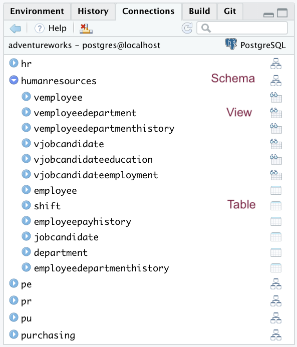
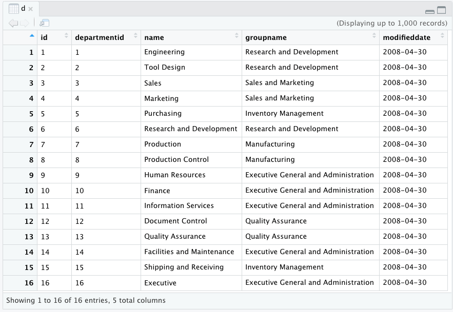

# Exploring a database {#chapter_database-exploration}

> This chapter demonstrates how to:
> 
> * Investigate what tables are in the database and what fields a table contains
> * Build up queries

## Setup

The following packages are used in this chapter:

```r
library(tidyverse)
library(DBI)
library(RPostgres)
library(dbplyr)
require(knitr)
library(bookdown)
library(sqlpetr)
```
Assume that the Docker container with PostgreSQL and the adventureworks database are ready to go. If not go back to [Chapter 6][#chapter_setup-adventureworks-db]

```r
sqlpetr::sp_docker_start("adventureworks")
```
Connect to the database:

```r
con <- sqlpetr::sp_get_postgres_connection(
  user = Sys.getenv("DEFAULT_POSTGRES_USER_NAME"),
  password = Sys.getenv("DEFAULT_POSTGRES_PASSWORD"),
  dbname = "adventureworks",
  port = 5432, 
  seconds_to_test = 20, 
  connection_tab = TRUE
)
```

## Getting data from the database

As we show later on, the database serves as a store of data and as an engine for sub-setting, joining, and computation on the data.  We begin with getting data from the dbms, or "downloading" data.

### Finding out what's there

We've already seen how the connections tab is the easiest way to explore a database.  



It's a little more complex than the typical `SQLite` examples found in many tutorials because we have additional structure: the `adventureworks` [database contains schemas](https://en.wikipedia.org/wiki/Database_schema), which contain tables.  The `hr` schema is the same as the `sales` schema, but with nicknames (the `d` table in `hr` is the same as the `department` table in the `sales` schema).  Schemas are used to control access and to set up shortcuts.  Clicking on the the right opens up the table view of the `d` table:



Exploring a databse using R code is a little more complicated.  The following command does not give you a list of tables as it did in the simpler case when there were no schemas other than the `public` schema:

```r
tables <- DBI::dbListTables(con)
tables
```

```
## character(0)
```

We need to to tell the database which schemas to search

```r
dbExecute(con, "set search_path to sales, sa;")
```

```
## [1] 0
```

```r
DBI::dbListTables(con)
```

```
##  [1] "currencyrate"                      
##  [2] "c"                                 
##  [3] "cc"                                
##  [4] "customer"                          
##  [5] "creditcard"                        
##  [6] "cr"                                
##  [7] "crc"                               
##  [8] "store"                             
##  [9] "cu"                                
## [10] "pcc"                               
## [11] "personcreditcard"                  
## [12] "s"                                 
## [13] "specialoffer"                      
## [14] "sci"                               
## [15] "specialofferproduct"               
## [16] "so"                                
## [17] "salesorderheadersalesreason"       
## [18] "sod"                               
## [19] "soh"                               
## [20] "sohsr"                             
## [21] "sop"                               
## [22] "salespersonquotahistory"           
## [23] "sp"                                
## [24] "spqh"                              
## [25] "shoppingcartitem"                  
## [26] "salesperson"                       
## [27] "sr"                                
## [28] "countryregioncurrency"             
## [29] "currency"                          
## [30] "salesorderheader"                  
## [31] "salesreason"                       
## [32] "salestaxrate"                      
## [33] "st"                                
## [34] "sth"                               
## [35] "salesterritoryhistory"             
## [36] "tr"                                
## [37] "vindividualcustomer"               
## [38] "vpersondemographics"               
## [39] "vsalesperson"                      
## [40] "vsalespersonsalesbyfiscalyears"    
## [41] "vsalespersonsalesbyfiscalyearsdata"
## [42] "vstorewithaddresses"               
## [43] "vstorewithcontacts"                
## [44] "vstorewithdemographics"            
## [45] "salesterritory"                    
## [46] "salesorderdetail"
```
Notice the way the database designers have abbreviated table names for your convenience.

```r
DBI::dbListFields(con, "so")
```

```
##  [1] "id"             "specialofferid" "description"    "discountpct"   
##  [5] "type"           "category"       "startdate"      "enddate"       
##  [9] "minqty"         "maxqty"         "rowguid"        "modifieddate"
```

### Listing all the fields for all the tables

The first example, `DBI::dbListTables(con)` returned 46 tables and the second example, `DBI::dbListFields(con, "salesorderheader")` returns 12 fields.  Here we combine the two calls to return a list of tables which has a list of all the fields in the table.  The code block just shows the first two tables.


```r
table_columns <- purrr::map(tables, ~ dbListFields(.,con = con) )
```
Rename each list [[1]] ... [[43]] to meaningful table name

```r
names(table_columns) <- tables

head(table_columns)
```

```
## named list()
```

Later on we'll discuss how to get more extensive data about each table and column from the database's own store of metadata using a similar technique.  As we go further the issue of scale will come up again and again: you need to be careful about how much data a call to the dbms will return, whether it's a list of tables or a table that could have millions of rows.

It's important to connect with people who own, generate, or are the subjects of the data.  A good chat with people who own the data, generate it, or are the subjects can generate insights and set the context for your investigation of the database. The purpose for collecting the data or circumstances where it was collected may be buried far afield in an organization, but *usually someone knows*.  The metadata discussed in a later chapter is essential but will only take you so far.

There are different ways of just **looking at the data**, which we explore below.


### A table object that can be reused

The `dplyr::tbl` function gives us more control over access to a table by enabling  control over which columns and rows to download.  It creates  an object that might **look** like a data frame, but it's actually a list object that `dplyr` uses for constructing queries and retrieving data from the DBMS.  


```r
salesorderheader_table <- dplyr::tbl(con, "salesorderheader")
class(salesorderheader_table)
```

```
## [1] "tbl_PqConnection" "tbl_dbi"          "tbl_sql"         
## [4] "tbl_lazy"         "tbl"
```
### Table links for queries

To illustrate the different issues involved in data retrieval, we create more connection objects to link to two other tables.  

```r
salesorderheader_table <- tbl(con, in_schema("sales", "salesorderheader")) %>% 
  select(-rowguid, -modifieddate)
```
The 'salesorderheader' table has 31,465 obs. of  23 columns because we dropped `modifieddate` which is a column name that appears in more than one table.  To get the data we want we will usually want to drop or rename duplicates as we connect to each table.


```r
address_table <- tbl(con, in_schema("person", "address")) %>% 
  select(-rowguid) %>% 
  rename(address_info_updated = modifieddate)
```
The 'address' table has 19,614 rows and 8 columns.

Here is a simple string of `dplyr` verbs similar to the query used to illustrate issues in the last chapter:


```r
Q <- salesorderheader_table %>% 
  left_join(address_table, 
            by = c("shiptoaddressid" = "addressid")) %>%
  dplyr::select(orderdate, shipdate, addressline1, city)

Q
```

```
## # Source:   lazy query [?? x 4]
## # Database: postgres [postgres@localhost:5432/adventureworks]
##    orderdate           shipdate            addressline1          city      
##    <dttm>              <dttm>              <chr>                 <chr>     
##  1 2011-05-31 00:00:00 2011-06-07 00:00:00 42525 Austell Road    Austell   
##  2 2011-05-31 00:00:00 2011-06-07 00:00:00 6055 Shawnee Industr… Suwanee   
##  3 2011-05-31 00:00:00 2011-06-07 00:00:00 2573 Dufferin Street  Toronto   
##  4 2011-05-31 00:00:00 2011-06-07 00:00:00 2500 University Aven… Toronto   
##  5 2011-05-31 00:00:00 2011-06-07 00:00:00 3065 Santa Margarita… Trabuco C…
##  6 2011-05-31 00:00:00 2011-06-07 00:00:00 765 Delridge Way Sw   Seattle   
##  7 2011-05-31 00:00:00 2011-06-07 00:00:00 4251 First Avenue     Seattle   
##  8 2011-05-31 00:00:00 2011-06-07 00:00:00 9920 Bridgepointe Pa… San Mateo 
##  9 2011-05-31 00:00:00 2011-06-07 00:00:00 St. Louis Marketplace Saint Lou…
## 10 2011-05-31 00:00:00 2011-06-07 00:00:00 254480 River Rd       Richmond  
## # … with more rows
```
Note that in the previous example we follow this book's convention of creating a connection object to each table and fully qualifying function names (e.g., specifying the package).  In practice, it's possible and convenient to use more abbreviated notation.

```r
Q <- tbl(con, in_schema("sales", "salesorderheader")) %>% 
  select(-rowguid, -modifieddate) %>% 
  left_join(tbl(con, in_schema("person", "address")), 
            by = c("shiptoaddressid" = "addressid")) %>%
  dplyr::select(orderdate, shipdate, addressline1, city)

Q
```

```
## # Source:   lazy query [?? x 4]
## # Database: postgres [postgres@localhost:5432/adventureworks]
##    orderdate           shipdate            addressline1          city      
##    <dttm>              <dttm>              <chr>                 <chr>     
##  1 2011-05-31 00:00:00 2011-06-07 00:00:00 42525 Austell Road    Austell   
##  2 2011-05-31 00:00:00 2011-06-07 00:00:00 6055 Shawnee Industr… Suwanee   
##  3 2011-05-31 00:00:00 2011-06-07 00:00:00 2573 Dufferin Street  Toronto   
##  4 2011-05-31 00:00:00 2011-06-07 00:00:00 2500 University Aven… Toronto   
##  5 2011-05-31 00:00:00 2011-06-07 00:00:00 3065 Santa Margarita… Trabuco C…
##  6 2011-05-31 00:00:00 2011-06-07 00:00:00 765 Delridge Way Sw   Seattle   
##  7 2011-05-31 00:00:00 2011-06-07 00:00:00 4251 First Avenue     Seattle   
##  8 2011-05-31 00:00:00 2011-06-07 00:00:00 9920 Bridgepointe Pa… San Mateo 
##  9 2011-05-31 00:00:00 2011-06-07 00:00:00 St. Louis Marketplace Saint Lou…
## 10 2011-05-31 00:00:00 2011-06-07 00:00:00 254480 River Rd       Richmond  
## # … with more rows
```


### Close the connection and shut down adventureworks

Where you place the `collect` function matters.

```r
DBI::dbDisconnect(con)
sqlpetr::sp_docker_stop("adventureworks")
```

## Additional reading

* [@Wickham2018]
* [@Baumer2018]

