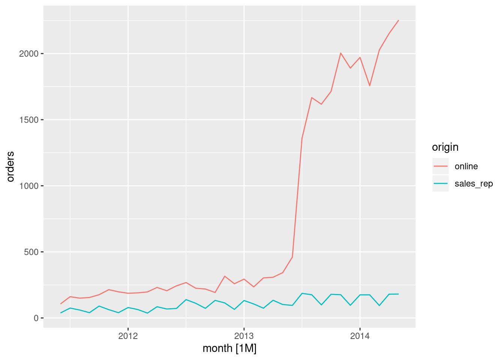
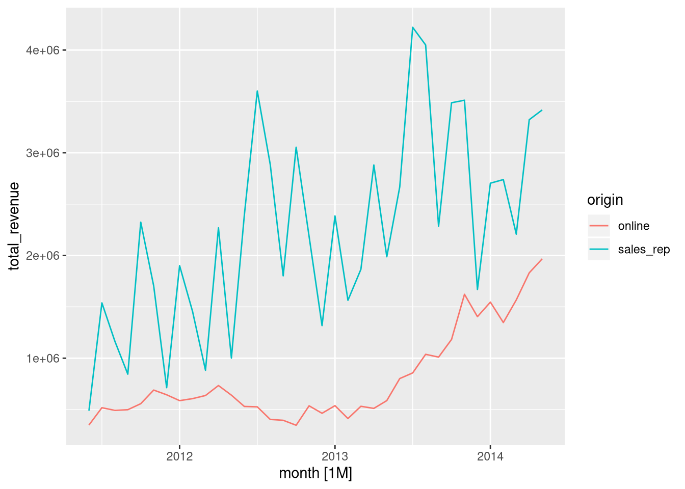
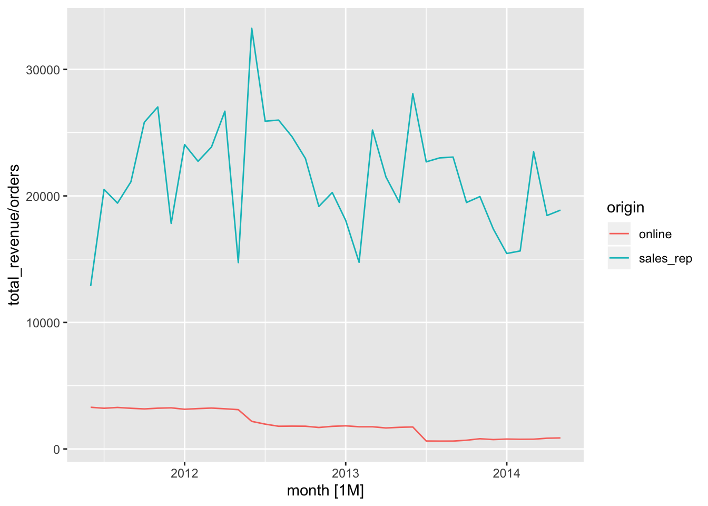

# Sales Forecasting {#chapter_sales-forecasting}

> This chapter demonstrates how to:
>
> * Use [`tidyverts`](https://tidyverts.org/) packages to explore and forecast sales data.

## Setup

The following packages are used in this chapter:

```r
library(tidyverse)
library(DBI)
library(RPostgres)
require(knitr)
library(bookdown)
library(sqlpetr)
library(tsibble)
library(fable)
library(zoo)
```
Analyzing sales time series, in particular determining seasonality and forecasting future sales, is a common activty in business management. A collection of packages called `tidyverst` is designed to do this in a tidy data framework.

First, we make sure the Docker container is ready and connect to the `adventureworks` database.


```r
sqlpetr::sp_docker_start("adventureworks")
con <- sqlpetr::sp_get_postgres_connection(
  user = Sys.getenv("DEFAULT_POSTGRES_USER_NAME"),
  password = Sys.getenv("DEFAULT_POSTGRES_PASSWORD"),
  dbname = "adventureworks",
  port = 5432,
  seconds_to_test = 20,
  connection_tab = FALSE
)
```
Next, we retrieve the "sales order header" table from the database, close the connection and stop the container.


```r
dbExecute(con, "set search_path to sales;")
```

```
## [1] 0
```

```r
salesorderheader_tibble <- DBI::dbReadTable(con, "salesorderheader")
DBI::dbDisconnect(con)
sqlpetr::sp_docker_stop("adventureworks")
```

## Exploring the sales data

Some assumptions:
1. The business requirement is to analyze / forecast revenue.
2. The revenue figures we care about are those in the `subtotal` column. The shipping and tax numbers are costs, not revenue.
3. The values in column `subtotal` have been converted to the common currency of the Adventureworks headquarters.

In a real-world setting, the analyst would need to validate these assumptions. Given that, our first task is to create a `tsibble` - a time series tibble - of monthly revenue figures.

### Creating a tsibble


```r
monthly_tsibble <- salesorderheader_tibble %>%
  dplyr::mutate(
    origin = ifelse(onlineorderflag, "online", "sales_rep"),
    month = lubridate::floor_date(shipdate, unit = "months") %>%
      as.yearmon()
  ) %>%
  dplyr::group_by(origin, month) %>%
    dplyr::summarize(orders = n(), total_revenue = sum(subtotal)) %>%
  dplyr::ungroup()

# Note that there are two more months - June and July of 2014 - for the
# online data, and the revenue values are suspiciously low.
# We remove them for consistency.
monthly_tsibble <- monthly_tsibble %>%
  dplyr::filter(month < '2014-06-01') %>%
  tsibble::as_tsibble(key = origin, index = month)
```


### Exploring the data

First, let's look at orders for online and sales representative sales:


```r
monthly_tsibble %>% autoplot(orders)
```

```
## Don't know how to automatically pick scale for object of type yearmon. Defaulting to continuous.
```


Disconnect from the database:

```r
dbDisconnect(con)
```

```
## Warning in connection_release(conn@ptr): Already disconnected
```

## Cleaning up

Always have R disconnect from the database when you're done.

```r
dbDisconnect(con)
```

```
## Warning in connection_release(conn@ptr): Already disconnected
```

```

Wow! Online orders really took off in the late spring - early summer of 2013! How about revenues?


```r
monthly_tsibble %>% autoplot(total_revenue)
```

```
## Don't know how to automatically pick scale for object of type yearmon. Defaulting to continuous.
```



There's an increase, but the sales representatives always brought in more revenue than the online platform. And there's a pronounced variation in the revenue from sales representatives on a month-to-month basis.

Before moving on, let's look at revenue per order.


```r
monthly_tsibble %>% autoplot(total_revenue / orders)
```

```
## Don't know how to automatically pick scale for object of type yearmon. Defaulting to continuous.
```



For the sales representatives, there's still a month-to-month variation but the revenue per order appears to be bounded both below and above. However, the online revenue per order is decreasing. Note that this decline appears to be in steps between May and June each year; that could mean it's an artifact of the database creation process and not a "natural" phenomenon.

## Disconnect from the database and stop Docker


```r
dbDisconnect(con)
```

```
## Warning in connection_release(conn@ptr): Already disconnected
```

```r
sp_docker_stop("adventureworks")
```
