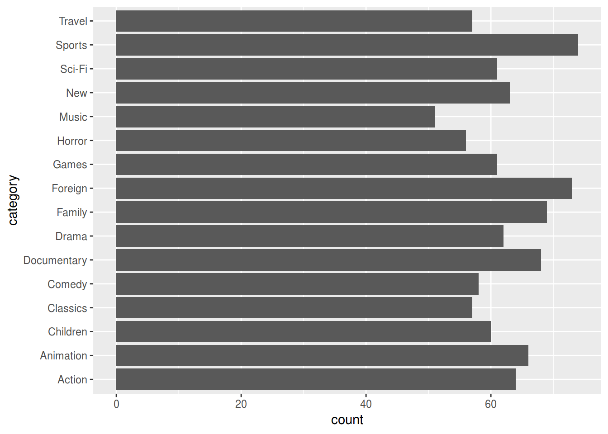

# Lazy Evaluation and Lazy Queries {#chapter_lazy-evaluation-queries}

> This chapter:
> 
> * Reviews lazy loading, lazy evaluation and lazy query execution
> * Demonstrates how `dplyr` code gets executed (and how R determines what is translated to SQL and what is processed locally by R)
> * Offers some further resources on lazy loading, evaluation, execution, etc.
>

## Setup

The following packages are used in this chapter:

```r
library(tidyverse)
library(DBI)
library(RPostgres)
library(dbplyr)
require(knitr)
library(bookdown)
library(sqlpetr)
```
If you have not yet set up the Docker container with PostgreSQL and the dvdrental database, go back to [those instructions][Build the pet-sql Docker Image] to configure your environment. Otherwise, start your `sql-pet` container:

```r
sqlpetr::sp_docker_start("sql-pet")
```
Connect to the database:

```r
con <- sqlpetr::sp_get_postgres_connection(
  user = Sys.getenv("DEFAULT_POSTGRES_USER_NAME"),
  password = Sys.getenv("DEFAULT_POSTGRES_PASSWORD"),
  dbname = "dvdrental",
  seconds_to_test = 30, connection_tab = TRUE
)
```

## R is lazy and comes with guardrails

By design, R is both a language and an interactive development environment (IDE).  As a language, R tries to be as efficient as possible.  As an IDE, R creates some guardrails to make it easy and safe to work with your data. For example `getOption("max.print")` prevents R from printing more rows of data than you want to handle in an interactive session, with a default of 99999 lines, which may or may not suit you.

On the other hand SQL is a *"Structured Query Language (SQL): a standard computer language for relational database management and data manipulation."* ^[https://www.techopedia.com/definition/1245/structured-query-language-sql]. SQL has various database-specific Interactive Development Environments (IDEs), such as [pgAdmin](https://www.pgadmin.org/) for PostgreSQL.  Roger Peng explains in [R Programming for Data Science](https://bookdown.org/rdpeng/rprogdatascience/history-and-overview-of-r.html#basic-features-of-r) that:

> R has maintained the original S philosophy, which is that it provides a language that is both useful for interactive work, but contains a powerful programming language for developing new tools. 

This is complicated when R interacts with SQL.  In a [vignette for dbplyr](https://cran.r-project.org/web/packages/dbplyr/vignettes/dbplyr.html) Hadley Wickham explains:

> The most important difference between ordinary data frames and remote database queries is that your R code is translated into SQL and executed in the database on the remote server, not in R on your local machine. When working with databases, dplyr tries to be as lazy as possible:
> 
> * It never pulls data into R unless you explicitly ask for it.
> 
> * It delays doing any work until the last possible moment: it collects together everything you want to do and then sends it to the database in one step.
> 

Exactly when, which, and how much data is returned from the dbms is the topic of this chapter.  Exactly how the data is represented in the dbms and then translated to a data frame is discussed in the [DBI specification](https://cran.r-project.org/web/packages/DBI/vignettes/spec.html#_fetch_records_from_a_previously_executed_query_).

Eventually, if you are interacting with a dbms from R you will need to understand the differences between lazy loading, lazy evaluation, and lazy queries.

### Lazy loading

"*Lazy loading is always used for code in packages but is optional (selected by the package maintainer) for datasets in packages.*"^[https://cran.r-project.org/doc/manuals/r-release/R-ints.html#Lazy-loading]  Lazy loading means that the code for a particular function doesn't actually get loaded into memory until the last minute -- when it's actually being used.

### Lazy evaluation 

Essentially "Lazy evaluation is a programming strategy that allows a symbol to be evaluated only when needed." ^[https://colinfay.me/lazyeval/]  That means that lazy evaluation is about **symbols** such as function arguments ^[http://adv-r.had.co.nz/Functions.html#function-arguments] when they are evaluated. Tidy evaluation complicates lazy evaluation. ^[https://colinfay.me/tidyeval-1/]

### Lazy Queries

"*When you create a "lazy" query, you're creating a pointer to a set of conditions on the database, but the query isn't actually run and the data isn't actually loaded until you call "next" or some similar method to actually fetch the data and load it into an object.*" ^[https://www.quora.com/What-is-a-lazy-query]

## Lazy evaluation and lazy queries

### `dplyr` connection objects
As introduced in the previous chapter, the `dplyr::tbl` function creates an object that might **look** like a data frame in that when you enter it on the command line, it prints a bunch of rows from the dbms table.  But it is actually a **list** object that `dplyr` uses for constructing queries and retrieving data from the DBMS.  

The following code illustrates these issues.  The `dplyr::tbl` function creates the connection object that we store in an object named `film_table`:

```r
film_table <- dplyr::tbl(con, "film")
```

At first glance, it _acts_ like a data frame when you print it, although it only prints 10 of the table's 1,000 rows:

```r
film_table
```

```
## # Source:   table<film> [?? x 13]
## # Database: postgres [postgres@localhost:5432/dvdrental]
##    film_id title description release_year language_id rental_duration
##      <int> <chr> <chr>              <int>       <int>           <int>
##  1     133 Cham… A Fateful …         2006           1               7
##  2     384 Gros… A Epic Dra…         2006           1               5
##  3       8 Airp… A Epic Tal…         2006           1               6
##  4      98 Brig… A Fateful …         2006           1               4
##  5       1 Acad… A Epic Dra…         2006           1               6
##  6       2 Ace … A Astoundi…         2006           1               3
##  7       3 Adap… A Astoundi…         2006           1               7
##  8       4 Affa… A Fanciful…         2006           1               5
##  9       5 Afri… A Fast-Pac…         2006           1               6
## 10       6 Agen… A Intrepid…         2006           1               3
## # … with more rows, and 7 more variables: rental_rate <dbl>, length <int>,
## #   replacement_cost <dbl>, rating <chr>, last_update <dttm>,
## #   special_features <chr>, fulltext <chr>
```

However, notice that the first output line shows `??`, rather than providing the number of rows in the table. Similarly, the next to last line shows:
```
    … with more rows, and 7 more variables
```
whereas the output for a normal `tbl` of this film data would say:
```
    … with more 1,000, and 7 more variables
```

So even though `film_table` is a `tbl`, it's **also** a `tbl_PqConnection`:

```r
class(film_table)
```

```
## [1] "tbl_PqConnection" "tbl_dbi"          "tbl_sql"         
## [4] "tbl_lazy"         "tbl"
```

It is not just a normal `tbl` of data. We can see that from the structure of `film_table`:

```r
str(film_table)
```

```
## List of 2
##  $ src:List of 2
##   ..$ con  :Formal class 'PqConnection' [package "RPostgres"] with 3 slots
##   .. .. ..@ ptr     :<externalptr> 
##   .. .. ..@ bigint  : chr "integer64"
##   .. .. ..@ typnames:'data.frame':	437 obs. of  2 variables:
##   .. .. .. ..$ oid    : int [1:437] 16 17 18 19 20 21 22 23 24 25 ...
##   .. .. .. ..$ typname: chr [1:437] "bool" "bytea" "char" "name" ...
##   ..$ disco: NULL
##   ..- attr(*, "class")= chr [1:4] "src_PqConnection" "src_dbi" "src_sql" "src"
##  $ ops:List of 2
##   ..$ x   : 'ident' chr "film"
##   ..$ vars: chr [1:13] "film_id" "title" "description" "release_year" ...
##   ..- attr(*, "class")= chr [1:3] "op_base_remote" "op_base" "op"
##  - attr(*, "class")= chr [1:5] "tbl_PqConnection" "tbl_dbi" "tbl_sql" "tbl_lazy" ...
```

It has only _two_ rows!  The first row contains all the information in the `con` object, which contains information about all the tables and objects in the database:

```r
film_table$src$con@typnames$typname[380:437]
```

```
##  [1] "customer"                    "_customer"                  
##  [3] "actor_actor_id_seq"          "actor"                      
##  [5] "_actor"                      "category_category_id_seq"   
##  [7] "category"                    "_category"                  
##  [9] "film_film_id_seq"            "film"                       
## [11] "_film"                       "pg_toast_16434"             
## [13] "film_actor"                  "_film_actor"                
## [15] "film_category"               "_film_category"             
## [17] "actor_info"                  "_actor_info"                
## [19] "address_address_id_seq"      "address"                    
## [21] "_address"                    "city_city_id_seq"           
## [23] "city"                        "_city"                      
## [25] "country_country_id_seq"      "country"                    
## [27] "_country"                    "customer_list"              
## [29] "_customer_list"              "film_list"                  
## [31] "_film_list"                  "inventory_inventory_id_seq" 
## [33] "inventory"                   "_inventory"                 
## [35] "language_language_id_seq"    "language"                   
## [37] "_language"                   "nicer_but_slower_film_list" 
## [39] "_nicer_but_slower_film_list" "payment_payment_id_seq"     
## [41] "payment"                     "_payment"                   
## [43] "rental_rental_id_seq"        "rental"                     
## [45] "_rental"                     "sales_by_film_category"     
## [47] "_sales_by_film_category"     "staff_staff_id_seq"         
## [49] "staff"                       "_staff"                     
## [51] "pg_toast_16529"              "store_store_id_seq"         
## [53] "store"                       "_store"                     
## [55] "sales_by_store"              "_sales_by_store"            
## [57] "staff_list"                  "_staff_list"
```
The second row contains a list of the columns in the `film` table, among other things:

```r
film_table$ops$vars
```

```
##  [1] "film_id"          "title"            "description"     
##  [4] "release_year"     "language_id"      "rental_duration" 
##  [7] "rental_rate"      "length"           "replacement_cost"
## [10] "rating"           "last_update"      "special_features"
## [13] "fulltext"
```
`film_table` holds information needed to get the data from the 'film' table, but `film_table` does not hold the data itself. In the following sections, we will examine more closely this relationship between the `film_table` object and the data in the database's 'film' table.

## When does a lazy query trigger data retrieval?

### Create a black box query for experimentation

To illustrate the different issues involved in data retrieval, we create more connection objects to link to two other tables.  

```r
film_category_table <- tbl(con, "film_category") %>% 
  select(-last_update)
```
The 'film_category' table has 1,000 rows and 2 columns because we dropped `last_update` which is a column name that appears in more than one table and will just mess things up (and we don't really care when the category was updated).


```r
category_table <- tbl(con, "category") %>% 
  select(-last_update) %>% rename(category = name)
```
The 'category_table' table has 16 rows.

Here is a typical string of `dplyr` verbs strung together with the magrittr `%>%` pipe command that will be used to tease out the several different behaviors that a lazy query has when passed to different R functions.  This query joins three connection objects into a query we'll call `Q`:


```r
film_table <- tbl(con, "film")
Q <- film_table %>%
  dplyr::left_join(film_category_table, by = c("film_id" = "film_id")) %>%
  dplyr::left_join(category_table, by = c("category_id" = "category_id")) %>% 
  dplyr::select(title, length, rating, category)
```
The `str` function gives us a hint at how R is collecting information that can be used to construct and execute a query later on:

```r
str(Q, max.level = 2)
```

```
## List of 2
##  $ src:List of 2
##   ..$ con  :Formal class 'PqConnection' [package "RPostgres"] with 3 slots
##   ..$ disco: NULL
##   ..- attr(*, "class")= chr [1:4] "src_PqConnection" "src_dbi" "src_sql" "src"
##  $ ops:List of 4
##   ..$ name: chr "select"
##   ..$ x   :List of 4
##   .. ..- attr(*, "class")= chr [1:3] "op_join" "op_double" "op"
##   ..$ dots:List of 4
##   .. ..- attr(*, "class")= chr "quosures"
##   ..$ args: list()
##   ..- attr(*, "class")= chr [1:3] "op_select" "op_single" "op"
##  - attr(*, "class")= chr [1:5] "tbl_PqConnection" "tbl_dbi" "tbl_sql" "tbl_lazy" ...
```

### Experiment overview
Think of `Q` as a black box for the moment.  The following examples will show how `Q` is interpreted differently by different functions. It's important to remember in the following discussion that the "**and then**" operator (`%>%`) actually wraps the subsequent code inside the preceding code so that `Q %>% print()` is equivalent to `print(Q)`.

**Notation**

>  A single green check indicates that some rows are returned. <br>
>   Two green checks indicate that all the rows are returned. <br>
>  The red X indicates that no rows are returned.
>

> R code | Result 
> -------| --------------
> [`Q %>% print()`](#lazy_q_print) |  Prints x rows; same as just entering `Q`  
> [`Q %>% dplyr::as_tibble()`](#Q-as-tibble) |  Forces `Q` to be a tibble
> [`Q %>% head()`](#lazy_q_head) |  Prints the first 6 rows 
> [`Q %>% tail()`](#lazy_q_tail) |  Error: tail() is not supported by sql sources 
> [`Q %>% length()`](#lazy_q_length) |   Counts the rows in `Q`
> [`Q %>% str()`](#lazy_q_str) |  Shows the top 3 levels of the **object** `Q` 
> [`Q %>% nrow()`](#lazy_q_nrow) |  **Attempts** to determine the number of rows 
> [`Q %>% dplyr::tally()`](#lazy_q_tally) |   Counts all the rows -- on the dbms side
> [`Q %>% dplyr::collect(n = 20)`](#lazy_q_collect) |  Prints 20 rows  
> [`Q %>% dplyr::collect(n = 20) %>% head()`](#lazy_q_collect) |  Prints 6 rows  
> [`Q %>% ggplot`](#lazy_q_plot-categories) |   Plots a barchart
> [`Q %>% dplyr::show_query()`](#lazy-q-show-query) |  **Translates** the lazy query object into SQL 
> 

The next chapter will discuss how to build queries and how to explore intermediate steps. But first, the following subsections provide a more detailed discussion of each row in the preceding table.

### Q %>% print(){#lazy_q_print}

Remember that `Q %>% print()` is equivalent to `print(Q)` and the same as just entering `Q` on the command line.  We use the magrittr pipe operator here, because chaining functions highlights how the same object behaves differently in each use.

```r
Q %>% print()
```

```
## # Source:   lazy query [?? x 4]
## # Database: postgres [postgres@localhost:5432/dvdrental]
##    title            length rating category   
##    <chr>             <int> <chr>  <chr>      
##  1 Academy Dinosaur     86 PG     Documentary
##  2 Ace Goldfinger       48 G      Horror     
##  3 Adaptation Holes     50 NC-17  Documentary
##  4 Affair Prejudice    117 G      Horror     
##  5 African Egg         130 G      Family     
##  6 Agent Truman        169 PG     Foreign    
##  7 Airplane Sierra      62 PG-13  Comedy     
##  8 Airport Pollock      54 R      Horror     
##  9 Alabama Devil       114 PG-13  Horror     
## 10 Aladdin Calendar     63 NC-17  Sports     
## # … with more rows
```
 R retrieves 10 observations and 3 columns.  In its role as IDE, R has provided nicely formatted output that is similar to what it prints for a tibble, with descriptive information about the dataset and each column:

> 
> ## # Source:   lazy query [?? x 4]
> ## # Database: postgres [postgres@localhost:5432/dvdrental]
> ##    title            length rating category   
> ##    <chr>             <int> <chr>  <chr>      
> 

R has not determined how many rows are left to retrieve as it shows with `[?? x 4]` and `... with more rows` in the data summary. 

### Q %>% dplyr::as_tibble() {#lazy_q_as-tibble}

  In contrast to `print()`, the `as_tibble()` function causes R to download the whole table, using tibble's default of displaying only the first 10 rows.

```r
Q %>% dplyr::as_tibble()
```

```
## # A tibble: 1,000 x 4
##    title            length rating category   
##    <chr>             <int> <chr>  <chr>      
##  1 Academy Dinosaur     86 PG     Documentary
##  2 Ace Goldfinger       48 G      Horror     
##  3 Adaptation Holes     50 NC-17  Documentary
##  4 Affair Prejudice    117 G      Horror     
##  5 African Egg         130 G      Family     
##  6 Agent Truman        169 PG     Foreign    
##  7 Airplane Sierra      62 PG-13  Comedy     
##  8 Airport Pollock      54 R      Horror     
##  9 Alabama Devil       114 PG-13  Horror     
## 10 Aladdin Calendar     63 NC-17  Sports     
## # … with 990 more rows
```

### Q %>% head() {#lazy_q_head}

 The `head()` function is very similar to print but has a different "`max.print`" value.

```r
Q %>% head()
```

```
## # Source:   lazy query [?? x 4]
## # Database: postgres [postgres@localhost:5432/dvdrental]
##   title            length rating               category   
##   <chr>             <int> <S3: pq_mpaa_rating> <chr>      
## 1 Academy Dinosaur     86 PG                   Documentary
## 2 Ace Goldfinger       48 G                    Horror     
## 3 Adaptation Holes     50 NC-17                Documentary
## 4 Affair Prejudice    117 G                    Horror     
## 5 African Egg         130 G                    Family     
## 6 Agent Truman        169 PG                   Foreign
```

### Q %>% tail() {#lazy_q_tail}

 Produces an error, because `Q` does not hold all of the data, so it is not possible to list the last few items from the table:

```r
try(
  Q %>% tail(),
  silent = FALSE,
  outFile = stdout()
)
```

```
## Error : tail() is not supported by sql sources
```

### Q %>% length() {#lazy_q_length}

 Because the `Q` object is relatively complex, using `str()` on it prints many lines.  You can glimpse what's going on with `length()`:

```r
Q %>% length()
```

```
## [1] 2
```

### Q %>% str() {#lazy_q_str}

 Looking inside shows some of what's going on (three levels deep):

```r
Q %>% str(max.level = 3) 
```

```
## List of 2
##  $ src:List of 2
##   ..$ con  :Formal class 'PqConnection' [package "RPostgres"] with 3 slots
##   ..$ disco: NULL
##   ..- attr(*, "class")= chr [1:4] "src_PqConnection" "src_dbi" "src_sql" "src"
##  $ ops:List of 4
##   ..$ name: chr "select"
##   ..$ x   :List of 4
##   .. ..$ name: chr "join"
##   .. ..$ x   :List of 2
##   .. .. ..- attr(*, "class")= chr [1:5] "tbl_PqConnection" "tbl_dbi" "tbl_sql" "tbl_lazy" ...
##   .. ..$ y   :List of 2
##   .. .. ..- attr(*, "class")= chr [1:5] "tbl_PqConnection" "tbl_dbi" "tbl_sql" "tbl_lazy" ...
##   .. ..$ args:List of 4
##   .. ..- attr(*, "class")= chr [1:3] "op_join" "op_double" "op"
##   ..$ dots:List of 4
##   .. ..$ : language ~title
##   .. .. ..- attr(*, ".Environment")=<environment: 0x7f87056fa170> 
##   .. ..$ : language ~length
##   .. .. ..- attr(*, ".Environment")=<environment: 0x7f87056fa170> 
##   .. ..$ : language ~rating
##   .. .. ..- attr(*, ".Environment")=<environment: 0x7f87056fa170> 
##   .. ..$ : language ~category
##   .. .. ..- attr(*, ".Environment")=<environment: 0x7f87056fa170> 
##   .. ..- attr(*, "class")= chr "quosures"
##   ..$ args: list()
##   ..- attr(*, "class")= chr [1:3] "op_select" "op_single" "op"
##  - attr(*, "class")= chr [1:5] "tbl_PqConnection" "tbl_dbi" "tbl_sql" "tbl_lazy" ...
```

### Q %>% nrow() {#lazy_q_nrow}

 Notice the difference between `nrow()` and `tally()`. The `nrow` functions returns `NA` and does not execute a query:

```r
Q %>% nrow()
```

```
## [1] NA
```

### Q %>% dplyr::tally() {#lazy_q_tally}

 The `tally` function actually counts all the rows.

```r
Q %>% dplyr::tally()
```

```
## # Source:   lazy query [?? x 1]
## # Database: postgres [postgres@localhost:5432/dvdrental]
##   n              
##   <S3: integer64>
## 1 1000
```
The `nrow()` function knows that `Q` is a list.  On the other hand, the `tally()` function tells SQL to go count all the rows. Notice that `Q` results in 1,000 rows -- the same number of rows as `film`.

### Q %>% dplyr::collect(){#lazy_q_collect}

 The dplyr::[collect](https://dplyr.tidyverse.org/reference/compute.html) function triggers a call to the `DBI:dbFetch()` function behind the scenes, which forces R to download a specified number of rows:

```r
Q %>% dplyr::collect(n = 20)
```

```
## # A tibble: 20 x 4
##    title               length rating category   
##    <chr>                <int> <chr>  <chr>      
##  1 Academy Dinosaur        86 PG     Documentary
##  2 Ace Goldfinger          48 G      Horror     
##  3 Adaptation Holes        50 NC-17  Documentary
##  4 Affair Prejudice       117 G      Horror     
##  5 African Egg            130 G      Family     
##  6 Agent Truman           169 PG     Foreign    
##  7 Airplane Sierra         62 PG-13  Comedy     
##  8 Airport Pollock         54 R      Horror     
##  9 Alabama Devil          114 PG-13  Horror     
## 10 Aladdin Calendar        63 NC-17  Sports     
## 11 Alamo Videotape        126 G      Foreign    
## 12 Alaska Phantom         136 PG     Music      
## 13 Ali Forever            150 PG     Horror     
## 14 Alice Fantasia          94 NC-17  Classics   
## 15 Alien Center            46 NC-17  Foreign    
## 16 Alley Evolution        180 NC-17  Foreign    
## 17 Alone Trip              82 R      Music      
## 18 Alter Victory           57 PG-13  Animation  
## 19 Amadeus Holy           113 PG     Action     
## 20 Amelie Hellfighters     79 R      Music
```

```r
Q %>% dplyr::collect(n = 20) %>% head()
```

```
## # A tibble: 6 x 4
##   title            length rating category   
##   <chr>             <int> <chr>  <chr>      
## 1 Academy Dinosaur     86 PG     Documentary
## 2 Ace Goldfinger       48 G      Horror     
## 3 Adaptation Holes     50 NC-17  Documentary
## 4 Affair Prejudice    117 G      Horror     
## 5 African Egg         130 G      Family     
## 6 Agent Truman        169 PG     Foreign
```
The `dplyr::collect` function triggers the creation of a tibble and controls the number of rows that the DBMS sends to R.  Notice that `head` only prints 6 of the 20 rows that R has retrieved.

If you do not provide a value for the `n` argument, _all_ of the rows will be retrieved into your R workspace.

### Q %>% ggplot {#lazy_q_plot-categories}

Passing the `Q` object to `ggplot` executes the query and plots the result.

```r
Q %>% ggplot2::ggplot(aes(category)) + geom_bar() + coord_flip()
```



It's obvious that when creating our phony `dvdrental` datbase, phony films were assigned to a category pretty randomly.

### Q %>% dplyr::show_query() {#lazy_q_show-query}


```r
Q %>% dplyr::show_query()
```

```
## <SQL>
## SELECT "title", "length", "rating", "category"
## FROM (SELECT "TBL_LEFT"."film_id" AS "film_id", "TBL_LEFT"."title" AS "title", "TBL_LEFT"."description" AS "description", "TBL_LEFT"."release_year" AS "release_year", "TBL_LEFT"."language_id" AS "language_id", "TBL_LEFT"."rental_duration" AS "rental_duration", "TBL_LEFT"."rental_rate" AS "rental_rate", "TBL_LEFT"."length" AS "length", "TBL_LEFT"."replacement_cost" AS "replacement_cost", "TBL_LEFT"."rating" AS "rating", "TBL_LEFT"."last_update" AS "last_update", "TBL_LEFT"."special_features" AS "special_features", "TBL_LEFT"."fulltext" AS "fulltext", "TBL_LEFT"."category_id" AS "category_id", "TBL_RIGHT"."category" AS "category"
##   FROM (SELECT "TBL_LEFT"."film_id" AS "film_id", "TBL_LEFT"."title" AS "title", "TBL_LEFT"."description" AS "description", "TBL_LEFT"."release_year" AS "release_year", "TBL_LEFT"."language_id" AS "language_id", "TBL_LEFT"."rental_duration" AS "rental_duration", "TBL_LEFT"."rental_rate" AS "rental_rate", "TBL_LEFT"."length" AS "length", "TBL_LEFT"."replacement_cost" AS "replacement_cost", "TBL_LEFT"."rating" AS "rating", "TBL_LEFT"."last_update" AS "last_update", "TBL_LEFT"."special_features" AS "special_features", "TBL_LEFT"."fulltext" AS "fulltext", "TBL_RIGHT"."category_id" AS "category_id"
##   FROM "film" AS "TBL_LEFT"
##   LEFT JOIN (SELECT "film_id", "category_id"
## FROM "film_category") "TBL_RIGHT"
##   ON ("TBL_LEFT"."film_id" = "TBL_RIGHT"."film_id")
## ) "TBL_LEFT"
##   LEFT JOIN (SELECT "category_id", "name" AS "category"
## FROM (SELECT "category_id", "name"
## FROM "category") "lfcwgzpzjo") "TBL_RIGHT"
##   ON ("TBL_LEFT"."category_id" = "TBL_RIGHT"."category_id")
## ) "lolfcqlbui"
```
Hand-written SQL code to do the same job will probably look a lot nicer and could be more efficient, but functionally `dplyr` does the job.


```r
DBI::dbDisconnect(con)
sqlpetr::sp_docker_stop("sql-pet")
```


## Other resources

* Benjamin S. Baumer. 2017. A Grammar for Reproducible and Painless Extract-Transform-Load Operations on Medium Data. [https://arxiv.org/abs/1708.07073](https://arxiv.org/abs/1708.07073) 
* dplyr Reference documentation: Remote tables. [https://dplyr.tidyverse.org/reference/index.html#section-remote-tables](https://dplyr.tidyverse.org/reference/index.html#section-remote-tables)
* Data Carpentry. SQL Databases and R. [https://datacarpentry.org/R-ecology-lesson/05-r-and-databases.html](https://datacarpentry.org/R-ecology-lesson/05-r-and-databases.html)


