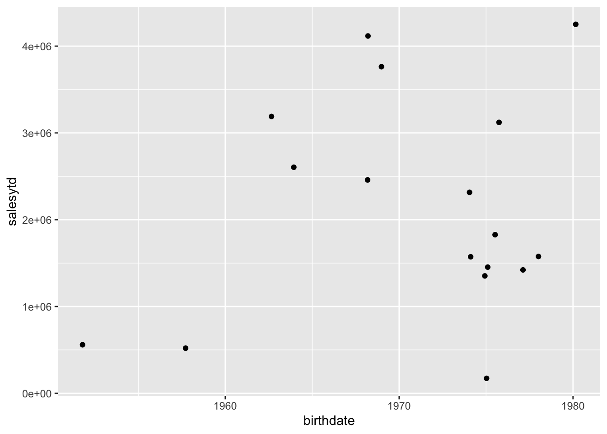

# Lazy Evaluation and Lazy Queries {#chapter_lazy-evaluation-queries}

> This chapter:
> 
> * Reviews lazy loading, lazy evaluation and lazy query execution
> * Demonstrates how `dplyr` code gets executed (and how R determines what is translated to SQL and what is processed locally by R)
> * Offers some further resources on lazy loading, evaluation, execution, etc.
>

## Setup

The following packages are used in this chapter:

```r
library(tidyverse)
library(DBI)
library(RPostgres)
library(dbplyr)
require(knitr)
library(bookdown)
library(sqlpetr)
```
Start your `adventureworks` container:

```r
sqlpetr::sp_docker_start("adventureworks")
```
Connect to the database:

```r
con <- sqlpetr::sp_get_postgres_connection(
  user = Sys.getenv("DEFAULT_POSTGRES_USER_NAME"),
  password = Sys.getenv("DEFAULT_POSTGRES_PASSWORD"),
  dbname = "adventureworks",
  port = 5432, 
  seconds_to_test = 20, 
  connection_tab = TRUE
)
```

## R is lazy and comes with guardrails

By design, R is both a language and an interactive development environment (IDE).  As a language, R tries to be as efficient as possible.  As an IDE, R creates some guardrails to make it easy and safe to work with your data. For example `getOption("max.print")` prevents R from printing more rows of data than you want to handle in an interactive session, with a default of 99999 lines, which may or may not suit you.

On the other hand SQL is a *"Structured Query Language (SQL): a standard computer language for relational database management and data manipulation."* ^[https://www.techopedia.com/definition/1245/structured-query-language-sql]. SQL has various database-specific Interactive Development Environments (IDEs), such as [pgAdmin](https://www.pgadmin.org/) for PostgreSQL.  Roger Peng explains in [R Programming for Data Science](https://bookdown.org/rdpeng/rprogdatascience/history-and-overview-of-r.html#basic-features-of-r) that:

> R has maintained the original S philosophy, which is that it provides a language that is both useful for interactive work, but contains a powerful programming language for developing new tools. 

This is complicated when R interacts with SQL.  In a [vignette for dbplyr](https://cran.r-project.org/web/packages/dbplyr/vignettes/dbplyr.html) Hadley Wickham explains:

> The most important difference between ordinary data frames and remote database queries is that your R code is translated into SQL and executed in the database on the remote server, not in R on your local machine. When working with databases, dplyr tries to be as lazy as possible:
> 
> * It never pulls data into R unless you explicitly ask for it.
> 
> * It delays doing any work until the last possible moment: it collects together everything you want to do and then sends it to the database in one step.
> 

Exactly when, which, and how much data is returned from the dbms is the topic of this chapter.  Exactly how the data is represented in the dbms and then translated to a data frame is discussed in the [DBI specification](https://cran.r-project.org/web/packages/DBI/vignettes/spec.html#_fetch_records_from_a_previously_executed_query_).

Eventually, if you are interacting with a dbms from R you will need to understand the differences between lazy loading, lazy evaluation, and lazy queries.

### Lazy loading

"*Lazy loading is always used for code in packages but is optional (selected by the package maintainer) for datasets in packages.*"^[https://cran.r-project.org/doc/manuals/r-release/R-ints.html#Lazy-loading]  Lazy loading means that the code for a particular function doesn't actually get loaded into memory until the last minute -- when it's actually being used.

### Lazy evaluation 

Essentially "Lazy evaluation is a programming strategy that allows a symbol to be evaluated only when needed." ^[https://colinfay.me/lazyeval/]  That means that lazy evaluation is about **symbols** such as function arguments ^[http://adv-r.had.co.nz/Functions.html#function-arguments] when they are evaluated. Tidy evaluation complicates lazy evaluation. ^[https://colinfay.me/tidyeval-1/]

### Lazy Queries

"*When you create a "lazy" query, you're creating a pointer to a set of conditions on the database, but the query isn't actually run and the data isn't actually loaded until you call "next" or some similar method to actually fetch the data and load it into an object.*" ^[https://www.quora.com/What-is-a-lazy-query]

## Lazy evaluation and lazy queries


When does a lazy query trigger data retrieval?  It depends on a lot of factors, as we explore below:

### Create a black box query for experimentation

Define the three tables discussed in the previous chapter to build a _black box_ query:

```r
sales_person_table <- tbl(con, in_schema("sales", "salesperson")) %>% 
  select(-rowguid) %>% 
  rename(sale_info_updated = modifieddate)

employee_table <- tbl(con, in_schema("humanresources", "employee")) %>% 
  select(-modifieddate, -rowguid)

person_table <- tbl(con, in_schema("person", "person")) %>% 
  select(-modifieddate, -rowguid)
```


Here is a typical string of `dplyr` verbs strung together with the magrittr `%>%` pipe command that will be used to tease out the several different behaviors that a lazy query has when passed to different R functions.  This query joins three connection objects into a query we'll call `Q`:


```r
Q <- sales_person_table %>%
  dplyr::left_join(employee_table, by = c("businessentityid" = "businessentityid")) %>%
  dplyr::left_join(person_table , by = c("businessentityid" = "businessentityid")) %>% 
  dplyr::select(firstname, lastname, salesytd, birthdate) 
```
The `str` function gives us a hint at how R is collecting information that can be used to construct and execute a query later on:

```r
str(Q, max.level = 2)
```

```
## List of 2
##  $ src:List of 2
##   ..$ con  :Formal class 'PqConnection' [package "RPostgres"] with 3 slots
##   ..$ disco: NULL
##   ..- attr(*, "class")= chr [1:4] "src_PqConnection" "src_dbi" "src_sql" "src"
##  $ ops:List of 4
##   ..$ name: chr "select"
##   ..$ x   :List of 4
##   .. ..- attr(*, "class")= chr [1:3] "op_join" "op_double" "op"
##   ..$ dots: list()
##   ..$ args:List of 1
##   ..- attr(*, "class")= chr [1:3] "op_select" "op_single" "op"
##  - attr(*, "class")= chr [1:5] "tbl_PqConnection" "tbl_dbi" "tbl_sql" "tbl_lazy" ...
```

### Experiment overview
Think of `Q` as a black box for the moment.  The following examples will show how `Q` is interpreted differently by different functions. It's important to remember in the following discussion that the "**and then**" operator (`%>%`) actually wraps the subsequent code inside the preceding code so that `Q %>% print()` is equivalent to `print(Q)`.

**Notation**

>  A single green check indicates that some rows are returned. <br>
>   Two green checks indicate that all the rows are returned. <br>
>  The red X indicates that no rows are returned.
>

> R code | Result 
> -------| --------------
> [`Q %>% print()`](#lazy_q_print) |  Prints x rows; same as just entering `Q`  
> [`Q %>% dplyr::as_tibble()`](#Q-as-tibble) |  Forces `Q` to be a tibble
> [`Q %>% head()`](#lazy_q_head) |  Prints the first 6 rows 
> [`Q %>% tail()`](#lazy_q_tail) |  Error: tail() is not supported by sql sources 
> [`Q %>% length()`](#lazy_q_length) |   Counts the rows in `Q`
> [`Q %>% str()`](#lazy_q_str) |  Shows the top 3 levels of the **object** `Q` 
> [`Q %>% nrow()`](#lazy_q_nrow) |  **Attempts** to determine the number of rows 
> [`Q %>% dplyr::tally()`](#lazy_q_tally) |   Counts all the rows -- on the dbms side
> [`Q %>% dplyr::collect(n = 20)`](#lazy_q_collect) |  Prints 20 rows  
> [`Q %>% dplyr::collect(n = 20) %>% head()`](#lazy_q_collect) |  Prints 6 rows  
> [`Q %>% ggplot`](#lazy_q_plot-categories) |   Plots a barchart
> [`Q %>% dplyr::show_query()`](#lazy-q-show-query) |  **Translates** the lazy query object into SQL 
> 

The next chapter will discuss how to build queries and how to explore intermediate steps. But first, the following subsections provide a more detailed discussion of each row in the preceding table.

### Q %>% print(){#lazy_q_print}

Remember that `Q %>% print()` is equivalent to `print(Q)` and the same as just entering `Q` on the command line.  We use the magrittr pipe operator here, because chaining functions highlights how the same object behaves differently in each use.


```r
Q %>% print()
```

```
## # Source:   lazy query [?? x 4]
## # Database: postgres [postgres@localhost:5432/adventureworks]
##    firstname lastname     salesytd birthdate 
##    <chr>     <chr>           <dbl> <date>    
##  1 Stephen   Jiang         559698. 1951-10-17
##  2 Michael   Blythe       3763178. 1968-12-25
##  3 Linda     Mitchell     4251369. 1980-02-27
##  4 Jillian   Carson       3189418. 1962-08-29
##  5 Garrett   Vargas       1453719. 1975-02-04
##  6 Tsvi      Reiter       2315186. 1974-01-18
##  7 Pamela    Ansman-Wolfe 1352577. 1974-12-06
##  8 Shu       Ito          2458536. 1968-03-09
##  9 José      Saraiva      2604541. 1963-12-11
## 10 David     Campbell     1573013. 1974-02-11
## # … with more rows
```
 R retrieves 10 observations and 3 columns.  In its role as IDE, R has provided nicely formatted output that is similar to what it prints for a tibble, with descriptive information about the dataset and each column:

> 
> # Source:   lazy query [?? x 4]
> # Database: postgres
> #   [postgres@localhost:5432/adventureworks]
>    firstname lastname     salesytd birthdate  

R has not determined how many rows are left to retrieve as it shows with `[?? x 4]` and `... with more rows` in the data summary. 

### Q %>% dplyr::as_tibble() {#lazy_q_as-tibble}

  In contrast to `print()`, the `as_tibble()` function causes R to download the whole table, using tibble's default of displaying only the first 10 rows.

```r
Q %>% dplyr::as_tibble()
```

```
## # A tibble: 17 x 4
##    firstname lastname          salesytd birthdate 
##    <chr>     <chr>                <dbl> <date>    
##  1 Stephen   Jiang              559698. 1951-10-17
##  2 Michael   Blythe            3763178. 1968-12-25
##  3 Linda     Mitchell          4251369. 1980-02-27
##  4 Jillian   Carson            3189418. 1962-08-29
##  5 Garrett   Vargas            1453719. 1975-02-04
##  6 Tsvi      Reiter            2315186. 1974-01-18
##  7 Pamela    Ansman-Wolfe      1352577. 1974-12-06
##  8 Shu       Ito               2458536. 1968-03-09
##  9 José      Saraiva           2604541. 1963-12-11
## 10 David     Campbell          1573013. 1974-02-11
## 11 Tete      Mensa-Annan       1576562. 1978-01-05
## 12 Syed      Abbas              172524. 1975-01-11
## 13 Lynn      Tsoflias          1421811. 1977-02-14
## 14 Amy       Alberts            519906. 1957-09-20
## 15 Rachel    Valdez            1827067. 1975-07-09
## 16 Jae       Pak               4116871. 1968-03-17
## 17 Ranjit    Varkey Chudukatil 3121616. 1975-09-30
```

### Q %>% head() {#lazy_q_head}

 The `head()` function is very similar to print but has a different "`max.print`" value.

```r
Q %>% head()
```

```
## # Source:   lazy query [?? x 4]
## # Database: postgres [postgres@localhost:5432/adventureworks]
##   firstname lastname salesytd birthdate 
##   <chr>     <chr>       <dbl> <date>    
## 1 Stephen   Jiang     559698. 1951-10-17
## 2 Michael   Blythe   3763178. 1968-12-25
## 3 Linda     Mitchell 4251369. 1980-02-27
## 4 Jillian   Carson   3189418. 1962-08-29
## 5 Garrett   Vargas   1453719. 1975-02-04
## 6 Tsvi      Reiter   2315186. 1974-01-18
```

### Q %>% tail() {#lazy_q_tail}

 Produces an error, because `Q` does not hold all of the data, so it is not possible to list the last few items from the table:

```r
try(
  Q %>% tail(),
  silent = FALSE,
  outFile = stdout()
)
```

```
## Error : tail() is not supported by sql sources
```

### Q %>% length() {#lazy_q_length}

 Because the `Q` object is relatively complex, using `str()` on it prints many lines.  You can glimpse what's going on with `length()`:

```r
Q %>% length()
```

```
## [1] 2
```

### Q %>% str() {#lazy_q_str}

 Looking inside shows some of what's going on (three levels deep):

```r
Q %>% str(max.level = 3) 
```

```
## List of 2
##  $ src:List of 2
##   ..$ con  :Formal class 'PqConnection' [package "RPostgres"] with 3 slots
##   ..$ disco: NULL
##   ..- attr(*, "class")= chr [1:4] "src_PqConnection" "src_dbi" "src_sql" "src"
##  $ ops:List of 4
##   ..$ name: chr "select"
##   ..$ x   :List of 4
##   .. ..$ name: chr "join"
##   .. ..$ x   :List of 2
##   .. .. ..- attr(*, "class")= chr [1:5] "tbl_PqConnection" "tbl_dbi" "tbl_sql" "tbl_lazy" ...
##   .. ..$ y   :List of 2
##   .. .. ..- attr(*, "class")= chr [1:5] "tbl_PqConnection" "tbl_dbi" "tbl_sql" "tbl_lazy" ...
##   .. ..$ args:List of 4
##   .. ..- attr(*, "class")= chr [1:3] "op_join" "op_double" "op"
##   ..$ dots: list()
##   ..$ args:List of 1
##   .. ..$ vars:List of 4
##   ..- attr(*, "class")= chr [1:3] "op_select" "op_single" "op"
##  - attr(*, "class")= chr [1:5] "tbl_PqConnection" "tbl_dbi" "tbl_sql" "tbl_lazy" ...
```

### Q %>% nrow() {#lazy_q_nrow}

 Notice the difference between `nrow()` and `tally()`. The `nrow` functions returns `NA` and does not execute a query:

```r
Q %>% nrow()
```

```
## [1] NA
```

### Q %>% dplyr::tally() {#lazy_q_tally}

 The `tally` function actually counts all the rows.

```r
Q %>% dplyr::tally()
```

```
## # Source:   lazy query [?? x 1]
## # Database: postgres [postgres@localhost:5432/adventureworks]
##   n      
##   <int64>
## 1 17
```
The `nrow()` function knows that `Q` is a list.  On the other hand, the `tally()` function tells SQL to go count all the rows. Notice that `Q` results in 1,000 rows -- the same number of rows as `film`.

### Q %>% dplyr::collect(){#lazy_q_collect}

 The dplyr::[collect](https://dplyr.tidyverse.org/reference/compute.html) function triggers a call to the `DBI:dbFetch()` function behind the scenes, which forces R to download a specified number of rows:

```r
Q %>% dplyr::collect(n = 20)
```

```
## # A tibble: 17 x 4
##    firstname lastname          salesytd birthdate 
##    <chr>     <chr>                <dbl> <date>    
##  1 Stephen   Jiang              559698. 1951-10-17
##  2 Michael   Blythe            3763178. 1968-12-25
##  3 Linda     Mitchell          4251369. 1980-02-27
##  4 Jillian   Carson            3189418. 1962-08-29
##  5 Garrett   Vargas            1453719. 1975-02-04
##  6 Tsvi      Reiter            2315186. 1974-01-18
##  7 Pamela    Ansman-Wolfe      1352577. 1974-12-06
##  8 Shu       Ito               2458536. 1968-03-09
##  9 José      Saraiva           2604541. 1963-12-11
## 10 David     Campbell          1573013. 1974-02-11
## 11 Tete      Mensa-Annan       1576562. 1978-01-05
## 12 Syed      Abbas              172524. 1975-01-11
## 13 Lynn      Tsoflias          1421811. 1977-02-14
## 14 Amy       Alberts            519906. 1957-09-20
## 15 Rachel    Valdez            1827067. 1975-07-09
## 16 Jae       Pak               4116871. 1968-03-17
## 17 Ranjit    Varkey Chudukatil 3121616. 1975-09-30
```

```r
Q %>% dplyr::collect(n = 20) %>% head()
```

```
## # A tibble: 6 x 4
##   firstname lastname salesytd birthdate 
##   <chr>     <chr>       <dbl> <date>    
## 1 Stephen   Jiang     559698. 1951-10-17
## 2 Michael   Blythe   3763178. 1968-12-25
## 3 Linda     Mitchell 4251369. 1980-02-27
## 4 Jillian   Carson   3189418. 1962-08-29
## 5 Garrett   Vargas   1453719. 1975-02-04
## 6 Tsvi      Reiter   2315186. 1974-01-18
```
The `dplyr::collect` function triggers the creation of a tibble and controls the number of rows that the DBMS sends to R.  Notice that `head` only prints 6 of the 20 rows that R has retrieved.

If you do not provide a value for the `n` argument, _all_ of the rows will be retrieved into your R workspace.

### Q %>% ggplot {#lazy_q_plot-categories}

Passing the `Q` object to `ggplot` executes the query and plots the result.

```r
Q %>% ggplot2::ggplot(aes(birthdate, salesytd)) + geom_point() 
```


* Rewrite previous query and this comment with adventureworks in mind.

Comment on the plot...

### Q %>% dplyr::show_query() {#lazy_q_show-query}


```r
Q %>% dplyr::show_query()
```

```
## <SQL>
## SELECT "firstname", "lastname", "salesytd", "birthdate"
## FROM (SELECT "LHS"."businessentityid" AS "businessentityid", "LHS"."territoryid" AS "territoryid", "LHS"."salesquota" AS "salesquota", "LHS"."bonus" AS "bonus", "LHS"."commissionpct" AS "commissionpct", "LHS"."salesytd" AS "salesytd", "LHS"."saleslastyear" AS "saleslastyear", "LHS"."sale_info_updated" AS "sale_info_updated", "LHS"."nationalidnumber" AS "nationalidnumber", "LHS"."loginid" AS "loginid", "LHS"."jobtitle" AS "jobtitle", "LHS"."birthdate" AS "birthdate", "LHS"."maritalstatus" AS "maritalstatus", "LHS"."gender" AS "gender", "LHS"."hiredate" AS "hiredate", "LHS"."salariedflag" AS "salariedflag", "LHS"."vacationhours" AS "vacationhours", "LHS"."sickleavehours" AS "sickleavehours", "LHS"."currentflag" AS "currentflag", "LHS"."organizationnode" AS "organizationnode", "RHS"."persontype" AS "persontype", "RHS"."namestyle" AS "namestyle", "RHS"."title" AS "title", "RHS"."firstname" AS "firstname", "RHS"."middlename" AS "middlename", "RHS"."lastname" AS "lastname", "RHS"."suffix" AS "suffix", "RHS"."emailpromotion" AS "emailpromotion", "RHS"."additionalcontactinfo" AS "additionalcontactinfo", "RHS"."demographics" AS "demographics"
## FROM (SELECT "LHS"."businessentityid" AS "businessentityid", "LHS"."territoryid" AS "territoryid", "LHS"."salesquota" AS "salesquota", "LHS"."bonus" AS "bonus", "LHS"."commissionpct" AS "commissionpct", "LHS"."salesytd" AS "salesytd", "LHS"."saleslastyear" AS "saleslastyear", "LHS"."sale_info_updated" AS "sale_info_updated", "RHS"."nationalidnumber" AS "nationalidnumber", "RHS"."loginid" AS "loginid", "RHS"."jobtitle" AS "jobtitle", "RHS"."birthdate" AS "birthdate", "RHS"."maritalstatus" AS "maritalstatus", "RHS"."gender" AS "gender", "RHS"."hiredate" AS "hiredate", "RHS"."salariedflag" AS "salariedflag", "RHS"."vacationhours" AS "vacationhours", "RHS"."sickleavehours" AS "sickleavehours", "RHS"."currentflag" AS "currentflag", "RHS"."organizationnode" AS "organizationnode"
## FROM (SELECT "businessentityid", "territoryid", "salesquota", "bonus", "commissionpct", "salesytd", "saleslastyear", "modifieddate" AS "sale_info_updated"
## FROM sales.salesperson) "LHS"
## LEFT JOIN (SELECT "businessentityid", "nationalidnumber", "loginid", "jobtitle", "birthdate", "maritalstatus", "gender", "hiredate", "salariedflag", "vacationhours", "sickleavehours", "currentflag", "organizationnode"
## FROM humanresources.employee) "RHS"
## ON ("LHS"."businessentityid" = "RHS"."businessentityid")
## ) "LHS"
## LEFT JOIN (SELECT "businessentityid", "persontype", "namestyle", "title", "firstname", "middlename", "lastname", "suffix", "emailpromotion", "additionalcontactinfo", "demographics"
## FROM person.person) "RHS"
## ON ("LHS"."businessentityid" = "RHS"."businessentityid")
## ) "dbplyr_009"
```
Hand-written SQL code to do the same job will probably look a lot nicer and could be more efficient, but functionally `dplyr` does the job.
## Disconnect from the database and stop Docker


```r
dbDisconnect(con)
sp_docker_stop("adventureworks")
```


## Other resources

* Benjamin S. Baumer. 2017. A Grammar for Reproducible and Painless Extract-Transform-Load Operations on Medium Data. [https://arxiv.org/abs/1708.07073](https://arxiv.org/abs/1708.07073) 
* dplyr Reference documentation: Remote tables. [https://dplyr.tidyverse.org/reference/index.html#section-remote-tables](https://dplyr.tidyverse.org/reference/index.html#section-remote-tables)
* Data Carpentry. SQL Databases and R. [https://datacarpentry.org/R-ecology-lesson/05-r-and-databases.html](https://datacarpentry.org/R-ecology-lesson/05-r-and-databases.html)


