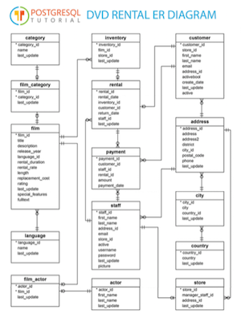

# Simple queries (11)


Assume that the Docker container with PostgreSQL and the dvdrental database are ready to go. 

```r
sp_docker_start("sql-pet")
```
Connect to the database:

```r
con <- sp_get_postgres_connection(user = Sys.getenv("DEFAULT_POSTGRES_USER_NAME"),
                         password = Sys.getenv("DEFAULT_POSTGRES_PASSWORD"),
                         dbname = "dvdrental",
                         seconds_to_test = 10)
```

## Downloading the data from the database

We've already seen the simplest way of getting a list of tables in a database with `DBI` functions to list tables and fields:

```r
DBI::dbListTables(con)
```

```
##  [1] "actor_info"                 "customer_list"             
##  [3] "film_list"                  "nicer_but_slower_film_list"
##  [5] "sales_by_film_category"     "staff"                     
##  [7] "sales_by_store"             "staff_list"                
##  [9] "category"                   "film_category"             
## [11] "country"                    "actor"                     
## [13] "language"                   "inventory"                 
## [15] "payment"                    "rental"                    
## [17] "city"                       "store"                     
## [19] "film"                       "address"                   
## [21] "film_actor"                 "customer"
```
Later on we'll discuss how to get more extensive data about each table from the database's own store of metadata.


List the fields in a specific table:

```r
DBI::dbListFields(con, "rental")
```

```
## [1] "rental_id"    "rental_date"  "inventory_id" "customer_id" 
## [5] "return_date"  "staff_id"     "last_update"
```

### Using `dplyr` as the main tool

methods for referencing a table

`DBI::dbReadTable` will download an entire table into an R data frame.

```r
rental_tibble <- DBI::dbReadTable(con, "rental") 
str(rental_tibble)
```

```
## 'data.frame':	16044 obs. of  7 variables:
##  $ rental_id   : int  2 3 4 5 6 7 8 9 10 11 ...
##  $ rental_date : POSIXct, format: "2005-05-24 22:54:33" "2005-05-24 23:03:39" ...
##  $ inventory_id: int  1525 1711 2452 2079 2792 3995 2346 2580 1824 4443 ...
##  $ customer_id : int  459 408 333 222 549 269 239 126 399 142 ...
##  $ return_date : POSIXct, format: "2005-05-28 19:40:33" "2005-06-01 22:12:39" ...
##  $ staff_id    : int  1 1 2 1 1 2 2 1 2 2 ...
##  $ last_update : POSIXct, format: "2006-02-16 02:30:53" "2006-02-16 02:30:53" ...
```

### Adventures in lazy evaluation

```r
rental_table <- dplyr::tbl(con, "rental")  # requires collect() function
str(rental_table)
```

```
## List of 2
##  $ src:List of 2
##   ..$ con  :Formal class 'PqConnection' [package "RPostgres"] with 3 slots
##   .. .. ..@ ptr     :<externalptr> 
##   .. .. ..@ bigint  : chr "integer64"
##   .. .. ..@ typnames:'data.frame':	437 obs. of  2 variables:
##   .. .. .. ..$ oid    : int [1:437] 16 17 18 19 20 21 22 23 24 25 ...
##   .. .. .. ..$ typname: chr [1:437] "bool" "bytea" "char" "name" ...
##   ..$ disco: NULL
##   ..- attr(*, "class")= chr [1:3] "src_dbi" "src_sql" "src"
##  $ ops:List of 2
##   ..$ x   : 'ident' chr "rental"
##   ..$ vars: chr [1:7] "rental_id" "rental_date" "inventory_id" "customer_id" ...
##   ..- attr(*, "class")= chr [1:3] "op_base_remote" "op_base" "op"
##  - attr(*, "class")= chr [1:4] "tbl_dbi" "tbl_sql" "tbl_lazy" "tbl"
```

```r
head(rental_table)
```

```
## # Source:   lazy query [?? x 7]
## # Database: postgres [postgres@localhost:5432/dvdrental]
##   rental_id rental_date         inventory_id customer_id
##       <int> <dttm>                     <int>       <int>
## 1         2 2005-05-24 22:54:33         1525         459
## 2         3 2005-05-24 23:03:39         1711         408
## 3         4 2005-05-24 23:04:41         2452         333
## 4         5 2005-05-24 23:05:21         2079         222
## 5         6 2005-05-24 23:08:07         2792         549
## 6         7 2005-05-24 23:11:53         3995         269
## # ... with 3 more variables: return_date <dttm>, staff_id <int>,
## #   last_update <dttm>
```


```r
rental_table %>% 
  count(staff_id, inventory_id) %>% 
  head
```

```
## # Source:   lazy query [?? x 3]
## # Database: postgres [postgres@localhost:5432/dvdrental]
## # Groups:   staff_id
##   staff_id inventory_id n              
##      <int>        <int> <S3: integer64>
## 1        1         4136 2              
## 2        1         1984 2              
## 3        2         4437 1              
## 4        1          480 3              
## 5        1         2407 2              
## 6        2          474 2
```

```r
rental_table %>% 
  count(staff_id, inventory_id) %>% 
  show_query()
```

```
## <SQL>
## SELECT "staff_id", "inventory_id", COUNT(*) AS "n"
## FROM "rental"
## GROUP BY "staff_id", "inventory_id"
```

We already started, but that's OK.

### Other R tools for data investigation
  + str
  + glimpse
  + skimr
  + View, datatable and kable

## Some extra handy libraries

[https://dbplyr.tidyverse.org/articles/sql-translation.html](https://dbplyr.tidyverse.org/articles/sql-translation.html) 

Here are some packages that we find handy in the preliminary investigation of a database (or a problem that involves data from a database).

```r
library(glue)
library(skimr)
```

```
## 
## Attaching package: 'skimr'
```

```
## The following object is masked from 'package:knitr':
## 
##     kable
```


```r
str(rental_tibble)
```

```
## 'data.frame':	16044 obs. of  7 variables:
##  $ rental_id   : int  2 3 4 5 6 7 8 9 10 11 ...
##  $ rental_date : POSIXct, format: "2005-05-24 22:54:33" "2005-05-24 23:03:39" ...
##  $ inventory_id: int  1525 1711 2452 2079 2792 3995 2346 2580 1824 4443 ...
##  $ customer_id : int  459 408 333 222 549 269 239 126 399 142 ...
##  $ return_date : POSIXct, format: "2005-05-28 19:40:33" "2005-06-01 22:12:39" ...
##  $ staff_id    : int  1 1 2 1 1 2 2 1 2 2 ...
##  $ last_update : POSIXct, format: "2006-02-16 02:30:53" "2006-02-16 02:30:53" ...
```

```r
glimpse(rental_tibble)
```

```
## Observations: 16,044
## Variables: 7
## $ rental_id    <int> 2, 3, 4, 5, 6, 7, 8, 9, 10, 11, 12, 13, 14, 15, 1...
## $ rental_date  <dttm> 2005-05-24 22:54:33, 2005-05-24 23:03:39, 2005-0...
## $ inventory_id <int> 1525, 1711, 2452, 2079, 2792, 3995, 2346, 2580, 1...
## $ customer_id  <int> 459, 408, 333, 222, 549, 269, 239, 126, 399, 142,...
## $ return_date  <dttm> 2005-05-28 19:40:33, 2005-06-01 22:12:39, 2005-0...
## $ staff_id     <int> 1, 1, 2, 1, 1, 2, 2, 1, 2, 2, 2, 1, 1, 1, 2, 1, 2...
## $ last_update  <dttm> 2006-02-16 02:30:53, 2006-02-16 02:30:53, 2006-0...
```

```r
skim(rental_tibble)
```

```
## Skim summary statistics
##  n obs: 16044 
##  n variables: 7 
## 
## ── Variable type:integer ───────────────────────────────────────────────────────────────────────────────────────
##      variable missing complete     n    mean      sd p0     p25    p50
##   customer_id       0    16044 16044  297.14  172.45  1  148     296  
##  inventory_id       0    16044 16044 2291.84 1322.21  1 1154    2291  
##     rental_id       0    16044 16044 8025.37 4632.78  1 4013.75 8025.5
##      staff_id       0    16044 16044    1.5     0.5   1    1       1  
##       p75  p100     hist
##    446      599 ▇▇▇▇▇▇▇▇
##   3433     4581 ▇▇▇▇▇▇▇▇
##  12037.25 16049 ▇▇▇▇▇▇▇▇
##      2        2 ▇▁▁▁▁▁▁▇
## 
## ── Variable type:POSIXct ───────────────────────────────────────────────────────────────────────────────────────
##     variable missing complete     n        min        max     median
##  last_update       0    16044 16044 2006-02-15 2006-02-23 2006-02-16
##  rental_date       0    16044 16044 2005-05-24 2006-02-14 2005-07-28
##  return_date     183    15861 16044 2005-05-25 2005-09-02 2005-08-01
##  n_unique
##         3
##     15815
##     15836
```


### Finding out what's in the database

#### List the tables and fields that are available

#### ERD Diagram

This tutorial uses [the Postgres version of "dvd rental" database](http://www.postgresqltutorial.com/postgresql-sample-database/), which can be  [downloaded here](http://www.postgresqltutorial.com/wp-content/uploads/2017/10/dvdrental.zip).  Here's a glimpse of it's structure:
    



### Sample query

* rental 
* date subset

### Subset: only retrieve what you need

* Columns
* Rows
  + number of row
  + specific rows
* Counts & stats

### Make the server do as much work as you can

discuss this simple example? http://www.postgresqltutorial.com/postgresql-left-join/ 

* `dplyr` joins on the server side
* Where you put `(collect(n = Inf))` really matters

## What is `dplyr` sending to the server?

* show_query as a first draft

## Writing SQL queries directly to the DBMS

* dbquery
* Glue for constructing SQL statements
  + parameterizing SQL queries

## Choosing between `dplyr` and native SQL

* performance considerations: first get the right data, then worry about performance
* Trade offs between leaving the data in PostgreSQL vs what's kept in R: 
  + browsing the data
  + larger samples and complete tables
  + using what you know to write efficient queries that do most of the work on the server


```r
dplyr_summary_df <-
    read.delim(
    '11-dplyr_sql_summary_table.tsv',
    header = TRUE,
    sep = '\t',
    as.is = TRUE
    )

head(dplyr_summary_df)
```

```
##   In          Dplyr_Function
## 1  Y               arrange()
## 2 Y?              distinct()
## 3  Y       select() rename()
## 4  N                  pull()
## 5  Y    mutate() transmute()
## 6  Y summarise() summarize()
##                                      description
## 1                      Arrange rows by variables
## 2           Return rows with matching conditions
## 3                Select/rename variables by name
## 4                     Pull out a single variable
## 5                              Add new variables
## 6 Reduces multiple values down to a single value
##                            SQL_Clause Notes                 Category
## 1                            ORDER BY    NA Basic single-table verbs
## 2                   SELECT distinct *    NA Basic single-table verbs
## 3       SELECT column_name alias_name    NA Basic single-table verbs
## 4                SELECT column_name;     NA Basic single-table verbs
## 5 SELECT computed_value computed_name    NA Basic single-table verbs
## 6 SELECT aggregate_functions GROUP BY    NA Basic single-table verbs
```


  * left join staff
  * left join customer

  * dplyr joins in the R

```r
dbDisconnect(con)
sp_docker_stop("sql-pet")
```

```
## [1] "sql-pet"
```

## Other resources

  * Tutorials like: [https://suzan.rbind.io/tags/dplyr/](https://suzan.rbind.io/tags/dplyr/) 
  * Benjamin S. Baumer, A Grammar for Reproducible and Painless Extract-Transform-Load Operations on Medium Data: [https://arxiv.org/pdf/1708.07073](https://arxiv.org/pdf/1708.07073) 

