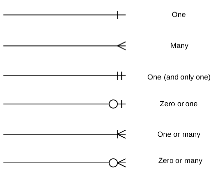

# Getting metadata about and from PostgreSQL {#chapter_postgresql-metadata}

> This chapter demonstrates:
> 
> * What kind of data about the database is contained in a dbms
> * Several methods for obtaining metadata from the dbms

The following packages are used in this chapter:

```r
library(tidyverse)
library(DBI)
library(RPostgres)
library(glue)
library(here)
require(knitr)
library(dbplyr)
library(sqlpetr)
```

Assume that the Docker container with PostgreSQL and the dvdrental database are ready to go. 

```r
sp_docker_start("sql-pet")
```
Connect to the database:

```r
con <- sp_get_postgres_connection(
  user = Sys.getenv("DEFAULT_POSTGRES_USER_NAME"),
  password = Sys.getenv("DEFAULT_POSTGRES_PASSWORD"),
  dbname = "dvdrental",
  seconds_to_test = 30
)
```

## Database contents and structure

After just looking at the data you seek, it might be worthwhile stepping back and looking at the big picture.

### Database structure

For large or complex databases you need to use both the available documentation for your database (e.g.,  [the dvdrental](http://www.postgresqltutorial.com/postgresql-sample-database/) database) and the other empirical tools that are available.  For example it's worth learning to interpret the symbols in an [Entity Relationship Diagram](https://en.wikipedia.org/wiki/Entity%E2%80%93relationship_model):



The `information_schema` is a trove of information *about* the database.  Its format is more or less consistent across the different SQL implementations that are available.   Here we explore some of what's available using several different methods.  PostgreSQL stores [a lot of metadata](https://www.postgresql.org/docs/current/static/infoschema-columns.html).

### Contents of the `information_schema` 
For this chapter R needs the `dbplyr` package to access alternate schemas.  A [schema](http://www.postgresqltutorial.com/postgresql-server-and-database-objects/) is an object that contains one or more tables.  Most often there will be a default schema, but to access the metadata, you need to explicitly specify which schema contains the data you want.

### What tables are in the database?
The simplest way to get a list of tables is with 

```r
table_list <- DBI::dbListTables(con)

kable(table_list)
```


|x                          |
|:--------------------------|
|actor_info                 |
|customer_list              |
|film_list                  |
|nicer_but_slower_film_list |
|sales_by_film_category     |
|staff                      |
|sales_by_store             |
|staff_list                 |
|category                   |
|film_category              |
|country                    |
|actor                      |
|language                   |
|inventory                  |
|payment                    |
|rental                     |
|city                       |
|store                      |
|film                       |
|address                    |
|film_actor                 |
|customer                   |
|smy_customer               |
### Digging into the `information_schema`

We usually need more detail than just a list of tables. Most SQL databases have an `information_schema` that has a standard structure to describe and control the database.

The `information_schema` is in a different schema from the default, so to connect to the `tables` table in the  `information_schema` we connect to the database in a different way:

```r
table_info_schema_table <- tbl(con, dbplyr::in_schema("information_schema", "tables"))
```
The `information_schema` is large and complex and contains 211 tables.  So it's easy to get lost in it.

This query retrieves a list of the tables in the database that includes additional detail, not just the name of the table.

```r
table_info <- table_info_schema_table %>%
  filter(table_schema == "public") %>%
  select(table_catalog, table_schema, table_name, table_type) %>%
  arrange(table_type, table_name) %>%
  collect()

kable(table_info)
```


table_catalog   table_schema   table_name                   table_type 
--------------  -------------  ---------------------------  -----------
dvdrental       public         actor                        BASE TABLE 
dvdrental       public         address                      BASE TABLE 
dvdrental       public         category                     BASE TABLE 
dvdrental       public         city                         BASE TABLE 
dvdrental       public         country                      BASE TABLE 
dvdrental       public         customer                     BASE TABLE 
dvdrental       public         film                         BASE TABLE 
dvdrental       public         film_actor                   BASE TABLE 
dvdrental       public         film_category                BASE TABLE 
dvdrental       public         inventory                    BASE TABLE 
dvdrental       public         language                     BASE TABLE 
dvdrental       public         payment                      BASE TABLE 
dvdrental       public         rental                       BASE TABLE 
dvdrental       public         smy_customer                 BASE TABLE 
dvdrental       public         staff                        BASE TABLE 
dvdrental       public         store                        BASE TABLE 
dvdrental       public         actor_info                   VIEW       
dvdrental       public         customer_list                VIEW       
dvdrental       public         film_list                    VIEW       
dvdrental       public         nicer_but_slower_film_list   VIEW       
dvdrental       public         sales_by_film_category       VIEW       
dvdrental       public         sales_by_store               VIEW       
dvdrental       public         staff_list                   VIEW       
In this context `table_catalog` is synonymous with `database`.

Notice that *VIEWS* are composites made up of one or more *BASE TABLES*.

The SQL world has its own terminology.  For example `rs` is shorthand for `result set`.  That's equivalent to using `df` for a `data frame`.  The following SQL query returns the same information as the previous one.

```r
rs <- dbGetQuery(
  con,
  "select table_catalog, table_schema, table_name, table_type 
  from information_schema.tables 
  where table_schema not in ('pg_catalog','information_schema')
  order by table_type, table_name 
  ;"
)
kable(rs)
```


table_catalog   table_schema   table_name                   table_type 
--------------  -------------  ---------------------------  -----------
dvdrental       public         actor                        BASE TABLE 
dvdrental       public         address                      BASE TABLE 
dvdrental       public         category                     BASE TABLE 
dvdrental       public         city                         BASE TABLE 
dvdrental       public         country                      BASE TABLE 
dvdrental       public         customer                     BASE TABLE 
dvdrental       public         film                         BASE TABLE 
dvdrental       public         film_actor                   BASE TABLE 
dvdrental       public         film_category                BASE TABLE 
dvdrental       public         inventory                    BASE TABLE 
dvdrental       public         language                     BASE TABLE 
dvdrental       public         payment                      BASE TABLE 
dvdrental       public         rental                       BASE TABLE 
dvdrental       public         smy_customer                 BASE TABLE 
dvdrental       public         staff                        BASE TABLE 
dvdrental       public         store                        BASE TABLE 
dvdrental       public         actor_info                   VIEW       
dvdrental       public         customer_list                VIEW       
dvdrental       public         film_list                    VIEW       
dvdrental       public         nicer_but_slower_film_list   VIEW       
dvdrental       public         sales_by_film_category       VIEW       
dvdrental       public         sales_by_store               VIEW       
dvdrental       public         staff_list                   VIEW       

## What columns do those tables contain?

Of course, the `DBI` package has a `dbListFields` function that provides the simplest way to get the minimum, a list of column names:

```r
DBI::dbListFields(con, "rental")
```

```
## [1] "rental_id"    "rental_date"  "inventory_id" "customer_id" 
## [5] "return_date"  "staff_id"     "last_update"
```

But the `information_schema` has a lot more useful information that we can use.  

```r
columns_info_schema_table <- tbl(con, dbplyr::in_schema("information_schema", "columns"))
```

Since the `information_schema` contains 1865 columns, we are narrowing our focus to just one table.  This query retrieves more information about the `rental` table:

```r
columns_info_schema_info <- columns_info_schema_table %>%
  filter(table_schema == "public") %>%
  select(
    table_catalog, table_schema, table_name, column_name, data_type, ordinal_position,
    character_maximum_length, column_default, numeric_precision, numeric_precision_radix
  ) %>%
  collect(n = Inf) %>%
  mutate(data_type = case_when(
    data_type == "character varying" ~ paste0(data_type, " (", character_maximum_length, ")"),
    data_type == "real" ~ paste0(data_type, " (", numeric_precision, ",", numeric_precision_radix, ")"),
    TRUE ~ data_type
  )) %>%
  filter(table_name == "rental") %>%
  select(-table_schema, -numeric_precision, -numeric_precision_radix)

glimpse(columns_info_schema_info)
```

```
## Observations: 7
## Variables: 7
## $ table_catalog            <chr> "dvdrental", "dvdrental", "dvdrental", …
## $ table_name               <chr> "rental", "rental", "rental", "rental",…
## $ column_name              <chr> "rental_id", "rental_date", "inventory_…
## $ data_type                <chr> "integer", "timestamp without time zone…
## $ ordinal_position         <int> 1, 2, 3, 4, 5, 6, 7
## $ character_maximum_length <int> NA, NA, NA, NA, NA, NA, NA
## $ column_default           <chr> "nextval('rental_rental_id_seq'::regcla…
```

```r
kable(columns_info_schema_info)
```


table_catalog   table_name   column_name    data_type                      ordinal_position   character_maximum_length  column_default                            
--------------  -----------  -------------  ----------------------------  -----------------  -------------------------  ------------------------------------------
dvdrental       rental       rental_id      integer                                       1                         NA  nextval('rental_rental_id_seq'::regclass) 
dvdrental       rental       rental_date    timestamp without time zone                   2                         NA  NA                                        
dvdrental       rental       inventory_id   integer                                       3                         NA  NA                                        
dvdrental       rental       customer_id    smallint                                      4                         NA  NA                                        
dvdrental       rental       return_date    timestamp without time zone                   5                         NA  NA                                        
dvdrental       rental       staff_id       smallint                                      6                         NA  NA                                        
dvdrental       rental       last_update    timestamp without time zone                   7                         NA  now()                                     

### What is the difference between a `VIEW` and a `BASE TABLE`?

The `BASE TABLE` has the underlying data in the database

```r
table_info_schema_table %>%
  filter(table_schema == "public" & table_type == "BASE TABLE") %>%
  select(table_name, table_type) %>%
  left_join(columns_info_schema_table, by = c("table_name" = "table_name")) %>%
  select(
    table_type, table_name, column_name, data_type, ordinal_position,
    column_default
  ) %>%
  collect(n = Inf) %>%
  filter(str_detect(table_name, "cust")) %>%
  kable()
```


table_type   table_name     column_name   data_type                      ordinal_position  column_default                                
-----------  -------------  ------------  ----------------------------  -----------------  ----------------------------------------------
BASE TABLE   customer       store_id      smallint                                      2  NA                                            
BASE TABLE   customer       first_name    character varying                             3  NA                                            
BASE TABLE   customer       last_name     character varying                             4  NA                                            
BASE TABLE   customer       email         character varying                             5  NA                                            
BASE TABLE   customer       address_id    smallint                                      6  NA                                            
BASE TABLE   customer       active        integer                                      10  NA                                            
BASE TABLE   customer       customer_id   integer                                       1  nextval('customer_customer_id_seq'::regclass) 
BASE TABLE   customer       activebool    boolean                                       7  true                                          
BASE TABLE   customer       create_date   date                                          8  ('now'::text)::date                           
BASE TABLE   customer       last_update   timestamp without time zone                   9  now()                                         
BASE TABLE   smy_customer   customer_id   integer                                       1  NA                                            
BASE TABLE   smy_customer   store_id      smallint                                      2  NA                                            
BASE TABLE   smy_customer   first_name    character varying                             3  NA                                            
BASE TABLE   smy_customer   last_name     character varying                             4  NA                                            
BASE TABLE   smy_customer   email         character varying                             5  NA                                            
BASE TABLE   smy_customer   address_id    smallint                                      6  NA                                            
BASE TABLE   smy_customer   activebool    boolean                                       7  NA                                            
BASE TABLE   smy_customer   create_date   date                                          8  NA                                            
BASE TABLE   smy_customer   last_update   timestamp without time zone                   9  NA                                            
BASE TABLE   smy_customer   active        integer                                      10  NA                                            

Probably should explore how the `VIEW` is made up of data from BASE TABLEs.

```r
table_info_schema_table %>%
  filter(table_schema == "public" & table_type == "VIEW") %>%
  select(table_name, table_type) %>%
  left_join(columns_info_schema_table, by = c("table_name" = "table_name")) %>%
  select(
    table_type, table_name, column_name, data_type, ordinal_position,
    column_default
  ) %>%
  collect(n = Inf) %>%
  filter(str_detect(table_name, "cust")) %>%
  kable()
```


table_type   table_name      column_name   data_type            ordinal_position  column_default 
-----------  --------------  ------------  ------------------  -----------------  ---------------
VIEW         customer_list   id            integer                             1  NA             
VIEW         customer_list   name          text                                2  NA             
VIEW         customer_list   address       character varying                   3  NA             
VIEW         customer_list   zip code      character varying                   4  NA             
VIEW         customer_list   phone         character varying                   5  NA             
VIEW         customer_list   city          character varying                   6  NA             
VIEW         customer_list   country       character varying                   7  NA             
VIEW         customer_list   notes         text                                8  NA             
VIEW         customer_list   sid           smallint                            9  NA             

### What data types are found in the database?

```r
columns_info_schema_info %>% count(data_type)
```

```
## # A tibble: 3 x 2
##   data_type                       n
##   <chr>                       <int>
## 1 integer                         2
## 2 smallint                        2
## 3 timestamp without time zone     3
```

## Characterizing how things are named

Names are the handle for accessing the data.  Tables and columns may or may not be named consistently or in a way that makes sense to you.  You should look at these names *as data*.

### Counting columns and name reuse
Pull out some rough-and-ready but useful statistics about your database.  Since we are in SQL-land we talk about variables as `columns`.


```r
public_tables <- columns_info_schema_table %>%
  filter(table_schema == "public") %>%
  collect()

public_tables %>%
  count(table_name, sort = TRUE) %>% head(n = 15) %>% 
  kable()
```


table_name                     n
---------------------------  ---
film                          13
staff                         11
customer                      10
smy_customer                  10
customer_list                  9
address                        8
film_list                      8
nicer_but_slower_film_list     8
staff_list                     8
rental                         7
payment                        6
actor                          4
actor_info                     4
city                           4
inventory                      4

How many *column names* are shared across tables (or duplicated)?

```r
public_tables %>% count(column_name, sort = TRUE) %>% filter(n > 1)
```

```
## # A tibble: 36 x 2
##    column_name     n
##    <chr>       <int>
##  1 last_update    15
##  2 address_id      5
##  3 first_name      5
##  4 last_name       5
##  5 store_id        5
##  6 customer_id     4
##  7 film_id         4
##  8 name            4
##  9 active          3
## 10 actor_id        3
## # … with 26 more rows
```

How many column names are unique?

```r
public_tables %>% count(column_name) %>% filter(n == 1) %>% count()
```

```
## # A tibble: 1 x 1
##      nn
##   <int>
## 1    22
```

## Database keys

### Direct SQL

How do we use this output?  Could it be generated by dplyr?

```r
rs <- dbGetQuery(
  con,
  "
--SELECT conrelid::regclass as table_from
select table_catalog||'.'||table_schema||'.'||table_name table_name
, conname, pg_catalog.pg_get_constraintdef(r.oid, true) as condef
FROM information_schema.columns c,pg_catalog.pg_constraint r
WHERE 1 = 1 --r.conrelid = '16485' 
  AND r.contype  in ('f','p') ORDER BY 1
;"
)
glimpse(rs)
```

```
## Observations: 61,545
## Variables: 3
## $ table_name <chr> "dvdrental.information_schema.administrable_role_auth…
## $ conname    <chr> "actor_pkey", "actor_pkey", "actor_pkey", "country_pk…
## $ condef     <chr> "PRIMARY KEY (actor_id)", "PRIMARY KEY (actor_id)", "…
```

```r
kable(head(rs))
```


table_name                                                       conname        condef                   
---------------------------------------------------------------  -------------  -------------------------
dvdrental.information_schema.administrable_role_authorizations   actor_pkey     PRIMARY KEY (actor_id)   
dvdrental.information_schema.administrable_role_authorizations   actor_pkey     PRIMARY KEY (actor_id)   
dvdrental.information_schema.administrable_role_authorizations   actor_pkey     PRIMARY KEY (actor_id)   
dvdrental.information_schema.administrable_role_authorizations   country_pkey   PRIMARY KEY (country_id) 
dvdrental.information_schema.administrable_role_authorizations   country_pkey   PRIMARY KEY (country_id) 
dvdrental.information_schema.administrable_role_authorizations   country_pkey   PRIMARY KEY (country_id) 
The following is more compact and looks more useful.  What is the difference between the two?

```r
rs <- dbGetQuery(
  con,
  "select conrelid::regclass as table_from
      ,c.conname
      ,pg_get_constraintdef(c.oid)
  from pg_constraint c
  join pg_namespace n on n.oid = c.connamespace
 where c.contype in ('f','p')
   and n.nspname = 'public'
order by conrelid::regclass::text, contype DESC;
"
)
glimpse(rs)
```

```
## Observations: 33
## Variables: 3
## $ table_from           <chr> "actor", "address", "address", "category", …
## $ conname              <chr> "actor_pkey", "address_pkey", "fk_address_c…
## $ pg_get_constraintdef <chr> "PRIMARY KEY (actor_id)", "PRIMARY KEY (add…
```

```r
kable(head(rs))
```


table_from   conname           pg_get_constraintdef                                    
-----------  ----------------  --------------------------------------------------------
actor        actor_pkey        PRIMARY KEY (actor_id)                                  
address      address_pkey      PRIMARY KEY (address_id)                                
address      fk_address_city   FOREIGN KEY (city_id) REFERENCES city(city_id)          
category     category_pkey     PRIMARY KEY (category_id)                               
city         city_pkey         PRIMARY KEY (city_id)                                   
city         fk_city           FOREIGN KEY (country_id) REFERENCES country(country_id) 

```r
dim(rs)[1]
```

```
## [1] 33
```

### Database keys with dplyr

This query shows the primary and foreign keys in the database.

```r
tables <- tbl(con, dbplyr::in_schema("information_schema", "tables"))
table_constraints <- tbl(con, dbplyr::in_schema("information_schema", "table_constraints"))
key_column_usage <- tbl(con, dbplyr::in_schema("information_schema", "key_column_usage"))
referential_constraints <- tbl(con, dbplyr::in_schema("information_schema", "referential_constraints"))
constraint_column_usage <- tbl(con, dbplyr::in_schema("information_schema", "constraint_column_usage"))

keys <- tables %>%
  left_join(table_constraints, by = c(
    "table_catalog" = "table_catalog",
    "table_schema" = "table_schema",
    "table_name" = "table_name"
  )) %>%
  # table_constraints %>%
  filter(constraint_type %in% c("FOREIGN KEY", "PRIMARY KEY")) %>%
  left_join(key_column_usage,
    by = c(
      "table_catalog" = "table_catalog",
      "constraint_catalog" = "constraint_catalog",
      "constraint_schema" = "constraint_schema",
      "table_name" = "table_name",
      "table_schema" = "table_schema",
      "constraint_name" = "constraint_name"
    )
  ) %>%
  # left_join(constraint_column_usage) %>% # does this table add anything useful?
  select(table_name, table_type, constraint_name, constraint_type, column_name, ordinal_position) %>%
  arrange(table_name) %>%
  collect()
glimpse(keys)
```

```
## Observations: 35
## Variables: 6
## $ table_name       <chr> "actor", "address", "address", "category", "cit…
## $ table_type       <chr> "BASE TABLE", "BASE TABLE", "BASE TABLE", "BASE…
## $ constraint_name  <chr> "actor_pkey", "address_pkey", "fk_address_city"…
## $ constraint_type  <chr> "PRIMARY KEY", "PRIMARY KEY", "FOREIGN KEY", "P…
## $ column_name      <chr> "actor_id", "address_id", "city_id", "category_…
## $ ordinal_position <int> 1, 1, 1, 1, 1, 1, 1, 1, 1, 1, 1, 1, 1, 1, 2, 1,…
```

```r
kable(keys)
```


table_name      table_type   constraint_name                  constraint_type   column_name         ordinal_position
--------------  -----------  -------------------------------  ----------------  -----------------  -----------------
actor           BASE TABLE   actor_pkey                       PRIMARY KEY       actor_id                           1
address         BASE TABLE   address_pkey                     PRIMARY KEY       address_id                         1
address         BASE TABLE   fk_address_city                  FOREIGN KEY       city_id                            1
category        BASE TABLE   category_pkey                    PRIMARY KEY       category_id                        1
city            BASE TABLE   city_pkey                        PRIMARY KEY       city_id                            1
city            BASE TABLE   fk_city                          FOREIGN KEY       country_id                         1
country         BASE TABLE   country_pkey                     PRIMARY KEY       country_id                         1
customer        BASE TABLE   customer_address_id_fkey         FOREIGN KEY       address_id                         1
customer        BASE TABLE   customer_pkey                    PRIMARY KEY       customer_id                        1
film            BASE TABLE   film_language_id_fkey            FOREIGN KEY       language_id                        1
film            BASE TABLE   film_pkey                        PRIMARY KEY       film_id                            1
film_actor      BASE TABLE   film_actor_actor_id_fkey         FOREIGN KEY       actor_id                           1
film_actor      BASE TABLE   film_actor_film_id_fkey          FOREIGN KEY       film_id                            1
film_actor      BASE TABLE   film_actor_pkey                  PRIMARY KEY       actor_id                           1
film_actor      BASE TABLE   film_actor_pkey                  PRIMARY KEY       film_id                            2
film_category   BASE TABLE   film_category_category_id_fkey   FOREIGN KEY       category_id                        1
film_category   BASE TABLE   film_category_film_id_fkey       FOREIGN KEY       film_id                            1
film_category   BASE TABLE   film_category_pkey               PRIMARY KEY       film_id                            1
film_category   BASE TABLE   film_category_pkey               PRIMARY KEY       category_id                        2
inventory       BASE TABLE   inventory_film_id_fkey           FOREIGN KEY       film_id                            1
inventory       BASE TABLE   inventory_pkey                   PRIMARY KEY       inventory_id                       1
language        BASE TABLE   language_pkey                    PRIMARY KEY       language_id                        1
payment         BASE TABLE   payment_customer_id_fkey         FOREIGN KEY       customer_id                        1
payment         BASE TABLE   payment_pkey                     PRIMARY KEY       payment_id                         1
payment         BASE TABLE   payment_rental_id_fkey           FOREIGN KEY       rental_id                          1
payment         BASE TABLE   payment_staff_id_fkey            FOREIGN KEY       staff_id                           1
rental          BASE TABLE   rental_customer_id_fkey          FOREIGN KEY       customer_id                        1
rental          BASE TABLE   rental_inventory_id_fkey         FOREIGN KEY       inventory_id                       1
rental          BASE TABLE   rental_pkey                      PRIMARY KEY       rental_id                          1
rental          BASE TABLE   rental_staff_id_key              FOREIGN KEY       staff_id                           1
staff           BASE TABLE   staff_address_id_fkey            FOREIGN KEY       address_id                         1
staff           BASE TABLE   staff_pkey                       PRIMARY KEY       staff_id                           1
store           BASE TABLE   store_address_id_fkey            FOREIGN KEY       address_id                         1
store           BASE TABLE   store_manager_staff_id_fkey      FOREIGN KEY       manager_staff_id                   1
store           BASE TABLE   store_pkey                       PRIMARY KEY       store_id                           1

What do we learn from the following query?  How is it useful? 

```r
rs <- dbGetQuery(
  con,
  "SELECT r.*,
  pg_catalog.pg_get_constraintdef(r.oid, true) as condef
  FROM pg_catalog.pg_constraint r
  WHERE 1=1 --r.conrelid = '16485' AND r.contype = 'f' ORDER BY 1;
  "
)

head(rs)
```

```
##                        conname connamespace contype condeferrable
## 1 cardinal_number_domain_check        12703       c         FALSE
## 2              yes_or_no_check        12703       c         FALSE
## 3                   year_check         2200       c         FALSE
## 4                   actor_pkey         2200       p         FALSE
## 5                 address_pkey         2200       p         FALSE
## 6                category_pkey         2200       p         FALSE
##   condeferred convalidated conrelid contypid conindid confrelid
## 1       FALSE         TRUE        0    12716        0         0
## 2       FALSE         TRUE        0    12724        0         0
## 3       FALSE         TRUE        0    16397        0         0
## 4       FALSE         TRUE    16420        0    16555         0
## 5       FALSE         TRUE    16461        0    16557         0
## 6       FALSE         TRUE    16427        0    16559         0
##   confupdtype confdeltype confmatchtype conislocal coninhcount
## 1                                             TRUE           0
## 2                                             TRUE           0
## 3                                             TRUE           0
## 4                                             TRUE           0
## 5                                             TRUE           0
## 6                                             TRUE           0
##   connoinherit conkey confkey conpfeqop conppeqop conffeqop conexclop
## 1        FALSE   <NA>    <NA>      <NA>      <NA>      <NA>      <NA>
## 2        FALSE   <NA>    <NA>      <NA>      <NA>      <NA>      <NA>
## 3        FALSE   <NA>    <NA>      <NA>      <NA>      <NA>      <NA>
## 4         TRUE    {1}    <NA>      <NA>      <NA>      <NA>      <NA>
## 5         TRUE    {1}    <NA>      <NA>      <NA>      <NA>      <NA>
## 6         TRUE    {1}    <NA>      <NA>      <NA>      <NA>      <NA>
##                                                                                                                                                                                                                                                                                                                                                                                                                                                                                                                                                                                                                                                                                                                                                                                                                                                  conbin
## 1                                                                                                                                                                                                                                                                                                                                                                                                                                                                                                       {OPEXPR :opno 525 :opfuncid 150 :opresulttype 16 :opretset false :opcollid 0 :inputcollid 0 :args ({COERCETODOMAINVALUE :typeId 23 :typeMod -1 :collation 0 :location 195} {CONST :consttype 23 :consttypmod -1 :constcollid 0 :constlen 4 :constbyval true :constisnull false :location 204 :constvalue 4 [ 0 0 0 0 0 0 0 0 ]}) :location 201}
## 2 {SCALARARRAYOPEXPR :opno 98 :opfuncid 67 :useOr true :inputcollid 100 :args ({RELABELTYPE :arg {COERCETODOMAINVALUE :typeId 1043 :typeMod 7 :collation 100 :location 121} :resulttype 25 :resulttypmod -1 :resultcollid 100 :relabelformat 2 :location -1} {ARRAYCOERCEEXPR :arg {ARRAY :array_typeid 1015 :array_collid 100 :element_typeid 1043 :elements ({CONST :consttype 1043 :consttypmod -1 :constcollid 100 :constlen -1 :constbyval false :constisnull false :location 131 :constvalue 7 [ 28 0 0 0 89 69 83 ]} {CONST :consttype 1043 :consttypmod -1 :constcollid 100 :constlen -1 :constbyval false :constisnull false :location 138 :constvalue 6 [ 24 0 0 0 78 79 ]}) :multidims false :location -1} :elemfuncid 0 :resulttype 1009 :resulttypmod -1 :resultcollid 100 :isExplicit false :coerceformat 2 :location -1}) :location 127}
## 3                                                                                                             {BOOLEXPR :boolop and :args ({OPEXPR :opno 525 :opfuncid 150 :opresulttype 16 :opretset false :opcollid 0 :inputcollid 0 :args ({COERCETODOMAINVALUE :typeId 23 :typeMod -1 :collation 0 :location 62} {CONST :consttype 23 :consttypmod -1 :constcollid 0 :constlen 4 :constbyval true :constisnull false :location 71 :constvalue 4 [ 109 7 0 0 0 0 0 0 ]}) :location 68} {OPEXPR :opno 523 :opfuncid 149 :opresulttype 16 :opretset false :opcollid 0 :inputcollid 0 :args ({COERCETODOMAINVALUE :typeId 23 :typeMod -1 :collation 0 :location 82} {CONST :consttype 23 :consttypmod -1 :constcollid 0 :constlen 4 :constbyval true :constisnull false :location 91 :constvalue 4 [ 107 8 0 0 0 0 0 0 ]}) :location 88}) :location 77}
## 4                                                                                                                                                                                                                                                                                                                                                                                                                                                                                                                                                                                                                                                                                                                                                                                                                                                  <NA>
## 5                                                                                                                                                                                                                                                                                                                                                                                                                                                                                                                                                                                                                                                                                                                                                                                                                                                  <NA>
## 6                                                                                                                                                                                                                                                                                                                                                                                                                                                                                                                                                                                                                                                                                                                                                                                                                                                  <NA>
##                                                                                       consrc
## 1                                                                               (VALUE >= 0)
## 2 ((VALUE)::text = ANY ((ARRAY['YES'::character varying, 'NO'::character varying])::text[]))
## 3                                                      ((VALUE >= 1901) AND (VALUE <= 2155))
## 4                                                                                       <NA>
## 5                                                                                       <NA>
## 6                                                                                       <NA>
##                                                                                         condef
## 1                                                                           CHECK (VALUE >= 0)
## 2 CHECK (VALUE::text = ANY (ARRAY['YES'::character varying, 'NO'::character varying]::text[]))
## 3                                                      CHECK (VALUE >= 1901 AND VALUE <= 2155)
## 4                                                                       PRIMARY KEY (actor_id)
## 5                                                                     PRIMARY KEY (address_id)
## 6                                                                    PRIMARY KEY (category_id)
```

## Creating your own data dictionary

If you are going to work with a database for an extended period it can be useful to create your own data dictionary. This can take the form of [keeping detaild notes](https://caitlinhudon.com/2018/10/30/data-dictionaries/) as well as extracting metadata from the dbms. Here is an illustration of the idea.

```r
some_tables <- c("rental", "city", "store")

all_meta <- map_df(some_tables, sp_get_dbms_data_dictionary, con = con)

all_meta
```

```
## # A tibble: 15 x 11
##    table_name var_name var_type num_rows num_blank num_unique min   q_25 
##    <chr>      <chr>    <chr>       <int>     <int>      <int> <chr> <chr>
##  1 rental     rental_… integer     16045         0      16045 1     4013 
##  2 rental     rental_… double      16045         0      15816 2005… 2005…
##  3 rental     invento… integer     16045         0       4581 1     1154 
##  4 rental     custome… integer     16045         0        600 1     148  
##  5 rental     return_… double      16045       183      15837 2005… 2005…
##  6 rental     staff_id integer     16045         0          2 1     1    
##  7 rental     last_up… double      16045         0          4 2006… 2006…
##  8 city       city_id  integer       600         0        600 1     150  
##  9 city       city     charact…      600         0        599 A Co… Dzer…
## 10 city       country… integer       600         0        109 1     28   
## 11 city       last_up… double        600         0          1 2006… 2006…
## 12 store      store_id integer         3         0          3 1     1    
## 13 store      manager… integer         3         0          3 1     1    
## 14 store      address… integer         3         0          3 1     1    
## 15 store      last_up… double          3         0          2 2006… 2006…
## # … with 3 more variables: q_50 <chr>, q_75 <chr>, max <chr>
```

```r
glimpse(all_meta)
```

```
## Observations: 15
## Variables: 11
## $ table_name <chr> "rental", "rental", "rental", "rental", "rental", "re…
## $ var_name   <chr> "rental_id", "rental_date", "inventory_id", "customer…
## $ var_type   <chr> "integer", "double", "integer", "integer", "double", …
## $ num_rows   <int> 16045, 16045, 16045, 16045, 16045, 16045, 16045, 600,…
## $ num_blank  <int> 0, 0, 0, 0, 183, 0, 0, 0, 0, 0, 0, 0, 0, 0, 0
## $ num_unique <int> 16045, 15816, 4581, 600, 15837, 2, 4, 600, 599, 109, …
## $ min        <chr> "1", "2005-05-24 22:53:30", "1", "1", "2005-05-25 23:…
## $ q_25       <chr> "4013", "2005-07-07 00:58:00", "1154", "148", "2005-0…
## $ q_50       <chr> "8025", "2005-07-28 16:03:27", "2291", "296", "2005-0…
## $ q_75       <chr> "12037", "2005-08-17 21:13:35", "3433", "446", "2005-…
## $ max        <chr> "16050", "2019-02-03", "4582", "600", "2019-02-10", "…
```

```r
kable(head(all_meta))
```


table_name   var_name       var_type    num_rows   num_blank   num_unique  min                   q_25                  q_50                  q_75                  max        
-----------  -------------  ---------  ---------  ----------  -----------  --------------------  --------------------  --------------------  --------------------  -----------
rental       rental_id      integer        16045           0        16045  1                     4013                  8025                  12037                 16050      
rental       rental_date    double         16045           0        15816  2005-05-24 22:53:30   2005-07-07 00:58:00   2005-07-28 16:03:27   2005-08-17 21:13:35   2019-02-03 
rental       inventory_id   integer        16045           0         4581  1                     1154                  2291                  3433                  4582       
rental       customer_id    integer        16045           0          600  1                     148                   296                   446                   600        
rental       return_date    double         16045         183        15837  2005-05-25 23:55:21   2005-07-10 15:48:58   2005-08-01 19:45:29   2005-08-20 23:49:25   2019-02-10 
rental       staff_id       integer        16045           0            2  1                     1                     1                     2                     2          
## Save your work!

The work you do to understand the structure and contents of a database can be useful for others (including future-you).  So at the end of a session, you might look at all the data frames you want to save.  Consider saving them in a form where you can add notes at the appropriate level (as in a Google Doc representing table or columns that you annotate over time).

```r
ls()
```

```
##  [1] "all_meta"                  "columns_info_schema_info" 
##  [3] "columns_info_schema_table" "con"                      
##  [5] "constraint_column_usage"   "cranex"                   
##  [7] "key_column_usage"          "keys"                     
##  [9] "public_tables"             "referential_constraints"  
## [11] "rs"                        "some_tables"              
## [13] "table_constraints"         "table_info"               
## [15] "table_info_schema_table"   "table_list"               
## [17] "tables"
```


