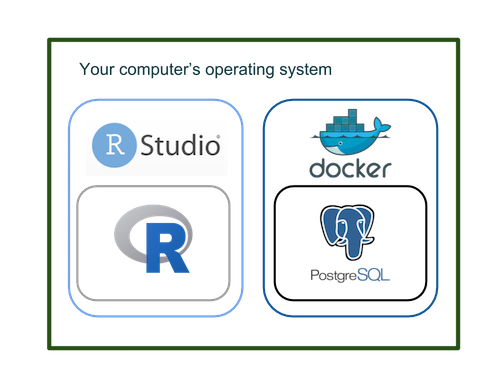
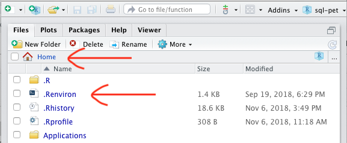
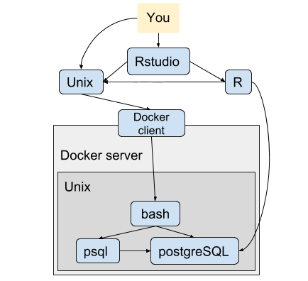
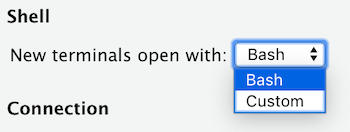
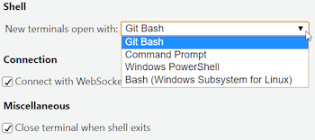
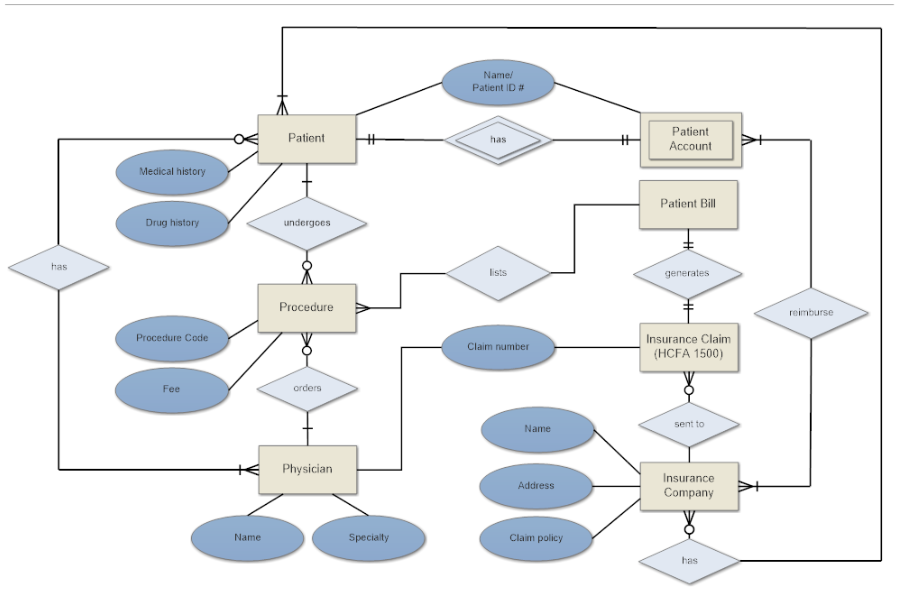
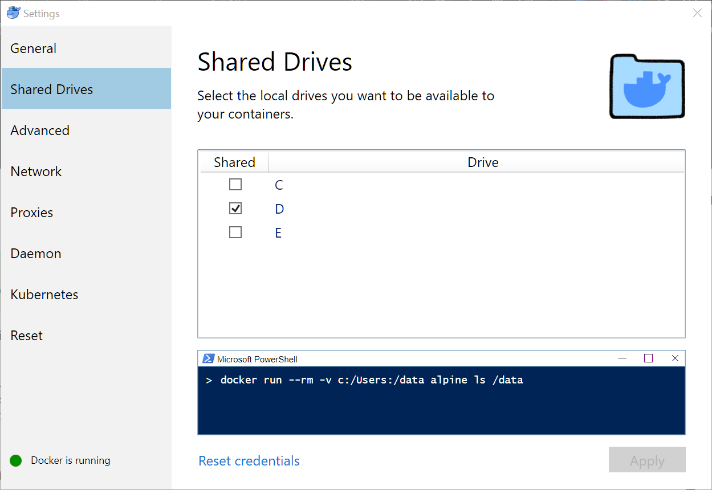

# Introduction {#chapter_introduction}

> This chapter introduces:
> 
> * The motivation for this book and the strategies we have adopted
> * How Docker can be used to set up a dbms to demonstrate access to a service like PostgreSQL from R
> * Our team and how this project came about

## Using R to query a DBMS in your organization

Many R users (or *useRs*) live a dual life: in the vibrant open-source R community where R is created, improved, discussed, and taught. And then they go to work in a secured, complex, closed organizational environment where they may be on their own.  Here is [a request on the Rstudio community site](https://community.rstudio.com/t/moving-from-rjdbc-to-odbc/22419) for help that has been lightly edited to emphasize the generality that we see:

> I'm trying to migrate some inherited scripts that [...] to connect to a [...] database to [...] instead. I've reviewed the https://db.rstudio.com docs and tried a number of configurations but haven't been able to connect. *I'm in uncharted territory within my org, so haven't been able to get much help internally.*

This book will help you create a hybrid environment on your machine that can mimic some of the uncharted territory in your organization.  It goes far beyond the basic connection issues and covers issues that you face when you are finding your way around or writing queries to your organization's databases, not just when maintaining inherited scripts.

* **Technology hurdles**.  The interfaces (passwords, packages, etc.) and gaps between R and a back end database are hidden from public view as a matter of security, so pinpointing exactly where a problem is can be difficult. A **simulated** environment such as we offer here can be an important learning resource.

* **Scale issues**. We see at least two types of scale issues.  Handling large volumes of data so that performance issues must be a consideration requires a basic understanding of what's happening in "the back end" (which is necessarily hidden from view). Therefore mastering techniques for drawing samples or small batches of data are essential. In addition to their size, your organization's databases will often have structural characteristics that are complex and obscure.  Data documentation is often incomplete and emphasizes operational characteristics, rather than analytic opportunities.  A careful useR often needs to confirm the documentation on the fly and de-normalize data carefully.

* **Use cases**. R users frequently need to make sense of an organization's complex data structures and coding schemes to address incompletely formed questions so that informal exploratory data analysis has to be intuitive and fast. The technology details should not get in the way. Sharing and discussing exploratory and diagnostic retrieval techniquesis best in public, but is constrained by organizational requirements.

We have found that PostgreSQL in a Docker container solves many of the foregoing problems.

## Docker as a tool for UseRs

Noam Ross's "[Docker for the UseR](https://nyhackr.blob.core.windows.net/presentations/Docker-for-the-UseR_Noam-Ross.pdf)" [@Ross2018a] suggests that there are four distinct Docker use-cases for useRs.  

1. Make a fixed working environment for reproducible analysis
2. Access a service outside of R **(e.g., PostgreSQL)**
3. Create an R based service (e.g., with `plumber`)
4. Send our compute jobs to the cloud with minimal reconfiguration or revision

This book explores #2 because it allows us to work on the database access issues described above and to practice on an industrial-scale DBMS.  

* Docker is a comparatively easy way to simulate the relationship between an R/RStudio session and a database -- all on on your machine (provided you have Docker installed and running). 
* Running PostgreSQL on a Docker container avoids OS or system dependencies or conflicts that cause confusion and limit reproducibility. 
* A Docker environment consumes relatively few resources.  Our sandbox does much less but only includes PostgreSQL and sample data, so it takes up about 5% of the space taken up by the Vagrant environment that inspired this project. [@Makubuya2018]
* A simple Docker container such as the one used in our sandbox is easy to use and could be extended for other uses.
* Docker is a widely used technology for deploying applications in the cloud, so for many useRs it's worth mastering.

## Who are we?

We have been collaborating on this book since the Summer of 2018, each of us chipping into the project as time permits:

* Dipti Muni - [\@deemuni](https://github.com/deemuni)
* Ian Franz - [\@ianfrantz](https://github.com/ianfrantz)
* Jim Tyhurst - [\@jimtyhurst](https://github.com/jimtyhurst)
* John David Smith - [\@smithjd](https://github.com/smithjd)
* M. Edward (Ed) Borasky - [\@znmeb](https://github.com/znmeb)
* Maryanne Thygesen [\@maryannet](https://github.com/maryannet)
* Scott Came - [\@scottcame](https://github.com/scottcame)
* Sophie Yang - [\@SophieMYang](https://github.com/SophieMYang)

## How did this project come about?

We trace this book back to the [June 2, 2018 Cascadia R Conf](https://cascadiarconf.com/) where Aaron Makubuya gave [a presentation using Vagrant hosting](https://github.com/Cascadia-R/Using_R_With_Databases) [@Makubuya2018].  After that [John Smith](https://github.com/smithjd), [Ian Franz](https://github.com/ianfrantz), and [Sophie Yang](https://github.com/SophieMYang) had discussions after the monthly [Data Discussion Meetups](https://www.meetup.com/Portland-Data-Science-Group/events/fxvhbnywmbgb/) about the difficulties around setting up [Vagrant](https://www.vagrantup.com/) (a virtual environment), connecting to a corporate database, and having realistic **public** environment to demo or practice the issues that come up behind corporate firewalls. [Scott Came's](https://github.com/scottcame) tutorial on [R and Docker](http://www.cascadia-analytics.com/2018/07/21/docker-r-p1.html) [@Came2018] (an alternative to Vagrant) at the 2018 UseR Conference in Melbourne was provocative and it turned out he lived nearby.  We re-connected with [M. Edward (Ed) Borasky](https://github.com/znmeb) who had done extensive development for a [Hack Oregon data science containerization project](https://github.com/hackoregon/data-science-pet-containers) [@Borasky2018].

## Navigation
If this is the first `bookdown` [@Xie2016] book you've read, here's how to navigate the website.

1. The controls on the upper left: there are four controls on the upper left.

    * A "hamburger" menu: this toggles the table of contents on the left side of the page on or off.
    * A magnifying glass: this toggles a search box on or off.
    * A letter "A": this lets you pick how you want the site to display. You have your choice of small or large text, a serif or sans-serif font, and a white, sepia or night theme.
    * A pencil: this is the "Edit" button. This will take you to a GitHub edit dialog for the chapter you're reading. If you're a committer to the repository, you'll be able to edit the source directly. 
    
        If not, GitHub will fork a copy of the repository to your own account and you'll be able to edit that version. Then you can make a pull request.
    
2. The share buttons in the upper right hand corner. There's one for Twitter, one for Facebook, and one that gives a menu of options, including LinkedIn.


<!--chapter:end:index.Rmd-->

# Basic Concepts{#chapter_basic-concepts}

************
> This chapter introduces:
> 
> * The overall structure of our Docker-based PostgreSQL sandbox
> * Basic concepts around each of the elements that make up our sandbox: tidy data, pipes, Docker, PostgreSQL, data representation, and our `petsqlr` package.

*******

## The big picture: R and the Docker / PostgreSQL playground on your machine

Here is an overview of how R and Docker fit on your operating system in this book's sandbox:
    


You run R from RStudio to set up Docker, launch PostgreSQL inside it and then send queries directly to PostgreSQL from R. (We provide more details about our sandbox environment in the chapter on [mapping your environment](#chapter_appendix-sandbox-environment).

## Your computer and its operating system

The playground that we construct in this book is designed so that some of the mysteries of accessing a corporate database are more visible -- it's all happenning on *your computer*. The challenge, however, is that we know very little about your computer and its operating system. In the workshops we've given about this book, the details of individual computers have turned out to be diverse and difficult to pin down in advance.  So there can be many issues, but not many basic concepts that we can highlight in advance.

## R

We assume a general familiarity with R and RStudio. RStudio's Big Data workshop at the 2019 RStudio has an abundance of introductory material [@Ruiz2019].

This book is [Tidyverse-oriented](https://www.tidyverse.org), so we assume familiarity with the pipe operator, tidy data [@Wickham2014], dplyr, and techniques for tidying data [@Wickham2018].  

R connects to a database by means of a series of packages that work together.  The follwing diagram from a [big data workshop](https://github.com/rstudio/bigdataclass) at the 2019 RStudio conference shows the big picture. The biggest difference in terms of retrieval strategies is between writing `dplyr` and native `SQL` code.  Dplyr generates [SQL-92 standard](https://en.wikipedia.org/wiki/SQL-92) code; whereas you can write SQL code that leverages the specific language features of your dbms when you write SQL code yourself.


## Our `sqlpetr` package

The `sqlpetr` package is the companion R package for this database tutorial. It has two classes of functions:

* Functions to install the dependencies needed to build the book and perform the operations covered in the tutorial, and
* Utilities for dealing with Docker and the PostgreSQL Docker image we use.
`sqlpetr` has a pkgdown site at https://smithjd.github.io/sqlpetr/.

## Docker

Docker and the DevOps tools surrounding it have fostered a revolution in the way services are delivered over the internet. In this book, we're piggybacking on a small piece of that revolution, Docker on the desktop.

### Virtual machines and hypervisors
A _virtual machine_ is a machine that is running purely as software hosted by another real machine. To the user, a virtual machine looks just like a real one. But it has no processors, memory or I/O devices of its own - all of those are supplied and managed by the host.

A virtual machine can run any operating system that will run on the host's hardware. A Linux host can run a Windows virtual machine and vice versa.

A _hypervisor_ is the component of the host system software that manages virtual machines, usually called _guests_. Linux systems have a native hypervisor called _Kernel Virtual Machine _ (`kvm`). And laptop, desktop and server processors from Intel and Advanced Micro Devices (AMD) have hardware that makes this hypervisor more efficient.

Windows servers and Windows 10 Pro have a hypervisor called _Hyper-V_. Like `kvm`, `Hyper-V` can take advantage of the hardware in Intel and AMD processors. On Macintosh, there is a _Hypervisor Framework_ (<https://developer.apple.com/documentation/hypervisor>) and other tools build on that.

If this book is about Docker, why do we care about virtual machines and hypervisors? Docker is a Linux subsystem - it only runs on Linux laptops, desktops and servers. As we'll see shortly, if we want to run Docker on Windows or MacOS, we'll need a hypervisor, a Linux virtual machine and some "glue logic" to provide a Docker user experience equivalent to the one on a Linux system.

### Containers
A _container_ is a set of processes running in an operating system. The host operating system is usually Linux, but other operating systems also can host containers.

Unlike a virtual machine, the container has no operating system kernel of its own. If the host is running the Linux kernel, so is the container. And since the container OS is the same as the host OS, there's no need for a hypervisor or hardware to support the hypervisor. So a container is more efficient than a virtual machine.

A container **does** have its own filesystem. From inside the container, this filesystem looks like a Linux filesystem, but it can use any Linux distro. For example, you can have an Ubuntu 18.04 LTS host running Ubuntu 14.04 LTS or Fedora 28 or CentOS 7 containers. The kernel will always be the host kernel, but the utilities and applications will be those from the container.

### Docker itself
While there are both older (_lxc_) and newer container tools, the one that has caught on in terms of widespread use is _Docker_ [@Docker2019a]. Docker is widely used on cloud providers to deploy services of all kinds. Using Docker on the desktop to deliver standardized packages, as we are doing in this book, is a secondary use case, but a common one.

If you're using a Linux laptop / desktop, all you need to do is install Docker CE [@Docker2018b]. However, most laptops and desktops don't run Linux - they run Windows or MacOS. As noted above, to use Docker on Windows or MacOS, you need a hypervisor and a Linux virtual machine.

### Docker objects
The Docker subsystem manages several kinds of objects - containers, images, volumes and networks. In this book, we are only using the basic command line tools to manage containers, images and volumes.

Docker `images` are files that define a container's initial filesystem. You can find pre-built images on Docker Hub and the Docker Store - the base PostgreSQL image we use comes from Docker Hub (<https://hub.docker.com/_/postgres/>). If there isn't a Docker image that does exactly what you want, you can build your own by creating a Dockerfile and running `docker build`. We do this in [Build the pet-sql Docker Image].

Docker `volumes` -- explain `mount`.

### Hosting Docker on Windows machines

There are two ways to get Docker on Windows. For Windows 10 Home and older versions of Windows, you need Docker Toolbox [@Docker2019b]. Note that for Docker Toolbox, you need a 64-bit AMD or Intel processor with the virtualization hardware installed and enabled in the BIOS.

For Windows 10 Pro, you have the Hyper-V virtualizer as standard equipment, and can use Docker for Windows [@Docker2019c].

### Hosting Docker on macOS machines
As with Windows, there are two ways to get Docker. For older Intel systems, you'll need Docker Toolbox [@Docker2019d]. Newer systems (2010 or later running at least macOS El Capitan 10.11) can run Docker for Mac [@Docker2019e].

### Hosting Docker on UNIX machines

Unix was the original host for both R and Docker.  Unix-like commands show up.

## 'Normal' and 'normalized' data

### Tidy data

Tidy data [@Wickham2014] is well behaved from the point of view of analysis and tools in the Tidyverse [@RStudio2019].  Tidy data is easier to think about and it is usually worthwhile to make the data tidy [@Wickham2018].  Tidy data is roughly equivalent to _third normal form_ as discussed below.

### Design of "normal data"

Data in a database is most often optimized to minimize storage space and increase performance while preserving integrity when adding, changing, or deleting data.  The Wikipedia article on  Database Normalization has a good introduction to the characteristics of "normal" data and the process of re-organizing it to meet those desirable criteria [@Wikipedia2019].  The bottom line is that "data normalization is practical" although there are mathematical arguments for normalization based on the preservation of data integrity.

## Organizational dbms

The organizational context of a database matters just as much as its design characteristics.  The design of a database (or _data model_) may have been purchased from an external vendor or developed in-house.  In either case time has a tendency to erode the original design concept so that the data you find in a dbms may not quite match the original design specification.  And the original design may or may not be well reflected in the current naming of tables, columns and other objects.

It's a naive misconception to think that the data you are analyzing "comes from the database" even though you are retrieving it from your organization's dbms.  In fact it comes from the people who design, enter, manage, protect, and use your organization's data.  In practice, a [database administrator](https://en.wikipedia.org/wiki/Database_administrator) (DBA) is often a key point of contact in terms of access and may have stringent criteria for query performance.  Make friends with your DBA. 

## SQL

Although there are [ANSI standards](https://en.wikipedia.org/wiki/SQL#Interoperability_and_standardization) for [SQL syntax](https://en.wikipedia.org/wiki/SQL_syntax), different implementations vary in enough details that R's ability to customize queries for those implementations is very helpful.

The tables in a dbms correspond to a data frame in R, so interaction with a dbms is fairly natural for useRs. 

SQL code is characterized by the fact that it describes *what* to retrieve, leaving the dbms back end to determine how to do it.  Therefore it has a *batch* feel. The pipe operator (`%>%`, which is read as _and then_) is inherently procedural when it's used with dplyr: it can be used to construct queries step-by-step. Once a test dplyr query has been executed, it is easy to inspect the results and add steps with the pipe operator to refine or expand the query.

[APPENDIX D - Quick Guide to SQL](#chapter_appendix-sql-quick-guide) lists the different elements of the SQL language.

### Data mapping between R vs SQL data types

The following code shows how different elements of the R bestiary are translated to and from ANSI standard data types.  Note that R factors are translated as `TEXT` so that missing levels are ignored on the SQL side.


```r
library(DBI)

dbDataType(ANSI(), 1:5)
```

```
## [1] "INT"
```

```r
dbDataType(ANSI(), 1)
```

```
## [1] "DOUBLE"
```

```r
dbDataType(ANSI(), TRUE)
```

```
## [1] "SMALLINT"
```

```r
dbDataType(ANSI(), Sys.Date())
```

```
## [1] "DATE"
```

```r
dbDataType(ANSI(), Sys.time())
```

```
## [1] "TIMESTAMP"
```

```r
dbDataType(ANSI(), Sys.time() - as.POSIXct(Sys.Date()))
```

```
## [1] "TIME"
```

```r
dbDataType(ANSI(), c("x", "abc"))
```

```
## [1] "TEXT"
```

```r
dbDataType(ANSI(), list(raw(10), raw(20)))
```

```
## [1] "BLOB"
```

```r
dbDataType(ANSI(), I(3))
```

```
## [1] "DOUBLE"
```

```r
dbDataType(ANSI(), iris)
```

```
## Sepal.Length  Sepal.Width Petal.Length  Petal.Width      Species 
##     "DOUBLE"     "DOUBLE"     "DOUBLE"     "DOUBLE"       "TEXT"
```
The [DBI specification](https://cran.r-project.org/web/packages/DBI/vignettes/spec.html) provides extensive documentation that is worth digesting if you intend to work with a dbms from R.  As you work through the examples in this book, you will also want to refer to the following resources:

* RStudio's [Databases using R](https://db.rstudio.com) site describes many of the technical details involved.
* The [RStudio community](https://community.rstudio.com/tags/database) is an excellent place to ask questions or study what has been discussed previously.

### PostgreSQL and connection parameters

An **important detail:** We use a PostgreSQL database server running in a Docker container for the database functions.  It is installed inside Docker, so you do not have to download or install it yourself. To connect to it, you have to define some parameters. These parameters are used in two places:

1. When the Docker container is created, they're used to initialize the database, and
2. Whenever we connect to the database, we need to specify them to authenticate.

We define the parameters in an environment file that R reads when starting up. The file is called `.Renviron`, and is located in your home directory.  See the discussion of [securing and using dbms credentials](#chapter_appendix-postresql-authentication).

<!--chapter:end:010-basic-concepts.Rmd-->

# How to use this book {#chapter_how-to-use-this-book}

> This chapter explains:
> 
> * Getting the code used in this book
> * How you can contribute to the book project

This book is full of examples that you can replicate on your computer. 

## Retrieve the code from GitHub

The code to generate the book and the exercises it contains can be downloaded from [this repo](https://github.com/smithjd/sql-pet). 

## Read along, experiment as you go

We have never been sure whether we're writing an expository book or a massive tutorial.  You may use it either way.  The best way to learn the material we cover is to *experiment*.

After the introductory chapters and the chapter that [creates the persistent database](#dvdrental-db-setup), you can jump around and each chapter stands on its own.

## Participating

### Browsing the book
If you just want to read the book and copy / paste code into your working environment, simply browse to <https://smithjd.github.io/sql-pet>. If you get stuck, or find things aren't working, open an issue at <https://github.com/smithjd/sql-pet/issues/new/>.

### Diving in
If you want to experiment with the code in the book, run it in RStudio and interact with it, you'll need to do two more things:

1. Install the `sqlpetr` R package [@Borasky2018a]. See <https://smithjd.github.io/sqlpetr> for the package documentation. Installation may take some time if it has to install or update packages not available on your computer.
2. Clone the Git repository <https://github.com/smithjd/sql-pet.git> and open the project file `sql-pet.Rproj` in RStudio.

Enjoy!

<!--chapter:end:020-using-this-book.Rmd-->

# Learning Goals and Use Cases {#chapter_learning-goals}

> This chapter sets the context for the book by:
> 
> * Challenging you to think about your goals and expectations
> * Imagining the setting where our sample database would be used
> * Posing some imaginary use cases that a data analyst might face
> * Discussing the different elements involved in answering questions from an organization's database


## Ask yourself, what are you aiming for?  

* Differences between production and data warehouse environments.
* Learning to keep your DBAs happy:
  + You are your own DBA in this simulation, so you can wreak havoc and learn from it, but you can learn to be DBA-friendly here.
  + In the end it's the subject-matter experts that understand your data, but you have to work with your DBAs first.

## Learning Goals

After working through the code in this book, you can expect to be able to:

* Set up a PostgreSQL database in a Docker environment.
* Gain familiarity with the various ways of interacting with the Docker and PostgreSQL environments
* Run queries against PostgreSQL in an environment that simulates what you will find in a corporate setting.
* Understand techniques and some of the trade-offs between:
    * queries aimed at exploration or informal investigation using [dplyr](https://cran.r-project.org/package=dplyr) [@Wickham2018]; and 
    * queries that should be written in SQL, because performance is important due to the size of the database or the frequency with which a query is to be run.
* Understand the equivalence between `dplyr` and SQL queries, and how R translates one into the other.
* Gain familiarity with techniques that help you explore a database and verify its documentation.
* Gain familiarity with the standard metadata that a SQL database contains to describe its own contents.
* Understand some advanced SQL techniques.
* Gain some understanding of techniques for assessing query structure and performance.
* Understand enough about Docker to swap databases, e.g. [Sports DB](http://www.sportsdb.org/sd/samples) for the [DVD rental database](http://www.postgresqltutorial.com/postgresql-sample-database/) used in this tutorial. Or swap the database management system (DBMS), e.g. [MySQL](https://www.mysql.com/) for [PostgreSQL](https://www.postgresql.org/).

## Imagining a DVD rental business

Years ago, people rented videos on DVD disks and video stores were a big business.  To understand the data base that we use in this book, try to imagine managing a video rental store [like Movie Madness](https://en.wikipedia.org/wiki/Movie_Madness_Video) in Portland, Oregon.

*What data would be needed and what questions would you have to answer about the business?*

This tutorial uses [the PostgreSQL version of "dvd rental" database](http://www.postgresqltutorial.com/postgresql-sample-database/) which represents the transaction database for running a movie (e.g., dvd) rental business.  The database can be  [downloaded here](http://www.postgresqltutorial.com/wp-content/uploads/2017/10/dvdrental.zip).  Here's a glimpse of it's structure, which we explore using several different methods:
    


A data analyst uses the database abstraction and the practical business questions to make better decisions and solve problems.

## Use cases 

Imagine that you have one of following several roles at our fictional company **DVDs R Us** and you have a following need to be met:

* As a data scientist, I want to know the distribution of number of rentals per month per customer, so that the Marketing department can create incentives for customers in 3 segments: Frequent Renters, Average Renters, Infrequent Renters.
* As the Director of Sales, I want to see the total number of rentals per month for the past 6 months and I want to know how fast our customer base is growing/shrinking per month for the past 6 months.
* As the Director of Marketing, I want to know which categories of DVDs are the least popular, so that I can create a campaign to draw attention to rarely used inventory.
* As a shipping clerk, I want to add rental information when I fulfill a shipment order.
* As the Director of Analytics, I want to test as much of the production R code in my shop as possible against a new release of the DBMS that the IT department is implementing next month.
* etc.

## Investigating a question using an organization's database

* Need both familiarity with the data and a focus question
  + An iterative process where 
    + the data resource can shape your understanding of the question
    + the question you need to answer will frame how you see the data resource
  + You need to go back and forth between the two, asking 
    + do I understand the question?
    + do I understand the data?

* How well do you understand the data resource (in the DBMS)?
  + Use all available documentation and understand its limits
  + Use your own tools and skills to examine the data resource
  + What is *missing* from the database: (columns, records, cells)
  + Why is the data missing?
  
* How well do you understand the question you seek to answer?
  + How general or specific is your question?
  + How aligned is it with the purpose for which the database was designed and is being operated?
  + How different are your assumptions and concerns from those of the people who enter and use the data on a day to day basis?

<!--chapter:end:030-learning-goals-use-cases.Rmd-->

# Connecting Docker, PostgreSQL, and R {#chapter_connect-docker-postgresql-r}

> This chapter demonstrates how to:
>
>  * Run, clean-up and close PostgreSQL in Docker containers.
>  * Keep necessary credentials secret while being available to R when it executes.
>  * Interact with PostgreSQL when it's running inside a Docker container.
>  * Read and write to PostgreSQL from R.

Please install the `sqlpetr` package if not already installed:

```r
library(devtools)
if (!require(sqlpetr)) devtools::install_github("smithjd/sqlpetr", 
                                                build_opts = "")
```
Note that when you install the package the first time, it will ask you to update the packages it uses and that can take some time.

The following packages are used in this chapter:

```r
library(tidyverse)
library(DBI)
library(RPostgres)
require(knitr)
library(sqlpetr)
```

## Verify that Docker is running

Docker commands can be run from a terminal (e.g., the Rstudio Terminal pane) or with a `system2()` command.  (We discuss the diffeent ways of interacting with Docker and other elements in your environment in a [separate chapter](#your-local-environment).)  The necessary functions to start, stop Docker containers and do other busy work are provided in the `sqlpetr` package.  As time permits and curiosity dictates, feel free to look at those functions to see how they work.

### Check that Docker is up and running

> Note: The `sqlpetr` package is written to accompany this book.  The functions in the package are designed to help you focus on interacting with a dbms from R.  You can ignore how they work until you are ready to delve into the details.  They are all named to begin with `sp_`.  The first time a function is called in the book, we provide a note explaining its use.

> The `sp_check_that_docker_is_up` function from the `sqlpetr` package checks whether Docker is up and running.  If it's not, then you need to install, launch or re-install Docker.


```r
sp_check_that_docker_is_up()
```

```
## [1] "Docker is up but running no containers"
```

## Remove previous containers if they exist
Force remove the `cattle` and `sql-pet` containers if they exist (e.g., from prior experiments).  

> The `sp_docker_remove_container` function from the `sqlpetr` package forcibly removes a Docker container. If it is running it will be forcibly terminated and removed. If it doesn't exist you won't get an error message. Note that the `images` out of which a container is built will still exist on your system.


```r
sp_docker_remove_container("cattle")
```

```
## [1] 0
```

```r
sp_docker_remove_container("sql-pet")
```

```
## [1] 0
```

We name containers `cattle` for "throw-aways" and `pet` for ones we treasure and keep around.  :-)

> The `sp_docker_remove_container` function from the `sqlpetr` package creates a container and runs the PostgreSQL 10 image (`docker.io/postgres:10`) in it. The image will be downloaded if it doesn't exist locally.


```r
sp_make_simple_pg("cattle")
```
The first time you run this, Docker downloads the PostgreSQL image, which takes a bit of time. Did it work? The following command should show that a container named `cattle` is running `postgres:10`.


```r
sp_check_that_docker_is_up()
```

```
## [1] "Docker is up, running these containers:"                                                                                                       
## [2] "CONTAINER ID        IMAGE               COMMAND                  CREATED             STATUS                  PORTS                    NAMES"   
## [3] "bf3972eaa4d8        postgres:10         \"docker-entrypoint.s…\"   1 second ago        Up Less than a second   0.0.0.0:5432->5432/tcp   cattle"
```

> The `sp_docker_containers_tibble` function from the `sqlpetr` package provides more on the containers that Docker is running.  Basically this function creates a tibble of containers using `docker ps`.


```r
sp_docker_containers_tibble()
```

```
## # A tibble: 1 x 12
##   container_id image command created_at created ports status size  names
##   <chr>        <chr> <chr>   <chr>      <chr>   <chr> <chr>  <chr> <chr>
## 1 bf3972eaa4d8 post… docker… 2019-03-0… 1 seco… 0.0.… Up Le… 0B (… catt…
## # … with 3 more variables: labels <chr>, mounts <chr>, networks <chr>
```

## Connecting, reading and writing to PostgreSQL from R


### Connecting to PostgreSQL
The `sp_make_simple_pg` function we called above created a container from the
`postgres:10` library image downloaded from Docker Hub. As part of the process, it set the password for the PostgreSQL database superuser `postgres` to the value 
"postgres".

For simplicity, we are using a weak password at this point and it's shown here 
and in the code in plain text. That is bad practice because user credentials 
should not be shared in open code like that.  A [subsequent chapter](#dbms-login)
demonstrates how to store and use credentials to access the DBMS so that they 
are kept private.

> The `sp_get_postgres_connection` function from the `sqlpetr` package gets a DBI connection string to a PostgreSQL database, waiting if it is not ready. This function connects to an instance of PostgreSQL and we assign it to a symbol, `con`, for subsequent use.


```r
con <- sp_get_postgres_connection(
  host = "localhost",
  port = 5432,
  user = "postgres",
  password = "postgres",
  dbname = "postgres",
  seconds_to_test = 30
)
```

Make sure that you can connect to the PostgreSQL database that you have just started. If you have been executing the code from this tutorial, the database will not contain any tables yet:


```r
DBI::dbListTables(con)
```

```
## character(0)
```

### Interact with PostgreSQL

Write `mtcars` to PostgreSQL

```r
DBI::dbWriteTable(con, "mtcars", mtcars, overwrite = TRUE)
```

List the tables in the PostgreSQL database to show that `mtcars` is now there:


```r
DBI::dbListTables(con)
```

```
## [1] "mtcars"
```

List the fields in mtcars:

```r
DBI::dbListFields(con, "mtcars")
```

```
##  [1] "mpg"  "cyl"  "disp" "hp"   "drat" "wt"   "qsec" "vs"   "am"   "gear"
## [11] "carb"
```

Download the table from the DBMS to a local data frame:

```r
mtcars_df <- DBI::dbReadTable(con, "mtcars")
```

> The `sp_print_df` function from the `sqlpetr` package shows (or print) a data frame depending on appropriate output type.  That is when running interactively or generating HTML it prints a `DT::datatable()` while it prints a `knitr::kable()` otherwise.

Tell Docker to *remove* the `cattle` container from it's library of active containers:


```r
sp_print_df(head(mtcars_df))
```

<!--html_preserve--><div id="htmlwidget-1d9f9b9fdca3023baa83" style="width:100%;height:auto;" class="datatables html-widget"></div>
<script type="application/json" data-for="htmlwidget-1d9f9b9fdca3023baa83">{"x":{"filter":"none","data":[["1","2","3","4","5","6"],[21,21,22.8,21.4,18.7,18.1],[6,6,4,6,8,6],[160,160,108,258,360,225],[110,110,93,110,175,105],[3.9,3.9,3.85,3.08,3.15,2.76],[2.62,2.875,2.32,3.215,3.44,3.46],[16.46,17.02,18.61,19.44,17.02,20.22],[0,0,1,1,0,1],[1,1,1,0,0,0],[4,4,4,3,3,3],[4,4,1,1,2,1]],"container":"<table class=\"display\">\n  <thead>\n    <tr>\n      <th> <\/th>\n      <th>mpg<\/th>\n      <th>cyl<\/th>\n      <th>disp<\/th>\n      <th>hp<\/th>\n      <th>drat<\/th>\n      <th>wt<\/th>\n      <th>qsec<\/th>\n      <th>vs<\/th>\n      <th>am<\/th>\n      <th>gear<\/th>\n      <th>carb<\/th>\n    <\/tr>\n  <\/thead>\n<\/table>","options":{"columnDefs":[{"className":"dt-right","targets":[1,2,3,4,5,6,7,8,9,10,11]},{"orderable":false,"targets":0}],"order":[],"autoWidth":false,"orderClasses":false}},"evals":[],"jsHooks":[]}</script><!--/html_preserve-->

## Clean up

Afterwards, always disconnect from the dbms:

```r
DBI::dbDisconnect(con)
```

> The `sp_docker_stop` function from the `sqlpetr` package stops the container given by the `container_name` parameter.

Tell Docker to stop the `cattle` container:

```r
sp_docker_stop("cattle")
```

> The `sp_docker_remove_container` function from the `sqlpetr` package removes the container given by the `container_name` parameter.

Tell Docker to *remove* the `cattle` container from it's library of active containers:


```r
sp_docker_remove_container("cattle")
```

```
## [1] 0
```

Verify that `cattle` is gone:

```r
sp_docker_containers_tibble()
```

```
## # A tibble: 0 x 0
```

If we just **stop** the Docker container but don't remove it (as we did with the `sp_docker_remove_container("cattle")` command), the `cattle` container will persist and we can start it up again later with `sp_docker_start("cattle")`.  In that case, `mtcars` would still be there and we could retrieve it from PostgreSQL again.  Since `sp_docker_remove_container("cattle")`  has removed it, the updated database has been deleted.  (There are enough copies of `mtcars` in the world, so no great loss.)

<!--chapter:end:040-docker-setup-postgres-connect-with-r.Rmd-->

# Create the dvdrental database in PostgreSQL in Docker {#chapter_setup-dvdrental-db}

> NOTE: This Chapter walks through the all steps needed to setup the dvdrental database in Docker.  All susequent chapters depend on this setup.  If for some reason you need to setup the Docker database but don't want to step through this *teaching version* of the setup, you can use:
>
> `source('book-src/setup-dvdrental-docker-container.R')`

> This chapter demonstrates how to:
>
>  * Setup the `dvdrental` database in Docker
>  * Stop and start Docker container to demonstrate persistence
>  * Connect to and disconnect R from the `dvdrental` database
>  * Set up the environment for subsequent chapters

## Overview

In the last chapter we connected to PostgreSQL from R.  Now we set up a "realistic" database named `dvdrental`. There are different approaches to doing this: this chapter sets it up in a way that doesn't show all the Docker details.

These packages are called in this Chapter:

```r
library(tidyverse)
library(DBI)
library(RPostgres)
library(glue)
require(knitr)
library(dbplyr)
library(sqlpetr)
library(bookdown)
```

## Verify that Docker is up and running

```r
sp_check_that_docker_is_up()
```

```
## [1] "Docker is up but running no containers"
```

## Clean up if appropriate
Force-remove the `cattle` and `sql-pet` containers if they exist (e.g., from a prior runs):

```r
sp_docker_remove_container("cattle")
```

```
## [1] 0
```

```r
sp_docker_remove_container("sql-pet")
```

```
## [1] 0
```
## Build the pet-sql Docker image
For the rest of the book we will be using a Docker image called
`postgres-dvdrental`. To save space here in the book, we've created a function
in `sqlpetr` to build this image, called [`sp_make_dvdrental_image`](https://smithjd.github.io/sqlpetr/reference/sp_make_dvdrental_image.html). Vignette [Building the `dvdrental` Docker Image
](https://smithjd.github.io/sqlpetr/articles/building-the-dvdrental-docker-image.html) describes the build process.


```r
sp_make_dvdrental_image("postgres-dvdrental")
```

Did it work? We have a function that lists the images into a tibble!

```r
sp_docker_images_tibble()
```

```
## # A tibble: 6 x 7
##   image_id  repository   tag    digest           created created_at   size 
##   <chr>     <chr>        <chr>  <chr>            <chr>   <chr>        <chr>
## 1 22e0c193… postgres-dv… latest <none>           3 days… 2019-02-28 … 251MB
## 2 ac25c2ba… postgres     10     sha256:b5f07874… 6 mont… 2018-09-04 … 228MB
## 3 93ca3834… r-base       latest sha256:3801677d… 7 mont… 2018-07-16 … 678MB
## 4 23e8b4b8… postgres     latest sha256:d8011033… 7 mont… 2018-07-16 … 236MB
## 5 74f8760a… ubuntu       latest sha256:30e04dda… 7 mont… 2018-07-16 … 82.4…
## 6 11cd0b38… alpine       latest sha256:70430763… 8 mont… 2018-07-06 … 4.41…
```

## Run the pet-sql Docker Image
Now we can run the image in a container and connect to the database. To run the
image we use an `sqlpetr` function called [`sp_pg_docker_run`](https://smithjd.github.io/sqlpetr/reference/sp_pg_docker_run.html)

When the image runs in the container, we can mount the current working directory
into a path in the container. You'll see this in action in a future chapter. 
Docker will create this path if it doesn't exist.

To specify the path, set the parameter `mount_here_as` to the name you want.
Rules for the name:

* If you don't want to mount into the container, specify `NULL`. This is the 
default!
* The name must start with a `/` and be a valid absolute path.
The name should contain only slashes, letters, numbers and underscores. Other characters may or may not work. The `snakecase` package is your friend.


```r
sp_pg_docker_run(
  container_name = "sql-pet",
  image_tag = "postgres-dvdrental",
  postgres_password = "postgres",
  mount_here_as = "/petdir"
)
```

Did it work?

```r
sp_docker_containers_tibble()
```

```
## # A tibble: 1 x 12
##   container_id image command created_at created ports status size  names
##   <chr>        <chr> <chr>   <chr>      <chr>   <chr> <chr>  <chr> <chr>
## 1 ce3accea3583 post… docker… 2019-03-0… 1 seco… 0.0.… Up Le… 0B (… sql-…
## # … with 3 more variables: labels <chr>, mounts <chr>, networks <chr>
```

## Connect to PostgreSQL with R

Use the DBI package to connect to the `dvdrental` database in PostgreSQL.  Remember the settings discussion about [keeping passwords hidden][Pause for some security considerations]


```r
con <- sp_get_postgres_connection(
  host = "localhost",
  port = 5432,
  user = "postgres",
  password = "postgres",
  dbname = "dvdrental",
  seconds_to_test = 30
)
```

List the tables in the database and the fields in one of those tables.  

```r
dbListTables(con)
```

```
##  [1] "actor_info"                 "customer_list"             
##  [3] "film_list"                  "nicer_but_slower_film_list"
##  [5] "sales_by_film_category"     "staff"                     
##  [7] "sales_by_store"             "staff_list"                
##  [9] "category"                   "film_category"             
## [11] "country"                    "actor"                     
## [13] "language"                   "inventory"                 
## [15] "payment"                    "rental"                    
## [17] "city"                       "store"                     
## [19] "film"                       "address"                   
## [21] "film_actor"                 "customer"
```

```r
dbListFields(con, "rental")
```

```
## [1] "rental_id"    "rental_date"  "inventory_id" "customer_id" 
## [5] "return_date"  "staff_id"     "last_update"
```

Disconnect from the database:

```r
dbDisconnect(con)
```
## Stop and start to demonstrate persistence

Stop the container:

```r
sp_docker_stop("sql-pet")
sp_docker_containers_tibble()
```

```
## # A tibble: 0 x 0
```

When we stopped `sql-pet`, it no longer appeared in the tibble. But the
container is still there. `sp_docker_containers_tibble` by default only lists
the *running* containers. But we can use the `list_all` option and see it:


```r
sp_docker_containers_tibble(list_all = TRUE)
```

```
## # A tibble: 1 x 12
##   container_id image command created_at created ports status size  names
##   <chr>        <chr> <chr>   <chr>      <chr>   <chr> <chr>  <chr> <chr>
## 1 ce3accea3583 post… docker… 2019-03-0… 5 seco… <NA>  Exite… 0B (… sql-…
## # … with 3 more variables: labels <chr>, mounts <chr>, networks <chr>
```


Restart the container and verify that the dvdrental tables are still there:

```r
sp_docker_start("sql-pet")
sp_docker_containers_tibble()
```

```
## # A tibble: 1 x 12
##   container_id image command created_at created ports status size  names
##   <chr>        <chr> <chr>   <chr>      <chr>   <chr> <chr>  <chr> <chr>
## 1 ce3accea3583 post… docker… 2019-03-0… 6 seco… 0.0.… Up Le… 63B … sql-…
## # … with 3 more variables: labels <chr>, mounts <chr>, networks <chr>
```
Connect to the `dvdrental` database in PostgreSQL:

```r
con <- sp_get_postgres_connection(
  host = "localhost",
  port = 5432,
  user = "postgres",
  password = "postgres",
  dbname = "dvdrental",
  seconds_to_test = 30
)
```

Check that you can still see the fields in the `rental` table:

```r
dbListFields(con, "rental")
```

```
## [1] "rental_id"    "rental_date"  "inventory_id" "customer_id" 
## [5] "return_date"  "staff_id"     "last_update"
```

## Cleaning up

Always have R disconnect from the database when you're done.

```r
dbDisconnect(con)
```

Stop the `sql-pet` container:

```r
sp_docker_stop("sql-pet")
```
Show that the container still exists even though it's not running


```r
sp_show_all_docker_containers()
```

```
## CONTAINER ID        IMAGE                COMMAND                  CREATED             STATUS                              PORTS               NAMES
## ce3accea3583        postgres-dvdrental   "docker-entrypoint.s…"   7 seconds ago       Exited (0) Less than a second ago                       sql-pet
```

Next time, you can just use this command to start the container: 

> `sp_docker_start("sql-pet")`

And once stopped, the container can be removed with:

> `sp_check_that_docker_is_up("sql-pet")`

## Using the `sql-pet` container in the rest of the book

After this point in the book, we assume that Docker is up and that we can always start up our *sql-pet database* with:

> `sp_docker_start("sql-pet")`

<!--chapter:end:050-docker-setup-postgres-with-dvdrental.Rmd-->

# Securing and using your dbms log-in credentials {#chapter_dbms-login-credentials}

> This chapter demonstrates how to:
>
>  * Keep necessary credentials secret or at least invisible
>  * Interact with PostgreSQL using your stored dbms credentials

Connecting to a dbms can be very frustrating at first.  In many organizations, simply **getting** access credentials takes time and may involve jumping through multiple hoops.  In addition, a dbms is terse or deliberately inscrutable when your credetials are incorrect.  That's a security strategy, not a limitation of your understanding or of your software.  When R can't log you on to a dbms, you usually will have no information as to what went wrong.

There are many different strategies for managing credentials.  See [Securing Credentials](https://db.rstudio.com/best-practices/managing-credentials/) in RStudio's *Databases using R* documentation for some alternatives to the method we adopt in this book.  We provide more details about [PostgreSQL Authentication](#chapter_appendix-postresql-authentication) in our sandbox environment in an appendix.

The following packages are used in this chapter:

```r
library(tidyverse)
library(DBI)
library(RPostgres)
require(knitr)
library(sqlpetr)
```
## Set up the sql-pet Docker container

### Verify that Docker is running

Check that Docker is up and running:


```r
sp_check_that_docker_is_up()
```

```
## [1] "Docker is up but running no containers"
```
### Start the Docker container:

Start the sql-pet Docker container:

```r
sp_docker_start("sql-pet")
```

## Storing your dbms credentials

In previous chapters the connection string for connecting to the dbms has used default credentials specified in plain text as follows:

  `user= 'postgres', password = 'postgres'`

When we call `sp_get_postgres_connection` below we'll use environment variables that R obtains from reading the *.Renviron* file when R starts up.  This approach has two benefits: that file is not uploaded to GitHub and R looks for it in your default directory every time it loads.  To see whether you have already created that file, use the R Studio Files tab to look at your **home directory**:



That file should contain lines that **look like** the example below. Although in this example it contains the PostgreSQL <b>default values</b> for the username and password, they are obviously not secret.  But this approach demonstrates where you should put secrets that R needs while not risking accidental uploaded to GitHub or some other public location..

Open your `.Renviron` file with this command:

>
> `file.edit("~/.Renviron")`
>

Or you can execute [define_postgresql_params.R](define_postgresql_params.R) to create the file or you could copy / paste the following into your **.Renviron** file:
```
DEFAULT_POSTGRES_PASSWORD=postgres
DEFAULT_POSTGRES_USER_NAME=postgres
```
Once that file is created, restart R, and after that R reads it every time it comes up. 

### Connect with Postgres using the Sys.getenv function

Connect to the postgrSQL using the `sp_get_postgres_connection` function:

```r
con <- sp_get_postgres_connection(user = Sys.getenv("DEFAULT_POSTGRES_USER_NAME"),
                         password = Sys.getenv("DEFAULT_POSTGRES_PASSWORD"),
                         dbname = "dvdrental",
                         seconds_to_test = 30)
```
Once the connection object has been created, you can list all of the tables in the database:

```r
dbListTables(con)
```

```
##  [1] "actor_info"                 "customer_list"             
##  [3] "film_list"                  "nicer_but_slower_film_list"
##  [5] "sales_by_film_category"     "staff"                     
##  [7] "sales_by_store"             "staff_list"                
##  [9] "category"                   "film_category"             
## [11] "country"                    "actor"                     
## [13] "language"                   "inventory"                 
## [15] "payment"                    "rental"                    
## [17] "city"                       "store"                     
## [19] "film"                       "address"                   
## [21] "film_actor"                 "customer"
```

## Clean up

Afterwards, always disconnect from the dbms:

```r
dbDisconnect(con)
```
Tell Docker to stop the `sql-pet` container:

```r
sp_docker_stop("sql-pet")
```

<!--chapter:end:060-secure-and-use-dbms-credentials-in-r.Rmd-->

# Mapping your local environment {#chapter_your-local-environment}

> This chapter explores:
> 
> * The different entities involved in running the examples in this book's sandbox
> * The different roles that each entity plays in the sandbox
> * How those entities are connected and how communication between those entities happens
> * Pointers to the commands that go with each entity

These packages are used in this chapter:

```r
library(tidyverse)
library(DBI)
library(RPostgres)
require(knitr)
library(dbplyr)
library(sqlpetr)
library(DiagrammeR)
display_rows <- 5
```

## Set up our standard pet-sql environment

Assume that the Docker container with PostgreSQL and the dvdrental database are ready to go.  Start up the `docker-pet` container:


```r
sp_docker_start("sql-pet")
```

Connect to the `dvdrental` database with R.  


```r
con <- sp_get_postgres_connection(
  user = Sys.getenv("DEFAULT_POSTGRES_USER_NAME"),
  password = Sys.getenv("DEFAULT_POSTGRES_PASSWORD"),
  dbname = "dvdrental",
  seconds_to_test = 30
)
```

## Sandbox Environment {#sandbox-environment}

Here is an overview of our sandbox environment.  In this chapter we explore each of the entities in the sandbox, how they are connected and how they communicate with each other.  You can skip this chapter and come back later when you are curious about the setup that we're using in this book.

<center>

</center>

### Sandbox entities and their roles

### RStudio

You communicate with Rstudio, which can send commands to both R and to Unix.  Commands to your OS can be entered directly in the terminal pane or via an R function like `exec2()`.  On a Unix or Mac computer, you typically communicate with `bash`, while you have several choices on a Windows computer.

The following two screenshots show the default options available for the `Terminal` option in RStudio's `Preferences` for Mac and Windows, respectively.





To check on the RStudio version you are using, enter this R command:

> `require(rstudioapi)` <br>
> `versionInfo()`

The [RStudio IDE cheat sheet](https://www.rstudio.com/resources/cheatsheets/#ide) ([PDF](https://github.com/rstudio/cheatsheets/raw/master/rstudio-ide.pdf)) is handy for learning your way around the IDE.

### OS / local command line interface 

You can type commands directly into a terminal window on your computer to communicate with your operating system (OS).  It will be a `bash` prompt on a Unix or Mac, but could be one of several flavors on Windows.  Our diagram conflates the operating system with the command line interface (CLI) which is a bit of a simplification as discussed below.

In addition to operating system commands, you can communicate with the Docker client through the CLI to start and stop the Docker server, load containers with programs such as Unix, PostgreSQL, communicae with those programs, etc.

To check on the OS version you are using, enter this on your RStudio terminal or local CLI:

> `uname -a`

An OS can contain different comand line interfaces.  Check on it with this on your RStudio terminal or local CLI:

> `echo $0`

A [Unix / Linux command line cheet](http://cheatsheetworld.com/programming/unix-linux-cheat-sheet/) sheet is a handy reference.

### R

R processes instructions from Rstudio.  It can send instructions to your OS via the `system2` function.  R can also talk directly to PostgreSQL through the DBI package.

R functions like `file.info("file.typ")` communicate with your operating system, but do not visibly issue a command to your CLI.  That's an example of an equivalence that can be useful or confusing (as in our environment diagram): you can get the same information from `ls -ql README.md` on a Unix command line as `file.info("README.md")` on the R console.

Although this sandbox seeks to make it easy, connecting to the database often involves technical and organizational hurdles like getting authorization. The main purpose of this book is to provide a sandbox for database queries to experiment with sending commands with one of the *DBI* functions to the dbms directly from R.  However, Docker and PostreSQL commands are useful to know and may be necessary in extending the book's examples. 

To check on the version of R that you are using, enter this on your R Console command line:

> `R.version`

The [growing collection of RStudio cheet sheets](https://www.rstudio.com/resources/cheatsheets/) is indispensable.

### Docker client

The docker client sets up the Docker server, loads containers, and passes instructions from your OS to the programs running in the Docker server. A Docker container will always contain a subset of the Linux operating system, so that it contains a second CLI in your sandbox.  See more about the [Docker environment](https://docs.docker.com/engine/docker-overview/#the-docker-platform).  

In addition to interaction with Docker through your computer's CLI or the RStudio Terminal pane, the [`docker`](https://bhaskarvk.github.io/docker/) and 
 [`stevedore`](https://richfitz.github.io/stevedore/) packages can communicate with Docker from R.  Both packages rely on the `reticulate` package and python.  
 
For this book, we chose to send instructions to Docker through R's `system2()` function calls which do pass commands along to Docker through your computer's CLI.  We chose that route in order to be as transparent as possible and because the book's sandbox environment is fairly simple.  Although Docker has 44 different commands, in this book we only use a subset: `ps`, `build`, `run`, `exec`, `start`, `stop`, and `rm`.  We wrap all of these commands in `sqlpetr` package functions to encourage you to focus on R and PostgreSQL.

To check on the Docker version you are using, enter this on your RStudio Terminal or local CLI:

> `docker version`

To see what images (if any) are stored locally and available for running in Docker, enter this on your RStudio Terminal or local CLI:

> `docker image ls`

There are many Docker command-line cheat sheets; [this one](https://dockercheatsheet.painlessdocker.com/) is recommended.

### In Docker: Linux

Docker runs a subset of the Linux operating system that in turn runs other programs like psql or PostgreSQL.  You may want to poke around the Linux environment inside Docker.  To find what version of Linux Docker is running, enter the following command on your local CLI or in the RStudio Terminal pane:

> `docker exec -ti sql-pet uname -a`

As Linux can itself have different CLIs, enter the following command on your local CLI or in the RStudio Terminal pane to find out which CLI is running inside Docker:

> `docker exec -ti sql-pet echo $0`

To enter an interactive session inside Docker's Linux environment, enter the following command on your local CLI or in the RStudio Terminal pane:

> `docker exec -ti sql-pet bash`

To exit, enter:

> `exit`

A [Unix / Linux command line cheet](http://cheatsheetworld.com/programming/unix-linux-cheat-sheet/) sheet is a handy reference.

### In Docker: `psql`

If you are comfortable executing SQL from a command line directly against the database, you can run the `psql` application in our Docker environment.  To start up a `psql` session to investigate PostgreSQL from a command line enter the following command on your computer's CLI or the RStudio Terminal pane:

> `$ docker exec -ti sql-pet psql -a -p 5432 -d dvdrental -U postgres`

Exit that environment with:

> `\q`

Us this handy psql cheat sheet ([PDF](https://gpdb.docs.pivotal.io/gs/43/pdf/PSQLQuickRef.pdf)) to get around.

### In Docker: `PostgreSQL`

The PostgreSQL database is a whole environment unto itself.  It can receive instructions through bash from `psql`, and it will respond to `DBI` queries from R on port 5282.

To check on the version of PostgreSQL *client* (e.g., `psql`) you are using, enter this on your RStudio terminal or local command line interface:

> `docker exec -ti sql-pet psql --version`

To check on the version of PostgreSQL *server* you are running in Docker, enter this on your RStudio Terminal or local command line interface:

> `docker exec -ti sql-pet psql -U postgres -c 'select version();'`

Here's a recommended PostgreSQL cheat sheet ([PDF](http://www.postgresqltutorial.com/wp-content/uploads/2018/03/PostgreSQL-Cheat-Sheet.pdf)).

## Getting there from here: entity connections, equivalence, and commands

pathways, equivalences, command structures.

We use two trivial commands to explore the various *interfaces*.  `ls -l` is the unix command for listing information about a file and `\du` is the psql command to list the users that exist in PostgreSQL.

Your OS and the OS inside Docker may be looking at the same file but they are in different time zones.

### Get info on a local file from R code


```r
file.info("README.md")
```

```
##           size isdir mode               mtime               ctime
## README.md 4493 FALSE  644 2019-02-17 13:04:05 2019-02-17 13:04:05
##                         atime uid gid uname grname
## README.md 2019-02-17 13:04:05 502  80   jds  admin
```
The equivalent information from executing a command on the CLI or Terminal would be


```r
system2("ls",  "-l README.md", stdout = TRUE, stderr = FALSE)
```
### Get info on the same OS file inside Docker from R Code


```r
system2("docker", "exec sql-pet ls -l petdir/README.md", stdout = TRUE, stderr = FALSE)
```

```
## [1] "-rw-r--r-- 1 root root 4493 Feb 17 21:04 petdir/README.md"
```

### Docker and psql together from R or your CLI

As you become familiar with using Docker, you'll see that there are various ways to do any given task.  Here's an illustration of how to get a list of users who have access to the PostegreSQL database.


```r
system2("docker", "exec sql-pet psql -U postgres -c '\\du' ", 
        stdout = TRUE, stderr = FALSE)
```

```
## [1] "                                   List of roles"                                    
## [2] " Role name |                         Attributes                         | Member of "
## [3] "-----------+------------------------------------------------------------+-----------"
## [4] " postgres  | Superuser, Create role, Create DB, Replication, Bypass RLS | {}"        
## [5] ""
```
From the RStudio Terminal window, the equivalent would be a matter of dropping off some of the R code:

> `docker exec -it sql-pet psql -U postgres -c '\du'`

### Nesting commands illustrates how entities are connected

The following table illustrates how the different entities communicate with each other by decomposing a command from the chapter on [creating a Docker container one step at a time](#step-at-a-time-docker):

> `system2("docker", "exec sql-pet pg_restore -U postgres -d dvdrental petdir/dvdrental.tar", stdout = TRUE, stderr = TRUE)`

| Code element | Comment |
|----------------|------------|
| `system2(` | R command to send instructions to your computer's CLI. |
| `"docker",`  | The program (docker) on your computer that will interpret the commands passed from the `system2` function. |
| `"` | The entire string within the quotes is passed to docker | 
| `exec sql-pet`  | `exec` will pass a command to any program running in the `sql-pet` container. |
| `pg_restore`  | `pg_restore` is the program inside the `sql-pet` container that processes instructions to restore a previously downloaded backup file. |
| `-U postgres -d dvdrental` `petdir/dvdrental.tar` | The `pg_restore` program requires a username, a database and a backup file to be restored.|
| `",`  | End of the docker commands passed to the `system2` function in R. |
| `stdout = TRUE, stderr = TRUE)` | The `system2` function needs to know what to do with its output, which in this case is to print all of it. |

## Exercises

Docker containers have a small foot print.  In our container, we are running a limited Linux kernel and a PostgreSQL database.  To show how tiny the Docker environment is, we will look at all the processes running inside Docker and the top level file structure.


In the following exercises, use the `-i` option and the CONTAINER = `sql-pet`.

Start up R/RStudio and convert the CLI command to an R/RStudio command 
    
|# |Question          | Docker CLI Command         | R RStudio command | Local Command LINE
|--|------------------|----------------------------|-------------------|---------------
|1 |How many processes are running inside the Docker container?| docker exec -i sql-pet ps -eF|
|1a|How many process are running on your local machine?|||widows: tasklist<b>Mac/Linux: ps -ef
|2 |What is the total number of files and directories in Docker?|docker exec -i sql-pet ls -al||
|2a|What is the total number of files and directories on your local machine?||||
|3 |Is Docker Running?|docker version|||
|3a|What are your Client and Server Versions?|||
|4 |Does PostgreSQL exist in the container?|docker ps -a||
|4a|What is the status of PostgreSQL?|docker ps -a||
|4b|What is the size of PostgreSQL?|docker images||
|4c|What is the size of your laptop OS|||https://www.quora.com/What-is-the-actual-size-of-Windows-10-ISO-file
|5 |If sql-pet status is Up, How do I stop it?|docker stop sql-pet||
|5a|If sql-pet status is Exited, How do I start it?|docker start sql-pet||

<!--chapter:end:070-environment-diagram.Rmd-->

# Introduction to DBMS queries {#chapter_dbms-queries-intro}

> This chapter demonstrates how to:
> 
> * Get a glimpse of what tables are in the database and what fields a table contains
> * Download all or part of a table from the dbms
> * See how `dplyr` code is translated into `SQL` commands
> * Get acquainted with some useful tools for investigating a single table
> * Begin thinking about how to divide the work between your local R session and the dbms

## Setup

The following packages are used in this chapter:

```r
library(tidyverse)
library(DBI)
library(RPostgres)
library(dbplyr)
require(knitr)
library(bookdown)
library(sqlpetr)
```
Assume that the Docker container with PostgreSQL and the dvdrental database are ready to go. If not go back to [Chapter 7][Build the pet-sql Docker Image]

```r
sqlpetr::sp_docker_start("sql-pet")
```
Connect to the database:

```r
con <- sqlpetr::sp_get_postgres_connection(
  user = Sys.getenv("DEFAULT_POSTGRES_USER_NAME"),
  password = Sys.getenv("DEFAULT_POSTGRES_PASSWORD"),
  dbname = "dvdrental",
  seconds_to_test = 30
)
```

## Getting data from the database

As we show later on, the database serves as a store of data and as an engine for sub-setting, joining, and computation on the data.  We begin with getting data from the dbms, or "downloading" data.

### Finding out what's there

We've already seen the simplest way of getting a list of tables in a database with `DBI` functions that list tables and fields.  Generate a vector listing the (public) tables in the database:

```r
tables <- DBI::dbListTables(con)
tables
```

```
##  [1] "actor_info"                 "customer_list"             
##  [3] "film_list"                  "nicer_but_slower_film_list"
##  [5] "sales_by_film_category"     "staff"                     
##  [7] "sales_by_store"             "staff_list"                
##  [9] "category"                   "film_category"             
## [11] "country"                    "actor"                     
## [13] "language"                   "inventory"                 
## [15] "payment"                    "rental"                    
## [17] "city"                       "store"                     
## [19] "film"                       "address"                   
## [21] "film_actor"                 "customer"
```
Print a vector with all the fields (or columns or variables) in one specific table:

```r
DBI::dbListFields(con, "rental")
```

```
## [1] "rental_id"    "rental_date"  "inventory_id" "customer_id" 
## [5] "return_date"  "staff_id"     "last_update"
```

### Listing all the fields for all the tables

The first example, `DBI::dbListTables(con)` returned 22 tables and the second example, `DBI::dbListFields(con, "rental")` returns 7 fields.  Here we combine the two calls to return a list of tables which has a list of all the fields in the table.  The code block just shows the first two tables.


```r
table_columns <- lapply(tables, dbListFields, conn = con)
```

Or, using purr:

```r
table_columns <- purrr::map(tables, ~ dbListFields(.,conn = con) )
```
Rename each list [[1]] ... [[22]] to meaningful table name

```r
names(table_columns) <- tables

head(table_columns)
```

```
## $actor_info
## [1] "actor_id"   "first_name" "last_name"  "film_info" 
## 
## $customer_list
## [1] "id"       "name"     "address"  "zip code" "phone"    "city"    
## [7] "country"  "notes"    "sid"     
## 
## $film_list
## [1] "fid"         "title"       "description" "category"    "price"      
## [6] "length"      "rating"      "actors"     
## 
## $nicer_but_slower_film_list
## [1] "fid"         "title"       "description" "category"    "price"      
## [6] "length"      "rating"      "actors"     
## 
## $sales_by_film_category
## [1] "category"    "total_sales"
## 
## $staff
##  [1] "staff_id"    "first_name"  "last_name"   "address_id"  "email"      
##  [6] "store_id"    "active"      "username"    "password"    "last_update"
## [11] "picture"
```

Later on we'll discuss how to get more extensive data about each table and column from the database's own store of metadata using a similar technique.  As we go further the issue of scale will come up again and again: you need to be careful about how much data a call to the dbms will return, whether it's a list of tables or a table that could have millions of rows.

It's important to connect with people who own, generate, or are the subjects of the data.  A good chat with people who own the data, generate it, or are the subjects can generate insights and set the context for your investigation of the database. The purpose for collecting the data or circumstances where it was collected may be buried far afield in an organization, but *usually someone knows*.  The metadata discussed in a later chapter is essential but will only take you so far.

There are different ways of just **looking at the data**, which we explore below.

### Downloading an entire table

There are many different methods of getting data from a DBMS, and we'll explore the different ways of controlling each one of them.

`DBI::dbReadTable` will download an entire table into an R [tibble](https://tibble.tidyverse.org/).  

```r
rental_tibble <- DBI::dbReadTable(con, "rental")
str(rental_tibble)
```

```
## 'data.frame':	16044 obs. of  7 variables:
##  $ rental_id   : int  2 3 4 5 6 7 8 9 10 11 ...
##  $ rental_date : POSIXct, format: "2005-05-24 22:54:33" "2005-05-24 23:03:39" ...
##  $ inventory_id: int  1525 1711 2452 2079 2792 3995 2346 2580 1824 4443 ...
##  $ customer_id : int  459 408 333 222 549 269 239 126 399 142 ...
##  $ return_date : POSIXct, format: "2005-05-28 19:40:33" "2005-06-01 22:12:39" ...
##  $ staff_id    : int  1 1 2 1 1 2 2 1 2 2 ...
##  $ last_update : POSIXct, format: "2006-02-16 02:30:53" "2006-02-16 02:30:53" ...
```
That's very simple, but if the table is large it may not be a good idea, since R is designed to keep the entire table in memory.  Note that the first line of the str() output reports the total number of observations.  

### A table object that can be reused

The `dplyr::tbl` function gives us more control over access to a table by enabling  control over which columns and rows to download.  It creates  an object that might **look** like a data frame, but it's actually a list object that `dplyr` uses for constructing queries and retrieving data from the DBMS.  


```r
rental_table <- dplyr::tbl(con, "rental")
class(rental_table)
```

```
## [1] "tbl_PqConnection" "tbl_dbi"          "tbl_sql"         
## [4] "tbl_lazy"         "tbl"
```


### Controlling the number of rows returned

The `collect` function triggers the creation of a tibble and controls the number of rows that the DBMS sends to R.  

```r
rental_table %>% dplyr::collect(n = 3) %>% dim
```

```
## [1] 3 7
```

```r
rental_table %>% dplyr::collect(n = 500) %>% dim
```

```
## [1] 500   7
```

### Random rows from the dbms

When the dbms contains many rows, a sample of the data may be plenty for your purposes.  Although `dplyr` has nice functions to sample a data frame that's already in R (e.g., the `sample_n` and `sample_frac` functions), to get a sample from the dbms we have to use `dbGetQuery` to send native SQL to the database. To peek ahead, here is one example of a query that retrieves 20 rows from a 1% sample:


```r
one_percent_sample <- DBI::dbGetQuery(
  con,
  "SELECT rental_id, rental_date, inventory_id, customer_id FROM rental TABLESAMPLE BERNOULLI(1) LIMIT 20;
  "
)

one_percent_sample
```

```
##    rental_id         rental_date inventory_id customer_id
## 1         22 2005-05-25 02:19:23          727         509
## 2        168 2005-05-26 03:07:43         2714         469
## 3        253 2005-05-26 14:43:14         2969         416
## 4        395 2005-05-27 11:45:49          752         575
## 5        576 2005-05-28 10:56:10         1866         588
## 6        643 2005-05-28 18:52:11         3105         240
## 7        653 2005-05-28 20:12:20          126         327
## 8        676 2005-05-28 22:27:51         2329         490
## 9        916 2005-05-30 11:25:01         1290           6
## 10      1001 2005-05-31 00:46:31         1498          64
## 11      1044 2005-05-31 06:24:44         2574          70
## 12      1114 2005-05-31 16:00:33         2287         117
## 13      1171 2005-06-14 23:50:11         4082         284
## 14      1277 2005-06-15 08:01:29           76         464
## 15      1366 2005-06-15 14:21:00         4238         576
## 16      1375 2005-06-15 14:54:56         3555         500
## 17      1683 2005-06-16 11:54:55         2361         494
## 18      1758 2005-06-16 17:39:39         2654         474
## 19      1797 2005-06-16 20:13:03         3435         275
## 20      1848 2005-06-17 00:07:07         3797         526
```
**Exact sample of 100 records**

This technique depends on knowing the range of a record index, such as the `rental_id` in the `rental` table of our `dvdrental` database.

Start by finding the min and max values.

```r
DBI::dbListFields(con, "rental")
```

```
## [1] "rental_id"    "rental_date"  "inventory_id" "customer_id" 
## [5] "return_date"  "staff_id"     "last_update"
```

```r
rental_df <- DBI::dbReadTable(con, "rental")

max(rental_df$rental_id)
```

```
## [1] 16049
```

```r
min(rental_df$rental_id)
```

```
## [1] 1
```

Set the random number seed and draw the sample.

```r
set.seed(123)
sample_rows <- sample(1:16049, 100)
rental_table <- dplyr::tbl(con, "rental")
```

Run query with the filter verb listing the randomly sampled rows to be retrieved:

```r
rental_sample <- rental_table %>% 
  dplyr::filter(rental_id %in% sample_rows) %>% 
  dplyr::collect()

str(rental_sample)
```

```
## Classes 'tbl_df', 'tbl' and 'data.frame':	100 obs. of  7 variables:
##  $ rental_id   : int  10 395 675 731 734 1494 1517 1643 1651 1775 ...
##  $ rental_date : POSIXct, format: "2005-05-25 00:02:21" "2005-05-27 11:45:49" ...
##  $ inventory_id: int  1824 752 1273 4124 3084 244 3728 1352 4444 1922 ...
##  $ customer_id : int  399 575 338 5 538 575 148 484 524 123 ...
##  $ return_date : POSIXct, format: "2005-05-31 22:44:21" "2005-05-31 13:42:49" ...
##  $ staff_id    : int  2 1 2 1 2 1 1 2 2 2 ...
##  $ last_update : POSIXct, format: "2006-02-16 02:30:53" "2006-02-16 02:30:53" ...
```


### Sub-setting variables

A table in the dbms may not only have many more rows than you want, but also many more columns.  The `select` command controls which columns are retrieved.

```r
rental_table %>% dplyr::select(rental_date, return_date) %>% head()
```

```
## # Source:   lazy query [?? x 2]
## # Database: postgres [postgres@localhost:5432/dvdrental]
##   rental_date         return_date        
##   <dttm>              <dttm>             
## 1 2005-05-24 22:54:33 2005-05-28 19:40:33
## 2 2005-05-24 23:03:39 2005-06-01 22:12:39
## 3 2005-05-24 23:04:41 2005-06-03 01:43:41
## 4 2005-05-24 23:05:21 2005-06-02 04:33:21
## 5 2005-05-24 23:08:07 2005-05-27 01:32:07
## 6 2005-05-24 23:11:53 2005-05-29 20:34:53
```
That's exactly equivalent to submitting the following SQL commands dirctly:

```r
DBI::dbGetQuery(
  con,
  'SELECT "rental_date", "return_date"
FROM "rental"
LIMIT 6') 
```

```
##           rental_date         return_date
## 1 2005-05-24 22:54:33 2005-05-28 19:40:33
## 2 2005-05-24 23:03:39 2005-06-01 22:12:39
## 3 2005-05-24 23:04:41 2005-06-03 01:43:41
## 4 2005-05-24 23:05:21 2005-06-02 04:33:21
## 5 2005-05-24 23:08:07 2005-05-27 01:32:07
## 6 2005-05-24 23:11:53 2005-05-29 20:34:53
```


We won't discuss `dplyr` methods for sub-setting variables, deriving new ones, or sub-setting rows based on the values found in the table, because they are covered well in other places, including:

  * Comprehensive reference: [https://dplyr.tidyverse.org/](https://dplyr.tidyverse.org/)
  * Good tutorial: [https://suzan.rbind.io/tags/dplyr/](https://suzan.rbind.io/tags/dplyr/) 

In practice we find that, **renaming variables** is often quite important because the names in an SQL database might not meet your needs as an analyst.  In "the wild", you will find names that are ambiguous or overly specified, with spaces in them, and other problems that will make them difficult to use in R.  It is good practice to do whatever renaming you are going to do in a predictable place like at the top of your code.  The names in the `dvdrental` database are simple and clear, but if they were not, you might rename them for subsequent use in this way:


```r
tbl(con, "rental") %>%
  dplyr::rename(rental_id_number = rental_id, inventory_id_number = inventory_id) %>% 
  dplyr::select(rental_id_number, rental_date, inventory_id_number) %>%
  head()
```

```
## # Source:   lazy query [?? x 3]
## # Database: postgres [postgres@localhost:5432/dvdrental]
##   rental_id_number rental_date         inventory_id_number
##              <int> <dttm>                            <int>
## 1                2 2005-05-24 22:54:33                1525
## 2                3 2005-05-24 23:03:39                1711
## 3                4 2005-05-24 23:04:41                2452
## 4                5 2005-05-24 23:05:21                2079
## 5                6 2005-05-24 23:08:07                2792
## 6                7 2005-05-24 23:11:53                3995
```
That's equivalent to the following SQL code:

```r
DBI::dbGetQuery(
  con,
  'SELECT "rental_id_number", "rental_date", "inventory_id_number"
FROM (SELECT "rental_id" AS "rental_id_number", "rental_date", "inventory_id" AS "inventory_id_number", "customer_id", "return_date", "staff_id", "last_update"
FROM "rental") "ihebfvnxvb"
LIMIT 6' )
```

```
##   rental_id_number         rental_date inventory_id_number
## 1                2 2005-05-24 22:54:33                1525
## 2                3 2005-05-24 23:03:39                1711
## 3                4 2005-05-24 23:04:41                2452
## 4                5 2005-05-24 23:05:21                2079
## 5                6 2005-05-24 23:08:07                2792
## 6                7 2005-05-24 23:11:53                3995
```
The one difference is that the `SQL` code returns a regular data frame and the `dplyr` code returns a `tibble`.  Notice that the seconds are greyed out in the `tibble` display.

### Translating `dplyr` code to `SQL` queries

Where did the translations we've shown above come from?  The `show_query` function shows how `dplyr` is translating your query to the dialect of the target dbms:

```r
rental_table %>%
  dplyr::count(staff_id) %>%
  dplyr::show_query()
```

```
## <SQL>
## SELECT "staff_id", COUNT(*) AS "n"
## FROM "rental"
## GROUP BY "staff_id"
```
Here is an extensive discussion of how `dplyr` code is translated into SQL:

* [https://dbplyr.tidyverse.org/articles/sql-translation.html](https://dbplyr.tidyverse.org/articles/sql-translation.html) 

If you prefer to use SQL directly, rather than `dplyr`, you can submit SQL code to the DBMS through the `DBI::dbGetQuery` function:

```r
DBI::dbGetQuery(
  con,
  'SELECT "staff_id", COUNT(*) AS "n"
   FROM "rental"
   GROUP BY "staff_id";
  '
)
```

```
##   staff_id    n
## 1        2 8004
## 2        1 8040
```

When you create a report to run repeatedly, you might want to put that query into R markdown. That way you can also execute that SQL code in a chunk with the following header:

  {`sql, connection=con, output.var = "query_results"`}


```sql
SELECT "staff_id", COUNT(*) AS "n"
FROM "rental"
GROUP BY "staff_id";
```
Rmarkdown stores that query result in a tibble which can be printed by referring to it:

```r
query_results
```

```
##   staff_id    n
## 1        2 8004
## 2        1 8040
```

## Mixing dplyr and SQL

When dplyr finds code that it does not know how to translate into SQL, it will simply pass it along to the dbms. Therefore you can interleave native commands that your dbms will understand in the middle of dplyr code.  Consider this example that's derived from [@Ruiz2019]:


```r
rental_table %>%
  dplyr::select_at(vars( -contains("_id"))) %>% 
  dplyr::mutate(today = now()) %>%
  dplyr::show_query()
```

```
## <SQL>
## SELECT "rental_date", "return_date", "last_update", NOW() AS "today"
## FROM (SELECT "rental_date", "return_date", "last_update"
## FROM "rental") "yhbysdoypk"
```
That is native to PostgreSQL, not [ANSI standard](https://en.wikipedia.org/wiki/SQL#Interoperability_and_standardization) SQL.

Verify that it works:

```r
rental_table %>%
  dplyr::select_at(vars( -contains("_id"))) %>% 
  head() %>% 
  dplyr::mutate(today = now()) %>%
  dplyr::collect()
```

```
## # A tibble: 6 x 4
##   rental_date         return_date         last_update        
##   <dttm>              <dttm>              <dttm>             
## 1 2005-05-24 22:54:33 2005-05-28 19:40:33 2006-02-16 02:30:53
## 2 2005-05-24 23:03:39 2005-06-01 22:12:39 2006-02-16 02:30:53
## 3 2005-05-24 23:04:41 2005-06-03 01:43:41 2006-02-16 02:30:53
## 4 2005-05-24 23:05:21 2005-06-02 04:33:21 2006-02-16 02:30:53
## 5 2005-05-24 23:08:07 2005-05-27 01:32:07 2006-02-16 02:30:53
## 6 2005-05-24 23:11:53 2005-05-29 20:34:53 2006-02-16 02:30:53
## # … with 1 more variable: today <dttm>
```


## Examining a single table with R

Dealing with a large, complex database highlights the utility of specific tools in R.  We include brief examples that we find to be handy:

  + Base R structure: `str`
  + Printing out some of the data: `datatable`, `kable`, and `View`
  + Summary statistics: `summary`
  + `glimpse` in the `tibble` package, which is included in the `tidyverse`
  + `skim` in the `skimr` package

### `str` - a base package workhorse

`str` is a workhorse function that lists variables, their type and a sample of the first few variable values.

```r
str(rental_tibble)
```

```
## 'data.frame':	16044 obs. of  7 variables:
##  $ rental_id   : int  2 3 4 5 6 7 8 9 10 11 ...
##  $ rental_date : POSIXct, format: "2005-05-24 22:54:33" "2005-05-24 23:03:39" ...
##  $ inventory_id: int  1525 1711 2452 2079 2792 3995 2346 2580 1824 4443 ...
##  $ customer_id : int  459 408 333 222 549 269 239 126 399 142 ...
##  $ return_date : POSIXct, format: "2005-05-28 19:40:33" "2005-06-01 22:12:39" ...
##  $ staff_id    : int  1 1 2 1 1 2 2 1 2 2 ...
##  $ last_update : POSIXct, format: "2006-02-16 02:30:53" "2006-02-16 02:30:53" ...
```

### Always **look** at your data with `head`, `View`, or `kable`

There is no substitute for looking at your data and R provides several ways to just browse it.  The `head` function controls the number of rows that are displayed.  Note that tail does not work against a database object.  In every-day practice you would look at more than the default 6 rows, but here we wrap `head` around the data frame: 

```r
sqlpetr::sp_print_df(head(rental_tibble))
```

<!--html_preserve--><div id="htmlwidget-4f68022fd73b3d133ebb" style="width:100%;height:auto;" class="datatables html-widget"></div>
<script type="application/json" data-for="htmlwidget-4f68022fd73b3d133ebb">{"x":{"filter":"none","data":[["1","2","3","4","5","6"],[2,3,4,5,6,7],["2005-05-25T05:54:33Z","2005-05-25T06:03:39Z","2005-05-25T06:04:41Z","2005-05-25T06:05:21Z","2005-05-25T06:08:07Z","2005-05-25T06:11:53Z"],[1525,1711,2452,2079,2792,3995],[459,408,333,222,549,269],["2005-05-29T02:40:33Z","2005-06-02T05:12:39Z","2005-06-03T08:43:41Z","2005-06-02T11:33:21Z","2005-05-27T08:32:07Z","2005-05-30T03:34:53Z"],[1,1,2,1,1,2],["2006-02-16T10:30:53Z","2006-02-16T10:30:53Z","2006-02-16T10:30:53Z","2006-02-16T10:30:53Z","2006-02-16T10:30:53Z","2006-02-16T10:30:53Z"]],"container":"<table class=\"display\">\n  <thead>\n    <tr>\n      <th> <\/th>\n      <th>rental_id<\/th>\n      <th>rental_date<\/th>\n      <th>inventory_id<\/th>\n      <th>customer_id<\/th>\n      <th>return_date<\/th>\n      <th>staff_id<\/th>\n      <th>last_update<\/th>\n    <\/tr>\n  <\/thead>\n<\/table>","options":{"columnDefs":[{"className":"dt-right","targets":[1,3,4,6]},{"orderable":false,"targets":0}],"order":[],"autoWidth":false,"orderClasses":false}},"evals":[],"jsHooks":[]}</script><!--/html_preserve-->

### The `summary` function in `base`

The `base` package's `summary` function provides basic statistics that serve a unique diagnostic purpose in this context. For example, the following output shows that:

    * `rental_id` is a number from 1 to 16,049. In a previous section, we ran the `str` function and saw that there are 16,044 observations in this table. Therefore, the `rental_id` seems to be sequential from 1:16049, but there are 5 values missing from that sequence. _Exercise for the Reader_: Which 5 values from 1:16049 are missing from `rental_id` values in the `rental` table? (_Hint_: In the chapter on SQL Joins, you will learn the functions needed to answer this question.)
    * The number of NA's in the `return_date` column is a good first guess as to the number of DVDs rented out or lost as of 2005-09-02 02:35:22.


```r
summary(rental_tibble)
```

```
##    rental_id      rental_date                   inventory_id 
##  Min.   :    1   Min.   :2005-05-24 22:53:30   Min.   :   1  
##  1st Qu.: 4014   1st Qu.:2005-07-07 00:58:40   1st Qu.:1154  
##  Median : 8026   Median :2005-07-28 16:04:32   Median :2291  
##  Mean   : 8025   Mean   :2005-07-23 08:13:34   Mean   :2292  
##  3rd Qu.:12037   3rd Qu.:2005-08-17 21:16:23   3rd Qu.:3433  
##  Max.   :16049   Max.   :2006-02-14 15:16:03   Max.   :4581  
##                                                              
##   customer_id     return_date                     staff_id    
##  Min.   :  1.0   Min.   :2005-05-25 23:55:21   Min.   :1.000  
##  1st Qu.:148.0   1st Qu.:2005-07-10 15:49:36   1st Qu.:1.000  
##  Median :296.0   Median :2005-08-01 19:45:29   Median :1.000  
##  Mean   :297.1   Mean   :2005-07-25 23:58:03   Mean   :1.499  
##  3rd Qu.:446.0   3rd Qu.:2005-08-20 23:35:55   3rd Qu.:2.000  
##  Max.   :599.0   Max.   :2005-09-02 02:35:22   Max.   :2.000  
##                  NA's   :183                                  
##   last_update                 
##  Min.   :2006-02-15 21:30:53  
##  1st Qu.:2006-02-16 02:30:53  
##  Median :2006-02-16 02:30:53  
##  Mean   :2006-02-16 02:31:31  
##  3rd Qu.:2006-02-16 02:30:53  
##  Max.   :2006-02-23 09:12:08  
## 
```

So the `summary` function is surprisingly useful as we first start to look at the table contents.

### The `glimpse` function in the `tibble` package

The `tibble` package's `glimpse` function is a more compact version of `str`:

```r
tibble::glimpse(rental_tibble)
```

```
## Observations: 16,044
## Variables: 7
## $ rental_id    <int> 2, 3, 4, 5, 6, 7, 8, 9, 10, 11, 12, 13, 14, 15, 16,…
## $ rental_date  <dttm> 2005-05-24 22:54:33, 2005-05-24 23:03:39, 2005-05-…
## $ inventory_id <int> 1525, 1711, 2452, 2079, 2792, 3995, 2346, 2580, 182…
## $ customer_id  <int> 459, 408, 333, 222, 549, 269, 239, 126, 399, 142, 2…
## $ return_date  <dttm> 2005-05-28 19:40:33, 2005-06-01 22:12:39, 2005-06-…
## $ staff_id     <int> 1, 1, 2, 1, 1, 2, 2, 1, 2, 2, 2, 1, 1, 1, 2, 1, 2, …
## $ last_update  <dttm> 2006-02-16 02:30:53, 2006-02-16 02:30:53, 2006-02-…
```
### The `skim` function in the `skimr` package

The `skimr` package has several functions that make it easy to examine an unknown data frame and assess what it contains. It is also extensible.

```r
library(skimr)
```

```
## 
## Attaching package: 'skimr'
```

```
## The following object is masked from 'package:knitr':
## 
##     kable
```

```
## The following object is masked from 'package:stats':
## 
##     filter
```

```r
skimr::skim(rental_tibble)
```

```
## Skim summary statistics
##  n obs: 16044 
##  n variables: 7 
## 
## ── Variable type:integer ─────────────────────────────────────────────────────────────────────────────────
##      variable missing complete     n    mean      sd p0     p25    p50
##   customer_id       0    16044 16044  297.14  172.45  1  148     296  
##  inventory_id       0    16044 16044 2291.84 1322.21  1 1154    2291  
##     rental_id       0    16044 16044 8025.37 4632.78  1 4013.75 8025.5
##      staff_id       0    16044 16044    1.5     0.5   1    1       1  
##       p75  p100     hist
##    446      599 ▇▇▇▇▇▇▇▇
##   3433     4581 ▇▇▇▇▇▇▇▇
##  12037.25 16049 ▇▇▇▇▇▇▇▇
##      2        2 ▇▁▁▁▁▁▁▇
## 
## ── Variable type:POSIXct ─────────────────────────────────────────────────────────────────────────────────
##     variable missing complete     n        min        max     median
##  last_update       0    16044 16044 2006-02-15 2006-02-23 2006-02-16
##  rental_date       0    16044 16044 2005-05-24 2006-02-14 2005-07-28
##  return_date     183    15861 16044 2005-05-25 2005-09-02 2005-08-01
##  n_unique
##         3
##     15815
##     15836
```

```r
wide_rental_skim <- skimr::skim_to_wide(rental_tibble)
```

### Close the connection and shut down sql-pet

Where you place the `collect` function matters.

```r
DBI::dbDisconnect(con)
sqlpetr::sp_docker_stop("sql-pet")
```

## Additional reading

* [@Wickham2018]
* [@Baumer2018]


<!--chapter:end:080-elementary-queries.Rmd-->

# Lazy Evaluation and Lazy Queries {#chapter_lazy-evaluation-queries}

> This chapter:
> 
> * Reviews lazy evaluation and discusses its interaction with remote query execution on a dbms 
> * Demonstrates how `dplyr` queries behave in connection with several different functions
> * Offers some further resources on lazy loading, evaluation, execution, etc.

## Setup

The following packages are used in this chapter:

```r
library(tidyverse)
library(DBI)
library(RPostgres)
library(dbplyr)
require(knitr)
library(bookdown)
library(sqlpetr)
```
If you have not yet set up the Docker container with PostgreSQL and the dvdrental database, go back to [those instructions][Build the pet-sql Docker Image] to configure your environment. Otherwise, start your `sql-pet` container:

```r
sqlpetr::sp_docker_start("sql-pet")
```
Connect to the database:

```r
con <- sqlpetr::sp_get_postgres_connection(
  user = Sys.getenv("DEFAULT_POSTGRES_USER_NAME"),
  password = Sys.getenv("DEFAULT_POSTGRES_PASSWORD"),
  dbname = "dvdrental",
  seconds_to_test = 30
)
```

## R is lazy and comes with guardrails

By design, R is both a language and an interactive development environment (IDE).  As a language, R tries to be as efficient as possible.  As an IDE, R creates some guardrails to make it easy and safe to work with your data. For example `getOption("max.print")` prevents R from printing more rows of data than you want to handle in an interactive session, with a default of 99999 lines, which may or may not suit you.

On the other hand SQL is a *"Structured Query Language (SQL): a standard computer language for relational database management and data manipulation."* ^[https://www.techopedia.com/definition/1245/structured-query-language-sql]. SQL has various database-specific Interactive Development Environments (IDEs), such as [pgAdmin](https://www.pgadmin.org/) for PostgreSQL.  Roger Peng explains in [R Programming for Data Science](https://bookdown.org/rdpeng/rprogdatascience/history-and-overview-of-r.html#basic-features-of-r) that:

> R has maintained the original S philosophy, which is that it provides a language that is both useful for interactive work, but contains a powerful programming language for developing new tools. 

This is complicated when R interacts with SQL.  In a [vignette for dbplyr](https://cran.r-project.org/web/packages/dbplyr/vignettes/dbplyr.html) Hadley Wickham explains:

> The most important difference between ordinary data frames and remote database queries is that your R code is translated into SQL and executed in the database on the remote server, not in R on your local machine. When working with databases, dplyr tries to be as lazy as possible:
> 
> * It never pulls data into R unless you explicitly ask for it.
> 
> * It delays doing any work until the last possible moment: it collects together everything you want to do and then sends it to the database in one step.
> 

Exactly when, which, and how much data is returned from the dbms is the topic of this chapter.  Exactly how the data is represented in the dbms and then translated to a data frame is discussed in the [DBI specification](https://cran.r-project.org/web/packages/DBI/vignettes/spec.html#_fetch_records_from_a_previously_executed_query_).

Eventually, if you are interacting with a dbms from R you will need to understand the differences between lazy loading, lazy evaluation, and lazy queries.

### Lazy loading

"*Lazy loading is always used for code in packages but is optional (selected by the package maintainer) for datasets in packages.*"^[https://cran.r-project.org/doc/manuals/r-release/R-ints.html#Lazy-loading]  Lazy loading means that the code for a particular function doesn't actually get loaded into memory until the last minute -- when it's actually being used.

### Lazy evaluation 

Essentially "Lazy evaluation is a programming strategy that allows a symbol to be evaluated only when needed." ^[https://colinfay.me/lazyeval/]  That means that lazy evaluation is about **symbols** such as function arguments ^[http://adv-r.had.co.nz/Functions.html#function-arguments] when they are evaluated. Tidy evaluation complicates lazy evaluation. ^[https://colinfay.me/tidyeval-1/]

### Lazy Queries

"*When you create a "lazy" query, you're creating a pointer to a set of conditions on the database, but the query isn't actually run and the data isn't actually loaded until you call "next" or some similar method to actually fetch the data and load it into an object.*" ^[https://www.quora.com/What-is-a-lazy-query]

## Lazy evaluation and lazy queries

### `dplyr` connection objects
As introduced in the previous chapter, the `dplyr::tbl` function creates an object that might **look** like a data frame in that when you enter it on the command line, it prints a bunch of rows from the dbms table.  But it is actually a **list** object that `dplyr` uses for constructing queries and retrieving data from the DBMS.  

The following code illustrates these issues.  The `dplyr::tbl` function creates the connection object that we store in an object named `rental_table`:

```r
rental_table <- dplyr::tbl(con, "rental")
```

At first glance, it _acts_ like a data frame when you print it, although it only prints 10 of the table's 16,044 rows:

```r
rental_table
```

```
## # Source:   table<rental> [?? x 7]
## # Database: postgres [postgres@localhost:5432/dvdrental]
##    rental_id rental_date         inventory_id customer_id
##        <int> <dttm>                     <int>       <int>
##  1         2 2005-05-24 22:54:33         1525         459
##  2         3 2005-05-24 23:03:39         1711         408
##  3         4 2005-05-24 23:04:41         2452         333
##  4         5 2005-05-24 23:05:21         2079         222
##  5         6 2005-05-24 23:08:07         2792         549
##  6         7 2005-05-24 23:11:53         3995         269
##  7         8 2005-05-24 23:31:46         2346         239
##  8         9 2005-05-25 00:00:40         2580         126
##  9        10 2005-05-25 00:02:21         1824         399
## 10        11 2005-05-25 00:09:02         4443         142
## # … with more rows, and 3 more variables: return_date <dttm>,
## #   staff_id <int>, last_update <dttm>
```

However, notice that the first output line shows `??`, rather than providing the number of rows in the table. Similarly, the next to last line shows:
```
    ... with more rows, and 3 more variables
```
whereas the output for a normal `tbl` of this rental data would say:
```
    ... with 16,034 more rows, and 3 more variables
```

So even though `rental_table` is a `tbl`:

```r
class(rental_table)
```

```
## [1] "tbl_PqConnection" "tbl_dbi"          "tbl_sql"         
## [4] "tbl_lazy"         "tbl"
```

It is not just a normal `tbl` of data. We can see that from the structure of `rental_table`:

```r
str(rental_table)
```

```
## List of 2
##  $ src:List of 2
##   ..$ con  :Formal class 'PqConnection' [package "RPostgres"] with 3 slots
##   .. .. ..@ ptr     :<externalptr> 
##   .. .. ..@ bigint  : chr "integer64"
##   .. .. ..@ typnames:'data.frame':	437 obs. of  2 variables:
##   .. .. .. ..$ oid    : int [1:437] 16 17 18 19 20 21 22 23 24 25 ...
##   .. .. .. ..$ typname: chr [1:437] "bool" "bytea" "char" "name" ...
##   ..$ disco: NULL
##   ..- attr(*, "class")= chr [1:4] "src_PqConnection" "src_dbi" "src_sql" "src"
##  $ ops:List of 2
##   ..$ x   : 'ident' chr "rental"
##   ..$ vars: chr [1:7] "rental_id" "rental_date" "inventory_id" "customer_id" ...
##   ..- attr(*, "class")= chr [1:3] "op_base_remote" "op_base" "op"
##  - attr(*, "class")= chr [1:5] "tbl_PqConnection" "tbl_dbi" "tbl_sql" "tbl_lazy" ...
```

It has only _two_ rows!  The first row contains all the information in the `con` object, which contains information about all the tables and objects in the database:

```r
rental_table$src$con@typnames$typname[380:437]
```

```
##  [1] "customer"                    "_customer"                  
##  [3] "actor_actor_id_seq"          "actor"                      
##  [5] "_actor"                      "category_category_id_seq"   
##  [7] "category"                    "_category"                  
##  [9] "film_film_id_seq"            "film"                       
## [11] "_film"                       "pg_toast_16434"             
## [13] "film_actor"                  "_film_actor"                
## [15] "film_category"               "_film_category"             
## [17] "actor_info"                  "_actor_info"                
## [19] "address_address_id_seq"      "address"                    
## [21] "_address"                    "city_city_id_seq"           
## [23] "city"                        "_city"                      
## [25] "country_country_id_seq"      "country"                    
## [27] "_country"                    "customer_list"              
## [29] "_customer_list"              "film_list"                  
## [31] "_film_list"                  "inventory_inventory_id_seq" 
## [33] "inventory"                   "_inventory"                 
## [35] "language_language_id_seq"    "language"                   
## [37] "_language"                   "nicer_but_slower_film_list" 
## [39] "_nicer_but_slower_film_list" "payment_payment_id_seq"     
## [41] "payment"                     "_payment"                   
## [43] "rental_rental_id_seq"        "rental"                     
## [45] "_rental"                     "sales_by_film_category"     
## [47] "_sales_by_film_category"     "staff_staff_id_seq"         
## [49] "staff"                       "_staff"                     
## [51] "pg_toast_16529"              "store_store_id_seq"         
## [53] "store"                       "_store"                     
## [55] "sales_by_store"              "_sales_by_store"            
## [57] "staff_list"                  "_staff_list"
```
The second row contains a list of the columns in the `rental` table, among other things:

```r
rental_table$ops$vars
```

```
## [1] "rental_id"    "rental_date"  "inventory_id" "customer_id" 
## [5] "return_date"  "staff_id"     "last_update"
```
`rental_table` holds information needed to get the data from the 'rental' table, but `rental_table` does not hold the data itself. In the following sections, we will examine more closely this relationship between the `rental_table` object and the data in the database's 'rental' table.

## When does a lazy query trigger data retrieval?

### Create a black box query for experimentation

To illustrate the different issues involved in data retrieval, we create more connection objects to link to two other tables.  

```r
staff_table <- dplyr::tbl(con, "staff") 
```
The 'staff' table has 2 rows.


```r
customer_table <- dplyr::tbl(con, "customer") 
```
The 'customer' table has 599 rows.

Here is a typical string of `dplyr` verbs strung together with the magrittr `%>%` pipe command that will be used to tease out the several different behaviors that a lazy query has when passed to different R functions.  This query joins three connection objects into a query we'll call `Q`:


```r
Q <- rental_table %>%
  dplyr::left_join(staff_table, by = c("staff_id" = "staff_id")) %>%
  dplyr::rename(staff_email = email) %>%
  dplyr::left_join(customer_table, by = c("customer_id" = "customer_id")) %>%
  dplyr::rename(customer_email = email) %>%
  dplyr::select(rental_date, staff_email, customer_email)
```

### Experiment overview
Think of `Q` as a black box for the moment.  The following examples will show how `Q` is interpreted differently by different functions. 

**Notation**

* : A single green check indicates that some rows are returned.
*  : Two green checks indicate that all the rows are returned.
* : The red X indicates that no rows are returned.

> R code | Result 
> -------| --------------
> [`Q %>% print()`](#lazy_q_print) |  Prints x rows; same as just entering `Q`  
> [`Q %>% dplyr::as_tibble()`](#Q-as-tibble) |  Forces `Q` to be a tibble
> [`Q %>% head()`](#lazy_q_head) |  Prints the first 6 rows 
> [`Q %>% tail()`](#lazy_q_tail) |  Error: tail() is not supported by sql sources 
> [`Q %>% length()`](#lazy_q_length) |   Counts the rows in `Q`
> [`Q %>% str()`](#lazy_q_str) |  Shows the top 3 levels of the **object** `Q` 
> [`Q %>% nrow()`](#lazy_q_nrow) |  **Attempts** to determine the number of rows 
> [`Q %>% dplyr::tally()`](#lazy_q_tally) |   Counts all the rows -- on the dbms side
> [`Q %>% dplyr::collect(n = 20)`](#lazy_q_collect) |  Prints 20 rows  
> [`Q %>% dplyr::collect(n = 20) %>% head()`](#lazy_q_collect) |  Prints 6 rows  
> [`Q %>% dplyr::show_query()`](#lazy-q-show-query) |  **Translates** the lazy query object into SQL  
> [`Qc <- Q %>% dplyr::count(customer_email, sort = TRUE)` <br /> `Qc`](#lazy_q_build) |  **Extends** the lazy query object
>
> 

The next chapter will discuss how to build queries and how to explore intermediate steps. But first, the following subsections provide a more detailed discussion of each row in the preceding table.

### Q %>% print(){#lazy_q_print}

Remember that `Q %>% print()` is equivalent to `print(Q)` and the same as just entering `Q` on the command line.  We use the magrittr pipe operator here, because chaining functions highlights how the same object behaves differently in each use.

```r
Q %>% print()
```

```
## # Source:   lazy query [?? x 3]
## # Database: postgres [postgres@localhost:5432/dvdrental]
##    rental_date         staff_email             customer_email              
##    <dttm>              <chr>                   <chr>                       
##  1 2005-05-24 22:54:33 Mike.Hillyer@sakilasta… tommy.collazo@sakilacustome…
##  2 2005-05-24 23:03:39 Mike.Hillyer@sakilasta… manuel.murrell@sakilacustom…
##  3 2005-05-24 23:04:41 Jon.Stephens@sakilasta… andrew.purdy@sakilacustomer…
##  4 2005-05-24 23:05:21 Mike.Hillyer@sakilasta… delores.hansen@sakilacustom…
##  5 2005-05-24 23:08:07 Mike.Hillyer@sakilasta… nelson.christenson@sakilacu…
##  6 2005-05-24 23:11:53 Jon.Stephens@sakilasta… cassandra.walters@sakilacus…
##  7 2005-05-24 23:31:46 Jon.Stephens@sakilasta… minnie.romero@sakilacustome…
##  8 2005-05-25 00:00:40 Mike.Hillyer@sakilasta… ellen.simpson@sakilacustome…
##  9 2005-05-25 00:02:21 Jon.Stephens@sakilasta… danny.isom@sakilacustomer.o…
## 10 2005-05-25 00:09:02 Jon.Stephens@sakilasta… april.burns@sakilacustomer.…
## # … with more rows
```
 R retrieves 10 observations and 3 columns.  In its role as IDE, R has provided nicely formatted output that is similar to what it prints for a tibble, with descriptive information about the dataset and each column:

>
> \# Source:   lazy query [?? x 3] </br >
> \# Database: postgres [postgres@localhost:5432/dvdrental] </br >
>   rental_date         staff_email                  customer_email 
>   \<dttm\>              \<chr\>                        \<chr\>
>

R has not determined how many rows are left to retrieve as it shows with `[?? x 3]` and `... with more rows` in the data summary. 

### Q %>% dplyr::as_tibble() {#lazy_q_as-tibble}

  In contrast to `print()`, the `as_tibble()` function causes R to download the whole table, using tibble's default of displaying only the first 10 rows.

```r
Q %>% dplyr::as_tibble()
```

```
## # A tibble: 16,044 x 3
##    rental_date         staff_email             customer_email              
##    <dttm>              <chr>                   <chr>                       
##  1 2005-05-24 22:54:33 Mike.Hillyer@sakilasta… tommy.collazo@sakilacustome…
##  2 2005-05-24 23:03:39 Mike.Hillyer@sakilasta… manuel.murrell@sakilacustom…
##  3 2005-05-24 23:04:41 Jon.Stephens@sakilasta… andrew.purdy@sakilacustomer…
##  4 2005-05-24 23:05:21 Mike.Hillyer@sakilasta… delores.hansen@sakilacustom…
##  5 2005-05-24 23:08:07 Mike.Hillyer@sakilasta… nelson.christenson@sakilacu…
##  6 2005-05-24 23:11:53 Jon.Stephens@sakilasta… cassandra.walters@sakilacus…
##  7 2005-05-24 23:31:46 Jon.Stephens@sakilasta… minnie.romero@sakilacustome…
##  8 2005-05-25 00:00:40 Mike.Hillyer@sakilasta… ellen.simpson@sakilacustome…
##  9 2005-05-25 00:02:21 Jon.Stephens@sakilasta… danny.isom@sakilacustomer.o…
## 10 2005-05-25 00:09:02 Jon.Stephens@sakilasta… april.burns@sakilacustomer.…
## # … with 16,034 more rows
```

### Q %>% head() {#lazy_q_head}

 The `head()` function is very similar to print but has a different "`max.print`" value.

```r
Q %>% head()
```

```
## # Source:   lazy query [?? x 3]
## # Database: postgres [postgres@localhost:5432/dvdrental]
##   rental_date         staff_email             customer_email               
##   <dttm>              <chr>                   <chr>                        
## 1 2005-05-24 22:54:33 Mike.Hillyer@sakilasta… tommy.collazo@sakilacustomer…
## 2 2005-05-24 23:03:39 Mike.Hillyer@sakilasta… manuel.murrell@sakilacustome…
## 3 2005-05-24 23:04:41 Jon.Stephens@sakilasta… andrew.purdy@sakilacustomer.…
## 4 2005-05-24 23:05:21 Mike.Hillyer@sakilasta… delores.hansen@sakilacustome…
## 5 2005-05-24 23:08:07 Mike.Hillyer@sakilasta… nelson.christenson@sakilacus…
## 6 2005-05-24 23:11:53 Jon.Stephens@sakilasta… cassandra.walters@sakilacust…
```

### Q %>% tail() {#lazy_q_tail}

 Produces an error, because `Q` does not hold all of the data, so it is not possible to list the last few items from the table:

```r
try(
  Q %>% tail(),
  silent = FALSE,
  outFile = stdout()
)
```

```
## Error : tail() is not supported by sql sources
```

### Q %>% length() {#lazy_q_length}

 Because the `Q` object is relatively complex, using `str()` on it prints many lines.  You can glimpse what's going on with `length()`:

```r
Q %>% length()
```

```
## [1] 2
```

### Q %>% str() {#lazy_q_str}

 Looking inside shows some of what's going on (three levels deep):

```r
Q %>% str(max.level = 3) 
```

```
## List of 2
##  $ src:List of 2
##   ..$ con  :Formal class 'PqConnection' [package "RPostgres"] with 3 slots
##   ..$ disco: NULL
##   ..- attr(*, "class")= chr [1:4] "src_PqConnection" "src_dbi" "src_sql" "src"
##  $ ops:List of 4
##   ..$ name: chr "select"
##   ..$ x   :List of 4
##   .. ..$ name: chr "rename"
##   .. ..$ x   :List of 4
##   .. .. ..- attr(*, "class")= chr [1:3] "op_join" "op_double" "op"
##   .. ..$ dots:List of 1
##   .. ..$ args: list()
##   .. ..- attr(*, "class")= chr [1:3] "op_rename" "op_single" "op"
##   ..$ dots:List of 3
##   .. ..$ : language ~rental_date
##   .. .. ..- attr(*, ".Environment")=<environment: 0x7fc4872a0828> 
##   .. ..$ : language ~staff_email
##   .. .. ..- attr(*, ".Environment")=<environment: 0x7fc4872a0828> 
##   .. ..$ : language ~customer_email
##   .. .. ..- attr(*, ".Environment")=<environment: 0x7fc4872a0828> 
##   .. ..- attr(*, "class")= chr "quosures"
##   ..$ args: list()
##   ..- attr(*, "class")= chr [1:3] "op_select" "op_single" "op"
##  - attr(*, "class")= chr [1:5] "tbl_PqConnection" "tbl_dbi" "tbl_sql" "tbl_lazy" ...
```

### Q %>% nrow() {#lazy_q_nrow}

 Notice the difference between `nrow()` and `tally()`. The `nrow` functions returns `NA` and does not execute a query:

```r
Q %>% nrow()
```

```
## [1] NA
```

### Q %>% dplyr::tally() {#lazy_q_tally}

 The `tally` function actually counts all the rows.

```r
Q %>% dplyr::tally()
```

```
## # Source:   lazy query [?? x 1]
## # Database: postgres [postgres@localhost:5432/dvdrental]
##   n              
##   <S3: integer64>
## 1 16044
```
The `nrow()` function knows that `Q` is a list.  On the other hand, the `tally()` function tells SQL to go count all the rows. Notice that `Q` results in 16,044 rows -- the same number of rows as `rental`.

### Q %>% dplyr::collect(){#lazy_q_collect}

 The dplyr::[collect](https://dplyr.tidyverse.org/reference/compute.html) function triggers a call to the `DBI:dbFetch()` function behind the scenes, which forces R to download a specified number of rows:

```r
Q %>% dplyr::collect(n = 20)
```

```
## # A tibble: 20 x 3
##    rental_date         staff_email             customer_email              
##    <dttm>              <chr>                   <chr>                       
##  1 2005-05-24 22:54:33 Mike.Hillyer@sakilasta… tommy.collazo@sakilacustome…
##  2 2005-05-24 23:03:39 Mike.Hillyer@sakilasta… manuel.murrell@sakilacustom…
##  3 2005-05-24 23:04:41 Jon.Stephens@sakilasta… andrew.purdy@sakilacustomer…
##  4 2005-05-24 23:05:21 Mike.Hillyer@sakilasta… delores.hansen@sakilacustom…
##  5 2005-05-24 23:08:07 Mike.Hillyer@sakilasta… nelson.christenson@sakilacu…
##  6 2005-05-24 23:11:53 Jon.Stephens@sakilasta… cassandra.walters@sakilacus…
##  7 2005-05-24 23:31:46 Jon.Stephens@sakilasta… minnie.romero@sakilacustome…
##  8 2005-05-25 00:00:40 Mike.Hillyer@sakilasta… ellen.simpson@sakilacustome…
##  9 2005-05-25 00:02:21 Jon.Stephens@sakilasta… danny.isom@sakilacustomer.o…
## 10 2005-05-25 00:09:02 Jon.Stephens@sakilasta… april.burns@sakilacustomer.…
## 11 2005-05-25 00:19:27 Jon.Stephens@sakilasta… deanna.byrd@sakilacustomer.…
## 12 2005-05-25 00:22:55 Mike.Hillyer@sakilasta… raymond.mcwhorter@sakilacus…
## 13 2005-05-25 00:31:15 Mike.Hillyer@sakilasta… theodore.culp@sakilacustome…
## 14 2005-05-25 00:39:22 Mike.Hillyer@sakilasta… ronald.weiner@sakilacustome…
## 15 2005-05-25 00:43:11 Jon.Stephens@sakilasta… steven.curley@sakilacustome…
## 16 2005-05-25 01:06:36 Mike.Hillyer@sakilasta… isaac.oglesby@sakilacustome…
## 17 2005-05-25 01:10:47 Jon.Stephens@sakilasta… ruth.martinez@sakilacustome…
## 18 2005-05-25 01:17:24 Mike.Hillyer@sakilasta… ronnie.ricketts@sakilacusto…
## 19 2005-05-25 01:48:41 Jon.Stephens@sakilasta… roberta.harper@sakilacustom…
## 20 2005-05-25 01:59:46 Jon.Stephens@sakilasta… craig.morrell@sakilacustome…
```

```r
Q %>% dplyr::collect(n = 20) %>% head()
```

```
## # A tibble: 6 x 3
##   rental_date         staff_email             customer_email               
##   <dttm>              <chr>                   <chr>                        
## 1 2005-05-24 22:54:33 Mike.Hillyer@sakilasta… tommy.collazo@sakilacustomer…
## 2 2005-05-24 23:03:39 Mike.Hillyer@sakilasta… manuel.murrell@sakilacustome…
## 3 2005-05-24 23:04:41 Jon.Stephens@sakilasta… andrew.purdy@sakilacustomer.…
## 4 2005-05-24 23:05:21 Mike.Hillyer@sakilasta… delores.hansen@sakilacustome…
## 5 2005-05-24 23:08:07 Mike.Hillyer@sakilasta… nelson.christenson@sakilacus…
## 6 2005-05-24 23:11:53 Jon.Stephens@sakilasta… cassandra.walters@sakilacust…
```
The `dplyr::collect` function triggers the creation of a tibble and controls the number of rows that the DBMS sends to R.  Notice that `head` only prints 6 of the 20 rows that R has retrieved.

If you do not provide a value for the `n` argument, _all_ of the rows will be retrieved into your R workspace.

### Q %>% dplyr::show_query() {#lazy_q_show-query}


```r
Q %>% dplyr::show_query()
```

```
## <SQL>
## SELECT "rental_date", "staff_email", "customer_email"
## FROM (SELECT "rental_id", "rental_date", "inventory_id", "customer_id", "return_date", "staff_id", "last_update.x", "first_name.x", "last_name.x", "address_id.x", "staff_email", "store_id.x", "active.x", "username", "password", "last_update.y", "picture", "store_id.y", "first_name.y", "last_name.y", "email" AS "customer_email", "address_id.y", "activebool", "create_date", "last_update", "active.y"
## FROM (SELECT "TBL_LEFT"."rental_id" AS "rental_id", "TBL_LEFT"."rental_date" AS "rental_date", "TBL_LEFT"."inventory_id" AS "inventory_id", "TBL_LEFT"."customer_id" AS "customer_id", "TBL_LEFT"."return_date" AS "return_date", "TBL_LEFT"."staff_id" AS "staff_id", "TBL_LEFT"."last_update.x" AS "last_update.x", "TBL_LEFT"."first_name" AS "first_name.x", "TBL_LEFT"."last_name" AS "last_name.x", "TBL_LEFT"."address_id" AS "address_id.x", "TBL_LEFT"."staff_email" AS "staff_email", "TBL_LEFT"."store_id" AS "store_id.x", "TBL_LEFT"."active" AS "active.x", "TBL_LEFT"."username" AS "username", "TBL_LEFT"."password" AS "password", "TBL_LEFT"."last_update.y" AS "last_update.y", "TBL_LEFT"."picture" AS "picture", "TBL_RIGHT"."store_id" AS "store_id.y", "TBL_RIGHT"."first_name" AS "first_name.y", "TBL_RIGHT"."last_name" AS "last_name.y", "TBL_RIGHT"."email" AS "email", "TBL_RIGHT"."address_id" AS "address_id.y", "TBL_RIGHT"."activebool" AS "activebool", "TBL_RIGHT"."create_date" AS "create_date", "TBL_RIGHT"."last_update" AS "last_update", "TBL_RIGHT"."active" AS "active.y"
##   FROM (SELECT "rental_id", "rental_date", "inventory_id", "customer_id", "return_date", "staff_id", "last_update.x", "first_name", "last_name", "address_id", "email" AS "staff_email", "store_id", "active", "username", "password", "last_update.y", "picture"
## FROM (SELECT "TBL_LEFT"."rental_id" AS "rental_id", "TBL_LEFT"."rental_date" AS "rental_date", "TBL_LEFT"."inventory_id" AS "inventory_id", "TBL_LEFT"."customer_id" AS "customer_id", "TBL_LEFT"."return_date" AS "return_date", "TBL_LEFT"."staff_id" AS "staff_id", "TBL_LEFT"."last_update" AS "last_update.x", "TBL_RIGHT"."first_name" AS "first_name", "TBL_RIGHT"."last_name" AS "last_name", "TBL_RIGHT"."address_id" AS "address_id", "TBL_RIGHT"."email" AS "email", "TBL_RIGHT"."store_id" AS "store_id", "TBL_RIGHT"."active" AS "active", "TBL_RIGHT"."username" AS "username", "TBL_RIGHT"."password" AS "password", "TBL_RIGHT"."last_update" AS "last_update.y", "TBL_RIGHT"."picture" AS "picture"
##   FROM "rental" AS "TBL_LEFT"
##   LEFT JOIN "staff" AS "TBL_RIGHT"
##   ON ("TBL_LEFT"."staff_id" = "TBL_RIGHT"."staff_id")
## ) "qzdwvvvtzq") "TBL_LEFT"
##   LEFT JOIN "customer" AS "TBL_RIGHT"
##   ON ("TBL_LEFT"."customer_id" = "TBL_RIGHT"."customer_id")
## ) "rnitnthkfz") "ohetoyqsmw"
```
Hand-written SQL code to do the same job will probably look a lot nicer and could be more efficient, but functionally `dplyr` does the job.

### Qc <- Q %>% dplyr::count(customer_email) {#lazy_q_build}

 Until `Q` is executed, we can add to it.  This behavior is the basis for a useful debugging and development process where queries are built up incrementally.

```r
Qc <- Q %>% dplyr::count(customer_email, sort = TRUE)
```

 When all the accumulated `dplyr` verbs are executed, they are submitted to the dbms and the number of rows that are returned follow the same rules as discussed above.

```r
Qc
```

```
## # Source:     lazy query [?? x 2]
## # Database:   postgres [postgres@localhost:5432/dvdrental]
## # Ordered by: desc(n)
##    customer_email                    n              
##    <chr>                             <S3: integer64>
##  1 eleanor.hunt@sakilacustomer.org   46             
##  2 karl.seal@sakilacustomer.org      45             
##  3 clara.shaw@sakilacustomer.org     42             
##  4 marcia.dean@sakilacustomer.org    42             
##  5 tammy.sanders@sakilacustomer.org  41             
##  6 wesley.bull@sakilacustomer.org    40             
##  7 sue.peters@sakilacustomer.org     40             
##  8 marion.snyder@sakilacustomer.org  39             
##  9 rhonda.kennedy@sakilacustomer.org 39             
## 10 tim.cary@sakilacustomer.org       39             
## # … with more rows
```

See more examples of lazy execution [here](https://datacarpentry.org/R-ecology-lesson/05-r-and-databases.html).


```r
DBI::dbDisconnect(con)
sqlpetr::sp_docker_stop("sql-pet")
```


## Other resources

* Benjamin S. Baumer. 2017. A Grammar for Reproducible and Painless Extract-Transform-Load Operations on Medium Data. [https://arxiv.org/abs/1708.07073](https://arxiv.org/abs/1708.07073) 
* dplyr Reference documentation: Remote tables. [https://dplyr.tidyverse.org/reference/index.html#section-remote-tables](https://dplyr.tidyverse.org/reference/index.html#section-remote-tables)
* Data Carpentry. SQL Databases and R. [https://datacarpentry.org/R-ecology-lesson/05-r-and-databases.html](https://datacarpentry.org/R-ecology-lesson/05-r-and-databases.html)

<!--chapter:end:090-lazy-evalutation-and-downloading.Rmd-->

# DBI package and SQL {#chapter_dbi-package-sql}

> This chapter:
> 
> * Introduces more DBI functions and demonstrates techniques for submitting SQL to the dbms
> * Illustrates some of the differences between writing `dplyr` commands and SQL
> * Suggests some strategies for dividing the work between your local R session and the dbms

## Setup

The following packages are used in this chapter:

```r
library(tidyverse)
library(DBI)
library(RPostgres)
library(dbplyr)
require(knitr)
library(bookdown)
library(sqlpetr)
```
If you have not yet set up the Docker container with PostgreSQL and the dvdrental database, go back to [those instructions][Build the pet-sql Docker Image] to configure your environment. Otherwise, start your `sql-pet` container:

```r
sqlpetr::sp_docker_start("sql-pet")
```
Connect to the database:

```r
con <- sqlpetr::sp_get_postgres_connection(
  user = Sys.getenv("DEFAULT_POSTGRES_USER_NAME"),
  password = Sys.getenv("DEFAULT_POSTGRES_PASSWORD"),
  dbname = "dvdrental",
  seconds_to_test = 30
)
```

## SQL in R Markdown

When you create a report to run repeatedly, you might want to put that query into R markdown. See the discussion of [multiple language engines in R Markdown](https://bookdown.org/yihui/rmarkdown/language-engines.html#sql). That way you can also execute that SQL code in a chunk with the following header:

  {`sql, connection=con, output.var = "query_results"`}


```sql
SELECT "staff_id", COUNT(*) AS "n"
FROM "rental"
GROUP BY "staff_id";
```
Rmarkdown stored that query result in a tibble:

```r
query_results
```

```
##   staff_id    n
## 1        2 8004
## 2        1 8040
```
## DBI Package

In this chapter we touched on a number of functions from the DBI Package.  The table in file 96b shows other functions in the package.  The Chapter column references a section in the book if we have used it.


```r
film_table <- tbl(con, "film")
```

### Retrieve the whole table

SQL code that is submitted to a database is evaluated all at once^[From R's perspective. Actually there are 4 steps behind the scenes.].  To think through an SQL query, you can use `dplyr` to build it up step by step and then convert it to SQL code. Or you can use an IDE such as [pgAdmin](https://www.pgadmin.org/) to develop your SQL code. Once you have the SQL code, the following R code demonstrates how to use `dbSendQuery` to submit SQL from your R environment.


```r
result_set <- DBI::dbSendQuery(con, 'SELECT "title", "rental_duration", "length"
FROM "film"
WHERE ("rental_duration" > 5.0 AND "length" > 117.0)')

long_rental_films <- DBI::dbFetch(result_set)
str(long_rental_films)
```

```
## 'data.frame':	202 obs. of  3 variables:
##  $ title          : chr  "African Egg" "Alamo Videotape" "Alaska Phantom" "Alley Evolution" ...
##  $ rental_duration: int  6 6 6 6 6 7 6 7 6 6 ...
##  $ length         : int  130 126 136 180 181 179 119 127 170 162 ...
```

```r
DBI::dbClearResult(result_set)
```

The `dbFetch` function returns a `data.frame`, so you don't have `dplyr`'s guardrails that manage the amount of data returned to your workspace. You need to manage the amount of data yourself, using the `n = ` argument of `dbFetch` to specify the maximum number of records to retrieve per fetch. In the code above, we did not specify `n`, so `dbFetch` returned _all_ pending records as the default behavior.

When you are finished using the result set object, remember to free all of the associated resources with `dbClearResult`, as shown in the code above for the `result_set` variable.

### Or a chunk at a time

The following code demonstrates using the `n` argument to `dbFetch` to specify the maximum number of rows to return. Normally, you would pick some fixed number of records to return each time, but this code shows that you can vary the number of records returned by each call to `dbFetch`.

```r
result_set <- dbSendQuery(con, 'SELECT "title", "rental_duration", "length"
FROM "film"
WHERE ("rental_duration" > 5.0 AND "length" > 117.0)')

set.seed(5432)

chunk_num <- 0
while (!dbHasCompleted(result_set)) {
  chunk_num <- chunk_num + 1
  chunk <- dbFetch(result_set, n = sample(7:13,1))
  # print(nrow(chunk))
  chunk$chunk_num <- chunk_num
  if (!chunk_num %% 9) {print(chunk)}
}
```

```
##                 title rental_duration length chunk_num
## 1      Grinch Massage               7    150         9
## 2     Groundhog Uncut               6    139         9
## 3       Half Outfield               6    146         9
## 4       Hamlet Wisdom               7    146         9
## 5       Harold French               6    168         9
## 6        Hedwig Alter               7    169         9
## 7     Holes Brannigan               7    128         9
## 8     Hollow Jeopardy               7    136         9
## 9  Holocaust Highball               6    149         9
## 10          Home Pity               7    185         9
## 11     Homicide Peach               6    141         9
## 12    Hotel Happiness               6    181         9
##                     title rental_duration length chunk_num
## 1        Towers Hurricane               7    144        18
## 2                Town Ark               6    136        18
## 3       Trading Pinocchio               6    170        18
## 4 Trainspotting Strangers               7    132        18
## 5          Uncut Suicides               7    172        18
## 6    Unforgiven Zoolander               7    129        18
## 7         Uprising Uptown               6    174        18
## 8             Vanilla Day               7    122        18
## 9         Vietnam Smoochy               7    174        18
```

```r
dbClearResult(result_set)
```

## Dividing the work between R on your machine and the DBMS

They work together.

### Make the server do as much work as you can

* show_query as a first draft of SQL.  May or may not use SQL code submitted directly.

### Criteria for choosing between `dplyr` and native SQL

This probably belongs later in the book.

* performance considerations: first get the right data, then worry about performance
* Trade offs between leaving the data in PostgreSQL vs what's kept in R: 
  + browsing the data
  + larger samples and complete tables
  + using what you know to write efficient queries that do most of the work on the server

Where you place the `collect` function matters.
Here is a typical string of dplyr verbs strung together with the magrittr `%>%` pipe command that will be used to tease out the several different behaviors that a lazy query has when passed to different R functions.  This query joins three connection objects into a query we'll call `Q`:


```r
rental_table <- dplyr::tbl(con, "rental")
staff_table <- dplyr::tbl(con, "staff") 
# the 'staff' table has 2 rows
customer_table <- dplyr::tbl(con, "customer") 
# the 'customer' table has 599 rows

Q <- rental_table %>%
  dplyr::left_join(staff_table, by = c("staff_id" = "staff_id")) %>%
  dplyr::rename(staff_email = email) %>%
  dplyr::left_join(customer_table, by = c("customer_id" = "customer_id")) %>%
  dplyr::rename(customer_email = email) %>%
  dplyr::select(rental_date, staff_email, customer_email)
```


```r
Q %>% dplyr::show_query()
```

```
## <SQL>
## SELECT "rental_date", "staff_email", "customer_email"
## FROM (SELECT "rental_id", "rental_date", "inventory_id", "customer_id", "return_date", "staff_id", "last_update.x", "first_name.x", "last_name.x", "address_id.x", "staff_email", "store_id.x", "active.x", "username", "password", "last_update.y", "picture", "store_id.y", "first_name.y", "last_name.y", "email" AS "customer_email", "address_id.y", "activebool", "create_date", "last_update", "active.y"
## FROM (SELECT "TBL_LEFT"."rental_id" AS "rental_id", "TBL_LEFT"."rental_date" AS "rental_date", "TBL_LEFT"."inventory_id" AS "inventory_id", "TBL_LEFT"."customer_id" AS "customer_id", "TBL_LEFT"."return_date" AS "return_date", "TBL_LEFT"."staff_id" AS "staff_id", "TBL_LEFT"."last_update.x" AS "last_update.x", "TBL_LEFT"."first_name" AS "first_name.x", "TBL_LEFT"."last_name" AS "last_name.x", "TBL_LEFT"."address_id" AS "address_id.x", "TBL_LEFT"."staff_email" AS "staff_email", "TBL_LEFT"."store_id" AS "store_id.x", "TBL_LEFT"."active" AS "active.x", "TBL_LEFT"."username" AS "username", "TBL_LEFT"."password" AS "password", "TBL_LEFT"."last_update.y" AS "last_update.y", "TBL_LEFT"."picture" AS "picture", "TBL_RIGHT"."store_id" AS "store_id.y", "TBL_RIGHT"."first_name" AS "first_name.y", "TBL_RIGHT"."last_name" AS "last_name.y", "TBL_RIGHT"."email" AS "email", "TBL_RIGHT"."address_id" AS "address_id.y", "TBL_RIGHT"."activebool" AS "activebool", "TBL_RIGHT"."create_date" AS "create_date", "TBL_RIGHT"."last_update" AS "last_update", "TBL_RIGHT"."active" AS "active.y"
##   FROM (SELECT "rental_id", "rental_date", "inventory_id", "customer_id", "return_date", "staff_id", "last_update.x", "first_name", "last_name", "address_id", "email" AS "staff_email", "store_id", "active", "username", "password", "last_update.y", "picture"
## FROM (SELECT "TBL_LEFT"."rental_id" AS "rental_id", "TBL_LEFT"."rental_date" AS "rental_date", "TBL_LEFT"."inventory_id" AS "inventory_id", "TBL_LEFT"."customer_id" AS "customer_id", "TBL_LEFT"."return_date" AS "return_date", "TBL_LEFT"."staff_id" AS "staff_id", "TBL_LEFT"."last_update" AS "last_update.x", "TBL_RIGHT"."first_name" AS "first_name", "TBL_RIGHT"."last_name" AS "last_name", "TBL_RIGHT"."address_id" AS "address_id", "TBL_RIGHT"."email" AS "email", "TBL_RIGHT"."store_id" AS "store_id", "TBL_RIGHT"."active" AS "active", "TBL_RIGHT"."username" AS "username", "TBL_RIGHT"."password" AS "password", "TBL_RIGHT"."last_update" AS "last_update.y", "TBL_RIGHT"."picture" AS "picture"
##   FROM "rental" AS "TBL_LEFT"
##   LEFT JOIN "staff" AS "TBL_RIGHT"
##   ON ("TBL_LEFT"."staff_id" = "TBL_RIGHT"."staff_id")
## ) "tvnvuviyiw") "TBL_LEFT"
##   LEFT JOIN "customer" AS "TBL_RIGHT"
##   ON ("TBL_LEFT"."customer_id" = "TBL_RIGHT"."customer_id")
## ) "dkimtwhtoo") "dkadgsqpgd"
```

Here is the SQL query formatted for readability:
```
SELECT "rental_date", 
       "staff_email", 
       "customer_email" 
FROM   (SELECT "rental_id", 
               "rental_date", 
               "inventory_id", 
               "customer_id", 
               "return_date", 
               "staff_id", 
               "last_update.x", 
               "first_name.x", 
               "last_name.x", 
               "address_id.x", 
               "staff_email", 
               "store_id.x", 
               "active.x", 
               "username", 
               "password", 
               "last_update.y", 
               "picture", 
               "store_id.y", 
               "first_name.y", 
               "last_name.y", 
               "email" AS "customer_email", 
               "address_id.y", 
               "activebool", 
               "create_date", 
               "last_update", 
               "active.y" 
        FROM   (SELECT "TBL_LEFT"."rental_id"     AS "rental_id", 
                       "TBL_LEFT"."rental_date"   AS "rental_date", 
                       "TBL_LEFT"."inventory_id"  AS "inventory_id", 
                       "TBL_LEFT"."customer_id"   AS "customer_id", 
                       "TBL_LEFT"."return_date"   AS "return_date", 
                       "TBL_LEFT"."staff_id"      AS "staff_id", 
                       "TBL_LEFT"."last_update.x" AS "last_update.x", 
                       "TBL_LEFT"."first_name"    AS "first_name.x", 
                       "TBL_LEFT"."last_name"     AS "last_name.x", 
                       "TBL_LEFT"."address_id"    AS "address_id.x", 
                       "TBL_LEFT"."staff_email"   AS "staff_email", 
                       "TBL_LEFT"."store_id"      AS "store_id.x", 
                       "TBL_LEFT"."active"        AS "active.x", 
                       "TBL_LEFT"."username"      AS "username", 
                       "TBL_LEFT"."password"      AS "password", 
                       "TBL_LEFT"."last_update.y" AS "last_update.y", 
                       "TBL_LEFT"."picture"       AS "picture", 
                       "TBL_RIGHT"."store_id"     AS "store_id.y", 
                       "TBL_RIGHT"."first_name"   AS "first_name.y", 
                       "TBL_RIGHT"."last_name"    AS "last_name.y", 
                       "TBL_RIGHT"."email"        AS "email", 
                       "TBL_RIGHT"."address_id"   AS "address_id.y", 
                       "TBL_RIGHT"."activebool"   AS "activebool", 
                       "TBL_RIGHT"."create_date"  AS "create_date", 
                       "TBL_RIGHT"."last_update"  AS "last_update", 
                       "TBL_RIGHT"."active"       AS "active.y" 
                FROM   (SELECT "rental_id", 
                               "rental_date", 
                               "inventory_id", 
                               "customer_id", 
                               "return_date", 
                               "staff_id", 
                               "last_update.x", 
                               "first_name", 
                               "last_name", 
                               "address_id", 
                               "email" AS "staff_email", 
                               "store_id", 
                               "active", 
                               "username", 
                               "password", 
                               "last_update.y", 
                               "picture" 
                        FROM   (SELECT "TBL_LEFT"."rental_id"    AS "rental_id", 
                                       "TBL_LEFT"."rental_date"  AS 
                                       "rental_date", 
                                       "TBL_LEFT"."inventory_id" AS 
                                       "inventory_id", 
                                       "TBL_LEFT"."customer_id"  AS 
                                       "customer_id", 
                                       "TBL_LEFT"."return_date"  AS 
                                       "return_date", 
                                       "TBL_LEFT"."staff_id"     AS "staff_id", 
                                       "TBL_LEFT"."last_update"  AS 
                                       "last_update.x", 
                                       "TBL_RIGHT"."first_name"  AS "first_name" 
                                       , 
                       "TBL_RIGHT"."last_name"   AS "last_name", 
                       "TBL_RIGHT"."address_id"  AS "address_id", 
                       "TBL_RIGHT"."email"       AS "email", 
                       "TBL_RIGHT"."store_id"    AS "store_id", 
                       "TBL_RIGHT"."active"      AS "active", 
                       "TBL_RIGHT"."username"    AS "username", 
                       "TBL_RIGHT"."password"    AS "password", 
                       "TBL_RIGHT"."last_update" AS "last_update.y", 
                       "TBL_RIGHT"."picture"     AS "picture" 
                                FROM   "rental" AS "TBL_LEFT" 
                                       LEFT JOIN "staff" AS "TBL_RIGHT" 
                                              ON ( "TBL_LEFT"."staff_id" = 
                                                   "TBL_RIGHT"."staff_id" )) 
                               "ymdofxkiex") "TBL_LEFT" 
                       LEFT JOIN "customer" AS "TBL_RIGHT" 
                              ON ( "TBL_LEFT"."customer_id" = 
                                 "TBL_RIGHT"."customer_id" )) 
               "exddcnhait") "aohfdiedlb" 
```

Hand-written SQL code to do the same job will probably look a lot nicer and could be more efficient, but functionally `dplyr` does the job.


```r
GQ <- dbGetQuery(
  con,
  "select r.rental_date, s.email staff_email,c.email customer_email  
     from rental r
          left outer join staff s on r.staff_id = s.staff_id
          left outer join customer c on r.customer_id = c.customer_id
  "
)
```

But because `Q` hasn't been executed, we can add to it.  This behavior is the basis for a useful debugging and development process where queries are built up incrementally.

Where you place the `collect` function matters.

```r
DBI::dbDisconnect(con)
sqlpetr::sp_docker_stop("sql-pet")
```

<!--chapter:end:100-dbi-and-sql.Rmd-->

# Inserting rows into the DVDRENTAL database {#chapter_sql-inserting-rows}

> This chapter demonstrates how to:
> 
> * Insert rows
> * do different kinds of join queries
> * Exercises
> * Query the database to get basic information about each dvdrental story
> * How to interact with the database using different strategies

## Setup

These packages are called in almost every chapter of the book:


Verify Docker is up and running:

```r
sp_check_that_docker_is_up()
```

```
## [1] "Docker is up but running no containers"
```

Verify pet DB is available, it may be stopped.


```r
sp_show_all_docker_containers()
```

```
## CONTAINER ID        IMAGE                COMMAND                  CREATED             STATUS                     PORTS               NAMES
## ce3accea3583        postgres-dvdrental   "docker-entrypoint.s…"   31 seconds ago      Exited (0) 2 seconds ago                       sql-pet
```

Start up the `docker-pet` container


```r
sp_docker_start("sql-pet")
```

Now connect to the database with R.  Need to wait for Docker & Postgres to come up before connecting.


```r
con <- sp_get_postgres_connection(
  user = Sys.getenv("DEFAULT_POSTGRES_USER_NAME"),
  password = Sys.getenv("DEFAULT_POSTGRES_PASSWORD"),
  dbname = "dvdrental",
  seconds_to_test = 30
)
```

## Making up data for Join Examples

Each chapter in the book stands on its own.  If you have worked through the code blocks in this chapter in a previous session, you created some new customer records in order to work through material in the rest of the chapter. 

The DVD rental database data is too clean to demonstrate some join concepts.  To dirty the data, this chapter performs a number of database operations on data tables that a data analyst is typically restricted from doing in the real world.  

1.  Deleting records from tables.
2.  Inserting records from tables.
3.  Enabling and disabling table constraints.

In our Docker environment, you have no restrictions on the database operations you can perform.

In the next couple of code blocks, we delete the new data and then recreate the data for the join examples in this next chapter.

### SQL Delete Data Syntax

```
    DELETE FROM <source> WHERE <where_clause>;
```

### Delete New Practice Customers from the Customer table.

In the next code block we delete out the new customers that were added when the book was compliled or added while working through the chapter.  Out of the box, the DVD rental database's highest customer_id = 599.

```
dbExecute() always returns a scalar numeric that specifies the number of rows affected by the statement. 
```


```r
dbExecute(
  con,
  "delete from customer 
   where customer_id >= 600;
  "
)
```

```
## [1] 0
```

The number above tells us how many rows were actually deleted from the customer table.

### Delete New Practice Store from the Store Table.

In the next code block we delete out the new stores that were added when the book was compliled or added working through the exercises.  Out of the box, the DVD rental database's highest store_id = 2.


```r
dbExecute(con, "delete from store where store_id > 2;")
```

```
## [1] 0
```

### SQL Single Row Insert Data Syntax

```
    INSERT INTO <target> <column_list> VALUES <values list>;
    <target> : target table/view
    <column list> : csv list of columns
    <values list> : values assoicated with the column list.
```

The `column list` is the list of column names on the table and the corresponding list of values must have the correct data type.  The following code block returns the `CUSTOMER` column names and data types.


```r
customer_cols <- dbGetQuery(
  con,
  "select table_name, column_name, ordinal_position, data_type 
          from information_schema.columns 
         where table_catalog = 'dvdrental' 
           and table_name = 'customer'
       ;"
)

sp_print_df(customer_cols)
```

<!--html_preserve--><div id="htmlwidget-1d9f9b9fdca3023baa83" style="width:100%;height:auto;" class="datatables html-widget"></div>
<script type="application/json" data-for="htmlwidget-1d9f9b9fdca3023baa83">{"x":{"filter":"none","data":[["1","2","3","4","5","6","7","8","9","10"],["customer","customer","customer","customer","customer","customer","customer","customer","customer","customer"],["customer_id","store_id","first_name","last_name","email","address_id","activebool","create_date","last_update","active"],[1,2,3,4,5,6,7,8,9,10],["integer","smallint","character varying","character varying","character varying","smallint","boolean","date","timestamp without time zone","integer"]],"container":"<table class=\"display\">\n  <thead>\n    <tr>\n      <th> <\/th>\n      <th>table_name<\/th>\n      <th>column_name<\/th>\n      <th>ordinal_position<\/th>\n      <th>data_type<\/th>\n    <\/tr>\n  <\/thead>\n<\/table>","options":{"columnDefs":[{"className":"dt-right","targets":3},{"orderable":false,"targets":0}],"order":[],"autoWidth":false,"orderClasses":false}},"evals":[],"jsHooks":[]}</script><!--/html_preserve-->

In the next code block, we insert Sophie as a new customer into the customer table via a SQL insert statement.  The columns list clause has three id columns, customer_id, store_id, and address_id.  The customer_id is a primary key column and the other two 'look like' foreign key columns.

For now, we are interested in getting some new customers into the customer table.  We look at the relations between the customer and the store tables later in this chapter.


```r
dbExecute(
  con,
  "
insert into customer 
  (customer_id,store_id,first_name,last_name,email,address_id,activebool
  ,create_date,last_update,active)
  values(600,3,'Sophie','Yang','sophie.yang@sakilacustomer.org',1,TRUE,now(),now()::date,1)
  "
)
```

```
## [1] 1
```

The number above should be 1 indicating that one record was inserted.


```r
new_customers <- dbGetQuery(con
                ,"select customer_id,store_id,first_name,last_name
                     from customer where customer_id >= 600;")
sp_print_df(new_customers)
```

<!--html_preserve--><div id="htmlwidget-b18b48ec4ad649442f3b" style="width:100%;height:auto;" class="datatables html-widget"></div>
<script type="application/json" data-for="htmlwidget-b18b48ec4ad649442f3b">{"x":{"filter":"none","data":[["1"],[600],[3],["Sophie"],["Yang"]],"container":"<table class=\"display\">\n  <thead>\n    <tr>\n      <th> <\/th>\n      <th>customer_id<\/th>\n      <th>store_id<\/th>\n      <th>first_name<\/th>\n      <th>last_name<\/th>\n    <\/tr>\n  <\/thead>\n<\/table>","options":{"columnDefs":[{"className":"dt-right","targets":[1,2]},{"orderable":false,"targets":0}],"order":[],"autoWidth":false,"orderClasses":false}},"evals":[],"jsHooks":[]}</script><!--/html_preserve-->

### Primary Key Constraint Error Message

For the new customers, we are concerned with not violating the PK and FK constraints.
In the next SQL code block, we try and reinsert the newly created customer record inserted above.  Instead of having the code block fail, it throws a duplicate key exception error message.  If you `knit` the document, the exception error message is thrown to the `R Markdown` tab.   


```r
dbExecute(con, "
do $$
DECLARE v_customer_id INTEGER;
begin
    v_customer_id = 600;
    insert into customer 
    (customer_id,store_id,first_name,last_name,email,address_id,activebool
    ,create_date,last_update,active)
     values(v_customer_id,3,'Sophie','Yang','sophie.yang@sakilacustomer.org',1,TRUE
           ,now(),now()::date,1);
exception
when unique_violation then
    raise notice 'SQLERRM = %, customer_id = %', SQLERRM, v_customer_id;
when others then 
    raise 'SQLERRM = % SQLSTATE =%', SQLERRM, SQLSTATE;
end;
$$ language 'plpgsql';")
```

```
## [1] 0
```

The number above shows how many rows were inserted.  To ensure that the thrown error message is part of the book, the error message is shown below.

```
NOTICE:  SQLERRM = duplicate key value violates unique constraint "customer_pkey", customer_id = 600
CONTEXT:  PL/pgSQL function inline_code_block line 12 at RAISE
```

### R Exercise: Inserting a Single Row via a Dataframe

In the following code block replace Sophie Yang with your name where appropriate.  
Note:

1.  The last data frame parameter sets the stringsAsFactors is `FALSE`.  Databases do not have a native `FACTOR` type.
2.  The dataframe column names must match the table column names. 
3.  The dbWriteTable function needs `append` = true to actually insert the new row.
4.  The dbWriteTable function has an option 'overwrite'.  It is set to FALSE  by default.  If it is set to TRUE, the table is first truncated before the row is inserted.  
5.  No write occurs if both overwrite and append = FALSE.


```r
df <- data.frame(
  customer_id = 601
  , store_id = 2
  , first_name = "Sophie"
  , last_name = "Yang"
  , email = "sophie.yang@sakilacustomer.org"
  , address_id = 1
  , activebool = TRUE
  , create_date = Sys.Date()
  , last_update = Sys.time()
  , active = 1
  , stringsAsFactors = FALSE
)
dbWriteTable(con, "customer", value = df, append = TRUE, row.names = FALSE)

new_customers <- dbGetQuery(con
                , "select customer_id,store_id,first_name,last_name
                     from customer where customer_id >= 600;")
sp_print_df(new_customers)
```

<!--html_preserve--><div id="htmlwidget-514d280a38cf86ead40b" style="width:100%;height:auto;" class="datatables html-widget"></div>
<script type="application/json" data-for="htmlwidget-514d280a38cf86ead40b">{"x":{"filter":"none","data":[["1","2"],[600,601],[3,2],["Sophie","Sophie"],["Yang","Yang"]],"container":"<table class=\"display\">\n  <thead>\n    <tr>\n      <th> <\/th>\n      <th>customer_id<\/th>\n      <th>store_id<\/th>\n      <th>first_name<\/th>\n      <th>last_name<\/th>\n    <\/tr>\n  <\/thead>\n<\/table>","options":{"columnDefs":[{"className":"dt-right","targets":[1,2]},{"orderable":false,"targets":0}],"order":[],"autoWidth":false,"orderClasses":false}},"evals":[],"jsHooks":[]}</script><!--/html_preserve-->

## SQL Multi-Row Insert Data Syntax

```
    INSERT INTO <target> <column_list> VALUES <values list1>, ... <values listn>;
    <target>       : target table/view
    <column list>  : csv list of columns
   (<values list>) : values assoicated with the column list.
```

Postgres and some other flavors of SQL allow multiple rows to be inserted at a time.  The syntax is identical to the Single Row syntax, but includes multiple `(<values list>)` clauses separated by commas.  Note that each value list is enclosed it a set of parenthesis.  The following code block illustrates the SQL multi-row insert.  Note that the customer_id column takes on sequential values to satisfy the PK constraint.


## SQL Multi-Row Insert Data Example


```r
#
dbExecute(
  con,
  "insert into customer 
  (customer_id,store_id,first_name,last_name,email,address_id,activebool
  ,create_date,last_update,active)
   values(602,4,'John','Smith','john.smith@sakilacustomer.org',2,TRUE
         ,now()::date,now()::date,1)
         ,(603,5,'Ian','Frantz','ian.frantz@sakilacustomer.org',3,TRUE
         ,now()::date,now()::date,1)
         ,(604,6,'Ed','Borasky','ed.borasky@sakilacustomer.org',4,TRUE
         ,now()::date,now()::date,1)
         ;"
)
```

```
## [1] 3
```

## DPLYR Multi-Row Insert Data Example

The Postgres R multi-row insert is similar to the single row insert.  The single column values are converted to a vector of values.

### R Exercise: Inserting Multiple Rows via a Dataframe

Replace the two first_name, last_name, and email column values with your own made up values in the following code block.  The output should be all of our new customers, customer_id = {600 - 606}.


```r
customer_id <- c(605, 606)
store_id <- c(3, 4)
first_name <- c("John", "Ian")
last_name <- c("Smith", "Frantz")
email <- c("john.smith@sakilacustomer.org", "ian.frantz@sakilacustomer.org")
address_id <- c(3, 4)
activebool <- c(TRUE, TRUE)
create_date <- c(Sys.Date(), Sys.Date())
last_update <- c(Sys.time(), Sys.time())
active <- c(1, 1)

df2 <- data.frame(customer_id, store_id, first_name, last_name, email,
  address_id, activebool, create_date, last_update, active,
  stringsAsFactors = FALSE
)


dbWriteTable(con, "customer",
  value = df2, append = TRUE, row.names = FALSE
)

new_customers <- dbGetQuery(con
                , "select customer_id,store_id,first_name,last_name
                     from customer where customer_id >= 600;")
sp_print_df(new_customers)
```

<!--html_preserve--><div id="htmlwidget-74434d812ec23342fdce" style="width:100%;height:auto;" class="datatables html-widget"></div>
<script type="application/json" data-for="htmlwidget-74434d812ec23342fdce">{"x":{"filter":"none","data":[["1","2","3","4","5","6","7"],[600,601,602,603,604,605,606],[3,2,4,5,6,3,4],["Sophie","Sophie","John","Ian","Ed","John","Ian"],["Yang","Yang","Smith","Frantz","Borasky","Smith","Frantz"]],"container":"<table class=\"display\">\n  <thead>\n    <tr>\n      <th> <\/th>\n      <th>customer_id<\/th>\n      <th>store_id<\/th>\n      <th>first_name<\/th>\n      <th>last_name<\/th>\n    <\/tr>\n  <\/thead>\n<\/table>","options":{"columnDefs":[{"className":"dt-right","targets":[1,2]},{"orderable":false,"targets":0}],"order":[],"autoWidth":false,"orderClasses":false}},"evals":[],"jsHooks":[]}</script><!--/html_preserve-->

Confirm that the two new rows, customer_id = { 605, 606} are in the output.

The next two code block show all the rows in the  store and staff tables.  Notice that neither table has a staff_id or a manager_staff_id = 10.  We will attempt to insert such a row in the upcoming code blocks.


```r
stores <- dbGetQuery(con,"select * from store;")
sp_print_df(stores)
```

<!--html_preserve--><div id="htmlwidget-8da54f9f5480ad7c3ec3" style="width:100%;height:auto;" class="datatables html-widget"></div>
<script type="application/json" data-for="htmlwidget-8da54f9f5480ad7c3ec3">{"x":{"filter":"none","data":[["1","2"],[1,2],[1,2],[1,2],["2006-02-15T17:57:12Z","2006-02-15T17:57:12Z"]],"container":"<table class=\"display\">\n  <thead>\n    <tr>\n      <th> <\/th>\n      <th>store_id<\/th>\n      <th>manager_staff_id<\/th>\n      <th>address_id<\/th>\n      <th>last_update<\/th>\n    <\/tr>\n  <\/thead>\n<\/table>","options":{"columnDefs":[{"className":"dt-right","targets":[1,2,3]},{"orderable":false,"targets":0}],"order":[],"autoWidth":false,"orderClasses":false}},"evals":[],"jsHooks":[]}</script><!--/html_preserve-->


```r
staff  <- dbGetQuery(con
            ,"select staff_id, first_name, last_name, address_id, email, store_id
                from staff;")
sp_print_df(staff)
```

<!--html_preserve--><div id="htmlwidget-124fb78127817ec02cd9" style="width:100%;height:auto;" class="datatables html-widget"></div>
<script type="application/json" data-for="htmlwidget-124fb78127817ec02cd9">{"x":{"filter":"none","data":[["1","2"],[1,2],["Mike","Jon"],["Hillyer","Stephens"],[3,4],["Mike.Hillyer@sakilastaff.com","Jon.Stephens@sakilastaff.com"],[1,2]],"container":"<table class=\"display\">\n  <thead>\n    <tr>\n      <th> <\/th>\n      <th>staff_id<\/th>\n      <th>first_name<\/th>\n      <th>last_name<\/th>\n      <th>address_id<\/th>\n      <th>email<\/th>\n      <th>store_id<\/th>\n    <\/tr>\n  <\/thead>\n<\/table>","options":{"columnDefs":[{"className":"dt-right","targets":[1,4,6]},{"orderable":false,"targets":0}],"order":[],"autoWidth":false,"orderClasses":false}},"evals":[],"jsHooks":[]}</script><!--/html_preserve-->

### Creating a Messy Store Row

A new store row is needed to illustrate a right outer join in a future code block.  However, one cannot insert/update a row into the `store` table with a manager_staff_id = 10 because of a foreign key constraint on the manager_staff_id column.  

The manager_staff_id value must satisfy two conditions before the database will allow the new store row to be inserted into the table when the table constraints are enabled.:

1.  The manager_staff_id must be unique when inserted into the store table.
2.  The manager_staff_id must match a `staff` table staff_id value.

Next we show both error messages:

1.  The next code block attempts to insert a new store, `store_id = 10`, with manager_staff_id = 1, but fails with a unique constraint error message.  The manager_staff_id = 1 already exists in the store table.


```r
dbExecute(con, "
do $$
DECLARE v_manager_staff_id INTEGER;
begin
    v_manager_staff_id = 1;
    insert into store (store_id,manager_staff_id,address_id,last_update)
         values (10,v_manager_staff_id,10,now()::date);
exception
when foreign_key_violation then
    raise notice 'SQLERRM = %, manager_staff_id = %', SQLERRM, v_manager_staff_id;
when others then
    raise notice 'SQLERRM = % SQLSTATE =%', SQLERRM, SQLSTATE;
end;
$$ language 'plpgsql';")
```

```
## [1] 0
```

```
Error in result_create(conn@ptr, statement) : Failed to prepare query: server closed the connection unexpectedly This probably means the server terminated abnormally before or while processing the request.
```

The number above should be 0 and indicates no row was inserted.

2.  The next code block attempts to insert a new store, `store_id = 10`, with manager_staff_id = 10, but fails with a foreign key constraint error message because there does not exist a staff table row with staff_id = 10.


```r
dbExecute(con, "
do $$
DECLARE v_manager_staff_id INTEGER;
begin
    v_manager_staff_id = 10;
    insert into store (store_id,manager_staff_id,address_id,last_update)
         values (10,v_manager_staff_id,10,now()::date);
exception
when foreign_key_violation then
    raise notice 'SQLERRM = %, manager_staff_id = %', SQLERRM, v_manager_staff_id;
when others then
    raise notice 'SQLERRM = % SQLSTATE =%', SQLERRM, SQLSTATE;
end;
$$ language 'plpgsql';")
```

```
## [1] 0
```

```
NOTICE:  SQLERRM = insert or update on table "store" violates foreign key constraint "store_manager_staff_id_fkey", manager_staff_id = 10
CONTEXT:  PL/pgSQL function inline_code_block line 9 at RAISE
```

Again, the number above should be 0 and indicates no row was inserted.

The following three code blocks

1.  disables all the database constraints on the `store` table
2.  Inserts the store row with store_id = 10 via a dataframe.
3.  Re-enabes the database constraints on the store table


```r
#
dbExecute(con, "ALTER TABLE store DISABLE TRIGGER ALL;")
```

```
## [1] 0
```


```r
df <- data.frame(
    store_id = 10
  , manager_staff_id = 10
  , address_id = 10
  , last_update = Sys.time()
)
dbWriteTable(con, "store", value = df, append = TRUE, row.names = FALSE)
```


```r
dbExecute(con, "ALTER TABLE store ENABLE TRIGGER ALL;")
```

```
## [1] 0
```

The zeros after the dbExecute code blocks indicate that the dbExecute calls did not alter any rows on the table.

In the next code block we confirm our new row, store_id = 10, was actually inserted.


```r
stores <- dbGetQuery(con,"select * from store;")
sp_print_df(stores)
```

<!--html_preserve--><div id="htmlwidget-dd0a51033db44e820d90" style="width:100%;height:auto;" class="datatables html-widget"></div>
<script type="application/json" data-for="htmlwidget-dd0a51033db44e820d90">{"x":{"filter":"none","data":[["1","2","3"],[1,2,10],[1,2,10],[1,2,10],["2006-02-15T17:57:12Z","2006-02-15T17:57:12Z","2019-03-04T02:21:29Z"]],"container":"<table class=\"display\">\n  <thead>\n    <tr>\n      <th> <\/th>\n      <th>store_id<\/th>\n      <th>manager_staff_id<\/th>\n      <th>address_id<\/th>\n      <th>last_update<\/th>\n    <\/tr>\n  <\/thead>\n<\/table>","options":{"columnDefs":[{"className":"dt-right","targets":[1,2,3]},{"orderable":false,"targets":0}],"order":[],"autoWidth":false,"orderClasses":false}},"evals":[],"jsHooks":[]}</script><!--/html_preserve-->

<!--

## Creating Duplicate Customer Rows 

In the next section we create a new table, `smy_customer`.  We will load all customers with customer_id > 594 twice.  The `smy_customer` table will be used in the dplyr semi-join section. 


```r
dbExecute(con,"drop table if exists smy_customer;")
```

```
## [1] 0
```

```r
dbExecute(con,"create table smy_customer 
    as select * 
         from customer  
        where customer_id > 594;")
```

```
## [1] 12
```

```r
dbExecute(con,"insert into smy_customer 
               select * 
                 from customer  
                where customer_id > 594;")
```

```
## [1] 12
```

```r
smy_cust_dupes <- dbGetQuery(con,'select * 
                                    from smy_customer 
                                  order by customer_id')

sp_print_df(smy_cust_dupes)
```

<!--html_preserve--><div id="htmlwidget-1fe403c81784621152ab" style="width:100%;height:auto;" class="datatables html-widget"></div>
<script type="application/json" data-for="htmlwidget-1fe403c81784621152ab">{"x":{"filter":"none","data":[["1","2","3","4","5","6","7","8","9","10","11","12","13","14","15","16","17","18","19","20","21","22","23","24"],[595,595,596,596,597,597,598,598,599,599,600,600,601,601,602,602,603,603,604,604,605,605,606,606],[1,1,1,1,1,1,1,1,2,2,3,3,2,2,4,4,5,5,6,6,3,3,4,4],["Terrence","Terrence","Enrique","Enrique","Freddie","Freddie","Wade","Wade","Austin","Austin","Sophie","Sophie","Sophie","Sophie","John","John","Ian","Ian","Ed","Ed","John","John","Ian","Ian"],["Gunderson","Gunderson","Forsythe","Forsythe","Duggan","Duggan","Delvalle","Delvalle","Cintron","Cintron","Yang","Yang","Yang","Yang","Smith","Smith","Frantz","Frantz","Borasky","Borasky","Smith","Smith","Frantz","Frantz"],["terrence.gunderson@sakilacustomer.org","terrence.gunderson@sakilacustomer.org","enrique.forsythe@sakilacustomer.org","enrique.forsythe@sakilacustomer.org","freddie.duggan@sakilacustomer.org","freddie.duggan@sakilacustomer.org","wade.delvalle@sakilacustomer.org","wade.delvalle@sakilacustomer.org","austin.cintron@sakilacustomer.org","austin.cintron@sakilacustomer.org","sophie.yang@sakilacustomer.org","sophie.yang@sakilacustomer.org","sophie.yang@sakilacustomer.org","sophie.yang@sakilacustomer.org","john.smith@sakilacustomer.org","john.smith@sakilacustomer.org","ian.frantz@sakilacustomer.org","ian.frantz@sakilacustomer.org","ed.borasky@sakilacustomer.org","ed.borasky@sakilacustomer.org","john.smith@sakilacustomer.org","john.smith@sakilacustomer.org","ian.frantz@sakilacustomer.org","ian.frantz@sakilacustomer.org"],[601,601,602,602,603,603,604,604,605,605,1,1,1,1,2,2,3,3,4,4,3,3,4,4],[true,true,true,true,true,true,true,true,true,true,true,true,true,true,true,true,true,true,true,true,true,true,true,true],["2006-02-14","2006-02-14","2006-02-14","2006-02-14","2006-02-14","2006-02-14","2006-02-14","2006-02-14","2006-02-14","2006-02-14","2019-03-04","2019-03-04","2019-03-03","2019-03-03","2019-03-04","2019-03-04","2019-03-04","2019-03-04","2019-03-04","2019-03-04","2019-03-03","2019-03-03","2019-03-03","2019-03-03"],["2013-05-26T21:49:45Z","2013-05-26T21:49:45Z","2013-05-26T21:49:45Z","2013-05-26T21:49:45Z","2013-05-26T21:49:45Z","2013-05-26T21:49:45Z","2013-05-26T21:49:45Z","2013-05-26T21:49:45Z","2013-05-26T21:49:45Z","2013-05-26T21:49:45Z","2019-03-04T08:00:00Z","2019-03-04T08:00:00Z","2019-03-04T02:21:29Z","2019-03-04T02:21:29Z","2019-03-04T08:00:00Z","2019-03-04T08:00:00Z","2019-03-04T08:00:00Z","2019-03-04T08:00:00Z","2019-03-04T08:00:00Z","2019-03-04T08:00:00Z","2019-03-04T02:21:29Z","2019-03-04T02:21:29Z","2019-03-04T02:21:29Z","2019-03-04T02:21:29Z"],[1,1,1,1,1,1,1,1,1,1,1,1,1,1,1,1,1,1,1,1,1,1,1,1]],"container":"<table class=\"display\">\n  <thead>\n    <tr>\n      <th> <\/th>\n      <th>customer_id<\/th>\n      <th>store_id<\/th>\n      <th>first_name<\/th>\n      <th>last_name<\/th>\n      <th>email<\/th>\n      <th>address_id<\/th>\n      <th>activebool<\/th>\n      <th>create_date<\/th>\n      <th>last_update<\/th>\n      <th>active<\/th>\n    <\/tr>\n  <\/thead>\n<\/table>","options":{"columnDefs":[{"className":"dt-right","targets":[1,2,6,10]},{"orderable":false,"targets":0}],"order":[],"autoWidth":false,"orderClasses":false}},"evals":[],"jsHooks":[]}</script><!--/html_preserve-->
-->

Diconnect from the db:

```r
 dbDisconnect(con)

 sp_docker_stop("sql-pet")
```


```r
knitr::knit_exit()
```


<!--chapter:end:107-sql-insert-rows.Rmd-->

# SQL & dplyr joins additional data {#chapter_sql-dplyr-data}

> This chapter demonstrates how to:
> 
> * Use primary and foreign keys to retrieve specific rows of a table
> * do different kinds of join queries
> * Exercises
> * Query the database to get basic information about each dvdrental story
> * How to interact with the database using different strategies

These packages are called in almost every chapter of the book:


Verify Docker is up and running:

```r
sp_check_that_docker_is_up()
```

```
## [1] "Docker is up but running no containers"
```

Verify pet DB is available, it may be stopped.


```r
sp_show_all_docker_containers()
```

```
## CONTAINER ID        IMAGE                COMMAND                  CREATED             STATUS                     PORTS               NAMES
## ce3accea3583        postgres-dvdrental   "docker-entrypoint.s…"   36 seconds ago      Exited (0) 2 seconds ago                       sql-pet
```

Start up the `docker-pet` container


```r
sp_docker_start("sql-pet")
```

Now connect to the database with R. Need to wait for Docker & Postgres to come up before connecting.


```r
con <- sp_get_postgres_connection(
  user = Sys.getenv("DEFAULT_POSTGRES_USER_NAME"),
  password = Sys.getenv("DEFAULT_POSTGRES_PASSWORD"),
  dbname = "dvdrental",
  seconds_to_test = 30
)
```

## Making up data for Join Examples

Each chapter in the book stands on its own.  If you have worked through the code blocks in this chapter in a previous session, you created some new customer records in order to work through material in the rest of the chapter. 

The DVD rental database data is too clean to demonstrate some join concepts.  To dirty the data, this chapter performs a number of database operations on data tables that a data analyst is typically restricted from doing in the real world.  

1.  Deleting records from tables.
2.  Inserting records from tables.
3.  Enabling and disabling table constraints.

In our Docker environment, you have no restrictions on the database operations you can perform.

In the next couple of code blocks, we delete the new data and then recreate the data for the join examples in this next chapter.

### SQL Delete Data Syntax

```
    DELETE FROM <source> WHERE <where_clause>;
```

### Delete New Practice Store from the Store Table.

In the next code block we delete out the new stores that were added when the book was compliled or added working through the exercises.  Out of the box, the DVD rental database's highest store_id = 2.


```r
dbExecute(con, "delete from store where store_id > 2;")
```

```
## [1] 1
```

### Delete film 1001, Sophie's Choice, records in film_category, rental, inventory, and film

The records need to be deleted in a specific order to not violate constraints.


```r
dbExecute(con, "delete from film_category where film_id >= 1001;")
```

```
## [1] 0
```

```r
dbExecute(con, "delete from rental where rental_id >= 16050;")
```

```
## [1] 0
```

```r
dbExecute(con, "delete from inventory where film_id >= 1001;")
```

```
## [1] 0
```

```r
dbExecute(con, "delete from film where film_id >= 1001;")
```

```
## [1] 0
```

### Delete New Practice Customers from the Customer table.

In the next code block we delete out the new customers that were added when the book was compliled or added while working through the chapter.  Out of the box, the DVD rental database's highest customer_id = 599.


### Delete New Practice Customers from the Customer table.

In the next code block we delete out the new customers that were added when the book was compliled or added while working through the chapter.  Out of the box, the DVD rental database's highest customer_id = 599.

```
dbExecute() always returns a scalar numeric that specifies the number of rows affected by the statement. 
```


```r
dbExecute(
  con,
  "delete from customer 
   where customer_id >= 600;
  "
)
```

```
## [1] 7
```

The number above tells us how many rows were actually deleted from the customer table.

### SQL Single Row Insert Data Syntax

```
    INSERT INTO <target> <column_list> VALUES <values list>;
    <target> : target table/view
    <column list> : csv list of columns
    <values list> : values assoicated with the column list.
```

The `column list` is the list of column names on the table and the corresponding list of values must have the correct data type.  The following code block returns the `CUSTOMER` column names and data types.


```r
customer_cols <- dbGetQuery(
  con,
  "select table_name, column_name, ordinal_position, data_type 
          from information_schema.columns 
         where table_catalog = 'dvdrental' 
           and table_name = 'customer'
       ;"
)

sp_print_df(customer_cols)
```

<!--html_preserve--><div id="htmlwidget-1d9f9b9fdca3023baa83" style="width:100%;height:auto;" class="datatables html-widget"></div>
<script type="application/json" data-for="htmlwidget-1d9f9b9fdca3023baa83">{"x":{"filter":"none","data":[["1","2","3","4","5","6","7","8","9","10"],["customer","customer","customer","customer","customer","customer","customer","customer","customer","customer"],["customer_id","store_id","first_name","last_name","email","address_id","activebool","create_date","last_update","active"],[1,2,3,4,5,6,7,8,9,10],["integer","smallint","character varying","character varying","character varying","smallint","boolean","date","timestamp without time zone","integer"]],"container":"<table class=\"display\">\n  <thead>\n    <tr>\n      <th> <\/th>\n      <th>table_name<\/th>\n      <th>column_name<\/th>\n      <th>ordinal_position<\/th>\n      <th>data_type<\/th>\n    <\/tr>\n  <\/thead>\n<\/table>","options":{"columnDefs":[{"className":"dt-right","targets":3},{"orderable":false,"targets":0}],"order":[],"autoWidth":false,"orderClasses":false}},"evals":[],"jsHooks":[]}</script><!--/html_preserve-->

In the next code block, we insert Sophie as a new customer into the customer table via a SQL insert statement.  The columns list clause has three id columns, customer_id, store_id, and address_id.  The customer_id is a primary key column and the other two 'look like' foreign key columns.

For now, we are interested in getting some new customers into the customer table.  We look at the relations between the customer and the store tables later in this chapter.


```r
dbExecute(
  con,
  "
insert into customer 
  (customer_id,store_id,first_name,last_name,email,address_id,activebool
  ,create_date,last_update,active)
  values(600,3,'Sophie','Yang','sophie.yang@sakilacustomer.org',1,TRUE,now(),now()::date,1)
  "
)
```

```
## [1] 1
```

The number above should be 1 indicating that one record was inserted.


```r
new_customers <- dbGetQuery(con
                ,"select customer_id,store_id,first_name,last_name
                     from customer where customer_id >= 600;")
sp_print_df(new_customers)
```

<!--html_preserve--><div id="htmlwidget-b18b48ec4ad649442f3b" style="width:100%;height:auto;" class="datatables html-widget"></div>
<script type="application/json" data-for="htmlwidget-b18b48ec4ad649442f3b">{"x":{"filter":"none","data":[["1"],[600],[3],["Sophie"],["Yang"]],"container":"<table class=\"display\">\n  <thead>\n    <tr>\n      <th> <\/th>\n      <th>customer_id<\/th>\n      <th>store_id<\/th>\n      <th>first_name<\/th>\n      <th>last_name<\/th>\n    <\/tr>\n  <\/thead>\n<\/table>","options":{"columnDefs":[{"className":"dt-right","targets":[1,2]},{"orderable":false,"targets":0}],"order":[],"autoWidth":false,"orderClasses":false}},"evals":[],"jsHooks":[]}</script><!--/html_preserve-->

### Primary Key Constraint Error Message

For the new customers, we are concerned with not violating the PK and FK constraints.
In the next SQL code block, we try and reinsert the newly created customer record inserted above.  Instead of having the code block fail, it throws a duplicate key exception error message.  If you `knit` the document, the exception error message is thrown to the `R Markdown` tab.   


```r
dbExecute(con, "
do $$
DECLARE v_customer_id INTEGER;
begin
    v_customer_id = 600;
    insert into customer 
    (customer_id,store_id,first_name,last_name,email,address_id,activebool
    ,create_date,last_update,active)
     values(v_customer_id,3,'Sophie','Yang','sophie.yang@sakilacustomer.org',1,TRUE
           ,now(),now()::date,1);
exception
when unique_violation then
    raise notice 'SQLERRM = %, customer_id = %', SQLERRM, v_customer_id;
when others then 
    raise 'SQLERRM = % SQLSTATE =%', SQLERRM, SQLSTATE;
end;
$$ language 'plpgsql';")
```

```
## [1] 0
```

The number above shows how many rows were inserted.  To ensure that the thrown error message is part of the book, the error message is shown below.

```
NOTICE:  SQLERRM = duplicate key value violates unique constraint "customer_pkey", customer_id = 600
CONTEXT:  PL/pgSQL function inline_code_block line 12 at RAISE
```

### R Exercise: Inserting a Single Row via a Dataframe

In the following code block replace Sophie Yang with your name where appropriate.  
Note:

1.  The last data frame parameter sets the stringsAsFactors is `FALSE`.  Databases do not have a native `FACTOR` type.
2.  The dataframe column names must match the table column names. 
3.  The dbWriteTable function needs `append` = true to actually insert the new row.
4.  The dbWriteTable function has an option 'overwrite'.  It is set to FALSE  by default.  If it is set to TRUE, the table is first truncated before the row is inserted.  
5.  No write occurs if both overwrite and append = FALSE.


```r
df <- data.frame(
  customer_id = 601
  , store_id = 2
  , first_name = "Sophie"
  , last_name = "Yang"
  , email = "sophie.yang@sakilacustomer.org"
  , address_id = 1
  , activebool = TRUE
  , create_date = Sys.Date()
  , last_update = Sys.time()
  , active = 1
  , stringsAsFactors = FALSE
)
dbWriteTable(con, "customer", value = df, append = TRUE, row.names = FALSE)

new_customers <- dbGetQuery(con
                , "select customer_id,store_id,first_name,last_name
                     from customer where customer_id >= 600;")
sp_print_df(new_customers)
```

<!--html_preserve--><div id="htmlwidget-514d280a38cf86ead40b" style="width:100%;height:auto;" class="datatables html-widget"></div>
<script type="application/json" data-for="htmlwidget-514d280a38cf86ead40b">{"x":{"filter":"none","data":[["1","2"],[600,601],[3,2],["Sophie","Sophie"],["Yang","Yang"]],"container":"<table class=\"display\">\n  <thead>\n    <tr>\n      <th> <\/th>\n      <th>customer_id<\/th>\n      <th>store_id<\/th>\n      <th>first_name<\/th>\n      <th>last_name<\/th>\n    <\/tr>\n  <\/thead>\n<\/table>","options":{"columnDefs":[{"className":"dt-right","targets":[1,2]},{"orderable":false,"targets":0}],"order":[],"autoWidth":false,"orderClasses":false}},"evals":[],"jsHooks":[]}</script><!--/html_preserve-->

## SQL Multi-Row Insert Data Syntax

```
    INSERT INTO <target> <column_list> VALUES <values list1>, ... <values listn>;
    <target>       : target table/view
    <column list>  : csv list of columns
   (<values list>) : values assoicated with the column list.
```

Postgres and some other flavors of SQL allow multiple rows to be inserted at a time.  The syntax is identical to the Single Row syntax, but includes multiple `(<values list>)` clauses separated by commas.  Note that each value list is enclosed it a set of parenthesis.  The following code block illustrates the SQL multi-row insert.  Note that the customer_id column takes on sequential values to satisfy the PK constraint.


## SQL Multi-Row Insert Data Example


```r
#
dbExecute(
  con,
  "insert into customer 
  (customer_id,store_id,first_name,last_name,email,address_id,activebool
  ,create_date,last_update,active)
   values(602,4,'John','Smith','john.smith@sakilacustomer.org',2,TRUE
         ,now()::date,now()::date,1)
         ,(603,5,'Ian','Frantz','ian.frantz@sakilacustomer.org',3,TRUE
         ,now()::date,now()::date,1)
         ,(604,6,'Ed','Borasky','ed.borasky@sakilacustomer.org',4,TRUE
         ,now()::date,now()::date,1)
         ;"
)
```

```
## [1] 3
```

## DPLYR Multi-Row Insert Data Example

The Postgres R multi-row insert is similar to the single row insert.  The single column values are converted to a vector of values.

### R Exercise: Inserting Multiple Rows via a Dataframe

Replace the two first_name, last_name, and email column values with your own made up values in the following code block.  The output should be all of our new customers, customer_id = {600 - 606}.


```r
customer_id <- c(605, 606)
store_id <- c(3, 4)
first_name <- c("John", "Ian")
last_name <- c("Smith", "Frantz")
email <- c("john.smith@sakilacustomer.org", "ian.frantz@sakilacustomer.org")
address_id <- c(3, 4)
activebool <- c(TRUE, TRUE)
create_date <- c(Sys.Date(), Sys.Date())
last_update <- c(Sys.time(), Sys.time())
active <- c(1, 1)

df2 <- data.frame(customer_id, store_id, first_name, last_name, email,
  address_id, activebool, create_date, last_update, active,
  stringsAsFactors = FALSE
)


dbWriteTable(con, "customer",
  value = df2, append = TRUE, row.names = FALSE
)

new_customers <- dbGetQuery(con
                , "select customer_id,store_id,first_name,last_name
                     from customer where customer_id >= 600;")
sp_print_df(new_customers)
```

<!--html_preserve--><div id="htmlwidget-74434d812ec23342fdce" style="width:100%;height:auto;" class="datatables html-widget"></div>
<script type="application/json" data-for="htmlwidget-74434d812ec23342fdce">{"x":{"filter":"none","data":[["1","2","3","4","5","6","7"],[600,601,602,603,604,605,606],[3,2,4,5,6,3,4],["Sophie","Sophie","John","Ian","Ed","John","Ian"],["Yang","Yang","Smith","Frantz","Borasky","Smith","Frantz"]],"container":"<table class=\"display\">\n  <thead>\n    <tr>\n      <th> <\/th>\n      <th>customer_id<\/th>\n      <th>store_id<\/th>\n      <th>first_name<\/th>\n      <th>last_name<\/th>\n    <\/tr>\n  <\/thead>\n<\/table>","options":{"columnDefs":[{"className":"dt-right","targets":[1,2]},{"orderable":false,"targets":0}],"order":[],"autoWidth":false,"orderClasses":false}},"evals":[],"jsHooks":[]}</script><!--/html_preserve-->

Confirm that the two new rows, customer_id = { 605, 606} are in the output.

The next two code block show all the rows in the  store and staff tables.  Notice that neither table has a staff_id or a manager_staff_id = 10.  We will attempt to insert such a row in the upcoming code blocks.


```r
stores <- dbGetQuery(con,"select * from store;")
sp_print_df(stores)
```

<!--html_preserve--><div id="htmlwidget-8da54f9f5480ad7c3ec3" style="width:100%;height:auto;" class="datatables html-widget"></div>
<script type="application/json" data-for="htmlwidget-8da54f9f5480ad7c3ec3">{"x":{"filter":"none","data":[["1","2"],[1,2],[1,2],[1,2],["2006-02-15T17:57:12Z","2006-02-15T17:57:12Z"]],"container":"<table class=\"display\">\n  <thead>\n    <tr>\n      <th> <\/th>\n      <th>store_id<\/th>\n      <th>manager_staff_id<\/th>\n      <th>address_id<\/th>\n      <th>last_update<\/th>\n    <\/tr>\n  <\/thead>\n<\/table>","options":{"columnDefs":[{"className":"dt-right","targets":[1,2,3]},{"orderable":false,"targets":0}],"order":[],"autoWidth":false,"orderClasses":false}},"evals":[],"jsHooks":[]}</script><!--/html_preserve-->


```r
staff  <- dbGetQuery(con
            ,"select staff_id, first_name, last_name, address_id, email, store_id
                from staff;")
sp_print_df(staff)
```

<!--html_preserve--><div id="htmlwidget-124fb78127817ec02cd9" style="width:100%;height:auto;" class="datatables html-widget"></div>
<script type="application/json" data-for="htmlwidget-124fb78127817ec02cd9">{"x":{"filter":"none","data":[["1","2"],[1,2],["Mike","Jon"],["Hillyer","Stephens"],[3,4],["Mike.Hillyer@sakilastaff.com","Jon.Stephens@sakilastaff.com"],[1,2]],"container":"<table class=\"display\">\n  <thead>\n    <tr>\n      <th> <\/th>\n      <th>staff_id<\/th>\n      <th>first_name<\/th>\n      <th>last_name<\/th>\n      <th>address_id<\/th>\n      <th>email<\/th>\n      <th>store_id<\/th>\n    <\/tr>\n  <\/thead>\n<\/table>","options":{"columnDefs":[{"className":"dt-right","targets":[1,4,6]},{"orderable":false,"targets":0}],"order":[],"autoWidth":false,"orderClasses":false}},"evals":[],"jsHooks":[]}</script><!--/html_preserve-->

### Creating a Messy Store Row

A new store row is needed to illustrate a right outer join in a future code block.  However, one cannot insert/update a row into the `store` table with a manager_staff_id = 10 because of a foreign key constraint on the manager_staff_id column.  

The manager_staff_id value must satisfy two conditions before the database will allow the new store row to be inserted into the table when the table constraints are enabled.:

1.  The manager_staff_id must be unique when inserted into the store table.
2.  The manager_staff_id must match a `staff` table staff_id value.

Next we show both error messages:

1.  The next code block attempts to insert a new store, `store_id = 10`, with manager_staff_id = 1, but fails with a unique constraint error message.  The manager_staff_id = 1 already exists in the store table.


```r
dbExecute(con, "
do $$
DECLARE v_manager_staff_id INTEGER;
begin
    v_manager_staff_id = 1;
    insert into store (store_id,manager_staff_id,address_id,last_update)
         values (10,v_manager_staff_id,10,now()::date);
exception
when foreign_key_violation then
    raise notice 'SQLERRM = %, manager_staff_id = %', SQLERRM, v_manager_staff_id;
when others then
    raise notice 'SQLERRM = % SQLSTATE =%', SQLERRM, SQLSTATE;
end;
$$ language 'plpgsql';")
```

```
## [1] 0
```

```
Error in result_create(conn@ptr, statement) : Failed to prepare query: server closed the connection unexpectedly This probably means the server terminated abnormally before or while processing the request.
```

The number above should be 0 and indicates no row was inserted.

2.  The next code block attempts to insert a new store, `store_id = 10`, with manager_staff_id = 10, but fails with a foreign key constraint error message because there does not exist a staff table row with staff_id = 10.


```r
dbExecute(con, "
do $$
DECLARE v_manager_staff_id INTEGER;
begin
    v_manager_staff_id = 10;
    insert into store (store_id,manager_staff_id,address_id,last_update)
         values (10,v_manager_staff_id,10,now()::date);
exception
when foreign_key_violation then
    raise notice 'SQLERRM = %, manager_staff_id = %', SQLERRM, v_manager_staff_id;
when others then
    raise notice 'SQLERRM = % SQLSTATE =%', SQLERRM, SQLSTATE;
end;
$$ language 'plpgsql';")
```

```
## [1] 0
```

```
NOTICE:  SQLERRM = insert or update on table "store" violates foreign key constraint "store_manager_staff_id_fkey", manager_staff_id = 10
CONTEXT:  PL/pgSQL function inline_code_block line 9 at RAISE
```

Again, the number above should be 0 and indicates no row was inserted.

The following three code blocks

1.  disables all the database constraints on the `store` table
2.  Inserts the store row with store_id = 10 via a dataframe.
3.  Re-enabes the database constraints on the store table


```r
#
dbExecute(con, "ALTER TABLE store DISABLE TRIGGER ALL;")
```

```
## [1] 0
```


```r
df <- data.frame(
    store_id = 10
  , manager_staff_id = 10
  , address_id = 10
  , last_update = Sys.time()
)
dbWriteTable(con, "store", value = df, append = TRUE, row.names = FALSE)
```


```r
dbExecute(con, "ALTER TABLE store ENABLE TRIGGER ALL;")
```

```
## [1] 0
```

The zeros after the dbExecute code blocks indicate that the dbExecute calls did not alter any rows on the table.

In the next code block we confirm our new row, store_id = 10, was actually inserted.


```r
stores <- dbGetQuery(con,"select * from store;")
sp_print_df(stores)
```

<!--html_preserve--><div id="htmlwidget-dd0a51033db44e820d90" style="width:100%;height:auto;" class="datatables html-widget"></div>
<script type="application/json" data-for="htmlwidget-dd0a51033db44e820d90">{"x":{"filter":"none","data":[["1","2","3"],[1,2,10],[1,2,10],[1,2,10],["2006-02-15T17:57:12Z","2006-02-15T17:57:12Z","2019-03-04T02:21:34Z"]],"container":"<table class=\"display\">\n  <thead>\n    <tr>\n      <th> <\/th>\n      <th>store_id<\/th>\n      <th>manager_staff_id<\/th>\n      <th>address_id<\/th>\n      <th>last_update<\/th>\n    <\/tr>\n  <\/thead>\n<\/table>","options":{"columnDefs":[{"className":"dt-right","targets":[1,2,3]},{"orderable":false,"targets":0}],"order":[],"autoWidth":false,"orderClasses":false}},"evals":[],"jsHooks":[]}</script><!--/html_preserve-->


## Create a film record


```r
dbExecute(
  con,
  "insert into film
  (film_id,title,description,release_year,language_id
  ,rental_duration,rental_rate,length,replacement_cost,rating
   ,last_update,special_features,fulltext)
  values(1001,'Sophie''s Choice','orphaned language_id=10',2018,1
        ,7,4.99,120,14.99,'PG'
        ,now()::date,'{Trailers}','')
        ,(1002,'Sophie''s Choice','orphaned language_id=10',2018,1
        ,7,4.99,120,14.99,'PG'
        ,now()::date,'{Trailers}','')
  ;
  ")
```

```
## [1] 2
```


```r
dbExecute(
  con,
  "insert into film_category
  (film_id,category_id,last_update)
  values(1001,6,now()::date)
       ,(1001,7,now()::date)
       ,(1002,6,now()::date)
       ,(1002,7,now()::date)
  ;")  
```

```
## [1] 4
```


```r
dbExecute(
  con,
  "insert into inventory
  (inventory_id,film_id,store_id,last_update)
  values(4582,1001,1,now()::date)
       ,(4583,1001,2,now()::date)
  ;")  
```

```
## [1] 2
```


```r
dbExecute(
  con,
  "insert into rental
  (rental_id,rental_date,inventory_id,customer_id,return_date,staff_id,last_update)
  values(16050,now()::date - interval '1 week',4582,600,now()::date,1,now()::date)
  ;")  
```

```
## [1] 1
```

<!--

## Creating Duplicate Customer Rows 

In the next section we create a new table, `smy_customer`.  We will load all customers with customer_id > 594 twice.  The `smy_customer` table will be used in the dplyr semi-join section. 


```r
dbExecute(con,"drop table if exists smy_customer;")
```

```
## [1] 0
```

```r
dbExecute(con,"create table smy_customer 
    as select * 
         from customer  
        where customer_id > 594;")
```

```
## [1] 12
```

```r
dbExecute(con,"insert into smy_customer 
               select * 
                 from customer  
                where customer_id > 594;")
```

```
## [1] 12
```

```r
smy_cust_dupes <- dbGetQuery(con,'select * 
                                    from smy_customer 
                                  order by customer_id')

sp_print_df(smy_cust_dupes)
```

<!--html_preserve--><div id="htmlwidget-1fe403c81784621152ab" style="width:100%;height:auto;" class="datatables html-widget"></div>
<script type="application/json" data-for="htmlwidget-1fe403c81784621152ab">{"x":{"filter":"none","data":[["1","2","3","4","5","6","7","8","9","10","11","12","13","14","15","16","17","18","19","20","21","22","23","24"],[595,595,596,596,597,597,598,598,599,599,600,600,601,601,602,602,603,603,604,604,605,605,606,606],[1,1,1,1,1,1,1,1,2,2,3,3,2,2,4,4,5,5,6,6,3,3,4,4],["Terrence","Terrence","Enrique","Enrique","Freddie","Freddie","Wade","Wade","Austin","Austin","Sophie","Sophie","Sophie","Sophie","John","John","Ian","Ian","Ed","Ed","John","John","Ian","Ian"],["Gunderson","Gunderson","Forsythe","Forsythe","Duggan","Duggan","Delvalle","Delvalle","Cintron","Cintron","Yang","Yang","Yang","Yang","Smith","Smith","Frantz","Frantz","Borasky","Borasky","Smith","Smith","Frantz","Frantz"],["terrence.gunderson@sakilacustomer.org","terrence.gunderson@sakilacustomer.org","enrique.forsythe@sakilacustomer.org","enrique.forsythe@sakilacustomer.org","freddie.duggan@sakilacustomer.org","freddie.duggan@sakilacustomer.org","wade.delvalle@sakilacustomer.org","wade.delvalle@sakilacustomer.org","austin.cintron@sakilacustomer.org","austin.cintron@sakilacustomer.org","sophie.yang@sakilacustomer.org","sophie.yang@sakilacustomer.org","sophie.yang@sakilacustomer.org","sophie.yang@sakilacustomer.org","john.smith@sakilacustomer.org","john.smith@sakilacustomer.org","ian.frantz@sakilacustomer.org","ian.frantz@sakilacustomer.org","ed.borasky@sakilacustomer.org","ed.borasky@sakilacustomer.org","john.smith@sakilacustomer.org","john.smith@sakilacustomer.org","ian.frantz@sakilacustomer.org","ian.frantz@sakilacustomer.org"],[601,601,602,602,603,603,604,604,605,605,1,1,1,1,2,2,3,3,4,4,3,3,4,4],[true,true,true,true,true,true,true,true,true,true,true,true,true,true,true,true,true,true,true,true,true,true,true,true],["2006-02-14","2006-02-14","2006-02-14","2006-02-14","2006-02-14","2006-02-14","2006-02-14","2006-02-14","2006-02-14","2006-02-14","2019-03-04","2019-03-04","2019-03-03","2019-03-03","2019-03-04","2019-03-04","2019-03-04","2019-03-04","2019-03-04","2019-03-04","2019-03-03","2019-03-03","2019-03-03","2019-03-03"],["2013-05-26T21:49:45Z","2013-05-26T21:49:45Z","2013-05-26T21:49:45Z","2013-05-26T21:49:45Z","2013-05-26T21:49:45Z","2013-05-26T21:49:45Z","2013-05-26T21:49:45Z","2013-05-26T21:49:45Z","2013-05-26T21:49:45Z","2013-05-26T21:49:45Z","2019-03-04T08:00:00Z","2019-03-04T08:00:00Z","2019-03-04T02:21:34Z","2019-03-04T02:21:34Z","2019-03-04T08:00:00Z","2019-03-04T08:00:00Z","2019-03-04T08:00:00Z","2019-03-04T08:00:00Z","2019-03-04T08:00:00Z","2019-03-04T08:00:00Z","2019-03-04T02:21:34Z","2019-03-04T02:21:34Z","2019-03-04T02:21:34Z","2019-03-04T02:21:34Z"],[1,1,1,1,1,1,1,1,1,1,1,1,1,1,1,1,1,1,1,1,1,1,1,1]],"container":"<table class=\"display\">\n  <thead>\n    <tr>\n      <th> <\/th>\n      <th>customer_id<\/th>\n      <th>store_id<\/th>\n      <th>first_name<\/th>\n      <th>last_name<\/th>\n      <th>email<\/th>\n      <th>address_id<\/th>\n      <th>activebool<\/th>\n      <th>create_date<\/th>\n      <th>last_update<\/th>\n      <th>active<\/th>\n    <\/tr>\n  <\/thead>\n<\/table>","options":{"columnDefs":[{"className":"dt-right","targets":[1,2,6,10]},{"orderable":false,"targets":0}],"order":[],"autoWidth":false,"orderClasses":false}},"evals":[],"jsHooks":[]}</script><!--/html_preserve-->
-->

Diconnect from the db:

```r
 dbDisconnect(con)

 sp_docker_stop("sql-pet")
```


```r
knitr::knit_exit()
```


<!--chapter:end:130-sql-dplyr-joins-data.Rmd-->

# SQL & dplyr joins {#chapter_sql-dplyr-joins}

> This chapter demonstrates how to:
> 
> * Use primary and foreign keys to retrieve specific rows of a table
> * do different kinds of join queries
> * Exercises
> * Query the database to get basic information about each dvdrental story
> * How to interact with the database using different strategies


Verify Docker is up and running:

```r
sp_check_that_docker_is_up()
```

```
## [1] "Docker is up but running no containers"
```

Verify pet DB is available, it may be stopped.


```r
sp_show_all_docker_containers()
```

```
## CONTAINER ID        IMAGE                COMMAND                  CREATED             STATUS                     PORTS               NAMES
## ce3accea3583        postgres-dvdrental   "docker-entrypoint.s…"   41 seconds ago      Exited (0) 2 seconds ago                       sql-pet
```

Start up the `docker-pet` container


```r
sp_docker_start("sql-pet")
```

Now connect to the database with R


```r
# need to wait for Docker & Postgres to come up before connecting.

con <- sp_get_postgres_connection(
  user = Sys.getenv("DEFAULT_POSTGRES_USER_NAME"),
  password = Sys.getenv("DEFAULT_POSTGRES_PASSWORD"),
  dbname = "dvdrental",
  seconds_to_test = 30
)
```


```r
source(file=here('book-src/sql_pet_data.R'),echo=TRUE)
## 
## > dbExecute(con, "delete from film_category where film_id >= 1001;")
## [1] 4
## 
## > dbExecute(con, "delete from rental where rental_id >= 16050;")
## [1] 1
## 
## > dbExecute(con, "delete from inventory where film_id >= 1001;")
## [1] 2
## 
## > dbExecute(con, "delete from film where film_id >= 1001;")
## [1] 2
## 
## > dbExecute(con, "delete from customer where customer_id >= 600;")
## [1] 7
## 
## > dbExecute(con, "delete from store where store_id > 2;")
## [1] 1
## 
## > dbExecute(con, "insert into customer\n  (customer_id,store_id,first_name,last_name,email,address_id,activebool\n  ,create_date,last_update,active)\n ..." ... [TRUNCATED] 
## [1] 5
## 
## > dbExecute(con, "ALTER TABLE store DISABLE TRIGGER ALL;")
## [1] 0
## 
## > df <- data.frame(store_id = 10, manager_staff_id = 10, 
## +     address_id = 10, last_update = Sys.time())
## 
## > dbWriteTable(con, "store", value = df, append = TRUE, 
## +     row.names = FALSE)
## 
## > dbExecute(con, "ALTER TABLE store ENABLE TRIGGER ALL;")
## [1] 0
## 
## > dbExecute(con, "insert into film\n  (film_id,title,description,release_year,language_id\n  ,rental_duration,rental_rate,length,replacement_cost,rati ..." ... [TRUNCATED] 
## [1] 1
## 
## > dbExecute(con, "insert into film_category\n  (film_id,category_id,last_update)\n  values(1001,6,now()::date)\n  ,(1001,7,now()::date)\n  ;")
## [1] 2
## 
## > dbExecute(con, "insert into inventory\n  (inventory_id,film_id,store_id,last_update)\n  values(4582,1001,1,now()::date)\n  ,(4583,1001,2,now()::date ..." ... [TRUNCATED] 
## [1] 2
## 
## > dbExecute(con, "insert into rental\n  (rental_id,rental_date,inventory_id,customer_id,return_date,staff_id,last_update)\n  values(16050,now()::date  ..." ... [TRUNCATED] 
## [1] 1
```


## Joins

In section 'SQL Quick Start Simple Retrieval', there is a brief discussion of databases and 3NF.  One of the goals of normalization is to eliminate redundant data being kept in multiple tables and having each table contain a very granular level of detail.  If a record then needs to be updated, it is updated in one table instead of multiple tables improving overall system performance.  This also helps simplify and maintain referential integrity between tables.
 
Normalization breaks data down and JOINs denormalizes the data and builds it back up.  The tables are typically related via a primary key - foreign key relationship. The Postgres database enforces the primary and foreign key constraints in the DVD rental database.  

### Join Types

<!--html_preserve--><div id="htmlwidget-1d9f9b9fdca3023baa83" style="width:672px;height:480px;" class="grViz html-widget"></div>
<script type="application/json" data-for="htmlwidget-1d9f9b9fdca3023baa83">{"x":{"diagram":"\ndigraph SQL_TYPES {\n\n  # a \"graph\" statement\n  graph [overlap = true, fontsize = 10]\n\n  node [shape = box,\n        fixedsize = false,\n        hegith = 1.5\n        width = 1.50]\n  0[label=\"0.  SQL Joins\"]\n  1[label=\"1.  Inner Join\nL.col1 {<,=,>} R.col2\"]\n  2[label=\"2.  Outer Join\nL.col1=R.col2\"]\n  3[label=\"3.  Self Join\nL.col1=tbl1.col2\"]\n  4[label=\"4.  Cross Join\nL.col1=R.col2\"]\n  5[label=\"5.  Equi Join\nL.col1=R.col2\"] \n  6[label=\"6.  Natural Join\nL.col1=R.col1\"]\n  7[label=\"7.  Left Join\nL.col1=R.col1\"]\n  8[label=\"8.  Right Join\nL.col1=R.col1\"]\n  9[label=\"9.  Full Join\nL.col1=tbl2.col1\"]\n  # several \"edge\" statements\n  0 -> {1,2,3,4} [arrowhead=none]\n  1 -> 5 [arrowhead=none]\n  5 -> 6 [arrowhead=none]\n  2 -> {7,8,9} [arrowhead=none]\n  #3 -> {7,8,9}\n}\n","config":{"engine":"dot","options":null}},"evals":[],"jsHooks":[]}</script><!--/html_preserve-->

The diagram above shows the hierarchy of the different types of joins.  In the boxes above:

*  The joins are based on a single column from the two tables, the left and right tables.  Joins can be based on multiple columns from both tables.
*  The `L.` and `R.` are aliases for the left and right table names.  
*  Often the joining columns have the same name as in the Natural Join, L.col1 = R.col1 
*  However, the joining column names can be different L.col1 = R.col2.  
*  All joins are based on equality between the table columns, L.col1 = R.col2, except the inner join which can use non-equality column conditions.  Non-equality column conditions are rare.  Equa Joins are subset of the Inner Join.


For this tutorial, we can think of joins as either an Inner/eqau Join or an Outer Join.

Instead of showing standard Venn diagrams showing the different JOINS, we use an analogy. For those interested though, the typical Venn diagrams can be found [here](http://www.sql-join.com/sql-join-types/).

### Valentines Party

Imagine you are at a large costume Valentine's Day dance party.  The hostess of the party, a data scientist, would like to learn more about the people attending her party.  When the band takes a break, she lets everyone know it is time for the judges to evaluate the winners for best costumes and associated prizes.


She requests the following:

1.  All the couples at the party line up in front of her in a single line with the men on her left and the women on her right, (inner join)

2.  All the remaining men to form a second line two feet behind the married men, (left outer join, all couples + unattached men)

3.  All the remaining women to form a third line two feet in front of the married women, (right outer join, all couples + unattached women)

As our data scientist looks out, she can clearly see the three distinct lines, the single men, the man woman couples, and the single women, a full outer join.  

As the three judges start walking down the lines, she makes one more announcement.

4.  There is a special prize for the man and woman who can guess the average age of the members of the opposite sex. To give everyone a chance to come up with an average age, she asks the men to stay in line and the women to move down the men's line in order circling back around until they get back to their starting point in line, (Cartesian join, every man seen by every woman and vice versa).  

It is hard enough to tell someone's age when they don't have a mask, how do you get the average age when people have masks?

The hostess knows that there is usually some data anomalies.  As she looks out she sees a small cluster of people who did not line up.  Being the hostess with the mostest, she wants to get to know that small cluster better.  Since they are far off and in costume, she cannot tell if they are men or women.  More importantly, she does not know if they identify as a man or a woman, both -- (kind of a stretch for a self join), neither, or something else.  Ah, the inquisitive mind wants to know.

### Join Syntax

The table below shows the two R join function call formats, standalone function call and pipe function call and the corresponding SQL join format.

|Join|dplyr                                                                            |sql
|-----|--------------------------------------------------------------------------------|------------------------------------------------------
|inner|inner_join(customer_tbl, rental_tbl, by = 'customer_id', suffix = c(".c", ".r"))|from customer c join rental r on c.customer_id = r.customer_id
|     |customer_tbl %>% inner_join(rental_tbl, by = 'customer_id', suffix = c(".c", ".r"))|
|left |left_join(customer_tbl, rental_tbl, by = 'customer_id', suffix = c(".c", ".r")) |from customer c left outer join rental r on c.customer_id = r.customer_id
|     |customer_tbl %>% left_join(rental_tbl, by = 'customer_id', suffix = c(".c", ".r"))|
|right|right_join(customer_tbl, rental_tbl, by = 'customer_id', suffix = c(".c", ".r"))|from customer c right outer join rental r on c.customer_id = r.customer_id
|     |customer_tbl %>% right_join(rental_tbl, by = 'customer_id', suffix = c(".c", ".r"))|
|full |full_join(customer_tbl, rental_tbl, by = 'customer_id', suffix = c(".c", ".r")) |from customer c full outer join rental r on c.customer_id = r.customer_id
|     |customer_tbl %>% full_join(rental_tbl, by = 'customer_id', suffix = c(".c", ".r"))|
|semi |semi_join(customer_tbl, rental_tbl, by = 'customer_id')    |
|     |customer_tbl %>% semi_join(rental_tbl, by = 'customer_id') |
|anti |anti_join(customer_tbl, rental_tbl, by = 'customer_id')    |     |     |customer_tbl %>% semi_join(rental_tbl, by = 'customer_id') |


### Join Tables

The dplyr join documentation describes two different types of joins, `mutating` and `filtering` joins.  For those coming to R with a SQL background, the mutating documentation is misleading in one respect.  Here is the inner_join documentation.

```
    inner_join()
    
    return all rows from x where there are matching values in y, and all columns from x and y. 
    If there are multiple matches between x and y, all combination of the matches are returned.
```

The misleading part is 'and all the columns from *x* and *y*.'  If the join column is `KEY`, SQL will return x.KEY and y.KEY.  Dplyr returns just KEY, the KEY from the driving table.  This is important if you are translating SQL to R because SQL developers will reference both columns x.KEY and y.KEY.  One needs to mutate the the y.KEY column.  This difference should become clear in the outer join examples.  

In the next couple of examples, we will use a small sample of the `customer` and `store` table data from the database to illustrate the diffent joins.  In the *_join verbs, the `by` and `suffix` parameters are included because it helps document the actual join and the source of join columns.  If the suffix parameter is excluded, it defaults to .x to refer to the first table and .y for the second table.  If the dplyr pipe has many joins, the suffix parameter makes it clearer which table the column came from.

In the next code block, we perform a Cartesian join to illustrate the default suffix behavior.  Note that every column that has a suffix of x or y except the key column and that the column values may or may not be the same based on the column name without the suffix.  If one has a lot of joins in the piple with tables that have many duplicate column names, it is hard to keep track of the source of the column.


```r
store_table <- DBI::dbReadTable(con, "store")
store_table$key <- 1
cartesian_join <- inner_join(store_table,store_table, by=('key'='key')) %>%
  select(-key,-last_update.x,-last_update.y)
sp_print_df(cartesian_join)
```

<!--html_preserve--><div id="htmlwidget-b18b48ec4ad649442f3b" style="width:100%;height:auto;" class="datatables html-widget"></div>
<script type="application/json" data-for="htmlwidget-b18b48ec4ad649442f3b">{"x":{"filter":"none","data":[["1","2","3","4","5","6","7","8","9"],[1,1,1,2,2,2,10,10,10],[1,1,1,2,2,2,10,10,10],[1,1,1,2,2,2,10,10,10],[1,2,10,1,2,10,1,2,10],[1,2,10,1,2,10,1,2,10],[1,2,10,1,2,10,1,2,10]],"container":"<table class=\"display\">\n  <thead>\n    <tr>\n      <th> <\/th>\n      <th>store_id.x<\/th>\n      <th>manager_staff_id.x<\/th>\n      <th>address_id.x<\/th>\n      <th>store_id.y<\/th>\n      <th>manager_staff_id.y<\/th>\n      <th>address_id.y<\/th>\n    <\/tr>\n  <\/thead>\n<\/table>","options":{"columnDefs":[{"className":"dt-right","targets":[1,2,3,4,5,6]},{"orderable":false,"targets":0}],"order":[],"autoWidth":false,"orderClasses":false}},"evals":[],"jsHooks":[]}</script><!--/html_preserve-->

The suffix parameter helps distinguish the duplicate column names as shown in next example.


```r
cartesian_join2 <- inner_join(store_table,store_table, by=('key'='key')
                              , suffix=c('.store1','.store2')) %>%
  select(-key,-last_update.store1,-last_update.store2)
  
sp_print_df(cartesian_join2)
```

<!--html_preserve--><div id="htmlwidget-514d280a38cf86ead40b" style="width:100%;height:auto;" class="datatables html-widget"></div>
<script type="application/json" data-for="htmlwidget-514d280a38cf86ead40b">{"x":{"filter":"none","data":[["1","2","3","4","5","6","7","8","9"],[1,1,1,2,2,2,10,10,10],[1,1,1,2,2,2,10,10,10],[1,1,1,2,2,2,10,10,10],[1,2,10,1,2,10,1,2,10],[1,2,10,1,2,10,1,2,10],[1,2,10,1,2,10,1,2,10]],"container":"<table class=\"display\">\n  <thead>\n    <tr>\n      <th> <\/th>\n      <th>store_id.store1<\/th>\n      <th>manager_staff_id.store1<\/th>\n      <th>address_id.store1<\/th>\n      <th>store_id.store2<\/th>\n      <th>manager_staff_id.store2<\/th>\n      <th>address_id.store2<\/th>\n    <\/tr>\n  <\/thead>\n<\/table>","options":{"columnDefs":[{"className":"dt-right","targets":[1,2,3,4,5,6]},{"orderable":false,"targets":0}],"order":[],"autoWidth":false,"orderClasses":false}},"evals":[],"jsHooks":[]}</script><!--/html_preserve-->

## Natural Join Delayed Time Bomb

The dplyr default join is a natural join, joining tables on common column names.  One of many links why one should not use natural joins can be found [here](http://gplivna.blogspot.com/2007/10/natural-joins-are-evil-motto-if-you.html).  If two tables are joined via a natural join on column `C1` the join continues to work as long as no additional common columns are added to either table.  If a new new column `C2` is added to one of the tables and `C2` already exists in the other table, BOOM, the delayed time bomb goes off.  The natural join still executes, doesn't throw any errors, but the returned result set may be smaller, much smaller, than before the new `C2` column was added.

### SQL Customer store_id Distribution

The next code block calculates the `store_id` distribution in the `customer` and `store` tables across all their rows.  The results will be used in following sections to validate different join result sets.


```r
store_distribution_sql <- dbGetQuery(con
          ,"select 'customer' tbl, store_id,count(*) count 
              from customer group by store_id
            union
            select 'store' tbl,store_id,count(*) count 
              from store group by store_id
            order by tbl,store_id;"
          )
sp_print_df(store_distribution_sql)
```

<!--html_preserve--><div id="htmlwidget-74434d812ec23342fdce" style="width:100%;height:auto;" class="datatables html-widget"></div>
<script type="application/json" data-for="htmlwidget-74434d812ec23342fdce">{"x":{"filter":"none","data":[["1","2","3","4","5","6","7","8","9"],["customer","customer","customer","customer","customer","customer","store","store","store"],[1,2,3,4,5,6,1,2,10],[326,274,1,1,1,1,1,1,1]],"container":"<table class=\"display\">\n  <thead>\n    <tr>\n      <th> <\/th>\n      <th>tbl<\/th>\n      <th>store_id<\/th>\n      <th>count<\/th>\n    <\/tr>\n  <\/thead>\n<\/table>","options":{"columnDefs":[{"className":"dt-right","targets":[2,3]},{"orderable":false,"targets":0}],"order":[],"autoWidth":false,"orderClasses":false}},"evals":[],"jsHooks":[]}</script><!--/html_preserve-->

### Sample Customer and Store Join Data

The following code block extracts sample customer and the store data.  The customer data is restricted to 10 rows to illustrate the different joins.  The 10 rows are used in the detail examples in order to perform a sanity check that the join is actually working.  Each detail example is followed by an aggregated summary across all rows of `customer` and `store` table.


```r
sample_customers <- dbGetQuery(con,"select customer_id,first_name,last_name,store_id
                                      from customer 
                                     where customer_id between 595 and 604")
stores <- dbGetQuery(con,"select * from store;")
sp_print_df(sample_customers)
```

<!--html_preserve--><div id="htmlwidget-8da54f9f5480ad7c3ec3" style="width:100%;height:auto;" class="datatables html-widget"></div>
<script type="application/json" data-for="htmlwidget-8da54f9f5480ad7c3ec3">{"x":{"filter":"none","data":[["1","2","3","4","5","6","7","8","9","10"],[595,596,597,598,599,600,601,602,603,604],["Terrence","Enrique","Freddie","Wade","Austin","Sophie","Sophie","John","Ian","Ed"],["Gunderson","Forsythe","Duggan","Delvalle","Cintron","Yang","Yang","Smith","Frantz","Borasky"],[1,1,1,1,2,3,2,4,5,6]],"container":"<table class=\"display\">\n  <thead>\n    <tr>\n      <th> <\/th>\n      <th>customer_id<\/th>\n      <th>first_name<\/th>\n      <th>last_name<\/th>\n      <th>store_id<\/th>\n    <\/tr>\n  <\/thead>\n<\/table>","options":{"columnDefs":[{"className":"dt-right","targets":[1,4]},{"orderable":false,"targets":0}],"order":[],"autoWidth":false,"orderClasses":false}},"evals":[],"jsHooks":[]}</script><!--/html_preserve-->

```r
sp_print_df(stores)
```

<!--html_preserve--><div id="htmlwidget-124fb78127817ec02cd9" style="width:100%;height:auto;" class="datatables html-widget"></div>
<script type="application/json" data-for="htmlwidget-124fb78127817ec02cd9">{"x":{"filter":"none","data":[["1","2","3"],[1,2,10],[1,2,10],[1,2,10],["2006-02-15T17:57:12Z","2006-02-15T17:57:12Z","2019-03-04T02:21:39Z"]],"container":"<table class=\"display\">\n  <thead>\n    <tr>\n      <th> <\/th>\n      <th>store_id<\/th>\n      <th>manager_staff_id<\/th>\n      <th>address_id<\/th>\n      <th>last_update<\/th>\n    <\/tr>\n  <\/thead>\n<\/table>","options":{"columnDefs":[{"className":"dt-right","targets":[1,2,3]},{"orderable":false,"targets":0}],"order":[],"autoWidth":false,"orderClasses":false}},"evals":[],"jsHooks":[]}</script><!--/html_preserve-->
 

### dplyr store_id distribution Exercise

Execute and Review the output from the code block below.  Union and arrange the output to match the SQL output in the previous code block.  


```r
customer_table <- DBI::dbReadTable(con, "customer")
store_table <- DBI::dbReadTable(con, "store")

customer_summary <- customer_table %>% 
  group_by(store_id) %>% 
  summarize(count=n()) %>% 
  mutate(table='customer') %>% 
  select(table,store_id,count)

store_summary <- store_table %>% 
  group_by(store_id) %>% 
  summarize(count=n()) %>% 
  mutate(table='store') %>% 
  select(table,store_id,count)

sp_print_df(customer_summary)
```

<!--html_preserve--><div id="htmlwidget-dd0a51033db44e820d90" style="width:100%;height:auto;" class="datatables html-widget"></div>
<script type="application/json" data-for="htmlwidget-dd0a51033db44e820d90">{"x":{"filter":"none","data":[["1","2","3","4","5","6"],["customer","customer","customer","customer","customer","customer"],[1,2,3,4,5,6],[326,274,1,1,1,1]],"container":"<table class=\"display\">\n  <thead>\n    <tr>\n      <th> <\/th>\n      <th>table<\/th>\n      <th>store_id<\/th>\n      <th>count<\/th>\n    <\/tr>\n  <\/thead>\n<\/table>","options":{"columnDefs":[{"className":"dt-right","targets":[2,3]},{"orderable":false,"targets":0}],"order":[],"autoWidth":false,"orderClasses":false}},"evals":[],"jsHooks":[]}</script><!--/html_preserve-->

```r
sp_print_df(store_summary)
```

<!--html_preserve--><div id="htmlwidget-1fe403c81784621152ab" style="width:100%;height:auto;" class="datatables html-widget"></div>
<script type="application/json" data-for="htmlwidget-1fe403c81784621152ab">{"x":{"filter":"none","data":[["1","2","3"],["store","store","store"],[1,2,10],[1,1,1]],"container":"<table class=\"display\">\n  <thead>\n    <tr>\n      <th> <\/th>\n      <th>table<\/th>\n      <th>store_id<\/th>\n      <th>count<\/th>\n    <\/tr>\n  <\/thead>\n<\/table>","options":{"columnDefs":[{"className":"dt-right","targets":[2,3]},{"orderable":false,"targets":0}],"order":[],"autoWidth":false,"orderClasses":false}},"evals":[],"jsHooks":[]}</script><!--/html_preserve-->

```r
## UNION the two summary tables and ARRANGE the output to match the SQL output from the previouse code block
```

## Join Templates

In this section we perform various joins using dplyr and SQL.  Each dplyr code block has three purposes.  

1.  Show working detail/summary data join examples.  
2.  The code blocks can be used as templates for beginning more complex dplyr pipes.
3.  The code blocks show the number of joins performed.

In these examples the 'customer' is always the left table and 'store' is always the right table. The join condition shown in the `by` parameter

    by = c('store_id'='store_id')

is on the common foreign - primary key column store_id. This is technically an equi-join condition which makes our joins 1-to-1 and keeps the result set small.  

```
In multi-column joins, each language_id would be replaced with a vector of column names used in the join by position.  Note the column names do not need to be identical by position.
```

The suffix parameter is a way to distinguish the same column name in the joined tables.  The suffixes are usually an single letter to represent the name of the table.  

## Inner Joins

### SQL Inner Join Details {#example_140_inner-join-details-sql}

For an inner join between two tables, it doesn't matter which table is on the left, the first table, and which is on the right, the second table, because join conditions on both tables must be satisfied.  Reviewing the table below shows the inner join on our 10 sample customers and 3 store records returned only 6 rows.  The inner join detail shows only rows with matching store_id's.  


```r
customer_store_details_sij <- dbGetQuery(con,
"select 'ij' join_type,customer_id,first_name,last_name,c.store_id c_store_id
       ,s.store_id s_store_id,s.manager_staff_id, s.address_id
   from customer c join store s on c.store_id = s.store_id 
  where customer_id between 595 and 604;")
sp_print_df(customer_store_details_sij)
```

<!--html_preserve--><div id="htmlwidget-ed78248b32e6634f28e5" style="width:100%;height:auto;" class="datatables html-widget"></div>
<script type="application/json" data-for="htmlwidget-ed78248b32e6634f28e5">{"x":{"filter":"none","data":[["1","2","3","4","5","6"],["ij","ij","ij","ij","ij","ij"],[595,596,597,598,599,601],["Terrence","Enrique","Freddie","Wade","Austin","Sophie"],["Gunderson","Forsythe","Duggan","Delvalle","Cintron","Yang"],[1,1,1,1,2,2],[1,1,1,1,2,2],[1,1,1,1,2,2],[1,1,1,1,2,2]],"container":"<table class=\"display\">\n  <thead>\n    <tr>\n      <th> <\/th>\n      <th>join_type<\/th>\n      <th>customer_id<\/th>\n      <th>first_name<\/th>\n      <th>last_name<\/th>\n      <th>c_store_id<\/th>\n      <th>s_store_id<\/th>\n      <th>manager_staff_id<\/th>\n      <th>address_id<\/th>\n    <\/tr>\n  <\/thead>\n<\/table>","options":{"columnDefs":[{"className":"dt-right","targets":[2,5,6,7,8]},{"orderable":false,"targets":0}],"order":[],"autoWidth":false,"orderClasses":false}},"evals":[],"jsHooks":[]}</script><!--/html_preserve-->

### Dplyr Inner Join Details {#example_140_inner-join-details-dplyr}


```r
customer_ij <- customer_table %>%
  inner_join(store_table, by = c("store_id" = "store_id"), suffix(c(".c", ".s"))) %>%
    filter(customer_id >= 595 & customer_id <= 604 ) %>%
    mutate(join_type = 'ij'
          ) %>% 
    rename(s_address_id = address_id.y) %>%
    select(join_type,customer_id,first_name,last_name,store_id 
       ,store_id,manager_staff_id, s_address_id) 
sp_print_df(customer_ij)
```

<!--html_preserve--><div id="htmlwidget-2ae622211a824c064fbd" style="width:100%;height:auto;" class="datatables html-widget"></div>
<script type="application/json" data-for="htmlwidget-2ae622211a824c064fbd">{"x":{"filter":"none","data":[["1","2","3","4","5","6"],["ij","ij","ij","ij","ij","ij"],[595,596,597,598,599,601],["Terrence","Enrique","Freddie","Wade","Austin","Sophie"],["Gunderson","Forsythe","Duggan","Delvalle","Cintron","Yang"],[1,1,1,1,2,2],[1,1,1,1,2,2],[1,1,1,1,2,2]],"container":"<table class=\"display\">\n  <thead>\n    <tr>\n      <th> <\/th>\n      <th>join_type<\/th>\n      <th>customer_id<\/th>\n      <th>first_name<\/th>\n      <th>last_name<\/th>\n      <th>store_id<\/th>\n      <th>manager_staff_id<\/th>\n      <th>s_address_id<\/th>\n    <\/tr>\n  <\/thead>\n<\/table>","options":{"columnDefs":[{"className":"dt-right","targets":[2,5,6,7]},{"orderable":false,"targets":0}],"order":[],"autoWidth":false,"orderClasses":false}},"evals":[],"jsHooks":[]}</script><!--/html_preserve-->

Compare the output from the SQL and Dplyr version.  The SQL output has a `c_store_id` and a `s_store_id` column and the Dplyr output only has `store_id`.  In this case, because it is an inner join, it doesn't matter because they will always the same.

### SQL Inner Join Summary {#example_140_inner-join-summary-sql}

Note that both the store_id is available from both the customer and store tables, c.store_id,s.store_id, in the select clause.


```r
customer_store_summay_sij <- dbGetQuery(
  con,
  "select c.store_id c_store_id,s.store_id s_store_id,count(*) n
   from customer c join store s on c.store_id = s.store_id
  group by c.store_id,s.store_id;"
)

sp_print_df(customer_store_summay_sij)
```

<!--html_preserve--><div id="htmlwidget-09904734225327216f09" style="width:100%;height:auto;" class="datatables html-widget"></div>
<script type="application/json" data-for="htmlwidget-09904734225327216f09">{"x":{"filter":"none","data":[["1","2"],[1,2],[1,2],[326,274]],"container":"<table class=\"display\">\n  <thead>\n    <tr>\n      <th> <\/th>\n      <th>c_store_id<\/th>\n      <th>s_store_id<\/th>\n      <th>n<\/th>\n    <\/tr>\n  <\/thead>\n<\/table>","options":{"columnDefs":[{"className":"dt-right","targets":[1,2,3]},{"orderable":false,"targets":0}],"order":[],"autoWidth":false,"orderClasses":false}},"evals":[],"jsHooks":[]}</script><!--/html_preserve-->

### Dplyr Inner Join Summary {#example_140_inner-join-summary_dplyr}

In the previous SQL code block, `c.` and `s.` were used in the `inner join` as table aliases.  The `dplyr` suffix is similar to the SQL table alias. The role of the dplyr suffix and the SQL alias is to disambiguate duplicate table and column names referenced.    


```r
customer_store_summary_dij <- customer_table %>%
  inner_join(store_table, by = c("store_id" = "store_id"), suffix(c(".c", ".s"))) %>%
     mutate( join_type = "ij"
        ,c_store_id = if_else(is.na(customer_id),customer_id, store_id)         
        ,s_store_id = if_else(is.na(manager_staff_id), manager_staff_id, store_id)) %>%
  group_by(join_type,c_store_id,s_store_id) %>%
  summarize(n = n())

sp_print_df(customer_store_summary_dij)
```

<!--html_preserve--><div id="htmlwidget-b619f31f38e9f2471fcc" style="width:100%;height:auto;" class="datatables html-widget"></div>
<script type="application/json" data-for="htmlwidget-b619f31f38e9f2471fcc">{"x":{"filter":"none","data":[["1","2"],["ij","ij"],[1,2],[1,2],[326,274]],"container":"<table class=\"display\">\n  <thead>\n    <tr>\n      <th> <\/th>\n      <th>join_type<\/th>\n      <th>c_store_id<\/th>\n      <th>s_store_id<\/th>\n      <th>n<\/th>\n    <\/tr>\n  <\/thead>\n<\/table>","options":{"columnDefs":[{"className":"dt-right","targets":[2,3,4]},{"orderable":false,"targets":0}],"order":[],"autoWidth":false,"orderClasses":false}},"evals":[],"jsHooks":[]}</script><!--/html_preserve-->

## Left Joins

### SQL Left Join Details {#example_140_left-join-details-sql}

The SQL block below shows all 10 sample customer rows, the customer table is on the left and is the driving table, in the detail output which join to 2 of the 3 rows in the store table.  All the rows with customer store_id greater than 2 have null/blank store column values.  


```r
customer_store_details_sloj <- dbGetQuery(con,
"select 'loj' join_type,customer_id,first_name,last_name,c.store_id c_store_id
       ,s.store_id s_store_id,s.manager_staff_id, s.address_id
   from customer c left join store s on c.store_id = s.store_id 
  where customer_id between 595 and 604;")
sp_print_df(customer_store_details_sloj)
```

<!--html_preserve--><div id="htmlwidget-beeafef17c4840807f51" style="width:100%;height:auto;" class="datatables html-widget"></div>
<script type="application/json" data-for="htmlwidget-beeafef17c4840807f51">{"x":{"filter":"none","data":[["1","2","3","4","5","6","7","8","9","10"],["loj","loj","loj","loj","loj","loj","loj","loj","loj","loj"],[595,596,597,598,599,600,601,602,603,604],["Terrence","Enrique","Freddie","Wade","Austin","Sophie","Sophie","John","Ian","Ed"],["Gunderson","Forsythe","Duggan","Delvalle","Cintron","Yang","Yang","Smith","Frantz","Borasky"],[1,1,1,1,2,3,2,4,5,6],[1,1,1,1,2,null,2,null,null,null],[1,1,1,1,2,null,2,null,null,null],[1,1,1,1,2,null,2,null,null,null]],"container":"<table class=\"display\">\n  <thead>\n    <tr>\n      <th> <\/th>\n      <th>join_type<\/th>\n      <th>customer_id<\/th>\n      <th>first_name<\/th>\n      <th>last_name<\/th>\n      <th>c_store_id<\/th>\n      <th>s_store_id<\/th>\n      <th>manager_staff_id<\/th>\n      <th>address_id<\/th>\n    <\/tr>\n  <\/thead>\n<\/table>","options":{"columnDefs":[{"className":"dt-right","targets":[2,5,6,7,8]},{"orderable":false,"targets":0}],"order":[],"autoWidth":false,"orderClasses":false}},"evals":[],"jsHooks":[]}</script><!--/html_preserve-->

### Dplyr Left Join Details {#example_140_left-join-details-dplyr}

The next code block shows the left join details.  Note that the s_store_id column is derived via the mutate function, but not shown in the output below.  Without the s_store_id column, it might accidentally be assumed that the store.store_id = customer.store_id when the store.store_id values are actually NULL/NA based on the output without the s_store_id column.


```r
customer_store_detail_dloj <- customer_table %>%
  left_join(store_table, by = c("store_id" = "store_id"), suffix(c(".c", ".s"))) %>%
    filter(customer_id >= 595 & customer_id <= 604 ) %>%
      mutate(join_type = "loj"
             ,s_store_id = if_else(is.na(manager_staff_id), manager_staff_id, store_id)
            ) %>%
    rename(s_address_id = address_id.y) %>%
    select(join_type,customer_id,first_name,last_name,store_id 
       ,manager_staff_id, s_address_id) 

sp_print_df(customer_store_detail_dloj)
```

<!--html_preserve--><div id="htmlwidget-f6a2206cea77e899a1de" style="width:100%;height:auto;" class="datatables html-widget"></div>
<script type="application/json" data-for="htmlwidget-f6a2206cea77e899a1de">{"x":{"filter":"none","data":[["1","2","3","4","5","6","7","8","9","10"],["loj","loj","loj","loj","loj","loj","loj","loj","loj","loj"],[595,596,597,598,599,600,601,602,603,604],["Terrence","Enrique","Freddie","Wade","Austin","Sophie","Sophie","John","Ian","Ed"],["Gunderson","Forsythe","Duggan","Delvalle","Cintron","Yang","Yang","Smith","Frantz","Borasky"],[1,1,1,1,2,3,2,4,5,6],[1,1,1,1,2,null,2,null,null,null],[1,1,1,1,2,null,2,null,null,null]],"container":"<table class=\"display\">\n  <thead>\n    <tr>\n      <th> <\/th>\n      <th>join_type<\/th>\n      <th>customer_id<\/th>\n      <th>first_name<\/th>\n      <th>last_name<\/th>\n      <th>store_id<\/th>\n      <th>manager_staff_id<\/th>\n      <th>s_address_id<\/th>\n    <\/tr>\n  <\/thead>\n<\/table>","options":{"columnDefs":[{"className":"dt-right","targets":[2,5,6,7]},{"orderable":false,"targets":0}],"order":[],"autoWidth":false,"orderClasses":false}},"evals":[],"jsHooks":[]}</script><!--/html_preserve-->

The following code block includes the derived s_store_id value.  The output makes it explicit that the s_store_id value is missing.  The sp_print_df function is replaced with the print function to show the actual NA values.  


```r
customer_store_detail_dloj <- customer_table %>%
  left_join(store_table, by = c("store_id" = "store_id"), suffix(c(".c", ".s"))) %>%
    filter(customer_id >= 595 & customer_id <= 604 ) %>%
      mutate(join_type = "loj"
             ,s_store_id = if_else(is.na(manager_staff_id), manager_staff_id, store_id)
            ) %>%
    rename(c_store_id = store_id
          ,s_address_id = address_id.y) %>%
    select(customer_id,first_name,last_name,c_store_id 
       ,s_store_id,manager_staff_id, s_address_id) 

print(customer_store_detail_dloj)
```

```
##    customer_id first_name last_name c_store_id s_store_id manager_staff_id
## 1          595   Terrence Gunderson          1          1                1
## 2          596    Enrique  Forsythe          1          1                1
## 3          597    Freddie    Duggan          1          1                1
## 4          598       Wade  Delvalle          1          1                1
## 5          599     Austin   Cintron          2          2                2
## 6          600     Sophie      Yang          3         NA               NA
## 7          601     Sophie      Yang          2          2                2
## 8          602       John     Smith          4         NA               NA
## 9          603        Ian    Frantz          5         NA               NA
## 10         604         Ed   Borasky          6         NA               NA
##    s_address_id
## 1             1
## 2             1
## 3             1
## 4             1
## 5             2
## 6            NA
## 7             2
## 8            NA
## 9            NA
## 10           NA
```

In the remaining examples, the `dplyr` code blocks will show both the customer and store store_id values with the either `c_` or `s_` store_id prefix .  The sp_print_df function returns the SQL NULL and R NA values as blanks.

### SQL Left Join Summary {#example_140_left-join-summary-sql}

For a left outer join between two tables, it does matter which table is on the left and which is on the right, because every row in the left table is returned when there is no `where/filter` condition.  The second table returns row column values if the join condition exists or null collumn values if the join condition does not exist.  The left join is the most frequently used join type.

Note that SQL returns the store_id from both the customer and store tables, c.store_id,s.store_id, in the select clause.


```r
customer_store_summary_sloj <- dbGetQuery(
  con,
  "select c.store_id c_store_id,s.store_id s_store_id,count(*) loj
   from customer c left join store s on c.store_id = s.store_id
  group by c.store_id,s.store_id
  order by c.store_id;"
)

sp_print_df(customer_store_summary_sloj)
```

<!--html_preserve--><div id="htmlwidget-80fb537b5ba0bd90fb93" style="width:100%;height:auto;" class="datatables html-widget"></div>
<script type="application/json" data-for="htmlwidget-80fb537b5ba0bd90fb93">{"x":{"filter":"none","data":[["1","2","3","4","5","6"],[1,2,3,4,5,6],[1,2,null,null,null,null],[326,274,1,1,1,1]],"container":"<table class=\"display\">\n  <thead>\n    <tr>\n      <th> <\/th>\n      <th>c_store_id<\/th>\n      <th>s_store_id<\/th>\n      <th>loj<\/th>\n    <\/tr>\n  <\/thead>\n<\/table>","options":{"columnDefs":[{"className":"dt-right","targets":[1,2,3]},{"orderable":false,"targets":0}],"order":[],"autoWidth":false,"orderClasses":false}},"evals":[],"jsHooks":[]}</script><!--/html_preserve-->

The lojs column returns the number of rows found on the store_id, from the customer table and the store table if on both tables, rows 1 - 2.  The right table, the store table returned blank/NA, when the key only exists in the customer table, rows 3 - 6.

1.  The left outer join always returns all rows from the left table, the driving/key table, if not reduced via a filter()/where clause.  
2.  All inner join rows can reference all columns/derived columns specified in the select clause from both the left and right tables.  
3.  All rows from the left table, the outer table, without a matching row on the right returns all the columns/derived column values specified in the select clause from the left, but the values from right table have all values of NA. 

### Dplyr Left Join Summary {#example_140_left-join-summary-dplyr}

The dplyr outer join verbs do not return the non-driving table join values.  Compare the mutate verb s_store_id in the code block below with s.store_id in the equivalent SQL code block above.


```r
customer_store_summary_dloj <- customer_table %>%
  left_join(store_table, by = c("store_id", "store_id"), suffix(c(".c", ".s"))) %>%
  mutate(
    join_type = "loj"
   ,s_store_id = if_else(is.na(manager_staff_id), manager_staff_id, store_id)
  ) %>%
  group_by(join_type, store_id, s_store_id) %>%
  summarize(n = n()) %>%
  rename(c_store_id = store_id) %>%
  select(join_type, c_store_id, s_store_id, n)

sp_print_df(customer_store_summary_dloj)
```

<!--html_preserve--><div id="htmlwidget-703a15d93cfc9aff608e" style="width:100%;height:auto;" class="datatables html-widget"></div>
<script type="application/json" data-for="htmlwidget-703a15d93cfc9aff608e">{"x":{"filter":"none","data":[["1","2","3","4","5","6"],["loj","loj","loj","loj","loj","loj"],[1,2,3,4,5,6],[1,2,null,null,null,null],[326,274,1,1,1,1]],"container":"<table class=\"display\">\n  <thead>\n    <tr>\n      <th> <\/th>\n      <th>join_type<\/th>\n      <th>c_store_id<\/th>\n      <th>s_store_id<\/th>\n      <th>n<\/th>\n    <\/tr>\n  <\/thead>\n<\/table>","options":{"columnDefs":[{"className":"dt-right","targets":[2,3,4]},{"orderable":false,"targets":0}],"order":[],"autoWidth":false,"orderClasses":false}},"evals":[],"jsHooks":[]}</script><!--/html_preserve-->


```r
print(customer_store_summary_dloj)
```

```
## # A tibble: 6 x 4
## # Groups:   join_type, c_store_id [6]
##   join_type c_store_id s_store_id     n
##   <chr>          <int>      <int> <int>
## 1 loj                1          1   326
## 2 loj                2          2   274
## 3 loj                3         NA     1
## 4 loj                4         NA     1
## 5 loj                5         NA     1
## 6 loj                6         NA     1
```

## Why Include one of the Inner Join Key columns?

It is not uncommon to have many many tables joined together as a series of left outer joins.  If the inner join key column is included in the output, one knows that the inner join condition was met or not.  If the key column is not shown and non-key columns are shown from the inner table, they may actually be null.  It is often the case that a long series of left outer joins just join on the key column to get one value out of the table to join to the next table in the series.  

One can think of the two components of an inner join as a transaction is either in an open state, no matching rows in the inner table or a closed state with one or more matching rows in the inner table.  Assume that we have a four DVD rental step process represented via table A, B, C, and D left outer joined together.  Summing the null and non-null keys together across all four tables gives a quick snap shot of the business in the four different steps.  We will review this concept in some detail in one of the future exercises.

## Right Joins

### SQL Right Join Details {#example_140_right-join-details-sql}

The SQL block below shows only our sample customer rows, (customer_id between 595 and 604). The driving table is on the right, the `store` table.  Only six of the 10 sample customer rows appear which have store_id = {1, 2}.  All three `store` rows appear, row_id = {1,2,10}.  The right join is least frequently used join type.


```r
customer_store_detail_sroj <- dbGetQuery(con,
"select 'roj' join_type,customer_id,first_name,last_name,c.store_id c_store_id
       ,s.store_id s_store_id,s.manager_staff_id, s.address_id
   from customer c right join store s on c.store_id = s.store_id 
where coalesce(customer_id,595) between 595 and 604;")
sp_print_df(customer_store_detail_sroj)
```

<!--html_preserve--><div id="htmlwidget-6d936e3915a36e12cd53" style="width:100%;height:auto;" class="datatables html-widget"></div>
<script type="application/json" data-for="htmlwidget-6d936e3915a36e12cd53">{"x":{"filter":"none","data":[["1","2","3","4","5","6","7"],["roj","roj","roj","roj","roj","roj","roj"],[595,596,597,598,599,601,null],["Terrence","Enrique","Freddie","Wade","Austin","Sophie",null],["Gunderson","Forsythe","Duggan","Delvalle","Cintron","Yang",null],[1,1,1,1,2,2,null],[1,1,1,1,2,2,10],[1,1,1,1,2,2,10],[1,1,1,1,2,2,10]],"container":"<table class=\"display\">\n  <thead>\n    <tr>\n      <th> <\/th>\n      <th>join_type<\/th>\n      <th>customer_id<\/th>\n      <th>first_name<\/th>\n      <th>last_name<\/th>\n      <th>c_store_id<\/th>\n      <th>s_store_id<\/th>\n      <th>manager_staff_id<\/th>\n      <th>address_id<\/th>\n    <\/tr>\n  <\/thead>\n<\/table>","options":{"columnDefs":[{"className":"dt-right","targets":[2,5,6,7,8]},{"orderable":false,"targets":0}],"order":[],"autoWidth":false,"orderClasses":false}},"evals":[],"jsHooks":[]}</script><!--/html_preserve-->

Compare the SQL left join where clause

    where customer_id between 595 and 604;")
    
with the SQL right join where clause 

    where coalesce(customer_id,595) between 595 and 604;")
    
The `customer` table is the driving table in the left join and always returns all rows from the `customer` table on the left that match the join and satisfy the where clause.  The `store` table is the driving table in the right join and always returns all rows from the `store` table on the right that match the join and satisfy the where clause.  The right outer join condition shown always returns the `store.store_id=10` row.  Since the customer table does not have the corresponding row to join to, the right outer join return a customer row with all null column values.  The `coalesce` is a NULL if-then-else test.  If the customer_id is null, it returns 595 to prevent the store_id = 10 row from being dropped from the result set.

The right outer join clause can be rewritten as
```
     where customer_id between 595 and 604 or customer_id is null;
```

See the next dplyr code block to see the alternative where clause shown above.

### Dplyr Right Join Details {#example_140_right-join-details-dplyr}


```r
customer_store_detail_droj <- customer_table %>%
  right_join(store_table, by = c("store_id" = "store_id"), suffix(c(".c", ".s"))) %>%
    filter((customer_id >= 595 & customer_id <= 604) | is.na(customer_id)) %>%
      mutate(join_type = "roj"
             ,c_store_id = if_else(is.na(customer_id), customer_id, store_id)
            ) %>%
    rename(s_store_id = store_id
          ,s_address_id = address_id.y) %>%
    select(customer_id,first_name,last_name,s_store_id 
       ,c_store_id,manager_staff_id, s_address_id) 

sp_print_df(customer_store_detail_droj)
```

<!--html_preserve--><div id="htmlwidget-c195b56d57c26c8f1d4d" style="width:100%;height:auto;" class="datatables html-widget"></div>
<script type="application/json" data-for="htmlwidget-c195b56d57c26c8f1d4d">{"x":{"filter":"none","data":[["1","2","3","4","5","6","7"],[595,596,597,598,599,601,null],["Terrence","Enrique","Freddie","Wade","Austin","Sophie",null],["Gunderson","Forsythe","Duggan","Delvalle","Cintron","Yang",null],[1,1,1,1,2,2,10],[1,1,1,1,2,2,null],[1,1,1,1,2,2,10],[1,1,1,1,2,2,10]],"container":"<table class=\"display\">\n  <thead>\n    <tr>\n      <th> <\/th>\n      <th>customer_id<\/th>\n      <th>first_name<\/th>\n      <th>last_name<\/th>\n      <th>s_store_id<\/th>\n      <th>c_store_id<\/th>\n      <th>manager_staff_id<\/th>\n      <th>s_address_id<\/th>\n    <\/tr>\n  <\/thead>\n<\/table>","options":{"columnDefs":[{"className":"dt-right","targets":[1,4,5,6,7]},{"orderable":false,"targets":0}],"order":[],"autoWidth":false,"orderClasses":false}},"evals":[],"jsHooks":[]}</script><!--/html_preserve-->

### SQL Right Outer Join Summary {#example_140_right-join-summary-sql}


```r
customer_store_summary_sroj <- dbGetQuery(
  con,
  "select 'roj' join_type,c.store_id c_store_id,s.store_id s_store_id,count(*) rojs
   from customer c right outer join store s on c.store_id = s.store_id
  group by c.store_id,s.store_id
order by s.store_id;"
)
sp_print_df(customer_store_summary_sroj)
```

<!--html_preserve--><div id="htmlwidget-7a589913f405d7a14fbe" style="width:100%;height:auto;" class="datatables html-widget"></div>
<script type="application/json" data-for="htmlwidget-7a589913f405d7a14fbe">{"x":{"filter":"none","data":[["1","2","3"],["roj","roj","roj"],[1,2,null],[1,2,10],[326,274,1]],"container":"<table class=\"display\">\n  <thead>\n    <tr>\n      <th> <\/th>\n      <th>join_type<\/th>\n      <th>c_store_id<\/th>\n      <th>s_store_id<\/th>\n      <th>rojs<\/th>\n    <\/tr>\n  <\/thead>\n<\/table>","options":{"columnDefs":[{"className":"dt-right","targets":[2,3,4]},{"orderable":false,"targets":0}],"order":[],"autoWidth":false,"orderClasses":false}},"evals":[],"jsHooks":[]}</script><!--/html_preserve-->

The rojs column returns the number of rows found on the keys from the right table, `store`, and the left table, the `customer` table.    

1.  The right outer join always returns all rows from the right table, the driving/key table, if not reduced via a filter()/where clause.  
2.  All rows that inner join returns all the columns/derived columns specified in the select clause from both the left and right tables.  
3.  All rows from the right table, the outer table, without a matching row on the left returns all the columns/derived column values specified in the select clause from the right, but the values from left table have all values of NA.  This line 3, store.store_id = 10. 

### dplyr Right Join Summary {#example_140_right-join-summary-dplyr}


```r
customer_store_summary_droj <- customer_table %>%
  right_join(store_table, by = c("store_id", "store_id"), suffix(c(".c", ".s")), all = store_table) %>%
  mutate(
    c_store_id = if_else(is.na(customer_id),customer_id, store_id)
    , join_type = "rojs"
  ) %>%
    group_by(join_type, store_id,c_store_id) %>%
    summarize(n = n()) %>% 
    rename(s_store_id = store_id) %>%
    select(join_type, s_store_id,c_store_id, n)

sp_print_df(customer_store_summary_droj)
```

<!--html_preserve--><div id="htmlwidget-a3fe20e2cfd2d5bbfba3" style="width:100%;height:auto;" class="datatables html-widget"></div>
<script type="application/json" data-for="htmlwidget-a3fe20e2cfd2d5bbfba3">{"x":{"filter":"none","data":[["1","2","3"],["rojs","rojs","rojs"],[1,2,10],[1,2,null],[326,274,1]],"container":"<table class=\"display\">\n  <thead>\n    <tr>\n      <th> <\/th>\n      <th>join_type<\/th>\n      <th>s_store_id<\/th>\n      <th>c_store_id<\/th>\n      <th>n<\/th>\n    <\/tr>\n  <\/thead>\n<\/table>","options":{"columnDefs":[{"className":"dt-right","targets":[2,3,4]},{"orderable":false,"targets":0}],"order":[],"autoWidth":false,"orderClasses":false}},"evals":[],"jsHooks":[]}</script><!--/html_preserve-->

## Full Join

### SQL Full Join Details {#example_140_full-join-details-sql-a}

The full outer join is a conbination of the left and right outer joins and returns all matched and unmatched rows from the `ON` clause.  The matched rows return their table column values and the unmatched rows return NULL column values.  This can result in a very large result set.

The next SQL block implements a full outer join and returns 12 rows.  Change the `Show entries` from 10 to 25 to see all the entries.  


```r
customer_store_details_sfoj <- dbGetQuery(con,
  "select 'foj' join_type, c.customer_id,c.first_name,c.last_name,c.store_id c_store_id
          ,s.store_id s_store_id,s.manager_staff_id,s.address_id
     from customer c full outer join store s on c.store_id = s.store_id 
    where coalesce(c.customer_id,595) between 595 and 604;")
sp_print_df(customer_store_details_sfoj)
```

<!--html_preserve--><div id="htmlwidget-a98751c486bb4e6734fc" style="width:100%;height:auto;" class="datatables html-widget"></div>
<script type="application/json" data-for="htmlwidget-a98751c486bb4e6734fc">{"x":{"filter":"none","data":[["1","2","3","4","5","6","7","8","9","10","11"],["foj","foj","foj","foj","foj","foj","foj","foj","foj","foj","foj"],[595,596,597,598,599,600,601,602,603,604,null],["Terrence","Enrique","Freddie","Wade","Austin","Sophie","Sophie","John","Ian","Ed",null],["Gunderson","Forsythe","Duggan","Delvalle","Cintron","Yang","Yang","Smith","Frantz","Borasky",null],[1,1,1,1,2,3,2,4,5,6,null],[1,1,1,1,2,null,2,null,null,null,10],[1,1,1,1,2,null,2,null,null,null,10],[1,1,1,1,2,null,2,null,null,null,10]],"container":"<table class=\"display\">\n  <thead>\n    <tr>\n      <th> <\/th>\n      <th>join_type<\/th>\n      <th>customer_id<\/th>\n      <th>first_name<\/th>\n      <th>last_name<\/th>\n      <th>c_store_id<\/th>\n      <th>s_store_id<\/th>\n      <th>manager_staff_id<\/th>\n      <th>address_id<\/th>\n    <\/tr>\n  <\/thead>\n<\/table>","options":{"columnDefs":[{"className":"dt-right","targets":[2,5,6,7,8]},{"orderable":false,"targets":0}],"order":[],"autoWidth":false,"orderClasses":false}},"evals":[],"jsHooks":[]}</script><!--/html_preserve-->

### Dplyr Full Join Details {#example_140_full-join-details-sql-b}


```r
customer_store_detail_dfoj <- customer_table %>%
  full_join(store_table, by = c("store_id" = "store_id"), suffix(c(".c", ".s"))) %>%
    filter((customer_id >= 595 & customer_id <= 604) | is.na(customer_id)) %>%
      mutate(join_type = "roj"
             ,c_store_id = if_else(is.na(customer_id), customer_id, store_id)
            ) %>%
    rename(s_store_id = store_id
          ,s_address_id = address_id.y) %>%
    select(customer_id,first_name,last_name,s_store_id 
       ,c_store_id,manager_staff_id, s_address_id) 

sp_print_df(customer_store_detail_dfoj)
```

<!--html_preserve--><div id="htmlwidget-90472fc291eea3b37ad9" style="width:100%;height:auto;" class="datatables html-widget"></div>
<script type="application/json" data-for="htmlwidget-90472fc291eea3b37ad9">{"x":{"filter":"none","data":[["1","2","3","4","5","6","7","8","9","10","11"],[595,596,597,598,599,600,601,602,603,604,null],["Terrence","Enrique","Freddie","Wade","Austin","Sophie","Sophie","John","Ian","Ed",null],["Gunderson","Forsythe","Duggan","Delvalle","Cintron","Yang","Yang","Smith","Frantz","Borasky",null],[1,1,1,1,2,3,2,4,5,6,10],[1,1,1,1,2,3,2,4,5,6,null],[1,1,1,1,2,null,2,null,null,null,10],[1,1,1,1,2,null,2,null,null,null,10]],"container":"<table class=\"display\">\n  <thead>\n    <tr>\n      <th> <\/th>\n      <th>customer_id<\/th>\n      <th>first_name<\/th>\n      <th>last_name<\/th>\n      <th>s_store_id<\/th>\n      <th>c_store_id<\/th>\n      <th>manager_staff_id<\/th>\n      <th>s_address_id<\/th>\n    <\/tr>\n  <\/thead>\n<\/table>","options":{"columnDefs":[{"className":"dt-right","targets":[1,4,5,6,7]},{"orderable":false,"targets":0}],"order":[],"autoWidth":false,"orderClasses":false}},"evals":[],"jsHooks":[]}</script><!--/html_preserve-->

### SQL Full Join Summary {#example_140_full-join-summary-sql}

The result set below is ordered by the store.store_id.  


```r
customer_store_summary_sfoj <- dbGetQuery(
  con,
  "select 'foj' join_type,c.store_id c_store_id,s.store_id s_store_id,count(*) fojs
   from customer c full outer join store s on c.store_id = s.store_id
  group by c.store_id,s.store_id
order by s.store_id,c.store_id;"
)
sp_print_df(customer_store_summary_sfoj)
```

<!--html_preserve--><div id="htmlwidget-6c084255227fcd56827e" style="width:100%;height:auto;" class="datatables html-widget"></div>
<script type="application/json" data-for="htmlwidget-6c084255227fcd56827e">{"x":{"filter":"none","data":[["1","2","3","4","5","6","7"],["foj","foj","foj","foj","foj","foj","foj"],[1,2,null,3,4,5,6],[1,2,10,null,null,null,null],[326,274,1,1,1,1,1]],"container":"<table class=\"display\">\n  <thead>\n    <tr>\n      <th> <\/th>\n      <th>join_type<\/th>\n      <th>c_store_id<\/th>\n      <th>s_store_id<\/th>\n      <th>fojs<\/th>\n    <\/tr>\n  <\/thead>\n<\/table>","options":{"columnDefs":[{"className":"dt-right","targets":[2,3,4]},{"orderable":false,"targets":0}],"order":[],"autoWidth":false,"orderClasses":false}},"evals":[],"jsHooks":[]}</script><!--/html_preserve-->

### Dplyr Full Join Summary {#example_140_full-join-summary-dplyr}

The full outer join summary seven rows.  Store_id = {1,2} appear in both table tables.  Store_id = {3 - 6} appear only in the customer table which is on the left.  Store_id = 10 appears only in the `store` table which is on the right.


```r
customer_store_summary_dfoj <- customer_table %>%
  full_join(store_table, by = c("store_id", "store_id"), suffix(c(".c", ".s"))) %>%
  mutate(join_type = "fojs"
        ,c_store_id = if_else(is.na(customer_id),customer_id, store_id)         
        ,s_store_id = if_else(is.na(manager_staff_id), manager_staff_id, store_id)) %>%
  group_by(join_type,c_store_id, s_store_id) %>%
  summarize(n = n()) %>%
    arrange(s_store_id)

sp_print_df(customer_store_summary_dfoj)
```

<!--html_preserve--><div id="htmlwidget-cc911bce9136bf4e7dfd" style="width:100%;height:auto;" class="datatables html-widget"></div>
<script type="application/json" data-for="htmlwidget-cc911bce9136bf4e7dfd">{"x":{"filter":"none","data":[["1","2","3","4","5","6","7"],["fojs","fojs","fojs","fojs","fojs","fojs","fojs"],[1,2,null,3,4,5,6],[1,2,10,null,null,null,null],[326,274,1,1,1,1,1]],"container":"<table class=\"display\">\n  <thead>\n    <tr>\n      <th> <\/th>\n      <th>join_type<\/th>\n      <th>c_store_id<\/th>\n      <th>s_store_id<\/th>\n      <th>n<\/th>\n    <\/tr>\n  <\/thead>\n<\/table>","options":{"columnDefs":[{"className":"dt-right","targets":[2,3,4]},{"orderable":false,"targets":0}],"order":[],"autoWidth":false,"orderClasses":false}},"evals":[],"jsHooks":[]}</script><!--/html_preserve-->

## Semi Join 

Below is the `dplyr` semi_join documentation.

```
semi_join()
return all rows from x where there are matching values in y, keeping just columns from x.

A semi join differs from an inner join because an inner join will return one row of x for each matching row of y, where a semi join will never duplicate rows of x.
```

The semi join always returns one and only one row from the x table that satisfies the inner join condition.  If we look at one key value on both x and y where the x table has 1 x.key row and y and n y.key rows, then the inner join returns n x.key rows, (1-to-n), and the semi-join returns just one x.key row, (1-to-1).

### SQL Semi Join Customer to Store {#example_140_semi-join-sql-1}

SQL does not have an explicity 'semi join' key word.  The `semi join` reduces relationships from 1-to-n to 1-to-1.  SQL uses an EXISTS - subquery syntax to implement the `semi join`.

#### SQL EXISTS and Correlated SubQuery Syntax 

```
select * 
  FROM table1 l
 WHERE EXISTS(SELECT 1 FROM table2 r where l.c = r.c)
 
The EXISTS keyword checks if one or more rows satsify the SELECT clause enclosed in parenthesis, the correlated subquery.  The r.c column from table2, the inner/right table, is correlated to the l.c column from table1, the outer/left table. 
```

For all the table1 rows where the  EXISTS clause returns TRUE, the table1 rows are returned.   There is no way to reference table2 columns in the outer select, hence the semi join. 

All the previous joins were mutating joins, the joins resulted in a blending of columns from both tables.  A semi join only returns rows from a single table and is a filtering join. The mutating examples included a count column to show the 1-to-n relationships.  Filtering joins are 1-to-1 and the count column  is dropped in the following examples.


```r
customer_store_ssj <- dbGetQuery(con,
"select 'sj' join_type,customer_id,first_name,last_name,c.store_id c_store_id
   from customer c 
  where customer_id > 594 
    and exists( select 1 from store s where c.store_id = s.store_id);
;")
sp_print_df(customer_store_ssj)
```

<!--html_preserve--><div id="htmlwidget-6c3e37b0fa7ac693f7cc" style="width:100%;height:auto;" class="datatables html-widget"></div>
<script type="application/json" data-for="htmlwidget-6c3e37b0fa7ac693f7cc">{"x":{"filter":"none","data":[["1","2","3","4","5","6"],["sj","sj","sj","sj","sj","sj"],[595,596,597,598,599,601],["Terrence","Enrique","Freddie","Wade","Austin","Sophie"],["Gunderson","Forsythe","Duggan","Delvalle","Cintron","Yang"],[1,1,1,1,2,2]],"container":"<table class=\"display\">\n  <thead>\n    <tr>\n      <th> <\/th>\n      <th>join_type<\/th>\n      <th>customer_id<\/th>\n      <th>first_name<\/th>\n      <th>last_name<\/th>\n      <th>c_store_id<\/th>\n    <\/tr>\n  <\/thead>\n<\/table>","options":{"columnDefs":[{"className":"dt-right","targets":[2,5]},{"orderable":false,"targets":0}],"order":[],"autoWidth":false,"orderClasses":false}},"evals":[],"jsHooks":[]}</script><!--/html_preserve-->

Note that this returned the six rows from the customer table that satisfied the c.store_id = s.store_id join condition.  It is the same as the SQL Inner Join example earlier, but without the store columns.  All the relationships are 1-to-1.

### Dplyr Semi Join Customer to Store {#example_140_semi-join-dplyr-1}

The corresponding Dplyr version is shown in the next code block.


```r
customer_store_dsj <- customer_table %>% 
  semi_join(store_table, by = c("store_id" = "store_id"), suffix(c(".c", ".s"))) %>%
    filter(customer_id >= 595 & customer_id <= 604 ) %>%
    mutate(join_type = 'sj') %>%
    select(join_type,customer_id,first_name,last_name,store_id 
       ,store_id) 
sp_print_df(customer_store_dsj)
```

<!--html_preserve--><div id="htmlwidget-88984347109043009685" style="width:100%;height:auto;" class="datatables html-widget"></div>
<script type="application/json" data-for="htmlwidget-88984347109043009685">{"x":{"filter":"none","data":[["1","2","3","4","5","6"],["sj","sj","sj","sj","sj","sj"],[595,596,597,598,599,601],["Terrence","Enrique","Freddie","Wade","Austin","Sophie"],["Gunderson","Forsythe","Duggan","Delvalle","Cintron","Yang"],[1,1,1,1,2,2]],"container":"<table class=\"display\">\n  <thead>\n    <tr>\n      <th> <\/th>\n      <th>join_type<\/th>\n      <th>customer_id<\/th>\n      <th>first_name<\/th>\n      <th>last_name<\/th>\n      <th>store_id<\/th>\n    <\/tr>\n  <\/thead>\n<\/table>","options":{"columnDefs":[{"className":"dt-right","targets":[2,5]},{"orderable":false,"targets":0}],"order":[],"autoWidth":false,"orderClasses":false}},"evals":[],"jsHooks":[]}</script><!--/html_preserve-->

### SQL Semi Join Store to Customer {#example_140_semi-join-sql-2}

In the following Semi Join, the driving table is switched to the `store` table and our 10 sample customers as the right table.  


```r
store_customer_detail_ssj <- dbGetQuery(con,
"select 'sj' join_type,s.store_id s_store_id,s.manager_staff_id, s.address_id
   from store s
  where  EXISTS(select 1 
                 from customer c 
                where c.store_id = s.store_id 
                  and c.customer_id between 595 and 604
                )
;")
sp_print_df(store_customer_detail_ssj)
```

<!--html_preserve--><div id="htmlwidget-d80799441e19bf040cbf" style="width:100%;height:auto;" class="datatables html-widget"></div>
<script type="application/json" data-for="htmlwidget-d80799441e19bf040cbf">{"x":{"filter":"none","data":[["1","2"],["sj","sj"],[1,2],[1,2],[1,2]],"container":"<table class=\"display\">\n  <thead>\n    <tr>\n      <th> <\/th>\n      <th>join_type<\/th>\n      <th>s_store_id<\/th>\n      <th>manager_staff_id<\/th>\n      <th>address_id<\/th>\n    <\/tr>\n  <\/thead>\n<\/table>","options":{"columnDefs":[{"className":"dt-right","targets":[2,3,4]},{"orderable":false,"targets":0}],"order":[],"autoWidth":false,"orderClasses":false}},"evals":[],"jsHooks":[]}</script><!--/html_preserve-->

Here we see that we get the two rows from the store table that satisfy the s.store_id = c.store_id, store_id = {1,2}.  In this example the relationship between store and customer is 1-to-n, but we do not know that from the output.

### Dplyr Semi Join Store to Customer {#example_140_semi-join-dplyr-2}

The corresponding Dplyr version is shown in the next code block.  Note that the filter condition on the customer table has been removed because the semi_join does not return any customer columns.


```r
store_customer_dsj <-  store_table %>%
  semi_join(customer_table, by = c("store_id" = "store_id"), suffix(c(".c", ".s"))) %>%
    mutate(join_type = 'sj') %>%
    select(join_type,store_id,manager_staff_id, address_id) 
sp_print_df(store_customer_dsj)
```

<!--html_preserve--><div id="htmlwidget-5bc260cc0681d28b4458" style="width:100%;height:auto;" class="datatables html-widget"></div>
<script type="application/json" data-for="htmlwidget-5bc260cc0681d28b4458">{"x":{"filter":"none","data":[["1","2"],["sj","sj"],[1,2],[1,2],[1,2]],"container":"<table class=\"display\">\n  <thead>\n    <tr>\n      <th> <\/th>\n      <th>join_type<\/th>\n      <th>store_id<\/th>\n      <th>manager_staff_id<\/th>\n      <th>address_id<\/th>\n    <\/tr>\n  <\/thead>\n<\/table>","options":{"columnDefs":[{"className":"dt-right","targets":[2,3,4]},{"orderable":false,"targets":0}],"order":[],"autoWidth":false,"orderClasses":false}},"evals":[],"jsHooks":[]}</script><!--/html_preserve-->

### SQL Semi Join Store to Customer Take 2 {#example_140_semi-join-sql-3}

In the `Semi Join Customer to Store` examples, we saw four rows with store_id = 1 and two rows with store_id = 2.  The EXISTS key word is replaced with a count of the matching rows.  


```r
store_customer_detail_ssj2 <- dbGetQuery(con,
"select 'sj' join_type,s.store_id s_store_id,s.manager_staff_id, s.address_id
   from store s
  where (select count(*)
           from customer c 
          where c.store_id = s.store_id 
            and c.customer_id between 595 and 604
         ) in (2,4)
;")
sp_print_df(store_customer_detail_ssj2)
```

<!--html_preserve--><div id="htmlwidget-5e6debc8bc477449b2d2" style="width:100%;height:auto;" class="datatables html-widget"></div>
<script type="application/json" data-for="htmlwidget-5e6debc8bc477449b2d2">{"x":{"filter":"none","data":[["1","2"],["sj","sj"],[1,2],[1,2],[1,2]],"container":"<table class=\"display\">\n  <thead>\n    <tr>\n      <th> <\/th>\n      <th>join_type<\/th>\n      <th>s_store_id<\/th>\n      <th>manager_staff_id<\/th>\n      <th>address_id<\/th>\n    <\/tr>\n  <\/thead>\n<\/table>","options":{"columnDefs":[{"className":"dt-right","targets":[2,3,4]},{"orderable":false,"targets":0}],"order":[],"autoWidth":false,"orderClasses":false}},"evals":[],"jsHooks":[]}</script><!--/html_preserve-->

To generalize the test above, replace `in {2,4}` with `> 0`.  

## Anti Joins

A `semi join` returns rows from one table that has one or more matching rows in the other table.  The `anti join` returns rows from one table that has no matching rows in the other table.    

#### dplyr anti Join {#example_140_anti-join-dplyr}

The anti join is an outer join without the inner joined rows.  It only returns the rows from the driving table that do not have a matching row from the other table.  


```r
customer_store_aj <- customer_table %>% 
    filter(customer_id > 594) %>%
    anti_join(store_table, by = c("store_id", "store_id"), suffix(c(".c", ".s"))) %>%
    mutate(join_type = "anti_join")  

sp_print_df(customer_store_aj)
```

<!--html_preserve--><div id="htmlwidget-a769f33e9bc2b11da24f" style="width:100%;height:auto;" class="datatables html-widget"></div>
<script type="application/json" data-for="htmlwidget-a769f33e9bc2b11da24f">{"x":{"filter":"none","data":[["1","2","3","4"],[600,602,603,604],[3,4,5,6],["Sophie","John","Ian","Ed"],["Yang","Smith","Frantz","Borasky"],["sophie.yang@sakilacustomer.org","john.smith@sakilacustomer.org","ian.frantz@sakilacustomer.org","ed.borasky@sakilacustomer.org"],[1,2,3,4],[true,true,true,true],["2019-03-04","2019-03-04","2019-03-04","2019-03-04"],["2019-03-04T08:00:00Z","2019-03-04T08:00:00Z","2019-03-04T08:00:00Z","2019-03-04T08:00:00Z"],[1,1,1,1],["anti_join","anti_join","anti_join","anti_join"]],"container":"<table class=\"display\">\n  <thead>\n    <tr>\n      <th> <\/th>\n      <th>customer_id<\/th>\n      <th>store_id<\/th>\n      <th>first_name<\/th>\n      <th>last_name<\/th>\n      <th>email<\/th>\n      <th>address_id<\/th>\n      <th>activebool<\/th>\n      <th>create_date<\/th>\n      <th>last_update<\/th>\n      <th>active<\/th>\n      <th>join_type<\/th>\n    <\/tr>\n  <\/thead>\n<\/table>","options":{"columnDefs":[{"className":"dt-right","targets":[1,2,6,10]},{"orderable":false,"targets":0}],"order":[],"autoWidth":false,"orderClasses":false}},"evals":[],"jsHooks":[]}</script><!--/html_preserve-->

All of the rows returned from the customer table have store_id = {3 - 6} which do not exist in the store_id.

#### SQL anti Join 1, NOT EXISTS and Correlated subquery {#example_140_anti-join-sql-1-a}

SQL doesn't have an anti join key word.  Here are three different ways to achieve the same result.

This is the negation of the same construct used in the semi join discusion.  The anit-join tests for 0 matches instead of 1 or more matches for the semi-join.


```r
rs <- dbGetQuery(
  con,
  "select 'aj' join_type, customer_id, first_name, last_name, c.store_id
   from customer c 
  where not exists (select 1 from store s where s.store_id = c.store_id)
order by c.customer_id
"
)
sp_print_df(rs)
```

<!--html_preserve--><div id="htmlwidget-5afb8971f37330fd8cc4" style="width:100%;height:auto;" class="datatables html-widget"></div>
<script type="application/json" data-for="htmlwidget-5afb8971f37330fd8cc4">{"x":{"filter":"none","data":[["1","2","3","4"],["aj","aj","aj","aj"],[600,602,603,604],["Sophie","John","Ian","Ed"],["Yang","Smith","Frantz","Borasky"],[3,4,5,6]],"container":"<table class=\"display\">\n  <thead>\n    <tr>\n      <th> <\/th>\n      <th>join_type<\/th>\n      <th>customer_id<\/th>\n      <th>first_name<\/th>\n      <th>last_name<\/th>\n      <th>store_id<\/th>\n    <\/tr>\n  <\/thead>\n<\/table>","options":{"columnDefs":[{"className":"dt-right","targets":[2,5]},{"orderable":false,"targets":0}],"order":[],"autoWidth":false,"orderClasses":false}},"evals":[],"jsHooks":[]}</script><!--/html_preserve-->

#### SQL anti Join 2, Left Outer Join where NULL on Right {#example_140_anti-join-sql-1-b}


```r
rs <- dbGetQuery(
  con,
  "select 'aj' join_type, customer_id, first_name, last_name, c.store_id ajs
   from customer c left outer join store s on c.store_id = s.store_id
  where s.store_id is null
order by c.customer_id;"
)
sp_print_df(rs)
```

<!--html_preserve--><div id="htmlwidget-e9ae68682532316859d5" style="width:100%;height:auto;" class="datatables html-widget"></div>
<script type="application/json" data-for="htmlwidget-e9ae68682532316859d5">{"x":{"filter":"none","data":[["1","2","3","4"],["aj","aj","aj","aj"],[600,602,603,604],["Sophie","John","Ian","Ed"],["Yang","Smith","Frantz","Borasky"],[3,4,5,6]],"container":"<table class=\"display\">\n  <thead>\n    <tr>\n      <th> <\/th>\n      <th>join_type<\/th>\n      <th>customer_id<\/th>\n      <th>first_name<\/th>\n      <th>last_name<\/th>\n      <th>ajs<\/th>\n    <\/tr>\n  <\/thead>\n<\/table>","options":{"columnDefs":[{"className":"dt-right","targets":[2,5]},{"orderable":false,"targets":0}],"order":[],"autoWidth":false,"orderClasses":false}},"evals":[],"jsHooks":[]}</script><!--/html_preserve-->

#### SQL anti Join 3, ID in driving table and NOT IN lookup table {#example_140_anti-join-sql-3}


```r
rs <- dbGetQuery(
  con,
  "select 'aj' join_type, customer_id, first_name, last_name, c.store_id
   from customer c 
  where c.store_id NOT IN (select store_id from store)
order by c.customer_id;"
)
sp_print_df(rs)
```

<!--html_preserve--><div id="htmlwidget-32dc6527565d6d2fa8eb" style="width:100%;height:auto;" class="datatables html-widget"></div>
<script type="application/json" data-for="htmlwidget-32dc6527565d6d2fa8eb">{"x":{"filter":"none","data":[["1","2","3","4"],["aj","aj","aj","aj"],[600,602,603,604],["Sophie","John","Ian","Ed"],["Yang","Smith","Frantz","Borasky"],[3,4,5,6]],"container":"<table class=\"display\">\n  <thead>\n    <tr>\n      <th> <\/th>\n      <th>join_type<\/th>\n      <th>customer_id<\/th>\n      <th>first_name<\/th>\n      <th>last_name<\/th>\n      <th>store_id<\/th>\n    <\/tr>\n  <\/thead>\n<\/table>","options":{"columnDefs":[{"className":"dt-right","targets":[2,5]},{"orderable":false,"targets":0}],"order":[],"autoWidth":false,"orderClasses":false}},"evals":[],"jsHooks":[]}</script><!--/html_preserve-->


<!-- Show all different joins together with filter to allow comparison between different mutating joins


```r
customer_store_summary_dfoj %>%
    union(customer_store_summary_droj) %>%
    union(customer_store_summary_dloj) %>%
    union(customer_store_summary_dij) %>%
    arrange(join_type,s_store_id,c_store_id)
```


```r
sp_print_df(customer_store_summary_dfoj)
```

<!--html_preserve--><div id="htmlwidget-bbe1f43178625f07ed69" style="width:100%;height:auto;" class="datatables html-widget"></div>
<script type="application/json" data-for="htmlwidget-bbe1f43178625f07ed69">{"x":{"filter":"none","data":[["1","2","3","4","5","6","7"],["fojs","fojs","fojs","fojs","fojs","fojs","fojs"],[1,2,null,3,4,5,6],[1,2,10,null,null,null,null],[326,274,1,1,1,1,1]],"container":"<table class=\"display\">\n  <thead>\n    <tr>\n      <th> <\/th>\n      <th>join_type<\/th>\n      <th>c_store_id<\/th>\n      <th>s_store_id<\/th>\n      <th>n<\/th>\n    <\/tr>\n  <\/thead>\n<\/table>","options":{"columnDefs":[{"className":"dt-right","targets":[2,3,4]},{"orderable":false,"targets":0}],"order":[],"autoWidth":false,"orderClasses":false}},"evals":[],"jsHooks":[]}</script><!--/html_preserve-->


```r
customer_store_details_sij %>%
union(customer_store_details_sloj) %>%
union(customer_store_detail_sroj) %>%
union(customer_store_details_sfoj) %>%
arrange(join_type,s_store_id)
```

```r
sp_print_df(customer_store_details_sij)
```

<!--html_preserve--><div id="htmlwidget-f44584fa5e4f08aaeb0b" style="width:100%;height:auto;" class="datatables html-widget"></div>
<script type="application/json" data-for="htmlwidget-f44584fa5e4f08aaeb0b">{"x":{"filter":"none","data":[["1","2","3","4","5","6"],["ij","ij","ij","ij","ij","ij"],[595,596,597,598,599,601],["Terrence","Enrique","Freddie","Wade","Austin","Sophie"],["Gunderson","Forsythe","Duggan","Delvalle","Cintron","Yang"],[1,1,1,1,2,2],[1,1,1,1,2,2],[1,1,1,1,2,2],[1,1,1,1,2,2]],"container":"<table class=\"display\">\n  <thead>\n    <tr>\n      <th> <\/th>\n      <th>join_type<\/th>\n      <th>customer_id<\/th>\n      <th>first_name<\/th>\n      <th>last_name<\/th>\n      <th>c_store_id<\/th>\n      <th>s_store_id<\/th>\n      <th>manager_staff_id<\/th>\n      <th>address_id<\/th>\n    <\/tr>\n  <\/thead>\n<\/table>","options":{"columnDefs":[{"className":"dt-right","targets":[2,5,6,7,8]},{"orderable":false,"targets":0}],"order":[],"autoWidth":false,"orderClasses":false}},"evals":[],"jsHooks":[]}</script><!--/html_preserve-->

--->

## Non-Equa-Join Example

All the previous examples are equa-joins and is the most common type of join.  The next example is made up and shows a '<=' join.  The `store` table is usd.  Assume that the store_id actually represents some distance.  The example shows all distances <= to all other distances.   


```r
store_store_slej <- dbGetQuery(
  con,
  "select 'lej' join_type,s1.store_id starts,s2.store_id stops, s2.store_id - s1.store_id delta
   from store s1 join store s2 on s1.store_id <= s2.store_id
order by s1.store_id;"
)
sp_print_df(store_store_slej)
```

<!--html_preserve--><div id="htmlwidget-33be21b5fff197bb7cc4" style="width:100%;height:auto;" class="datatables html-widget"></div>
<script type="application/json" data-for="htmlwidget-33be21b5fff197bb7cc4">{"x":{"filter":"none","data":[["1","2","3","4","5","6"],["lej","lej","lej","lej","lej","lej"],[1,1,1,2,2,10],[1,2,10,2,10,10],[0,1,9,0,8,0]],"container":"<table class=\"display\">\n  <thead>\n    <tr>\n      <th> <\/th>\n      <th>join_type<\/th>\n      <th>starts<\/th>\n      <th>stops<\/th>\n      <th>delta<\/th>\n    <\/tr>\n  <\/thead>\n<\/table>","options":{"columnDefs":[{"className":"dt-right","targets":[2,3,4]},{"orderable":false,"targets":0}],"order":[],"autoWidth":false,"orderClasses":false}},"evals":[],"jsHooks":[]}</script><!--/html_preserve-->

### Dplyr Non-equa Join {#example_140_inner-join-dplyr}

Dplyr doesn't currently support a non-equa join.  In the by parameter, one can not change the '=' to '<=' as shown below.


``` 
{r}

store_store_slej <- store_table %>%
  inner_join(store_table, by =  c("store_id" <= "store_id"), suffix(c(".c", ".s"))) 
    
```

The above code block throws the following error message.

```
Error: `by` must be a (named) character vector, list, or NULL for natural joins (not 
recommended in production code), not logical Call `rlang::last_error()` to see a backtrace
```

The explaination below is from [here](https://stackoverflow.com/questions/47485779/dplyr-joins-how-do-you-do-a-non-standard-join-col1-col2-when-working-with) and it was posted Nov 25 '17.


In by = c("col1" = "col2"),  = is not and equality operator, but an assignment operator (the equality operator in R is ==). The expression inside c(...) creates a named character vector (name: col1 value: col2) that dplyr uses for the join. Nowhere do you define the kind of comparison that is made during the join, the comparison is hard-coded in dplyr. I don't think dplyr supports non-equi joins (yet).


```r
# diconnect from the db
 dbDisconnect(con)

 sp_docker_stop("sql-pet")
```


```r
knitr::knit_exit()
```


<!--chapter:end:140-sql-dplyr-joins.Rmd-->

# SQL Metadata exercises {#chapter_sql-metadata-exercises}

<!-- 
When vendors implement such changes, their QA team performs rigorous testing before releasing the new functionality to their client base.  Their clients' IT departments also test the new functionality in their own DEV/QA environments before promoting the new functionality into their production environments.

Sometimes the vendors application doesn't quite address a customers need or a new need arises say a new government regulation.  

*  Many database vendor applictions recognize that they cannot address of all their custommers requirements and build in special user defined columns.  The business can activate a column and use it to address some business need not designed into the application.

*  Sometimes business users will a column that doesn't make sense for their business and use it anyway to address a one time business need.  

3.  The business re-purposes a column in a table and the column definition changes.  Again there is a break in the meaning of the new columns between the existing records and new records.
-->

> This chapter demonstrates:
> 
> * Finding table column metadata for any specific table
> * Finding the primary and foreign keys for any specific table
> * Reusing SQL via parameterization 
> * Why understanding the contents of a database requires a team approach.


Verify Docker is up and running:

```r
sp_check_that_docker_is_up()
```

```
## [1] "Docker is up but running no containers"
```

Verify pet DB is available, it may be stopped.


```r
sp_show_all_docker_containers()
```

```
## CONTAINER ID        IMAGE                COMMAND                  CREATED             STATUS                     PORTS               NAMES
## ce3accea3583        postgres-dvdrental   "docker-entrypoint.s…"   47 seconds ago      Exited (0) 2 seconds ago                       sql-pet
```

Start up the `docker-pet` container


```r
sp_docker_start("sql-pet")
```

Now connect to the database with R


```r
# need to wait for Docker & Postgres to come up before connecting.

con <- sp_get_postgres_connection(
  user = Sys.getenv("DEFAULT_POSTGRES_USER_NAME"),
  password = Sys.getenv("DEFAULT_POSTGRES_PASSWORD"),
  dbname = "dvdrental",
  seconds_to_test = 30
)
```

## Table Structures

### Customer Columns

In an earlier chapter we used functions dbListTable and dbListFields from the DBI package to get a list of tables and the fields in a table.  Below we list out the columns from the customer table.


```r
dbListFields(con, "customer")
```

```
##  [1] "customer_id" "store_id"    "first_name"  "last_name"   "email"      
##  [6] "address_id"  "activebool"  "create_date" "last_update" "active"
```

A couple of things immediately jump out based on the column names:

1.  There are three *_id columns, customer_id, store_id, and address_id.  ID columns are typically an integer type.  It is common convention to have the table primary key column(s) at the beginning of the table or a set of columns at the beginning of the table that make the row unique.

  *  Just looking at the column names, one cannot tell if the customer is uniquely identified by just the customer_id or the customer_id + store_id.  Are there customers who visit both stores?
  
2.  Based on the column names, it looks like there are three string/character columns, first_name, last_name, and email.  

*  What are the sizes of these colums?

3.  There are two dates, create_date and last_update.
4.  There are two active columns, `activebool` and `active`.  The activebool looks like it is a boolean column.  What type of column is active, integer or text?

Databases maintains a data dictionary of metadata on all the database objects.  SQL databases have two useful tables for getting table and table column information, `information_schema.tables` and `information_schema.columns`.

AS an example, the following code block returns a summary of the number of tables and views in the differnt schemas.  The tables and views associated with DVD Rentals are in the public table_schema.  


The metadata of the tables and views in the public `table_schema` are contained in the `information_schema`.  The `information_schema` provides information about all of the tables, views, columns, and procedures in the entire database, not just DVD Rentals.  We are interested in the `tables` and `columns` views.


```r
info_schema <- dbGetQuery(con
         ,"Select t.table_catalog
                 ,t.table_schema
                 ,t.table_name
                 ,t.table_type
             from information_schema.tables t
            where t.table_schema = 'information_schema'
              and table_name in ('tables','columns')
          ")

sp_print_df(info_schema)
```

<!--html_preserve--><div id="htmlwidget-48ec4ad649442f3b514d" style="width:100%;height:auto;" class="datatables html-widget"></div>
<script type="application/json" data-for="htmlwidget-48ec4ad649442f3b514d">{"x":{"filter":"none","data":[["1","2"],["dvdrental","dvdrental"],["information_schema","information_schema"],["columns","tables"],["VIEW","VIEW"]],"container":"<table class=\"display\">\n  <thead>\n    <tr>\n      <th> <\/th>\n      <th>table_catalog<\/th>\n      <th>table_schema<\/th>\n      <th>table_name<\/th>\n      <th>table_type<\/th>\n    <\/tr>\n  <\/thead>\n<\/table>","options":{"order":[],"autoWidth":false,"orderClasses":false,"columnDefs":[{"orderable":false,"targets":0}]}},"evals":[],"jsHooks":[]}</script><!--/html_preserve-->

## Table Column Metadata

The next code block uses the `information_schema.columns` to return column information from any table in the Dvdrental database.

*  This code block is an example of a parameterized R function, sp_tbl_descr, sql pet table description.
*  Sp_tbl_descr uses the `dvdrental.information_schema.columns` table to return some of the metadata on a dvdrental table.
*  The function is restricted to the dvdrenatal database, see the where clause `and c.table_catalog = 'dvdrental'`.  
*  The function has one parameter passed it, table_name.  Parameter substitution occurs in the where clause, `and c.table_name = $1`.  The paramter substituion variable syntax depends on the vendor.
*  The dbGetQuery documentation shows

```
con <- dbConnect(RSQLite::SQLite(), ":memory:")
dbGetQuery(con, "SELECT COUNT(*) FROM mtcars WHERE cyl = ?", param = list(1:8))
```

### sp_tbl_descr -- Parameterized Table Description Function


```r
sp_tbl_descr <- function (table_name) {
dbGetQuery(
       con,
       "select btrim(c.table_name) table_name, c.ordinal_position seq
             , c.column_name COL_NAME
             , case when c.udt_name = 'varchar' 
                    then c.udt_name ||
                         case when c.character_maximum_length is not null 
                              then '('||cast(c.character_maximum_length as varchar)||')'
                              else ''
                         end 
                    when c.udt_name like ('int%')
                    then c.udt_name ||'-'||cast(c.numeric_precision as varchar)
                    else c.udt_name 
               end COL_TYPE
             , c.is_nullable is_null
--             , c.column_default
--             , t.table_catalog
             ,t.table_schema
          from dvdrental.information_schema.columns c
               join information_schema.tables t on c.table_name = t.table_name
         where 1 = 1 
           and c.table_catalog = 'dvdrental' 
           and c.table_name = $1"
       ,table_name
       )
}    
```

The next code block returns the customer metadata via a call to the previous function.


```r
sp_tbl_descr('customer')
```

```
##    table_name seq    col_name    col_type is_null table_schema
## 1    customer   1 customer_id     int4-32      NO       public
## 2    customer   2    store_id     int2-16      NO       public
## 3    customer   3  first_name varchar(45)      NO       public
## 4    customer   4   last_name varchar(45)      NO       public
## 5    customer   5       email varchar(50)     YES       public
## 6    customer   6  address_id     int2-16      NO       public
## 7    customer   7  activebool        bool      NO       public
## 8    customer   8 create_date        date      NO       public
## 9    customer   9 last_update   timestamp     YES       public
## 10   customer  10      active     int4-32     YES       public
```

The metadata tells us the length of the three varchar, variable length, columns.  We can see that our two date columns are of different types, date and timestamp.  `is_null=NO` tells us the column is required to have a value non-null value.  `is_null=YES`otherwise it can be null. 
The `activebool` is either true or false.  Without a definitive description of the column, we will assume that the customer is active, `activebool=true` or inactive, `activebool=false.`  The active column, an int4 data type, can take on a large set of values. 

*  Why would an application need two active indicators?

## Primary and Foreign Key Constraints

The database or application designers implement constraints to help maintain referential integrity and improve database performance.  One is the implementation of a primary key which must be unique for each row in the table.  The primary key is usually defined as the first column.  On occasion the primary key consists of multiple columns and none of these columns can be null.

Looking back to the customer columns, what is the customer table primary key, customer_id or customer_id + store_id?  

The other constraint is a foreign key constraint which is one or more columns in one table that make up a primary key in another table.

From the DVD Rental ERD, [here](https://www.postgresqltutorial.com/postgresql-sample-database), one can see that out of the 15 tables in the ERD, all but two tables have a single column primary key, film_category and the film_actor tables have two columns that define the primary key. The primary key columns have an asterisk to the left of the column name.  For the single column keys, the primary key column is the name of the table suffixed with `_id.`  

The customer primary key is just customer_id column.  

Is the customer.store_id a foreign key to the store table?  Based on ERD, the customer.store_id is not a foreign key to the store table.

The next code block uses many `information_schema` objects to return a table's primary and foreign keys for any table in the Dvdrental database.

*  This code block is another example of a parameterized R function, sp_tbl_pk_fk, sql pet table primary key and foreign keys.
*  Not all tables are required to have a primary key.  If a table has one
    *  The function returns one or more columns that make up the table primary key.  
    *  The function also returns any other table that has a foreign key reference to the table.
*  The function is restricted to the Dvdrenatal database, see the where clause `and c.table_catalog = 'dvdrental'`.  
*  The function is restricted to the public schema where the Dvd rental table/views are kept, see the where clause c.table_schema = 'public'. 
*  The function has one parameter passed it, table_name.  Parameter substitution occurs in the where clause, `AND (c.table_name = $1 or coalesce(c2.table_name, '') = $1)`.  The paramter substituion occurs to see if the table_name passed has a primary key or refereced as a foreign table.

### sp_tbl_pk_fk -- Parameterized Table Primary Foreign Key(s) Function


```r
sp_tbl_pk_fk_sql <- function(table_name) {
    dbGetQuery(con
              ,"SELECT c.table_name
                      ,kcu.column_name
                      ,c.constraint_name
                      ,c.constraint_type
                      ,coalesce(c2.table_name, '') ref_table
                      ,coalesce(kcu2.column_name, '') ref_table_col
                  FROM information_schema.tables t
                       LEFT JOIN information_schema.table_constraints c
                         ON t.table_catalog = c.table_catalog
                        AND t.table_schema = c.table_schema
                        AND t.table_name = c.table_name
                       LEFT JOIN information_schema.key_column_usage kcu
                         ON c.constraint_schema = kcu.constraint_schema
                        AND c.constraint_name = kcu.constraint_name
                       LEFT JOIN information_schema.referential_constraints rc
                         ON c.constraint_schema = rc.constraint_schema
                        AND c.constraint_name = rc.constraint_name
                       LEFT JOIN information_schema.table_constraints c2
                         ON rc.unique_constraint_schema = c2.constraint_schema
                        AND rc.unique_constraint_name = c2.constraint_name
                       LEFT JOIN information_schema.key_column_usage kcu2
                         ON c2.constraint_schema = kcu2.constraint_schema
                        AND c2.constraint_name = kcu2.constraint_name
                        AND kcu.ordinal_position = kcu2.ordinal_position
                 WHERE c.constraint_type IN ('PRIMARY KEY', 'FOREIGN KEY')
                   AND c.table_catalog = 'dvdrental'
                   AND c.table_schema = 'public'
                   AND (c.table_name = $1 or coalesce(c2.table_name, '') = $1)
               ORDER BY c.table_name,c.constraint_type desc"
              ,param = list(table_name)
              )
}
```

### Customer primary and foreign key constraints

The next code block returns the customer primary and foreign key metadata via a call to the previous function.


```r
sp_tbl_pk_fk_sql('customer')
```

```
##   table_name column_name          constraint_name constraint_type
## 1   customer customer_id            customer_pkey     PRIMARY KEY
## 2   customer  address_id customer_address_id_fkey     FOREIGN KEY
## 3    payment customer_id payment_customer_id_fkey     FOREIGN KEY
## 4     rental customer_id  rental_customer_id_fkey     FOREIGN KEY
##   ref_table ref_table_col
## 1                        
## 2   address    address_id
## 3  customer   customer_id
## 4  customer   customer_id
```

The table above tells us:

1.  The customer has customer_id as the primary key which matches the ERD.
2.  The customer address_id is a foreign key to the address table, the ref_table column and joins on the ref_table_col, address_id.
3.  The payment and rental tables have customer_id as a foreign key back to the customer table.

The ERD matches the Primary and Foreign Key information in the table above.

## We need documentation and/or a DBA.

The output above shows that the store_id column is not part of the customer primary key and it isn't foreign key to the store table.

Some possible explanations are:

1.  The ERD is incomplete or it excluded some foreign keys to highlight other relationships.
2.  The SQL above is wrong.
3.  The customer-store foreign key constraint was just missed.  On large systems this is not out of the realm of possibilities.
4.  The customer-store foreign key constraint was diabled.
5.  The customer-store foreign key constraint was designed out of the system.

The DBA team or project documentation may help explain 

*  The true relation between the customer and store tables.  
*  Why there are two customer active columns, activebool and active.

Some possible explanation for the two active columns are:

1.  The application vendor adds new functionality resulting in 

*  new columns being added to a table
*  dropping a table and migrating the old data into one or more new tables
*  splitting a table into one or more tables
*  Sometimes applications are migrated from one vendor's RDBMS to a different vedor's RDBMS which usually introduces some kind of incompatability.

2.  A company has its own DBA's add columns to a table to reflect new business requirements.

*  All the existing records are updated to reconstruct the new data for the new columns or 
*  All the existing columns are defaulted to a single value.  There is a break in the meaning of the new columns between the existing records and new records.  

3.  The business DBA's add new columns are added to tables to reflect some new business requirements.  New columns are typically added to the end of the table.  If a table is wide and the new column is at the end, it is very easy to miss the new column when having to scroll across the screen to find it.

See figure 1 [here](https://dev.mysql.com/doc/sakila/en/sakila-structure.html) for another ERD.  What does this ERD tell us about the relationship between the customer and store tables?

See the customer table column description [here](https://dev.mysql.com/doc/sakila/en/sakila-structure-tables-customer.html).  What can we learn about the active column from this link?

### Other Table Column Metadata

In the next code block, change the function parameter to different table names to get the associated column metadata.  If necessary, uncomment the dbListTable line to get a list of table names.


```r
#dbListTables(con)
sp_tbl_descr('customer')
```

```
##    table_name seq    col_name    col_type is_null table_schema
## 1    customer   1 customer_id     int4-32      NO       public
## 2    customer   2    store_id     int2-16      NO       public
## 3    customer   3  first_name varchar(45)      NO       public
## 4    customer   4   last_name varchar(45)      NO       public
## 5    customer   5       email varchar(50)     YES       public
## 6    customer   6  address_id     int2-16      NO       public
## 7    customer   7  activebool        bool      NO       public
## 8    customer   8 create_date        date      NO       public
## 9    customer   9 last_update   timestamp     YES       public
## 10   customer  10      active     int4-32     YES       public
```

### Other Table PK FK 

In the next code block, change the function parameter to different table names to get the associated PK and FK associated wih the table.


```r
#dbListTables(con)
sp_tbl_pk_fk_sql('customer')
```

```
##   table_name column_name          constraint_name constraint_type
## 1   customer customer_id            customer_pkey     PRIMARY KEY
## 2   customer  address_id customer_address_id_fkey     FOREIGN KEY
## 3    payment customer_id payment_customer_id_fkey     FOREIGN KEY
## 4     rental customer_id  rental_customer_id_fkey     FOREIGN KEY
##   ref_table ref_table_col
## 1                        
## 2   address    address_id
## 3  customer   customer_id
## 4  customer   customer_id
```

<!--chapter:end:150-sql-joins-exercises.Rmd-->

---
output:
  html_document:
    code_folding: "hide"
---

# SQL Joins exercises {#chapter_sql-joins-exercises}

```
> This chapter contains questions one may be curious about or asked about the DVD Rental business.  
> The goal of the exercises is extracting useful or questionable insights from one or more tables.   Each exercise has has some or all of the following parts.
```
>  1.  The question.
>  2.  The tables used to answer the question.
>  3.  A hidden SQL code block showing the desired output. Click the code button to see the SQL code.   
>  4.  A table of derived values or renamed columns shown in the SQL block to facilitate replicating the desired dplyr solution.  Abbreviated column names are used to squeeze in more columns into the answer to reduce scrolling across the screen.
>  5.  A replication section where you recreate the desired output using dplyr syntax.  Most columns come directly out of the tables.  Each replication code block has three commented function calls 
>    *  sp_tbl_descr('store')        --describes a table, store
>    *  sp_tbl_pk_fk('table_name')   --shows a table's primary and foreign keys
>    *  sp_print_df(table_rows_sql)  --shows table row counts.
>    
> 6. To keep the exercises concentrated on the joins, all derived dates drop their timestamp.
>    *  SQL syntax:   date_column::DATE
>    *  Dplyr syntax: as.date(date_colun)

#  Exercise Instructions

1.  Manually execute all the code blocks up-to the "SQL Union Exercise."  
2.  Most of the exercises can be performed in any order.  
*  There are function exercises that create a function followed by another code block to call the function in the previous exercise.
3.  Use the Show Document Outline, CTL-Shift-O, to navigate to the different exercises.


Verify Docker is up and running:


```r
sp_check_that_docker_is_up()
```

```
## [1] "Docker is up, running these containers:"                                                                                                     
## [2] "CONTAINER ID        IMAGE                COMMAND                  CREATED             STATUS              PORTS                    NAMES"    
## [3] "ce3accea3583        postgres-dvdrental   \"docker-entrypoint.s…\"   51 seconds ago      Up 3 seconds        0.0.0.0:5432->5432/tcp   sql-pet"
```

Verify pet DB is available, it may be stopped.


```r
sp_show_all_docker_containers()
```

```
## CONTAINER ID        IMAGE                COMMAND                  CREATED             STATUS              PORTS                    NAMES
## ce3accea3583        postgres-dvdrental   "docker-entrypoint.s…"   51 seconds ago      Up 3 seconds        0.0.0.0:5432->5432/tcp   sql-pet
```

Start up the `docker-pet` container


```r
sp_docker_start("sql-pet")
```

Now connect to the database with R


```r
# need to wait for Docker & Postgres to come up before connecting.

con <- sp_get_postgres_connection(
  user = Sys.getenv("DEFAULT_POSTGRES_USER_NAME"),
  password = Sys.getenv("DEFAULT_POSTGRES_PASSWORD"),
  dbname = "dvdrental",
  seconds_to_test = 30
)
```

# Dplyr tables

All the tables defined in the DVD Rental System will fit into memory which is rarely the case when working with a database.  Each table is loaded into an R object named TableName_table, via a DBI::dbReadTable call.

*  actor_table <- DBI::dbReadTable(con,"actor")


```r
source(here('book-src', 'dvdrental-table-declarations.R'),echo=FALSE)
```

The following code block deletes and inserts records into the different tables used in the exercises in this chpater.  The techniques used in this code block are discussed in detail in the appendix, ??add link here.??  


```r
source(file=here('book-src', 'sql_pet_data.R'),echo=FALSE)
```

# SQL Union Exercise

When joining many tables, it is helpful to have the number of rows from each table as an initial sanity check that the joins are returning a reasonable number of rows.

## 1.  How many rows are in each table?


```r
table_rows_sql <- dbGetQuery(
  con,
  "select *
                 from (      select 'actor' tbl_name,count(*) from actor 
                       union select 'category' tbl_name,count(*) from category
                       union select 'film' tbl_name,count(*) from film
                       union select 'film_actor' tbl_name,count(*) from film_actor
                       union select 'film_category' tbl_name,count(*) from film_category
                       union select 'language' tbl_name,count(*) from language
                       union select 'inventory' tbl_name,count(*) from inventory
                       union select 'rental' tbl_name,count(*) from rental
                       union select 'payment' tbl_name,count(*) from payment
                       union select 'staff' tbl_name,count(*) from staff
                       union select 'customer' tbl_name,count(*) from customer
                       union select 'address' tbl_name,count(*) from address
                       union select 'city' tbl_name,count(*) from city
                       union select 'country' tbl_name,count(*) from country
                       union select 'store' tbl_name,count(*) from store
                       ) counts
                  order by tbl_name
                 ;
                "
)
sp_print_df(table_rows_sql)
```

<!--html_preserve--><div id="htmlwidget-1d9f9b9fdca3023baa83" style="width:100%;height:auto;" class="datatables html-widget"></div>
<script type="application/json" data-for="htmlwidget-1d9f9b9fdca3023baa83">{"x":{"filter":"none","data":[["1","2","3","4","5","6","7","8","9","10","11","12","13","14","15"],["actor","address","category","city","country","customer","film","film_actor","film_category","inventory","language","payment","rental","staff","store"],[200,603,16,600,109,604,1001,5462,1002,4583,6,14596,16045,2,3]],"container":"<table class=\"display\">\n  <thead>\n    <tr>\n      <th> <\/th>\n      <th>tbl_name<\/th>\n      <th>count<\/th>\n    <\/tr>\n  <\/thead>\n<\/table>","options":{"columnDefs":[{"className":"dt-right","targets":2},{"orderable":false,"targets":0}],"order":[],"autoWidth":false,"orderClasses":false}},"evals":[],"jsHooks":[]}</script><!--/html_preserve-->

#### Replicate the output above using dplyr syntax.


```r
# sp_tbl_descr('store')
# sp_tbl_pk_fk('table_name')
# sp_print_df(table_rows_sql)

table_rows_dplyr <- as.data.frame("code me")

sp_print_df(table_rows_dplyr)
```

<!--html_preserve--><div id="htmlwidget-b18b48ec4ad649442f3b" style="width:100%;height:auto;" class="datatables html-widget"></div>
<script type="application/json" data-for="htmlwidget-b18b48ec4ad649442f3b">{"x":{"filter":"none","data":[["1"],["code me"]],"container":"<table class=\"display\">\n  <thead>\n    <tr>\n      <th> <\/th>\n      <th>\"code me\"<\/th>\n    <\/tr>\n  <\/thead>\n<\/table>","options":{"order":[],"autoWidth":false,"orderClasses":false,"columnDefs":[{"orderable":false,"targets":0}]}},"evals":[],"jsHooks":[]}</script><!--/html_preserve-->


# Exercises

## 1. Where is the DVD Rental Business located?

To answer this question we look at the `store`, `address`, `city`, and `country` tables to answer this question.


```r
store_locations_sql <- dbGetQuery(con,
"select s.store_id
       ,a.address
       ,c.city
       ,a.district
       ,a.postal_code
       ,c2.country
       ,s.last_update
   from store s 
         join address a on s.address_id = a.address_id
         join city c on a.city_id = c.city_id
         join country c2 on c.country_id = c2.country_id
")
sp_print_df(store_locations_sql)
```

<!--html_preserve--><div id="htmlwidget-514d280a38cf86ead40b" style="width:100%;height:auto;" class="datatables html-widget"></div>
<script type="application/json" data-for="htmlwidget-514d280a38cf86ead40b">{"x":{"filter":"none","data":[["1","2","3"],[1,2,10],["47 MySakila Drive","28 MySQL Boulevard","1795 Santiago de Compostela Way"],["Lethbridge","Woodridge","Laredo"],["Alberta","QLD","Texas"],["","","18743"],["Canada","Australia","United States"],["2006-02-15T17:57:12Z","2006-02-15T17:57:12Z","2019-03-04T02:21:47Z"]],"container":"<table class=\"display\">\n  <thead>\n    <tr>\n      <th> <\/th>\n      <th>store_id<\/th>\n      <th>address<\/th>\n      <th>city<\/th>\n      <th>district<\/th>\n      <th>postal_code<\/th>\n      <th>country<\/th>\n      <th>last_update<\/th>\n    <\/tr>\n  <\/thead>\n<\/table>","options":{"columnDefs":[{"className":"dt-right","targets":1},{"orderable":false,"targets":0}],"order":[],"autoWidth":false,"orderClasses":false}},"evals":[],"jsHooks":[]}</script><!--/html_preserve-->

<font color='blue'>Our DVD Rental business is international and operates in three countries, Canada, Austraila, and the United States.  Each country has one store.</font> 

#### Replicate the output above using dplyr syntax.


```r
# sp_tbl_descr('store')
# sp_tbl_pk_fk('table_name')
# sp_print_df(table_rows_sql)

store_locations_dplyr <- as.data.frame("code me")

sp_print_df(store_locations_dplyr)
```

<!--html_preserve--><div id="htmlwidget-74434d812ec23342fdce" style="width:100%;height:auto;" class="datatables html-widget"></div>
<script type="application/json" data-for="htmlwidget-74434d812ec23342fdce">{"x":{"filter":"none","data":[["1"],["code me"]],"container":"<table class=\"display\">\n  <thead>\n    <tr>\n      <th> <\/th>\n      <th>\"code me\"<\/th>\n    <\/tr>\n  <\/thead>\n<\/table>","options":{"order":[],"autoWidth":false,"orderClasses":false,"columnDefs":[{"orderable":false,"targets":0}]}},"evals":[],"jsHooks":[]}</script><!--/html_preserve-->

### 2. List Each Store and the Staff Contact Information?

To answer this question we look at the `store`, `staff`, `address`, `city`, and `country` tables.


```r
store_employees_sql <- dbGetQuery(con,
"select st.store_id
       ,s.first_name
       ,s.last_name
       ,s.email
       ,a.phone
       ,a.address
       ,c.city
       ,a.district
       ,a.postal_code
       ,c2.country
   from store st left join staff s on st.manager_staff_id = s.staff_id 
         left join address a on s.address_id = a.address_id
         left join city c on a.city_id = c.city_id
         left join country c2 on c.country_id = c2.country_id
")
sp_print_df(store_employees_sql)
```

<!--html_preserve--><div id="htmlwidget-8da54f9f5480ad7c3ec3" style="width:100%;height:auto;" class="datatables html-widget"></div>
<script type="application/json" data-for="htmlwidget-8da54f9f5480ad7c3ec3">{"x":{"filter":"none","data":[["1","2","3"],[1,2,10],["Mike","Jon",null],["Hillyer","Stephens",null],["Mike.Hillyer@sakilastaff.com","Jon.Stephens@sakilastaff.com",null],["14033335568","6172235589",null],["23 Workhaven Lane","1411 Lillydale Drive",null],["Lethbridge","Woodridge",null],["Alberta","QLD",null],["","",null],["Canada","Australia",null]],"container":"<table class=\"display\">\n  <thead>\n    <tr>\n      <th> <\/th>\n      <th>store_id<\/th>\n      <th>first_name<\/th>\n      <th>last_name<\/th>\n      <th>email<\/th>\n      <th>phone<\/th>\n      <th>address<\/th>\n      <th>city<\/th>\n      <th>district<\/th>\n      <th>postal_code<\/th>\n      <th>country<\/th>\n    <\/tr>\n  <\/thead>\n<\/table>","options":{"columnDefs":[{"className":"dt-right","targets":1},{"orderable":false,"targets":0}],"order":[],"autoWidth":false,"orderClasses":false}},"evals":[],"jsHooks":[]}</script><!--/html_preserve-->

<font color='blue'>Our DVD Rental business is international and operates in three countries, Canada, Austraila, and the United States.  Each country has one store.  The stores in Canada and Austrailia have one employee each, Mike Hillyer and Jon Stephens respectively.  The store in the United States has no employees yet.</font>

#### Replicate the output above using dplyr syntax.


```r
# sp_tbl_descr('store')
# sp_tbl_pk_fk('table_name')
# sp_print_df(table_rows_sql)

store_employees_dplyr <- as.data.frame("code me")

sp_print_df(store_employees_dplyr)
```

<!--html_preserve--><div id="htmlwidget-124fb78127817ec02cd9" style="width:100%;height:auto;" class="datatables html-widget"></div>
<script type="application/json" data-for="htmlwidget-124fb78127817ec02cd9">{"x":{"filter":"none","data":[["1"],["code me"]],"container":"<table class=\"display\">\n  <thead>\n    <tr>\n      <th> <\/th>\n      <th>\"code me\"<\/th>\n    <\/tr>\n  <\/thead>\n<\/table>","options":{"order":[],"autoWidth":false,"orderClasses":false,"columnDefs":[{"orderable":false,"targets":0}]}},"evals":[],"jsHooks":[]}</script><!--/html_preserve-->


### 3. How Many Active, Inactive, and Total Customers Does the DVD Rental Business Have?

To answer this question we look at the `customer` table.  In a previous chapter we observed that there are two columns, `activebool` and `active`.  We consider `active = 1` as active.


```r
customer_cnt_sql <- dbGetQuery(con,
"SELECT sum(case when active = 1 then 1 else 0 end) active
       ,sum(case when active = 0 then 1 else 0 end) inactive
       ,count(*) total
   from customer
")

sp_print_df(customer_cnt_sql)
```

<!--html_preserve--><div id="htmlwidget-dd0a51033db44e820d90" style="width:100%;height:auto;" class="datatables html-widget"></div>
<script type="application/json" data-for="htmlwidget-dd0a51033db44e820d90">{"x":{"filter":"none","data":[["1"],[589],[15],[604]],"container":"<table class=\"display\">\n  <thead>\n    <tr>\n      <th> <\/th>\n      <th>active<\/th>\n      <th>inactive<\/th>\n      <th>total<\/th>\n    <\/tr>\n  <\/thead>\n<\/table>","options":{"columnDefs":[{"className":"dt-right","targets":[1,2,3]},{"orderable":false,"targets":0}],"order":[],"autoWidth":false,"orderClasses":false}},"evals":[],"jsHooks":[]}</script><!--/html_preserve-->

<font color='blue'>
Our DVD Rental business is international and operates in three countries, Canada, Austraila, and the United States.  Each country has one store.  The stores in Canada and Austrailia have one employee each.  The store in the United States has no employees yet.  

The business has 604 international customers, 589 are active and 15 inactive.</font>


#### Replicate the output above using dplyr syntax.


```r
# sp_tbl_descr('store')
# sp_tbl_pk_fk('table_name')
# sp_print_df(table_rows_sql)

customer_cnt_dplyr <- as.data.frame("code me")

sp_print_df(customer_cnt_dplyr)
```

<!--html_preserve--><div id="htmlwidget-1fe403c81784621152ab" style="width:100%;height:auto;" class="datatables html-widget"></div>
<script type="application/json" data-for="htmlwidget-1fe403c81784621152ab">{"x":{"filter":"none","data":[["1"],["code me"]],"container":"<table class=\"display\">\n  <thead>\n    <tr>\n      <th> <\/th>\n      <th>\"code me\"<\/th>\n    <\/tr>\n  <\/thead>\n<\/table>","options":{"order":[],"autoWidth":false,"orderClasses":false,"columnDefs":[{"orderable":false,"targets":0}]}},"evals":[],"jsHooks":[]}</script><!--/html_preserve-->

### 4. How Many and What Percent of Customers Are From Each Country?

To answer this question we look at the `customer`, `address`, `city`, and `country` tables. 


```r
customers_sql <- dbGetQuery(con,
"select c.active,country.country,count(*) count
              ,round(100 * count(*) / sum(count(*)) over(),4) as pct
         from customer c
              join address a on c.address_id = a.address_id
              join city  on a.city_id = city.city_id
              join country on city.country_id = country.country_id
         group by c.active,country
order by count(*) desc
")
sp_print_df(customers_sql)
```

<!--html_preserve--><div id="htmlwidget-ed78248b32e6634f28e5" style="width:100%;height:auto;" class="datatables html-widget"></div>
<script type="application/json" data-for="htmlwidget-ed78248b32e6634f28e5">{"x":{"filter":"none","data":[["1","2","3","4","5","6","7","8","9","10","11","12","13","14","15","16","17","18","19","20","21","22","23","24","25","26","27","28","29","30","31","32","33","34","35","36","37","38","39","40","41","42","43","44","45","46","47","48","49","50","51","52","53","54","55","56","57","58","59","60","61","62","63","64","65","66","67","68","69","70","71","72","73","74","75","76","77","78","79","80","81","82","83","84","85","86","87","88","89","90","91","92","93","94","95","96","97","98","99","100","101","102","103","104","105","106","107","108","109","110","111","112","113","114","115","116","117","118"],[1,1,1,1,1,1,1,1,1,1,1,1,1,1,1,1,1,1,1,1,1,1,1,1,1,1,1,1,1,1,1,1,1,1,1,1,0,0,1,1,1,1,1,1,1,1,1,1,1,1,1,1,1,1,1,1,1,1,1,1,1,1,1,1,1,1,1,1,1,1,1,0,1,1,1,1,1,1,1,1,1,1,1,1,1,1,1,1,0,1,1,0,0,1,1,0,1,1,1,0,1,1,1,0,0,1,1,1,1,1,1,1,1,1,1,1,1,0],["India","China","United States","Japan","Mexico","Brazil","Russian Federation","Philippines","Indonesia","Turkey","Argentina","Nigeria","South Africa","Taiwan","United Kingdom","Canada","Poland","Germany","Venezuela","Italy","Iran","Ukraine","Colombia","Egypt","Vietnam","Pakistan","Spain","Netherlands","Saudi Arabia","South Korea","Peru","France","Yemen","Malaysia","Morocco","Austria","China","India","Dominican Republic","Chile","United Arab Emirates","Thailand","Algeria","Bangladesh","Israel","Mozambique","Paraguay","Ecuador","Switzerland","Tanzania","Angola","Cambodia","Bolivia","Australia","Romania","Yugoslavia","Bulgaria","Latvia","Oman","Puerto Rico","Congo, The Democratic Republic of the","Kenya","Belarus","Sudan","Cameroon","Kazakstan","Azerbaijan","Myanmar","Greece","French Polynesia","Madagascar","Turkey","Saint Vincent and the Grenadines","Armenia","Gambia","Slovakia","North Korea","Malawi","Sri Lanka","Bahrain","Nauru","Moldova","Finland","Kuwait","Estonia","Hong Kong","Lithuania","Tonga","United Kingdom","Tunisia","American Samoa","Israel","Mexico","Sweden","New Zealand","Iran","Brunei","Greenland","Runion","Virgin Islands, U.S.","Nepal","Zambia","Ethiopia","Hungary","Poland","Chad","French Guiana","Faroe Islands","Turkmenistan","Czech Republic","Anguilla","Iraq","Holy See (Vatican City State)","Senegal","Tuvalu","Liechtenstein","Afghanistan","Russian Federation"],[57,50,36,31,29,28,27,20,14,14,13,13,11,10,8,8,7,7,7,7,7,6,6,6,6,5,5,5,5,5,4,4,4,3,3,3,3,3,3,3,3,3,3,3,3,3,3,3,3,3,2,2,2,2,2,2,2,2,2,2,2,2,2,2,2,2,2,2,2,2,1,1,1,1,1,1,1,1,1,1,1,1,1,1,1,1,1,1,1,1,1,1,1,1,1,1,1,1,1,1,1,1,1,1,1,1,1,1,1,1,1,1,1,1,1,1,1,1],[9.4371,8.2781,5.9603,5.1325,4.8013,4.6358,4.4702,3.3113,2.3179,2.3179,2.1523,2.1523,1.8212,1.6556,1.3245,1.3245,1.1589,1.1589,1.1589,1.1589,1.1589,0.9934,0.9934,0.9934,0.9934,0.8278,0.8278,0.8278,0.8278,0.8278,0.6623,0.6623,0.6623,0.4967,0.4967,0.4967,0.4967,0.4967,0.4967,0.4967,0.4967,0.4967,0.4967,0.4967,0.4967,0.4967,0.4967,0.4967,0.4967,0.4967,0.3311,0.3311,0.3311,0.3311,0.3311,0.3311,0.3311,0.3311,0.3311,0.3311,0.3311,0.3311,0.3311,0.3311,0.3311,0.3311,0.3311,0.3311,0.3311,0.3311,0.1656,0.1656,0.1656,0.1656,0.1656,0.1656,0.1656,0.1656,0.1656,0.1656,0.1656,0.1656,0.1656,0.1656,0.1656,0.1656,0.1656,0.1656,0.1656,0.1656,0.1656,0.1656,0.1656,0.1656,0.1656,0.1656,0.1656,0.1656,0.1656,0.1656,0.1656,0.1656,0.1656,0.1656,0.1656,0.1656,0.1656,0.1656,0.1656,0.1656,0.1656,0.1656,0.1656,0.1656,0.1656,0.1656,0.1656,0.1656]],"container":"<table class=\"display\">\n  <thead>\n    <tr>\n      <th> <\/th>\n      <th>active<\/th>\n      <th>country<\/th>\n      <th>count<\/th>\n      <th>pct<\/th>\n    <\/tr>\n  <\/thead>\n<\/table>","options":{"columnDefs":[{"className":"dt-right","targets":[1,3,4]},{"orderable":false,"targets":0}],"order":[],"autoWidth":false,"orderClasses":false}},"evals":[],"jsHooks":[]}</script><!--/html_preserve-->

<font color='blue'>
Based on the table above, the DVD Rental business has customers in 118 countries.  The DVD Rental business cannot have many walk in customers.  It may possibly use a mail order distribution model.

For an international company, how are the different currencies converted to a standard currency?  Looking at the ERD, there is no currency conversion rate.</font>

#### Replicate the output above using dplyr syntax.


```r
# sp_tbl_descr('store')
# sp_tbl_pk_fk('table_name')
# sp_print_df(table_rows_sql)

customers_dplyr <- as.data.frame("code me")

sp_print_df(customers_dplyr)
```

<!--html_preserve--><div id="htmlwidget-2ae622211a824c064fbd" style="width:100%;height:auto;" class="datatables html-widget"></div>
<script type="application/json" data-for="htmlwidget-2ae622211a824c064fbd">{"x":{"filter":"none","data":[["1"],["code me"]],"container":"<table class=\"display\">\n  <thead>\n    <tr>\n      <th> <\/th>\n      <th>\"code me\"<\/th>\n    <\/tr>\n  <\/thead>\n<\/table>","options":{"order":[],"autoWidth":false,"orderClasses":false,"columnDefs":[{"orderable":false,"targets":0}]}},"evals":[],"jsHooks":[]}</script><!--/html_preserve-->

### 5 What Countries Constitute the Top 25% of the Customer Base?

Using the previous code, add two new columns.  One column shows a running total and the second column shows a running percentage.  Order the data by count then by country.

To answer this question we look at the `customer`, `address`, `city`, and `country` tables again.


```r
country_sql <- dbGetQuery(con,
                            
"select active,country,count
       ,sum(count) over (order by count desc,country rows between unbounded preceding and current row) running_total
       , pct
       ,sum(pct) over (order by pct desc,country rows between unbounded preceding and current row) running_pct
  from (-- Start of inner SQL Block
        select c.active,country.country,count(*) count
              ,round(100 * count(*) / sum(count(*)) over(),4) as pct
         from customer c
              join address a on c.address_id = a.address_id
              join city  on a.city_id = city.city_id
              join country on city.country_id = country.country_id
         group by c.active,country
       ) ctry  -- End of inner SQL Block
 order by count desc,country
")
sp_print_df(country_sql)
```

<!--html_preserve--><div id="htmlwidget-09904734225327216f09" style="width:100%;height:auto;" class="datatables html-widget"></div>
<script type="application/json" data-for="htmlwidget-09904734225327216f09">{"x":{"filter":"none","data":[["1","2","3","4","5","6","7","8","9","10","11","12","13","14","15","16","17","18","19","20","21","22","23","24","25","26","27","28","29","30","31","32","33","34","35","36","37","38","39","40","41","42","43","44","45","46","47","48","49","50","51","52","53","54","55","56","57","58","59","60","61","62","63","64","65","66","67","68","69","70","71","72","73","74","75","76","77","78","79","80","81","82","83","84","85","86","87","88","89","90","91","92","93","94","95","96","97","98","99","100","101","102","103","104","105","106","107","108","109","110","111","112","113","114","115","116","117","118"],[1,1,1,1,1,1,1,1,1,1,1,1,1,1,1,1,1,1,1,1,1,1,1,1,1,1,1,1,1,1,1,1,1,1,1,1,1,0,1,1,0,1,1,1,1,1,1,1,1,1,1,1,1,1,1,1,1,1,1,1,1,1,1,1,1,1,1,1,1,1,1,1,1,1,1,1,1,1,1,1,1,1,1,1,1,1,1,0,0,1,0,1,1,1,1,1,0,1,1,1,1,1,0,1,0,1,1,1,1,1,1,1,0,1,1,0,0,1],["India","China","United States","Japan","Mexico","Brazil","Russian Federation","Philippines","Indonesia","Turkey","Argentina","Nigeria","South Africa","Taiwan","Canada","United Kingdom","Germany","Iran","Italy","Poland","Venezuela","Colombia","Egypt","Ukraine","Vietnam","Netherlands","Pakistan","Saudi Arabia","South Korea","Spain","France","Peru","Yemen","Algeria","Austria","Bangladesh","Chile","China","Dominican Republic","Ecuador","India","Israel","Malaysia","Morocco","Mozambique","Paraguay","Switzerland","Tanzania","Thailand","United Arab Emirates","Angola","Australia","Azerbaijan","Belarus","Bolivia","Bulgaria","Cambodia","Cameroon","Congo, The Democratic Republic of the","French Polynesia","Greece","Kazakstan","Kenya","Latvia","Myanmar","Oman","Puerto Rico","Romania","Sudan","Yugoslavia","Afghanistan","American Samoa","Anguilla","Armenia","Bahrain","Brunei","Chad","Czech Republic","Estonia","Ethiopia","Faroe Islands","Finland","French Guiana","Gambia","Greenland","Holy See (Vatican City State)","Hong Kong","Hungary","Iran","Iraq","Israel","Kuwait","Liechtenstein","Lithuania","Madagascar","Malawi","Mexico","Moldova","Nauru","Nepal","New Zealand","North Korea","Poland","Runion","Russian Federation","Saint Vincent and the Grenadines","Senegal","Slovakia","Sri Lanka","Sweden","Tonga","Tunisia","Turkey","Turkmenistan","Tuvalu","United Kingdom","Virgin Islands, U.S.","Zambia"],[57,50,36,31,29,28,27,20,14,14,13,13,11,10,8,8,7,7,7,7,7,6,6,6,6,5,5,5,5,5,4,4,4,3,3,3,3,3,3,3,3,3,3,3,3,3,3,3,3,3,2,2,2,2,2,2,2,2,2,2,2,2,2,2,2,2,2,2,2,2,1,1,1,1,1,1,1,1,1,1,1,1,1,1,1,1,1,1,1,1,1,1,1,1,1,1,1,1,1,1,1,1,1,1,1,1,1,1,1,1,1,1,1,1,1,1,1,1],[57,107,143,174,203,231,258,278,292,306,319,332,343,353,361,369,376,383,390,397,404,410,416,422,428,433,438,443,448,453,457,461,465,468,471,474,477,480,483,486,489,492,495,498,501,504,507,510,513,516,518,520,522,524,526,528,530,532,534,536,538,540,542,544,546,548,550,552,554,556,557,558,559,560,561,562,563,564,565,566,567,568,569,570,571,572,573,574,575,576,577,578,579,580,581,582,583,584,585,586,587,588,589,590,591,592,593,594,595,596,597,598,599,600,601,602,603,604],[9.4371,8.2781,5.9603,5.1325,4.8013,4.6358,4.4702,3.3113,2.3179,2.3179,2.1523,2.1523,1.8212,1.6556,1.3245,1.3245,1.1589,1.1589,1.1589,1.1589,1.1589,0.9934,0.9934,0.9934,0.9934,0.8278,0.8278,0.8278,0.8278,0.8278,0.6623,0.6623,0.6623,0.4967,0.4967,0.4967,0.4967,0.4967,0.4967,0.4967,0.4967,0.4967,0.4967,0.4967,0.4967,0.4967,0.4967,0.4967,0.4967,0.4967,0.3311,0.3311,0.3311,0.3311,0.3311,0.3311,0.3311,0.3311,0.3311,0.3311,0.3311,0.3311,0.3311,0.3311,0.3311,0.3311,0.3311,0.3311,0.3311,0.3311,0.1656,0.1656,0.1656,0.1656,0.1656,0.1656,0.1656,0.1656,0.1656,0.1656,0.1656,0.1656,0.1656,0.1656,0.1656,0.1656,0.1656,0.1656,0.1656,0.1656,0.1656,0.1656,0.1656,0.1656,0.1656,0.1656,0.1656,0.1656,0.1656,0.1656,0.1656,0.1656,0.1656,0.1656,0.1656,0.1656,0.1656,0.1656,0.1656,0.1656,0.1656,0.1656,0.1656,0.1656,0.1656,0.1656,0.1656,0.1656],[9.4371,17.7152,23.6755,28.808,33.6093,38.2451,42.7153,46.0266,48.3445,50.6624,52.8147,54.967,56.7882,58.4438,59.7683,61.0928,62.2517,63.4106,64.5695,65.7284,66.8873,67.8807,68.8741,69.8675,70.8609,71.6887,72.5165,73.3443,74.1721,74.9999,75.6622,76.3245,76.9868,77.4835,77.9802,78.4769,78.9736,79.4703,79.967,80.4637,80.9604,81.4571,81.9538,82.4505,82.9472,83.4439,83.9406,84.4373,84.934,85.4307,85.7618,86.0929,86.424,86.7551,87.0862,87.4173,87.7484,88.0795,88.4106,88.7417,89.0728,89.4039,89.735,90.0661,90.3972,90.7283,91.0594,91.3905,91.7216,92.0527,92.2183,92.3839,92.5495,92.7151,92.8807,93.0463,93.2119,93.3775,93.5431,93.7087,93.8743,94.0399,94.2055,94.3711,94.5367,94.7023,94.8679,95.0335,95.1991,95.3647,95.5303,95.6959,95.8615,96.0271,96.1927,96.3583,96.5239,96.6895,96.8551,97.0207,97.1863,97.3519,97.5175,97.6831,97.8487,98.0143,98.1799,98.3455,98.5111,98.6767,98.8423,99.0079,99.1735,99.3391,99.5047,99.6703,99.8359,100.0015]],"container":"<table class=\"display\">\n  <thead>\n    <tr>\n      <th> <\/th>\n      <th>active<\/th>\n      <th>country<\/th>\n      <th>count<\/th>\n      <th>running_total<\/th>\n      <th>pct<\/th>\n      <th>running_pct<\/th>\n    <\/tr>\n  <\/thead>\n<\/table>","options":{"columnDefs":[{"className":"dt-right","targets":[1,3,4,5,6]},{"orderable":false,"targets":0}],"order":[],"autoWidth":false,"orderClasses":false}},"evals":[],"jsHooks":[]}</script><!--/html_preserve-->

<font color='blue'>
The top 25% of the customer base are from India, China, the United States, and Japan.  The next six countries, the top 10, Mexico, Brazil, Russian Federation, Philipines, Indonesia, and Turkey round out the top 50% of the businesses customer base.</font>

#### Replicate the output above using dplyr syntax.


```r
# sp_tbl_descr('store')
# sp_tbl_pk_fk('table_name')
# sp_print_df(table_rows_sql)

country_dplyr <- as.data.frame("code me")

sp_print_df(country_dplyr)
```

<!--html_preserve--><div id="htmlwidget-b619f31f38e9f2471fcc" style="width:100%;height:auto;" class="datatables html-widget"></div>
<script type="application/json" data-for="htmlwidget-b619f31f38e9f2471fcc">{"x":{"filter":"none","data":[["1"],["code me"]],"container":"<table class=\"display\">\n  <thead>\n    <tr>\n      <th> <\/th>\n      <th>\"code me\"<\/th>\n    <\/tr>\n  <\/thead>\n<\/table>","options":{"order":[],"autoWidth":false,"orderClasses":false,"columnDefs":[{"orderable":false,"targets":0}]}},"evals":[],"jsHooks":[]}</script><!--/html_preserve-->

### 6. How many customers are in Australia and Canada?

To answer this question we use the results from the previous exercise.


```r
country_au_ca_sql <- country_sql %>% filter(country == 'Australia' | country == 'Canada')
sp_print_df(country_au_ca_sql)
```

<!--html_preserve--><div id="htmlwidget-beeafef17c4840807f51" style="width:100%;height:auto;" class="datatables html-widget"></div>
<script type="application/json" data-for="htmlwidget-beeafef17c4840807f51">{"x":{"filter":"none","data":[["1","2"],[1,1],["Canada","Australia"],[8,2],[361,520],[1.3245,0.3311],[59.7683,86.0929]],"container":"<table class=\"display\">\n  <thead>\n    <tr>\n      <th> <\/th>\n      <th>active<\/th>\n      <th>country<\/th>\n      <th>count<\/th>\n      <th>running_total<\/th>\n      <th>pct<\/th>\n      <th>running_pct<\/th>\n    <\/tr>\n  <\/thead>\n<\/table>","options":{"columnDefs":[{"className":"dt-right","targets":[1,3,4,5,6]},{"orderable":false,"targets":0}],"order":[],"autoWidth":false,"orderClasses":false}},"evals":[],"jsHooks":[]}</script><!--/html_preserve-->

<font color='blue'>There are 10 customers in Austrailia and Canada where the brick and mortar stores are located.  The 20 customers are less than 2% of the world wide customer base.  </font>

#### Replicate the output above using dplyr syntax.


```r
# sp_tbl_descr('store')
# sp_tbl_pk_fk('table_name')
# sp_print_df(table_rows_sql)

country_au_ca_dplyr <- as.data.frame("code me")

sp_print_df(country_au_ca_dplyr)
```

<!--html_preserve--><div id="htmlwidget-f6a2206cea77e899a1de" style="width:100%;height:auto;" class="datatables html-widget"></div>
<script type="application/json" data-for="htmlwidget-f6a2206cea77e899a1de">{"x":{"filter":"none","data":[["1"],["code me"]],"container":"<table class=\"display\">\n  <thead>\n    <tr>\n      <th> <\/th>\n      <th>\"code me\"<\/th>\n    <\/tr>\n  <\/thead>\n<\/table>","options":{"order":[],"autoWidth":false,"orderClasses":false,"columnDefs":[{"orderable":false,"targets":0}]}},"evals":[],"jsHooks":[]}</script><!--/html_preserve-->

### 7. How Many Languages?

With an international customer base, how many languages does the DVD Rental business distribute DVD's in.

To answer this question we look at the `language` table.


```r
languages_sql <- dbGetQuery(con,
"
select * from language
")

sp_print_df(languages_sql)
```

<!--html_preserve--><div id="htmlwidget-80fb537b5ba0bd90fb93" style="width:100%;height:auto;" class="datatables html-widget"></div>
<script type="application/json" data-for="htmlwidget-80fb537b5ba0bd90fb93">{"x":{"filter":"none","data":[["1","2","3","4","5","6"],[1,2,3,4,5,6],["English             ","Italian             ","Japanese            ","Mandarin            ","French              ","German              "],["2006-02-15T18:02:19Z","2006-02-15T18:02:19Z","2006-02-15T18:02:19Z","2006-02-15T18:02:19Z","2006-02-15T18:02:19Z","2006-02-15T18:02:19Z"]],"container":"<table class=\"display\">\n  <thead>\n    <tr>\n      <th> <\/th>\n      <th>language_id<\/th>\n      <th>name<\/th>\n      <th>last_update<\/th>\n    <\/tr>\n  <\/thead>\n<\/table>","options":{"columnDefs":[{"className":"dt-right","targets":1},{"orderable":false,"targets":0}],"order":[],"autoWidth":false,"orderClasses":false}},"evals":[],"jsHooks":[]}</script><!--/html_preserve-->

<font color='blue'>DVD's are distributed in six languages.</font>

#### Replicate the output above using dplyr syntax.


```r
# sp_tbl_descr('store')
# sp_tbl_pk_fk('table_name')
# sp_print_df(table_rows_sql)

# languages_dplyr <- as.data.frame("code me")
# 
# sp_print_df(language_table)
```

### 8.  What is the distribution of DVD's by Language 

To answer this question we look at the `language` and `film` tables.


```r
language_distribution_sql <- dbGetQuery(con,
'
select l.language_id,name "language",count(f.film_id)
  from language l left join film f on l.language_id = f.language_id
group by l.language_id,name
order by l.language_id
')

sp_print_df(language_distribution_sql)
```

<!--html_preserve--><div id="htmlwidget-703a15d93cfc9aff608e" style="width:100%;height:auto;" class="datatables html-widget"></div>
<script type="application/json" data-for="htmlwidget-703a15d93cfc9aff608e">{"x":{"filter":"none","data":[["1","2","3","4","5","6"],[1,2,3,4,5,6],["English             ","Italian             ","Japanese            ","Mandarin            ","French              ","German              "],[1001,0,0,0,0,0]],"container":"<table class=\"display\">\n  <thead>\n    <tr>\n      <th> <\/th>\n      <th>language_id<\/th>\n      <th>language<\/th>\n      <th>count<\/th>\n    <\/tr>\n  <\/thead>\n<\/table>","options":{"columnDefs":[{"className":"dt-right","targets":[1,3]},{"orderable":false,"targets":0}],"order":[],"autoWidth":false,"orderClasses":false}},"evals":[],"jsHooks":[]}</script><!--/html_preserve-->

<font color='blue'>This is a surprise.  For an international customer base, the entire stock of 1001 DVD's are in English only.</font>

#### Replicate the output above using dplyr syntax.


```r
# sp_tbl_descr('store')
# sp_tbl_pk_fk('table_name')
# sp_print_df(table_rows_sql)

language_distribution_dplyr <- as.data.frame("code me")

sp_print_df(language_distribution_dplyr)
```

<!--html_preserve--><div id="htmlwidget-6d936e3915a36e12cd53" style="width:100%;height:auto;" class="datatables html-widget"></div>
<script type="application/json" data-for="htmlwidget-6d936e3915a36e12cd53">{"x":{"filter":"none","data":[["1"],["code me"]],"container":"<table class=\"display\">\n  <thead>\n    <tr>\n      <th> <\/th>\n      <th>\"code me\"<\/th>\n    <\/tr>\n  <\/thead>\n<\/table>","options":{"order":[],"autoWidth":false,"orderClasses":false,"columnDefs":[{"orderable":false,"targets":0}]}},"evals":[],"jsHooks":[]}</script><!--/html_preserve-->

### 9.  What are the number of rentals and rented amount by store, by month?

To answer this question we look at the `rental`, `inventory`, and `film` tables to answer this question. 


```r
store_rentals_by_mth_sql <- dbGetQuery(con,
"select *
       ,sum(rental_amt) over (order by yyyy_mm,store_id rows 
                              between unbounded preceding and current row) running_rental_amt
   from (select yyyy_mm,store_id,rentals,rental_amt
               ,sum(rentals) over(partition by yyyy_mm order by store_id) mo_rentals
               ,sum(rental_amt) over (partition by yyyy_mm order by store_id) mo_rental_amt
           from (select to_char(rental_date,'yyyy-mm') yyyy_mm
                       ,i.store_id,count(*) rentals, sum(f.rental_rate) rental_amt
                   from rental r join inventory i on r.inventory_id = i.inventory_id 
                        join film f on i.film_id = f.film_id
                 group by to_char(rental_date,'yyyy-mm'),i.store_id
                ) as details
        ) as mo_running
order by yyyy_mm,store_id
")
sp_print_df(store_rentals_by_mth_sql)
```

<!--html_preserve--><div id="htmlwidget-c195b56d57c26c8f1d4d" style="width:100%;height:auto;" class="datatables html-widget"></div>
<script type="application/json" data-for="htmlwidget-c195b56d57c26c8f1d4d">{"x":{"filter":"none","data":[["1","2","3","4","5","6","7","8","9","10","11"],["2005-05","2005-05","2005-06","2005-06","2005-07","2005-07","2005-08","2005-08","2006-02","2006-02","2019-02"],[1,2,1,2,1,2,1,2,1,2,1],[575,581,1121,1190,3334,3375,2801,2885,92,90,1],[1721.25,1667.19,3331.79,3444.1,9914.66,9861.25,8292.99,8464.15,249.08,265.1,4.99],[575,1156,1121,2311,3334,6709,2801,5686,92,182,1],[1721.25,3388.44,3331.79,6775.89,9914.66,19775.91,8292.99,16757.14,249.08,514.18,4.99],[1721.25,3388.44,6720.23,10164.33,20078.99,29940.24,38233.23,46697.38,46946.46,47211.56,47216.55]],"container":"<table class=\"display\">\n  <thead>\n    <tr>\n      <th> <\/th>\n      <th>yyyy_mm<\/th>\n      <th>store_id<\/th>\n      <th>rentals<\/th>\n      <th>rental_amt<\/th>\n      <th>mo_rentals<\/th>\n      <th>mo_rental_amt<\/th>\n      <th>running_rental_amt<\/th>\n    <\/tr>\n  <\/thead>\n<\/table>","options":{"columnDefs":[{"className":"dt-right","targets":[2,3,4,5,6,7]},{"orderable":false,"targets":0}],"order":[],"autoWidth":false,"orderClasses":false}},"evals":[],"jsHooks":[]}</script><!--/html_preserve-->


<font color='blue'>The current entry, row 11, is our new rental row we added to show the different joins in a previous chapter.
</font>

#### Replicate the output above using dplyr syntax.


```r
# sp_tbl_descr('store')
# sp_tbl_pk_fk('table_name')
# sp_print_df(table_rows_sql)

store_rentals_by_mth_dplyr <- as.data.frame("code me")
    
sp_print_df(head(store_rentals_by_mth_dplyr, n=25))
```

<!--html_preserve--><div id="htmlwidget-7a589913f405d7a14fbe" style="width:100%;height:auto;" class="datatables html-widget"></div>
<script type="application/json" data-for="htmlwidget-7a589913f405d7a14fbe">{"x":{"filter":"none","data":[["1"],["code me"]],"container":"<table class=\"display\">\n  <thead>\n    <tr>\n      <th> <\/th>\n      <th>\"code me\"<\/th>\n    <\/tr>\n  <\/thead>\n<\/table>","options":{"order":[],"autoWidth":false,"orderClasses":false,"columnDefs":[{"orderable":false,"targets":0}]}},"evals":[],"jsHooks":[]}</script><!--/html_preserve-->

### 10.  Rank Films Based on the Number of Times Rented and Associated Revenue

To answer this question we look at the `rental`, `inventory`, and `film` tables.


```r
film_rank_sql <- dbGetQuery(con,
"select f.film_id,f.title,f.rental_rate,count(*) count,f.rental_rate * count(*) rental_amt
   from rental r join inventory i on r.inventory_id = i.inventory_id 
        join film f on i.film_id = f.film_id
 group by f.film_id,f.title,f.rental_rate
 order by count(*) desc")
  
sp_print_df(film_rank_sql)
```

<!--html_preserve--><div id="htmlwidget-a3fe20e2cfd2d5bbfba3" style="width:100%;height:auto;" class="datatables html-widget"></div>
<script type="application/json" data-for="htmlwidget-a3fe20e2cfd2d5bbfba3">{"x":{"filter":"none","data":[["1","2","3","4","5","6","7","8","9","10","11","12","13","14","15","16","17","18","19","20","21","22","23","24","25","26","27","28","29","30","31","32","33","34","35","36","37","38","39","40","41","42","43","44","45","46","47","48","49","50","51","52","53","54","55","56","57","58","59","60","61","62","63","64","65","66","67","68","69","70","71","72","73","74","75","76","77","78","79","80","81","82","83","84","85","86","87","88","89","90","91","92","93","94","95","96","97","98","99","100","101","102","103","104","105","106","107","108","109","110","111","112","113","114","115","116","117","118","119","120","121","122","123","124","125","126","127","128","129","130","131","132","133","134","135","136","137","138","139","140","141","142","143","144","145","146","147","148","149","150","151","152","153","154","155","156","157","158","159","160","161","162","163","164","165","166","167","168","169","170","171","172","173","174","175","176","177","178","179","180","181","182","183","184","185","186","187","188","189","190","191","192","193","194","195","196","197","198","199","200","201","202","203","204","205","206","207","208","209","210","211","212","213","214","215","216","217","218","219","220","221","222","223","224","225","226","227","228","229","230","231","232","233","234","235","236","237","238","239","240","241","242","243","244","245","246","247","248","249","250","251","252","253","254","255","256","257","258","259","260","261","262","263","264","265","266","267","268","269","270","271","272","273","274","275","276","277","278","279","280","281","282","283","284","285","286","287","288","289","290","291","292","293","294","295","296","297","298","299","300","301","302","303","304","305","306","307","308","309","310","311","312","313","314","315","316","317","318","319","320","321","322","323","324","325","326","327","328","329","330","331","332","333","334","335","336","337","338","339","340","341","342","343","344","345","346","347","348","349","350","351","352","353","354","355","356","357","358","359","360","361","362","363","364","365","366","367","368","369","370","371","372","373","374","375","376","377","378","379","380","381","382","383","384","385","386","387","388","389","390","391","392","393","394","395","396","397","398","399","400","401","402","403","404","405","406","407","408","409","410","411","412","413","414","415","416","417","418","419","420","421","422","423","424","425","426","427","428","429","430","431","432","433","434","435","436","437","438","439","440","441","442","443","444","445","446","447","448","449","450","451","452","453","454","455","456","457","458","459","460","461","462","463","464","465","466","467","468","469","470","471","472","473","474","475","476","477","478","479","480","481","482","483","484","485","486","487","488","489","490","491","492","493","494","495","496","497","498","499","500","501","502","503","504","505","506","507","508","509","510","511","512","513","514","515","516","517","518","519","520","521","522","523","524","525","526","527","528","529","530","531","532","533","534","535","536","537","538","539","540","541","542","543","544","545","546","547","548","549","550","551","552","553","554","555","556","557","558","559","560","561","562","563","564","565","566","567","568","569","570","571","572","573","574","575","576","577","578","579","580","581","582","583","584","585","586","587","588","589","590","591","592","593","594","595","596","597","598","599","600","601","602","603","604","605","606","607","608","609","610","611","612","613","614","615","616","617","618","619","620","621","622","623","624","625","626","627","628","629","630","631","632","633","634","635","636","637","638","639","640","641","642","643","644","645","646","647","648","649","650","651","652","653","654","655","656","657","658","659","660","661","662","663","664","665","666","667","668","669","670","671","672","673","674","675","676","677","678","679","680","681","682","683","684","685","686","687","688","689","690","691","692","693","694","695","696","697","698","699","700","701","702","703","704","705","706","707","708","709","710","711","712","713","714","715","716","717","718","719","720","721","722","723","724","725","726","727","728","729","730","731","732","733","734","735","736","737","738","739","740","741","742","743","744","745","746","747","748","749","750","751","752","753","754","755","756","757","758","759","760","761","762","763","764","765","766","767","768","769","770","771","772","773","774","775","776","777","778","779","780","781","782","783","784","785","786","787","788","789","790","791","792","793","794","795","796","797","798","799","800","801","802","803","804","805","806","807","808","809","810","811","812","813","814","815","816","817","818","819","820","821","822","823","824","825","826","827","828","829","830","831","832","833","834","835","836","837","838","839","840","841","842","843","844","845","846","847","848","849","850","851","852","853","854","855","856","857","858","859","860","861","862","863","864","865","866","867","868","869","870","871","872","873","874","875","876","877","878","879","880","881","882","883","884","885","886","887","888","889","890","891","892","893","894","895","896","897","898","899","900","901","902","903","904","905","906","907","908","909","910","911","912","913","914","915","916","917","918","919","920","921","922","923","924","925","926","927","928","929","930","931","932","933","934","935","936","937","938","939","940","941","942","943","944","945","946","947","948","949","950","951","952","953","954","955","956","957","958","959"],[103,738,382,331,730,489,767,1000,621,369,418,753,31,891,735,973,563,109,748,239,869,979,559,789,609,450,285,127,403,374,702,341,220,945,86,174,301,873,941,875,361,849,595,73,284,893,378,358,295,395,356,305,951,745,764,159,911,850,625,638,715,521,200,698,603,367,958,135,835,206,525,468,330,78,697,879,114,897,434,228,531,244,870,349,445,181,303,471,687,460,391,773,938,890,970,554,234,901,838,670,12,101,263,397,572,307,167,683,880,856,895,309,266,624,162,555,791,288,387,760,571,247,786,273,172,989,863,545,55,417,245,644,319,902,154,586,741,775,476,11,649,810,304,45,366,91,865,35,966,119,131,790,447,527,253,650,804,641,502,43,551,852,433,130,491,443,388,166,914,676,816,494,122,117,320,270,646,961,645,327,412,771,843,857,1,504,10,191,982,614,51,995,271,334,915,199,353,976,608,437,665,759,4,892,26,376,518,322,556,706,79,54,823,267,428,18,772,143,814,61,59,15,500,949,314,972,300,21,575,782,408,415,176,985,651,898,142,406,25,800,444,89,252,930,317,67,23,6,981,677,242,149,280,755,602,776,37,132,377,922,164,514,637,846,129,49,807,218,861,596,112,681,841,22,313,235,19,57,83,274,833,806,953,416,69,727,354,193,100,39,138,292,920,255,249,484,414,326,439,140,462,139,628,231,647,363,204,851,906,720,680,805,486,535,409,993,707,147,728,778,845,578,694,465,350,733,590,562,402,467,668,723,496,743,99,501,827,579,345,663,160,344,747,222,115,97,948,690,118,479,734,436,710,48,298,785,233,243,370,396,72,725,158,580,912,282,269,631,457,281,302,864,887,227,311,619,451,560,818,610,616,150,429,812,17,212,967,768,90,461,688,184,871,456,385,329,724,746,524,383,56,8,254,936,432,121,986,777,346,286,215,463,689,473,657,474,251,971,583,155,77,709,410,924,116,294,877,299,169,561,999,95,944,574,854,333,611,448,70,925,308,643,183,424,763,265,717,506,626,512,510,744,803,964,623,737,175,878,348,534,488,398,693,464,58,481,336,275,672,483,380,691,324,552,859,739,855,716,427,105,85,708,679,458,480,526,606,226,600,975,351,678,111,373,797,50,141,956,123,862,963,42,969,179,601,908,44,696,165,704,189,809,757,666,686,927,392,186,980,570,170,260,203,749,937,664,991,40,987,598,152,84,442,68,858,655,137,529,505,421,618,634,942,272,542,544,201,844,438,446,932,907,588,28,236,770,654,287,796,732,795,872,420,792,896,7,820,988,830,110,589,557,452,229,232,788,532,615,592,962,453,648,658,478,347,216,913,599,784,219,381,455,900,241,756,916,629,536,847,360,946,81,493,921,793,774,652,620,992,894,205,673,783,426,277,832,667,840,379,365,24,173,546,16,394,968,190,882,296,929,133,290,661,27,65,328,917,617,765,34,842,604,63,423,440,96,711,98,487,577,511,71,593,762,449,209,639,736,153,660,293,828,321,573,258,145,829,705,177,151,202,568,213,867,597,134,994,540,430,207,585,798,291,931,766,9,881,794,93,533,413,813,80,113,5,3,567,919,564,519,977,538,821,957,928,88,315,825,389,576,194,682,323,581,933,627,306,250,722,831,918,848,283,210,509,888,257,700,587,187,640,886,899,633,729,469,342,761,46,74,549,819,92,530,104,853,889,692,75,337,64,905,352,60,731,726,368,422,960,375,82,613,157,537,636,740,477,868,811,662,339,528,780,393,312,29,750,508,539,952,553,276,482,20,543,279,246,630,66,837,834,522,126,240,632,188,826,120,214,565,582,591,435,355,264,492,815,503,934,983,685,230,466,338,516,256,984,515,13,940,425,824,211,208,998,30,390,454,76,357,714,550,978,721,499,594,223,364,817,136,926,866,787,923,566,659,401,146,674,751,758,719,124,52,718,47,822,990,548,490,384,523,431,163,752,876,703,371,656,225,939,197,569,513,278,268,839,407,156,622,161,996,947,238,836,547,237,910,196,53,411,248,316,182,605,2,684,520,470,185,289,695,935,178,261,517,653,779,541,106,399,262,224,754,883,799,340,769,997,635,498,808,125,372,168,507,475,959,259,62,32,297,974,472,885,102,405,884,485,965,675,310,612,107,362,343,180,903,441,459,335,94,781,558,699,904,400,584,1001],["Bucket Brotherhood","Rocketeer Mother","Grit Clockwork","Forward Temple","Ridgemont Submarine","Juggler Hardly","Scalawag Duck","Zorro Ark","Network Peak","Goodfellas Salute","Hobbit Alien","Rush Goodfellas","Apache Divine","Timberland Sky","Robbers Joon","Wife Turn","Massacre Usual","Butterfly Chocolat","Rugrats Shakespeare","Dogma Family","Suspects Quills","Witches Panic","Married Go","Shock Cabin","Muscle Bright","Idols Snatchers","English Bulworth","Cat Coneheads","Harry Idaho","Graffiti Love","Pulp Beverly","Frost Head","Deer Virginian","Virginian Pluto","Boogie Amelie","Confidential Interview","Family Sweet","Sweethearts Suspects","Videotape Arsenic","Talented Homicide","Gleaming Jawbreaker","Storm Happiness","Moon Bunch","Bingo Talented","Enemy Odds","Titans Jerk","Greatest North","Gilmore Boiled","Expendable Stallion","Handicap Boondock","Giant Troopers","Fatal Haunted","Voyage Legally","Roses Treasure","Saturday Lambs","Closer Bang","Trip Newton","Story Side","None Spiking","Operation Operation","Range Moonwalker","Lies Treatment","Curtain Videotape","Princess Giant","Movie Shakespeare","Goldmine Tycoon","Wardrobe Phantom","Chance Resurrection","Spy Mile","Dancing Fever","Loathing Legally","Invasion Cyclone","Forrester Comancheros","Blackout Private","Primary Glass","Telegraph Voyage","Camelot Vacation","Torque Bound","Horror Reign","Detective Vision","Lose Inch","Dorado Notting","Swarm Gold","Gangs Pride","Hyde Doctor","Contact Anonymous","Fantasy Troopers","Island Exorcist","Pocus Pulp","Innocent Usual","Half Outfield","Seabiscuit Punk","Velvet Terminator","Tights Dawn","Westward Seabiscuit","Malkovich Pet","Disturbing Scarface","Tracy Cider","Stagecoach Armageddon","Pelican Comforts","Alaska Phantom","Brotherhood Blanket","Durham Panky","Hanky October","Metropolis Coma","Fellowship Autumn","Coma Head","Pity Bound","Telemark Heartbreakers","Streetcar Intentions","Tomorrow Hustler","Feud Frogmen","Dynamite Tarzan","Nightmare Chill","Clueless Bucket","Mallrats United","Show Lord","Escape Metropolis","Gun Bonnie","Samurai Lion","Metal Armageddon","Downhill Enough","Shepherd Midsummer","Effect Gladiator","Coneheads Smoochy","Working Microcosmos","Sun Confessions","Madness Attacks","Barbarella Streetcar","Hills Neighbors","Double Wrath","Oscar Gold","Fish Opus","Trading Pinocchio","Clash Freddy","Mockingbird Hollywood","Roman Punk","Seattle Expecations","Jason Trap","Alamo Videotape","Oz Liaisons","Slums Duck","Fargo Gandhi","Attraction Newton","Goldfinger Sensibility","Bound Cheaper","Sunrise League","Arachnophobia Rollercoaster","Wedding Apollo","Caper Motions","Center Dinosaur","Shootist Superfly","Ice Crossing","Lola Agent","Drifter Commandments","Pacific Amistad","Sleeping Suspects","Orange Grapes","Knock Warlock","Atlantis Cause","Maiden Home","Strangelove Desire","Horn Working","Celebrity Horn","Jumping Wrath","Hurricane Affair","Gunfight Moon","Color Philadelphia","Trouble Date","Philadelphia Wife","Snowman Rollercoaster","Karate Moon","Carrie Bunch","Candles Grapes","Flamingos Connecticut","Earth Vision","Outbreak Divine","Wash Heavenly","Others Soup","Fool Mockingbird","Heavyweights Beast","Scorpion Apollo","Steel Santa","Strictly Scarface","Academy Dinosaur","Kwai Homeward","Aladdin Calendar","Crooked Frogmen","Women Dorado","Name Detective","Balloon Homeward","Yentl Idaho","Easy Gladiator","Freddy Storm","Truman Crazy","Cupboard Sinners","Gentlemen Stage","Wind Phantom","Murder Antitrust","House Dynamite","Patton Interview","Salute Apollo","Affair Prejudice","Titanic Boondock","Annie Identity","Grapes Fury","Liaisons Sweet","Flatliners Killer","Maltese Hope","Queen Luke","Blade Polish","Banger Pinocchio","South Wait","Eagles Panky","Homicide Peach","Alter Victory","Sea Virgin","Chill Luck","Snatch Slipper","Beauty Grease","Bear Graceland","Alien Center","Kiss Glory","Volcano Texas","Fight Jawbreaker","Whisperer Giant","Falcon Volume","American Circus","Midsummer Groundhog","Shakespeare Saddle","Head Stranger","High Encino","Congeniality Quest","Wonderland Christmas","Packer Madigan","Tourist Pelican","Chicken Hellfighters","Haunting Pianist","Angels Life","Sinners Atlantis","Hustler Party","Borrowers Bedazzled","Dream Pickup","Vacation Boondock","Fireball Philadelphia","Berets Agent","Anaconda Confessions","Agent Truman","Wolves Desire","Pianist Outfield","Doom Dancing","Christmas Moonshine","Empire Malkovich","Sabrina Midnight","Mourning Purple","Secret Groundhog","Arizona Bang","Chainsaw Uptown","Grease Youth","Undefeated Dalmations","Coast Rainbow","Lebowski Soldiers","Open African","Sting Personal","Cause Date","Badman Dawn","Sleuth Orient","Deceiver Betrayed","Suit Walls","Moonshine Cabin","Calendar Gunfight","Pirates Roxanne","Star Operation","Amistad Midsummer","Fidelity Devil","Divide Monster","Amadeus Holy","Basic Easy","Blues Instinct","Egg Igby","Splendor Patton","Sleepy Japanese","Wait Cider","Highball Potter","Beverly Outlaw","Resurrection Silverado","Ghost Groundhog","Crossroads Casualties","Brooklyn Desert","Armageddon Lost","Chariots Conspiracy","Excitement Eve","Unbreakable Karate","Driving Polish","Dracula Crystal","Jerk Paycheck","Hellfighters Sierra","Flying Hook","Hunchback Impossible","Cheaper Clyde","Insider Arizona","Chasing Fight","Northwest Polish","Dinosaur Secretary","Outfield Massacre","Go Purple","Dalmations Sweden","Straight Hours","Tramp Others","Redemption Comforts","Pinocchio Simon","Sleepless Monsoon","Jet Neighbors","Love Suicides","Heartbreakers Bright","Wrong Behavior","Quest Mussolini","Chocolat Harry","Reunion Witches","Secrets Paradise","Stepmom Dream","Million Ace","Prejudice Oleander","Interview Liaisons","Garden Island","River Outlaw","Money Harold","Masked Bubble","Harper Dying","Intrigue Worst","Peak Forever","Reign Gentlemen","Kick Savannah","Room Roman","Bringing Hysterical","Kissing Dolls","Spice Sorority","Minds Truman","Gables Metropolis","Patient Sister","Club Graffiti","Fury Murder","Roxanne Rebel","Desert Poseidon","Campus Remember","Bride Intrigue","Voice Peach","Pond Seattle","Canyon Stock","Jedi Beneath","Road Roxanne","Hours Rage","Rage Games","Backlash Undefeated","Eyes Driving","Shawshank Bubble","Disciple Mother","Doors President","Gorgeous Bingo","Hanging Deep","Bill Others","Requiem Tycoon","Clones Pinocchio","Mine Titans","Trojan Tomorrow","Encounters Curtain","Earring Instinct","Novocaine Flight","Independence Hotel","Encino Elf","Fantasia Park","Sundance Invasion","Thief Pelican","Details Packer","Fiction Christmas","Neighbors Charade","Igby Maker","Mars Roman","Something Duck","Music Boondock","National Story","Cider Desire","Honey Ties","Smoking Barbarella","Alone Trip","Darn Forrester","Weekend Personal","Scarface Bang","Boulevard Mob","Insects Stone","Polish Brooklyn","Core Suit","Sweden Shining","Inch Jet","Groundhog Uncut","Forrest Sons","Remember Diary","Rouge Squad","Lion Uncut","Groove Fiction","Barefoot Manchurian","Airport Pollock","Driver Annie","Vanishing Rocky","Hope Tootsie","Carol Texas","Wonka Sea","Secretary Rouge","Galaxy Sweethearts","Enough Raging","Dawn Pond","Instinct Airport","Pollock Deliverance","Jacket Frisco","Paradise Sabrina","Jade Bunch","Dragonfly Strangers","Whale Bikini","Mission Zoolander","Cleopatra Devil","Birds Perdition","Racer Egg","Heaven Freedom","Unforgiven Zoolander","Candidate Perdition","Expecations Natural","Taxi Kick","Factory Dragon","Comforts Rush","Mask Peach","Zoolander Fiction","Breakfast Goldfinger","Virgin Daisy","Midnight Westward","Strangers Graffiti","Freaky Pocus","Musketeers Wait","Idaho Love","Bikini Borrowers","United Pilot","Ferris Mother","Orient Closer","Conversation Downhill","Holocaust Highball","Satisfaction Confidential","Dying Maker","Rear Trading","Lady Stage","Noon Papi","League Hellfighters","Lawless Vision","Roots Remember","Slacker Liaisons","Waterfront Deliverance","Newton Labyrinth","Rock Instinct","Confused Candles","Teen Apollo","Gandhi Kwai","Louisiana Harry","Joon Northwest","Hanover Galaxy","Potter Connecticut","Intentions Empire","Beach Heartbreakers","Jekyll Frogmen","French Holiday","Egypt Tenenbaums","Perfect Groove","Jericho Mulan","Greek Everyone","Poseidon Forever","Flintstones Happiness","Majestic Floats","Sugar Wonka","Rocky War","Streak Ridgemont","Reap Unfaithful","Homeward Cider","Bull Shawshank","Bonnie Holocaust","Quills Bull","Pilot Hoosiers","Indian Love","Jeepers Wedding","Lock Rear","Mummy Creatures","Destiny Saturday","Motions Details","Willow Tracy","Gaslight Crusade","Pickup Driving","Caddyshack Jedi","Graduate Lord","Silence Kane","Baked Cleopatra","Chicago North","Wanda Chamber","Casablanca Super","Summer Scarface","Watch Tracy","Artist Coldblooded","West Lion","Conquerer Nuts","Moulin Wake","Trap Guys","Attacks Hate","Pride Alamo","Coldblooded Darling","Pure Runner","Creatures Shakespeare","Slipper Fidelity","Sagebrush Clueless","Paycheck Wait","Pluto Oleander","Uprising Uptown","Hall Cassidy","Craft Outfield","Wizard Coldblooded","Mermaid Insects","Command Darling","Dude Blindness","Daisy Menagerie","Rules Human","Varsity Trip","Patriot Roman","Worst Banger","Army Flintstones","Words Hunter","Mosquito Armageddon","Circus Youth","Boiled Dares","Hunting Musketeers","Betrayed Rear","Submarine Bed","Panther Reds","Charade Duffel","Lonely Elephant","Labyrinth League","Holiday Games","Necklace Outbreak","Odds Boogie","Vietnam Smoochy","Edge Kissing","Lust Lock","Madison Trap","Cyclone Family","Steers Armageddon","Human Graffiti","Hysterical Grail","Valley Packer","Translation Summer","Model Fish","Anthem Luke","Divine Resurrection","Scissorhands Slums","Panky Submarine","Entrapment Satisfaction","Sierra Divide","Rings Heartbreakers","Siege Madre","Sweet Brotherhood","Holes Brannigan","Shrek License","Tootsie Pilot","Airplane Sierra","Sons Interview","Worker Tarzan","Spirit Flintstones","Cabin Flash","Modern Dorado","Manchurian Curtain","Illusion Amelie","Devil Desire","Dirty Ace","Ship Wonderland","Loser Hustler","Nash Chocolat","Monster Spartacus","Wasteland Divine","Image Princess","Outlaw Hanky","Paris Weekend","Jaws Harry","Games Bowfinger","Day Unfaithful","Troopers Metal","Mother Oleander","Shanghai Tycoon","Deep Crusade","Grinch Massage","Impossible Prejudice","Town Ark","Donnie Alley","Saddle Antitrust","Turn Star","Notorious Reunion","Lovely Jingle","Stock Glass","Glass Dying","Virtual Spoilers","Blindness Gun","Kane Exorcist","Uncut Suicides","Shrunk Divine","Searchers Wait","Pajama Jawbreaker","Nemo Campus","Wrath Mile","Tomatoes Hellfighters","Dances None","Personal Ladybugs","Shane Darkness","Home Pity","Elephant Trojan","Splash Gump","Peach Innocent","Stampede Disturbing","Greedy Roots","Gold River","Analyze Hoosiers","Confessions Maguire","Madre Gables","Alley Evolution","Hamlet Wisdom","Werewolf Lola","Creepers Kane","Tenenbaums Command","Express Lonely","Usual Untouchables","Chamber Italian","Everyone Craft","Past Suicides","Anonymous Human","Behavior Runaway","Forever Candidate","Tuxedo Mile","Natural Stock","Saturn Name","Arabia Dogma","State Wasteland","Mulan Moon","Bedazzled Married","Hollywood Anonymous","Hunger Roof","Breaking Home","Raging Airplane","Bright Encounters","Jingle Sagebrush","Mile Mulan","Lawrence Love","Bilko Anonymous","Monterey Labyrinth","Sassy Packer","Identity Lover","Darkness War","Opposite Necklace","Robbery Bright","Citizen Shrek","Party Knock","Exorcist Sting","Spiking Element","Flash Wars","Microcosmos Paradise","Drums Dynamite","Chisum Behavior","Spinal Rocky","Purple Movie","Connecticut Tramp","Cincinatti Whisperer","Daddy Pittsburgh","Memento Zoolander","Date Speed","Super Wyoming","Moonwalker Fool","Champion Flatliners","Wyoming Storm","Lucky Flying","Hook Chariots","Dangerous Uptown","Mob Duffel","Silverado Goldfinger","Evolution Alter","Valentine Vanishing","Savannah Town","Alabama Devil","Temple Attraction","Side Ark","Brannigan Sunrise","Lost Bird","Hedwig Alter","Smoochy Control","Blanket Beverly","California Birds","African Egg","Adaptation Holes","Meet Chocolate","Tycoon Gathering","Massage Image","Liberty Magnificent","Window Side","Loverboy Attacks","Sorority Queen","War Notting","Uptown Young","Born Spinal","Finding Anaconda","Speakeasy Date","Gunfighter Mussolini","Mighty Luck","Crow Grease","Pittsburgh Hunchback","Flight Lies","Minority Kiss","Vampire Whale","North Tequila","Feathers Metal","Dragon Squad","Reef Salute","Spirited Casualties","Twisted Pirates","Stone Fire","Ending Crowds","Darko Dorado","Language Cowboy","Thin Sagebrush","Drumline Cyclone","Prix Undefeated","Mod Secretary","Cranes Reservoir","Opus Ice","Theory Mermaid","Towers Hurricane","October Submarine","Rider Caddyshack","Iron Moon","Fugitive Maguire","Santa Paris","Autumn Crow","Birch Antitrust","Magnolia Forrester","Song Hedwig","Bowfinger Gables","Lord Arizona","Bugsy Song","Stranger Strangers","Ties Hunger","Potluck Mixed","Bird Independence","Frida Slipper","Beethoven Exorcist","Trainspotting Strangers","Gathering Calendar","Beast Hunchback","Right Cranes","Reservoir Adaptation","Gone Trouble","Hollow Jeopardy","Wars Pluto","Grail Frankenstein","Blood Argonauts","Mystic Truman","Clockwork Paradise","Lover Truman","Oleander Clue","Rollercoaster Bringing","Jawbreaker Brooklyn","Superfly Trip","Smile Earring","Paths Control","Frogmen Breaking","Lolita World","Sensibility Rear","Halloween Nuts","Fiddler Lost","Antitrust Tomatoes","Run Pacific","Lambs Cincinatti","Luck Opus","Wagon Jaws","Maker Gables","Element Freddy","Jeopardy Encino","Amelie Hellfighters","Madigan Dorado","Elizabeth Shane","Doubtfire Labyrinth","Notting Speakeasy","Beneath Rush","Stage World","Spoilers Hellfighters","Life Twisted","Casualties Encino","Dolls Rage","Nuts Ties","Crazy Home","Speed Suit","Caribbean Liberty","Daughter Madigan","Matrix Snowman","Miracle Virtual","Monsoon Cause","Hotel Happiness","Ghostbusters Elf","Dwarfs Alter","Jungle Closer","Snatchers Montezuma","Kramer Chocolate","Vanilla Day","Won Dares","Platoon Instinct","Diary Panic","Intolerable Intentions","Frisco Forrest","Legend Jedi","Drop Waterfront","Wonderful Drop","Legally Secretary","Ali Forever","Victory Academy","Holy Tadpole","Spartacus Cheaper","Darling Breaking","Dares Pluto","Zhivago Core","Anything Savannah","Guys Falcon","Impact Aladdin","Birdcage Casper","Gilbert Pelican","Random Go","Maguire Apache","Wisdom Worker","Reds Pocus","King Evolution","Montezuma Command","Desire Alien","Godfather Diary","Soldiers Evolution","Chaplin License","Untouchables Sunrise","Sunset Racer","Shining Roses","Unfaithful Kill","Maude Mod","Park Citizen","Harold French","Chitty Lock","Pet Haunting","Runaway Tenenbaums","Saints Bride","Records Zorro","Casper Dragonfly","Ballroom Mockingbird","Rebel Airport","Baby Hall","Soup Wisdom","World Leathernecks","Magnificent Chitty","Jumanji Blade","Grosse Wonderful","Lights Deer","Hoosiers Birdcage","Clyde Theory","Runner Madigan","Tarzan Videotape","Punk Divorce","Gosford Donnie","Papi Necklace","Destination Jerk","Vertigo Northwest","Crusade Honey","Menagerie Rushmore","Leathernecks Dwarfs","Elf Murder","Early Home","Stallion Sundance","Hawk Chill","Clerks Angels","Newsies Story","Clue Grail","Young Language","Vision Torque","Doctor Grail","Squad Fish","Magic Mallrats","Divorce Shining","Treatment Jekyll","Cruelty Unforgiven","Bang Kwai","Heavenly Gun","Dozen Lion","Fire Wolves","Control Anthem","Mulholland Beast","Ace Goldfinger","Pizza Jumanji","License Weekend","Ishtar Rocketeer","Cowboy Doom","Eve Resurrection","President Bang","Vanished Garden","Connection Microcosmos","Duffel Apocalypse","Lesson Cleopatra","Panic Club","Sense Greek","Luke Mummy","Bulworth Commandments","Happiness United","Dumbo Lust","Desperate Trainspotting","Rushmore Mermaid","Tequila Past","Simon North","Frontier Cabin","School Jacket","Youth Kick","Oklahoma Jumanji","Killer Innocent","Sling Luke","Cassidy Wyoming","Graceland Dynamite","Comancheros Enemy","Ladybugs Armageddon","Japanese Run","Warlock Werewolf","Duck Racer","Bed Highball","Apocalypse Flamingos","Extraordinary Conquerer","Wild Apollo","Italian African","Texas Watch","Bubble Grosse","Haunted Antitrust","Terminator Club","Jersey Sassy","Watership Frontier","Phantom Glory","Fever Empire","Mussolini Spoilers","Bunch Minds","Glory Tracy","Full Flatliners","Conspiracy Spirit","Traffic Hobbit","Hunter Alter","Informer Double","Freedom Cleopatra","Braveheart Human","Seven Swarm","Mannequin Worst","Private Drop","Train Bunch","Hardly Robbers","Mixed Doors","Sophie's Choice"],[4.99,0.99,0.99,2.99,0.99,0.99,4.99,4.99,2.99,4.99,0.99,0.99,4.99,0.99,2.99,4.99,4.99,0.99,0.99,4.99,2.99,4.99,2.99,2.99,2.99,2.99,0.99,4.99,4.99,0.99,2.99,0.99,2.99,0.99,4.99,4.99,0.99,0.99,4.99,0.99,2.99,0.99,0.99,2.99,4.99,4.99,2.99,0.99,0.99,0.99,2.99,2.99,0.99,4.99,4.99,4.99,4.99,0.99,0.99,2.99,4.99,4.99,0.99,2.99,4.99,0.99,2.99,2.99,2.99,0.99,0.99,2.99,4.99,2.99,0.99,4.99,0.99,4.99,0.99,0.99,0.99,4.99,0.99,2.99,2.99,2.99,0.99,2.99,0.99,4.99,2.99,2.99,4.99,0.99,0.99,2.99,2.99,0.99,4.99,4.99,0.99,0.99,4.99,2.99,2.99,4.99,4.99,4.99,2.99,4.99,2.99,0.99,0.99,4.99,2.99,0.99,4.99,2.99,0.99,2.99,2.99,0.99,0.99,0.99,4.99,4.99,0.99,0.99,2.99,0.99,0.99,2.99,2.99,4.99,2.99,0.99,0.99,4.99,2.99,0.99,2.99,0.99,2.99,4.99,0.99,0.99,4.99,2.99,0.99,0.99,4.99,0.99,2.99,4.99,4.99,0.99,4.99,0.99,2.99,2.99,4.99,0.99,2.99,0.99,0.99,2.99,0.99,2.99,2.99,4.99,0.99,0.99,0.99,4.99,4.99,0.99,0.99,4.99,2.99,4.99,4.99,4.99,4.99,2.99,0.99,0.99,4.99,0.99,0.99,4.99,2.99,4.99,4.99,4.99,4.99,2.99,2.99,0.99,2.99,2.99,2.99,2.99,2.99,4.99,0.99,0.99,4.99,2.99,4.99,4.99,0.99,0.99,2.99,4.99,2.99,0.99,2.99,0.99,4.99,4.99,2.99,2.99,4.99,0.99,0.99,4.99,4.99,4.99,4.99,2.99,4.99,2.99,0.99,4.99,0.99,4.99,0.99,0.99,2.99,2.99,4.99,0.99,2.99,2.99,0.99,2.99,0.99,2.99,0.99,0.99,0.99,0.99,0.99,4.99,0.99,4.99,2.99,0.99,0.99,4.99,0.99,2.99,4.99,4.99,2.99,2.99,0.99,0.99,4.99,4.99,4.99,0.99,2.99,2.99,4.99,2.99,0.99,2.99,2.99,2.99,0.99,2.99,0.99,0.99,2.99,0.99,4.99,2.99,4.99,0.99,2.99,0.99,0.99,4.99,0.99,2.99,2.99,2.99,4.99,0.99,2.99,4.99,2.99,2.99,0.99,0.99,0.99,0.99,0.99,2.99,4.99,4.99,4.99,0.99,4.99,2.99,2.99,0.99,0.99,4.99,4.99,4.99,4.99,4.99,4.99,0.99,2.99,0.99,0.99,0.99,4.99,2.99,0.99,0.99,2.99,4.99,4.99,4.99,0.99,0.99,0.99,0.99,0.99,4.99,2.99,0.99,0.99,2.99,0.99,0.99,4.99,0.99,4.99,4.99,2.99,4.99,0.99,4.99,2.99,4.99,2.99,4.99,2.99,4.99,2.99,0.99,0.99,0.99,0.99,0.99,2.99,0.99,4.99,4.99,0.99,0.99,4.99,0.99,4.99,0.99,2.99,2.99,0.99,0.99,0.99,4.99,2.99,4.99,0.99,0.99,0.99,2.99,4.99,4.99,4.99,2.99,2.99,0.99,0.99,0.99,2.99,4.99,2.99,2.99,2.99,2.99,2.99,4.99,4.99,2.99,4.99,2.99,2.99,2.99,2.99,2.99,4.99,4.99,4.99,0.99,4.99,2.99,2.99,0.99,2.99,4.99,0.99,0.99,2.99,2.99,2.99,4.99,4.99,0.99,4.99,2.99,4.99,2.99,4.99,0.99,2.99,2.99,4.99,0.99,4.99,4.99,0.99,4.99,2.99,4.99,4.99,0.99,4.99,4.99,0.99,0.99,2.99,4.99,0.99,0.99,0.99,4.99,2.99,2.99,2.99,2.99,4.99,0.99,2.99,2.99,2.99,4.99,4.99,0.99,4.99,4.99,0.99,2.99,0.99,0.99,0.99,4.99,2.99,0.99,2.99,2.99,0.99,4.99,0.99,2.99,2.99,2.99,0.99,2.99,0.99,2.99,4.99,4.99,4.99,0.99,0.99,2.99,4.99,4.99,0.99,4.99,4.99,0.99,4.99,2.99,0.99,0.99,2.99,4.99,4.99,2.99,4.99,0.99,4.99,4.99,4.99,4.99,4.99,4.99,2.99,2.99,2.99,0.99,2.99,0.99,2.99,4.99,2.99,4.99,4.99,4.99,2.99,2.99,2.99,4.99,0.99,0.99,0.99,4.99,2.99,2.99,2.99,4.99,2.99,4.99,0.99,0.99,4.99,4.99,2.99,2.99,4.99,0.99,0.99,0.99,0.99,2.99,4.99,2.99,0.99,4.99,2.99,2.99,0.99,0.99,0.99,2.99,0.99,4.99,2.99,2.99,4.99,2.99,2.99,2.99,2.99,4.99,2.99,2.99,4.99,4.99,0.99,0.99,2.99,4.99,4.99,4.99,2.99,0.99,2.99,2.99,0.99,2.99,2.99,0.99,4.99,4.99,0.99,2.99,2.99,2.99,0.99,2.99,0.99,0.99,0.99,0.99,2.99,4.99,4.99,0.99,2.99,0.99,0.99,4.99,2.99,4.99,2.99,2.99,2.99,4.99,4.99,0.99,2.99,4.99,4.99,0.99,4.99,0.99,4.99,2.99,2.99,0.99,4.99,0.99,2.99,0.99,0.99,0.99,0.99,2.99,4.99,4.99,4.99,0.99,0.99,4.99,0.99,0.99,2.99,2.99,4.99,0.99,0.99,2.99,2.99,2.99,4.99,2.99,0.99,4.99,2.99,2.99,4.99,4.99,4.99,4.99,0.99,4.99,4.99,4.99,4.99,2.99,0.99,4.99,0.99,4.99,0.99,0.99,0.99,2.99,4.99,0.99,4.99,2.99,2.99,0.99,2.99,4.99,2.99,2.99,2.99,4.99,2.99,2.99,2.99,0.99,0.99,4.99,2.99,4.99,0.99,2.99,2.99,2.99,0.99,4.99,4.99,0.99,4.99,4.99,0.99,0.99,0.99,0.99,4.99,0.99,0.99,4.99,0.99,4.99,0.99,2.99,4.99,2.99,4.99,0.99,0.99,4.99,2.99,4.99,4.99,2.99,4.99,4.99,0.99,0.99,4.99,2.99,2.99,4.99,4.99,2.99,4.99,2.99,0.99,4.99,0.99,4.99,4.99,2.99,2.99,4.99,2.99,2.99,0.99,0.99,0.99,2.99,0.99,2.99,0.99,0.99,2.99,4.99,0.99,2.99,4.99,2.99,4.99,2.99,0.99,4.99,2.99,2.99,0.99,4.99,0.99,4.99,4.99,4.99,4.99,0.99,0.99,2.99,0.99,2.99,4.99,2.99,4.99,2.99,4.99,4.99,4.99,4.99,2.99,4.99,4.99,0.99,2.99,0.99,2.99,2.99,4.99,2.99,4.99,2.99,4.99,4.99,0.99,4.99,2.99,4.99,4.99,0.99,0.99,4.99,4.99,2.99,0.99,2.99,4.99,0.99,0.99,0.99,2.99,2.99,0.99,4.99,4.99,0.99,2.99,2.99,4.99,2.99,2.99,0.99,0.99,2.99,0.99,4.99,0.99,2.99,0.99,0.99,2.99,4.99,4.99,0.99,0.99,4.99,0.99,0.99,2.99,2.99,4.99,0.99,2.99,0.99,0.99,2.99,4.99,4.99,0.99,0.99,2.99,2.99,2.99,2.99,4.99,4.99,0.99,0.99,4.99,0.99,4.99,0.99,0.99,2.99,2.99,0.99,2.99,0.99,0.99,2.99,4.99,4.99,4.99,4.99,2.99,4.99,2.99,2.99,4.99,2.99,4.99,4.99,0.99,0.99,0.99,0.99,4.99,4.99,2.99,2.99,2.99,0.99,4.99,2.99,4.99,0.99,4.99,4.99,0.99,0.99,2.99,0.99,2.99,4.99,0.99,0.99,0.99,2.99,2.99,2.99,4.99,2.99,0.99,4.99,0.99,4.99,4.99,4.99,4.99,0.99,2.99,4.99,2.99,2.99,2.99,2.99,2.99,4.99,2.99,4.99,0.99,2.99,4.99,2.99,4.99,4.99,2.99,2.99,4.99],[34,33,32,32,32,32,32,31,31,31,31,31,31,31,31,31,30,30,30,30,30,30,30,30,30,30,30,30,30,30,30,30,29,29,29,29,29,29,29,29,29,29,29,29,29,29,29,28,28,28,28,28,28,28,28,28,28,28,27,27,27,27,27,27,27,27,27,27,27,27,27,27,27,27,27,27,27,27,27,27,27,27,27,27,26,26,26,26,26,26,26,26,26,26,26,26,26,26,26,26,26,26,26,26,26,26,26,26,25,25,25,25,25,25,25,25,25,25,25,25,25,25,25,25,25,25,25,25,25,25,25,25,25,25,25,24,24,24,24,24,24,24,24,24,24,24,24,24,24,24,24,24,24,24,24,24,24,24,24,24,24,24,24,24,24,24,24,24,23,23,23,23,23,23,23,23,23,23,23,23,23,23,23,23,23,23,23,23,23,23,23,23,23,23,23,23,23,23,23,23,23,23,23,23,22,22,22,22,22,22,22,22,22,22,22,22,22,22,22,22,22,22,22,22,22,22,22,22,22,22,22,22,22,22,22,22,22,22,22,22,22,22,22,21,21,21,21,21,21,21,21,21,21,21,21,21,21,21,21,21,21,21,21,21,21,21,21,21,21,21,21,21,21,21,21,21,21,21,21,21,21,21,21,21,21,21,21,21,21,21,21,21,21,21,21,20,20,20,20,20,20,20,20,20,20,20,20,20,20,20,20,20,20,20,20,20,20,20,20,20,20,20,20,20,20,20,20,20,20,20,20,20,20,20,20,20,20,20,19,19,19,19,19,19,19,19,19,19,19,19,19,19,19,19,19,19,19,19,19,19,19,19,19,19,19,19,19,19,19,19,19,19,19,19,19,19,19,19,19,19,19,19,19,18,18,18,18,18,18,18,18,18,18,18,18,18,18,18,18,18,18,18,18,18,18,18,18,18,18,18,18,18,18,18,18,18,18,18,18,18,18,18,18,18,18,18,17,17,17,17,17,17,17,17,17,17,17,17,17,17,17,17,17,17,17,17,17,17,17,17,17,17,17,17,17,17,17,17,17,17,17,17,17,17,17,17,17,17,17,17,17,17,17,17,17,16,16,16,16,16,16,16,16,16,16,16,16,16,16,16,16,16,16,16,16,16,16,16,16,16,16,16,16,16,16,16,16,16,16,16,16,16,16,16,16,16,16,16,16,16,16,16,16,16,16,16,16,16,16,15,15,15,15,15,15,15,15,15,15,15,15,15,15,15,15,15,15,15,15,15,15,15,15,15,15,15,15,15,15,15,15,15,15,15,15,15,15,15,15,15,15,15,15,15,15,15,15,15,15,15,14,14,14,14,14,14,14,14,14,14,14,14,14,14,14,14,14,14,14,14,14,14,14,14,14,14,14,14,14,14,14,14,14,14,14,14,14,14,14,14,14,14,14,14,14,14,14,13,13,13,13,13,13,13,13,13,13,13,13,13,13,13,13,13,13,13,13,13,13,13,13,13,13,13,13,13,13,13,13,13,13,13,13,13,13,13,13,13,13,13,13,13,13,13,13,13,13,13,13,12,12,12,12,12,12,12,12,12,12,12,12,12,12,12,12,12,12,12,12,12,12,12,12,12,12,12,12,12,12,12,12,12,12,12,12,11,11,11,11,11,11,11,11,11,11,11,11,11,11,11,11,11,11,11,11,11,11,11,11,11,11,11,11,11,11,11,11,11,11,11,11,11,11,11,10,10,10,10,10,10,10,10,10,10,10,10,10,10,10,10,10,10,10,10,10,10,10,10,10,10,10,10,10,10,10,10,10,10,10,10,10,10,9,9,9,9,9,9,9,9,9,9,9,9,9,9,9,9,9,9,9,9,9,9,9,9,9,9,9,9,9,9,9,9,9,9,9,9,9,9,9,9,9,9,9,9,8,8,8,8,8,8,8,8,8,8,8,8,8,8,8,8,8,8,8,8,8,8,8,8,8,8,8,8,8,8,8,8,8,8,8,8,7,7,7,7,7,7,7,7,7,7,7,7,7,7,7,7,7,7,7,7,7,7,7,7,7,7,7,7,7,7,7,7,7,7,7,7,7,7,6,6,6,6,6,6,6,6,6,6,6,6,6,6,6,6,6,6,6,6,6,6,6,6,6,6,6,6,6,6,6,5,5,5,5,5,5,5,5,5,5,5,5,5,5,4,4,4,1],[169.66,32.67,31.68,95.68,31.68,31.68,159.68,154.69,92.69,154.69,30.69,30.69,154.69,30.69,92.69,154.69,149.7,29.7,29.7,149.7,89.7,149.7,89.7,89.7,89.7,89.7,29.7,149.7,149.7,29.7,89.7,29.7,86.71,28.71,144.71,144.71,28.71,28.71,144.71,28.71,86.71,28.71,28.71,86.71,144.71,144.71,86.71,27.72,27.72,27.72,83.72,83.72,27.72,139.72,139.72,139.72,139.72,27.72,26.73,80.73,134.73,134.73,26.73,80.73,134.73,26.73,80.73,80.73,80.73,26.73,26.73,80.73,134.73,80.73,26.73,134.73,26.73,134.73,26.73,26.73,26.73,134.73,26.73,80.73,77.74,77.74,25.74,77.74,25.74,129.74,77.74,77.74,129.74,25.74,25.74,77.74,77.74,25.74,129.74,129.74,25.74,25.74,129.74,77.74,77.74,129.74,129.74,129.74,74.75,124.75,74.75,24.75,24.75,124.75,74.75,24.75,124.75,74.75,24.75,74.75,74.75,24.75,24.75,24.75,124.75,124.75,24.75,24.75,74.75,24.75,24.75,74.75,74.75,124.75,74.75,23.76,23.76,119.76,71.76,23.76,71.76,23.76,71.76,119.76,23.76,23.76,119.76,71.76,23.76,23.76,119.76,23.76,71.76,119.76,119.76,23.76,119.76,23.76,71.76,71.76,119.76,23.76,71.76,23.76,23.76,71.76,23.76,71.76,68.77,114.77,22.77,22.77,22.77,114.77,114.77,22.77,22.77,114.77,68.77,114.77,114.77,114.77,114.77,68.77,22.77,22.77,114.77,22.77,22.77,114.77,68.77,114.77,114.77,114.77,114.77,68.77,68.77,22.77,68.77,68.77,68.77,68.77,68.77,114.77,21.78,21.78,109.78,65.78,109.78,109.78,21.78,21.78,65.78,109.78,65.78,21.78,65.78,21.78,109.78,109.78,65.78,65.78,109.78,21.78,21.78,109.78,109.78,109.78,109.78,65.78,109.78,65.78,21.78,109.78,21.78,109.78,21.78,21.78,65.78,65.78,109.78,21.78,65.78,62.79,20.79,62.79,20.79,62.79,20.79,20.79,20.79,20.79,20.79,104.79,20.79,104.79,62.79,20.79,20.79,104.79,20.79,62.79,104.79,104.79,62.79,62.79,20.79,20.79,104.79,104.79,104.79,20.79,62.79,62.79,104.79,62.79,20.79,62.79,62.79,62.79,20.79,62.79,20.79,20.79,62.79,20.79,104.79,62.79,104.79,20.79,62.79,20.79,20.79,104.79,20.79,59.8,59.8,59.8,99.8,19.8,59.8,99.8,59.8,59.8,19.8,19.8,19.8,19.8,19.8,59.8,99.8,99.8,99.8,19.8,99.8,59.8,59.8,19.8,19.8,99.8,99.8,99.8,99.8,99.8,99.8,19.8,59.8,19.8,19.8,19.8,99.8,59.8,19.8,19.8,59.8,99.8,99.8,99.8,18.81,18.81,18.81,18.81,18.81,94.81,56.81,18.81,18.81,56.81,18.81,18.81,94.81,18.81,94.81,94.81,56.81,94.81,18.81,94.81,56.81,94.81,56.81,94.81,56.81,94.81,56.81,18.81,18.81,18.81,18.81,18.81,56.81,18.81,94.81,94.81,18.81,18.81,94.81,18.81,94.81,18.81,56.81,56.81,18.81,17.82,17.82,89.82,53.82,89.82,17.82,17.82,17.82,53.82,89.82,89.82,89.82,53.82,53.82,17.82,17.82,17.82,53.82,89.82,53.82,53.82,53.82,53.82,53.82,89.82,89.82,53.82,89.82,53.82,53.82,53.82,53.82,53.82,89.82,89.82,89.82,17.82,89.82,53.82,53.82,17.82,53.82,89.82,16.83,16.83,50.83,50.83,50.83,84.83,84.83,16.83,84.83,50.83,84.83,50.83,84.83,16.83,50.83,50.83,84.83,16.83,84.83,84.83,16.83,84.83,50.83,84.83,84.83,16.83,84.83,84.83,16.83,16.83,50.83,84.83,16.83,16.83,16.83,84.83,50.83,50.83,50.83,50.83,84.83,16.83,50.83,50.83,50.83,84.83,84.83,16.83,84.83,79.84,15.84,47.84,15.84,15.84,15.84,79.84,47.84,15.84,47.84,47.84,15.84,79.84,15.84,47.84,47.84,47.84,15.84,47.84,15.84,47.84,79.84,79.84,79.84,15.84,15.84,47.84,79.84,79.84,15.84,79.84,79.84,15.84,79.84,47.84,15.84,15.84,47.84,79.84,79.84,47.84,79.84,15.84,79.84,79.84,79.84,79.84,79.84,79.84,47.84,47.84,47.84,15.84,47.84,14.85,44.85,74.85,44.85,74.85,74.85,74.85,44.85,44.85,44.85,74.85,14.85,14.85,14.85,74.85,44.85,44.85,44.85,74.85,44.85,74.85,14.85,14.85,74.85,74.85,44.85,44.85,74.85,14.85,14.85,14.85,14.85,44.85,74.85,44.85,14.85,74.85,44.85,44.85,14.85,14.85,14.85,44.85,14.85,74.85,44.85,44.85,74.85,44.85,44.85,44.85,41.86,69.86,41.86,41.86,69.86,69.86,13.86,13.86,41.86,69.86,69.86,69.86,41.86,13.86,41.86,41.86,13.86,41.86,41.86,13.86,69.86,69.86,13.86,41.86,41.86,41.86,13.86,41.86,13.86,13.86,13.86,13.86,41.86,69.86,69.86,13.86,41.86,13.86,13.86,69.86,41.86,69.86,41.86,41.86,41.86,69.86,69.86,12.87,38.87,64.87,64.87,12.87,64.87,12.87,64.87,38.87,38.87,12.87,64.87,12.87,38.87,12.87,12.87,12.87,12.87,38.87,64.87,64.87,64.87,12.87,12.87,64.87,12.87,12.87,38.87,38.87,64.87,12.87,12.87,38.87,38.87,38.87,64.87,38.87,12.87,64.87,38.87,38.87,64.87,64.87,64.87,64.87,12.87,64.87,64.87,64.87,64.87,38.87,12.87,59.88,11.88,59.88,11.88,11.88,11.88,35.88,59.88,11.88,59.88,35.88,35.88,11.88,35.88,59.88,35.88,35.88,35.88,59.88,35.88,35.88,35.88,11.88,11.88,59.88,35.88,59.88,11.88,35.88,35.88,35.88,11.88,59.88,59.88,11.88,59.88,54.89,10.89,10.89,10.89,10.89,54.89,10.89,10.89,54.89,10.89,54.89,10.89,32.89,54.89,32.89,54.89,10.89,10.89,54.89,32.89,54.89,54.89,32.89,54.89,54.89,10.89,10.89,54.89,32.89,32.89,54.89,54.89,32.89,54.89,32.89,10.89,54.89,10.89,54.89,49.9,29.9,29.9,49.9,29.9,29.9,9.9,9.9,9.9,29.9,9.9,29.9,9.9,9.9,29.9,49.9,9.9,29.9,49.9,29.9,49.9,29.9,9.9,49.9,29.9,29.9,9.9,49.9,9.9,49.9,49.9,49.9,49.9,9.9,9.9,29.9,9.9,29.9,44.91,26.91,44.91,26.91,44.91,44.91,44.91,44.91,26.91,44.91,44.91,8.91,26.91,8.91,26.91,26.91,44.91,26.91,44.91,26.91,44.91,44.91,8.91,44.91,26.91,44.91,44.91,8.91,8.91,44.91,44.91,26.91,8.91,26.91,44.91,8.91,8.91,8.91,26.91,26.91,8.91,44.91,44.91,8.91,23.92,23.92,39.92,23.92,23.92,7.92,7.92,23.92,7.92,39.92,7.92,23.92,7.92,7.92,23.92,39.92,39.92,7.92,7.92,39.92,7.92,7.92,23.92,23.92,39.92,7.92,23.92,7.92,7.92,23.92,39.92,39.92,7.92,7.92,23.92,23.92,20.93,20.93,34.93,34.93,6.93,6.93,34.93,6.93,34.93,6.93,6.93,20.93,20.93,6.93,20.93,6.93,6.93,20.93,34.93,34.93,34.93,34.93,20.93,34.93,20.93,20.93,34.93,20.93,34.93,34.93,6.93,6.93,6.93,6.93,34.93,34.93,20.93,20.93,17.94,5.94,29.94,17.94,29.94,5.94,29.94,29.94,5.94,5.94,17.94,5.94,17.94,29.94,5.94,5.94,5.94,17.94,17.94,17.94,29.94,17.94,5.94,29.94,5.94,29.94,29.94,29.94,29.94,5.94,17.94,24.95,14.95,14.95,14.95,14.95,14.95,24.95,14.95,24.95,4.95,14.95,24.95,14.95,24.95,19.96,11.96,11.96,4.99]],"container":"<table class=\"display\">\n  <thead>\n    <tr>\n      <th> <\/th>\n      <th>film_id<\/th>\n      <th>title<\/th>\n      <th>rental_rate<\/th>\n      <th>count<\/th>\n      <th>rental_amt<\/th>\n    <\/tr>\n  <\/thead>\n<\/table>","options":{"columnDefs":[{"className":"dt-right","targets":[1,3,4,5]},{"orderable":false,"targets":0}],"order":[],"autoWidth":false,"orderClasses":false}},"evals":[],"jsHooks":[]}</script><!--/html_preserve-->

<font color='blue'>The most frequently rented movie, 34 times, is 'Bucket Brotherhood' followed by Rocketeer Mother, 33 times.</font>

#### Replicate the output above using dplyr syntax.


```r
# sp_tbl_descr('store')
# sp_tbl_pk_fk('table_name')
# sp_print_df(table_rows_sql)

film_rank_dplyr <- as.data.frame("code me")

sp_print_df(film_rank_dplyr)
```

<!--html_preserve--><div id="htmlwidget-a98751c486bb4e6734fc" style="width:100%;height:auto;" class="datatables html-widget"></div>
<script type="application/json" data-for="htmlwidget-a98751c486bb4e6734fc">{"x":{"filter":"none","data":[["1"],["code me"]],"container":"<table class=\"display\">\n  <thead>\n    <tr>\n      <th> <\/th>\n      <th>\"code me\"<\/th>\n    <\/tr>\n  <\/thead>\n<\/table>","options":{"order":[],"autoWidth":false,"orderClasses":false,"columnDefs":[{"orderable":false,"targets":0}]}},"evals":[],"jsHooks":[]}</script><!--/html_preserve-->

### 11 What is the rental distribution/DVD for the top two rented films?

From the previous exercise we know that the top two films are `Bucket Brotherhood` and `Rocketeer Mother`.  

To answer this question we look at the `rental`, `inventory`, and `film` tables again.  

Instead of looking at the film level, we need to drill down to the individual dvd's for each film to answer this question.


```r
film_rank2_sql <- dbGetQuery(con,
"select i.store_id,i.film_id,f.title,i.inventory_id,count(*) 
   from rental r join inventory i on r.inventory_id = i.inventory_id 
        join film f on i.film_id = f.film_id
  where i.film_id in (103,738)
group by i.store_id,i.film_id,f.title,i.inventory_id")

sp_print_df(film_rank2_sql)
```

<!--html_preserve--><div id="htmlwidget-90472fc291eea3b37ad9" style="width:100%;height:auto;" class="datatables html-widget"></div>
<script type="application/json" data-for="htmlwidget-90472fc291eea3b37ad9">{"x":{"filter":"none","data":[["1","2","3","4","5","6","7","8","9","10","11","12","13","14","15","16"],[2,2,1,1,1,2,1,2,2,1,1,1,1,2,2,2],[738,738,738,738,103,738,738,103,103,103,738,103,103,738,103,103],["Rocketeer Mother","Rocketeer Mother","Rocketeer Mother","Rocketeer Mother","Bucket Brotherhood","Rocketeer Mother","Rocketeer Mother","Bucket Brotherhood","Bucket Brotherhood","Bucket Brotherhood","Rocketeer Mother","Bucket Brotherhood","Bucket Brotherhood","Rocketeer Mother","Bucket Brotherhood","Bucket Brotherhood"],[3367,3364,3361,3362,465,3365,3363,472,470,468,3360,467,466,3366,469,471],[5,5,3,2,3,4,5,2,5,5,5,4,5,4,5,5]],"container":"<table class=\"display\">\n  <thead>\n    <tr>\n      <th> <\/th>\n      <th>store_id<\/th>\n      <th>film_id<\/th>\n      <th>title<\/th>\n      <th>inventory_id<\/th>\n      <th>count<\/th>\n    <\/tr>\n  <\/thead>\n<\/table>","options":{"columnDefs":[{"className":"dt-right","targets":[1,2,4,5]},{"orderable":false,"targets":0}],"order":[],"autoWidth":false,"orderClasses":false}},"evals":[],"jsHooks":[]}</script><!--/html_preserve-->

<font color='blue'>The 'Bucket Brotherhood' and 'Rocketeer Mother' DVD's are equally distributed between the two stores, 4 dvd's each per film.  The 'Bucket Brotherhood' was rented 17 times from both stores.  The 'Rocketeer Mother' was rented 15 times from store 1 and 18 times from store 2.</font>

#### Replicate the output above using dplyr syntax.


```r
# sp_tbl_descr('store')
# sp_tbl_pk_fk('table_name')
# sp_print_df(table_rows_sql)

film_rank2_dplyr <- as.data.frame("code me")

sp_print_df(film_rank2_dplyr)
```

<!--html_preserve--><div id="htmlwidget-6c084255227fcd56827e" style="width:100%;height:auto;" class="datatables html-widget"></div>
<script type="application/json" data-for="htmlwidget-6c084255227fcd56827e">{"x":{"filter":"none","data":[["1"],["code me"]],"container":"<table class=\"display\">\n  <thead>\n    <tr>\n      <th> <\/th>\n      <th>\"code me\"<\/th>\n    <\/tr>\n  <\/thead>\n<\/table>","options":{"order":[],"autoWidth":false,"orderClasses":false,"columnDefs":[{"orderable":false,"targets":0}]}},"evals":[],"jsHooks":[]}</script><!--/html_preserve-->


### 12.  List staffing information for store 1 associated with the `Bucket Brother` rentals? 

To answer this question we look at the `rental`, `inventory`, `film`, `staff`, `address`, `city`, and `country` tables.  


```r
film_103_details_sql <- dbGetQuery(con,
"select i.store_id,i.film_id,f.title,i.inventory_id inv_id,i.store_id inv_store_id
       ,r.rental_date::date rented,r.return_date::date returned
       ,s.staff_id,s.store_id staff_store_id,concat(s.first_name,' ',s.last_name) staff,ctry.country
   from rental r join inventory i on r.inventory_id = i.inventory_id 
        join film f on i.film_id = f.film_id
        join staff s on r.staff_id = s.staff_id
        join address a on s.address_id = a.address_id
        join city c on a.city_id = c.city_id
        join country ctry on c.country_id = ctry.country_id
  where i.film_id in (103)
    and r.rental_date::date between '2005-05-01'::date and '2005-06-01'::date
order by r.rental_date
")
sp_print_df(film_103_details_sql)
```

<!--html_preserve--><div id="htmlwidget-cc911bce9136bf4e7dfd" style="width:100%;height:auto;" class="datatables html-widget"></div>
<script type="application/json" data-for="htmlwidget-cc911bce9136bf4e7dfd">{"x":{"filter":"none","data":[["1","2","3","4","5"],[1,2,2,1,2],[103,103,103,103,103],["Bucket Brotherhood","Bucket Brotherhood","Bucket Brotherhood","Bucket Brotherhood","Bucket Brotherhood"],[466,470,471,468,469],[1,2,2,1,2],["2005-05-25","2005-05-25","2005-05-30","2005-05-31","2005-05-31"],["2005-05-27","2005-05-29","2005-06-05","2005-06-03","2005-06-02"],[1,1,1,2,2],[1,1,1,2,2],["Mike Hillyer","Mike Hillyer","Mike Hillyer","Jon Stephens","Jon Stephens"],["Canada","Canada","Canada","Australia","Australia"]],"container":"<table class=\"display\">\n  <thead>\n    <tr>\n      <th> <\/th>\n      <th>store_id<\/th>\n      <th>film_id<\/th>\n      <th>title<\/th>\n      <th>inv_id<\/th>\n      <th>inv_store_id<\/th>\n      <th>rented<\/th>\n      <th>returned<\/th>\n      <th>staff_id<\/th>\n      <th>staff_store_id<\/th>\n      <th>staff<\/th>\n      <th>country<\/th>\n    <\/tr>\n  <\/thead>\n<\/table>","options":{"columnDefs":[{"className":"dt-right","targets":[1,2,4,5,8,9]},{"orderable":false,"targets":0}],"order":[],"autoWidth":false,"orderClasses":false}},"evals":[],"jsHooks":[]}</script><!--/html_preserve-->

<font color='blue'>In a previous exercise we saw that store 1 based in Canada and store 2 based in Austrailia each had one employee, staff_id 1 and 2 respectively.  We see that Mike from store 1, Canada, had transactions in store 1 and store 2 on 5/25/2005.  Similarly Jon from store 2, Australia, had transaction in store 2 and store 1 on 5/31/2005.  Is this phsically possible, or a key in error?</font>

#### Replicate the output above using dplyr syntax.

column         | mapping               |definition
---------------|-----------------------|-----------
inv_id         |inventory.inventory_id |
inv_store_id   |inventory.store_id     |
rented         |rental.rental_date     |
returned       |rental.return_date     |
staff_store_id |store.store_id         |
staff          |first_name+last_name   |


```r
# sp_tbl_descr('store')
# sp_tbl_pk_fk('table_name')
# sp_print_df(table_rows_sql)

film_103_details_dplyr <- as.data.frame("code me")

sp_print_df(film_103_details_dplyr)
```

<!--html_preserve--><div id="htmlwidget-6c3e37b0fa7ac693f7cc" style="width:100%;height:auto;" class="datatables html-widget"></div>
<script type="application/json" data-for="htmlwidget-6c3e37b0fa7ac693f7cc">{"x":{"filter":"none","data":[["1"],["code me"]],"container":"<table class=\"display\">\n  <thead>\n    <tr>\n      <th> <\/th>\n      <th>\"code me\"<\/th>\n    <\/tr>\n  <\/thead>\n<\/table>","options":{"order":[],"autoWidth":false,"orderClasses":false,"columnDefs":[{"orderable":false,"targets":0}]}},"evals":[],"jsHooks":[]}</script><!--/html_preserve-->


### 13.  Which film(s) have never been rented

To answer this question we look at the `film`, `inventory` and `rental` tables.


```r
never_rented_dvds_sql <- dbGetQuery(con,
'select i.store_id,f.film_id, f.title,f.description, i.inventory_id
   from film f join inventory i on f.film_id = i.film_id
        left join rental r on i.inventory_id = r.inventory_id 
  where r.inventory_id is null 
'
)

sp_print_df(never_rented_dvds_sql)
```

<!--html_preserve--><div id="htmlwidget-88984347109043009685" style="width:100%;height:auto;" class="datatables html-widget"></div>
<script type="application/json" data-for="htmlwidget-88984347109043009685">{"x":{"filter":"none","data":[["1","2"],[2,2],[1,1001],["Academy Dinosaur","Sophie's Choice"],["A Epic Drama of a Feminist And a Mad Scientist who must Battle a Teacher in The Canadian Rockies","orphaned language_id=10"],[5,4583]],"container":"<table class=\"display\">\n  <thead>\n    <tr>\n      <th> <\/th>\n      <th>store_id<\/th>\n      <th>film_id<\/th>\n      <th>title<\/th>\n      <th>description<\/th>\n      <th>inventory_id<\/th>\n    <\/tr>\n  <\/thead>\n<\/table>","options":{"columnDefs":[{"className":"dt-right","targets":[1,2,5]},{"orderable":false,"targets":0}],"order":[],"autoWidth":false,"orderClasses":false}},"evals":[],"jsHooks":[]}</script><!--/html_preserve-->

<font color='blue'>There are only two movies that have not been rented, Academy Dinousaur and Sophie's Choice.</font>

#### Replicate the output above using dplyr syntax.


```r
# sp_tbl_descr('store')
# sp_tbl_pk_fk('table_name')
# sp_print_df(table_rows_sql)

never_rented_dvds_dplyr <- as.data.frame("code me")

sp_print_df(never_rented_dvds_dplyr)
```

<!--html_preserve--><div id="htmlwidget-d80799441e19bf040cbf" style="width:100%;height:auto;" class="datatables html-widget"></div>
<script type="application/json" data-for="htmlwidget-d80799441e19bf040cbf">{"x":{"filter":"none","data":[["1"],["code me"]],"container":"<table class=\"display\">\n  <thead>\n    <tr>\n      <th> <\/th>\n      <th>\"code me\"<\/th>\n    <\/tr>\n  <\/thead>\n<\/table>","options":{"order":[],"autoWidth":false,"orderClasses":false,"columnDefs":[{"orderable":false,"targets":0}]}},"evals":[],"jsHooks":[]}</script><!--/html_preserve-->

### 14.  How many films are in each film rating?

To answer this question we look at the `film` table to answer this question.


```r
film_ratings_sql <- dbGetQuery(con,
'select f.rating,count(*)
   from film f 
group by f.rating
order by count(*) desc
'
)

sp_print_df(film_ratings_sql)
```

<!--html_preserve--><div id="htmlwidget-5bc260cc0681d28b4458" style="width:100%;height:auto;" class="datatables html-widget"></div>
<script type="application/json" data-for="htmlwidget-5bc260cc0681d28b4458">{"x":{"filter":"none","data":[["1","2","3","4","5"],["PG-13","NC-17","R","PG","G"],[223,210,195,195,178]],"container":"<table class=\"display\">\n  <thead>\n    <tr>\n      <th> <\/th>\n      <th>rating<\/th>\n      <th>count<\/th>\n    <\/tr>\n  <\/thead>\n<\/table>","options":{"columnDefs":[{"className":"dt-right","targets":2},{"orderable":false,"targets":0}],"order":[],"autoWidth":false,"orderClasses":false}},"evals":[],"jsHooks":[]}</script><!--/html_preserve-->

<font color='blue'>There are 5 ratings and all 5 have roughly 200  movies.</font>

#### Replicate the output above using dplyr syntax.


```r
# sp_tbl_descr('store')
# sp_tbl_pk_fk('table_name')
# sp_print_df(table_rows_sql)

film_ratings_dplyr <- as.data.frame("code me")

sp_print_df(film_ratings_dplyr)
```

<!--html_preserve--><div id="htmlwidget-5e6debc8bc477449b2d2" style="width:100%;height:auto;" class="datatables html-widget"></div>
<script type="application/json" data-for="htmlwidget-5e6debc8bc477449b2d2">{"x":{"filter":"none","data":[["1"],["code me"]],"container":"<table class=\"display\">\n  <thead>\n    <tr>\n      <th> <\/th>\n      <th>\"code me\"<\/th>\n    <\/tr>\n  <\/thead>\n<\/table>","options":{"order":[],"autoWidth":false,"orderClasses":false,"columnDefs":[{"orderable":false,"targets":0}]}},"evals":[],"jsHooks":[]}</script><!--/html_preserve-->

### 15.  What are the different film categories?

To answer this question we look at the `category` table to answer this question.


```r
film_categories_sql <- dbGetQuery(con,
'select * from category'
)

sp_print_df(film_categories_sql)
```

<!--html_preserve--><div id="htmlwidget-a769f33e9bc2b11da24f" style="width:100%;height:auto;" class="datatables html-widget"></div>
<script type="application/json" data-for="htmlwidget-a769f33e9bc2b11da24f">{"x":{"filter":"none","data":[["1","2","3","4","5","6","7","8","9","10","11","12","13","14","15","16"],[1,2,3,4,5,6,7,8,9,10,11,12,13,14,15,16],["Action","Animation","Children","Classics","Comedy","Documentary","Drama","Family","Foreign","Games","Horror","Music","New","Sci-Fi","Sports","Travel"],["2006-02-15T17:46:27Z","2006-02-15T17:46:27Z","2006-02-15T17:46:27Z","2006-02-15T17:46:27Z","2006-02-15T17:46:27Z","2006-02-15T17:46:27Z","2006-02-15T17:46:27Z","2006-02-15T17:46:27Z","2006-02-15T17:46:27Z","2006-02-15T17:46:27Z","2006-02-15T17:46:27Z","2006-02-15T17:46:27Z","2006-02-15T17:46:27Z","2006-02-15T17:46:27Z","2006-02-15T17:46:27Z","2006-02-15T17:46:27Z"]],"container":"<table class=\"display\">\n  <thead>\n    <tr>\n      <th> <\/th>\n      <th>category_id<\/th>\n      <th>name<\/th>\n      <th>last_update<\/th>\n    <\/tr>\n  <\/thead>\n<\/table>","options":{"columnDefs":[{"className":"dt-right","targets":1},{"orderable":false,"targets":0}],"order":[],"autoWidth":false,"orderClasses":false}},"evals":[],"jsHooks":[]}</script><!--/html_preserve-->

<font color='blue'>There are 16 different categories</font>

#### Replicate the output above using dplyr syntax.


```r
# sp_tbl_descr('store')
# sp_tbl_pk_fk('table_name')
# sp_print_df(table_rows_sql)

film_categories_dplyr <- as.data.frame("code me")

sp_print_df(film_categories_dplyr)
```

<!--html_preserve--><div id="htmlwidget-5afb8971f37330fd8cc4" style="width:100%;height:auto;" class="datatables html-widget"></div>
<script type="application/json" data-for="htmlwidget-5afb8971f37330fd8cc4">{"x":{"filter":"none","data":[["1"],["code me"]],"container":"<table class=\"display\">\n  <thead>\n    <tr>\n      <th> <\/th>\n      <th>\"code me\"<\/th>\n    <\/tr>\n  <\/thead>\n<\/table>","options":{"order":[],"autoWidth":false,"orderClasses":false,"columnDefs":[{"orderable":false,"targets":0}]}},"evals":[],"jsHooks":[]}</script><!--/html_preserve-->

### 16. How many DVD's are in each film categeory?

To answer this question we look at the `category` table again.


```r
film_categories2_sql <- dbGetQuery(con,
'select c.name,count(*) count
   from category c join film_category fc on c.category_id = fc.category_id
group by c.name
order by count(*) desc
'
)

sp_print_df(film_categories2_sql)
```

<!--html_preserve--><div id="htmlwidget-e9ae68682532316859d5" style="width:100%;height:auto;" class="datatables html-widget"></div>
<script type="application/json" data-for="htmlwidget-e9ae68682532316859d5">{"x":{"filter":"none","data":[["1","2","3","4","5","6","7","8","9","10","11","12","13","14","15","16"],["Sports","Foreign","Family","Documentary","Animation","Action","New","Drama","Sci-Fi","Games","Children","Comedy","Travel","Classics","Horror","Music"],[74,73,69,69,66,64,63,63,61,61,60,58,57,57,56,51]],"container":"<table class=\"display\">\n  <thead>\n    <tr>\n      <th> <\/th>\n      <th>name<\/th>\n      <th>count<\/th>\n    <\/tr>\n  <\/thead>\n<\/table>","options":{"columnDefs":[{"className":"dt-right","targets":2},{"orderable":false,"targets":0}],"order":[],"autoWidth":false,"orderClasses":false}},"evals":[],"jsHooks":[]}</script><!--/html_preserve-->

<font color='blue'>There are 16 film categories.  The highest category, Sports, has 77 films followed by the International category which has 76 film.  What is an example of an international category film where all films are currently in English?</font>

#### Replicate the output above using dplyr syntax.


```r
# sp_tbl_descr('store')
# sp_tbl_pk_fk('table_name')
# sp_print_df(table_rows_sql)

film_categories2_dplyr <- as.data.frame("code me")

sp_print_df(film_categories2_dplyr)
```

<!--html_preserve--><div id="htmlwidget-32dc6527565d6d2fa8eb" style="width:100%;height:auto;" class="datatables html-widget"></div>
<script type="application/json" data-for="htmlwidget-32dc6527565d6d2fa8eb">{"x":{"filter":"none","data":[["1"],["code me"]],"container":"<table class=\"display\">\n  <thead>\n    <tr>\n      <th> <\/th>\n      <th>\"code me\"<\/th>\n    <\/tr>\n  <\/thead>\n<\/table>","options":{"order":[],"autoWidth":false,"orderClasses":false,"columnDefs":[{"orderable":false,"targets":0}]}},"evals":[],"jsHooks":[]}</script><!--/html_preserve-->

### 17.  Which films are listed in multiple categories?

To answer this question we look at the `film`, `film_category` and `category` tables.


```r
multiple_categories_sql <- dbGetQuery(con,
'select f.film_id, f.title,c.name
   from film_category fc join film f on fc.film_id = f.film_id
        join category c on fc.category_id = c.category_id
  where fc.film_id in (select fc.film_id
                         from film f join film_category fc on f.film_id = fc.film_id
                       group by fc.film_id
                       having count(*) > 1
                       ) 
'
)

sp_print_df(multiple_categories_sql)
```

<!--html_preserve--><div id="htmlwidget-bbe1f43178625f07ed69" style="width:100%;height:auto;" class="datatables html-widget"></div>
<script type="application/json" data-for="htmlwidget-bbe1f43178625f07ed69">{"x":{"filter":"none","data":[["1","2"],[1001,1001],["Sophie's Choice","Sophie's Choice"],["Documentary","Drama"]],"container":"<table class=\"display\">\n  <thead>\n    <tr>\n      <th> <\/th>\n      <th>film_id<\/th>\n      <th>title<\/th>\n      <th>name<\/th>\n    <\/tr>\n  <\/thead>\n<\/table>","options":{"columnDefs":[{"className":"dt-right","targets":1},{"orderable":false,"targets":0}],"order":[],"autoWidth":false,"orderClasses":false}},"evals":[],"jsHooks":[]}</script><!--/html_preserve-->

<font color='blue'>There is only one film which has two categories, Sophie's Choice.</font>

#### Replicate the output above using dplyr syntax.


```r
# sp_tbl_descr('store')
# sp_tbl_pk_fk('table_name')
# sp_print_df(table_rows_sql)

multiple_categories_dplyr <- as.data.frame("code me")

sp_print_df(multiple_categories_dplyr)
```

<!--html_preserve--><div id="htmlwidget-f44584fa5e4f08aaeb0b" style="width:100%;height:auto;" class="datatables html-widget"></div>
<script type="application/json" data-for="htmlwidget-f44584fa5e4f08aaeb0b">{"x":{"filter":"none","data":[["1"],["code me"]],"container":"<table class=\"display\">\n  <thead>\n    <tr>\n      <th> <\/th>\n      <th>\"code me\"<\/th>\n    <\/tr>\n  <\/thead>\n<\/table>","options":{"order":[],"autoWidth":false,"orderClasses":false,"columnDefs":[{"orderable":false,"targets":0}]}},"evals":[],"jsHooks":[]}</script><!--/html_preserve-->

### 18.  Which DVD's are in one store's inventory but not the other

In the table below we show the first 10 rows.  

To answer this question we look at the `inventory` and `film` tables.


```r
dvd_in_1_store_sql <- dbGetQuery(
  con,
  "
--   select store1,count(count1) films_not_in_store_2,sum(coalesce(count1,0)) dvds_not_in_store_1
--         ,store2,count(count2) films_not_in_store_1,sum(coalesce(count2,0)) dvds_not_in_store_2
--     from (
             select coalesce(i1.film_id,i2.film_id) film_id,f.title,f.rental_rate
                   ,1 store1,coalesce(i1.count,0) count1
                   ,2 store2,coalesce(i2.count,0) count2
                  -- dvd inventory in store 1
               from (select film_id,store_id,count(*) count 
                       from inventory where store_id = 1 
                      group by film_id,store_id
                    ) as i1
                    full outer join 
                  -- dvd inventory in store 2
                    (select film_id,store_id,count(*) count
                       from inventory where store_id = 2 
                     group by film_id,store_id
                    ) as i2
                 on i1.film_id = i2.film_id 
               join film f 
                 on coalesce(i1.film_id,i2.film_id) = f.film_id
             where i1.film_id is null or i2.film_id is null
             order by f.title  
--          ) as src
--    group by store1,store2
"
)
if(HEAD_N > 0) {
    sp_print_df(head(dvd_in_1_store_sql,n=HEAD_N))
} else {
    sp_print_df(dvd_in_1_store_sql)
}
```

<!--html_preserve--><div id="htmlwidget-33be21b5fff197bb7cc4" style="width:100%;height:auto;" class="datatables html-widget"></div>
<script type="application/json" data-for="htmlwidget-33be21b5fff197bb7cc4">{"x":{"filter":"none","data":[["1","2","3","4","5","6","7","8","9","10"],[2,3,5,8,13,20,24,27,28,29],["Ace Goldfinger","Adaptation Holes","African Egg","Airport Pollock","Ali Forever","Amelie Hellfighters","Analyze Hoosiers","Anonymous Human","Anthem Luke","Antitrust Tomatoes"],[4.99,2.99,2.99,4.99,4.99,4.99,2.99,0.99,4.99,2.99],[1,1,1,1,1,1,1,1,1,1],[0,0,0,0,0,3,4,4,3,2],[2,2,2,2,2,2,2,2,2,2],[3,4,3,4,4,0,0,0,0,0]],"container":"<table class=\"display\">\n  <thead>\n    <tr>\n      <th> <\/th>\n      <th>film_id<\/th>\n      <th>title<\/th>\n      <th>rental_rate<\/th>\n      <th>store1<\/th>\n      <th>count1<\/th>\n      <th>store2<\/th>\n      <th>count2<\/th>\n    <\/tr>\n  <\/thead>\n<\/table>","options":{"columnDefs":[{"className":"dt-right","targets":[1,3,4,5,6,7]},{"orderable":false,"targets":0}],"order":[],"autoWidth":false,"orderClasses":false}},"evals":[],"jsHooks":[]}</script><!--/html_preserve-->


<font color='blue'>Store 1 has 196 films, (576 dvd's), that are not in store 2.  Store 2 has 199 films, (607 dvd's), that are not in store 1.</font>

#### Replicate the output above using dplyr syntax.


```r
# sp_tbl_descr('store')
# sp_tbl_pk_fk('table_name')
# sp_print_df(table_rows_sql)

inv_tbl1 <- inventory_table %>% 
    filter(store_id == 1 ) %>% 
    group_by(film_id) %>% 
    summarise(count=n())
inv_tbl2 <- inventory_table %>% 
    filter(store_id == 2 ) %>% 
    group_by(film_id) %>% 
    summarise(count=n())

dvd_in_1_store_dplyr <- as.data.frame("code me")

if(HEAD_N > 0) {
    sp_print_df(head(dvd_in_1_store_dplyr,n=HEAD_N))
} else {
    sp_print_df(dvd_in_1_store_dplyr)
}
```

<!--html_preserve--><div id="htmlwidget-008e7554d5faa93bd1b9" style="width:100%;height:auto;" class="datatables html-widget"></div>
<script type="application/json" data-for="htmlwidget-008e7554d5faa93bd1b9">{"x":{"filter":"none","data":[["1"],["code me"]],"container":"<table class=\"display\">\n  <thead>\n    <tr>\n      <th> <\/th>\n      <th>\"code me\"<\/th>\n    <\/tr>\n  <\/thead>\n<\/table>","options":{"order":[],"autoWidth":false,"orderClasses":false,"columnDefs":[{"orderable":false,"targets":0}]}},"evals":[],"jsHooks":[]}</script><!--/html_preserve-->

### 19.  Which films are not tracked in inventory?

To answer this question we look at the `film` and `rental` tables.


```r
films_no_inventory_sql <- dbGetQuery(con,
"
select f.film_id,title,rating,rental_rate,replacement_cost
  from film f left outer join inventory i on f.film_id = i.film_id
 where i.film_id is null;
")

if(HEAD_N > 0) {
    sp_print_df(head(films_no_inventory_sql,n=HEAD_N))
} else {
    sp_print_df(films_no_inventory_sql)
}
```

<!--html_preserve--><div id="htmlwidget-f943e07c4e65c2196ba8" style="width:100%;height:auto;" class="datatables html-widget"></div>
<script type="application/json" data-for="htmlwidget-f943e07c4e65c2196ba8">{"x":{"filter":"none","data":[["1","2","3","4","5","6","7","8","9","10"],[14,33,36,38,41,87,108,128,144,148],["Alice Fantasia","Apollo Teen","Argonauts Town","Ark Ridgemont","Arsenic Independence","Boondock Ballroom","Butch Panther","Catch Amistad","Chinatown Gladiator","Chocolate Duck"],["NC-17","PG-13","PG-13","NC-17","PG","NC-17","PG-13","G","PG","R"],[0.99,2.99,0.99,0.99,0.99,0.99,0.99,0.99,4.99,2.99],[23.99,15.99,12.99,25.99,17.99,14.99,19.99,10.99,24.99,13.99]],"container":"<table class=\"display\">\n  <thead>\n    <tr>\n      <th> <\/th>\n      <th>film_id<\/th>\n      <th>title<\/th>\n      <th>rating<\/th>\n      <th>rental_rate<\/th>\n      <th>replacement_cost<\/th>\n    <\/tr>\n  <\/thead>\n<\/table>","options":{"columnDefs":[{"className":"dt-right","targets":[1,4,5]},{"orderable":false,"targets":0}],"order":[],"autoWidth":false,"orderClasses":false}},"evals":[],"jsHooks":[]}</script><!--/html_preserve-->


<font color='blue'>There are 42 films that do not exist in inventory or in either store.  These may be DVD's that have been ordered but the business has not received them.  Looking at the price and the replacement cost, it doesn't look like there is any rhyme or reason to the setting of the price.</font>

#### Replicate the output above using dplyr syntax.


```r
# sp_tbl_descr('store')
# sp_tbl_pk_fk('table_name')
# sp_print_df(table_rows_sql)

films_no_inventory_dplyr <- as.data.frame("code me")

if(HEAD_N > 0) {
    sp_print_df(head(films_no_inventory_dplyr,n=HEAD_N))
} else {
    sp_print_df(films_no_inventory_dplyr)
}
```

<!--html_preserve--><div id="htmlwidget-4b34001b371daf31fcf2" style="width:100%;height:auto;" class="datatables html-widget"></div>
<script type="application/json" data-for="htmlwidget-4b34001b371daf31fcf2">{"x":{"filter":"none","data":[["1"],["code me"]],"container":"<table class=\"display\">\n  <thead>\n    <tr>\n      <th> <\/th>\n      <th>\"code me\"<\/th>\n    <\/tr>\n  <\/thead>\n<\/table>","options":{"order":[],"autoWidth":false,"orderClasses":false,"columnDefs":[{"orderable":false,"targets":0}]}},"evals":[],"jsHooks":[]}</script><!--/html_preserve-->

### 20 List film categories in descending accounts receivable.

To answer this question we look at the `rental`, `inventory`, `film`, `film_category` and `category`  tables.


```r
film_category_AR_rank_sql <- dbGetQuery(con,
"
select category,AR
       ,sum(AR) over (order by AR desc rows between unbounded preceding and current row) running_AR
       ,rentals
       ,sum(rentals) over (order by AR desc rows between unbounded preceding and current row) running_rentals
  from (select c.name category, sum(f.rental_rate) AR, count(*) rentals
          from rental r join inventory i on r.inventory_id = i.inventory_id 
               join film f on i.film_id = f.film_id
               join film_category fc on f.film_id = fc.film_id
               join category c on fc.category_id = c.category_id
       group by c.name
      ) src
")
  
sp_print_df(film_category_AR_rank_sql)
```

<!--html_preserve--><div id="htmlwidget-b1bdbba72aec9089045d" style="width:100%;height:auto;" class="datatables html-widget"></div>
<script type="application/json" data-for="htmlwidget-b1bdbba72aec9089045d">{"x":{"filter":"none","data":[["1","2","3","4","5","6","7","8","9","10","11","12","13","14","15","16"],["Sports","Drama","Sci-Fi","Animation","Comedy","Foreign","Games","Action","Family","New","Travel","Documentary","Horror","Music","Children","Classics"],[3617.21,3378.39,3289.99,3218.34,3089.59,3050.67,3033.31,2966.88,2959.04,2904.6,2776.63,2752.49,2623.54,2541.7,2541.55,2477.61],[3617.21,6995.6,10285.59,13503.93,16593.52,19644.19,22677.5,25644.38,28603.42,31508.02,34284.65,37037.14,39660.68,42202.38,44743.93,47221.54],[1179,1061,1101,1166,941,1033,969,1112,1096,940,837,1051,846,830,945,939],[1179,2240,3341,4507,5448,6481,7450,8562,9658,10598,11435,12486,13332,14162,15107,16046]],"container":"<table class=\"display\">\n  <thead>\n    <tr>\n      <th> <\/th>\n      <th>category<\/th>\n      <th>ar<\/th>\n      <th>running_ar<\/th>\n      <th>rentals<\/th>\n      <th>running_rentals<\/th>\n    <\/tr>\n  <\/thead>\n<\/table>","options":{"columnDefs":[{"className":"dt-right","targets":[2,3,4,5]},{"orderable":false,"targets":0}],"order":[],"autoWidth":false,"orderClasses":false}},"evals":[],"jsHooks":[]}</script><!--/html_preserve-->

<font color='blue'>There are 16 film categories.  The top three categories based on highest AR amounts are Sports, Drama, and Sci-Fi.  The total number of rentals are 16046 with an AR amount of 47221.54.</font>

#### Replicate the output above using dplyr syntax.

column         | mapping          |definition
---------------|------------------|-----------
category       | category.name    |
ar             | f.rental_rate    |
running_ar     |                  | accumulated ar amounts based on ratings
rentals        |                  | number of rentals associated with the rating
running_rentals|                  | running rating rentals


```r
# sp_tbl_descr('store')
# sp_tbl_pk_fk('table_name')
# sp_print_df(table_rows_sql)

film_category_AR_rank_dplyr <- as.data.frame("code me")
    
    
sp_print_df(film_category_AR_rank_dplyr)
```

<!--html_preserve--><div id="htmlwidget-af6ac1c69230c2179f6a" style="width:100%;height:auto;" class="datatables html-widget"></div>
<script type="application/json" data-for="htmlwidget-af6ac1c69230c2179f6a">{"x":{"filter":"none","data":[["1"],["code me"]],"container":"<table class=\"display\">\n  <thead>\n    <tr>\n      <th> <\/th>\n      <th>\"code me\"<\/th>\n    <\/tr>\n  <\/thead>\n<\/table>","options":{"order":[],"autoWidth":false,"orderClasses":false,"columnDefs":[{"orderable":false,"targets":0}]}},"evals":[],"jsHooks":[]}</script><!--/html_preserve-->

### 21. List film ratings in descending accounts receivable order.

To answer this question we look at the `rental`, `inventory`, and `film` tables.


```r
film_rating_rank_sql <- dbGetQuery(con,
"select rating,AR
       ,sum(AR) over (order by AR desc rows 
        between unbounded preceding and current row) running_AR
       ,rentals
       ,sum(rentals) over (order by AR desc rows 
        between unbounded preceding and current row) running_rentals
from (select f.rating, sum(f.rental_rate) AR, count(*) rentals
        from rental r join inventory i on r.inventory_id = i.inventory_id 
        join film f on i.film_id = f.film_id
      group by f.rating
     ) as src 
")
  
sp_print_df(film_rating_rank_sql)
```

<!--html_preserve--><div id="htmlwidget-c6cef737dd6a83c62169" style="width:100%;height:auto;" class="datatables html-widget"></div>
<script type="application/json" data-for="htmlwidget-c6cef737dd6a83c62169">{"x":{"filter":"none","data":[["1","2","3","4","5"],["PG-13","NC-17","PG","R","G"],[10797.15,10062.07,9470.87,9011.19,7875.27],[10797.15,20859.22,30330.09,39341.28,47216.55],[3585,3293,3213,3181,2773],[3585,6878,10091,13272,16045]],"container":"<table class=\"display\">\n  <thead>\n    <tr>\n      <th> <\/th>\n      <th>rating<\/th>\n      <th>ar<\/th>\n      <th>running_ar<\/th>\n      <th>rentals<\/th>\n      <th>running_rentals<\/th>\n    <\/tr>\n  <\/thead>\n<\/table>","options":{"columnDefs":[{"className":"dt-right","targets":[2,3,4,5]},{"orderable":false,"targets":0}],"order":[],"autoWidth":false,"orderClasses":false}},"evals":[],"jsHooks":[]}</script><!--/html_preserve-->

<font color='blue'>There are 5 film ratings.  The total number of rentals are 16045 with an AR amount of 47216.55.

Why do the film categories revenue and film rating revenue amounts and counts differ, 16046 and 47221.54?</font>  

#### Replicate the output above using dplyr syntax.

column         | mapping          |definition
---------------|------------------|-----------
rating         | film.rating      |
ar             | f.rental_rate    |
running_ar     |                  | accumulated ar amounts based on ratings
rentals        |                  | number of rentals associated with the rating
running_rentals|                  | running rating rentals


```r
# sp_tbl_descr('store')
# sp_tbl_pk_fk('table_name')
# sp_print_df(table_rows_sql)

film_rating_rank_dplyr <- as.data.frame("code me")

sp_print_df(film_rating_rank_dplyr)
```

<!--html_preserve--><div id="htmlwidget-a9e8581aee330d6d5646" style="width:100%;height:auto;" class="datatables html-widget"></div>
<script type="application/json" data-for="htmlwidget-a9e8581aee330d6d5646">{"x":{"filter":"none","data":[["1"],["code me"]],"container":"<table class=\"display\">\n  <thead>\n    <tr>\n      <th> <\/th>\n      <th>\"code me\"<\/th>\n    <\/tr>\n  <\/thead>\n<\/table>","options":{"order":[],"autoWidth":false,"orderClasses":false,"columnDefs":[{"orderable":false,"targets":0}]}},"evals":[],"jsHooks":[]}</script><!--/html_preserve-->


### 22.  How many rentals were returned on time, returned late, never returned?

To answer this question we look at the `rental`, `inventory`, and `film` tables.


```r
returned_sql <- dbGetQuery(con,
"with details as
    (select case when r.return_date is null
                 then null
                 else r.return_date::date  - (r.rental_date + INTERVAL '1 day'  * f.rental_duration)::date
            end rtn_days
           ,case when r.return_date is null
                 then 1
                 else 0
            end not_rtn
       from rental r join inventory i on r.inventory_id = i.inventory_id
                     join film f on i.film_id = f.film_id
    )
 select sum(case when rtn_days <= 0 then 1 else 0 end) on_time
       ,sum(case when rtn_days >  0 then 1 else 0 end) late
       ,sum(not_rtn) not_rtn
       ,count(*) rented
       ,round(100. * sum(case when rtn_days <= 0 then 1 else 0 end)/count(*),2) on_time_pct
       ,round(100. * sum(case when rtn_days >  0 then 1 else 0 end)/count(*),2) late_pct
       ,round(100. * sum(not_rtn)/count(*),2)  not_rtn_pct
   from details
")

sp_print_df(returned_sql)
```

<!--html_preserve--><div id="htmlwidget-a9c870ee45a861efbc97" style="width:100%;height:auto;" class="datatables html-widget"></div>
<script type="application/json" data-for="htmlwidget-a9c870ee45a861efbc97">{"x":{"filter":"none","data":[["1"],[8593],[7269],[183],[16045],[53.56],[45.3],[1.14]],"container":"<table class=\"display\">\n  <thead>\n    <tr>\n      <th> <\/th>\n      <th>on_time<\/th>\n      <th>late<\/th>\n      <th>not_rtn<\/th>\n      <th>rented<\/th>\n      <th>on_time_pct<\/th>\n      <th>late_pct<\/th>\n      <th>not_rtn_pct<\/th>\n    <\/tr>\n  <\/thead>\n<\/table>","options":{"columnDefs":[{"className":"dt-right","targets":[1,2,3,4,5,6,7]},{"orderable":false,"targets":0}],"order":[],"autoWidth":false,"orderClasses":false}},"evals":[],"jsHooks":[]}</script><!--/html_preserve-->

<font color='blue'>To date 53.56% of the rented DVD's were returned on time, 45.30% were returned late, and 1.14% were never returned.</font>

#### Replicate the output above using dplyr syntax.

column         | mapping          |definition
---------------|------------------|-----------
on_time        |                  |number of DVD's where rental.return_date <= rental.rental_date + film.rental_duration
late           |                  |number of DVD's where rental.return_date > rental.rental_date + film.rental_duration
not_rtn        |                  |number of DVD's not returned; rental.return_date is null
rented         |                  |number of DVD's rented.
on_time_pct    |                  |Percent of DVD's returned on time
late_pct       |                  |Percent of DVD's returned late
not_rtn_pct    |                  |Percent of DVD's not returned.


```r
# sp_tbl_descr('store')
# sp_tbl_pk_fk('table_name')
# sp_print_df(table_rows_sql)

returned_dplyr <- as.data.frame("code me")

sp_print_df(returned_dplyr)
```

<!--html_preserve--><div id="htmlwidget-d0e1be80fd8ee1a19c08" style="width:100%;height:auto;" class="datatables html-widget"></div>
<script type="application/json" data-for="htmlwidget-d0e1be80fd8ee1a19c08">{"x":{"filter":"none","data":[["1"],["code me"]],"container":"<table class=\"display\">\n  <thead>\n    <tr>\n      <th> <\/th>\n      <th>\"code me\"<\/th>\n    <\/tr>\n  <\/thead>\n<\/table>","options":{"order":[],"autoWidth":false,"orderClasses":false,"columnDefs":[{"orderable":false,"targets":0}]}},"evals":[],"jsHooks":[]}</script><!--/html_preserve-->

### 23.  Are there duplicate customers?

To answer this question we look at the `customer`, `address`, `city`, and `country` tables.

We assume that if the customer first and last name match in two different rows, then it is a duplicate customer. 


```r
customer_dupes_sql <- dbGetQuery(
  con,
  "select cust.customer_id id
         ,cust.store_id store
         ,concat(cust.first_name,' ',cust.last_name) customer
         ,cust.email
--         ,a.phone
         ,a.address
         ,c.city
         ,a.postal_code zip
         ,a.district
         ,ctry.country
     from customer cust join address a on cust.address_id = a.address_id
                     join city c on a.city_id = c.city_id
                     join country ctry on c.country_id = ctry.country_id
    where concat(cust.first_name,cust.last_name)
          in (select concat(first_name,last_name)
                from customer
              group by concat(first_name,last_name)
             having count(*) >1
             )
  ")
sp_print_df(customer_dupes_sql)
```

<!--html_preserve--><div id="htmlwidget-41c6fff5c0ae3f9b920c" style="width:100%;height:auto;" class="datatables html-widget"></div>
<script type="application/json" data-for="htmlwidget-41c6fff5c0ae3f9b920c">{"x":{"filter":"none","data":[["1","2"],[600,601],[3,2],["Sophie Yang","Sophie Yang"],["sophie.yang@sakilacustomer.org","sophie.yang@sakilacustomer.org"],["47 MySakila Drive","47 MySakila Drive"],["Lethbridge","Lethbridge"],["",""],["Alberta","Alberta"],["Canada","Canada"]],"container":"<table class=\"display\">\n  <thead>\n    <tr>\n      <th> <\/th>\n      <th>id<\/th>\n      <th>store<\/th>\n      <th>customer<\/th>\n      <th>email<\/th>\n      <th>address<\/th>\n      <th>city<\/th>\n      <th>zip<\/th>\n      <th>district<\/th>\n      <th>country<\/th>\n    <\/tr>\n  <\/thead>\n<\/table>","options":{"columnDefs":[{"className":"dt-right","targets":[1,2]},{"orderable":false,"targets":0}],"order":[],"autoWidth":false,"orderClasses":false}},"evals":[],"jsHooks":[]}</script><!--/html_preserve-->

<font color='blue'>Sophie is the only duplicate customer.  The only difference between the two records is the store.  Record 600 is associated with store 3, which has no employees, and 601 is associated with store 2</font>

#### Replicate the output above using dplyr syntax.

column         | mapping              |definition
---------------|----------------------|-----------
id             |customer.customer_id  |
store          |customer.store_id     |
customer       |first_name + last_name|
zip            |address.postal_code   |


```r
# sp_tbl_descr('store')
# sp_tbl_pk_fk('table_name')
# sp_print_df(table_rows_sql)

customer_dupes_dplyr <- as.data.frame("code me")
    
sp_print_df(customer_dupes_dplyr)
```

<!--html_preserve--><div id="htmlwidget-5fe564842c318b64a092" style="width:100%;height:auto;" class="datatables html-widget"></div>
<script type="application/json" data-for="htmlwidget-5fe564842c318b64a092">{"x":{"filter":"none","data":[["1"],["code me"]],"container":"<table class=\"display\">\n  <thead>\n    <tr>\n      <th> <\/th>\n      <th>\"code me\"<\/th>\n    <\/tr>\n  <\/thead>\n<\/table>","options":{"order":[],"autoWidth":false,"orderClasses":false,"columnDefs":[{"orderable":false,"targets":0}]}},"evals":[],"jsHooks":[]}</script><!--/html_preserve-->


### 24.  Which customers have never rented a movie?

To answer this question we look at the `customer` and `rental` tables.


```r
customer_no_rentals_sql <- dbGetQuery(
  con,
  "select c.customer_id id
         ,c.first_name
         ,c.last_name
         ,c.email
         ,a.phone
         ,city.city
         ,ctry.country
         ,c.active 
         ,c.create_date
--         ,c.last_update
     from customer c left join rental r on c.customer_id = r.customer_id
                     left join address a on c.address_id = a.address_id
                     left join city on a.city_id = city.city_id
                     left join country ctry on city.country_id = ctry.country_id
    where r.rental_id is null
  order by c.customer_id

  "
)
sp_print_df(customer_no_rentals_sql)
```

<!--html_preserve--><div id="htmlwidget-234a00f466fa8377b924" style="width:100%;height:auto;" class="datatables html-widget"></div>
<script type="application/json" data-for="htmlwidget-234a00f466fa8377b924">{"x":{"filter":"none","data":[["1","2","3","4"],[601,602,603,604],["Sophie","John","Ian","Ed"],["Yang","Smith","Frantz","Borasky"],["sophie.yang@sakilacustomer.org","john.smith@sakilacustomer.org","ian.frantz@sakilacustomer.org","ed.borasky@sakilacustomer.org"],["","","14033335568","6172235589"],["Lethbridge","Woodridge","Lethbridge","Woodridge"],["Canada","Australia","Canada","Australia"],[1,1,1,1],["2019-03-04","2019-03-04","2019-03-04","2019-03-04"]],"container":"<table class=\"display\">\n  <thead>\n    <tr>\n      <th> <\/th>\n      <th>id<\/th>\n      <th>first_name<\/th>\n      <th>last_name<\/th>\n      <th>email<\/th>\n      <th>phone<\/th>\n      <th>city<\/th>\n      <th>country<\/th>\n      <th>active<\/th>\n      <th>create_date<\/th>\n    <\/tr>\n  <\/thead>\n<\/table>","options":{"columnDefs":[{"className":"dt-right","targets":[1,8]},{"orderable":false,"targets":0}],"order":[],"autoWidth":false,"orderClasses":false}},"evals":[],"jsHooks":[]}</script><!--/html_preserve-->

<font color='blue'>We see that there are four new customers who have never rented a movie.  These four customers are in the countries that have a manned store.</font>

column         | mapping              |definition
---------------|----------------------|-----------
id             |customer.customer_id  |

#### Replicate the output above using dplyr syntax.


```r
# sp_tbl_descr('store')
# sp_tbl_pk_fk('table_name')
# sp_print_df(table_rows_sql)

customer_no_rentals_dplyr <- as.data.frame("code me")

sp_print_df(customer_no_rentals_dplyr)
```

<!--html_preserve--><div id="htmlwidget-868fa95f2212c2b3c328" style="width:100%;height:auto;" class="datatables html-widget"></div>
<script type="application/json" data-for="htmlwidget-868fa95f2212c2b3c328">{"x":{"filter":"none","data":[["1"],["code me"]],"container":"<table class=\"display\">\n  <thead>\n    <tr>\n      <th> <\/th>\n      <th>\"code me\"<\/th>\n    <\/tr>\n  <\/thead>\n<\/table>","options":{"order":[],"autoWidth":false,"orderClasses":false,"columnDefs":[{"orderable":false,"targets":0}]}},"evals":[],"jsHooks":[]}</script><!--/html_preserve-->


### 25. Who are the top 5 customers with the most rentals and associated payments?

This exercise uses the `customer`, `rental`, and `payment` tables.


```r
customer_top_rentals_sql <- dbGetQuery(
  con,
  "select c.customer_id id,c.store_id
         ,concat(c.first_name,' ',c.last_name) customer
         ,min(rental_date)::date mn_rental_dt
         ,max(rental_date)::date mx_rental_dt
         ,sum(COALESCE(p.amount,0.)) paid
         ,count(r.rental_id) rentals
     from customer c
          left join rental r on c.customer_id = r.customer_id
          left join payment p on r.rental_id = p.rental_id 
   group by  c.customer_id
            ,c.first_name
            ,c.last_name
            ,c.store_id
   order by count(r.rental_id) desc
limit 5
  "
)
sp_print_df(customer_top_rentals_sql)
```

<!--html_preserve--><div id="htmlwidget-99c3e94ea8569a159b98" style="width:100%;height:auto;" class="datatables html-widget"></div>
<script type="application/json" data-for="htmlwidget-99c3e94ea8569a159b98">{"x":{"filter":"none","data":[["1","2","3","4","5"],[148,526,236,144,75],[1,2,1,1,2],["Eleanor Hunt","Karl Seal","Marcia Dean","Clara Shaw","Tammy Sanders"],["2005-05-28","2005-05-28","2005-05-26","2005-05-27","2005-05-26"],["2005-08-23","2005-08-23","2006-02-14","2005-08-23","2006-02-14"],[211.55,208.58,166.61,189.6,149.61],[46,45,42,42,41]],"container":"<table class=\"display\">\n  <thead>\n    <tr>\n      <th> <\/th>\n      <th>id<\/th>\n      <th>store_id<\/th>\n      <th>customer<\/th>\n      <th>mn_rental_dt<\/th>\n      <th>mx_rental_dt<\/th>\n      <th>paid<\/th>\n      <th>rentals<\/th>\n    <\/tr>\n  <\/thead>\n<\/table>","options":{"columnDefs":[{"className":"dt-right","targets":[1,2,6,7]},{"orderable":false,"targets":0}],"order":[],"autoWidth":false,"orderClasses":false}},"evals":[],"jsHooks":[]}</script><!--/html_preserve-->

<font color='blue'>The top 5 customers all rented between 41 to 46 DVD's.  Three of the top 5 rented about 14 DVD's per month over a three month period.  The other two customers 41 and 42 DVD's per 12 months.</font>

#### Replicate the output above using dplyr 

column         | mapping              |definition
---------------|----------------------|-----------
id             |customer.customer_id  |
customer       |first_name + last_name|
mn_rental_dt   |                      |minimum renal date
mx_rental_dt   |                      |maximum rental date
paid           |                      |paid amount
rentals        |                      |customer rentals

Use the dplyr inner_join verb to find the top 5 customers who have rented the most movies.


```r
# sp_tbl_descr('store')
# sp_tbl_pk_fk('table_name')
# sp_print_df(table_rows_sql)

customer_top_rentals_dplyr <- as.data.frame("code me")    

sp_print_df(head(customer_top_rentals_dplyr,n=5))
```

<!--html_preserve--><div id="htmlwidget-abcdda0cacd8bfd420cb" style="width:100%;height:auto;" class="datatables html-widget"></div>
<script type="application/json" data-for="htmlwidget-abcdda0cacd8bfd420cb">{"x":{"filter":"none","data":[["1"],["code me"]],"container":"<table class=\"display\">\n  <thead>\n    <tr>\n      <th> <\/th>\n      <th>\"code me\"<\/th>\n    <\/tr>\n  <\/thead>\n<\/table>","options":{"order":[],"autoWidth":false,"orderClasses":false,"columnDefs":[{"orderable":false,"targets":0}]}},"evals":[],"jsHooks":[]}</script><!--/html_preserve-->

### 26. Combine the top 5 rental customers, (40 or more rentals), and zero rental customers

To answer this question we look at the `customer`, `rental`, and `payments` tables again.


```r
customer_rental_high_low_sql <- dbGetQuery(
  con,
  "select c.customer_id id
         ,concat(c.first_name,' ',c.last_name) customer
         ,count(*) cust_cnt
         ,count(r.rental_id) rentals
         ,count(p.payment_id) payments
         ,sum(coalesce(p.amount,0)) paid
     from customer c
          left outer join rental r on c.customer_id = r.customer_id
          left outer join payment p on r.rental_id = p.rental_id
   group by  c.customer_id
            ,c.first_name
            ,c.last_name
   having count(r.rental_id) = 0 or count(r.rental_id) > 40
   order by count(r.rental_id) desc
  "
)
sp_print_df(customer_rental_high_low_sql)
```

<!--html_preserve--><div id="htmlwidget-5bf2ee971cc89a16a855" style="width:100%;height:auto;" class="datatables html-widget"></div>
<script type="application/json" data-for="htmlwidget-5bf2ee971cc89a16a855">{"x":{"filter":"none","data":[["1","2","3","4","5","6","7","8","9"],[148,526,144,236,75,604,603,601,602],["Eleanor Hunt","Karl Seal","Clara Shaw","Marcia Dean","Tammy Sanders","Ed Borasky","Ian Frantz","Sophie Yang","John Smith"],[46,45,42,42,41,1,1,1,1],[46,45,42,42,41,0,0,0,0],[45,42,40,39,39,0,0,0,0],[211.55,208.58,189.6,166.61,149.61,0,0,0,0]],"container":"<table class=\"display\">\n  <thead>\n    <tr>\n      <th> <\/th>\n      <th>id<\/th>\n      <th>customer<\/th>\n      <th>cust_cnt<\/th>\n      <th>rentals<\/th>\n      <th>payments<\/th>\n      <th>paid<\/th>\n    <\/tr>\n  <\/thead>\n<\/table>","options":{"columnDefs":[{"className":"dt-right","targets":[1,3,4,5,6]},{"orderable":false,"targets":0}],"order":[],"autoWidth":false,"orderClasses":false}},"evals":[],"jsHooks":[]}</script><!--/html_preserve-->

<font color='blue'>We see that there are four new customers who have never rented a movie.  These four customers are in the countries that have a manned store.

We see that there are four new customers who have never rented a movie.  These four customers are in the countries that have a manned store.</font>

#### Replicate the output above using dplyr syntax.

Column          | Mapping             |Definition
----------------|---------------------|-----------------------------------
id              |customer.customer_id |
customer        |first_name + last_name|
rentals         |                     |customer rentals
payments        |                     |customer payments
paid_amt        |payment.amount       |aggregated payment amount 


```r
# sp_tbl_descr('store')
# sp_tbl_pk_fk('table_name')
# sp_print_df(table_rows_sql)

customer_rental_high_low_dplyr <- as.data.frame("code me")

sp_print_df(customer_rental_high_low_dplyr)
```

<!--html_preserve--><div id="htmlwidget-d53f5dec90ce090aa13d" style="width:100%;height:auto;" class="datatables html-widget"></div>
<script type="application/json" data-for="htmlwidget-d53f5dec90ce090aa13d">{"x":{"filter":"none","data":[["1"],["code me"]],"container":"<table class=\"display\">\n  <thead>\n    <tr>\n      <th> <\/th>\n      <th>\"code me\"<\/th>\n    <\/tr>\n  <\/thead>\n<\/table>","options":{"order":[],"autoWidth":false,"orderClasses":false,"columnDefs":[{"orderable":false,"targets":0}]}},"evals":[],"jsHooks":[]}</script><!--/html_preserve-->

### 27.  Who are the top-n1 and bottom-n2 customers?

The issue with the two previous reports is that the top end is hardcoded, rentals  > 40.  Over time, the current customers will always be in the top section and new customers will get added.  Another way of looking at the previous report is to show just the top and bottom 5 customers.  

Parameterize the previous exercise to show the top 5 and bottom 5 customers. 

To answer this question we look at the `customer`, `rental`, and `payments` tables again.


```r
customer_rentals_hi_low_sql <- function(high_n,low_n) {
    customer_rental_high_low_sql <- dbGetQuery(con,
        "select *
           from (     select *
                            ,ROW_NUMBER() OVER(ORDER BY rentals desc) rent_hi_low
                            ,ROW_NUMBER() OVER(ORDER BY rentals ) rent_low_hi
                       FROM (    
                                 select c.customer_id id
                                       ,concat(c.first_name,' ',c.last_name) customer
                                       ,count(*) cust_cnt
                                       ,count(r.rental_id) rentals
                                       ,count(p.payment_id) payments
                                       ,sum(coalesce(p.amount,0)) paid_amt
                                  from customer c 
                                       left outer join rental r on c.customer_id = r.customer_id
                                       left outer join payment p on r.rental_id = p.rental_id
                                 group by c.customer_id
                                        ,c.first_name
                                        ,c.last_name
                            ) as summary
                ) row_nums
           where rent_hi_low <= $1 or rent_low_hi <= $2
          order by rent_hi_low
        "
           ,c(high_n,low_n)
        )
    return (customer_rental_high_low_sql)
}
```

The next code block executes a sql version of such a function.  With top_n = 5 and bot_n = 5, it replicates the hard coded version of the previous exercise. With top_n = 5 and bot_n = 0, it gives a top 5 report.  With top_n = 0 and bot_n = 5, the report returns the bottom 5.  Change the two parameters to see the output from the different combinations.


```r
top_n = 5
bot_n = 5
sp_print_df(customer_rentals_hi_low_sql(top_n,bot_n))
```

<!--html_preserve--><div id="htmlwidget-409f67cc1efea6a7bf83" style="width:100%;height:auto;" class="datatables html-widget"></div>
<script type="application/json" data-for="htmlwidget-409f67cc1efea6a7bf83">{"x":{"filter":"none","data":[["1","2","3","4","5","6","7","8","9","10"],[148,526,236,144,75,600,602,604,601,603],["Eleanor Hunt","Karl Seal","Marcia Dean","Clara Shaw","Tammy Sanders","Sophie Yang","John Smith","Ed Borasky","Sophie Yang","Ian Frantz"],[46,45,42,42,41,1,1,1,1,1],[46,45,42,42,41,1,0,0,0,0],[45,42,39,40,39,0,0,0,0,0],[211.55,208.58,166.61,189.6,149.61,0,0,0,0,0],[1,2,3,4,5,600,601,602,603,604],[604,603,602,601,600,5,4,3,2,1]],"container":"<table class=\"display\">\n  <thead>\n    <tr>\n      <th> <\/th>\n      <th>id<\/th>\n      <th>customer<\/th>\n      <th>cust_cnt<\/th>\n      <th>rentals<\/th>\n      <th>payments<\/th>\n      <th>paid_amt<\/th>\n      <th>rent_hi_low<\/th>\n      <th>rent_low_hi<\/th>\n    <\/tr>\n  <\/thead>\n<\/table>","options":{"columnDefs":[{"className":"dt-right","targets":[1,3,4,5,6,7,8]},{"orderable":false,"targets":0}],"order":[],"autoWidth":false,"orderClasses":false}},"evals":[],"jsHooks":[]}</script><!--/html_preserve-->

#### Replicate the function above use dplyr syntax.

Column          | Mapping             |Definition
----------------|---------------------|-----------------------------------
id              |customer.customer_id |
cust_cnt        |                     |customer count
rentals         |                     |customer rentals
payments        |                     |customer payments
paid_amt        |payment.amount       |aggregated payment amount 
rent_hi_low     |                     |sequence with 1 = customer with highest rentals
rent_low_hi     |                     |sequence with 1 = customer with the lowest rentals


```r
# sp_tbl_descr('store')
# sp_tbl_pk_fk('table_name')
# sp_print_df(table_rows_sql)

customer_rentals_hi_low_dplr <- function(high_n,low_n) {
     return(as.data.frame("code me"))
}
```


```r
top_n = 5
bot_n = 5
sp_print_df(customer_rentals_hi_low_dplr(top_n,bot_n))
```

<!--html_preserve--><div id="htmlwidget-619cf737bf6ed4e2fae9" style="width:100%;height:auto;" class="datatables html-widget"></div>
<script type="application/json" data-for="htmlwidget-619cf737bf6ed4e2fae9">{"x":{"filter":"none","data":[["1"],["code me"]],"container":"<table class=\"display\">\n  <thead>\n    <tr>\n      <th> <\/th>\n      <th>\"code me\"<\/th>\n    <\/tr>\n  <\/thead>\n<\/table>","options":{"order":[],"autoWidth":false,"orderClasses":false,"columnDefs":[{"orderable":false,"targets":0}]}},"evals":[],"jsHooks":[]}</script><!--/html_preserve-->

### 28.  How much has each store collected?

How are the stores performing?  The SQL code shows the payments made to each store in the business.


```r
store_payments_sql <- dbGetQuery(
  con,
  "select s.store_id,sum(p.amount) amount,count(*) cnt 
                   from payment p 
                        join staff s 
                          on p.staff_id = s.staff_id  
                 group by store_id order by 2 desc
                 ;
                "
)
sp_print_df(store_payments_sql)
```

<!--html_preserve--><div id="htmlwidget-4139ca2ad6f87f0aa0d4" style="width:100%;height:auto;" class="datatables html-widget"></div>
<script type="application/json" data-for="htmlwidget-4139ca2ad6f87f0aa0d4">{"x":{"filter":"none","data":[["1","2"],[2,1],[31059.92,30252.12],[7304,7292]],"container":"<table class=\"display\">\n  <thead>\n    <tr>\n      <th> <\/th>\n      <th>store_id<\/th>\n      <th>amount<\/th>\n      <th>cnt<\/th>\n    <\/tr>\n  <\/thead>\n<\/table>","options":{"columnDefs":[{"className":"dt-right","targets":[1,2,3]},{"orderable":false,"targets":0}],"order":[],"autoWidth":false,"orderClasses":false}},"evals":[],"jsHooks":[]}</script><!--/html_preserve-->

<font color='blue'>Each store collected just over 30,000 in revenue and each store had about 7300 rentals.</font>

#### Replicate the output above using dplyr syntax.


```r
# sp_tbl_descr('store')
# sp_tbl_pk_fk('table_name')
# sp_print_df(table_rows_sql)

store_payments_dplyr <- as.data.frame("code me")

sp_print_df(store_payments_dplyr)
```

<!--html_preserve--><div id="htmlwidget-27fdaedd3ddcca9c350f" style="width:100%;height:auto;" class="datatables html-widget"></div>
<script type="application/json" data-for="htmlwidget-27fdaedd3ddcca9c350f">{"x":{"filter":"none","data":[["1"],["code me"]],"container":"<table class=\"display\">\n  <thead>\n    <tr>\n      <th> <\/th>\n      <th>\"code me\"<\/th>\n    <\/tr>\n  <\/thead>\n<\/table>","options":{"order":[],"autoWidth":false,"orderClasses":false,"columnDefs":[{"orderable":false,"targets":0}]}},"evals":[],"jsHooks":[]}</script><!--/html_preserve-->


### 29.  What is the business' distribution of payments?

To answer this question we look at the `rental`, `payment`, `inventory`, and `film` tables to answer this question.

As a sanity check, we first check the number of rentals and amount payments.


```r
rentals_payments_sql <- dbGetQuery(con,
"select 'rentals' rec_type, count(*) cnt_amt from rental
 union
 select 'payments' rec_type, sum(amount) from payment ")
sp_print_df(rentals_payments_sql)
```

<!--html_preserve--><div id="htmlwidget-a0cd32aa67630f6b8dd0" style="width:100%;height:auto;" class="datatables html-widget"></div>
<script type="application/json" data-for="htmlwidget-a0cd32aa67630f6b8dd0">{"x":{"filter":"none","data":[["1","2"],["payments","rentals"],[61312.04,16045]],"container":"<table class=\"display\">\n  <thead>\n    <tr>\n      <th> <\/th>\n      <th>rec_type<\/th>\n      <th>cnt_amt<\/th>\n    <\/tr>\n  <\/thead>\n<\/table>","options":{"columnDefs":[{"className":"dt-right","targets":2},{"orderable":false,"targets":0}],"order":[],"autoWidth":false,"orderClasses":false}},"evals":[],"jsHooks":[]}</script><!--/html_preserve-->


```r
business_payment_dist_sql <- dbGetQuery(
  con,
 "select no_pay_rec_due
      ,no_pay_rec_cnt
      ,round(100.0 * no_pay_rec_cnt/rentals,2) no_pay_rec_pct
      ,rate_eq_paid
      ,rate_eq_paid_cnt
      ,round(100.0 * rate_eq_paid_cnt/rentals,2) rate_eq_paid_pct
      ,rate_lt_paid
      ,rate_lt_over_paid
      ,rate_lt_paid_cnt
      ,round(100.0 * rate_lt_paid_cnt/rentals,2) rate_lt_paid_pct
      ,rate_gt_paid_due
      ,rate_gt_paid_cnt
      ,round(100.0 * rate_gt_paid_cnt/rentals,2) rate_gt_paid_pct
      ,rentals
      ,rate_eq_paid_cnt + rate_lt_paid_cnt + rate_gt_paid_cnt payments
      ,round(100.0 * 
            (no_pay_rec_cnt + rate_eq_paid_cnt + rate_lt_paid_cnt + rate_gt_paid_cnt)/rentals
            ,2) pct
      ,rate_eq_paid + rate_lt_paid + rate_lt_over_paid amt_paid
      ,no_pay_rec_due + rate_gt_paid_due amt_due
  from (
        select sum(case when p.rental_id is null then rental_rate else 0 end ) no_pay_rec_due
              ,sum(case when p.rental_id is null then 1 else 0 end) no_pay_rec_cnt
              ,sum(case when f.rental_rate = p.amount 
                        then p.amount else 0 end) rate_eq_paid
              ,sum(case when f.rental_rate = p.amount 
                        then 1 else 0 end ) rate_eq_paid_cnt
              ,sum(case when f.rental_rate < p.amount 
                        then f.rental_rate else 0 end) rate_lt_paid
              ,sum(case when f.rental_rate < p.amount 
                        then p.amount-f.rental_rate else 0 end) rate_lt_over_paid
              ,sum(case when f.rental_rate < p.amount 
                        then 1 else 0 end) rate_lt_paid_cnt
              ,sum(case when f.rental_rate > p.amount 
                        then f.rental_rate - p.amount else 0 end ) rate_gt_paid_due
              ,sum(case when f.rental_rate > p.amount 
                        then 1 else 0 end ) rate_gt_paid_cnt
              ,count(*) rentals
            FROM rental r
                 LEFT JOIN payment p ON r.rental_id = p.rental_id and r.customer_id = p.customer_id
                 INNER JOIN inventory i ON r.inventory_id = i.inventory_id
                 INNER JOIN film f ON i.film_id = f.film_id
       ) as details
;"
)
# Rental counts
sp_print_df(business_payment_dist_sql %>% select(ends_with("cnt"),rentals))
```

<!--html_preserve--><div id="htmlwidget-d603924d095b44f9f39d" style="width:100%;height:auto;" class="datatables html-widget"></div>
<script type="application/json" data-for="htmlwidget-d603924d095b44f9f39d">{"x":{"filter":"none","data":[["1"],[1453],[7925],[6643],[24],[16045]],"container":"<table class=\"display\">\n  <thead>\n    <tr>\n      <th> <\/th>\n      <th>no_pay_rec_cnt<\/th>\n      <th>rate_eq_paid_cnt<\/th>\n      <th>rate_lt_paid_cnt<\/th>\n      <th>rate_gt_paid_cnt<\/th>\n      <th>rentals<\/th>\n    <\/tr>\n  <\/thead>\n<\/table>","options":{"columnDefs":[{"className":"dt-right","targets":[1,2,3,4,5]},{"orderable":false,"targets":0}],"order":[],"autoWidth":false,"orderClasses":false}},"evals":[],"jsHooks":[]}</script><!--/html_preserve-->

```r
# Payments
sp_print_df(business_payment_dist_sql %>% select(ends_with("paid")))
```

<!--html_preserve--><div id="htmlwidget-f6e01e985baca3b2a01f" style="width:100%;height:auto;" class="datatables html-widget"></div>
<script type="application/json" data-for="htmlwidget-f6e01e985baca3b2a01f">{"x":{"filter":"none","data":[["1"],[23397.75],[19448.57],[18456.76],[61303.08]],"container":"<table class=\"display\">\n  <thead>\n    <tr>\n      <th> <\/th>\n      <th>rate_eq_paid<\/th>\n      <th>rate_lt_paid<\/th>\n      <th>rate_lt_over_paid<\/th>\n      <th>amt_paid<\/th>\n    <\/tr>\n  <\/thead>\n<\/table>","options":{"columnDefs":[{"className":"dt-right","targets":[1,2,3,4]},{"orderable":false,"targets":0}],"order":[],"autoWidth":false,"orderClasses":false}},"evals":[],"jsHooks":[]}</script><!--/html_preserve-->

```r
# Not paid amounts
sp_print_df(business_payment_dist_sql %>% select(ends_with("due")))
```

<!--html_preserve--><div id="htmlwidget-472c2b8f6d63d7358265" style="width:100%;height:auto;" class="datatables html-widget"></div>
<script type="application/json" data-for="htmlwidget-472c2b8f6d63d7358265">{"x":{"filter":"none","data":[["1"],[4302.47],[67.76],[4370.23]],"container":"<table class=\"display\">\n  <thead>\n    <tr>\n      <th> <\/th>\n      <th>no_pay_rec_due<\/th>\n      <th>rate_gt_paid_due<\/th>\n      <th>amt_due<\/th>\n    <\/tr>\n  <\/thead>\n<\/table>","options":{"columnDefs":[{"className":"dt-right","targets":[1,2,3]},{"orderable":false,"targets":0}],"order":[],"autoWidth":false,"orderClasses":false}},"evals":[],"jsHooks":[]}</script><!--/html_preserve-->

```r
# Rental payments
sp_print_df(business_payment_dist_sql %>% select(ends_with("pct")))
```

<!--html_preserve--><div id="htmlwidget-42cd4e14f26053aac67b" style="width:100%;height:auto;" class="datatables html-widget"></div>
<script type="application/json" data-for="htmlwidget-42cd4e14f26053aac67b">{"x":{"filter":"none","data":[["1"],[9.06],[49.39],[41.4],[0.15],[100]],"container":"<table class=\"display\">\n  <thead>\n    <tr>\n      <th> <\/th>\n      <th>no_pay_rec_pct<\/th>\n      <th>rate_eq_paid_pct<\/th>\n      <th>rate_lt_paid_pct<\/th>\n      <th>rate_gt_paid_pct<\/th>\n      <th>pct<\/th>\n    <\/tr>\n  <\/thead>\n<\/table>","options":{"columnDefs":[{"className":"dt-right","targets":[1,2,3,4,5]},{"orderable":false,"targets":0}],"order":[],"autoWidth":false,"orderClasses":false}},"evals":[],"jsHooks":[]}</script><!--/html_preserve-->

<font color='blue'>These are interesting results.  

*  09.06% of the total records have no associated payment record in the amount of 4302.47  
*  49.39% of the rentals have been fully paid in full, 23397.75.
*  41.40% of the rentals have collected more than the rental amount by 18456.75
*  00.15% of the rentals have collected less than the rental amount by 67.76.
*  The no_pay_rec_cnt + rate_gt_paid_cnt, $1453 + 24 = 1477$ is the number of rentals which have not been paid in full.
*  The total outstanding balance is $4302.47 + 67.76 = 4370.23$

With over 40 percent over collection, someone needs to find out what is wrong with the collection process.  Many customers are owed credits or free rentals.
</font>

#### Replicate the output above using dplyr syntax.

This table describes the columns in the code block answer that follows.  There are payment records where the charged amount, rental rate, is less than the amount paid.  These payments are split into two pieces, rate_lt_paid and rate_lt_over_paid.  The rate_lt_paid is rental rate amount.  The rate_lt_over_paid is the paid amount - rental rate, the over paid amount. 

Column          | Mapping             |Definition
----------------|---------------------|-------------
no_pay_rec_cnt  |                     |number of DVD rentals without an associated payment record.
rate_eq_paid_cnt|                     |number of DVD payments that match the film rental rate.
rate_lt_paid_cnt|                     |number of DVD rental with rental rate less than the amount paid.
rate_gt_paid_cnt|                     |number of DVD rentals with rental rate greater than the film rental rate.
rentals         |                     |number of rental records analyzed
rate_eq_paid    |                     |amount paid where the rate charged = amount paid
rate_lt_paid    |                     |amount paid where the rate charged <
rate_lt_over_paid|                    |rate charged < amount paid; This represents the amount over paid
amt_paid        |                     |Total amount paid
no_pay_rec_due  |                     |DVD rentals charges due without a payment record
rate_gt_paid_due|                     |DVD rentals charged due with a payment record 
amt_due         |                     |Total amount due and not collected.
no_pay_rec_pct  |                     |Percent of rentals without a payment record.
rate_lt_paid_pct|                     |Percent of rentals where the rental charge is less than the paid amount
rate_gt_paid_pct|                     |Percent of rentals where the rental charge is greater than the paid amount
pct             |                     |Sum of percentages
  

```r
# sp_tbl_descr('store')
# sp_tbl_pk_fk('table_name')
# sp_print_df(table_rows_sql)

business_payment_dist_dplyr <- as.data.frame("code me")
    
# Rental counts
sp_print_df(business_payment_dist_dplyr)
```

<!--html_preserve--><div id="htmlwidget-ed0cabd356ee7bf24f99" style="width:100%;height:auto;" class="datatables html-widget"></div>
<script type="application/json" data-for="htmlwidget-ed0cabd356ee7bf24f99">{"x":{"filter":"none","data":[["1"],["code me"]],"container":"<table class=\"display\">\n  <thead>\n    <tr>\n      <th> <\/th>\n      <th>\"code me\"<\/th>\n    <\/tr>\n  <\/thead>\n<\/table>","options":{"order":[],"autoWidth":false,"orderClasses":false,"columnDefs":[{"orderable":false,"targets":0}]}},"evals":[],"jsHooks":[]}</script><!--/html_preserve-->

#### Bad data analysis

Here are the sanity check numbers calculated at the beginning of this exercise.  

  rec_type |cnt_amt
-----------|-------
payments   |61312.04
 rentals   |16045.00
 
Note that the sanity check numbers above, do not match the numbers above.  If you query returned the numbers above, use the following result set ot see where the differences exist.


```r
rs <- dbGetQuery(
  con,
 "SELECT  'correct join' hint,r.rental_id,r.customer_id,p.customer_id payment_customer_id,p.rental_id payment_rental_id,p.amount
    FROM rental r
         LEFT JOIN payment p ON r.rental_id = p.rental_id and r.customer_id = p.customer_id
   where r.rental_id = 4591
  UNION 
 SELECT  'incorrect join' hint,r.rental_id,r.customer_id,p.customer_id payment_customer_id,p.rental_id payment_rental_id,p.amount
    FROM rental r
         LEFT JOIN payment p ON r.rental_id = p.rental_id
   where r.rental_id = 4591
     and p.customer_id != 182
;")
sp_print_df(head(rs))
```

<!--html_preserve--><div id="htmlwidget-e39b708ff0d549d74256" style="width:100%;height:auto;" class="datatables html-widget"></div>
<script type="application/json" data-for="htmlwidget-e39b708ff0d549d74256">{"x":{"filter":"none","data":[["1","2","3","4","5"],["incorrect join","incorrect join","incorrect join","incorrect join","correct join"],[4591,4591,4591,4591,4591],[182,182,182,182,182],[546,401,16,259,182],[4591,4591,4591,4591,4591],[3.99,0.99,1.99,1.99,3.99]],"container":"<table class=\"display\">\n  <thead>\n    <tr>\n      <th> <\/th>\n      <th>hint<\/th>\n      <th>rental_id<\/th>\n      <th>customer_id<\/th>\n      <th>payment_customer_id<\/th>\n      <th>payment_rental_id<\/th>\n      <th>amount<\/th>\n    <\/tr>\n  <\/thead>\n<\/table>","options":{"columnDefs":[{"className":"dt-right","targets":[2,3,4,5,6]},{"orderable":false,"targets":0}],"order":[],"autoWidth":false,"orderClasses":false}},"evals":[],"jsHooks":[]}</script><!--/html_preserve-->

### 30.  Which customers have the highest open amounts?

From the previous exercise, we know that there are 1477 missing payment records or not fully paid payment records.  List the top 5 customers from each category base on balance due amounts.

To answer this question we look at the `rental`, `payment`, `inventory`, `film` and `customer` tables to answer this question.


```r
customer_open_amts_sql <- dbGetQuery(
  con,
"  select customer_id
         ,concat(first_name,' ',last_name) customer
         ,pay_record
         ,rental_amt
         ,paid_amt
         ,due_amt
         ,cnt
         ,rn
  from (select c.customer_id
              ,c.first_name
              ,c.last_name
              ,case when p.amount is null then 'No' else 'Yes' end Pay_record
              ,sum(f.rental_rate) rental_amt
              ,sum(coalesce(p.amount,0))  paid_amt
              ,sum(f.rental_rate - coalesce(p.amount,0)) due_amt
              ,count(*) cnt
              ,row_number() over (partition by case when p.amount is null then 'No' else 'Yes' end
                                  order by sum(f.rental_rate - coalesce(p.amount,0)) desc,c.customer_id) rn
          FROM rental r
               LEFT JOIN payment p
                 ON r.rental_id = p.rental_id and r.customer_id = p.customer_id
               INNER JOIN inventory i
                 ON r.inventory_id = i.inventory_id
               INNER JOIN film f
                 ON i.film_id = f.film_id
               INNER JOIN customer c
                 ON r.customer_id = c.customer_id
        WHERE f.rental_rate > coalesce(p.amount, 0)
       group by c.customer_id,c.first_name,c.last_name,case when p.amount is null then 'No' else 'Yes' end
       ) as src
  where rn <= 5 -- and Pay_record = 'No' or Pay_record = 'Yes'
  order by Pay_record,rn
")
sp_print_df(customer_open_amts_sql)
```

<!--html_preserve--><div id="htmlwidget-8e3082ed4e5b0ee283ce" style="width:100%;height:auto;" class="datatables html-widget"></div>
<script type="application/json" data-for="htmlwidget-8e3082ed4e5b0ee283ce">{"x":{"filter":"none","data":[["1","2","3","4","5","6","7","8","9","10"],[293,307,316,299,274,75,53,60,155,163],["Mae Fletcher","Joseph Joy","Steven Curley","James Gannon","Naomi Jennings","Tammy Sanders","Heather Morris","Mildred Bailey","Gail Knight","Cathy Spencer"],["No","No","No","No","No","Yes","Yes","Yes","Yes","Yes"],[35.9,31.9,31.9,30.91,29.92,5.98,4.99,4.99,4.99,4.99],[0,0,0,0,0,0,0,0,0,0],[35.9,31.9,31.9,30.91,29.92,5.98,4.99,4.99,4.99,4.99],[10,10,10,9,8,2,1,1,1,1],[1,2,3,4,5,1,2,3,4,5]],"container":"<table class=\"display\">\n  <thead>\n    <tr>\n      <th> <\/th>\n      <th>customer_id<\/th>\n      <th>customer<\/th>\n      <th>pay_record<\/th>\n      <th>rental_amt<\/th>\n      <th>paid_amt<\/th>\n      <th>due_amt<\/th>\n      <th>cnt<\/th>\n      <th>rn<\/th>\n    <\/tr>\n  <\/thead>\n<\/table>","options":{"columnDefs":[{"className":"dt-right","targets":[1,4,5,6,7,8]},{"orderable":false,"targets":0}],"order":[],"autoWidth":false,"orderClasses":false}},"evals":[],"jsHooks":[]}</script><!--/html_preserve-->

<font color='blue'>From the previous exercise we see that the number of rentals that have not been paid in full is 1477.  There are 24 records that have a payment record, pay_record = 'Yes', all have a 0 paid amount.  There are 1453 DVD's rented out that have no payment record.   The top 3 customers have 10 DVD's each that have not been paid.
</font>


#### Replicate the output above using dplyr syntax.

column      | definition            | mapping
------------|-----------------------|------------------------------------------------------------
customer    | first_name + last_name|
Pay_record  | Payment record exists Y/N| case when p.amount is null then 'No' else 'Yes' end
rental_amt  | aggrgated film.rental_rate|
paid_amt    | aggregated payment.amount |
due_amt     | aggregated film.rental_rate - payment.amount|
cnt         | number of rentals/customer|
rn          | row number


```r
# sp_tbl_descr('store')
# sp_tbl_pk_fk('table_name')
# sp_print_df(table_rows_sql)

customer_open_amts_dplyr <- as.data.frame("code me")

sp_print_df(customer_open_amts_dplyr)
```

<!--html_preserve--><div id="htmlwidget-3cafdc732b82de0842ef" style="width:100%;height:auto;" class="datatables html-widget"></div>
<script type="application/json" data-for="htmlwidget-3cafdc732b82de0842ef">{"x":{"filter":"none","data":[["1"],["code me"]],"container":"<table class=\"display\">\n  <thead>\n    <tr>\n      <th> <\/th>\n      <th>\"code me\"<\/th>\n    <\/tr>\n  <\/thead>\n<\/table>","options":{"order":[],"autoWidth":false,"orderClasses":false,"columnDefs":[{"orderable":false,"targets":0}]}},"evals":[],"jsHooks":[]}</script><!--/html_preserve-->


### 31. What is the business cash flow?

In the previous exercise we saw that about 50% of the rentals collected the correct amount and 40% of the rentals over collected.  The last 10% were never collected.

Calculate the number of days it took before the payment was collected and the amount collected?

To answer this question we look at the `rental`, `customer`, `payment`, `inventory`, `payment` and `film` tables to answer this question.


```r
cash_flow_sql <- dbGetQuery(con,
"SELECT payment_date - exp_rtn_dt payment_days
    ,sum(coalesce(amount, charges)) paid_or_due
    ,count(*) late_returns
FROM (
    SELECT payment_date::DATE 
        ,(r.rental_date + INTERVAL '1 day' * f.rental_duration)::DATE exp_rtn_dt
        ,p.amount 
        ,f.rental_rate charges
        ,r.rental_date
        ,r.return_date
    FROM rental r
         LEFT JOIN customer c ON c.customer_id = r.customer_id
         LEFT JOIN address a  ON c.address_id = a.address_id
         LEFT JOIN city       ON city.city_id = a.city_id
         LEFT JOIN country ctry ON ctry.country_id = city.country_id
         LEFT JOIN inventory i  ON r.inventory_id = i.inventory_id
         LEFT JOIN payment p    ON c.customer_id = p.customer_id 
                               AND p.rental_id = r.rental_id
         LEFT JOIN film f       ON i.film_id = f.film_id
    WHERE return_date > (r.rental_date + INTERVAL '1 day' * f.rental_duration)::DATE 
    ) AS src
GROUP BY payment_date - exp_rtn_dt
ORDER BY payment_date - exp_rtn_dt DESC")

sp_print_df(cash_flow_sql)
```

<!--html_preserve--><div id="htmlwidget-9df3d00c4d83b54877ba" style="width:100%;height:auto;" class="datatables html-widget"></div>
<script type="application/json" data-for="htmlwidget-9df3d00c4d83b54877ba">{"x":{"filter":"none","data":[["1","2","3","4","5","6","7","8","9","10","11","12","13","14","15","16","17","18","19","20"],[null,636,635,634,633,632,631,630,607,606,605,604,603,602,574,573,572,571,570,569],[2211.23,5599.24,5070.94,4173.02,2993.4,1692.83,316.27,1.98,1660.1,1458.22,1162.77,898.99,578.58,33.93,5234.98,4279.18,3311.73,2485.4,1438.39,51.85],[777,976,906,798,660,417,73,2,290,278,223,201,142,7,902,782,627,560,361,15]],"container":"<table class=\"display\">\n  <thead>\n    <tr>\n      <th> <\/th>\n      <th>payment_days<\/th>\n      <th>paid_or_due<\/th>\n      <th>late_returns<\/th>\n    <\/tr>\n  <\/thead>\n<\/table>","options":{"columnDefs":[{"className":"dt-right","targets":[1,2,3]},{"orderable":false,"targets":0}],"order":[],"autoWidth":false,"orderClasses":false}},"evals":[],"jsHooks":[]}</script><!--/html_preserve-->

<font color='blue'>Wow those are really generous terms.  Customers are paying 1.2 to 1.7 years after they returned the DVD.  This business is in serious financial trouble!
</font>

#### Replicate the output above using dplyr syntax.

column      | definition            | mapping
------------|-----------------------|------------------------------------------------------------
paid_or_due |paid amt associated with rental or the rental_rate |ifelse(is.na(amount),rental_rate,amount)
payment_days|days til payment       | payment_date - rental_date


```r
# sp_tbl_descr('store')
# sp_tbl_pk_fk('table_name')
# sp_print_df(table_rows_sql)

cash_flow_dplyr <- as.data.frame("code me")

sp_print_df(cash_flow_dplyr)
```

<!--html_preserve--><div id="htmlwidget-20ef643ff2d76ae434f3" style="width:100%;height:auto;" class="datatables html-widget"></div>
<script type="application/json" data-for="htmlwidget-20ef643ff2d76ae434f3">{"x":{"filter":"none","data":[["1"],["code me"]],"container":"<table class=\"display\">\n  <thead>\n    <tr>\n      <th> <\/th>\n      <th>\"code me\"<\/th>\n    <\/tr>\n  <\/thead>\n<\/table>","options":{"order":[],"autoWidth":false,"orderClasses":false,"columnDefs":[{"orderable":false,"targets":0}]}},"evals":[],"jsHooks":[]}</script><!--/html_preserve-->

### 32.  Customer information

Create a function that takes a customer id and returns

*  customer address information
*  films rented and returned information
*  customer payment information

The hidden code block implements such a function in SQL.

To answer this question we look at the `rental`, `customer`, `address`, `city, `country`, `inventory`, `payment` and `film` tables to answer this question.  


```r
customer_details_fn_sql <- function(cust_id) {
    customer_details_sql <- dbGetQuery(con,
    "select c.customer_id id,concat(first_name,' ',c.last_name) customer
          ,c.email,a.phone,a.address,address2,city.city,a.postal_code,ctry.country
          ,c.store_id cust_store_id
          ,i.store_id inv_store_id
          ,f.film_id
          ,f.title
          ,r.rental_date::date rented
          ,r.return_date::date returned
          ,(r.rental_date + INTERVAL '1 day'  * f.rental_duration)::date exp_rtn_dt
          ,case when r.return_date is null
                then null
                else r.return_date::date  - (r.rental_date + INTERVAL '1 day'  * f.rental_duration)::date
           end rtn_stat
          ,case when r.rental_id is null
                then null
                      -- dvd returned             
                when r.return_date is null
                then 1
                else 0
           end not_rtn
          ,payment_date::date pay_dt
          ,f.rental_rate charges
          ,p.amount paid
          ,p.amount-f.rental_rate delta
          ,p.staff_id pay_staff_id
          ,payment_date::date - rental_date::date pay_days
          ,r.rental_id,i.inventory_id,payment_id
      from customer c left join rental r on c.customer_id = r.customer_id
                      left join address a on c.address_id = a.address_id
                      left join city on city.city_id = a.city_id
                      left join country ctry on ctry.country_id = city.country_id
                      left join inventory i on r.inventory_id = i.inventory_id
                      left join payment p on c.customer_id = p.customer_id and p.rental_id = r.rental_id
                      left join film f on i.film_id = f.film_id
     where c.customer_id = $1
    order by id,rented desc
    "
    ,cust_id
    )
    return(customer_details_sql)
}
```

The following code block executes the customer function. Change the `cust_id` value to see differnt customers.


```r
cust_id <- 600
sp_print_df( customer_details_fn_sql(cust_id))
```

<!--html_preserve--><div id="htmlwidget-7a1ca14bd453df078a7a" style="width:100%;height:auto;" class="datatables html-widget"></div>
<script type="application/json" data-for="htmlwidget-7a1ca14bd453df078a7a">{"x":{"filter":"none","data":[["1"],[600],["Sophie Yang"],["sophie.yang@sakilacustomer.org"],[""],["47 MySakila Drive"],[null],["Lethbridge"],[""],["Canada"],[3],[1],[1001],["Sophie's Choice"],["2019-02-25"],["2019-03-04"],["2019-03-04"],[0],[0],[null],[4.99],[null],[null],[null],[null],[16050],[4582],[null]],"container":"<table class=\"display\">\n  <thead>\n    <tr>\n      <th> <\/th>\n      <th>id<\/th>\n      <th>customer<\/th>\n      <th>email<\/th>\n      <th>phone<\/th>\n      <th>address<\/th>\n      <th>address2<\/th>\n      <th>city<\/th>\n      <th>postal_code<\/th>\n      <th>country<\/th>\n      <th>cust_store_id<\/th>\n      <th>inv_store_id<\/th>\n      <th>film_id<\/th>\n      <th>title<\/th>\n      <th>rented<\/th>\n      <th>returned<\/th>\n      <th>exp_rtn_dt<\/th>\n      <th>rtn_stat<\/th>\n      <th>not_rtn<\/th>\n      <th>pay_dt<\/th>\n      <th>charges<\/th>\n      <th>paid<\/th>\n      <th>delta<\/th>\n      <th>pay_staff_id<\/th>\n      <th>pay_days<\/th>\n      <th>rental_id<\/th>\n      <th>inventory_id<\/th>\n      <th>payment_id<\/th>\n    <\/tr>\n  <\/thead>\n<\/table>","options":{"columnDefs":[{"className":"dt-right","targets":[1,10,11,12,17,18,20,21,22,23,24,25,26,27]},{"orderable":false,"targets":0}],"order":[],"autoWidth":false,"orderClasses":false}},"evals":[],"jsHooks":[]}</script><!--/html_preserve-->

#### Replicate the output above using dplyr syntax.

column      | definition            | mapping
------------|-----------------------|------------------------------------------------------------
id          |customer_id            | 
customer    |first_name + last_name |
exp_rtn_dt  |expected return date   | rental.rental_date + film.rental_duration
rtn_stat    |return status          | rental.return_date - (rental.rental_date + film duration)
not_rtn     |dvd not returned       | null if rental_id is null;not rented; 1 return_date null else 0
pay_dt      |payment_date           | 
delta       |                       | payment.amount-film.rental_rate
pay_staff_id|payment.staff_id       | payment.staff_id
pay_days    |days til payment       | payment_date - rental_date


```r
# sp_tbl_descr('store')
# sp_tbl_pk_fk('table_name')
# sp_print_df(table_rows_sql)

customer_details_fn_dplyr <- function(cust_id) {

customer_details_dplyr <- as.data.frame("code me")

return(customer_details_dplyr)
}
```

Use the following code block to test the dplyr function.


```r
cust_id <- 601
sp_print_df(customer_details_fn_dplyr(cust_id))
```

<!--html_preserve--><div id="htmlwidget-e07c38820216518b4dbd" style="width:100%;height:auto;" class="datatables html-widget"></div>
<script type="application/json" data-for="htmlwidget-e07c38820216518b4dbd">{"x":{"filter":"none","data":[["1"],["code me"]],"container":"<table class=\"display\">\n  <thead>\n    <tr>\n      <th> <\/th>\n      <th>\"code me\"<\/th>\n    <\/tr>\n  <\/thead>\n<\/table>","options":{"order":[],"autoWidth":false,"orderClasses":false,"columnDefs":[{"orderable":false,"targets":0}]}},"evals":[],"jsHooks":[]}</script><!--/html_preserve-->


```r
# diconnect from the db
dbDisconnect(con)

sp_docker_stop("sql-pet")
```


```r
knitr::knit_exit()
```


<!--chapter:end:153-sql-joins-exercises.Rmd-->

---
output:
  html_document:
    code_folding: "show"
---
# SQL Joins exercises {#chapter_sql-joins-exercises}

```
> This chapter contains questions one may be curious about or asked about the DVD Rental business.  
> The goal of the exercises is extracting useful or questionable insights from one or more tables.   Each exercise has has some or all of the following parts.
```
>  1.  The question.
>  2.  The tables used to answer the question.
>  3.  A hidden SQL code block showing the desired output. Click the code button to see the SQL code.   
>  4.  A table of derived values or renamed columns shown in the SQL block to facilitate replicating the desired dplyr solution.  Abbreviated column names are used to squeeze in more columns into the answer to reduce scrolling across the screen.
>  5.  A replication section where you recreate the desired output using dplyr syntax.  Most columns come directly out of the tables.  Each replication code block has three commented function calls 
>    *  sp_tbl_descr('store')        --describes a table, store
>    *  sp_tbl_pk_fk('table_name')   --shows a table's primary and foreign keys
>    *  sp_print_df(table_rows_sql)  --shows table row counts.
>    
> 6. To keep the exercises concentrated on the joins, all derived dates drop their timestamp.
>    *  SQL syntax:   date_column::DATE
>    *  Dplyr syntax: as.date(date_colun)

#  Exercise Instructions

1.  Manually execute all the code blocks up-to the "SQL Union Exercise."  
2.  Most of the exercises can be performed in any order.  
*  There are function exercises that create a function followed by another code block to call the function in the previous exercise.
3.  Use the Show Document Outline, CTL-Shift-O, to navigate to the different exercises.


Verify Docker is up and running:


```r
sp_check_that_docker_is_up()
```

```
## [1] "Docker is up but running no containers"
```

Verify pet DB is available, it may be stopped.


```r
sp_show_all_docker_containers()
```

```
## CONTAINER ID        IMAGE                COMMAND                  CREATED             STATUS                     PORTS               NAMES
## ce3accea3583        postgres-dvdrental   "docker-entrypoint.s…"   56 seconds ago      Exited (0) 2 seconds ago                       sql-pet
```

Start up the `docker-pet` container


```r
sp_docker_start("sql-pet")
```

Now connect to the database with R


```r
# need to wait for Docker & Postgres to come up before connecting.

con <- sp_get_postgres_connection(
  user = Sys.getenv("DEFAULT_POSTGRES_USER_NAME"),
  password = Sys.getenv("DEFAULT_POSTGRES_PASSWORD"),
  dbname = "dvdrental",
  seconds_to_test = 30
)
```

# Dplyr tables

All the tables defined in the DVD Rental System will fit into memory which is rarely the case when working with a database.  Each table is loaded into an R object named TableName_table, via a DBI::dbReadTable call.

*  actor_table <- DBI::dbReadTable(con,"actor")


```r
source(here('book-src', 'dvdrental-table-declarations.R'),echo=FALSE)
```

The following code block deletes and inserts records into the different tables used in the exercises in this chpater.  The techniques used in this code block are discussed in detail in the appendix, ??add link here.??  


```r
source(here('book-src', 'sql_pet_data.R'),echo=FALSE)
```

# SQL Union Exercise

When joining many tables, it is helpful to have the number of rows from each table as an initial sanity check that the joins are returning a reasonable number of rows.

## 1.  How many rows are in each table?


```r
table_rows_sql <- dbGetQuery(
  con,
  "select *
                 from (      select 'actor' tbl_name,count(*) from actor 
                       union select 'category' tbl_name,count(*) from category
                       union select 'film' tbl_name,count(*) from film
                       union select 'film_actor' tbl_name,count(*) from film_actor
                       union select 'film_category' tbl_name,count(*) from film_category
                       union select 'language' tbl_name,count(*) from language
                       union select 'inventory' tbl_name,count(*) from inventory
                       union select 'rental' tbl_name,count(*) from rental
                       union select 'payment' tbl_name,count(*) from payment
                       union select 'staff' tbl_name,count(*) from staff
                       union select 'customer' tbl_name,count(*) from customer
                       union select 'address' tbl_name,count(*) from address
                       union select 'city' tbl_name,count(*) from city
                       union select 'country' tbl_name,count(*) from country
                       union select 'store' tbl_name,count(*) from store
                       ) counts
                  order by tbl_name
                 ;
                "
)
sp_print_df(table_rows_sql)
```

<!--html_preserve--><div id="htmlwidget-1d9f9b9fdca3023baa83" style="width:100%;height:auto;" class="datatables html-widget"></div>
<script type="application/json" data-for="htmlwidget-1d9f9b9fdca3023baa83">{"x":{"filter":"none","data":[["1","2","3","4","5","6","7","8","9","10","11","12","13","14","15"],["actor","address","category","city","country","customer","film","film_actor","film_category","inventory","language","payment","rental","staff","store"],[200,603,16,600,109,604,1001,5462,1002,4583,6,14596,16045,2,3]],"container":"<table class=\"display\">\n  <thead>\n    <tr>\n      <th> <\/th>\n      <th>tbl_name<\/th>\n      <th>count<\/th>\n    <\/tr>\n  <\/thead>\n<\/table>","options":{"columnDefs":[{"className":"dt-right","targets":2},{"orderable":false,"targets":0}],"order":[],"autoWidth":false,"orderClasses":false}},"evals":[],"jsHooks":[]}</script><!--/html_preserve-->

#### Replicate the output above using dplyr syntax.


```r
# sp_tbl_descr('table_name')
# sp_tbl_pk_fk('table_name')
# sp_print_df(table_rows_sql)

table_rows_dplyr <- 
  as.data.frame(actor_table %>% mutate(name = "actor") %>% group_by(name) %>% 
                  summarize(rows = n())) %>% 
  union(as.data.frame(address_table %>% mutate(name = "address") %>% group_by(name) %>% 
                        summarize(rows = n()))) %>% 
  union (as.data.frame(category_table %>% mutate(name = "category") %>% group_by(name) %>% 
                         summarize(rows = n()))) %>% 
  union(as.data.frame(country_table %>% mutate(name = "city") %>% group_by(name) %>% 
                        summarize(rows = n()))) %>%    
  union(as.data.frame(country_table %>% mutate(name = "country") %>% group_by(name) %>% 
                        summarize(rows = n()))) %>% 
  union(as.data.frame(customer_table %>% mutate(name = "customer") %>% group_by(name) %>% 
                        summarize(rows = n()))) %>% 
  union(as.data.frame(film_table %>% mutate(name = "film") %>% group_by(name) %>% 
                      summarize(rows = n()))) %>% 
  union(as.data.frame(film_actor_table %>% mutate(name = "film_actor") %>% group_by(name) %>% 
                      summarize(rows = n()))) %>% 
  union(as.data.frame(film_category_table %>% mutate(name = "film_category") %>% group_by(name) %>%
                      summarize(rows = n()))) %>% 
  union(as.data.frame(inventory_table %>% mutate(name = "inventory") %>% group_by(name) %>% 
                      summarize(rows = n()))) %>% 
  union(as.data.frame(language_table %>% mutate(name = "language") %>% group_by(name) %>% 
                      summarize(rows = n()))) %>% 
  union(as.data.frame(rental_table %>% mutate(name = "rental") %>% group_by(name) %>% 
                      summarize(rows = n()))) %>% 
  union(as.data.frame(payment_table %>% mutate(name = "payment") %>% group_by(name) %>% 
                      summarize(rows = n()))) %>% 
  union(as.data.frame(staff_table %>% mutate(name = "staff") %>% group_by(name) %>% 
                      summarize(rows = n()))) %>% 
  union(as.data.frame(store_table %>% mutate(name = "store") %>% group_by(name) %>% 
                      summarize(rows = n()))) %>%
  arrange(name)

sp_print_df(table_rows_dplyr)
```

<!--html_preserve--><div id="htmlwidget-b18b48ec4ad649442f3b" style="width:100%;height:auto;" class="datatables html-widget"></div>
<script type="application/json" data-for="htmlwidget-b18b48ec4ad649442f3b">{"x":{"filter":"none","data":[["1","2","3","4","5","6","7","8","9","10","11","12","13","14","15"],["actor","address","category","city","country","customer","film","film_actor","film_category","inventory","language","payment","rental","staff","store"],[200,603,16,109,109,604,1001,5462,1002,4583,6,14596,16045,2,3]],"container":"<table class=\"display\">\n  <thead>\n    <tr>\n      <th> <\/th>\n      <th>name<\/th>\n      <th>rows<\/th>\n    <\/tr>\n  <\/thead>\n<\/table>","options":{"columnDefs":[{"className":"dt-right","targets":2},{"orderable":false,"targets":0}],"order":[],"autoWidth":false,"orderClasses":false}},"evals":[],"jsHooks":[]}</script><!--/html_preserve-->


# Exercises

## 1. Where is the DVD Rental Business located?

To answer this question we look at the `store`, `address`, `city`, and `country` tables to answer this question.


```r
store_locations_sql <- dbGetQuery(con,
"select s.store_id
       ,a.address
       ,c.city
       ,a.district
       ,a.postal_code
       ,c2.country
       ,s.last_update
   from store s 
         join address a on s.address_id = a.address_id
         join city c on a.city_id = c.city_id
         join country c2 on c.country_id = c2.country_id
")
sp_print_df(store_locations_sql)
```

<!--html_preserve--><div id="htmlwidget-514d280a38cf86ead40b" style="width:100%;height:auto;" class="datatables html-widget"></div>
<script type="application/json" data-for="htmlwidget-514d280a38cf86ead40b">{"x":{"filter":"none","data":[["1","2","3"],[1,2,10],["47 MySakila Drive","28 MySQL Boulevard","1795 Santiago de Compostela Way"],["Lethbridge","Woodridge","Laredo"],["Alberta","QLD","Texas"],["","","18743"],["Canada","Australia","United States"],["2006-02-15T17:57:12Z","2006-02-15T17:57:12Z","2019-03-04T02:21:54Z"]],"container":"<table class=\"display\">\n  <thead>\n    <tr>\n      <th> <\/th>\n      <th>store_id<\/th>\n      <th>address<\/th>\n      <th>city<\/th>\n      <th>district<\/th>\n      <th>postal_code<\/th>\n      <th>country<\/th>\n      <th>last_update<\/th>\n    <\/tr>\n  <\/thead>\n<\/table>","options":{"columnDefs":[{"className":"dt-right","targets":1},{"orderable":false,"targets":0}],"order":[],"autoWidth":false,"orderClasses":false}},"evals":[],"jsHooks":[]}</script><!--/html_preserve-->

<font color='blue'>Our DVD Rental business is international and operates in three countries, Canada, Austraila, and the United States.  Each country has one store.</font> 

#### Replicate the output above using dplyr syntax.


```r
# sp_tbl_descr('table_name')
# sp_tbl_pk_fk('table_name')
# sp_print_df(table_rows_sql)

store_locations_dplyr <- store_table %>%
    inner_join(address_table, by = c("address_id" = "address_id"), suffix(c(".s", ".a"))) %>%
    inner_join(city_table, by = c("city_id" = "city_id"), suffix(c(".a", ".c"))) %>%
    inner_join(country_table, by = c("country_id" = "country_id"), suffix(c(".a", ".c"))) %>%
    select (store_id,address,city,district,postal_code,country,last_update.x) %>% 
  collect()
sp_print_df(store_locations_dplyr)
```

<!--html_preserve--><div id="htmlwidget-74434d812ec23342fdce" style="width:100%;height:auto;" class="datatables html-widget"></div>
<script type="application/json" data-for="htmlwidget-74434d812ec23342fdce">{"x":{"filter":"none","data":[["1","2","3"],[1,2,10],["47 MySakila Drive","28 MySQL Boulevard","1795 Santiago de Compostela Way"],["Lethbridge","Woodridge","Laredo"],["Alberta","QLD","Texas"],["","","18743"],["Canada","Australia","United States"],["2006-02-15T17:57:12Z","2006-02-15T17:57:12Z","2019-03-04T02:21:54Z"]],"container":"<table class=\"display\">\n  <thead>\n    <tr>\n      <th> <\/th>\n      <th>store_id<\/th>\n      <th>address<\/th>\n      <th>city<\/th>\n      <th>district<\/th>\n      <th>postal_code<\/th>\n      <th>country<\/th>\n      <th>last_update.x<\/th>\n    <\/tr>\n  <\/thead>\n<\/table>","options":{"columnDefs":[{"className":"dt-right","targets":1},{"orderable":false,"targets":0}],"order":[],"autoWidth":false,"orderClasses":false}},"evals":[],"jsHooks":[]}</script><!--/html_preserve-->

### 2. List Each Store and the Staff Contact Information?

To answer this question we look at the `store`, `staff`, `address`, `city`, and `country` tables.


```r
store_employees_sql <- dbGetQuery(con,
"select st.store_id
       ,s.first_name
       ,s.last_name
       ,s.email
       ,a.phone
       ,a.address
       ,c.city
       ,a.district
       ,a.postal_code
       ,c2.country
   from store st left join staff s on st.manager_staff_id = s.staff_id 
         left join address a on s.address_id = a.address_id
         left join city c on a.city_id = c.city_id
         left join country c2 on c.country_id = c2.country_id
")
sp_print_df(store_employees_sql)
```

<!--html_preserve--><div id="htmlwidget-8da54f9f5480ad7c3ec3" style="width:100%;height:auto;" class="datatables html-widget"></div>
<script type="application/json" data-for="htmlwidget-8da54f9f5480ad7c3ec3">{"x":{"filter":"none","data":[["1","2","3"],[1,2,10],["Mike","Jon",null],["Hillyer","Stephens",null],["Mike.Hillyer@sakilastaff.com","Jon.Stephens@sakilastaff.com",null],["14033335568","6172235589",null],["23 Workhaven Lane","1411 Lillydale Drive",null],["Lethbridge","Woodridge",null],["Alberta","QLD",null],["","",null],["Canada","Australia",null]],"container":"<table class=\"display\">\n  <thead>\n    <tr>\n      <th> <\/th>\n      <th>store_id<\/th>\n      <th>first_name<\/th>\n      <th>last_name<\/th>\n      <th>email<\/th>\n      <th>phone<\/th>\n      <th>address<\/th>\n      <th>city<\/th>\n      <th>district<\/th>\n      <th>postal_code<\/th>\n      <th>country<\/th>\n    <\/tr>\n  <\/thead>\n<\/table>","options":{"columnDefs":[{"className":"dt-right","targets":1},{"orderable":false,"targets":0}],"order":[],"autoWidth":false,"orderClasses":false}},"evals":[],"jsHooks":[]}</script><!--/html_preserve-->

<font color='blue'>Our DVD Rental business is international and operates in three countries, Canada, Austraila, and the United States.  Each country has one store.  The stores in Canada and Austrailia have one employee each, Mike Hillyer and Jon Stephens respectively.  The store in the United States has no employees yet.</font>

#### Replicate the output above using dplyr syntax.


```r
# sp_tbl_descr('table_name')
# sp_tbl_pk_fk('table_name')
# sp_print_df(table_rows_sql)

store_employees_dplyr <- store_table %>%
  left_join (staff_table, by = c("manager_staff_id" = "staff_id"),suffix(c('sto','sta'))) %>%
  left_join(address_table, by = c("address_id.y" = "address_id"), suffix(c(".sta", ".a"))) %>%
  left_join(city_table, by = c("city_id" = "city_id"), suffix(c(".sta", ".city"))) %>%
  left_join(country_table, by = c("country_id" = "country_id"), suffix(c(".city", ".cnt"))) %>%
  select(store_id.x,first_name,last_name,email,phone,address,city,district,postal_code,country) %>% 
  collect()

sp_print_df(store_employees_dplyr)
```

<!--html_preserve--><div id="htmlwidget-124fb78127817ec02cd9" style="width:100%;height:auto;" class="datatables html-widget"></div>
<script type="application/json" data-for="htmlwidget-124fb78127817ec02cd9">{"x":{"filter":"none","data":[["1","2","3"],[1,2,10],["Mike","Jon",null],["Hillyer","Stephens",null],["Mike.Hillyer@sakilastaff.com","Jon.Stephens@sakilastaff.com",null],["14033335568","6172235589",null],["23 Workhaven Lane","1411 Lillydale Drive",null],["Lethbridge","Woodridge",null],["Alberta","QLD",null],["","",null],["Canada","Australia",null]],"container":"<table class=\"display\">\n  <thead>\n    <tr>\n      <th> <\/th>\n      <th>store_id.x<\/th>\n      <th>first_name<\/th>\n      <th>last_name<\/th>\n      <th>email<\/th>\n      <th>phone<\/th>\n      <th>address<\/th>\n      <th>city<\/th>\n      <th>district<\/th>\n      <th>postal_code<\/th>\n      <th>country<\/th>\n    <\/tr>\n  <\/thead>\n<\/table>","options":{"columnDefs":[{"className":"dt-right","targets":1},{"orderable":false,"targets":0}],"order":[],"autoWidth":false,"orderClasses":false}},"evals":[],"jsHooks":[]}</script><!--/html_preserve-->


### 3. How Many Active, Inactive, and Total Customers Does the DVD Rental Business Have?

To answer this question we look at the `customer` table.  In a previous chapter we observed that there are two columns, `activebool` and `active`.  We consider `active = 1` as active.


```r
customer_cnt_sql <- dbGetQuery(con,
"SELECT sum(case when active = 1 then 1 else 0 end) active
       ,sum(case when active = 0 then 1 else 0 end) inactive
       ,count(*) total
   from customer
")

sp_print_df(customer_cnt_sql)
```

<!--html_preserve--><div id="htmlwidget-dd0a51033db44e820d90" style="width:100%;height:auto;" class="datatables html-widget"></div>
<script type="application/json" data-for="htmlwidget-dd0a51033db44e820d90">{"x":{"filter":"none","data":[["1"],[589],[15],[604]],"container":"<table class=\"display\">\n  <thead>\n    <tr>\n      <th> <\/th>\n      <th>active<\/th>\n      <th>inactive<\/th>\n      <th>total<\/th>\n    <\/tr>\n  <\/thead>\n<\/table>","options":{"columnDefs":[{"className":"dt-right","targets":[1,2,3]},{"orderable":false,"targets":0}],"order":[],"autoWidth":false,"orderClasses":false}},"evals":[],"jsHooks":[]}</script><!--/html_preserve-->

<font color='blue'>
Our DVD Rental business is international and operates in three countries, Canada, Austraila, and the United States.  Each country has one store.  The stores in Canada and Austrailia have one employee each.  The store in the United States has no employees yet.  

The business has 604 international customers, 589 are active and 15 inactive.</font>


#### Replicate the output above using dplyr syntax.


```r
customer_cnt_dplyr <- customer_table %>% 
  mutate(inactive = ifelse(active==0,1,0)) %>%
    summarize(active   = sum(active)
             ,inactive = sum(inactive)
             ,total = n()
             ) %>% 
  collect()
```

```
## Warning: Missing values are always removed in SQL.
## Use `SUM(x, na.rm = TRUE)` to silence this warning

## Warning: Missing values are always removed in SQL.
## Use `SUM(x, na.rm = TRUE)` to silence this warning
```

```r
sp_print_df(customer_cnt_dplyr)
```

<!--html_preserve--><div id="htmlwidget-1fe403c81784621152ab" style="width:100%;height:auto;" class="datatables html-widget"></div>
<script type="application/json" data-for="htmlwidget-1fe403c81784621152ab">{"x":{"filter":"none","data":[["1"],[589],[15],[604]],"container":"<table class=\"display\">\n  <thead>\n    <tr>\n      <th> <\/th>\n      <th>active<\/th>\n      <th>inactive<\/th>\n      <th>total<\/th>\n    <\/tr>\n  <\/thead>\n<\/table>","options":{"columnDefs":[{"className":"dt-right","targets":[1,2,3]},{"orderable":false,"targets":0}],"order":[],"autoWidth":false,"orderClasses":false}},"evals":[],"jsHooks":[]}</script><!--/html_preserve-->

### 4. How Many and What Percent of Customers Are From Each Country?

To answer this question we look at the `customer`, `address`, `city`, and `country` tables. 


```r
customers_sql <- dbGetQuery(con,
"select c.active,country.country,count(*) count
              ,round(100 * count(*) / sum(count(*)) over(),4) as pct
         from customer c
              join address a on c.address_id = a.address_id
              join city  on a.city_id = city.city_id
              join country on city.country_id = country.country_id
         group by c.active,country
order by count(*) desc
")
sp_print_df(customers_sql)
```

<!--html_preserve--><div id="htmlwidget-ed78248b32e6634f28e5" style="width:100%;height:auto;" class="datatables html-widget"></div>
<script type="application/json" data-for="htmlwidget-ed78248b32e6634f28e5">{"x":{"filter":"none","data":[["1","2","3","4","5","6","7","8","9","10","11","12","13","14","15","16","17","18","19","20","21","22","23","24","25","26","27","28","29","30","31","32","33","34","35","36","37","38","39","40","41","42","43","44","45","46","47","48","49","50","51","52","53","54","55","56","57","58","59","60","61","62","63","64","65","66","67","68","69","70","71","72","73","74","75","76","77","78","79","80","81","82","83","84","85","86","87","88","89","90","91","92","93","94","95","96","97","98","99","100","101","102","103","104","105","106","107","108","109","110","111","112","113","114","115","116","117","118"],[1,1,1,1,1,1,1,1,1,1,1,1,1,1,1,1,1,1,1,1,1,1,1,1,1,1,1,1,1,1,1,1,1,1,1,1,0,0,1,1,1,1,1,1,1,1,1,1,1,1,1,1,1,1,1,1,1,1,1,1,1,1,1,1,1,1,1,1,1,1,1,0,1,1,1,1,1,1,1,1,1,1,1,1,1,1,1,1,0,1,1,0,0,1,1,0,1,1,1,0,1,1,1,0,0,1,1,1,1,1,1,1,1,1,1,1,1,0],["India","China","United States","Japan","Mexico","Brazil","Russian Federation","Philippines","Indonesia","Turkey","Argentina","Nigeria","South Africa","Taiwan","United Kingdom","Canada","Poland","Germany","Venezuela","Italy","Iran","Ukraine","Colombia","Egypt","Vietnam","Pakistan","Spain","Netherlands","Saudi Arabia","South Korea","Peru","France","Yemen","Malaysia","Morocco","Austria","China","India","Dominican Republic","Chile","United Arab Emirates","Thailand","Algeria","Bangladesh","Israel","Mozambique","Paraguay","Ecuador","Switzerland","Tanzania","Angola","Cambodia","Bolivia","Australia","Romania","Yugoslavia","Bulgaria","Latvia","Oman","Puerto Rico","Congo, The Democratic Republic of the","Kenya","Belarus","Sudan","Cameroon","Kazakstan","Azerbaijan","Myanmar","Greece","French Polynesia","Madagascar","Turkey","Saint Vincent and the Grenadines","Armenia","Gambia","Slovakia","North Korea","Malawi","Sri Lanka","Bahrain","Nauru","Moldova","Finland","Kuwait","Estonia","Hong Kong","Lithuania","Tonga","United Kingdom","Tunisia","American Samoa","Israel","Mexico","Sweden","New Zealand","Iran","Brunei","Greenland","Runion","Virgin Islands, U.S.","Nepal","Zambia","Ethiopia","Hungary","Poland","Chad","French Guiana","Faroe Islands","Turkmenistan","Czech Republic","Anguilla","Iraq","Holy See (Vatican City State)","Senegal","Tuvalu","Liechtenstein","Afghanistan","Russian Federation"],[57,50,36,31,29,28,27,20,14,14,13,13,11,10,8,8,7,7,7,7,7,6,6,6,6,5,5,5,5,5,4,4,4,3,3,3,3,3,3,3,3,3,3,3,3,3,3,3,3,3,2,2,2,2,2,2,2,2,2,2,2,2,2,2,2,2,2,2,2,2,1,1,1,1,1,1,1,1,1,1,1,1,1,1,1,1,1,1,1,1,1,1,1,1,1,1,1,1,1,1,1,1,1,1,1,1,1,1,1,1,1,1,1,1,1,1,1,1],[9.4371,8.2781,5.9603,5.1325,4.8013,4.6358,4.4702,3.3113,2.3179,2.3179,2.1523,2.1523,1.8212,1.6556,1.3245,1.3245,1.1589,1.1589,1.1589,1.1589,1.1589,0.9934,0.9934,0.9934,0.9934,0.8278,0.8278,0.8278,0.8278,0.8278,0.6623,0.6623,0.6623,0.4967,0.4967,0.4967,0.4967,0.4967,0.4967,0.4967,0.4967,0.4967,0.4967,0.4967,0.4967,0.4967,0.4967,0.4967,0.4967,0.4967,0.3311,0.3311,0.3311,0.3311,0.3311,0.3311,0.3311,0.3311,0.3311,0.3311,0.3311,0.3311,0.3311,0.3311,0.3311,0.3311,0.3311,0.3311,0.3311,0.3311,0.1656,0.1656,0.1656,0.1656,0.1656,0.1656,0.1656,0.1656,0.1656,0.1656,0.1656,0.1656,0.1656,0.1656,0.1656,0.1656,0.1656,0.1656,0.1656,0.1656,0.1656,0.1656,0.1656,0.1656,0.1656,0.1656,0.1656,0.1656,0.1656,0.1656,0.1656,0.1656,0.1656,0.1656,0.1656,0.1656,0.1656,0.1656,0.1656,0.1656,0.1656,0.1656,0.1656,0.1656,0.1656,0.1656,0.1656,0.1656]],"container":"<table class=\"display\">\n  <thead>\n    <tr>\n      <th> <\/th>\n      <th>active<\/th>\n      <th>country<\/th>\n      <th>count<\/th>\n      <th>pct<\/th>\n    <\/tr>\n  <\/thead>\n<\/table>","options":{"columnDefs":[{"className":"dt-right","targets":[1,3,4]},{"orderable":false,"targets":0}],"order":[],"autoWidth":false,"orderClasses":false}},"evals":[],"jsHooks":[]}</script><!--/html_preserve-->

<font color='blue'>
Based on the table above, the DVD Rental business has customers in 118 countries.  The DVD Rental business cannot have many walk in customers.  It may possibly use a mail order distribution model.

For an international company, how are the different currencies converted to a standard currency?  Looking at the ERD, there is no currency conversion rate.</font>

#### Replicate the output above using dplyr syntax.


```r
# sp_tbl_descr('table_name')
# sp_tbl_pk_fk('table_name')
# sp_print_df(table_rows_sql)

customers_dplyr <- customer_table %>%
    inner_join(address_table, by = c("address_id" = "address_id"), suffix(c(".s", ".a"))) %>%
    inner_join(city_table, by = c("city_id" = "city_id"), suffix(c(".a", ".c"))) %>%
    inner_join(country_table, by = c("country_id" = "country_id"), suffix(c(".a", ".c"))) %>%
    group_by(active,country) %>%
    summarize(count=n()) %>%
    mutate(total=cumsum(count)
          ,pct=round(100 * count/total,4)
          ) %>%
    arrange(desc(count)) %>%
    select (active,country,count,pct) %>% 
  collect()
```

```
## Warning: Windowed expression 'sum("count")' does not have explicit order.
## Please use arrange() or window_order() to make determinstic.
```

```r
sp_print_df(customers_dplyr)
```

<!--html_preserve--><div id="htmlwidget-2ae622211a824c064fbd" style="width:100%;height:auto;" class="datatables html-widget"></div>
<script type="application/json" data-for="htmlwidget-2ae622211a824c064fbd">{"x":{"filter":"none","data":[["1","2","3","4","5","6","7","8","9","10","11","12","13","14","15","16","17","18","19","20","21","22","23","24","25","26","27","28","29","30","31","32","33","34","35","36","37","38","39","40","41","42","43","44","45","46","47","48","49","50","51","52","53","54","55","56","57","58","59","60","61","62","63","64","65","66","67","68","69","70","71","72","73","74","75","76","77","78","79","80","81","82","83","84","85","86","87","88","89","90","91","92","93","94","95","96","97","98","99","100","101","102","103","104","105","106","107","108","109","110","111","112","113","114","115","116","117","118"],[1,1,1,1,1,1,1,1,1,1,1,1,1,1,1,1,1,1,1,1,1,1,1,1,1,1,1,1,1,1,1,1,1,0,1,1,1,1,1,1,1,1,1,1,1,1,1,1,0,1,1,1,1,1,1,1,1,1,1,1,1,1,1,1,1,1,1,1,1,1,1,1,1,1,1,1,1,1,1,1,0,1,1,1,1,1,0,0,1,1,1,1,1,1,1,1,1,1,1,1,1,1,1,0,1,1,0,1,1,0,0,0,0,1,1,1,1,1],["India","China","United States","Japan","Mexico","Brazil","Russian Federation","Philippines","Turkey","Indonesia","Argentina","Nigeria","South Africa","Taiwan","Canada","United Kingdom","Iran","Poland","Italy","Germany","Venezuela","Colombia","Ukraine","Egypt","Vietnam","Netherlands","Spain","South Korea","Saudi Arabia","Pakistan","France","Peru","Yemen","India","Switzerland","Malaysia","Dominican Republic","Ecuador","Algeria","Israel","Morocco","Paraguay","Tanzania","Thailand","Mozambique","United Arab Emirates","Austria","Bangladesh","China","Chile","Myanmar","Angola","Australia","Azerbaijan","Belarus","Bolivia","Bulgaria","Cambodia","Cameroon","Congo, The Democratic Republic of the","French Polynesia","Greece","Kazakstan","Kenya","Latvia","Oman","Puerto Rico","Romania","Sudan","Yugoslavia","Moldova","Iraq","Hong Kong","Holy See (Vatican City State)","Nauru","Nepal","Greenland","New Zealand","Gambia","North Korea","Israel","French Guiana","Finland","Faroe Islands","Ethiopia","Estonia","Iran","Hungary","Runion","Czech Republic","Saint Vincent and the Grenadines","Chad","Senegal","Slovakia","Brunei","Bahrain","Armenia","Sri Lanka","Zambia","Sweden","Anguilla","American Samoa","Afghanistan","Virgin Islands, U.S.","Tonga","Tunisia","United Kingdom","Turkmenistan","Tuvalu","Turkey","Russian Federation","Poland","Mexico","Lithuania","Madagascar","Malawi","Liechtenstein","Kuwait"],[57,50,36,31,29,28,27,20,14,14,13,13,11,10,8,8,7,7,7,7,7,6,6,6,6,5,5,5,5,5,4,4,4,3,3,3,3,3,3,3,3,3,3,3,3,3,3,3,3,3,2,2,2,2,2,2,2,2,2,2,2,2,2,2,2,2,2,2,2,2,1,1,1,1,1,1,1,1,1,1,1,1,1,1,1,1,1,1,1,1,1,1,1,1,1,1,1,1,1,1,1,1,1,1,1,1,1,1,1,1,1,1,1,1,1,1,1,1],[24.1525,37.3134,6.3269,10.3679,8.4795,43.0769,6.0538,4.914,2.7237,5.6,61.9048,3.4946,2.3656,2.0325,10,1.5009,2.7237,1.6908,2.6119,4.023,1.2153,4.2857,1.1494,3.871,1.0309,1.3966,1.0526,1.0638,1.1062,1.3158,2.454,1.0336,0.6826,42.8571,0.6224,0.9585,2.0548,2.0134,75,1.1494,0.8671,0.7833,0.6061,0.6024,0.8596,0.5714,11.1111,9.0909,100,3.5714,0.5698,28.5714,8.3333,6.8966,5.7143,5.4054,2.9412,2.8571,2.7778,1.4085,1.2048,1.1364,0.6645,0.6601,0.6536,0.5333,0.4808,0.4785,0.4184,0.3401,0.2915,0.3876,0.5587,0.5618,0.2841,0.2833,0.565,0.2786,0.5988,0.2681,11.1111,0.6098,0.6289,0.6329,0.6369,0.641,12.5,25,0.2387,0.6993,0.2237,1.2346,0.2208,0.2203,1.5152,3.3333,4.5455,0.2101,0.1698,0.2088,12.5,20,100,6.6667,0.2004,0.2,7.1429,0.1942,0.1938,7.6923,8.3333,9.0909,10,0.3247,0.3236,0.3226,0.3257,0.3289]],"container":"<table class=\"display\">\n  <thead>\n    <tr>\n      <th> <\/th>\n      <th>active<\/th>\n      <th>country<\/th>\n      <th>count<\/th>\n      <th>pct<\/th>\n    <\/tr>\n  <\/thead>\n<\/table>","options":{"columnDefs":[{"className":"dt-right","targets":[1,3,4]},{"orderable":false,"targets":0}],"order":[],"autoWidth":false,"orderClasses":false}},"evals":[],"jsHooks":[]}</script><!--/html_preserve-->

### 5 What Countries Constitute the Top 25% of the Customer Base?

Using the previous code, add two new columns.  One column shows a running total and the second column shows a running percentage.  Order the data by count then by country.

To answer this question we look at the `customer`, `address`, `city`, and `country` tables again.


```r
country_sql <- dbGetQuery(con,
                            
"select active,country,count
       ,sum(count) over (order by count desc,country rows between unbounded preceding and current row) running_total
       , pct
       ,sum(pct) over (order by pct desc,country rows between unbounded preceding and current row) running_pct
  from (-- Start of inner SQL Block
        select c.active,country.country,count(*) count
              ,round(100 * count(*) / sum(count(*)) over(),4) as pct
         from customer c
              join address a on c.address_id = a.address_id
              join city  on a.city_id = city.city_id
              join country on city.country_id = country.country_id
         group by c.active,country
       ) ctry  -- End of inner SQL Block
 order by count desc,country
")
sp_print_df(country_sql)
```

<!--html_preserve--><div id="htmlwidget-09904734225327216f09" style="width:100%;height:auto;" class="datatables html-widget"></div>
<script type="application/json" data-for="htmlwidget-09904734225327216f09">{"x":{"filter":"none","data":[["1","2","3","4","5","6","7","8","9","10","11","12","13","14","15","16","17","18","19","20","21","22","23","24","25","26","27","28","29","30","31","32","33","34","35","36","37","38","39","40","41","42","43","44","45","46","47","48","49","50","51","52","53","54","55","56","57","58","59","60","61","62","63","64","65","66","67","68","69","70","71","72","73","74","75","76","77","78","79","80","81","82","83","84","85","86","87","88","89","90","91","92","93","94","95","96","97","98","99","100","101","102","103","104","105","106","107","108","109","110","111","112","113","114","115","116","117","118"],[1,1,1,1,1,1,1,1,1,1,1,1,1,1,1,1,1,1,1,1,1,1,1,1,1,1,1,1,1,1,1,1,1,1,1,1,1,0,1,1,0,1,1,1,1,1,1,1,1,1,1,1,1,1,1,1,1,1,1,1,1,1,1,1,1,1,1,1,1,1,1,1,1,1,1,1,1,1,1,1,1,1,1,1,1,1,1,0,0,1,0,1,1,1,1,1,0,1,1,1,1,1,0,1,0,1,1,1,1,1,1,1,0,1,1,0,0,1],["India","China","United States","Japan","Mexico","Brazil","Russian Federation","Philippines","Indonesia","Turkey","Argentina","Nigeria","South Africa","Taiwan","Canada","United Kingdom","Germany","Iran","Italy","Poland","Venezuela","Colombia","Egypt","Ukraine","Vietnam","Netherlands","Pakistan","Saudi Arabia","South Korea","Spain","France","Peru","Yemen","Algeria","Austria","Bangladesh","Chile","China","Dominican Republic","Ecuador","India","Israel","Malaysia","Morocco","Mozambique","Paraguay","Switzerland","Tanzania","Thailand","United Arab Emirates","Angola","Australia","Azerbaijan","Belarus","Bolivia","Bulgaria","Cambodia","Cameroon","Congo, The Democratic Republic of the","French Polynesia","Greece","Kazakstan","Kenya","Latvia","Myanmar","Oman","Puerto Rico","Romania","Sudan","Yugoslavia","Afghanistan","American Samoa","Anguilla","Armenia","Bahrain","Brunei","Chad","Czech Republic","Estonia","Ethiopia","Faroe Islands","Finland","French Guiana","Gambia","Greenland","Holy See (Vatican City State)","Hong Kong","Hungary","Iran","Iraq","Israel","Kuwait","Liechtenstein","Lithuania","Madagascar","Malawi","Mexico","Moldova","Nauru","Nepal","New Zealand","North Korea","Poland","Runion","Russian Federation","Saint Vincent and the Grenadines","Senegal","Slovakia","Sri Lanka","Sweden","Tonga","Tunisia","Turkey","Turkmenistan","Tuvalu","United Kingdom","Virgin Islands, U.S.","Zambia"],[57,50,36,31,29,28,27,20,14,14,13,13,11,10,8,8,7,7,7,7,7,6,6,6,6,5,5,5,5,5,4,4,4,3,3,3,3,3,3,3,3,3,3,3,3,3,3,3,3,3,2,2,2,2,2,2,2,2,2,2,2,2,2,2,2,2,2,2,2,2,1,1,1,1,1,1,1,1,1,1,1,1,1,1,1,1,1,1,1,1,1,1,1,1,1,1,1,1,1,1,1,1,1,1,1,1,1,1,1,1,1,1,1,1,1,1,1,1],[57,107,143,174,203,231,258,278,292,306,319,332,343,353,361,369,376,383,390,397,404,410,416,422,428,433,438,443,448,453,457,461,465,468,471,474,477,480,483,486,489,492,495,498,501,504,507,510,513,516,518,520,522,524,526,528,530,532,534,536,538,540,542,544,546,548,550,552,554,556,557,558,559,560,561,562,563,564,565,566,567,568,569,570,571,572,573,574,575,576,577,578,579,580,581,582,583,584,585,586,587,588,589,590,591,592,593,594,595,596,597,598,599,600,601,602,603,604],[9.4371,8.2781,5.9603,5.1325,4.8013,4.6358,4.4702,3.3113,2.3179,2.3179,2.1523,2.1523,1.8212,1.6556,1.3245,1.3245,1.1589,1.1589,1.1589,1.1589,1.1589,0.9934,0.9934,0.9934,0.9934,0.8278,0.8278,0.8278,0.8278,0.8278,0.6623,0.6623,0.6623,0.4967,0.4967,0.4967,0.4967,0.4967,0.4967,0.4967,0.4967,0.4967,0.4967,0.4967,0.4967,0.4967,0.4967,0.4967,0.4967,0.4967,0.3311,0.3311,0.3311,0.3311,0.3311,0.3311,0.3311,0.3311,0.3311,0.3311,0.3311,0.3311,0.3311,0.3311,0.3311,0.3311,0.3311,0.3311,0.3311,0.3311,0.1656,0.1656,0.1656,0.1656,0.1656,0.1656,0.1656,0.1656,0.1656,0.1656,0.1656,0.1656,0.1656,0.1656,0.1656,0.1656,0.1656,0.1656,0.1656,0.1656,0.1656,0.1656,0.1656,0.1656,0.1656,0.1656,0.1656,0.1656,0.1656,0.1656,0.1656,0.1656,0.1656,0.1656,0.1656,0.1656,0.1656,0.1656,0.1656,0.1656,0.1656,0.1656,0.1656,0.1656,0.1656,0.1656,0.1656,0.1656],[9.4371,17.7152,23.6755,28.808,33.6093,38.2451,42.7153,46.0266,48.3445,50.6624,52.8147,54.967,56.7882,58.4438,59.7683,61.0928,62.2517,63.4106,64.5695,65.7284,66.8873,67.8807,68.8741,69.8675,70.8609,71.6887,72.5165,73.3443,74.1721,74.9999,75.6622,76.3245,76.9868,77.4835,77.9802,78.4769,78.9736,79.4703,79.967,80.4637,80.9604,81.4571,81.9538,82.4505,82.9472,83.4439,83.9406,84.4373,84.934,85.4307,85.7618,86.0929,86.424,86.7551,87.0862,87.4173,87.7484,88.0795,88.4106,88.7417,89.0728,89.4039,89.735,90.0661,90.3972,90.7283,91.0594,91.3905,91.7216,92.0527,92.2183,92.3839,92.5495,92.7151,92.8807,93.0463,93.2119,93.3775,93.5431,93.7087,93.8743,94.0399,94.2055,94.3711,94.5367,94.7023,94.8679,95.0335,95.1991,95.3647,95.5303,95.6959,95.8615,96.0271,96.1927,96.3583,96.5239,96.6895,96.8551,97.0207,97.1863,97.3519,97.5175,97.6831,97.8487,98.0143,98.1799,98.3455,98.5111,98.6767,98.8423,99.0079,99.1735,99.3391,99.5047,99.6703,99.8359,100.0015]],"container":"<table class=\"display\">\n  <thead>\n    <tr>\n      <th> <\/th>\n      <th>active<\/th>\n      <th>country<\/th>\n      <th>count<\/th>\n      <th>running_total<\/th>\n      <th>pct<\/th>\n      <th>running_pct<\/th>\n    <\/tr>\n  <\/thead>\n<\/table>","options":{"columnDefs":[{"className":"dt-right","targets":[1,3,4,5,6]},{"orderable":false,"targets":0}],"order":[],"autoWidth":false,"orderClasses":false}},"evals":[],"jsHooks":[]}</script><!--/html_preserve-->

<font color='blue'>
The top 25% of the customer base are from India, China, the United States, and Japan.  The next six countries, the top 10, Mexico, Brazil, Russian Federation, Philipines, Indonesia, and Turkey round out the top 50% of the businesses customer base.</font>

#### Replicate the output above using dplyr syntax.  ??


```r
# sp_tbl_descr('table_name')
# sp_tbl_pk_fk('table_name')
# sp_print_df(table_rows_sql)

country_dplyr <- customer_table %>%
    inner_join(address_table, by = c("address_id" = "address_id"), suffix(c(".s", ".a"))) %>%
    inner_join(city_table, by = c("city_id" = "city_id"), suffix(c(".a", ".c"))) %>%
    inner_join(country_table, by = c("country_id" = "country_id"), suffix(c(".a", ".c"))) %>%
    group_by(active,country) %>%
    summarize(count=n()) %>%
    mutate(total=cumsum(count)
          ,pct=round(100 * count/total,4)
          ,csp=1
          ) %>%
    arrange(desc(count)) %>%
    
    group_by(csp) %>%
    
    mutate(running_pct=cumsum(pct)
          ,running_total=cumsum(count)) %>%
    select (csp,active,country,count,running_total,pct,running_pct) %>% 
  collect()
```

```
## Warning: Windowed expression 'sum("count")' does not have explicit order.
## Please use arrange() or window_order() to make determinstic.
```

```r
sp_print_df(country_dplyr)
```

<!--html_preserve--><div id="htmlwidget-b619f31f38e9f2471fcc" style="width:100%;height:auto;" class="datatables html-widget"></div>
<script type="application/json" data-for="htmlwidget-b619f31f38e9f2471fcc">{"x":{"filter":"none","data":[["1","2","3","4","5","6","7","8","9","10","11","12","13","14","15","16","17","18","19","20","21","22","23","24","25","26","27","28","29","30","31","32","33","34","35","36","37","38","39","40","41","42","43","44","45","46","47","48","49","50","51","52","53","54","55","56","57","58","59","60","61","62","63","64","65","66","67","68","69","70","71","72","73","74","75","76","77","78","79","80","81","82","83","84","85","86","87","88","89","90","91","92","93","94","95","96","97","98","99","100","101","102","103","104","105","106","107","108","109","110","111","112","113","114","115","116","117","118"],[1,1,1,1,1,1,1,1,1,1,1,1,1,1,1,1,1,1,1,1,1,1,1,1,1,1,1,1,1,1,1,1,1,1,1,1,1,1,1,1,1,1,1,1,1,1,1,1,1,1,1,1,1,1,1,1,1,1,1,1,1,1,1,1,1,1,1,1,1,1,1,1,1,1,1,1,1,1,1,1,1,1,1,1,1,1,1,1,1,1,1,1,1,1,1,1,1,1,1,1,1,1,1,1,1,1,1,1,1,1,1,1,1,1,1,1,1,1],[1,1,1,1,1,1,1,1,1,1,1,1,1,1,1,1,1,1,1,1,1,1,1,1,1,1,1,1,1,1,1,1,1,0,1,1,1,1,1,1,1,1,1,1,1,1,1,1,0,1,1,1,1,1,1,1,1,1,1,1,1,1,1,1,1,1,1,1,1,1,1,1,1,1,1,1,1,1,1,1,0,1,1,1,1,1,0,0,1,1,1,1,1,1,1,1,1,1,1,1,1,1,1,0,1,1,0,1,1,0,0,0,0,1,1,1,1,1],["India","China","United States","Japan","Mexico","Brazil","Russian Federation","Philippines","Turkey","Indonesia","Argentina","Nigeria","South Africa","Taiwan","Canada","United Kingdom","Iran","Poland","Italy","Germany","Venezuela","Colombia","Ukraine","Egypt","Vietnam","Netherlands","Spain","South Korea","Saudi Arabia","Pakistan","France","Peru","Yemen","India","Switzerland","Malaysia","Dominican Republic","Ecuador","Algeria","Israel","Morocco","Paraguay","Tanzania","Thailand","Mozambique","United Arab Emirates","Austria","Bangladesh","China","Chile","Myanmar","Angola","Australia","Azerbaijan","Belarus","Bolivia","Bulgaria","Cambodia","Cameroon","Congo, The Democratic Republic of the","French Polynesia","Greece","Kazakstan","Kenya","Latvia","Oman","Puerto Rico","Romania","Sudan","Yugoslavia","Moldova","Iraq","Hong Kong","Holy See (Vatican City State)","Nauru","Nepal","Greenland","New Zealand","Gambia","North Korea","Israel","French Guiana","Finland","Faroe Islands","Ethiopia","Estonia","Iran","Hungary","Runion","Czech Republic","Saint Vincent and the Grenadines","Chad","Senegal","Slovakia","Brunei","Bahrain","Armenia","Sri Lanka","Zambia","Sweden","Anguilla","American Samoa","Afghanistan","Virgin Islands, U.S.","Tonga","Tunisia","United Kingdom","Turkmenistan","Tuvalu","Turkey","Russian Federation","Poland","Mexico","Lithuania","Madagascar","Malawi","Liechtenstein","Kuwait"],[57,50,36,31,29,28,27,20,14,14,13,13,11,10,8,8,7,7,7,7,7,6,6,6,6,5,5,5,5,5,4,4,4,3,3,3,3,3,3,3,3,3,3,3,3,3,3,3,3,3,2,2,2,2,2,2,2,2,2,2,2,2,2,2,2,2,2,2,2,2,1,1,1,1,1,1,1,1,1,1,1,1,1,1,1,1,1,1,1,1,1,1,1,1,1,1,1,1,1,1,1,1,1,1,1,1,1,1,1,1,1,1,1,1,1,1,1,1],[57,107,143,174,203,231,258,278,292,306,319,332,343,353,361,369,376,383,390,397,404,410,416,422,428,433,438,443,448,453,457,461,465,468,471,474,477,480,483,486,489,492,495,498,501,504,507,510,513,516,518,520,522,524,526,528,530,532,534,536,538,540,542,544,546,548,550,552,554,556,557,558,559,560,561,562,563,564,565,566,567,568,569,570,571,572,573,574,575,576,577,578,579,580,581,582,583,584,585,586,587,588,589,590,591,592,593,594,595,596,597,598,599,600,601,602,603,604],[24.1525,37.3134,6.3269,10.3679,8.4795,43.0769,6.0538,4.914,2.7237,5.6,61.9048,3.4946,2.3656,2.0325,10,1.5009,2.7237,1.6908,2.6119,4.023,1.2153,4.2857,1.1494,3.871,1.0309,1.3966,1.0526,1.0638,1.1062,1.3158,2.454,1.0336,0.6826,42.8571,0.6224,0.9585,2.0548,2.0134,75,1.1494,0.8671,0.7833,0.6061,0.6024,0.8596,0.5714,11.1111,9.0909,100,3.5714,0.5698,28.5714,8.3333,6.8966,5.7143,5.4054,2.9412,2.8571,2.7778,1.4085,1.2048,1.1364,0.6645,0.6601,0.6536,0.5333,0.4808,0.4785,0.4184,0.3401,0.2915,0.3876,0.5587,0.5618,0.2841,0.2833,0.565,0.2786,0.5988,0.2681,11.1111,0.6098,0.6289,0.6329,0.6369,0.641,12.5,25,0.2387,0.6993,0.2237,1.2346,0.2208,0.2203,1.5152,3.3333,4.5455,0.2101,0.1698,0.2088,12.5,20,100,6.6667,0.2004,0.2,7.1429,0.1942,0.1938,7.6923,8.3333,9.0909,10,0.3247,0.3236,0.3226,0.3257,0.3289],[24.1525,61.4659,67.7928,78.1607,86.6402,129.7171,135.7709,140.6849,143.4086,149.0086,210.9134,214.408,216.7736,218.8061,228.8061,230.307,233.0307,234.7215,237.3334,241.3564,242.5717,246.8574,248.0068,251.8778,252.9087,254.3053,255.3579,256.4217,257.5279,258.8437,261.2977,262.3313,263.0139,305.871,306.4934,307.4519,309.5067,311.5201,386.5201,387.6695,388.5366,389.3199,389.926,390.5284,391.388,391.9594,403.0705,412.1614,512.1614,515.7328,516.3026,544.874,553.2073,560.1039,565.8182,571.2236,574.1648,577.0219,579.7997,581.2082,582.413,583.5494,584.2139,584.874,585.5276,586.0609,586.5417,587.0202,587.4386,587.7787,588.0702,588.4578,589.0165,589.5783,589.8624,590.1457,590.7107,590.9893,591.5881,591.8562,602.9673,603.5771,604.206,604.8389,605.4758,606.1168,618.6168,643.6168,643.8555,644.5548,644.7785,646.0131,646.2339,646.4542,647.9694,651.3027,655.8482,656.0583,656.2281,656.4369,668.9369,688.9369,788.9369,795.6036,795.804,796.004,803.1469,803.3411,803.5349,811.2272,819.5605,828.6514,838.6514,838.9761,839.2997,839.6223,839.948,840.2769]],"container":"<table class=\"display\">\n  <thead>\n    <tr>\n      <th> <\/th>\n      <th>csp<\/th>\n      <th>active<\/th>\n      <th>country<\/th>\n      <th>count<\/th>\n      <th>running_total<\/th>\n      <th>pct<\/th>\n      <th>running_pct<\/th>\n    <\/tr>\n  <\/thead>\n<\/table>","options":{"columnDefs":[{"className":"dt-right","targets":[1,2,4,5,6,7]},{"orderable":false,"targets":0}],"order":[],"autoWidth":false,"orderClasses":false}},"evals":[],"jsHooks":[]}</script><!--/html_preserve-->

### 6. How many customers are in Australia and Canada?

To answer this question we use the results from the previous exercise.


```r
country_au_ca_sql <- country_sql %>% filter(country == 'Australia' | country == 'Canada')
sp_print_df(country_au_ca_sql)
```

<!--html_preserve--><div id="htmlwidget-beeafef17c4840807f51" style="width:100%;height:auto;" class="datatables html-widget"></div>
<script type="application/json" data-for="htmlwidget-beeafef17c4840807f51">{"x":{"filter":"none","data":[["1","2"],[1,1],["Canada","Australia"],[8,2],[361,520],[1.3245,0.3311],[59.7683,86.0929]],"container":"<table class=\"display\">\n  <thead>\n    <tr>\n      <th> <\/th>\n      <th>active<\/th>\n      <th>country<\/th>\n      <th>count<\/th>\n      <th>running_total<\/th>\n      <th>pct<\/th>\n      <th>running_pct<\/th>\n    <\/tr>\n  <\/thead>\n<\/table>","options":{"columnDefs":[{"className":"dt-right","targets":[1,3,4,5,6]},{"orderable":false,"targets":0}],"order":[],"autoWidth":false,"orderClasses":false}},"evals":[],"jsHooks":[]}</script><!--/html_preserve-->

<font color='blue'>There are 10 customers in Austrailia and Canada where the brick and mortar stores are located.  The 20 customers are less than 2% of the world wide customer base.  </font>

#### Replicate the output above using dplyr syntax.


```r
# sp_tbl_descr('table_name')
# sp_tbl_pk_fk('table_name')
# sp_print_df(table_rows_sql)

country_au_ca_dplyr <- country_dplyr %>% filter(country == 'Australia' | country == 'Canada') %>% 
  collect()

sp_print_df(country_au_ca_dplyr)
```

<!--html_preserve--><div id="htmlwidget-f6a2206cea77e899a1de" style="width:100%;height:auto;" class="datatables html-widget"></div>
<script type="application/json" data-for="htmlwidget-f6a2206cea77e899a1de">{"x":{"filter":"none","data":[["1","2"],[1,1],[1,1],["Canada","Australia"],[8,2],[361,522],[10,8.3333],[228.8061,553.2073]],"container":"<table class=\"display\">\n  <thead>\n    <tr>\n      <th> <\/th>\n      <th>csp<\/th>\n      <th>active<\/th>\n      <th>country<\/th>\n      <th>count<\/th>\n      <th>running_total<\/th>\n      <th>pct<\/th>\n      <th>running_pct<\/th>\n    <\/tr>\n  <\/thead>\n<\/table>","options":{"columnDefs":[{"className":"dt-right","targets":[1,2,4,5,6,7]},{"orderable":false,"targets":0}],"order":[],"autoWidth":false,"orderClasses":false}},"evals":[],"jsHooks":[]}</script><!--/html_preserve-->

### 7. How Many Languages?

With an international customer base, how many languages does the DVD Rental business distribute DVD's in.

To answer this question we look at the `language` table.


```r
languages_sql <- dbGetQuery(con,
"
select * from language
")

sp_print_df(languages_sql)
```

<!--html_preserve--><div id="htmlwidget-80fb537b5ba0bd90fb93" style="width:100%;height:auto;" class="datatables html-widget"></div>
<script type="application/json" data-for="htmlwidget-80fb537b5ba0bd90fb93">{"x":{"filter":"none","data":[["1","2","3","4","5","6"],[1,2,3,4,5,6],["English             ","Italian             ","Japanese            ","Mandarin            ","French              ","German              "],["2006-02-15T18:02:19Z","2006-02-15T18:02:19Z","2006-02-15T18:02:19Z","2006-02-15T18:02:19Z","2006-02-15T18:02:19Z","2006-02-15T18:02:19Z"]],"container":"<table class=\"display\">\n  <thead>\n    <tr>\n      <th> <\/th>\n      <th>language_id<\/th>\n      <th>name<\/th>\n      <th>last_update<\/th>\n    <\/tr>\n  <\/thead>\n<\/table>","options":{"columnDefs":[{"className":"dt-right","targets":1},{"orderable":false,"targets":0}],"order":[],"autoWidth":false,"orderClasses":false}},"evals":[],"jsHooks":[]}</script><!--/html_preserve-->

<font color='blue'>DVD's are distributed in six languages.</font>

#### Replicate the output above using dplyr syntax.


```r
# sp_tbl_descr('table_name')
# sp_tbl_pk_fk('table_name')
# sp_print_df(table_rows_sql)

languages_dplyr <- language_table %>% 
  collect()

sp_print_df(languages_dplyr)
```

<!--html_preserve--><div id="htmlwidget-703a15d93cfc9aff608e" style="width:100%;height:auto;" class="datatables html-widget"></div>
<script type="application/json" data-for="htmlwidget-703a15d93cfc9aff608e">{"x":{"filter":"none","data":[["1","2","3","4","5","6"],[1,2,3,4,5,6],["English             ","Italian             ","Japanese            ","Mandarin            ","French              ","German              "],["2006-02-15T18:02:19Z","2006-02-15T18:02:19Z","2006-02-15T18:02:19Z","2006-02-15T18:02:19Z","2006-02-15T18:02:19Z","2006-02-15T18:02:19Z"]],"container":"<table class=\"display\">\n  <thead>\n    <tr>\n      <th> <\/th>\n      <th>language_id<\/th>\n      <th>name<\/th>\n      <th>last_update<\/th>\n    <\/tr>\n  <\/thead>\n<\/table>","options":{"columnDefs":[{"className":"dt-right","targets":1},{"orderable":false,"targets":0}],"order":[],"autoWidth":false,"orderClasses":false}},"evals":[],"jsHooks":[]}</script><!--/html_preserve-->

### 8.  What is the distribution of DVD's by Language 

To answer this question we look at the `language` and `film` tables.


```r
language_distribution_sql <- dbGetQuery(con,
'
select l.language_id,name "language",count(f.film_id)
  from language l left join film f on l.language_id = f.language_id
group by l.language_id,name
order by l.language_id
')

sp_print_df(language_distribution_sql)
```

<!--html_preserve--><div id="htmlwidget-6d936e3915a36e12cd53" style="width:100%;height:auto;" class="datatables html-widget"></div>
<script type="application/json" data-for="htmlwidget-6d936e3915a36e12cd53">{"x":{"filter":"none","data":[["1","2","3","4","5","6"],[1,2,3,4,5,6],["English             ","Italian             ","Japanese            ","Mandarin            ","French              ","German              "],[1001,0,0,0,0,0]],"container":"<table class=\"display\">\n  <thead>\n    <tr>\n      <th> <\/th>\n      <th>language_id<\/th>\n      <th>language<\/th>\n      <th>count<\/th>\n    <\/tr>\n  <\/thead>\n<\/table>","options":{"columnDefs":[{"className":"dt-right","targets":[1,3]},{"orderable":false,"targets":0}],"order":[],"autoWidth":false,"orderClasses":false}},"evals":[],"jsHooks":[]}</script><!--/html_preserve-->

<font color='blue'>This is a surprise.  For an international customer base, the entire stock of 1001 DVD's are in English only.</font>

#### Replicate the output above using dplyr syntax.


```r
# sp_tbl_descr('table_name')
# sp_tbl_pk_fk('table_name')
# sp_print_df(table_rows_sql)

language_distribution_dplyr <- language_table %>%
    left_join(film_table, by = c("language_id" = "language_id"), suffix(c(".s", ".a"))) %>%
    group_by(language_id,name) %>% collect %>% 
    summarize(count = sum(!is.na(title))) 

sp_print_df(language_distribution_dplyr)
```

<!--html_preserve--><div id="htmlwidget-c195b56d57c26c8f1d4d" style="width:100%;height:auto;" class="datatables html-widget"></div>
<script type="application/json" data-for="htmlwidget-c195b56d57c26c8f1d4d">{"x":{"filter":"none","data":[["1","2","3","4","5","6"],[1,2,3,4,5,6],["English             ","Italian             ","Japanese            ","Mandarin            ","French              ","German              "],[1001,0,0,0,0,0]],"container":"<table class=\"display\">\n  <thead>\n    <tr>\n      <th> <\/th>\n      <th>language_id<\/th>\n      <th>name<\/th>\n      <th>count<\/th>\n    <\/tr>\n  <\/thead>\n<\/table>","options":{"columnDefs":[{"className":"dt-right","targets":[1,3]},{"orderable":false,"targets":0}],"order":[],"autoWidth":false,"orderClasses":false}},"evals":[],"jsHooks":[]}</script><!--/html_preserve-->

### 9.  What are the number of rentals and rented amount by store, by month?

To answer this question we look at the `rental`, `inventory`, and `film` tables to answer this question. 


```r
store_rentals_by_mth_sql <- dbGetQuery(con,
"select *
       ,sum(rental_amt) over (order by yyyy_mm,store_id rows 
                              between unbounded preceding and current row) running_rental_amt
   from (select yyyy_mm,store_id,rentals,rental_amt
               ,sum(rentals) over(partition by yyyy_mm order by store_id) mo_rentals
               ,sum(rental_amt) over (partition by yyyy_mm order by store_id) mo_rental_amt
           from (select to_char(rental_date,'yyyy-mm') yyyy_mm
                       ,i.store_id,count(*) rentals, sum(f.rental_rate) rental_amt
                   from rental r join inventory i on r.inventory_id = i.inventory_id 
                        join film f on i.film_id = f.film_id
                 group by to_char(rental_date,'yyyy-mm'),i.store_id
                ) as details
        ) as mo_running
order by yyyy_mm,store_id
")
sp_print_df(store_rentals_by_mth_sql)
```

<!--html_preserve--><div id="htmlwidget-7a589913f405d7a14fbe" style="width:100%;height:auto;" class="datatables html-widget"></div>
<script type="application/json" data-for="htmlwidget-7a589913f405d7a14fbe">{"x":{"filter":"none","data":[["1","2","3","4","5","6","7","8","9","10","11"],["2005-05","2005-05","2005-06","2005-06","2005-07","2005-07","2005-08","2005-08","2006-02","2006-02","2019-02"],[1,2,1,2,1,2,1,2,1,2,1],[575,581,1121,1190,3334,3375,2801,2885,92,90,1],[1721.25,1667.19,3331.79,3444.1,9914.66,9861.25,8292.99,8464.15,249.08,265.1,4.99],[575,1156,1121,2311,3334,6709,2801,5686,92,182,1],[1721.25,3388.44,3331.79,6775.89,9914.66,19775.91,8292.99,16757.14,249.08,514.18,4.99],[1721.25,3388.44,6720.23,10164.33,20078.99,29940.24,38233.23,46697.38,46946.46,47211.56,47216.55]],"container":"<table class=\"display\">\n  <thead>\n    <tr>\n      <th> <\/th>\n      <th>yyyy_mm<\/th>\n      <th>store_id<\/th>\n      <th>rentals<\/th>\n      <th>rental_amt<\/th>\n      <th>mo_rentals<\/th>\n      <th>mo_rental_amt<\/th>\n      <th>running_rental_amt<\/th>\n    <\/tr>\n  <\/thead>\n<\/table>","options":{"columnDefs":[{"className":"dt-right","targets":[2,3,4,5,6,7]},{"orderable":false,"targets":0}],"order":[],"autoWidth":false,"orderClasses":false}},"evals":[],"jsHooks":[]}</script><!--/html_preserve-->


<font color='blue'>The current entry, row 11, is our new rental row we added to show the different joins in a previous chapter.
</font>

#### Replicate the output above using dplyr syntax.


```r
# sp_tbl_descr('table_name')
# sp_tbl_pk_fk('table_name')
# sp_print_df(table_rows_sql)

store_rentals_by_mth_dplyr <- rental_table %>%
    inner_join(inventory_table, by = c("inventory_id" = "inventory_id"), suffix(c(".r", ".i"))) %>%
    inner_join(film_table, by = c("film_id" = "film_id"), suffix(c(".i", ".f"))) %>% collect() %>% 
    mutate(YYYY_MM = format(rental_date,"%Y-%m")
          ,running_total = 'running_total'
          ) %>%
    group_by(running_total,YYYY_MM,store_id) %>%
    summarise(rentals = n()
             ,rental_amt = sum(rental_rate)
             ) %>%
    mutate(mo_rentals=order_by(store_id,cumsum(rentals))
          ,mo_rental_amt=order_by(store_id,cumsum(rental_amt))
          ) %>%
    group_by(running_total) %>% mutate(running_rental_amt = cumsum(rental_amt)) %>% ungroup() %>% 
    select(-running_total)
  
    
sp_print_df(store_rentals_by_mth_dplyr)
```

<!--html_preserve--><div id="htmlwidget-a3fe20e2cfd2d5bbfba3" style="width:100%;height:auto;" class="datatables html-widget"></div>
<script type="application/json" data-for="htmlwidget-a3fe20e2cfd2d5bbfba3">{"x":{"filter":"none","data":[["1","2","3","4","5","6","7","8","9","10","11"],["2005-05","2005-05","2005-06","2005-06","2005-07","2005-07","2005-08","2005-08","2006-02","2006-02","2019-02"],[1,2,1,2,1,2,1,2,1,2,1],[575,581,1121,1190,3334,3375,2801,2885,92,90,1],[1721.25,1667.19,3331.79,3444.1,9914.66,9861.25,8292.99,8464.15,249.08,265.1,4.99],[575,1156,1121,2311,3334,6709,2801,5686,92,182,1],[1721.25,3388.44,3331.79,6775.89,9914.66,19775.91,8292.99,16757.14,249.08,514.18,4.99],[1721.25,3388.44,6720.23,10164.33,20078.99,29940.24,38233.23,46697.38,46946.46,47211.56,47216.55]],"container":"<table class=\"display\">\n  <thead>\n    <tr>\n      <th> <\/th>\n      <th>YYYY_MM<\/th>\n      <th>store_id<\/th>\n      <th>rentals<\/th>\n      <th>rental_amt<\/th>\n      <th>mo_rentals<\/th>\n      <th>mo_rental_amt<\/th>\n      <th>running_rental_amt<\/th>\n    <\/tr>\n  <\/thead>\n<\/table>","options":{"columnDefs":[{"className":"dt-right","targets":[2,3,4,5,6,7]},{"orderable":false,"targets":0}],"order":[],"autoWidth":false,"orderClasses":false}},"evals":[],"jsHooks":[]}</script><!--/html_preserve-->

### 10.  Rank Films Based on the Number of Times Rented and Associated Revenue

To answer this question we look at the `rental`, `inventory`, and `film` tables.


```r
film_rank_sql <- dbGetQuery(con,
"select f.film_id,f.title,f.rental_rate,count(*) count,f.rental_rate * count(*) rental_amt
   from rental r join inventory i on r.inventory_id = i.inventory_id 
        join film f on i.film_id = f.film_id
 group by f.film_id,f.title,f.rental_rate
 order by count(*) desc")
  
sp_print_df(film_rank_sql)
```

<!--html_preserve--><div id="htmlwidget-a98751c486bb4e6734fc" style="width:100%;height:auto;" class="datatables html-widget"></div>
<script type="application/json" data-for="htmlwidget-a98751c486bb4e6734fc">{"x":{"filter":"none","data":[["1","2","3","4","5","6","7","8","9","10","11","12","13","14","15","16","17","18","19","20","21","22","23","24","25","26","27","28","29","30","31","32","33","34","35","36","37","38","39","40","41","42","43","44","45","46","47","48","49","50","51","52","53","54","55","56","57","58","59","60","61","62","63","64","65","66","67","68","69","70","71","72","73","74","75","76","77","78","79","80","81","82","83","84","85","86","87","88","89","90","91","92","93","94","95","96","97","98","99","100","101","102","103","104","105","106","107","108","109","110","111","112","113","114","115","116","117","118","119","120","121","122","123","124","125","126","127","128","129","130","131","132","133","134","135","136","137","138","139","140","141","142","143","144","145","146","147","148","149","150","151","152","153","154","155","156","157","158","159","160","161","162","163","164","165","166","167","168","169","170","171","172","173","174","175","176","177","178","179","180","181","182","183","184","185","186","187","188","189","190","191","192","193","194","195","196","197","198","199","200","201","202","203","204","205","206","207","208","209","210","211","212","213","214","215","216","217","218","219","220","221","222","223","224","225","226","227","228","229","230","231","232","233","234","235","236","237","238","239","240","241","242","243","244","245","246","247","248","249","250","251","252","253","254","255","256","257","258","259","260","261","262","263","264","265","266","267","268","269","270","271","272","273","274","275","276","277","278","279","280","281","282","283","284","285","286","287","288","289","290","291","292","293","294","295","296","297","298","299","300","301","302","303","304","305","306","307","308","309","310","311","312","313","314","315","316","317","318","319","320","321","322","323","324","325","326","327","328","329","330","331","332","333","334","335","336","337","338","339","340","341","342","343","344","345","346","347","348","349","350","351","352","353","354","355","356","357","358","359","360","361","362","363","364","365","366","367","368","369","370","371","372","373","374","375","376","377","378","379","380","381","382","383","384","385","386","387","388","389","390","391","392","393","394","395","396","397","398","399","400","401","402","403","404","405","406","407","408","409","410","411","412","413","414","415","416","417","418","419","420","421","422","423","424","425","426","427","428","429","430","431","432","433","434","435","436","437","438","439","440","441","442","443","444","445","446","447","448","449","450","451","452","453","454","455","456","457","458","459","460","461","462","463","464","465","466","467","468","469","470","471","472","473","474","475","476","477","478","479","480","481","482","483","484","485","486","487","488","489","490","491","492","493","494","495","496","497","498","499","500","501","502","503","504","505","506","507","508","509","510","511","512","513","514","515","516","517","518","519","520","521","522","523","524","525","526","527","528","529","530","531","532","533","534","535","536","537","538","539","540","541","542","543","544","545","546","547","548","549","550","551","552","553","554","555","556","557","558","559","560","561","562","563","564","565","566","567","568","569","570","571","572","573","574","575","576","577","578","579","580","581","582","583","584","585","586","587","588","589","590","591","592","593","594","595","596","597","598","599","600","601","602","603","604","605","606","607","608","609","610","611","612","613","614","615","616","617","618","619","620","621","622","623","624","625","626","627","628","629","630","631","632","633","634","635","636","637","638","639","640","641","642","643","644","645","646","647","648","649","650","651","652","653","654","655","656","657","658","659","660","661","662","663","664","665","666","667","668","669","670","671","672","673","674","675","676","677","678","679","680","681","682","683","684","685","686","687","688","689","690","691","692","693","694","695","696","697","698","699","700","701","702","703","704","705","706","707","708","709","710","711","712","713","714","715","716","717","718","719","720","721","722","723","724","725","726","727","728","729","730","731","732","733","734","735","736","737","738","739","740","741","742","743","744","745","746","747","748","749","750","751","752","753","754","755","756","757","758","759","760","761","762","763","764","765","766","767","768","769","770","771","772","773","774","775","776","777","778","779","780","781","782","783","784","785","786","787","788","789","790","791","792","793","794","795","796","797","798","799","800","801","802","803","804","805","806","807","808","809","810","811","812","813","814","815","816","817","818","819","820","821","822","823","824","825","826","827","828","829","830","831","832","833","834","835","836","837","838","839","840","841","842","843","844","845","846","847","848","849","850","851","852","853","854","855","856","857","858","859","860","861","862","863","864","865","866","867","868","869","870","871","872","873","874","875","876","877","878","879","880","881","882","883","884","885","886","887","888","889","890","891","892","893","894","895","896","897","898","899","900","901","902","903","904","905","906","907","908","909","910","911","912","913","914","915","916","917","918","919","920","921","922","923","924","925","926","927","928","929","930","931","932","933","934","935","936","937","938","939","940","941","942","943","944","945","946","947","948","949","950","951","952","953","954","955","956","957","958","959"],[103,738,382,331,730,489,767,1000,621,369,418,753,31,891,735,973,563,109,748,239,869,979,559,789,609,450,285,127,403,374,702,341,220,945,86,174,301,873,941,875,361,849,595,73,284,893,378,358,295,395,356,305,951,745,764,159,911,850,625,638,715,521,200,698,603,367,958,135,835,206,525,468,330,78,697,879,114,897,434,228,531,244,870,349,445,181,303,471,687,460,391,773,938,890,970,554,234,901,838,670,12,101,263,397,572,307,167,683,880,856,895,309,266,624,162,555,791,288,387,760,571,247,786,273,172,989,863,545,55,417,245,644,319,902,154,586,741,775,476,11,649,810,304,45,366,91,865,35,966,119,131,790,447,527,253,650,804,641,502,43,551,852,433,130,491,443,388,166,914,676,816,494,122,117,320,270,646,961,645,327,412,771,843,857,1,504,10,191,982,614,51,995,271,334,915,199,353,976,608,437,665,759,4,892,26,376,518,322,556,706,79,54,823,267,428,18,772,143,814,61,59,15,500,949,314,972,300,21,575,782,408,415,176,985,651,898,142,406,25,800,444,89,252,930,317,67,23,6,981,677,242,149,280,755,602,776,37,132,377,922,164,514,637,846,129,49,807,218,861,596,112,681,841,22,313,235,19,57,83,274,833,806,953,416,69,727,354,193,100,39,138,292,920,255,249,484,414,326,439,140,462,139,628,231,647,363,204,851,906,720,680,805,486,535,409,993,707,147,728,778,845,578,694,465,350,733,590,562,402,467,668,723,496,743,99,501,827,579,345,663,160,344,747,222,115,97,948,690,118,479,734,436,710,48,298,785,233,243,370,396,72,725,158,580,912,282,269,631,457,281,302,864,887,227,311,619,451,560,818,610,616,150,429,812,17,212,967,768,90,461,688,184,871,456,385,329,724,746,524,383,56,8,254,936,432,121,986,777,346,286,215,463,689,473,657,474,251,971,583,155,77,709,410,924,116,294,877,299,169,561,999,95,944,574,854,333,611,448,70,925,308,643,183,424,763,265,717,506,626,512,510,744,803,964,623,737,175,878,348,534,488,398,693,464,58,481,336,275,672,483,380,691,324,552,859,739,855,716,427,105,85,708,679,458,480,526,606,226,600,975,351,678,111,373,797,50,141,956,123,862,963,42,969,179,601,908,44,696,165,704,189,809,757,666,686,927,392,186,980,570,170,260,203,749,937,664,991,40,987,598,152,84,442,68,858,655,137,529,505,421,618,634,942,272,542,544,201,844,438,446,932,907,588,28,236,770,654,287,796,732,795,872,420,792,896,7,820,988,830,110,589,557,452,229,232,788,532,615,592,962,453,648,658,478,347,216,913,599,784,219,381,455,900,241,756,916,629,536,847,360,946,81,493,921,793,774,652,620,992,894,205,673,783,426,277,832,667,840,379,365,24,173,546,16,394,968,190,882,296,929,133,290,661,27,65,328,917,617,765,34,842,604,63,423,440,96,711,98,487,577,511,71,593,762,449,209,639,736,153,660,293,828,321,573,258,145,829,705,177,151,202,568,213,867,597,134,994,540,430,207,585,798,291,931,766,9,881,794,93,533,413,813,80,113,5,3,567,919,564,519,977,538,821,957,928,88,315,825,389,576,194,682,323,581,933,627,306,250,722,831,918,848,283,210,509,888,257,700,587,187,640,886,899,633,729,469,342,761,46,74,549,819,92,530,104,853,889,692,75,337,64,905,352,60,731,726,368,422,960,375,82,613,157,537,636,740,477,868,811,662,339,528,780,393,312,29,750,508,539,952,553,276,482,20,543,279,246,630,66,837,834,522,126,240,632,188,826,120,214,565,582,591,435,355,264,492,815,503,934,983,685,230,466,338,516,256,984,515,13,940,425,824,211,208,998,30,390,454,76,357,714,550,978,721,499,594,223,364,817,136,926,866,787,923,566,659,401,146,674,751,758,719,124,52,718,47,822,990,548,490,384,523,431,163,752,876,703,371,656,225,939,197,569,513,278,268,839,407,156,622,161,996,947,238,836,547,237,910,196,53,411,248,316,182,605,2,684,520,470,185,289,695,935,178,261,517,653,779,541,106,399,262,224,754,883,799,340,769,997,635,498,808,125,372,168,507,475,959,259,62,32,297,974,472,885,102,405,884,485,965,675,310,612,107,362,343,180,903,441,459,335,94,781,558,699,904,400,584,1001],["Bucket Brotherhood","Rocketeer Mother","Grit Clockwork","Forward Temple","Ridgemont Submarine","Juggler Hardly","Scalawag Duck","Zorro Ark","Network Peak","Goodfellas Salute","Hobbit Alien","Rush Goodfellas","Apache Divine","Timberland Sky","Robbers Joon","Wife Turn","Massacre Usual","Butterfly Chocolat","Rugrats Shakespeare","Dogma Family","Suspects Quills","Witches Panic","Married Go","Shock Cabin","Muscle Bright","Idols Snatchers","English Bulworth","Cat Coneheads","Harry Idaho","Graffiti Love","Pulp Beverly","Frost Head","Deer Virginian","Virginian Pluto","Boogie Amelie","Confidential Interview","Family Sweet","Sweethearts Suspects","Videotape Arsenic","Talented Homicide","Gleaming Jawbreaker","Storm Happiness","Moon Bunch","Bingo Talented","Enemy Odds","Titans Jerk","Greatest North","Gilmore Boiled","Expendable Stallion","Handicap Boondock","Giant Troopers","Fatal Haunted","Voyage Legally","Roses Treasure","Saturday Lambs","Closer Bang","Trip Newton","Story Side","None Spiking","Operation Operation","Range Moonwalker","Lies Treatment","Curtain Videotape","Princess Giant","Movie Shakespeare","Goldmine Tycoon","Wardrobe Phantom","Chance Resurrection","Spy Mile","Dancing Fever","Loathing Legally","Invasion Cyclone","Forrester Comancheros","Blackout Private","Primary Glass","Telegraph Voyage","Camelot Vacation","Torque Bound","Horror Reign","Detective Vision","Lose Inch","Dorado Notting","Swarm Gold","Gangs Pride","Hyde Doctor","Contact Anonymous","Fantasy Troopers","Island Exorcist","Pocus Pulp","Innocent Usual","Half Outfield","Seabiscuit Punk","Velvet Terminator","Tights Dawn","Westward Seabiscuit","Malkovich Pet","Disturbing Scarface","Tracy Cider","Stagecoach Armageddon","Pelican Comforts","Alaska Phantom","Brotherhood Blanket","Durham Panky","Hanky October","Metropolis Coma","Fellowship Autumn","Coma Head","Pity Bound","Telemark Heartbreakers","Streetcar Intentions","Tomorrow Hustler","Feud Frogmen","Dynamite Tarzan","Nightmare Chill","Clueless Bucket","Mallrats United","Show Lord","Escape Metropolis","Gun Bonnie","Samurai Lion","Metal Armageddon","Downhill Enough","Shepherd Midsummer","Effect Gladiator","Coneheads Smoochy","Working Microcosmos","Sun Confessions","Madness Attacks","Barbarella Streetcar","Hills Neighbors","Double Wrath","Oscar Gold","Fish Opus","Trading Pinocchio","Clash Freddy","Mockingbird Hollywood","Roman Punk","Seattle Expecations","Jason Trap","Alamo Videotape","Oz Liaisons","Slums Duck","Fargo Gandhi","Attraction Newton","Goldfinger Sensibility","Bound Cheaper","Sunrise League","Arachnophobia Rollercoaster","Wedding Apollo","Caper Motions","Center Dinosaur","Shootist Superfly","Ice Crossing","Lola Agent","Drifter Commandments","Pacific Amistad","Sleeping Suspects","Orange Grapes","Knock Warlock","Atlantis Cause","Maiden Home","Strangelove Desire","Horn Working","Celebrity Horn","Jumping Wrath","Hurricane Affair","Gunfight Moon","Color Philadelphia","Trouble Date","Philadelphia Wife","Snowman Rollercoaster","Karate Moon","Carrie Bunch","Candles Grapes","Flamingos Connecticut","Earth Vision","Outbreak Divine","Wash Heavenly","Others Soup","Fool Mockingbird","Heavyweights Beast","Scorpion Apollo","Steel Santa","Strictly Scarface","Academy Dinosaur","Kwai Homeward","Aladdin Calendar","Crooked Frogmen","Women Dorado","Name Detective","Balloon Homeward","Yentl Idaho","Easy Gladiator","Freddy Storm","Truman Crazy","Cupboard Sinners","Gentlemen Stage","Wind Phantom","Murder Antitrust","House Dynamite","Patton Interview","Salute Apollo","Affair Prejudice","Titanic Boondock","Annie Identity","Grapes Fury","Liaisons Sweet","Flatliners Killer","Maltese Hope","Queen Luke","Blade Polish","Banger Pinocchio","South Wait","Eagles Panky","Homicide Peach","Alter Victory","Sea Virgin","Chill Luck","Snatch Slipper","Beauty Grease","Bear Graceland","Alien Center","Kiss Glory","Volcano Texas","Fight Jawbreaker","Whisperer Giant","Falcon Volume","American Circus","Midsummer Groundhog","Shakespeare Saddle","Head Stranger","High Encino","Congeniality Quest","Wonderland Christmas","Packer Madigan","Tourist Pelican","Chicken Hellfighters","Haunting Pianist","Angels Life","Sinners Atlantis","Hustler Party","Borrowers Bedazzled","Dream Pickup","Vacation Boondock","Fireball Philadelphia","Berets Agent","Anaconda Confessions","Agent Truman","Wolves Desire","Pianist Outfield","Doom Dancing","Christmas Moonshine","Empire Malkovich","Sabrina Midnight","Mourning Purple","Secret Groundhog","Arizona Bang","Chainsaw Uptown","Grease Youth","Undefeated Dalmations","Coast Rainbow","Lebowski Soldiers","Open African","Sting Personal","Cause Date","Badman Dawn","Sleuth Orient","Deceiver Betrayed","Suit Walls","Moonshine Cabin","Calendar Gunfight","Pirates Roxanne","Star Operation","Amistad Midsummer","Fidelity Devil","Divide Monster","Amadeus Holy","Basic Easy","Blues Instinct","Egg Igby","Splendor Patton","Sleepy Japanese","Wait Cider","Highball Potter","Beverly Outlaw","Resurrection Silverado","Ghost Groundhog","Crossroads Casualties","Brooklyn Desert","Armageddon Lost","Chariots Conspiracy","Excitement Eve","Unbreakable Karate","Driving Polish","Dracula Crystal","Jerk Paycheck","Hellfighters Sierra","Flying Hook","Hunchback Impossible","Cheaper Clyde","Insider Arizona","Chasing Fight","Northwest Polish","Dinosaur Secretary","Outfield Massacre","Go Purple","Dalmations Sweden","Straight Hours","Tramp Others","Redemption Comforts","Pinocchio Simon","Sleepless Monsoon","Jet Neighbors","Love Suicides","Heartbreakers Bright","Wrong Behavior","Quest Mussolini","Chocolat Harry","Reunion Witches","Secrets Paradise","Stepmom Dream","Million Ace","Prejudice Oleander","Interview Liaisons","Garden Island","River Outlaw","Money Harold","Masked Bubble","Harper Dying","Intrigue Worst","Peak Forever","Reign Gentlemen","Kick Savannah","Room Roman","Bringing Hysterical","Kissing Dolls","Spice Sorority","Minds Truman","Gables Metropolis","Patient Sister","Club Graffiti","Fury Murder","Roxanne Rebel","Desert Poseidon","Campus Remember","Bride Intrigue","Voice Peach","Pond Seattle","Canyon Stock","Jedi Beneath","Road Roxanne","Hours Rage","Rage Games","Backlash Undefeated","Eyes Driving","Shawshank Bubble","Disciple Mother","Doors President","Gorgeous Bingo","Hanging Deep","Bill Others","Requiem Tycoon","Clones Pinocchio","Mine Titans","Trojan Tomorrow","Encounters Curtain","Earring Instinct","Novocaine Flight","Independence Hotel","Encino Elf","Fantasia Park","Sundance Invasion","Thief Pelican","Details Packer","Fiction Christmas","Neighbors Charade","Igby Maker","Mars Roman","Something Duck","Music Boondock","National Story","Cider Desire","Honey Ties","Smoking Barbarella","Alone Trip","Darn Forrester","Weekend Personal","Scarface Bang","Boulevard Mob","Insects Stone","Polish Brooklyn","Core Suit","Sweden Shining","Inch Jet","Groundhog Uncut","Forrest Sons","Remember Diary","Rouge Squad","Lion Uncut","Groove Fiction","Barefoot Manchurian","Airport Pollock","Driver Annie","Vanishing Rocky","Hope Tootsie","Carol Texas","Wonka Sea","Secretary Rouge","Galaxy Sweethearts","Enough Raging","Dawn Pond","Instinct Airport","Pollock Deliverance","Jacket Frisco","Paradise Sabrina","Jade Bunch","Dragonfly Strangers","Whale Bikini","Mission Zoolander","Cleopatra Devil","Birds Perdition","Racer Egg","Heaven Freedom","Unforgiven Zoolander","Candidate Perdition","Expecations Natural","Taxi Kick","Factory Dragon","Comforts Rush","Mask Peach","Zoolander Fiction","Breakfast Goldfinger","Virgin Daisy","Midnight Westward","Strangers Graffiti","Freaky Pocus","Musketeers Wait","Idaho Love","Bikini Borrowers","United Pilot","Ferris Mother","Orient Closer","Conversation Downhill","Holocaust Highball","Satisfaction Confidential","Dying Maker","Rear Trading","Lady Stage","Noon Papi","League Hellfighters","Lawless Vision","Roots Remember","Slacker Liaisons","Waterfront Deliverance","Newton Labyrinth","Rock Instinct","Confused Candles","Teen Apollo","Gandhi Kwai","Louisiana Harry","Joon Northwest","Hanover Galaxy","Potter Connecticut","Intentions Empire","Beach Heartbreakers","Jekyll Frogmen","French Holiday","Egypt Tenenbaums","Perfect Groove","Jericho Mulan","Greek Everyone","Poseidon Forever","Flintstones Happiness","Majestic Floats","Sugar Wonka","Rocky War","Streak Ridgemont","Reap Unfaithful","Homeward Cider","Bull Shawshank","Bonnie Holocaust","Quills Bull","Pilot Hoosiers","Indian Love","Jeepers Wedding","Lock Rear","Mummy Creatures","Destiny Saturday","Motions Details","Willow Tracy","Gaslight Crusade","Pickup Driving","Caddyshack Jedi","Graduate Lord","Silence Kane","Baked Cleopatra","Chicago North","Wanda Chamber","Casablanca Super","Summer Scarface","Watch Tracy","Artist Coldblooded","West Lion","Conquerer Nuts","Moulin Wake","Trap Guys","Attacks Hate","Pride Alamo","Coldblooded Darling","Pure Runner","Creatures Shakespeare","Slipper Fidelity","Sagebrush Clueless","Paycheck Wait","Pluto Oleander","Uprising Uptown","Hall Cassidy","Craft Outfield","Wizard Coldblooded","Mermaid Insects","Command Darling","Dude Blindness","Daisy Menagerie","Rules Human","Varsity Trip","Patriot Roman","Worst Banger","Army Flintstones","Words Hunter","Mosquito Armageddon","Circus Youth","Boiled Dares","Hunting Musketeers","Betrayed Rear","Submarine Bed","Panther Reds","Charade Duffel","Lonely Elephant","Labyrinth League","Holiday Games","Necklace Outbreak","Odds Boogie","Vietnam Smoochy","Edge Kissing","Lust Lock","Madison Trap","Cyclone Family","Steers Armageddon","Human Graffiti","Hysterical Grail","Valley Packer","Translation Summer","Model Fish","Anthem Luke","Divine Resurrection","Scissorhands Slums","Panky Submarine","Entrapment Satisfaction","Sierra Divide","Rings Heartbreakers","Siege Madre","Sweet Brotherhood","Holes Brannigan","Shrek License","Tootsie Pilot","Airplane Sierra","Sons Interview","Worker Tarzan","Spirit Flintstones","Cabin Flash","Modern Dorado","Manchurian Curtain","Illusion Amelie","Devil Desire","Dirty Ace","Ship Wonderland","Loser Hustler","Nash Chocolat","Monster Spartacus","Wasteland Divine","Image Princess","Outlaw Hanky","Paris Weekend","Jaws Harry","Games Bowfinger","Day Unfaithful","Troopers Metal","Mother Oleander","Shanghai Tycoon","Deep Crusade","Grinch Massage","Impossible Prejudice","Town Ark","Donnie Alley","Saddle Antitrust","Turn Star","Notorious Reunion","Lovely Jingle","Stock Glass","Glass Dying","Virtual Spoilers","Blindness Gun","Kane Exorcist","Uncut Suicides","Shrunk Divine","Searchers Wait","Pajama Jawbreaker","Nemo Campus","Wrath Mile","Tomatoes Hellfighters","Dances None","Personal Ladybugs","Shane Darkness","Home Pity","Elephant Trojan","Splash Gump","Peach Innocent","Stampede Disturbing","Greedy Roots","Gold River","Analyze Hoosiers","Confessions Maguire","Madre Gables","Alley Evolution","Hamlet Wisdom","Werewolf Lola","Creepers Kane","Tenenbaums Command","Express Lonely","Usual Untouchables","Chamber Italian","Everyone Craft","Past Suicides","Anonymous Human","Behavior Runaway","Forever Candidate","Tuxedo Mile","Natural Stock","Saturn Name","Arabia Dogma","State Wasteland","Mulan Moon","Bedazzled Married","Hollywood Anonymous","Hunger Roof","Breaking Home","Raging Airplane","Bright Encounters","Jingle Sagebrush","Mile Mulan","Lawrence Love","Bilko Anonymous","Monterey Labyrinth","Sassy Packer","Identity Lover","Darkness War","Opposite Necklace","Robbery Bright","Citizen Shrek","Party Knock","Exorcist Sting","Spiking Element","Flash Wars","Microcosmos Paradise","Drums Dynamite","Chisum Behavior","Spinal Rocky","Purple Movie","Connecticut Tramp","Cincinatti Whisperer","Daddy Pittsburgh","Memento Zoolander","Date Speed","Super Wyoming","Moonwalker Fool","Champion Flatliners","Wyoming Storm","Lucky Flying","Hook Chariots","Dangerous Uptown","Mob Duffel","Silverado Goldfinger","Evolution Alter","Valentine Vanishing","Savannah Town","Alabama Devil","Temple Attraction","Side Ark","Brannigan Sunrise","Lost Bird","Hedwig Alter","Smoochy Control","Blanket Beverly","California Birds","African Egg","Adaptation Holes","Meet Chocolate","Tycoon Gathering","Massage Image","Liberty Magnificent","Window Side","Loverboy Attacks","Sorority Queen","War Notting","Uptown Young","Born Spinal","Finding Anaconda","Speakeasy Date","Gunfighter Mussolini","Mighty Luck","Crow Grease","Pittsburgh Hunchback","Flight Lies","Minority Kiss","Vampire Whale","North Tequila","Feathers Metal","Dragon Squad","Reef Salute","Spirited Casualties","Twisted Pirates","Stone Fire","Ending Crowds","Darko Dorado","Language Cowboy","Thin Sagebrush","Drumline Cyclone","Prix Undefeated","Mod Secretary","Cranes Reservoir","Opus Ice","Theory Mermaid","Towers Hurricane","October Submarine","Rider Caddyshack","Iron Moon","Fugitive Maguire","Santa Paris","Autumn Crow","Birch Antitrust","Magnolia Forrester","Song Hedwig","Bowfinger Gables","Lord Arizona","Bugsy Song","Stranger Strangers","Ties Hunger","Potluck Mixed","Bird Independence","Frida Slipper","Beethoven Exorcist","Trainspotting Strangers","Gathering Calendar","Beast Hunchback","Right Cranes","Reservoir Adaptation","Gone Trouble","Hollow Jeopardy","Wars Pluto","Grail Frankenstein","Blood Argonauts","Mystic Truman","Clockwork Paradise","Lover Truman","Oleander Clue","Rollercoaster Bringing","Jawbreaker Brooklyn","Superfly Trip","Smile Earring","Paths Control","Frogmen Breaking","Lolita World","Sensibility Rear","Halloween Nuts","Fiddler Lost","Antitrust Tomatoes","Run Pacific","Lambs Cincinatti","Luck Opus","Wagon Jaws","Maker Gables","Element Freddy","Jeopardy Encino","Amelie Hellfighters","Madigan Dorado","Elizabeth Shane","Doubtfire Labyrinth","Notting Speakeasy","Beneath Rush","Stage World","Spoilers Hellfighters","Life Twisted","Casualties Encino","Dolls Rage","Nuts Ties","Crazy Home","Speed Suit","Caribbean Liberty","Daughter Madigan","Matrix Snowman","Miracle Virtual","Monsoon Cause","Hotel Happiness","Ghostbusters Elf","Dwarfs Alter","Jungle Closer","Snatchers Montezuma","Kramer Chocolate","Vanilla Day","Won Dares","Platoon Instinct","Diary Panic","Intolerable Intentions","Frisco Forrest","Legend Jedi","Drop Waterfront","Wonderful Drop","Legally Secretary","Ali Forever","Victory Academy","Holy Tadpole","Spartacus Cheaper","Darling Breaking","Dares Pluto","Zhivago Core","Anything Savannah","Guys Falcon","Impact Aladdin","Birdcage Casper","Gilbert Pelican","Random Go","Maguire Apache","Wisdom Worker","Reds Pocus","King Evolution","Montezuma Command","Desire Alien","Godfather Diary","Soldiers Evolution","Chaplin License","Untouchables Sunrise","Sunset Racer","Shining Roses","Unfaithful Kill","Maude Mod","Park Citizen","Harold French","Chitty Lock","Pet Haunting","Runaway Tenenbaums","Saints Bride","Records Zorro","Casper Dragonfly","Ballroom Mockingbird","Rebel Airport","Baby Hall","Soup Wisdom","World Leathernecks","Magnificent Chitty","Jumanji Blade","Grosse Wonderful","Lights Deer","Hoosiers Birdcage","Clyde Theory","Runner Madigan","Tarzan Videotape","Punk Divorce","Gosford Donnie","Papi Necklace","Destination Jerk","Vertigo Northwest","Crusade Honey","Menagerie Rushmore","Leathernecks Dwarfs","Elf Murder","Early Home","Stallion Sundance","Hawk Chill","Clerks Angels","Newsies Story","Clue Grail","Young Language","Vision Torque","Doctor Grail","Squad Fish","Magic Mallrats","Divorce Shining","Treatment Jekyll","Cruelty Unforgiven","Bang Kwai","Heavenly Gun","Dozen Lion","Fire Wolves","Control Anthem","Mulholland Beast","Ace Goldfinger","Pizza Jumanji","License Weekend","Ishtar Rocketeer","Cowboy Doom","Eve Resurrection","President Bang","Vanished Garden","Connection Microcosmos","Duffel Apocalypse","Lesson Cleopatra","Panic Club","Sense Greek","Luke Mummy","Bulworth Commandments","Happiness United","Dumbo Lust","Desperate Trainspotting","Rushmore Mermaid","Tequila Past","Simon North","Frontier Cabin","School Jacket","Youth Kick","Oklahoma Jumanji","Killer Innocent","Sling Luke","Cassidy Wyoming","Graceland Dynamite","Comancheros Enemy","Ladybugs Armageddon","Japanese Run","Warlock Werewolf","Duck Racer","Bed Highball","Apocalypse Flamingos","Extraordinary Conquerer","Wild Apollo","Italian African","Texas Watch","Bubble Grosse","Haunted Antitrust","Terminator Club","Jersey Sassy","Watership Frontier","Phantom Glory","Fever Empire","Mussolini Spoilers","Bunch Minds","Glory Tracy","Full Flatliners","Conspiracy Spirit","Traffic Hobbit","Hunter Alter","Informer Double","Freedom Cleopatra","Braveheart Human","Seven Swarm","Mannequin Worst","Private Drop","Train Bunch","Hardly Robbers","Mixed Doors","Sophie's Choice"],[4.99,0.99,0.99,2.99,0.99,0.99,4.99,4.99,2.99,4.99,0.99,0.99,4.99,0.99,2.99,4.99,4.99,0.99,0.99,4.99,2.99,4.99,2.99,2.99,2.99,2.99,0.99,4.99,4.99,0.99,2.99,0.99,2.99,0.99,4.99,4.99,0.99,0.99,4.99,0.99,2.99,0.99,0.99,2.99,4.99,4.99,2.99,0.99,0.99,0.99,2.99,2.99,0.99,4.99,4.99,4.99,4.99,0.99,0.99,2.99,4.99,4.99,0.99,2.99,4.99,0.99,2.99,2.99,2.99,0.99,0.99,2.99,4.99,2.99,0.99,4.99,0.99,4.99,0.99,0.99,0.99,4.99,0.99,2.99,2.99,2.99,0.99,2.99,0.99,4.99,2.99,2.99,4.99,0.99,0.99,2.99,2.99,0.99,4.99,4.99,0.99,0.99,4.99,2.99,2.99,4.99,4.99,4.99,2.99,4.99,2.99,0.99,0.99,4.99,2.99,0.99,4.99,2.99,0.99,2.99,2.99,0.99,0.99,0.99,4.99,4.99,0.99,0.99,2.99,0.99,0.99,2.99,2.99,4.99,2.99,0.99,0.99,4.99,2.99,0.99,2.99,0.99,2.99,4.99,0.99,0.99,4.99,2.99,0.99,0.99,4.99,0.99,2.99,4.99,4.99,0.99,4.99,0.99,2.99,2.99,4.99,0.99,2.99,0.99,0.99,2.99,0.99,2.99,2.99,4.99,0.99,0.99,0.99,4.99,4.99,0.99,0.99,4.99,2.99,4.99,4.99,4.99,4.99,2.99,0.99,0.99,4.99,0.99,0.99,4.99,2.99,4.99,4.99,4.99,4.99,2.99,2.99,0.99,2.99,2.99,2.99,2.99,2.99,4.99,0.99,0.99,4.99,2.99,4.99,4.99,0.99,0.99,2.99,4.99,2.99,0.99,2.99,0.99,4.99,4.99,2.99,2.99,4.99,0.99,0.99,4.99,4.99,4.99,4.99,2.99,4.99,2.99,0.99,4.99,0.99,4.99,0.99,0.99,2.99,2.99,4.99,0.99,2.99,2.99,0.99,2.99,0.99,2.99,0.99,0.99,0.99,0.99,0.99,4.99,0.99,4.99,2.99,0.99,0.99,4.99,0.99,2.99,4.99,4.99,2.99,2.99,0.99,0.99,4.99,4.99,4.99,0.99,2.99,2.99,4.99,2.99,0.99,2.99,2.99,2.99,0.99,2.99,0.99,0.99,2.99,0.99,4.99,2.99,4.99,0.99,2.99,0.99,0.99,4.99,0.99,2.99,2.99,2.99,4.99,0.99,2.99,4.99,2.99,2.99,0.99,0.99,0.99,0.99,0.99,2.99,4.99,4.99,4.99,0.99,4.99,2.99,2.99,0.99,0.99,4.99,4.99,4.99,4.99,4.99,4.99,0.99,2.99,0.99,0.99,0.99,4.99,2.99,0.99,0.99,2.99,4.99,4.99,4.99,0.99,0.99,0.99,0.99,0.99,4.99,2.99,0.99,0.99,2.99,0.99,0.99,4.99,0.99,4.99,4.99,2.99,4.99,0.99,4.99,2.99,4.99,2.99,4.99,2.99,4.99,2.99,0.99,0.99,0.99,0.99,0.99,2.99,0.99,4.99,4.99,0.99,0.99,4.99,0.99,4.99,0.99,2.99,2.99,0.99,0.99,0.99,4.99,2.99,4.99,0.99,0.99,0.99,2.99,4.99,4.99,4.99,2.99,2.99,0.99,0.99,0.99,2.99,4.99,2.99,2.99,2.99,2.99,2.99,4.99,4.99,2.99,4.99,2.99,2.99,2.99,2.99,2.99,4.99,4.99,4.99,0.99,4.99,2.99,2.99,0.99,2.99,4.99,0.99,0.99,2.99,2.99,2.99,4.99,4.99,0.99,4.99,2.99,4.99,2.99,4.99,0.99,2.99,2.99,4.99,0.99,4.99,4.99,0.99,4.99,2.99,4.99,4.99,0.99,4.99,4.99,0.99,0.99,2.99,4.99,0.99,0.99,0.99,4.99,2.99,2.99,2.99,2.99,4.99,0.99,2.99,2.99,2.99,4.99,4.99,0.99,4.99,4.99,0.99,2.99,0.99,0.99,0.99,4.99,2.99,0.99,2.99,2.99,0.99,4.99,0.99,2.99,2.99,2.99,0.99,2.99,0.99,2.99,4.99,4.99,4.99,0.99,0.99,2.99,4.99,4.99,0.99,4.99,4.99,0.99,4.99,2.99,0.99,0.99,2.99,4.99,4.99,2.99,4.99,0.99,4.99,4.99,4.99,4.99,4.99,4.99,2.99,2.99,2.99,0.99,2.99,0.99,2.99,4.99,2.99,4.99,4.99,4.99,2.99,2.99,2.99,4.99,0.99,0.99,0.99,4.99,2.99,2.99,2.99,4.99,2.99,4.99,0.99,0.99,4.99,4.99,2.99,2.99,4.99,0.99,0.99,0.99,0.99,2.99,4.99,2.99,0.99,4.99,2.99,2.99,0.99,0.99,0.99,2.99,0.99,4.99,2.99,2.99,4.99,2.99,2.99,2.99,2.99,4.99,2.99,2.99,4.99,4.99,0.99,0.99,2.99,4.99,4.99,4.99,2.99,0.99,2.99,2.99,0.99,2.99,2.99,0.99,4.99,4.99,0.99,2.99,2.99,2.99,0.99,2.99,0.99,0.99,0.99,0.99,2.99,4.99,4.99,0.99,2.99,0.99,0.99,4.99,2.99,4.99,2.99,2.99,2.99,4.99,4.99,0.99,2.99,4.99,4.99,0.99,4.99,0.99,4.99,2.99,2.99,0.99,4.99,0.99,2.99,0.99,0.99,0.99,0.99,2.99,4.99,4.99,4.99,0.99,0.99,4.99,0.99,0.99,2.99,2.99,4.99,0.99,0.99,2.99,2.99,2.99,4.99,2.99,0.99,4.99,2.99,2.99,4.99,4.99,4.99,4.99,0.99,4.99,4.99,4.99,4.99,2.99,0.99,4.99,0.99,4.99,0.99,0.99,0.99,2.99,4.99,0.99,4.99,2.99,2.99,0.99,2.99,4.99,2.99,2.99,2.99,4.99,2.99,2.99,2.99,0.99,0.99,4.99,2.99,4.99,0.99,2.99,2.99,2.99,0.99,4.99,4.99,0.99,4.99,4.99,0.99,0.99,0.99,0.99,4.99,0.99,0.99,4.99,0.99,4.99,0.99,2.99,4.99,2.99,4.99,0.99,0.99,4.99,2.99,4.99,4.99,2.99,4.99,4.99,0.99,0.99,4.99,2.99,2.99,4.99,4.99,2.99,4.99,2.99,0.99,4.99,0.99,4.99,4.99,2.99,2.99,4.99,2.99,2.99,0.99,0.99,0.99,2.99,0.99,2.99,0.99,0.99,2.99,4.99,0.99,2.99,4.99,2.99,4.99,2.99,0.99,4.99,2.99,2.99,0.99,4.99,0.99,4.99,4.99,4.99,4.99,0.99,0.99,2.99,0.99,2.99,4.99,2.99,4.99,2.99,4.99,4.99,4.99,4.99,2.99,4.99,4.99,0.99,2.99,0.99,2.99,2.99,4.99,2.99,4.99,2.99,4.99,4.99,0.99,4.99,2.99,4.99,4.99,0.99,0.99,4.99,4.99,2.99,0.99,2.99,4.99,0.99,0.99,0.99,2.99,2.99,0.99,4.99,4.99,0.99,2.99,2.99,4.99,2.99,2.99,0.99,0.99,2.99,0.99,4.99,0.99,2.99,0.99,0.99,2.99,4.99,4.99,0.99,0.99,4.99,0.99,0.99,2.99,2.99,4.99,0.99,2.99,0.99,0.99,2.99,4.99,4.99,0.99,0.99,2.99,2.99,2.99,2.99,4.99,4.99,0.99,0.99,4.99,0.99,4.99,0.99,0.99,2.99,2.99,0.99,2.99,0.99,0.99,2.99,4.99,4.99,4.99,4.99,2.99,4.99,2.99,2.99,4.99,2.99,4.99,4.99,0.99,0.99,0.99,0.99,4.99,4.99,2.99,2.99,2.99,0.99,4.99,2.99,4.99,0.99,4.99,4.99,0.99,0.99,2.99,0.99,2.99,4.99,0.99,0.99,0.99,2.99,2.99,2.99,4.99,2.99,0.99,4.99,0.99,4.99,4.99,4.99,4.99,0.99,2.99,4.99,2.99,2.99,2.99,2.99,2.99,4.99,2.99,4.99,0.99,2.99,4.99,2.99,4.99,4.99,2.99,2.99,4.99],[34,33,32,32,32,32,32,31,31,31,31,31,31,31,31,31,30,30,30,30,30,30,30,30,30,30,30,30,30,30,30,30,29,29,29,29,29,29,29,29,29,29,29,29,29,29,29,28,28,28,28,28,28,28,28,28,28,28,27,27,27,27,27,27,27,27,27,27,27,27,27,27,27,27,27,27,27,27,27,27,27,27,27,27,26,26,26,26,26,26,26,26,26,26,26,26,26,26,26,26,26,26,26,26,26,26,26,26,25,25,25,25,25,25,25,25,25,25,25,25,25,25,25,25,25,25,25,25,25,25,25,25,25,25,25,24,24,24,24,24,24,24,24,24,24,24,24,24,24,24,24,24,24,24,24,24,24,24,24,24,24,24,24,24,24,24,24,24,23,23,23,23,23,23,23,23,23,23,23,23,23,23,23,23,23,23,23,23,23,23,23,23,23,23,23,23,23,23,23,23,23,23,23,23,22,22,22,22,22,22,22,22,22,22,22,22,22,22,22,22,22,22,22,22,22,22,22,22,22,22,22,22,22,22,22,22,22,22,22,22,22,22,22,21,21,21,21,21,21,21,21,21,21,21,21,21,21,21,21,21,21,21,21,21,21,21,21,21,21,21,21,21,21,21,21,21,21,21,21,21,21,21,21,21,21,21,21,21,21,21,21,21,21,21,21,20,20,20,20,20,20,20,20,20,20,20,20,20,20,20,20,20,20,20,20,20,20,20,20,20,20,20,20,20,20,20,20,20,20,20,20,20,20,20,20,20,20,20,19,19,19,19,19,19,19,19,19,19,19,19,19,19,19,19,19,19,19,19,19,19,19,19,19,19,19,19,19,19,19,19,19,19,19,19,19,19,19,19,19,19,19,19,19,18,18,18,18,18,18,18,18,18,18,18,18,18,18,18,18,18,18,18,18,18,18,18,18,18,18,18,18,18,18,18,18,18,18,18,18,18,18,18,18,18,18,18,17,17,17,17,17,17,17,17,17,17,17,17,17,17,17,17,17,17,17,17,17,17,17,17,17,17,17,17,17,17,17,17,17,17,17,17,17,17,17,17,17,17,17,17,17,17,17,17,17,16,16,16,16,16,16,16,16,16,16,16,16,16,16,16,16,16,16,16,16,16,16,16,16,16,16,16,16,16,16,16,16,16,16,16,16,16,16,16,16,16,16,16,16,16,16,16,16,16,16,16,16,16,16,15,15,15,15,15,15,15,15,15,15,15,15,15,15,15,15,15,15,15,15,15,15,15,15,15,15,15,15,15,15,15,15,15,15,15,15,15,15,15,15,15,15,15,15,15,15,15,15,15,15,15,14,14,14,14,14,14,14,14,14,14,14,14,14,14,14,14,14,14,14,14,14,14,14,14,14,14,14,14,14,14,14,14,14,14,14,14,14,14,14,14,14,14,14,14,14,14,14,13,13,13,13,13,13,13,13,13,13,13,13,13,13,13,13,13,13,13,13,13,13,13,13,13,13,13,13,13,13,13,13,13,13,13,13,13,13,13,13,13,13,13,13,13,13,13,13,13,13,13,13,12,12,12,12,12,12,12,12,12,12,12,12,12,12,12,12,12,12,12,12,12,12,12,12,12,12,12,12,12,12,12,12,12,12,12,12,11,11,11,11,11,11,11,11,11,11,11,11,11,11,11,11,11,11,11,11,11,11,11,11,11,11,11,11,11,11,11,11,11,11,11,11,11,11,11,10,10,10,10,10,10,10,10,10,10,10,10,10,10,10,10,10,10,10,10,10,10,10,10,10,10,10,10,10,10,10,10,10,10,10,10,10,10,9,9,9,9,9,9,9,9,9,9,9,9,9,9,9,9,9,9,9,9,9,9,9,9,9,9,9,9,9,9,9,9,9,9,9,9,9,9,9,9,9,9,9,9,8,8,8,8,8,8,8,8,8,8,8,8,8,8,8,8,8,8,8,8,8,8,8,8,8,8,8,8,8,8,8,8,8,8,8,8,7,7,7,7,7,7,7,7,7,7,7,7,7,7,7,7,7,7,7,7,7,7,7,7,7,7,7,7,7,7,7,7,7,7,7,7,7,7,6,6,6,6,6,6,6,6,6,6,6,6,6,6,6,6,6,6,6,6,6,6,6,6,6,6,6,6,6,6,6,5,5,5,5,5,5,5,5,5,5,5,5,5,5,4,4,4,1],[169.66,32.67,31.68,95.68,31.68,31.68,159.68,154.69,92.69,154.69,30.69,30.69,154.69,30.69,92.69,154.69,149.7,29.7,29.7,149.7,89.7,149.7,89.7,89.7,89.7,89.7,29.7,149.7,149.7,29.7,89.7,29.7,86.71,28.71,144.71,144.71,28.71,28.71,144.71,28.71,86.71,28.71,28.71,86.71,144.71,144.71,86.71,27.72,27.72,27.72,83.72,83.72,27.72,139.72,139.72,139.72,139.72,27.72,26.73,80.73,134.73,134.73,26.73,80.73,134.73,26.73,80.73,80.73,80.73,26.73,26.73,80.73,134.73,80.73,26.73,134.73,26.73,134.73,26.73,26.73,26.73,134.73,26.73,80.73,77.74,77.74,25.74,77.74,25.74,129.74,77.74,77.74,129.74,25.74,25.74,77.74,77.74,25.74,129.74,129.74,25.74,25.74,129.74,77.74,77.74,129.74,129.74,129.74,74.75,124.75,74.75,24.75,24.75,124.75,74.75,24.75,124.75,74.75,24.75,74.75,74.75,24.75,24.75,24.75,124.75,124.75,24.75,24.75,74.75,24.75,24.75,74.75,74.75,124.75,74.75,23.76,23.76,119.76,71.76,23.76,71.76,23.76,71.76,119.76,23.76,23.76,119.76,71.76,23.76,23.76,119.76,23.76,71.76,119.76,119.76,23.76,119.76,23.76,71.76,71.76,119.76,23.76,71.76,23.76,23.76,71.76,23.76,71.76,68.77,114.77,22.77,22.77,22.77,114.77,114.77,22.77,22.77,114.77,68.77,114.77,114.77,114.77,114.77,68.77,22.77,22.77,114.77,22.77,22.77,114.77,68.77,114.77,114.77,114.77,114.77,68.77,68.77,22.77,68.77,68.77,68.77,68.77,68.77,114.77,21.78,21.78,109.78,65.78,109.78,109.78,21.78,21.78,65.78,109.78,65.78,21.78,65.78,21.78,109.78,109.78,65.78,65.78,109.78,21.78,21.78,109.78,109.78,109.78,109.78,65.78,109.78,65.78,21.78,109.78,21.78,109.78,21.78,21.78,65.78,65.78,109.78,21.78,65.78,62.79,20.79,62.79,20.79,62.79,20.79,20.79,20.79,20.79,20.79,104.79,20.79,104.79,62.79,20.79,20.79,104.79,20.79,62.79,104.79,104.79,62.79,62.79,20.79,20.79,104.79,104.79,104.79,20.79,62.79,62.79,104.79,62.79,20.79,62.79,62.79,62.79,20.79,62.79,20.79,20.79,62.79,20.79,104.79,62.79,104.79,20.79,62.79,20.79,20.79,104.79,20.79,59.8,59.8,59.8,99.8,19.8,59.8,99.8,59.8,59.8,19.8,19.8,19.8,19.8,19.8,59.8,99.8,99.8,99.8,19.8,99.8,59.8,59.8,19.8,19.8,99.8,99.8,99.8,99.8,99.8,99.8,19.8,59.8,19.8,19.8,19.8,99.8,59.8,19.8,19.8,59.8,99.8,99.8,99.8,18.81,18.81,18.81,18.81,18.81,94.81,56.81,18.81,18.81,56.81,18.81,18.81,94.81,18.81,94.81,94.81,56.81,94.81,18.81,94.81,56.81,94.81,56.81,94.81,56.81,94.81,56.81,18.81,18.81,18.81,18.81,18.81,56.81,18.81,94.81,94.81,18.81,18.81,94.81,18.81,94.81,18.81,56.81,56.81,18.81,17.82,17.82,89.82,53.82,89.82,17.82,17.82,17.82,53.82,89.82,89.82,89.82,53.82,53.82,17.82,17.82,17.82,53.82,89.82,53.82,53.82,53.82,53.82,53.82,89.82,89.82,53.82,89.82,53.82,53.82,53.82,53.82,53.82,89.82,89.82,89.82,17.82,89.82,53.82,53.82,17.82,53.82,89.82,16.83,16.83,50.83,50.83,50.83,84.83,84.83,16.83,84.83,50.83,84.83,50.83,84.83,16.83,50.83,50.83,84.83,16.83,84.83,84.83,16.83,84.83,50.83,84.83,84.83,16.83,84.83,84.83,16.83,16.83,50.83,84.83,16.83,16.83,16.83,84.83,50.83,50.83,50.83,50.83,84.83,16.83,50.83,50.83,50.83,84.83,84.83,16.83,84.83,79.84,15.84,47.84,15.84,15.84,15.84,79.84,47.84,15.84,47.84,47.84,15.84,79.84,15.84,47.84,47.84,47.84,15.84,47.84,15.84,47.84,79.84,79.84,79.84,15.84,15.84,47.84,79.84,79.84,15.84,79.84,79.84,15.84,79.84,47.84,15.84,15.84,47.84,79.84,79.84,47.84,79.84,15.84,79.84,79.84,79.84,79.84,79.84,79.84,47.84,47.84,47.84,15.84,47.84,14.85,44.85,74.85,44.85,74.85,74.85,74.85,44.85,44.85,44.85,74.85,14.85,14.85,14.85,74.85,44.85,44.85,44.85,74.85,44.85,74.85,14.85,14.85,74.85,74.85,44.85,44.85,74.85,14.85,14.85,14.85,14.85,44.85,74.85,44.85,14.85,74.85,44.85,44.85,14.85,14.85,14.85,44.85,14.85,74.85,44.85,44.85,74.85,44.85,44.85,44.85,41.86,69.86,41.86,41.86,69.86,69.86,13.86,13.86,41.86,69.86,69.86,69.86,41.86,13.86,41.86,41.86,13.86,41.86,41.86,13.86,69.86,69.86,13.86,41.86,41.86,41.86,13.86,41.86,13.86,13.86,13.86,13.86,41.86,69.86,69.86,13.86,41.86,13.86,13.86,69.86,41.86,69.86,41.86,41.86,41.86,69.86,69.86,12.87,38.87,64.87,64.87,12.87,64.87,12.87,64.87,38.87,38.87,12.87,64.87,12.87,38.87,12.87,12.87,12.87,12.87,38.87,64.87,64.87,64.87,12.87,12.87,64.87,12.87,12.87,38.87,38.87,64.87,12.87,12.87,38.87,38.87,38.87,64.87,38.87,12.87,64.87,38.87,38.87,64.87,64.87,64.87,64.87,12.87,64.87,64.87,64.87,64.87,38.87,12.87,59.88,11.88,59.88,11.88,11.88,11.88,35.88,59.88,11.88,59.88,35.88,35.88,11.88,35.88,59.88,35.88,35.88,35.88,59.88,35.88,35.88,35.88,11.88,11.88,59.88,35.88,59.88,11.88,35.88,35.88,35.88,11.88,59.88,59.88,11.88,59.88,54.89,10.89,10.89,10.89,10.89,54.89,10.89,10.89,54.89,10.89,54.89,10.89,32.89,54.89,32.89,54.89,10.89,10.89,54.89,32.89,54.89,54.89,32.89,54.89,54.89,10.89,10.89,54.89,32.89,32.89,54.89,54.89,32.89,54.89,32.89,10.89,54.89,10.89,54.89,49.9,29.9,29.9,49.9,29.9,29.9,9.9,9.9,9.9,29.9,9.9,29.9,9.9,9.9,29.9,49.9,9.9,29.9,49.9,29.9,49.9,29.9,9.9,49.9,29.9,29.9,9.9,49.9,9.9,49.9,49.9,49.9,49.9,9.9,9.9,29.9,9.9,29.9,44.91,26.91,44.91,26.91,44.91,44.91,44.91,44.91,26.91,44.91,44.91,8.91,26.91,8.91,26.91,26.91,44.91,26.91,44.91,26.91,44.91,44.91,8.91,44.91,26.91,44.91,44.91,8.91,8.91,44.91,44.91,26.91,8.91,26.91,44.91,8.91,8.91,8.91,26.91,26.91,8.91,44.91,44.91,8.91,23.92,23.92,39.92,23.92,23.92,7.92,7.92,23.92,7.92,39.92,7.92,23.92,7.92,7.92,23.92,39.92,39.92,7.92,7.92,39.92,7.92,7.92,23.92,23.92,39.92,7.92,23.92,7.92,7.92,23.92,39.92,39.92,7.92,7.92,23.92,23.92,20.93,20.93,34.93,34.93,6.93,6.93,34.93,6.93,34.93,6.93,6.93,20.93,20.93,6.93,20.93,6.93,6.93,20.93,34.93,34.93,34.93,34.93,20.93,34.93,20.93,20.93,34.93,20.93,34.93,34.93,6.93,6.93,6.93,6.93,34.93,34.93,20.93,20.93,17.94,5.94,29.94,17.94,29.94,5.94,29.94,29.94,5.94,5.94,17.94,5.94,17.94,29.94,5.94,5.94,5.94,17.94,17.94,17.94,29.94,17.94,5.94,29.94,5.94,29.94,29.94,29.94,29.94,5.94,17.94,24.95,14.95,14.95,14.95,14.95,14.95,24.95,14.95,24.95,4.95,14.95,24.95,14.95,24.95,19.96,11.96,11.96,4.99]],"container":"<table class=\"display\">\n  <thead>\n    <tr>\n      <th> <\/th>\n      <th>film_id<\/th>\n      <th>title<\/th>\n      <th>rental_rate<\/th>\n      <th>count<\/th>\n      <th>rental_amt<\/th>\n    <\/tr>\n  <\/thead>\n<\/table>","options":{"columnDefs":[{"className":"dt-right","targets":[1,3,4,5]},{"orderable":false,"targets":0}],"order":[],"autoWidth":false,"orderClasses":false}},"evals":[],"jsHooks":[]}</script><!--/html_preserve-->

<font color='blue'>The most frequently rented movie, 34 times, is 'Bucket Brotherhood' followed by Rocketeer Mother, 33 times.</font>

#### Replicate the output above using dplyr syntax.


```r
# sp_tbl_descr('table_name')
# sp_tbl_pk_fk('table_name')
# sp_print_df(table_rows_sql)

film_rank_dplyr <- rental_table %>%
    inner_join(inventory_table, by = c("inventory_id" = "inventory_id"), suffix(c(".r", ".i"))) %>%
    inner_join(film_table, by = c("film_id" = "film_id"), suffix(c(".f", ".i"))) %>%
    group_by(film_id,title,rental_rate) %>%
    summarize(count = n()
             ,rental_amt = sum(rental_rate)
             ) %>%
    arrange(desc(count)) %>% 
  collect()
```

```
## Warning: Missing values are always removed in SQL.
## Use `SUM(x, na.rm = TRUE)` to silence this warning
```

```r
sp_print_df(film_rank_dplyr)
```

<!--html_preserve--><div id="htmlwidget-90472fc291eea3b37ad9" style="width:100%;height:auto;" class="datatables html-widget"></div>
<script type="application/json" data-for="htmlwidget-90472fc291eea3b37ad9">{"x":{"filter":"none","data":[["1","2","3","4","5","6","7","8","9","10","11","12","13","14","15","16","17","18","19","20","21","22","23","24","25","26","27","28","29","30","31","32","33","34","35","36","37","38","39","40","41","42","43","44","45","46","47","48","49","50","51","52","53","54","55","56","57","58","59","60","61","62","63","64","65","66","67","68","69","70","71","72","73","74","75","76","77","78","79","80","81","82","83","84","85","86","87","88","89","90","91","92","93","94","95","96","97","98","99","100","101","102","103","104","105","106","107","108","109","110","111","112","113","114","115","116","117","118","119","120","121","122","123","124","125","126","127","128","129","130","131","132","133","134","135","136","137","138","139","140","141","142","143","144","145","146","147","148","149","150","151","152","153","154","155","156","157","158","159","160","161","162","163","164","165","166","167","168","169","170","171","172","173","174","175","176","177","178","179","180","181","182","183","184","185","186","187","188","189","190","191","192","193","194","195","196","197","198","199","200","201","202","203","204","205","206","207","208","209","210","211","212","213","214","215","216","217","218","219","220","221","222","223","224","225","226","227","228","229","230","231","232","233","234","235","236","237","238","239","240","241","242","243","244","245","246","247","248","249","250","251","252","253","254","255","256","257","258","259","260","261","262","263","264","265","266","267","268","269","270","271","272","273","274","275","276","277","278","279","280","281","282","283","284","285","286","287","288","289","290","291","292","293","294","295","296","297","298","299","300","301","302","303","304","305","306","307","308","309","310","311","312","313","314","315","316","317","318","319","320","321","322","323","324","325","326","327","328","329","330","331","332","333","334","335","336","337","338","339","340","341","342","343","344","345","346","347","348","349","350","351","352","353","354","355","356","357","358","359","360","361","362","363","364","365","366","367","368","369","370","371","372","373","374","375","376","377","378","379","380","381","382","383","384","385","386","387","388","389","390","391","392","393","394","395","396","397","398","399","400","401","402","403","404","405","406","407","408","409","410","411","412","413","414","415","416","417","418","419","420","421","422","423","424","425","426","427","428","429","430","431","432","433","434","435","436","437","438","439","440","441","442","443","444","445","446","447","448","449","450","451","452","453","454","455","456","457","458","459","460","461","462","463","464","465","466","467","468","469","470","471","472","473","474","475","476","477","478","479","480","481","482","483","484","485","486","487","488","489","490","491","492","493","494","495","496","497","498","499","500","501","502","503","504","505","506","507","508","509","510","511","512","513","514","515","516","517","518","519","520","521","522","523","524","525","526","527","528","529","530","531","532","533","534","535","536","537","538","539","540","541","542","543","544","545","546","547","548","549","550","551","552","553","554","555","556","557","558","559","560","561","562","563","564","565","566","567","568","569","570","571","572","573","574","575","576","577","578","579","580","581","582","583","584","585","586","587","588","589","590","591","592","593","594","595","596","597","598","599","600","601","602","603","604","605","606","607","608","609","610","611","612","613","614","615","616","617","618","619","620","621","622","623","624","625","626","627","628","629","630","631","632","633","634","635","636","637","638","639","640","641","642","643","644","645","646","647","648","649","650","651","652","653","654","655","656","657","658","659","660","661","662","663","664","665","666","667","668","669","670","671","672","673","674","675","676","677","678","679","680","681","682","683","684","685","686","687","688","689","690","691","692","693","694","695","696","697","698","699","700","701","702","703","704","705","706","707","708","709","710","711","712","713","714","715","716","717","718","719","720","721","722","723","724","725","726","727","728","729","730","731","732","733","734","735","736","737","738","739","740","741","742","743","744","745","746","747","748","749","750","751","752","753","754","755","756","757","758","759","760","761","762","763","764","765","766","767","768","769","770","771","772","773","774","775","776","777","778","779","780","781","782","783","784","785","786","787","788","789","790","791","792","793","794","795","796","797","798","799","800","801","802","803","804","805","806","807","808","809","810","811","812","813","814","815","816","817","818","819","820","821","822","823","824","825","826","827","828","829","830","831","832","833","834","835","836","837","838","839","840","841","842","843","844","845","846","847","848","849","850","851","852","853","854","855","856","857","858","859","860","861","862","863","864","865","866","867","868","869","870","871","872","873","874","875","876","877","878","879","880","881","882","883","884","885","886","887","888","889","890","891","892","893","894","895","896","897","898","899","900","901","902","903","904","905","906","907","908","909","910","911","912","913","914","915","916","917","918","919","920","921","922","923","924","925","926","927","928","929","930","931","932","933","934","935","936","937","938","939","940","941","942","943","944","945","946","947","948","949","950","951","952","953","954","955","956","957","958","959"],[103,738,331,489,382,730,767,753,418,1000,973,621,891,31,735,369,869,559,403,127,563,109,979,702,789,285,748,239,341,609,450,374,73,86,849,174,378,361,941,301,893,284,220,595,875,873,945,358,764,159,395,356,951,911,850,305,745,295,114,349,367,715,330,625,434,698,697,244,835,603,228,531,206,200,870,468,525,638,879,521,958,78,897,135,181,397,391,970,938,554,101,901,670,167,890,683,471,687,460,572,234,12,838,445,263,303,307,773,417,571,247,245,760,55,902,989,154,895,319,162,309,387,644,172,880,786,791,288,624,545,555,863,273,856,266,476,804,91,741,443,966,366,131,166,810,865,447,527,253,43,304,852,11,433,551,586,650,130,388,775,641,502,649,35,45,491,119,790,334,816,327,646,199,771,320,412,665,504,122,608,892,437,676,915,961,914,271,270,4,857,982,1,51,614,10,353,191,976,843,645,995,494,759,117,176,89,556,142,143,898,949,79,518,25,500,61,59,21,54,972,408,406,823,252,444,814,267,575,18,800,15,26,782,428,300,706,985,314,772,322,376,415,651,776,313,6,596,981,317,953,39,193,112,149,602,67,681,354,37,727,377,416,292,69,841,49,922,274,242,235,22,138,833,930,19,249,806,807,514,23,132,255,846,677,83,218,280,57,755,861,100,129,164,637,920,827,694,439,409,99,462,465,805,204,535,467,590,993,680,484,728,647,578,562,579,402,486,778,363,707,720,496,147,326,906,733,668,140,501,628,350,743,231,723,845,414,851,139,281,560,580,48,72,948,97,115,118,912,150,158,160,887,864,222,227,233,243,818,269,282,785,298,302,311,344,345,747,370,734,725,396,710,429,436,451,690,457,479,663,631,619,616,610,17,709,116,385,986,777,456,383,121,689,212,461,56,463,724,8,688,155,871,184,474,473,746,971,294,432,286,967,410,583,329,524,768,77,90,936,812,254,251,657,924,346,215,717,348,763,336,333,324,424,308,299,999,803,275,265,448,854,574,693,691,611,561,859,464,877,183,878,481,483,175,169,488,672,925,506,510,512,95,944,643,70,964,58,534,626,623,552,380,737,398,744,226,111,664,42,927,40,600,987,105,351,260,980,937,708,392,696,85,809,956,606,963,373,739,991,797,526,969,704,186,686,189,757,601,679,570,480,427,678,50,179,975,170,749,44,165,716,203,862,141,908,123,666,458,855,505,7,28,68,84,110,137,152,201,229,232,236,272,287,420,421,438,442,446,452,529,532,542,544,557,588,589,592,598,615,618,634,654,655,732,770,788,792,795,796,820,830,844,858,872,896,907,932,942,962,988,894,546,394,913,219,774,241,667,493,277,81,673,173,946,900,216,16,478,620,832,784,992,190,840,648,629,365,205,455,381,24,453,652,783,793,379,921,847,756,360,968,599,536,426,916,658,347,917,430,705,423,258,540,711,133,134,145,151,153,593,882,27,736,177,213,597,34,639,321,573,842,293,290,577,511,994,63,328,617,65,660,661,296,71,209,765,604,487,762,568,96,98,829,828,929,202,449,440,867,766,291,9,794,798,825,813,821,519,585,576,581,567,957,80,88,93,682,3,933,931,928,113,919,413,564,389,538,881,533,5,194,207,977,323,315,352,257,250,899,905,46,918,700,342,692,104,469,761,92,831,337,75,633,74,64,60,509,283,549,210,640,848,587,819,306,853,888,627,889,886,729,722,530,187,553,613,543,539,537,630,29,636,528,522,508,662,482,477,422,726,393,731,375,740,368,750,339,312,780,20,279,276,811,246,834,837,868,157,82,952,960,66,466,454,685,264,998,30,934,594,826,214,978,211,240,591,632,208,338,516,815,582,188,355,515,357,983,984,390,824,503,565,13,230,550,721,499,76,492,714,126,425,435,120,940,256,787,866,225,548,566,703,431,674,124,659,163,923,752,939,926,751,223,401,719,876,817,822,146,990,490,47,52,136,718,364,371,656,384,523,758,197,248,268,278,836,547,839,238,237,289,779,316,196,185,182,178,161,996,156,910,407,411,106,695,470,935,684,947,2,605,653,53,513,517,520,569,622,541,261,125,62,224,883,974,799,754,32,340,635,808,769,102,259,472,475,485,675,997,405,498,959,399,262,507,297,965,168,372,885,884,335,459,699,107,558,441,903,94,362,310,180,781,343,612,904,584,400,1001],["Bucket Brotherhood","Rocketeer Mother","Forward Temple","Juggler Hardly","Grit Clockwork","Ridgemont Submarine","Scalawag Duck","Rush Goodfellas","Hobbit Alien","Zorro Ark","Wife Turn","Network Peak","Timberland Sky","Apache Divine","Robbers Joon","Goodfellas Salute","Suspects Quills","Married Go","Harry Idaho","Cat Coneheads","Massacre Usual","Butterfly Chocolat","Witches Panic","Pulp Beverly","Shock Cabin","English Bulworth","Rugrats Shakespeare","Dogma Family","Frost Head","Muscle Bright","Idols Snatchers","Graffiti Love","Bingo Talented","Boogie Amelie","Storm Happiness","Confidential Interview","Greatest North","Gleaming Jawbreaker","Videotape Arsenic","Family Sweet","Titans Jerk","Enemy Odds","Deer Virginian","Moon Bunch","Talented Homicide","Sweethearts Suspects","Virginian Pluto","Gilmore Boiled","Saturday Lambs","Closer Bang","Handicap Boondock","Giant Troopers","Voyage Legally","Trip Newton","Story Side","Fatal Haunted","Roses Treasure","Expendable Stallion","Camelot Vacation","Gangs Pride","Goldmine Tycoon","Range Moonwalker","Forrester Comancheros","None Spiking","Horror Reign","Princess Giant","Primary Glass","Dorado Notting","Spy Mile","Movie Shakespeare","Detective Vision","Lose Inch","Dancing Fever","Curtain Videotape","Swarm Gold","Invasion Cyclone","Loathing Legally","Operation Operation","Telegraph Voyage","Lies Treatment","Wardrobe Phantom","Blackout Private","Torque Bound","Chance Resurrection","Contact Anonymous","Hanky October","Half Outfield","Westward Seabiscuit","Velvet Terminator","Malkovich Pet","Brotherhood Blanket","Tracy Cider","Pelican Comforts","Coma Head","Tights Dawn","Pity Bound","Island Exorcist","Pocus Pulp","Innocent Usual","Metropolis Coma","Disturbing Scarface","Alaska Phantom","Stagecoach Armageddon","Hyde Doctor","Durham Panky","Fantasy Troopers","Fellowship Autumn","Seabiscuit Punk","Hills Neighbors","Metal Armageddon","Downhill Enough","Double Wrath","Samurai Lion","Barbarella Streetcar","Trading Pinocchio","Working Microcosmos","Clash Freddy","Tomorrow Hustler","Fish Opus","Clueless Bucket","Feud Frogmen","Gun Bonnie","Oscar Gold","Coneheads Smoochy","Telemark Heartbreakers","Shepherd Midsummer","Show Lord","Escape Metropolis","Nightmare Chill","Madness Attacks","Mallrats United","Sun Confessions","Effect Gladiator","Streetcar Intentions","Dynamite Tarzan","Jason Trap","Sleeping Suspects","Bound Cheaper","Roman Punk","Hurricane Affair","Wedding Apollo","Goldfinger Sensibility","Center Dinosaur","Color Philadelphia","Slums Duck","Sunrise League","Ice Crossing","Lola Agent","Drifter Commandments","Atlantis Cause","Fargo Gandhi","Strangelove Desire","Alamo Videotape","Horn Working","Maiden Home","Mockingbird Hollywood","Pacific Amistad","Celebrity Horn","Gunfight Moon","Seattle Expecations","Orange Grapes","Knock Warlock","Oz Liaisons","Arachnophobia Rollercoaster","Attraction Newton","Jumping Wrath","Caper Motions","Shootist Superfly","Freddy Storm","Snowman Rollercoaster","Fool Mockingbird","Outbreak Divine","Cupboard Sinners","Scorpion Apollo","Flamingos Connecticut","Heavyweights Beast","Patton Interview","Kwai Homeward","Carrie Bunch","Murder Antitrust","Titanic Boondock","House Dynamite","Philadelphia Wife","Truman Crazy","Wash Heavenly","Trouble Date","Easy Gladiator","Earth Vision","Affair Prejudice","Strictly Scarface","Women Dorado","Academy Dinosaur","Balloon Homeward","Name Detective","Aladdin Calendar","Gentlemen Stage","Crooked Frogmen","Wind Phantom","Steel Santa","Others Soup","Yentl Idaho","Karate Moon","Salute Apollo","Candles Grapes","Congeniality Quest","Borrowers Bedazzled","Maltese Hope","Chicken Hellfighters","Chill Luck","Tourist Pelican","Volcano Texas","Blade Polish","Liaisons Sweet","Angels Life","Kiss Glory","Beauty Grease","Bear Graceland","American Circus","Banger Pinocchio","Whisperer Giant","Head Stranger","Haunting Pianist","South Wait","Dream Pickup","Hustler Party","Snatch Slipper","Eagles Panky","Midsummer Groundhog","Alter Victory","Sinners Atlantis","Alien Center","Annie Identity","Shakespeare Saddle","Homicide Peach","Falcon Volume","Queen Luke","Wonderland Christmas","Fight Jawbreaker","Sea Virgin","Flatliners Killer","Grapes Fury","High Encino","Packer Madigan","Secret Groundhog","Fidelity Devil","Agent Truman","Moonshine Cabin","Wolves Desire","Fireball Philadelphia","Wait Cider","Armageddon Lost","Crossroads Casualties","Calendar Gunfight","Christmas Moonshine","Mourning Purple","Berets Agent","Pirates Roxanne","Ghost Groundhog","Arizona Bang","Resurrection Silverado","Grease Youth","Highball Potter","Excitement Eve","Beverly Outlaw","Star Operation","Badman Dawn","Undefeated Dalmations","Egg Igby","Doom Dancing","Divide Monster","Amistad Midsummer","Chariots Conspiracy","Splendor Patton","Vacation Boondock","Amadeus Holy","Dracula Crystal","Sleepy Japanese","Sleuth Orient","Lebowski Soldiers","Anaconda Confessions","Chainsaw Uptown","Driving Polish","Sting Personal","Pianist Outfield","Blues Instinct","Deceiver Betrayed","Empire Malkovich","Basic Easy","Sabrina Midnight","Suit Walls","Brooklyn Desert","Cause Date","Coast Rainbow","Open African","Unbreakable Karate","Spice Sorority","Prejudice Oleander","Hunchback Impossible","Heartbreakers Bright","Bringing Hysterical","Insider Arizona","Interview Liaisons","Sleepless Monsoon","Dalmations Sweden","Love Suicides","Intrigue Worst","Money Harold","Wrong Behavior","Pinocchio Simon","Jerk Paycheck","Reunion Witches","Outfield Massacre","Million Ace","Masked Bubble","Minds Truman","Harper Dying","Jet Neighbors","Secrets Paradise","Go Purple","Quest Mussolini","Redemption Comforts","Kick Savannah","Chocolat Harry","Flying Hook","Tramp Others","River Outlaw","Peak Forever","Cheaper Clyde","Kissing Dolls","Northwest Polish","Garden Island","Room Roman","Dinosaur Secretary","Reign Gentlemen","Stepmom Dream","Hellfighters Sierra","Straight Hours","Chasing Fight","Encino Elf","Mars Roman","Mine Titans","Backlash Undefeated","Bill Others","Voice Peach","Bride Intrigue","Campus Remember","Canyon Stock","Trojan Tomorrow","Cider Desire","Clones Pinocchio","Club Graffiti","Thief Pelican","Sundance Invasion","Desert Poseidon","Details Packer","Disciple Mother","Doors President","Something Duck","Earring Instinct","Encounters Curtain","Shawshank Bubble","Eyes Driving","Fantasia Park","Fiction Christmas","Fury Murder","Gables Metropolis","Roxanne Rebel","Gorgeous Bingo","Road Roxanne","Requiem Tycoon","Hanging Deep","Rage Games","Honey Ties","Hours Rage","Igby Maker","Pond Seattle","Independence Hotel","Jedi Beneath","Patient Sister","Novocaine Flight","Neighbors Charade","National Story","Music Boondock","Alone Trip","Racer Egg","Candidate Perdition","Groundhog Uncut","Wonka Sea","Secretary Rouge","Inch Jet","Groove Fiction","Carol Texas","Pollock Deliverance","Darn Forrester","Insects Stone","Barefoot Manchurian","Instinct Airport","Remember Diary","Airport Pollock","Polish Brooklyn","Cleopatra Devil","Sweden Shining","Core Suit","Jade Bunch","Jacket Frisco","Rouge Squad","Whale Bikini","Expecations Natural","Hope Tootsie","Enough Raging","Weekend Personal","Heaven Freedom","Mission Zoolander","Forrest Sons","Lion Uncut","Scarface Bang","Birds Perdition","Boulevard Mob","Vanishing Rocky","Smoking Barbarella","Driver Annie","Dragonfly Strangers","Paradise Sabrina","Unforgiven Zoolander","Galaxy Sweethearts","Dawn Pond","Rear Trading","Gandhi Kwai","Satisfaction Confidential","French Holiday","Freaky Pocus","Flintstones Happiness","Holocaust Highball","Ferris Mother","Factory Dragon","Zoolander Fiction","Slacker Liaisons","Egypt Tenenbaums","Dying Maker","Idaho Love","Strangers Graffiti","Midnight Westward","Potter Connecticut","Poseidon Forever","Musketeers Wait","Mask Peach","Sugar Wonka","Intentions Empire","Taxi Kick","Conversation Downhill","Teen Apollo","Jekyll Frogmen","Jericho Mulan","Confused Candles","Comforts Rush","Joon Northwest","Perfect Groove","United Pilot","Lady Stage","Lawless Vision","League Hellfighters","Breakfast Goldfinger","Virgin Daisy","Orient Closer","Bikini Borrowers","Waterfront Deliverance","Beach Heartbreakers","Louisiana Harry","Noon Papi","Newton Labyrinth","Majestic Floats","Greek Everyone","Rock Instinct","Hanover Galaxy","Roots Remember","Destiny Saturday","Caddyshack Jedi","Patriot Roman","Artist Coldblooded","Uprising Uptown","Army Flintstones","Motions Details","Words Hunter","Bull Shawshank","Gaslight Crusade","Dude Blindness","Wizard Coldblooded","Varsity Trip","Quills Bull","Hall Cassidy","Pride Alamo","Bonnie Holocaust","Slipper Fidelity","Wanda Chamber","Mummy Creatures","Watch Tracy","Graduate Lord","Rocky War","Worst Banger","Silence Kane","Lock Rear","West Lion","Pure Runner","Craft Outfield","Pluto Oleander","Creatures Shakespeare","Sagebrush Clueless","Moulin Wake","Pilot Hoosiers","Mermaid Insects","Jeepers Wedding","Homeward Cider","Pickup Driving","Baked Cleopatra","Conquerer Nuts","Willow Tracy","Command Darling","Rules Human","Attacks Hate","Coldblooded Darling","Reap Unfaithful","Daisy Menagerie","Summer Scarface","Chicago North","Trap Guys","Casablanca Super","Paycheck Wait","Indian Love","Streak Ridgemont","Labyrinth League","Airplane Sierra","Anthem Luke","Betrayed Rear","Boiled Dares","Cabin Flash","Charade Duffel","Circus Youth","Cyclone Family","Devil Desire","Dirty Ace","Divine Resurrection","Edge Kissing","Entrapment Satisfaction","Holes Brannigan","Holiday Games","Human Graffiti","Hunting Musketeers","Hysterical Grail","Illusion Amelie","Lonely Elephant","Loser Hustler","Lust Lock","Madison Trap","Manchurian Curtain","Model Fish","Modern Dorado","Monster Spartacus","Mosquito Armageddon","Nash Chocolat","Necklace Outbreak","Odds Boogie","Panky Submarine","Panther Reds","Rings Heartbreakers","Scissorhands Slums","Ship Wonderland","Shrek License","Siege Madre","Sierra Divide","Sons Interview","Spirit Flintstones","Steers Armageddon","Submarine Bed","Sweet Brotherhood","Tootsie Pilot","Translation Summer","Valley Packer","Vietnam Smoochy","Wasteland Divine","Worker Tarzan","Tomatoes Hellfighters","Madre Gables","Hamlet Wisdom","Troopers Metal","Deep Crusade","Searchers Wait","Donnie Alley","Peach Innocent","Kane Exorcist","Elephant Trojan","Blindness Gun","Personal Ladybugs","Confessions Maguire","Virtual Spoilers","Town Ark","Day Unfaithful","Alley Evolution","Jaws Harry","Nemo Campus","Splash Gump","Shanghai Tycoon","Wrath Mile","Creepers Kane","Stampede Disturbing","Outlaw Hanky","Notorious Reunion","Gold River","Dances None","Impossible Prejudice","Grinch Massage","Analyze Hoosiers","Image Princess","Pajama Jawbreaker","Shane Darkness","Shrunk Divine","Greedy Roots","Uncut Suicides","Stock Glass","Saddle Antitrust","Glass Dying","Werewolf Lola","Mother Oleander","Lovely Jingle","Home Pity","Turn Star","Paris Weekend","Games Bowfinger","Tuxedo Mile","Hook Chariots","Purple Movie","Hollywood Anonymous","Drums Dynamite","Lucky Flying","Raging Airplane","Chamber Italian","Champion Flatliners","Chisum Behavior","Cincinatti Whisperer","Citizen Shrek","Monterey Labyrinth","Tenenbaums Command","Anonymous Human","Robbery Bright","Connecticut Tramp","Date Speed","Moonwalker Fool","Arabia Dogma","Opposite Necklace","Flash Wars","Microcosmos Paradise","State Wasteland","Exorcist Sting","Everyone Craft","Mile Mulan","Lawrence Love","Wyoming Storm","Bedazzled Married","Forever Candidate","Natural Stock","Behavior Runaway","Party Knock","Past Suicides","Express Lonely","Bilko Anonymous","Darkness War","Saturn Name","Mulan Moon","Jingle Sagebrush","Sassy Packer","Memento Zoolander","Breaking Home","Bright Encounters","Spinal Rocky","Spiking Element","Usual Untouchables","Daddy Pittsburgh","Identity Lover","Hunger Roof","Super Wyoming","Savannah Town","Evolution Alter","Alabama Devil","Side Ark","Silverado Goldfinger","Speakeasy Date","Smoochy Control","Sorority Queen","Liberty Magnificent","Mob Duffel","Mighty Luck","Minority Kiss","Meet Chocolate","War Notting","Blanket Beverly","Born Spinal","Brannigan Sunrise","Pittsburgh Hunchback","Adaptation Holes","Vampire Whale","Valentine Vanishing","Uptown Young","California Birds","Tycoon Gathering","Hedwig Alter","Massage Image","Gunfighter Mussolini","Loverboy Attacks","Temple Attraction","Lost Bird","African Egg","Crow Grease","Dangerous Uptown","Window Side","Flight Lies","Finding Anaconda","Gathering Calendar","Drumline Cyclone","Dragon Squad","Towers Hurricane","Trainspotting Strangers","Autumn Crow","Twisted Pirates","Prix Undefeated","Fugitive Maguire","Potluck Mixed","Bugsy Song","Iron Moon","Santa Paris","Bowfinger Gables","Spirited Casualties","Frida Slipper","Bird Independence","October Submarine","Birch Antitrust","Beethoven Exorcist","Beast Hunchback","Language Cowboy","Ending Crowds","Magnolia Forrester","Darko Dorado","Opus Ice","Stone Fire","Mod Secretary","Song Hedwig","Feathers Metal","Stranger Strangers","Thin Sagebrush","North Tequila","Ties Hunger","Theory Mermaid","Rider Caddyshack","Reef Salute","Lord Arizona","Cranes Reservoir","Maker Gables","Mystic Truman","Madigan Dorado","Luck Opus","Lover Truman","Notting Speakeasy","Antitrust Tomatoes","Oleander Clue","Lolita World","Life Twisted","Lambs Cincinatti","Paths Control","Jeopardy Encino","Jawbreaker Brooklyn","Hollow Jeopardy","Reservoir Adaptation","Halloween Nuts","Right Cranes","Grail Frankenstein","Rollercoaster Bringing","Gone Trouble","Run Pacific","Frogmen Breaking","Fiddler Lost","Sensibility Rear","Amelie Hellfighters","Elizabeth Shane","Element Freddy","Smile Earring","Doubtfire Labyrinth","Spoilers Hellfighters","Stage World","Superfly Trip","Clockwork Paradise","Blood Argonauts","Wagon Jaws","Wars Pluto","Beneath Rush","Intolerable Intentions","Impact Aladdin","Platoon Instinct","Dwarfs Alter","Zhivago Core","Anything Savannah","Vanilla Day","Montezuma Command","Speed Suit","Daughter Madigan","Wisdom Worker","Darling Breaking","Dolls Rage","Monsoon Cause","Nuts Ties","Dares Pluto","Frisco Forrest","Legend Jedi","Snatchers Montezuma","Miracle Virtual","Crazy Home","Ghostbusters Elf","Legally Secretary","Gilbert Pelican","Won Dares","Wonderful Drop","Guys Falcon","Spartacus Cheaper","Kramer Chocolate","Matrix Snowman","Ali Forever","Diary Panic","Maguire Apache","Reds Pocus","King Evolution","Birdcage Casper","Jungle Closer","Random Go","Casualties Encino","Holy Tadpole","Hotel Happiness","Caribbean Liberty","Victory Academy","Drop Waterfront","Shining Roses","Sunset Racer","Destination Jerk","Magnificent Chitty","Maude Mod","Punk Divorce","Hoosiers Birdcage","Pet Haunting","Casper Dragonfly","Park Citizen","Clyde Theory","Unfaithful Kill","Runner Madigan","Vertigo Northwest","Untouchables Sunrise","Runaway Tenenbaums","Desire Alien","Harold French","Records Zorro","Tarzan Videotape","Soldiers Evolution","Soup Wisdom","Chitty Lock","World Leathernecks","Jumanji Blade","Baby Hall","Ballroom Mockingbird","Chaplin License","Rebel Airport","Godfather Diary","Gosford Donnie","Papi Necklace","Grosse Wonderful","Lights Deer","Saints Bride","Crusade Honey","Dozen Lion","Early Home","Elf Murder","Squad Fish","Magic Mallrats","Stallion Sundance","Doctor Grail","Divorce Shining","Eve Resurrection","Sense Greek","Fire Wolves","Cruelty Unforgiven","Cowboy Doom","Control Anthem","Connection Microcosmos","Clue Grail","Young Language","Clerks Angels","Treatment Jekyll","Hawk Chill","Heavenly Gun","Bulworth Commandments","President Bang","Ishtar Rocketeer","Vanished Garden","Pizza Jumanji","Vision Torque","Ace Goldfinger","Mulholland Beast","Panic Club","Bang Kwai","Leathernecks Dwarfs","Lesson Cleopatra","License Weekend","Menagerie Rushmore","Newsies Story","Luke Mummy","Duffel Apocalypse","Cassidy Wyoming","Bed Highball","Desperate Trainspotting","Tequila Past","Wild Apollo","Simon North","Rushmore Mermaid","Apocalypse Flamingos","Frontier Cabin","Oklahoma Jumanji","Sling Luke","School Jacket","Bubble Grosse","Duck Racer","Italian African","Japanese Run","Jersey Sassy","Phantom Glory","Youth Kick","Haunted Antitrust","Killer Innocent","Warlock Werewolf","Happiness United","Dumbo Lust","Ladybugs Armageddon","Extraordinary Conquerer","Watership Frontier","Comancheros Enemy","Graceland Dynamite","Texas Watch","Terminator Club","Freedom Cleopatra","Informer Double","Private Drop","Bunch Minds","Mannequin Worst","Hunter Alter","Traffic Hobbit","Braveheart Human","Glory Tracy","Fever Empire","Conspiracy Spirit","Seven Swarm","Full Flatliners","Mussolini Spoilers","Train Bunch","Mixed Doors","Hardly Robbers","Sophie's Choice"],[4.99,0.99,2.99,0.99,0.99,0.99,4.99,0.99,0.99,4.99,4.99,2.99,0.99,4.99,2.99,4.99,2.99,2.99,4.99,4.99,4.99,0.99,4.99,2.99,2.99,0.99,0.99,4.99,0.99,2.99,2.99,0.99,2.99,4.99,0.99,4.99,2.99,2.99,4.99,0.99,4.99,4.99,2.99,0.99,0.99,0.99,0.99,0.99,4.99,4.99,0.99,2.99,0.99,4.99,0.99,2.99,4.99,0.99,0.99,2.99,0.99,4.99,4.99,0.99,0.99,2.99,0.99,4.99,2.99,4.99,0.99,0.99,0.99,0.99,0.99,2.99,0.99,2.99,4.99,4.99,2.99,2.99,4.99,2.99,2.99,2.99,2.99,0.99,4.99,2.99,0.99,0.99,4.99,4.99,0.99,4.99,2.99,0.99,4.99,2.99,2.99,0.99,4.99,2.99,4.99,0.99,4.99,2.99,0.99,2.99,0.99,0.99,2.99,2.99,4.99,4.99,2.99,2.99,2.99,2.99,0.99,0.99,2.99,4.99,2.99,0.99,4.99,2.99,4.99,0.99,0.99,0.99,0.99,4.99,0.99,2.99,4.99,0.99,0.99,2.99,0.99,0.99,4.99,2.99,0.99,4.99,2.99,4.99,4.99,2.99,2.99,0.99,0.99,2.99,4.99,0.99,0.99,0.99,0.99,4.99,0.99,2.99,2.99,2.99,4.99,0.99,0.99,0.99,4.99,0.99,4.99,0.99,2.99,4.99,4.99,4.99,2.99,0.99,0.99,2.99,4.99,2.99,4.99,4.99,4.99,2.99,4.99,0.99,2.99,2.99,0.99,0.99,2.99,4.99,4.99,2.99,0.99,0.99,4.99,2.99,4.99,0.99,2.99,4.99,0.99,0.99,4.99,0.99,0.99,4.99,0.99,0.99,4.99,2.99,4.99,4.99,2.99,4.99,0.99,4.99,4.99,0.99,2.99,2.99,4.99,4.99,4.99,4.99,0.99,2.99,2.99,0.99,2.99,2.99,4.99,4.99,4.99,0.99,2.99,2.99,0.99,2.99,0.99,4.99,4.99,2.99,4.99,0.99,0.99,0.99,0.99,2.99,4.99,0.99,0.99,2.99,0.99,4.99,2.99,0.99,0.99,0.99,0.99,2.99,2.99,2.99,4.99,2.99,0.99,2.99,2.99,2.99,0.99,2.99,0.99,0.99,2.99,0.99,2.99,0.99,0.99,4.99,4.99,0.99,2.99,0.99,0.99,2.99,4.99,4.99,4.99,2.99,0.99,4.99,0.99,4.99,4.99,4.99,4.99,2.99,2.99,4.99,4.99,0.99,0.99,0.99,2.99,2.99,4.99,2.99,0.99,0.99,4.99,0.99,4.99,0.99,4.99,4.99,0.99,2.99,2.99,0.99,0.99,2.99,0.99,0.99,4.99,0.99,4.99,2.99,4.99,0.99,2.99,2.99,4.99,2.99,0.99,4.99,0.99,0.99,4.99,4.99,2.99,0.99,0.99,2.99,0.99,2.99,2.99,2.99,0.99,4.99,0.99,4.99,4.99,0.99,4.99,4.99,0.99,0.99,4.99,2.99,2.99,0.99,0.99,0.99,0.99,2.99,4.99,4.99,4.99,4.99,0.99,0.99,4.99,2.99,0.99,0.99,0.99,0.99,0.99,2.99,0.99,0.99,2.99,2.99,4.99,2.99,4.99,4.99,0.99,2.99,2.99,4.99,0.99,2.99,2.99,2.99,4.99,0.99,0.99,4.99,2.99,2.99,2.99,0.99,4.99,4.99,2.99,2.99,2.99,2.99,4.99,2.99,0.99,4.99,4.99,0.99,2.99,0.99,2.99,4.99,2.99,0.99,4.99,4.99,0.99,0.99,4.99,4.99,2.99,4.99,0.99,2.99,0.99,2.99,4.99,0.99,4.99,2.99,4.99,0.99,2.99,4.99,4.99,2.99,4.99,2.99,0.99,4.99,4.99,2.99,2.99,2.99,2.99,0.99,2.99,0.99,4.99,4.99,4.99,4.99,4.99,2.99,4.99,4.99,2.99,0.99,2.99,0.99,0.99,2.99,0.99,4.99,0.99,4.99,0.99,2.99,2.99,2.99,0.99,0.99,2.99,0.99,2.99,4.99,4.99,2.99,4.99,4.99,0.99,0.99,0.99,4.99,0.99,0.99,2.99,4.99,2.99,0.99,2.99,4.99,2.99,0.99,4.99,0.99,2.99,0.99,2.99,4.99,2.99,0.99,2.99,2.99,4.99,2.99,4.99,4.99,4.99,4.99,2.99,4.99,0.99,4.99,4.99,4.99,4.99,0.99,0.99,2.99,4.99,4.99,4.99,4.99,0.99,2.99,2.99,2.99,4.99,2.99,2.99,4.99,0.99,4.99,4.99,2.99,2.99,4.99,0.99,2.99,4.99,2.99,2.99,2.99,4.99,0.99,2.99,0.99,2.99,0.99,0.99,4.99,4.99,0.99,2.99,2.99,2.99,0.99,0.99,2.99,0.99,4.99,4.99,2.99,0.99,0.99,0.99,0.99,2.99,2.99,0.99,2.99,2.99,0.99,4.99,2.99,0.99,2.99,0.99,4.99,4.99,0.99,4.99,4.99,2.99,4.99,2.99,2.99,2.99,0.99,2.99,0.99,4.99,0.99,4.99,0.99,4.99,0.99,4.99,4.99,2.99,2.99,0.99,2.99,2.99,0.99,2.99,2.99,2.99,0.99,4.99,0.99,2.99,4.99,2.99,2.99,4.99,2.99,0.99,2.99,0.99,0.99,2.99,4.99,4.99,4.99,4.99,4.99,0.99,0.99,0.99,0.99,0.99,4.99,0.99,4.99,0.99,4.99,4.99,2.99,2.99,2.99,0.99,0.99,0.99,4.99,0.99,2.99,0.99,4.99,2.99,4.99,2.99,4.99,2.99,4.99,0.99,4.99,0.99,4.99,2.99,4.99,2.99,2.99,4.99,4.99,2.99,0.99,4.99,0.99,0.99,2.99,0.99,4.99,2.99,0.99,0.99,2.99,0.99,2.99,0.99,2.99,4.99,2.99,4.99,4.99,4.99,2.99,4.99,0.99,2.99,4.99,4.99,2.99,2.99,2.99,0.99,4.99,2.99,2.99,0.99,4.99,2.99,4.99,0.99,0.99,0.99,0.99,0.99,4.99,4.99,4.99,2.99,4.99,2.99,2.99,4.99,2.99,4.99,0.99,2.99,4.99,4.99,4.99,0.99,4.99,0.99,0.99,0.99,4.99,4.99,0.99,4.99,0.99,0.99,4.99,4.99,4.99,4.99,0.99,2.99,0.99,2.99,2.99,0.99,0.99,4.99,2.99,2.99,0.99,2.99,0.99,2.99,2.99,4.99,4.99,0.99,0.99,4.99,2.99,2.99,4.99,2.99,2.99,2.99,0.99,0.99,4.99,4.99,4.99,4.99,4.99,2.99,4.99,0.99,2.99,0.99,0.99,0.99,2.99,2.99,0.99,4.99,0.99,4.99,2.99,0.99,2.99,4.99,0.99,4.99,4.99,0.99,4.99,2.99,4.99,4.99,2.99,4.99,0.99,2.99,2.99,2.99,0.99,4.99,0.99,2.99,2.99,4.99,4.99,2.99,4.99,4.99,2.99,2.99,4.99,4.99,0.99,0.99,2.99,4.99,0.99,4.99,4.99,0.99,4.99,0.99,0.99,0.99,2.99,0.99,4.99,2.99,0.99,4.99,4.99,0.99,2.99,0.99,2.99,2.99,0.99,2.99,0.99,4.99,2.99,4.99,0.99,2.99,0.99,2.99,4.99,0.99,2.99,0.99,2.99,4.99,0.99,4.99,0.99,2.99,2.99,4.99,4.99,4.99,2.99,0.99,0.99,2.99,2.99,4.99,4.99,4.99,0.99,2.99,4.99,0.99,4.99,0.99,4.99,0.99,0.99,4.99,2.99,4.99,4.99,0.99,2.99,0.99,4.99,2.99,4.99,2.99,2.99,0.99,2.99,2.99,0.99,2.99,0.99,2.99,2.99,4.99,4.99,0.99,0.99,2.99,4.99,4.99,0.99,0.99,4.99,4.99,2.99,4.99,0.99,4.99,2.99,0.99,4.99,2.99,2.99,2.99,0.99,0.99,2.99,0.99,0.99,4.99,0.99,4.99,0.99,4.99,4.99,2.99,2.99,2.99,4.99,2.99,2.99,4.99,2.99,4.99,2.99,2.99,4.99,2.99,2.99,4.99],[34,33,32,32,32,32,32,31,31,31,31,31,31,31,31,31,30,30,30,30,30,30,30,30,30,30,30,30,30,30,30,30,29,29,29,29,29,29,29,29,29,29,29,29,29,29,29,28,28,28,28,28,28,28,28,28,28,28,27,27,27,27,27,27,27,27,27,27,27,27,27,27,27,27,27,27,27,27,27,27,27,27,27,27,26,26,26,26,26,26,26,26,26,26,26,26,26,26,26,26,26,26,26,26,26,26,26,26,25,25,25,25,25,25,25,25,25,25,25,25,25,25,25,25,25,25,25,25,25,25,25,25,25,25,25,24,24,24,24,24,24,24,24,24,24,24,24,24,24,24,24,24,24,24,24,24,24,24,24,24,24,24,24,24,24,24,24,24,23,23,23,23,23,23,23,23,23,23,23,23,23,23,23,23,23,23,23,23,23,23,23,23,23,23,23,23,23,23,23,23,23,23,23,23,22,22,22,22,22,22,22,22,22,22,22,22,22,22,22,22,22,22,22,22,22,22,22,22,22,22,22,22,22,22,22,22,22,22,22,22,22,22,22,21,21,21,21,21,21,21,21,21,21,21,21,21,21,21,21,21,21,21,21,21,21,21,21,21,21,21,21,21,21,21,21,21,21,21,21,21,21,21,21,21,21,21,21,21,21,21,21,21,21,21,21,20,20,20,20,20,20,20,20,20,20,20,20,20,20,20,20,20,20,20,20,20,20,20,20,20,20,20,20,20,20,20,20,20,20,20,20,20,20,20,20,20,20,20,19,19,19,19,19,19,19,19,19,19,19,19,19,19,19,19,19,19,19,19,19,19,19,19,19,19,19,19,19,19,19,19,19,19,19,19,19,19,19,19,19,19,19,19,19,18,18,18,18,18,18,18,18,18,18,18,18,18,18,18,18,18,18,18,18,18,18,18,18,18,18,18,18,18,18,18,18,18,18,18,18,18,18,18,18,18,18,18,17,17,17,17,17,17,17,17,17,17,17,17,17,17,17,17,17,17,17,17,17,17,17,17,17,17,17,17,17,17,17,17,17,17,17,17,17,17,17,17,17,17,17,17,17,17,17,17,17,16,16,16,16,16,16,16,16,16,16,16,16,16,16,16,16,16,16,16,16,16,16,16,16,16,16,16,16,16,16,16,16,16,16,16,16,16,16,16,16,16,16,16,16,16,16,16,16,16,16,16,16,16,16,15,15,15,15,15,15,15,15,15,15,15,15,15,15,15,15,15,15,15,15,15,15,15,15,15,15,15,15,15,15,15,15,15,15,15,15,15,15,15,15,15,15,15,15,15,15,15,15,15,15,15,14,14,14,14,14,14,14,14,14,14,14,14,14,14,14,14,14,14,14,14,14,14,14,14,14,14,14,14,14,14,14,14,14,14,14,14,14,14,14,14,14,14,14,14,14,14,14,13,13,13,13,13,13,13,13,13,13,13,13,13,13,13,13,13,13,13,13,13,13,13,13,13,13,13,13,13,13,13,13,13,13,13,13,13,13,13,13,13,13,13,13,13,13,13,13,13,13,13,13,12,12,12,12,12,12,12,12,12,12,12,12,12,12,12,12,12,12,12,12,12,12,12,12,12,12,12,12,12,12,12,12,12,12,12,12,11,11,11,11,11,11,11,11,11,11,11,11,11,11,11,11,11,11,11,11,11,11,11,11,11,11,11,11,11,11,11,11,11,11,11,11,11,11,11,10,10,10,10,10,10,10,10,10,10,10,10,10,10,10,10,10,10,10,10,10,10,10,10,10,10,10,10,10,10,10,10,10,10,10,10,10,10,9,9,9,9,9,9,9,9,9,9,9,9,9,9,9,9,9,9,9,9,9,9,9,9,9,9,9,9,9,9,9,9,9,9,9,9,9,9,9,9,9,9,9,9,8,8,8,8,8,8,8,8,8,8,8,8,8,8,8,8,8,8,8,8,8,8,8,8,8,8,8,8,8,8,8,8,8,8,8,8,7,7,7,7,7,7,7,7,7,7,7,7,7,7,7,7,7,7,7,7,7,7,7,7,7,7,7,7,7,7,7,7,7,7,7,7,7,7,6,6,6,6,6,6,6,6,6,6,6,6,6,6,6,6,6,6,6,6,6,6,6,6,6,6,6,6,6,6,6,5,5,5,5,5,5,5,5,5,5,5,5,5,5,4,4,4,1],[169.66,32.67,95.68,31.68,31.68,31.68,159.68,30.69,30.69,154.69,154.69,92.69,30.69,154.69,92.69,154.69,89.7,89.7,149.7,149.7,149.7,29.7,149.7,89.7,89.7,29.7,29.7,149.7,29.7,89.7,89.7,29.7,86.71,144.71,28.71,144.71,86.71,86.71,144.71,28.71,144.71,144.71,86.71,28.71,28.71,28.71,28.71,27.72,139.72,139.72,27.72,83.72,27.72,139.72,27.72,83.72,139.72,27.72,26.73,80.73,26.73,134.73,134.73,26.73,26.73,80.73,26.73,134.73,80.73,134.73,26.73,26.73,26.73,26.73,26.73,80.73,26.73,80.73,134.73,134.73,80.73,80.73,134.73,80.73,77.74,77.74,77.74,25.74,129.74,77.74,25.74,25.74,129.74,129.74,25.74,129.74,77.74,25.74,129.74,77.74,77.74,25.74,129.74,77.74,129.74,25.74,129.74,77.74,24.75,74.75,24.75,24.75,74.75,74.75,124.75,124.75,74.75,74.75,74.75,74.75,24.75,24.75,74.75,124.75,74.75,24.75,124.75,74.75,124.75,24.75,24.75,24.75,24.75,124.75,24.75,71.76,119.76,23.76,23.76,71.76,23.76,23.76,119.76,71.76,23.76,119.76,71.76,119.76,119.76,71.76,71.76,23.76,23.76,71.76,119.76,23.76,23.76,23.76,23.76,119.76,23.76,71.76,71.76,71.76,119.76,23.76,23.76,23.76,114.77,22.77,114.77,22.77,68.77,114.77,114.77,114.77,68.77,22.77,22.77,68.77,114.77,68.77,114.77,114.77,114.77,68.77,114.77,22.77,68.77,68.77,22.77,22.77,68.77,114.77,114.77,68.77,22.77,22.77,114.77,68.77,114.77,22.77,68.77,114.77,21.78,21.78,109.78,21.78,21.78,109.78,21.78,21.78,109.78,65.78,109.78,109.78,65.78,109.78,21.78,109.78,109.78,21.78,65.78,65.78,109.78,109.78,109.78,109.78,21.78,65.78,65.78,21.78,65.78,65.78,109.78,109.78,109.78,21.78,65.78,65.78,21.78,65.78,21.78,104.79,104.79,62.79,104.79,20.79,20.79,20.79,20.79,62.79,104.79,20.79,20.79,62.79,20.79,104.79,62.79,20.79,20.79,20.79,20.79,62.79,62.79,62.79,104.79,62.79,20.79,62.79,62.79,62.79,20.79,62.79,20.79,20.79,62.79,20.79,62.79,20.79,20.79,104.79,104.79,20.79,62.79,20.79,20.79,62.79,104.79,104.79,104.79,62.79,20.79,104.79,20.79,99.8,99.8,99.8,99.8,59.8,59.8,99.8,99.8,19.8,19.8,19.8,59.8,59.8,99.8,59.8,19.8,19.8,99.8,19.8,99.8,19.8,99.8,99.8,19.8,59.8,59.8,19.8,19.8,59.8,19.8,19.8,99.8,19.8,99.8,59.8,99.8,19.8,59.8,59.8,99.8,59.8,19.8,99.8,18.81,18.81,94.81,94.81,56.81,18.81,18.81,56.81,18.81,56.81,56.81,56.81,18.81,94.81,18.81,94.81,94.81,18.81,94.81,94.81,18.81,18.81,94.81,56.81,56.81,18.81,18.81,18.81,18.81,56.81,94.81,94.81,94.81,94.81,18.81,18.81,94.81,56.81,18.81,18.81,18.81,18.81,18.81,56.81,18.81,17.82,53.82,53.82,89.82,53.82,89.82,89.82,17.82,53.82,53.82,89.82,17.82,53.82,53.82,53.82,89.82,17.82,17.82,89.82,53.82,53.82,53.82,17.82,89.82,89.82,53.82,53.82,53.82,53.82,89.82,53.82,17.82,89.82,89.82,17.82,53.82,17.82,53.82,89.82,53.82,17.82,89.82,89.82,16.83,16.83,84.83,84.83,50.83,84.83,16.83,50.83,16.83,50.83,84.83,16.83,84.83,50.83,84.83,16.83,50.83,84.83,84.83,50.83,84.83,50.83,16.83,84.83,84.83,50.83,50.83,50.83,50.83,16.83,50.83,16.83,84.83,84.83,84.83,84.83,84.83,50.83,84.83,84.83,50.83,16.83,50.83,16.83,16.83,50.83,16.83,84.83,16.83,79.84,15.84,47.84,47.84,47.84,15.84,15.84,47.84,15.84,47.84,79.84,79.84,47.84,79.84,79.84,15.84,15.84,15.84,79.84,15.84,15.84,47.84,79.84,47.84,15.84,47.84,79.84,47.84,15.84,79.84,15.84,47.84,15.84,47.84,79.84,47.84,15.84,47.84,47.84,79.84,47.84,79.84,79.84,79.84,79.84,47.84,79.84,15.84,79.84,79.84,79.84,79.84,15.84,15.84,44.85,74.85,74.85,74.85,74.85,14.85,44.85,44.85,44.85,74.85,44.85,44.85,74.85,14.85,74.85,74.85,44.85,44.85,74.85,14.85,44.85,74.85,44.85,44.85,44.85,74.85,14.85,44.85,14.85,44.85,14.85,14.85,74.85,74.85,14.85,44.85,44.85,44.85,14.85,14.85,44.85,14.85,74.85,74.85,44.85,14.85,14.85,14.85,14.85,44.85,44.85,13.86,41.86,41.86,13.86,69.86,41.86,13.86,41.86,13.86,69.86,69.86,13.86,69.86,69.86,41.86,69.86,41.86,41.86,41.86,13.86,41.86,13.86,69.86,13.86,69.86,13.86,69.86,13.86,69.86,69.86,41.86,41.86,13.86,41.86,41.86,13.86,41.86,41.86,41.86,13.86,69.86,13.86,41.86,69.86,41.86,41.86,69.86,38.87,12.87,38.87,12.87,12.87,38.87,64.87,64.87,64.87,64.87,64.87,12.87,12.87,12.87,12.87,12.87,64.87,12.87,64.87,12.87,64.87,64.87,38.87,38.87,38.87,12.87,12.87,12.87,64.87,12.87,38.87,12.87,64.87,38.87,64.87,38.87,64.87,38.87,64.87,12.87,64.87,12.87,64.87,38.87,64.87,38.87,38.87,64.87,64.87,38.87,12.87,64.87,11.88,11.88,35.88,11.88,59.88,35.88,11.88,11.88,35.88,11.88,35.88,11.88,35.88,59.88,35.88,59.88,59.88,59.88,35.88,59.88,11.88,35.88,59.88,59.88,35.88,35.88,35.88,11.88,59.88,35.88,35.88,11.88,59.88,35.88,59.88,11.88,10.89,10.89,10.89,10.89,54.89,54.89,54.89,32.89,54.89,32.89,32.89,54.89,32.89,54.89,10.89,32.89,54.89,54.89,54.89,10.89,54.89,10.89,10.89,10.89,54.89,54.89,10.89,54.89,10.89,10.89,54.89,54.89,54.89,54.89,10.89,32.89,10.89,32.89,32.89,9.9,9.9,49.9,29.9,29.9,9.9,29.9,9.9,29.9,29.9,49.9,49.9,9.9,9.9,49.9,29.9,29.9,49.9,29.9,29.9,29.9,9.9,9.9,49.9,49.9,49.9,49.9,49.9,29.9,49.9,9.9,29.9,9.9,9.9,9.9,29.9,29.9,9.9,44.91,8.91,44.91,26.91,8.91,26.91,44.91,8.91,44.91,44.91,8.91,44.91,26.91,44.91,44.91,26.91,44.91,8.91,26.91,26.91,26.91,8.91,44.91,8.91,26.91,26.91,44.91,44.91,26.91,44.91,44.91,26.91,26.91,44.91,44.91,8.91,8.91,26.91,44.91,8.91,44.91,44.91,8.91,44.91,7.92,7.92,7.92,23.92,7.92,39.92,23.92,7.92,39.92,39.92,7.92,23.92,7.92,23.92,23.92,7.92,23.92,7.92,39.92,23.92,39.92,7.92,23.92,7.92,23.92,39.92,7.92,23.92,7.92,23.92,39.92,7.92,39.92,7.92,23.92,23.92,34.93,34.93,34.93,20.93,6.93,6.93,20.93,20.93,34.93,34.93,34.93,6.93,20.93,34.93,6.93,34.93,6.93,34.93,6.93,6.93,34.93,20.93,34.93,34.93,6.93,20.93,6.93,34.93,20.93,34.93,20.93,20.93,6.93,20.93,20.93,6.93,20.93,6.93,17.94,17.94,29.94,29.94,5.94,5.94,17.94,29.94,29.94,5.94,5.94,29.94,29.94,17.94,29.94,5.94,29.94,17.94,5.94,29.94,17.94,17.94,17.94,5.94,5.94,17.94,5.94,5.94,29.94,5.94,29.94,4.95,24.95,24.95,14.95,14.95,14.95,24.95,14.95,14.95,24.95,14.95,24.95,14.95,14.95,19.96,11.96,11.96,4.99]],"container":"<table class=\"display\">\n  <thead>\n    <tr>\n      <th> <\/th>\n      <th>film_id<\/th>\n      <th>title<\/th>\n      <th>rental_rate<\/th>\n      <th>count<\/th>\n      <th>rental_amt<\/th>\n    <\/tr>\n  <\/thead>\n<\/table>","options":{"columnDefs":[{"className":"dt-right","targets":[1,3,4,5]},{"orderable":false,"targets":0}],"order":[],"autoWidth":false,"orderClasses":false}},"evals":[],"jsHooks":[]}</script><!--/html_preserve-->

### 11 What is the rental distribution/DVD for the top two rented films?

From the previous exercise we know that the top two films are `Bucket Brotherhood` and `Rocketeer Mother`.  

To answer this question we look at the `rental`, `inventory`, and `film` tables again.  

Instead of looking at the film level, we need to drill down to the individual dvd's for each film to answer this question.


```r
film_rank2_sql <- dbGetQuery(con,
"select i.store_id,i.film_id,f.title,i.inventory_id,count(*) 
   from rental r join inventory i on r.inventory_id = i.inventory_id 
        join film f on i.film_id = f.film_id
  where i.film_id in (103,738)
group by i.store_id,i.film_id,f.title,i.inventory_id")

sp_print_df(film_rank2_sql)
```

<!--html_preserve--><div id="htmlwidget-6c084255227fcd56827e" style="width:100%;height:auto;" class="datatables html-widget"></div>
<script type="application/json" data-for="htmlwidget-6c084255227fcd56827e">{"x":{"filter":"none","data":[["1","2","3","4","5","6","7","8","9","10","11","12","13","14","15","16"],[2,2,1,1,1,2,1,2,2,1,1,1,1,2,2,2],[738,738,738,738,103,738,738,103,103,103,738,103,103,738,103,103],["Rocketeer Mother","Rocketeer Mother","Rocketeer Mother","Rocketeer Mother","Bucket Brotherhood","Rocketeer Mother","Rocketeer Mother","Bucket Brotherhood","Bucket Brotherhood","Bucket Brotherhood","Rocketeer Mother","Bucket Brotherhood","Bucket Brotherhood","Rocketeer Mother","Bucket Brotherhood","Bucket Brotherhood"],[3367,3364,3361,3362,465,3365,3363,472,470,468,3360,467,466,3366,469,471],[5,5,3,2,3,4,5,2,5,5,5,4,5,4,5,5]],"container":"<table class=\"display\">\n  <thead>\n    <tr>\n      <th> <\/th>\n      <th>store_id<\/th>\n      <th>film_id<\/th>\n      <th>title<\/th>\n      <th>inventory_id<\/th>\n      <th>count<\/th>\n    <\/tr>\n  <\/thead>\n<\/table>","options":{"columnDefs":[{"className":"dt-right","targets":[1,2,4,5]},{"orderable":false,"targets":0}],"order":[],"autoWidth":false,"orderClasses":false}},"evals":[],"jsHooks":[]}</script><!--/html_preserve-->

<font color='blue'>The 'Bucket Brotherhood' and 'Rocketeer Mother' DVD's are equally distributed between the two stores, 4 dvd's each per film.  The 'Bucket Brotherhood' was rented 17 times from both stores.  The 'Rocketeer Mother' was rented 15 times from store 1 and 18 times from store 2.</font>

#### Replicate the output above using dplyr syntax.


```r
# sp_tbl_descr('table_name')
# sp_tbl_pk_fk('table_name')
# sp_print_df(table_rows_sql)

film_rank2_dplyr <- rental_table %>%
    inner_join(inventory_table, by = c("inventory_id" = "inventory_id"), suffix(c(".r", ".i"))) %>%
    inner_join(film_table, by = c("film_id" = "film_id"), suffix(c(".f", ".i"))) %>%
    filter(film_id %in% c(103,738)) %>%
    group_by(store_id,film_id,title,inventory_id) %>%
    summarize(count = n()) %>%
    arrange(film_id,store_id,inventory_id) %>% 
  collect()

sp_print_df(film_rank2_dplyr)
```

<!--html_preserve--><div id="htmlwidget-cc911bce9136bf4e7dfd" style="width:100%;height:auto;" class="datatables html-widget"></div>
<script type="application/json" data-for="htmlwidget-cc911bce9136bf4e7dfd">{"x":{"filter":"none","data":[["1","2","3","4","5","6","7","8","9","10","11","12","13","14","15","16"],[1,1,1,1,2,2,2,2,1,1,1,1,2,2,2,2],[103,103,103,103,103,103,103,103,738,738,738,738,738,738,738,738],["Bucket Brotherhood","Bucket Brotherhood","Bucket Brotherhood","Bucket Brotherhood","Bucket Brotherhood","Bucket Brotherhood","Bucket Brotherhood","Bucket Brotherhood","Rocketeer Mother","Rocketeer Mother","Rocketeer Mother","Rocketeer Mother","Rocketeer Mother","Rocketeer Mother","Rocketeer Mother","Rocketeer Mother"],[465,466,467,468,469,470,471,472,3360,3361,3362,3363,3364,3365,3366,3367],[3,5,4,5,5,5,5,2,5,3,2,5,5,4,4,5]],"container":"<table class=\"display\">\n  <thead>\n    <tr>\n      <th> <\/th>\n      <th>store_id<\/th>\n      <th>film_id<\/th>\n      <th>title<\/th>\n      <th>inventory_id<\/th>\n      <th>count<\/th>\n    <\/tr>\n  <\/thead>\n<\/table>","options":{"columnDefs":[{"className":"dt-right","targets":[1,2,4,5]},{"orderable":false,"targets":0}],"order":[],"autoWidth":false,"orderClasses":false}},"evals":[],"jsHooks":[]}</script><!--/html_preserve-->


### 12.  List staffing information for store 1 associated with the `Bucket Brother` rentals? 

To answer this question we look at the `rental`, `inventory`, `film`, `staff`, `address`, `city`, and `country` tables.  


```r
film_103_details_sql <- dbGetQuery(con,
"select i.store_id,i.film_id,f.title,i.inventory_id inv_id,i.store_id inv_store_id
       ,r.rental_date::date rented,r.return_date::date returned
       ,s.staff_id,s.store_id staff_store_id,concat(s.first_name,' ',s.last_name) staff,ctry.country
   from rental r join inventory i on r.inventory_id = i.inventory_id 
        join film f on i.film_id = f.film_id
        join staff s on r.staff_id = s.staff_id
        join address a on s.address_id = a.address_id
        join city c on a.city_id = c.city_id
        join country ctry on c.country_id = ctry.country_id
  where i.film_id in (103)
    and r.rental_date::date between '2005-05-01'::date and '2005-06-01'::date
order by r.rental_date
")
sp_print_df(film_103_details_sql)
```

<!--html_preserve--><div id="htmlwidget-6c3e37b0fa7ac693f7cc" style="width:100%;height:auto;" class="datatables html-widget"></div>
<script type="application/json" data-for="htmlwidget-6c3e37b0fa7ac693f7cc">{"x":{"filter":"none","data":[["1","2","3","4","5"],[1,2,2,1,2],[103,103,103,103,103],["Bucket Brotherhood","Bucket Brotherhood","Bucket Brotherhood","Bucket Brotherhood","Bucket Brotherhood"],[466,470,471,468,469],[1,2,2,1,2],["2005-05-25","2005-05-25","2005-05-30","2005-05-31","2005-05-31"],["2005-05-27","2005-05-29","2005-06-05","2005-06-03","2005-06-02"],[1,1,1,2,2],[1,1,1,2,2],["Mike Hillyer","Mike Hillyer","Mike Hillyer","Jon Stephens","Jon Stephens"],["Canada","Canada","Canada","Australia","Australia"]],"container":"<table class=\"display\">\n  <thead>\n    <tr>\n      <th> <\/th>\n      <th>store_id<\/th>\n      <th>film_id<\/th>\n      <th>title<\/th>\n      <th>inv_id<\/th>\n      <th>inv_store_id<\/th>\n      <th>rented<\/th>\n      <th>returned<\/th>\n      <th>staff_id<\/th>\n      <th>staff_store_id<\/th>\n      <th>staff<\/th>\n      <th>country<\/th>\n    <\/tr>\n  <\/thead>\n<\/table>","options":{"columnDefs":[{"className":"dt-right","targets":[1,2,4,5,8,9]},{"orderable":false,"targets":0}],"order":[],"autoWidth":false,"orderClasses":false}},"evals":[],"jsHooks":[]}</script><!--/html_preserve-->

<font color='blue'>In a previous exercise we saw that store 1 based in Canada and store 2 based in Austrailia each had one employee, staff_id 1 and 2 respectively.  We see that Mike from store 1, Canada, had transactions in store 1 and store 2 on 5/25/2005.  Similarly Jon from store 2, Australia, had transaction in store 2 and store 1 on 5/31/2005.  Is this phsically possible, or a key in error?</font>

#### Replicate the output above using dplyr syntax.

column         | mapping               |definition
---------------|-----------------------|-----------
inv_id         |inventory.inventory_id |
inv_store_id   |inventory.store_id     |
rented         |rental.rental_date     |
returned       |rental.return_date     |
staff_store_id |store.store_id         |
staff          |first_name+last_name   |


```r
# sp_tbl_descr('table_name')
# sp_tbl_pk_fk('table_name')
# sp_print_df(table_rows_sql)

film_103_details_dplyr <- inventory_table %>% filter(film_id == 103) %>%
  inner_join(film_table, by=c('film_id' = 'film_id'),suffix(c('.f','r'))) %>%
  inner_join(rental_table, by=c('inventory_id' = 'inventory_id'),suffix(c('.i','r'))) %>%
  filter(rental_date < '2005-06-01') %>% 
  inner_join(staff_table, by=c('staff_id' = 'staff_id'),suffix(c('.x','r'))) %>%
  inner_join(address_table, by=c('address_id' = 'address_id'),suffix(c('.a','r'))) %>%
  inner_join(city_table, by=c('city_id' = 'city_id'),suffix(c('.c','a'))) %>%
  inner_join(country_table, by=c('country_id' = 'country_id'),suffix(c('.ctry','city'))) %>%
  collect() %>% 
  mutate(rented = as.Date(rental_date)
        ,returned = as.Date(return_date)
        ,staff = paste0(first_name,' ',last_name)
        ) %>% 
  rename(inv_store = store_id.x
        ,staff_store_id=store_id.y
        ,inv_id = inventory_id
        ) %>%
  select(inv_store,film_id,title,inv_id,rented,returned,staff_id,staff_store_id
         ,staff,country) %>%
  arrange(rented) %>% 
  collect()

sp_print_df(film_103_details_dplyr)
```

<!--html_preserve--><div id="htmlwidget-88984347109043009685" style="width:100%;height:auto;" class="datatables html-widget"></div>
<script type="application/json" data-for="htmlwidget-88984347109043009685">{"x":{"filter":"none","data":[["1","2","3","4","5"],[1,2,2,1,2],[103,103,103,103,103],["Bucket Brotherhood","Bucket Brotherhood","Bucket Brotherhood","Bucket Brotherhood","Bucket Brotherhood"],[466,470,471,468,469],["2005-05-25","2005-05-25","2005-05-30","2005-05-31","2005-05-31"],["2005-05-27","2005-05-29","2005-06-05","2005-06-03","2005-06-02"],[1,1,1,2,2],[1,1,1,2,2],["Mike Hillyer","Mike Hillyer","Mike Hillyer","Jon Stephens","Jon Stephens"],["Canada","Canada","Canada","Australia","Australia"]],"container":"<table class=\"display\">\n  <thead>\n    <tr>\n      <th> <\/th>\n      <th>inv_store<\/th>\n      <th>film_id<\/th>\n      <th>title<\/th>\n      <th>inv_id<\/th>\n      <th>rented<\/th>\n      <th>returned<\/th>\n      <th>staff_id<\/th>\n      <th>staff_store_id<\/th>\n      <th>staff<\/th>\n      <th>country<\/th>\n    <\/tr>\n  <\/thead>\n<\/table>","options":{"columnDefs":[{"className":"dt-right","targets":[1,2,4,7,8]},{"orderable":false,"targets":0}],"order":[],"autoWidth":false,"orderClasses":false}},"evals":[],"jsHooks":[]}</script><!--/html_preserve-->


### 13.  Which film(s) have never been rented

To answer this question we look at the `film`, `inventory` and `rental` tables.


```r
never_rented_dvds_sql <- dbGetQuery(con,
'select i.store_id,f.film_id, f.title,f.description, i.inventory_id
   from film f join inventory i on f.film_id = i.film_id
        left join rental r on i.inventory_id = r.inventory_id 
  where r.inventory_id is null 
'
)

sp_print_df(never_rented_dvds_sql)
```

<!--html_preserve--><div id="htmlwidget-d80799441e19bf040cbf" style="width:100%;height:auto;" class="datatables html-widget"></div>
<script type="application/json" data-for="htmlwidget-d80799441e19bf040cbf">{"x":{"filter":"none","data":[["1","2"],[2,2],[1,1001],["Academy Dinosaur","Sophie's Choice"],["A Epic Drama of a Feminist And a Mad Scientist who must Battle a Teacher in The Canadian Rockies","orphaned language_id=10"],[5,4583]],"container":"<table class=\"display\">\n  <thead>\n    <tr>\n      <th> <\/th>\n      <th>store_id<\/th>\n      <th>film_id<\/th>\n      <th>title<\/th>\n      <th>description<\/th>\n      <th>inventory_id<\/th>\n    <\/tr>\n  <\/thead>\n<\/table>","options":{"columnDefs":[{"className":"dt-right","targets":[1,2,5]},{"orderable":false,"targets":0}],"order":[],"autoWidth":false,"orderClasses":false}},"evals":[],"jsHooks":[]}</script><!--/html_preserve-->

<font color='blue'>There are only two movies that have not been rented, Academy Dinousaur and Sophie's Choice.</font>

#### Replicate the output above using dplyr syntax.


```r
# sp_tbl_descr('table_name')
# sp_tbl_pk_fk('table_name')
# sp_print_df(table_rows_sql)

never_rented_dvds_dplyr <- film_table %>%
    inner_join(inventory_table, by = c("film_id" = "film_id"), suffix(c(".f", ".i"))) %>%
    anti_join(rental_table, by = c('inventory_id','inventory_id'), suffix(c('.i','.r'))) %>%
    select(film_id,title,description,inventory_id) %>% 
  collect()

sp_print_df(never_rented_dvds_dplyr)
```

<!--html_preserve--><div id="htmlwidget-5bc260cc0681d28b4458" style="width:100%;height:auto;" class="datatables html-widget"></div>
<script type="application/json" data-for="htmlwidget-5bc260cc0681d28b4458">{"x":{"filter":"none","data":[["1","2"],[1,1001],["Academy Dinosaur","Sophie's Choice"],["A Epic Drama of a Feminist And a Mad Scientist who must Battle a Teacher in The Canadian Rockies","orphaned language_id=10"],[5,4583]],"container":"<table class=\"display\">\n  <thead>\n    <tr>\n      <th> <\/th>\n      <th>film_id<\/th>\n      <th>title<\/th>\n      <th>description<\/th>\n      <th>inventory_id<\/th>\n    <\/tr>\n  <\/thead>\n<\/table>","options":{"columnDefs":[{"className":"dt-right","targets":[1,4]},{"orderable":false,"targets":0}],"order":[],"autoWidth":false,"orderClasses":false}},"evals":[],"jsHooks":[]}</script><!--/html_preserve-->

### 14.  How many films are in each film rating?

To answer this question we look at the `film` table to answer this question.


```r
film_ratings_sql <- dbGetQuery(con,
'select f.rating,count(*)
   from film f 
group by f.rating
order by count(*) desc
'
)

sp_print_df(film_ratings_sql)
```

<!--html_preserve--><div id="htmlwidget-5e6debc8bc477449b2d2" style="width:100%;height:auto;" class="datatables html-widget"></div>
<script type="application/json" data-for="htmlwidget-5e6debc8bc477449b2d2">{"x":{"filter":"none","data":[["1","2","3","4","5"],["PG-13","NC-17","R","PG","G"],[223,210,195,195,178]],"container":"<table class=\"display\">\n  <thead>\n    <tr>\n      <th> <\/th>\n      <th>rating<\/th>\n      <th>count<\/th>\n    <\/tr>\n  <\/thead>\n<\/table>","options":{"columnDefs":[{"className":"dt-right","targets":2},{"orderable":false,"targets":0}],"order":[],"autoWidth":false,"orderClasses":false}},"evals":[],"jsHooks":[]}</script><!--/html_preserve-->

<font color='blue'>There are 5 ratings and all 5 have roughly 200  movies.</font>

#### Replicate the output above using dplyr syntax.


```r
# sp_tbl_descr('table_name')
# sp_tbl_pk_fk('table_name')
# sp_print_df(table_rows_sql)

film_ratings_dplyr <- film_table %>%
  group_by(rating) %>%
  summarize(count=n()) %>%
  arrange(desc(count))%>% 
  collect()

sp_print_df(film_ratings_dplyr)
```

<!--html_preserve--><div id="htmlwidget-a769f33e9bc2b11da24f" style="width:100%;height:auto;" class="datatables html-widget"></div>
<script type="application/json" data-for="htmlwidget-a769f33e9bc2b11da24f">{"x":{"filter":"none","data":[["1","2","3","4","5"],["PG-13","NC-17","R","PG","G"],[223,210,195,195,178]],"container":"<table class=\"display\">\n  <thead>\n    <tr>\n      <th> <\/th>\n      <th>rating<\/th>\n      <th>count<\/th>\n    <\/tr>\n  <\/thead>\n<\/table>","options":{"columnDefs":[{"className":"dt-right","targets":2},{"orderable":false,"targets":0}],"order":[],"autoWidth":false,"orderClasses":false}},"evals":[],"jsHooks":[]}</script><!--/html_preserve-->

### 15.  What are the different film categories?

To answer this question we look at the `category` table to answer this question.


```r
film_categories_sql <- dbGetQuery(con,
'select * from category'
)

sp_print_df(film_categories_sql)
```

<!--html_preserve--><div id="htmlwidget-5afb8971f37330fd8cc4" style="width:100%;height:auto;" class="datatables html-widget"></div>
<script type="application/json" data-for="htmlwidget-5afb8971f37330fd8cc4">{"x":{"filter":"none","data":[["1","2","3","4","5","6","7","8","9","10","11","12","13","14","15","16"],[1,2,3,4,5,6,7,8,9,10,11,12,13,14,15,16],["Action","Animation","Children","Classics","Comedy","Documentary","Drama","Family","Foreign","Games","Horror","Music","New","Sci-Fi","Sports","Travel"],["2006-02-15T17:46:27Z","2006-02-15T17:46:27Z","2006-02-15T17:46:27Z","2006-02-15T17:46:27Z","2006-02-15T17:46:27Z","2006-02-15T17:46:27Z","2006-02-15T17:46:27Z","2006-02-15T17:46:27Z","2006-02-15T17:46:27Z","2006-02-15T17:46:27Z","2006-02-15T17:46:27Z","2006-02-15T17:46:27Z","2006-02-15T17:46:27Z","2006-02-15T17:46:27Z","2006-02-15T17:46:27Z","2006-02-15T17:46:27Z"]],"container":"<table class=\"display\">\n  <thead>\n    <tr>\n      <th> <\/th>\n      <th>category_id<\/th>\n      <th>name<\/th>\n      <th>last_update<\/th>\n    <\/tr>\n  <\/thead>\n<\/table>","options":{"columnDefs":[{"className":"dt-right","targets":1},{"orderable":false,"targets":0}],"order":[],"autoWidth":false,"orderClasses":false}},"evals":[],"jsHooks":[]}</script><!--/html_preserve-->

<font color='blue'>There are 16 different categories</font>

#### Replicate the output above using dplyr syntax.


```r
# sp_tbl_descr('table_name')
# sp_tbl_pk_fk('table_name')
# sp_print_df(table_rows_sql)

film_categories_dplyr <- category_table %>% 
  collect()

sp_print_df(film_categories_dplyr)
```

<!--html_preserve--><div id="htmlwidget-e9ae68682532316859d5" style="width:100%;height:auto;" class="datatables html-widget"></div>
<script type="application/json" data-for="htmlwidget-e9ae68682532316859d5">{"x":{"filter":"none","data":[["1","2","3","4","5","6","7","8","9","10","11","12","13","14","15","16"],[1,2,3,4,5,6,7,8,9,10,11,12,13,14,15,16],["Action","Animation","Children","Classics","Comedy","Documentary","Drama","Family","Foreign","Games","Horror","Music","New","Sci-Fi","Sports","Travel"],["2006-02-15T17:46:27Z","2006-02-15T17:46:27Z","2006-02-15T17:46:27Z","2006-02-15T17:46:27Z","2006-02-15T17:46:27Z","2006-02-15T17:46:27Z","2006-02-15T17:46:27Z","2006-02-15T17:46:27Z","2006-02-15T17:46:27Z","2006-02-15T17:46:27Z","2006-02-15T17:46:27Z","2006-02-15T17:46:27Z","2006-02-15T17:46:27Z","2006-02-15T17:46:27Z","2006-02-15T17:46:27Z","2006-02-15T17:46:27Z"]],"container":"<table class=\"display\">\n  <thead>\n    <tr>\n      <th> <\/th>\n      <th>category_id<\/th>\n      <th>name<\/th>\n      <th>last_update<\/th>\n    <\/tr>\n  <\/thead>\n<\/table>","options":{"columnDefs":[{"className":"dt-right","targets":1},{"orderable":false,"targets":0}],"order":[],"autoWidth":false,"orderClasses":false}},"evals":[],"jsHooks":[]}</script><!--/html_preserve-->

### 16. How many DVD's are in each film categeory?

To answer this question we look at the `category` table again.


```r
film_categories2_sql <- dbGetQuery(con,
'select c.name,count(*) count
   from category c join film_category fc on c.category_id = fc.category_id
group by c.name
order by count(*) desc
'
)

sp_print_df(film_categories2_sql)
```

<!--html_preserve--><div id="htmlwidget-32dc6527565d6d2fa8eb" style="width:100%;height:auto;" class="datatables html-widget"></div>
<script type="application/json" data-for="htmlwidget-32dc6527565d6d2fa8eb">{"x":{"filter":"none","data":[["1","2","3","4","5","6","7","8","9","10","11","12","13","14","15","16"],["Sports","Foreign","Family","Documentary","Animation","Action","New","Drama","Sci-Fi","Games","Children","Comedy","Travel","Classics","Horror","Music"],[74,73,69,69,66,64,63,63,61,61,60,58,57,57,56,51]],"container":"<table class=\"display\">\n  <thead>\n    <tr>\n      <th> <\/th>\n      <th>name<\/th>\n      <th>count<\/th>\n    <\/tr>\n  <\/thead>\n<\/table>","options":{"columnDefs":[{"className":"dt-right","targets":2},{"orderable":false,"targets":0}],"order":[],"autoWidth":false,"orderClasses":false}},"evals":[],"jsHooks":[]}</script><!--/html_preserve-->

<font color='blue'>There are 16 film categories.  The highest category, Sports, has 77 films followed by the International category which has 76 film.  What is an example of an international category film where all films are currently in English?</font>

#### Replicate the output above using dplyr syntax.


```r
# sp_tbl_descr('table_name')
# sp_tbl_pk_fk('table_name')
# sp_print_df(table_rows_sql)

film_categories2_dplyr <- category_table %>%
  inner_join(film_category_table, by =c('category_id'='category_id') 
            ,suffix(c('.c','.fc'))) %>%
  group_by(name) %>%
  summarise(count=n()) %>%
  arrange(desc(count)) %>% 
  collect()

sp_print_df(film_categories2_dplyr)
```

<!--html_preserve--><div id="htmlwidget-bbe1f43178625f07ed69" style="width:100%;height:auto;" class="datatables html-widget"></div>
<script type="application/json" data-for="htmlwidget-bbe1f43178625f07ed69">{"x":{"filter":"none","data":[["1","2","3","4","5","6","7","8","9","10","11","12","13","14","15","16"],["Sports","Foreign","Family","Documentary","Animation","Action","New","Drama","Sci-Fi","Games","Children","Comedy","Travel","Classics","Horror","Music"],[74,73,69,69,66,64,63,63,61,61,60,58,57,57,56,51]],"container":"<table class=\"display\">\n  <thead>\n    <tr>\n      <th> <\/th>\n      <th>name<\/th>\n      <th>count<\/th>\n    <\/tr>\n  <\/thead>\n<\/table>","options":{"columnDefs":[{"className":"dt-right","targets":2},{"orderable":false,"targets":0}],"order":[],"autoWidth":false,"orderClasses":false}},"evals":[],"jsHooks":[]}</script><!--/html_preserve-->

### 17.  Which films are listed in multiple categories?

To answer this question we look at the `film`, `film_category` and `category` tables.


```r
multiple_categories_sql <- dbGetQuery(con,
'select f.film_id, f.title,c.name
   from film_category fc join film f on fc.film_id = f.film_id
        join category c on fc.category_id = c.category_id
  where fc.film_id in (select fc.film_id
                         from film f join film_category fc on f.film_id = fc.film_id
                       group by fc.film_id
                       having count(*) > 1
                       ) 
'
)

sp_print_df(multiple_categories_sql)
```

<!--html_preserve--><div id="htmlwidget-f44584fa5e4f08aaeb0b" style="width:100%;height:auto;" class="datatables html-widget"></div>
<script type="application/json" data-for="htmlwidget-f44584fa5e4f08aaeb0b">{"x":{"filter":"none","data":[["1","2"],[1001,1001],["Sophie's Choice","Sophie's Choice"],["Documentary","Drama"]],"container":"<table class=\"display\">\n  <thead>\n    <tr>\n      <th> <\/th>\n      <th>film_id<\/th>\n      <th>title<\/th>\n      <th>name<\/th>\n    <\/tr>\n  <\/thead>\n<\/table>","options":{"columnDefs":[{"className":"dt-right","targets":1},{"orderable":false,"targets":0}],"order":[],"autoWidth":false,"orderClasses":false}},"evals":[],"jsHooks":[]}</script><!--/html_preserve-->

<font color='blue'>There is only one film which has two categories, Sophie's Choice.</font>

#### Replicate the output above using dplyr syntax.


```r
# sp_tbl_descr('table_name')
# sp_tbl_pk_fk('table_name')
# sp_print_df(table_rows_sql)

multiple_categories_dplyr <- 
  # compute films with multiple categories
  film_table %>% 
    inner_join(film_category_table,by=c('film_id'='film_id'), suffix(c('.f','.fc'))) %>% 
    group_by(film_id,title) %>% 
    summarise(count=n()) %>%
    filter(count > 1) %>% 
  # get the category ids
  inner_join(film_category_table, by = c('film_id'='film_id'),suffix(c('.f','.fc'))) %>%
  # get the category names
  inner_join(category_table, by=c('category_id'='category_id')) %>%
  select(film_id,title,name) %>% 
  collect()

sp_print_df(multiple_categories_dplyr)
```

<!--html_preserve--><div id="htmlwidget-33be21b5fff197bb7cc4" style="width:100%;height:auto;" class="datatables html-widget"></div>
<script type="application/json" data-for="htmlwidget-33be21b5fff197bb7cc4">{"x":{"filter":"none","data":[["1","2"],[1001,1001],["Sophie's Choice","Sophie's Choice"],["Documentary","Drama"]],"container":"<table class=\"display\">\n  <thead>\n    <tr>\n      <th> <\/th>\n      <th>film_id<\/th>\n      <th>title<\/th>\n      <th>name<\/th>\n    <\/tr>\n  <\/thead>\n<\/table>","options":{"columnDefs":[{"className":"dt-right","targets":1},{"orderable":false,"targets":0}],"order":[],"autoWidth":false,"orderClasses":false}},"evals":[],"jsHooks":[]}</script><!--/html_preserve-->

### 18.  Which DVD's are in one store's inventory but not the other

In the table below we show the first 10 rows.  

To answer this question we look at the `inventory` and `film` tables.


```r
dvd_in_1_store_sql <- dbGetQuery(
  con,
  "
--   select store1,count(count1) films_not_in_store_2,sum(coalesce(count1,0)) dvds_not_in_store_1
--         ,store2,count(count2) films_not_in_store_1,sum(coalesce(count2,0)) dvds_not_in_store_2
--     from (
             select coalesce(i1.film_id,i2.film_id) film_id,f.title,f.rental_rate
                   ,1 store1,coalesce(i1.count,0) count1
                   ,2 store2,coalesce(i2.count,0) count2
                  -- dvd inventory in store 1
               from (select film_id,store_id,count(*) count 
                       from inventory where store_id = 1 
                      group by film_id,store_id
                    ) as i1
                    full outer join 
                  -- dvd inventory in store 2
                    (select film_id,store_id,count(*) count
                       from inventory where store_id = 2 
                     group by film_id,store_id
                    ) as i2
                 on i1.film_id = i2.film_id 
               join film f 
                 on coalesce(i1.film_id,i2.film_id) = f.film_id
             where i1.film_id is null or i2.film_id is null
             order by f.title  
--          ) as src
--    group by store1,store2
"
)
if(HEAD_N > 0) {
    sp_print_df(head(dvd_in_1_store_sql,n=HEAD_N))
} else {
    sp_print_df(dvd_in_1_store_sql)
}
```

<!--html_preserve--><div id="htmlwidget-008e7554d5faa93bd1b9" style="width:100%;height:auto;" class="datatables html-widget"></div>
<script type="application/json" data-for="htmlwidget-008e7554d5faa93bd1b9">{"x":{"filter":"none","data":[["1","2","3","4","5","6","7","8","9","10"],[2,3,5,8,13,20,24,27,28,29],["Ace Goldfinger","Adaptation Holes","African Egg","Airport Pollock","Ali Forever","Amelie Hellfighters","Analyze Hoosiers","Anonymous Human","Anthem Luke","Antitrust Tomatoes"],[4.99,2.99,2.99,4.99,4.99,4.99,2.99,0.99,4.99,2.99],[1,1,1,1,1,1,1,1,1,1],[0,0,0,0,0,3,4,4,3,2],[2,2,2,2,2,2,2,2,2,2],[3,4,3,4,4,0,0,0,0,0]],"container":"<table class=\"display\">\n  <thead>\n    <tr>\n      <th> <\/th>\n      <th>film_id<\/th>\n      <th>title<\/th>\n      <th>rental_rate<\/th>\n      <th>store1<\/th>\n      <th>count1<\/th>\n      <th>store2<\/th>\n      <th>count2<\/th>\n    <\/tr>\n  <\/thead>\n<\/table>","options":{"columnDefs":[{"className":"dt-right","targets":[1,3,4,5,6,7]},{"orderable":false,"targets":0}],"order":[],"autoWidth":false,"orderClasses":false}},"evals":[],"jsHooks":[]}</script><!--/html_preserve-->


<font color='blue'>Store 1 has 196 films, (576 dvd's), that are not in store 2.  Store 2 has 199 films, (607 dvd's), that are not in store 1.</font>

#### Replicate the output above using dplyr syntax.

> The following chunk doesn't work.. Multiple problems with it.


```r
# sp_tbl_descr('table_name')
# sp_tbl_pk_fk('table_name')
# sp_print_df(table_rows_sql)

inv_tbl1 <- inventory_table %>% 
    filter(store_id == 1 ) %>% 
    group_by(film_id) %>% 
    summarise(count=n()) %>% 
  collect()

inv_tbl2 <- inventory_table %>% 
    filter(store_id == 2 ) %>% 
    group_by(film_id) %>% 
    summarise(count=n()) %>% 
  collect()

dvd_in_1_store_dplyr <- inv_tbl1 %>% 
    full_join(inv_tbl2, by=c('film_id','film_id'), suffix = (c('.i1','.i2'))) %>%
    filter(is.na(count.i1) | is.na(count.i2)) %>%
#    filter(is.na(count.x + count.y)) %>%   #this works also    
    mutate_all(list(~ifelse(is.na(.), 0, .))) %>% 
    inner_join(film_table,by=c('film_id','film_id')) %>%
    mutate(store_id1 = 1, store_id2 = 2) %>%
    select (film_id,title,rental_rate,store_id1,count.x,store_id2,count.y) %>%
    arrange(film_id) %>% 
  collect()

if(HEAD_N > 0) {
    sp_print_df(head(dvd_in_1_store_dplyr,n=HEAD_N))
} else {
    sp_print_df(dvd_in_1_store_dplyr)
}
```

### 19.  Which films are not tracked in inventory?

To answer this question we look at the `film` and `rental` tables.


```r
films_no_inventory_sql <- dbGetQuery(con,
"
select f.film_id,title,rating,rental_rate,replacement_cost
  from film f left outer join inventory i on f.film_id = i.film_id
 where i.film_id is null;
")

if(HEAD_N > 0) {
    sp_print_df(head(films_no_inventory_sql,n=HEAD_N))
} else {
    sp_print_df(films_no_inventory_sql)
}
```

<!--html_preserve--><div id="htmlwidget-f943e07c4e65c2196ba8" style="width:100%;height:auto;" class="datatables html-widget"></div>
<script type="application/json" data-for="htmlwidget-f943e07c4e65c2196ba8">{"x":{"filter":"none","data":[["1","2","3","4","5","6","7","8","9","10"],[14,33,36,38,41,87,108,128,144,148],["Alice Fantasia","Apollo Teen","Argonauts Town","Ark Ridgemont","Arsenic Independence","Boondock Ballroom","Butch Panther","Catch Amistad","Chinatown Gladiator","Chocolate Duck"],["NC-17","PG-13","PG-13","NC-17","PG","NC-17","PG-13","G","PG","R"],[0.99,2.99,0.99,0.99,0.99,0.99,0.99,0.99,4.99,2.99],[23.99,15.99,12.99,25.99,17.99,14.99,19.99,10.99,24.99,13.99]],"container":"<table class=\"display\">\n  <thead>\n    <tr>\n      <th> <\/th>\n      <th>film_id<\/th>\n      <th>title<\/th>\n      <th>rating<\/th>\n      <th>rental_rate<\/th>\n      <th>replacement_cost<\/th>\n    <\/tr>\n  <\/thead>\n<\/table>","options":{"columnDefs":[{"className":"dt-right","targets":[1,4,5]},{"orderable":false,"targets":0}],"order":[],"autoWidth":false,"orderClasses":false}},"evals":[],"jsHooks":[]}</script><!--/html_preserve-->


<font color='blue'>There are 42 films that do not exist in inventory or in either store.  These may be DVD's that have been ordered but the business has not received them.  Looking at the price and the replacement cost, it doesn't look like there is any rhyme or reason to the setting of the price.</font>

#### Replicate the output above using dplyr syntax.


```r
# sp_tbl_descr('table_name')
# sp_tbl_pk_fk('table_name')
# sp_print_df(table_rows_sql)

films_no_inventory_dplyr <- film_table %>%
    anti_join(inventory_table, by=(c('film_id'='film_id'))) %>%
    select (film_id,title,rating,rental_rate,replacement_cost) %>% 
  collect()

if(HEAD_N > 0) {
    sp_print_df(head(films_no_inventory_dplyr,n=HEAD_N))
} else {
    sp_print_df(films_no_inventory_dplyr)
}
```

<!--html_preserve--><div id="htmlwidget-4b34001b371daf31fcf2" style="width:100%;height:auto;" class="datatables html-widget"></div>
<script type="application/json" data-for="htmlwidget-4b34001b371daf31fcf2">{"x":{"filter":"none","data":[["1","2","3","4","5","6","7","8","9","10"],[14,33,36,38,41,87,108,128,144,148],["Alice Fantasia","Apollo Teen","Argonauts Town","Ark Ridgemont","Arsenic Independence","Boondock Ballroom","Butch Panther","Catch Amistad","Chinatown Gladiator","Chocolate Duck"],["NC-17","PG-13","PG-13","NC-17","PG","NC-17","PG-13","G","PG","R"],[0.99,2.99,0.99,0.99,0.99,0.99,0.99,0.99,4.99,2.99],[23.99,15.99,12.99,25.99,17.99,14.99,19.99,10.99,24.99,13.99]],"container":"<table class=\"display\">\n  <thead>\n    <tr>\n      <th> <\/th>\n      <th>film_id<\/th>\n      <th>title<\/th>\n      <th>rating<\/th>\n      <th>rental_rate<\/th>\n      <th>replacement_cost<\/th>\n    <\/tr>\n  <\/thead>\n<\/table>","options":{"columnDefs":[{"className":"dt-right","targets":[1,4,5]},{"orderable":false,"targets":0}],"order":[],"autoWidth":false,"orderClasses":false}},"evals":[],"jsHooks":[]}</script><!--/html_preserve-->

### 20 List film categories in descending accounts receivable.

To answer this question we look at the `rental`, `inventory`, `film`, `film_category` and `category`  tables.


```r
film_category_AR_rank_sql <- dbGetQuery(con,
"
select category,AR
       ,sum(AR) over (order by AR desc rows between unbounded preceding and current row) running_AR
       ,rentals
       ,sum(rentals) over (order by AR desc rows between unbounded preceding and current row) running_rentals
  from (select c.name category, sum(f.rental_rate) AR, count(*) rentals
          from rental r join inventory i on r.inventory_id = i.inventory_id 
               join film f on i.film_id = f.film_id
               join film_category fc on f.film_id = fc.film_id
               join category c on fc.category_id = c.category_id
       group by c.name
      ) src
")
  
sp_print_df(film_category_AR_rank_sql)
```

<!--html_preserve--><div id="htmlwidget-b1bdbba72aec9089045d" style="width:100%;height:auto;" class="datatables html-widget"></div>
<script type="application/json" data-for="htmlwidget-b1bdbba72aec9089045d">{"x":{"filter":"none","data":[["1","2","3","4","5","6","7","8","9","10","11","12","13","14","15","16"],["Sports","Drama","Sci-Fi","Animation","Comedy","Foreign","Games","Action","Family","New","Travel","Documentary","Horror","Music","Children","Classics"],[3617.21,3378.39,3289.99,3218.34,3089.59,3050.67,3033.31,2966.88,2959.04,2904.6,2776.63,2752.49,2623.54,2541.7,2541.55,2477.61],[3617.21,6995.6,10285.59,13503.93,16593.52,19644.19,22677.5,25644.38,28603.42,31508.02,34284.65,37037.14,39660.68,42202.38,44743.93,47221.54],[1179,1061,1101,1166,941,1033,969,1112,1096,940,837,1051,846,830,945,939],[1179,2240,3341,4507,5448,6481,7450,8562,9658,10598,11435,12486,13332,14162,15107,16046]],"container":"<table class=\"display\">\n  <thead>\n    <tr>\n      <th> <\/th>\n      <th>category<\/th>\n      <th>ar<\/th>\n      <th>running_ar<\/th>\n      <th>rentals<\/th>\n      <th>running_rentals<\/th>\n    <\/tr>\n  <\/thead>\n<\/table>","options":{"columnDefs":[{"className":"dt-right","targets":[2,3,4,5]},{"orderable":false,"targets":0}],"order":[],"autoWidth":false,"orderClasses":false}},"evals":[],"jsHooks":[]}</script><!--/html_preserve-->

<font color='blue'>There are 16 film categories.  The top three categories based on highest AR amounts are Sports, Drama, and Sci-Fi.  The total number of rentals are 16046 with an AR amount of 47221.54.</font>

#### Replicate the output above using dplyr syntax.

column         | mapping          |definition
---------------|------------------|-----------
category       | category.name    |
ar             | f.rental_rate    |
running_ar     |                  | accumulated ar amounts based on ratings
rentals        |                  | number of rentals associated with the rating
running_rentals|                  | running rating rentals


```r
# sp_tbl_descr('table_name')
# sp_tbl_pk_fk('table_name')
# sp_print_df(table_rows_sql)

film_category_AR_rank_dplyr <- rental_table %>%
    inner_join(inventory_table, by=c('inventory_id'='inventory_id')) %>%
    inner_join(film_table, by=c('film_id'='film_id')) %>%
    inner_join(film_category_table, by=c('film_id'='film_id')) %>%
    inner_join(category_table,by=c('category_id'='category_id')) %>%
    group_by(name) %>%
    summarize(rentals=n()
             ,AR=sum(rental_rate)
             ) %>%
    arrange(desc(AR)) %>%
    mutate(running_ar=cumsum(AR)
          ,running_rentals=cumsum(rentals)
          ) %>%
    rename(category=name) %>%
    select(category,AR,running_ar,rentals,running_rentals) %>% 
  collect()
```

```
## Warning: Missing values are always removed in SQL.
## Use `SUM(x, na.rm = TRUE)` to silence this warning
```

```r
sp_print_df(film_category_AR_rank_dplyr)
```

<!--html_preserve--><div id="htmlwidget-af6ac1c69230c2179f6a" style="width:100%;height:auto;" class="datatables html-widget"></div>
<script type="application/json" data-for="htmlwidget-af6ac1c69230c2179f6a">{"x":{"filter":"none","data":[["1","2","3","4","5","6","7","8","9","10","11","12","13","14","15","16"],["Sports","Drama","Sci-Fi","Animation","Comedy","Foreign","Games","Action","Family","New","Travel","Documentary","Horror","Music","Children","Classics"],[3617.21,3378.39,3289.99,3218.34,3089.59,3050.67,3033.31,2966.88,2959.04,2904.6,2776.63,2752.49,2623.54,2541.7,2541.55,2477.61],[3617.21,6995.6,10285.59,13503.93,16593.52,19644.19,22677.5,25644.38,28603.42,31508.02,34284.65,37037.14,39660.68,42202.38,44743.93,47221.54],[1179,1061,1101,1166,941,1033,969,1112,1096,940,837,1051,846,830,945,939],[1179,2240,3341,4507,5448,6481,7450,8562,9658,10598,11435,12486,13332,14162,15107,16046]],"container":"<table class=\"display\">\n  <thead>\n    <tr>\n      <th> <\/th>\n      <th>category<\/th>\n      <th>AR<\/th>\n      <th>running_ar<\/th>\n      <th>rentals<\/th>\n      <th>running_rentals<\/th>\n    <\/tr>\n  <\/thead>\n<\/table>","options":{"columnDefs":[{"className":"dt-right","targets":[2,3,4,5]},{"orderable":false,"targets":0}],"order":[],"autoWidth":false,"orderClasses":false}},"evals":[],"jsHooks":[]}</script><!--/html_preserve-->

### 21. List film ratings in descending accounts receivable order.

To answer this question we look at the `rental`, `inventory`, and `film` tables.


```r
film_rating_rank_sql <- dbGetQuery(con,
"select rating,AR
       ,sum(AR) over (order by AR desc rows 
        between unbounded preceding and current row) running_AR
       ,rentals
       ,sum(rentals) over (order by AR desc rows 
        between unbounded preceding and current row) running_rentals
from (select f.rating, sum(f.rental_rate) AR, count(*) rentals
        from rental r join inventory i on r.inventory_id = i.inventory_id 
        join film f on i.film_id = f.film_id
      group by f.rating
     ) as src 
")
  
sp_print_df(film_rating_rank_sql)
```

<!--html_preserve--><div id="htmlwidget-c6cef737dd6a83c62169" style="width:100%;height:auto;" class="datatables html-widget"></div>
<script type="application/json" data-for="htmlwidget-c6cef737dd6a83c62169">{"x":{"filter":"none","data":[["1","2","3","4","5"],["PG-13","NC-17","PG","R","G"],[10797.15,10062.07,9470.87,9011.19,7875.27],[10797.15,20859.22,30330.09,39341.28,47216.55],[3585,3293,3213,3181,2773],[3585,6878,10091,13272,16045]],"container":"<table class=\"display\">\n  <thead>\n    <tr>\n      <th> <\/th>\n      <th>rating<\/th>\n      <th>ar<\/th>\n      <th>running_ar<\/th>\n      <th>rentals<\/th>\n      <th>running_rentals<\/th>\n    <\/tr>\n  <\/thead>\n<\/table>","options":{"columnDefs":[{"className":"dt-right","targets":[2,3,4,5]},{"orderable":false,"targets":0}],"order":[],"autoWidth":false,"orderClasses":false}},"evals":[],"jsHooks":[]}</script><!--/html_preserve-->

<font color='blue'>There are 5 film ratings.  The total number of rentals are 16045 with an AR amount of 47216.55.

Why do the film categories revenue and film rating revenue amounts and counts differ, 16046 and 47221.54?</font>  

#### Replicate the output above using dplyr syntax.

column         | mapping          |definition
---------------|------------------|-----------
rating         | film.rating      |
ar             | f.rental_rate    |
running_ar     |                  | accumulated ar amounts based on ratings
rentals        |                  | number of rentals associated with the rating
running_rentals|                  | running rating rentals


```r
# sp_tbl_descr('table_name')
# sp_tbl_pk_fk('table_name')
# sp_print_df(table_rows_sql)

film_rating_rank_dplyr <- rental_table %>%
    inner_join(inventory_table, by=c('inventory_id'='inventory_id')) %>%
    inner_join(film_table, by=c('film_id'='film_id')) %>% 
    group_by(rating) %>%
    summarize(rentals=n()
             ,AR=sum(rental_rate)
             ) %>%
    arrange(desc(AR)) %>%
    mutate(running_ar=cumsum(AR)
          ,running_rentals=cumsum(rentals)
          ) %>%
    select(rating,AR,running_ar,rentals,running_rentals) %>% 
  collect()
```

```
## Warning: Missing values are always removed in SQL.
## Use `SUM(x, na.rm = TRUE)` to silence this warning
```

```r
sp_print_df(film_rating_rank_dplyr)
```

<!--html_preserve--><div id="htmlwidget-a9e8581aee330d6d5646" style="width:100%;height:auto;" class="datatables html-widget"></div>
<script type="application/json" data-for="htmlwidget-a9e8581aee330d6d5646">{"x":{"filter":"none","data":[["1","2","3","4","5"],["PG-13","NC-17","PG","R","G"],[10797.15,10062.07,9470.87,9011.19,7875.27],[10797.15,20859.22,30330.09,39341.28,47216.55],[3585,3293,3213,3181,2773],[3585,6878,10091,13272,16045]],"container":"<table class=\"display\">\n  <thead>\n    <tr>\n      <th> <\/th>\n      <th>rating<\/th>\n      <th>AR<\/th>\n      <th>running_ar<\/th>\n      <th>rentals<\/th>\n      <th>running_rentals<\/th>\n    <\/tr>\n  <\/thead>\n<\/table>","options":{"columnDefs":[{"className":"dt-right","targets":[2,3,4,5]},{"orderable":false,"targets":0}],"order":[],"autoWidth":false,"orderClasses":false}},"evals":[],"jsHooks":[]}</script><!--/html_preserve-->


### 22.  How many rentals were returned on time, returned late, never returned?

To answer this question we look at the `rental`, `inventory`, and `film` tables.


```r
returned_sql <- dbGetQuery(con,
"with details as
    (select case when r.return_date is null
                 then null
                 else r.return_date::date  - (r.rental_date + INTERVAL '1 day'  * f.rental_duration)::date
            end rtn_days
           ,case when r.return_date is null
                 then 1
                 else 0
            end not_rtn
       from rental r join inventory i on r.inventory_id = i.inventory_id
                     join film f on i.film_id = f.film_id
    )
 select sum(case when rtn_days <= 0 then 1 else 0 end) on_time
       ,sum(case when rtn_days >  0 then 1 else 0 end) late
       ,sum(not_rtn) not_rtn
       ,count(*) rented
       ,round(100. * sum(case when rtn_days <= 0 then 1 else 0 end)/count(*),2) on_time_pct
       ,round(100. * sum(case when rtn_days >  0 then 1 else 0 end)/count(*),2) late_pct
       ,round(100. * sum(not_rtn)/count(*),2)  not_rtn_pct
   from details
")

sp_print_df(returned_sql)
```

<!--html_preserve--><div id="htmlwidget-a9c870ee45a861efbc97" style="width:100%;height:auto;" class="datatables html-widget"></div>
<script type="application/json" data-for="htmlwidget-a9c870ee45a861efbc97">{"x":{"filter":"none","data":[["1"],[8593],[7269],[183],[16045],[53.56],[45.3],[1.14]],"container":"<table class=\"display\">\n  <thead>\n    <tr>\n      <th> <\/th>\n      <th>on_time<\/th>\n      <th>late<\/th>\n      <th>not_rtn<\/th>\n      <th>rented<\/th>\n      <th>on_time_pct<\/th>\n      <th>late_pct<\/th>\n      <th>not_rtn_pct<\/th>\n    <\/tr>\n  <\/thead>\n<\/table>","options":{"columnDefs":[{"className":"dt-right","targets":[1,2,3,4,5,6,7]},{"orderable":false,"targets":0}],"order":[],"autoWidth":false,"orderClasses":false}},"evals":[],"jsHooks":[]}</script><!--/html_preserve-->

<font color='blue'>To date 53.56% of the rented DVD's were returned on time, 45.30% were returned late, and 1.14% were never returned.</font>

#### Replicate the output above using dplyr syntax.

column         | mapping          |definition
---------------|------------------|-----------
on_time        |                  |number of DVD's where rental.return_date <= rental.rental_date + film.rental_duration
late           |                  |number of DVD's where rental.return_date > rental.rental_date + film.rental_duration
not_rtn        |                  |number of DVD's not returned; rental.return_date is null
rented         |                  |number of DVD's rented.
on_time_pct    |                  |Percent of DVD's returned on time
late_pct       |                  |Percent of DVD's returned late
not_rtn_pct    |                  |Percent of DVD's not returned.


```r
# sp_tbl_descr('table_name')
# sp_tbl_pk_fk('table_name')
# sp_print_df(table_rows_sql)

returned_dplyr <- rental_table %>%
    inner_join(inventory_table, by=c('inventory_id'='inventory_id')) %>%
    inner_join(film_table, by=c('film_id'='film_id')) %>% collect() %>% 
    mutate(rtn_days= lubridate::date(return_date) - (lubridate::date(rental_date) + rental_duration)
          ,not_returned=ifelse(is.na(return_date),1,0)
          ) %>%
    summarize(on_time = sum(ifelse(rtn_days <= 0,1,0),na.rm = TRUE)
             ,late = sum(ifelse(rtn_days > 0,1,0),na.rm = TRUE)
             ,not_rtn=sum(not_returned)
             ,rented = n()
             ) %>%
    mutate(on_time_pct = round(100.0 * on_time/rented,2)
          ,late_pct    = round(100.0 * late/rented,2)
          ,not_rtn_pct = round(100.0 * not_rtn/rented,2)
          ) 


sp_print_df(returned_dplyr)
```

<!--html_preserve--><div id="htmlwidget-d0e1be80fd8ee1a19c08" style="width:100%;height:auto;" class="datatables html-widget"></div>
<script type="application/json" data-for="htmlwidget-d0e1be80fd8ee1a19c08">{"x":{"filter":"none","data":[["1"],[8593],[7269],[183],[16045],[53.56],[45.3],[1.14]],"container":"<table class=\"display\">\n  <thead>\n    <tr>\n      <th> <\/th>\n      <th>on_time<\/th>\n      <th>late<\/th>\n      <th>not_rtn<\/th>\n      <th>rented<\/th>\n      <th>on_time_pct<\/th>\n      <th>late_pct<\/th>\n      <th>not_rtn_pct<\/th>\n    <\/tr>\n  <\/thead>\n<\/table>","options":{"columnDefs":[{"className":"dt-right","targets":[1,2,3,4,5,6,7]},{"orderable":false,"targets":0}],"order":[],"autoWidth":false,"orderClasses":false}},"evals":[],"jsHooks":[]}</script><!--/html_preserve-->

### 23.  Are there duplicate customers?

To answer this question we look at the `customer`, `address`, `city`, and `country` tables.

We assume that if the customer first and last name match in two different rows, then it is a duplicate customer. 


```r
customer_dupes_sql <- dbGetQuery(
  con,
  "select cust.customer_id id
         ,cust.store_id store
         ,concat(cust.first_name,' ',cust.last_name) customer
         ,cust.email
--         ,a.phone
         ,a.address
         ,c.city
         ,a.postal_code zip
         ,a.district
         ,ctry.country
     from customer cust join address a on cust.address_id = a.address_id
                     join city c on a.city_id = c.city_id
                     join country ctry on c.country_id = ctry.country_id
    where concat(cust.first_name,cust.last_name)
          in (select concat(first_name,last_name)
                from customer
              group by concat(first_name,last_name)
             having count(*) >1
             )
  ")
sp_print_df(customer_dupes_sql)
```

<!--html_preserve--><div id="htmlwidget-41c6fff5c0ae3f9b920c" style="width:100%;height:auto;" class="datatables html-widget"></div>
<script type="application/json" data-for="htmlwidget-41c6fff5c0ae3f9b920c">{"x":{"filter":"none","data":[["1","2"],[600,601],[3,2],["Sophie Yang","Sophie Yang"],["sophie.yang@sakilacustomer.org","sophie.yang@sakilacustomer.org"],["47 MySakila Drive","47 MySakila Drive"],["Lethbridge","Lethbridge"],["",""],["Alberta","Alberta"],["Canada","Canada"]],"container":"<table class=\"display\">\n  <thead>\n    <tr>\n      <th> <\/th>\n      <th>id<\/th>\n      <th>store<\/th>\n      <th>customer<\/th>\n      <th>email<\/th>\n      <th>address<\/th>\n      <th>city<\/th>\n      <th>zip<\/th>\n      <th>district<\/th>\n      <th>country<\/th>\n    <\/tr>\n  <\/thead>\n<\/table>","options":{"columnDefs":[{"className":"dt-right","targets":[1,2]},{"orderable":false,"targets":0}],"order":[],"autoWidth":false,"orderClasses":false}},"evals":[],"jsHooks":[]}</script><!--/html_preserve-->

<font color='blue'>Sophie is the only duplicate customer.  The only difference between the two records is the store.  Record 600 is associated with store 3, which has no employees, and 601 is associated with store 2</font>

#### Replicate the output above using dplyr syntax.

column         | mapping              |definition
---------------|----------------------|-----------
id             |customer.customer_id  |
store          |customer.store_id     |
customer       |first_name + last_name|
zip            |address.postal_code   |


```r
# sp_tbl_descr('table_name')
# sp_tbl_pk_fk('table_name')
# sp_print_df(table_rows_sql)

customer_dupes_dplyr <- customer_table %>%
    group_by(first_name,last_name) %>%
    summarize(n = n()) %>%
    filter(n > 1) %>%
    inner_join(customer_table,by=c("first_name"="first_name","last_name"="last_name")) %>%
    inner_join(address_table, by = c("address_id" = "address_id"), suffix(c(".s", ".a"))) %>%
    inner_join(city_table, by = c("city_id" = "city_id"), suffix(c(".a", ".c"))) %>%
    inner_join(country_table, by = c("country_id" = "country_id"), suffix(c(".a", ".c"))) %>%
    mutate(customer=paste0(first_name,last_name,sep=' ')) %>%
    group_by(customer) %>%
    rename(id=customer_id
          ,store=store_id
          ,zip=postal_code
          ) %>%
    select(id,store,customer,email,address,city,zip,district,country) %>% 
  collect()
    
sp_print_df(customer_dupes_dplyr)
```

<!--html_preserve--><div id="htmlwidget-5fe564842c318b64a092" style="width:100%;height:auto;" class="datatables html-widget"></div>
<script type="application/json" data-for="htmlwidget-5fe564842c318b64a092">{"x":{"filter":"none","data":[["1","2"],[600,601],[3,2],["Sophie Yang","Sophie Yang"],["sophie.yang@sakilacustomer.org","sophie.yang@sakilacustomer.org"],["47 MySakila Drive","47 MySakila Drive"],["Lethbridge","Lethbridge"],["",""],["Alberta","Alberta"],["Canada","Canada"]],"container":"<table class=\"display\">\n  <thead>\n    <tr>\n      <th> <\/th>\n      <th>id<\/th>\n      <th>store<\/th>\n      <th>customer<\/th>\n      <th>email<\/th>\n      <th>address<\/th>\n      <th>city<\/th>\n      <th>zip<\/th>\n      <th>district<\/th>\n      <th>country<\/th>\n    <\/tr>\n  <\/thead>\n<\/table>","options":{"columnDefs":[{"className":"dt-right","targets":[1,2]},{"orderable":false,"targets":0}],"order":[],"autoWidth":false,"orderClasses":false}},"evals":[],"jsHooks":[]}</script><!--/html_preserve-->


### 24.  Which customers have never rented a movie?

To answer this question we look at the `customer` and `rental` tables.


```r
customer_no_rentals_sql <- dbGetQuery(
  con,
  "select c.customer_id id
         ,c.first_name
         ,c.last_name
         ,c.email
         ,a.phone
         ,city.city
         ,ctry.country
         ,c.active 
         ,c.create_date
--         ,c.last_update
     from customer c left join rental r on c.customer_id = r.customer_id
                     left join address a on c.address_id = a.address_id
                     left join city on a.city_id = city.city_id
                     left join country ctry on city.country_id = ctry.country_id
    where r.rental_id is null
  order by c.customer_id

  "
)
sp_print_df(customer_no_rentals_sql)
```

<!--html_preserve--><div id="htmlwidget-234a00f466fa8377b924" style="width:100%;height:auto;" class="datatables html-widget"></div>
<script type="application/json" data-for="htmlwidget-234a00f466fa8377b924">{"x":{"filter":"none","data":[["1","2","3","4"],[601,602,603,604],["Sophie","John","Ian","Ed"],["Yang","Smith","Frantz","Borasky"],["sophie.yang@sakilacustomer.org","john.smith@sakilacustomer.org","ian.frantz@sakilacustomer.org","ed.borasky@sakilacustomer.org"],["","","14033335568","6172235589"],["Lethbridge","Woodridge","Lethbridge","Woodridge"],["Canada","Australia","Canada","Australia"],[1,1,1,1],["2019-03-04","2019-03-04","2019-03-04","2019-03-04"]],"container":"<table class=\"display\">\n  <thead>\n    <tr>\n      <th> <\/th>\n      <th>id<\/th>\n      <th>first_name<\/th>\n      <th>last_name<\/th>\n      <th>email<\/th>\n      <th>phone<\/th>\n      <th>city<\/th>\n      <th>country<\/th>\n      <th>active<\/th>\n      <th>create_date<\/th>\n    <\/tr>\n  <\/thead>\n<\/table>","options":{"columnDefs":[{"className":"dt-right","targets":[1,8]},{"orderable":false,"targets":0}],"order":[],"autoWidth":false,"orderClasses":false}},"evals":[],"jsHooks":[]}</script><!--/html_preserve-->

<font color='blue'>We see that there are four new customers who have never rented a movie.  These four customers are in the countries that have a manned store.</font>

column         | mapping              |definition
---------------|----------------------|-----------
id             |customer.customer_id  |

#### Replicate the output above using dplyr syntax.


```r
# sp_tbl_descr('table_name')
# sp_tbl_pk_fk('table_name')
# sp_print_df(table_rows_sql)

customer_no_rentals_dplyr <- customer_table %>%
    anti_join(rental_table, by = "customer_id" ) %>%
    inner_join(address_table, by = c('address_id'='address_id')) %>%
    inner_join(city_table, by = c('city_id'='city_id')) %>%
    inner_join(country_table, by=c('country_id'='country_id')) %>%
    rename(id=customer_id) %>%
    select(id,first_name,last_name,email,phone,active,city,country,create_date) %>% 
  collect() 

sp_print_df(customer_no_rentals_dplyr)
```

<!--html_preserve--><div id="htmlwidget-868fa95f2212c2b3c328" style="width:100%;height:auto;" class="datatables html-widget"></div>
<script type="application/json" data-for="htmlwidget-868fa95f2212c2b3c328">{"x":{"filter":"none","data":[["1","2","3","4"],[601,602,603,604],["Sophie","John","Ian","Ed"],["Yang","Smith","Frantz","Borasky"],["sophie.yang@sakilacustomer.org","john.smith@sakilacustomer.org","ian.frantz@sakilacustomer.org","ed.borasky@sakilacustomer.org"],["","","14033335568","6172235589"],[1,1,1,1],["Lethbridge","Woodridge","Lethbridge","Woodridge"],["Canada","Australia","Canada","Australia"],["2019-03-04","2019-03-04","2019-03-04","2019-03-04"]],"container":"<table class=\"display\">\n  <thead>\n    <tr>\n      <th> <\/th>\n      <th>id<\/th>\n      <th>first_name<\/th>\n      <th>last_name<\/th>\n      <th>email<\/th>\n      <th>phone<\/th>\n      <th>active<\/th>\n      <th>city<\/th>\n      <th>country<\/th>\n      <th>create_date<\/th>\n    <\/tr>\n  <\/thead>\n<\/table>","options":{"columnDefs":[{"className":"dt-right","targets":[1,6]},{"orderable":false,"targets":0}],"order":[],"autoWidth":false,"orderClasses":false}},"evals":[],"jsHooks":[]}</script><!--/html_preserve-->


### 25. Who are the top 5 customers with the most rentals and associated payments?

This exercise uses the `customer`, `rental`, and `payment` tables.


```r
customer_top_rentals_sql <- dbGetQuery(
  con,
  "select c.customer_id id,c.store_id
         ,concat(c.first_name,' ',c.last_name) customer
         ,min(rental_date)::date mn_rental_dt
         ,max(rental_date)::date mx_rental_dt
         ,sum(COALESCE(p.amount,0.)) paid
         ,count(r.rental_id) rentals
     from customer c
          left join rental r on c.customer_id = r.customer_id
          left join payment p on r.rental_id = p.rental_id 
   group by  c.customer_id
            ,c.first_name
            ,c.last_name
            ,c.store_id
   order by count(r.rental_id) desc
limit 5
  "
)
sp_print_df(customer_top_rentals_sql)
```

<!--html_preserve--><div id="htmlwidget-99c3e94ea8569a159b98" style="width:100%;height:auto;" class="datatables html-widget"></div>
<script type="application/json" data-for="htmlwidget-99c3e94ea8569a159b98">{"x":{"filter":"none","data":[["1","2","3","4","5"],[148,526,236,144,75],[1,2,1,1,2],["Eleanor Hunt","Karl Seal","Marcia Dean","Clara Shaw","Tammy Sanders"],["2005-05-28","2005-05-28","2005-05-26","2005-05-27","2005-05-26"],["2005-08-23","2005-08-23","2006-02-14","2005-08-23","2006-02-14"],[211.55,208.58,166.61,189.6,149.61],[46,45,42,42,41]],"container":"<table class=\"display\">\n  <thead>\n    <tr>\n      <th> <\/th>\n      <th>id<\/th>\n      <th>store_id<\/th>\n      <th>customer<\/th>\n      <th>mn_rental_dt<\/th>\n      <th>mx_rental_dt<\/th>\n      <th>paid<\/th>\n      <th>rentals<\/th>\n    <\/tr>\n  <\/thead>\n<\/table>","options":{"columnDefs":[{"className":"dt-right","targets":[1,2,6,7]},{"orderable":false,"targets":0}],"order":[],"autoWidth":false,"orderClasses":false}},"evals":[],"jsHooks":[]}</script><!--/html_preserve-->

<font color='blue'>The top 5 customers all rented between 41 to 46 DVD's.  Three of the top 5 rented about 14 DVD's per month over a three month period.  The other two customers 41 and 42 DVD's per 12 months.</font>

#### Replicate the output above using dplyr 

column         | mapping              |definition
---------------|----------------------|-----------
id             |customer.customer_id  |
customer       |first_name + last_name|
mn_rental_dt   |                      |minimum renal date
mx_rental_dt   |                      |maximum rental date
paid           |                      |paid amount
rentals        |                      |customer rentals

Use the dplyr inner_join verb to find the top 5 customers who have rented the most movies.


```r
# sp_tbl_descr('table_name')
# sp_tbl_pk_fk('table_name')
# sp_print_df(table_rows_sql)

customer_top_rentals_dplyr <- customer_table %>%
    left_join(rental_table, by = c("customer_id" = "customer_id"), suffix(c(".c", ".r"))) %>%
    left_join(payment_table, by = c("rental_id" = "rental_id"), suffix(c('r','p'))) %>%
    mutate(customer=paste(first_name,last_name,sep=' ')
          ) %>%
    group_by(customer_id.x,customer,store_id) %>% 
  collect() %>% 
  summarize(rentals=n()
             ,paid = sum(ifelse(is.na(amount),0,amount))
             ,mn_rental_dt = as.Date(min(rental_date))
             ,mx_rental_dt = as.Date(max(rental_date))
             ) %>% 
    arrange(desc(rentals)) %>%
    rename(id = customer_id.x) %>%
    select(id,store_id,customer,mn_rental_dt,mx_rental_dt,paid,rentals) 

sp_print_df(head(customer_top_rentals_dplyr,n=5))
```

<!--html_preserve--><div id="htmlwidget-abcdda0cacd8bfd420cb" style="width:100%;height:auto;" class="datatables html-widget"></div>
<script type="application/json" data-for="htmlwidget-abcdda0cacd8bfd420cb">{"x":{"filter":"none","data":[["1","2","3","4","5"],[148,526,144,236,75],[1,2,1,1,2],["Eleanor Hunt","Karl Seal","Clara Shaw","Marcia Dean","Tammy Sanders"],["2005-05-29","2005-05-28","2005-05-27","2005-05-26","2005-05-26"],["2005-08-23","2005-08-24","2005-08-23","2006-02-14","2006-02-14"],[211.55,208.58,189.6,166.61,149.61],[46,45,42,42,41]],"container":"<table class=\"display\">\n  <thead>\n    <tr>\n      <th> <\/th>\n      <th>id<\/th>\n      <th>store_id<\/th>\n      <th>customer<\/th>\n      <th>mn_rental_dt<\/th>\n      <th>mx_rental_dt<\/th>\n      <th>paid<\/th>\n      <th>rentals<\/th>\n    <\/tr>\n  <\/thead>\n<\/table>","options":{"columnDefs":[{"className":"dt-right","targets":[1,2,6,7]},{"orderable":false,"targets":0}],"order":[],"autoWidth":false,"orderClasses":false}},"evals":[],"jsHooks":[]}</script><!--/html_preserve-->

### 26. Combine the top 5 rental customers, (40 or more rentals), and zero rental customers

To answer this question we look at the `customer`, `rental`, and `payments` tables again.


```r
customer_rental_high_low_sql <- dbGetQuery(
  con,
  "select c.customer_id id
         ,concat(c.first_name,' ',c.last_name) customer
         ,count(*) cust_cnt
         ,count(r.rental_id) rentals
         ,count(p.payment_id) payments
         ,sum(coalesce(p.amount,0)) paid
     from customer c
          left outer join rental r on c.customer_id = r.customer_id
          left outer join payment p on r.rental_id = p.rental_id
   group by  c.customer_id
            ,c.first_name
            ,c.last_name
   having count(r.rental_id) = 0 or count(r.rental_id) > 40
   order by count(r.rental_id) desc
  "
)
sp_print_df(customer_rental_high_low_sql)
```

<!--html_preserve--><div id="htmlwidget-5bf2ee971cc89a16a855" style="width:100%;height:auto;" class="datatables html-widget"></div>
<script type="application/json" data-for="htmlwidget-5bf2ee971cc89a16a855">{"x":{"filter":"none","data":[["1","2","3","4","5","6","7","8","9"],[148,526,144,236,75,604,603,601,602],["Eleanor Hunt","Karl Seal","Clara Shaw","Marcia Dean","Tammy Sanders","Ed Borasky","Ian Frantz","Sophie Yang","John Smith"],[46,45,42,42,41,1,1,1,1],[46,45,42,42,41,0,0,0,0],[45,42,40,39,39,0,0,0,0],[211.55,208.58,189.6,166.61,149.61,0,0,0,0]],"container":"<table class=\"display\">\n  <thead>\n    <tr>\n      <th> <\/th>\n      <th>id<\/th>\n      <th>customer<\/th>\n      <th>cust_cnt<\/th>\n      <th>rentals<\/th>\n      <th>payments<\/th>\n      <th>paid<\/th>\n    <\/tr>\n  <\/thead>\n<\/table>","options":{"columnDefs":[{"className":"dt-right","targets":[1,3,4,5,6]},{"orderable":false,"targets":0}],"order":[],"autoWidth":false,"orderClasses":false}},"evals":[],"jsHooks":[]}</script><!--/html_preserve-->

<font color='blue'>We see that there are four new customers who have never rented a movie.  These four customers are in the countries that have a manned store.

We see that there are four new customers who have never rented a movie.  These four customers are in the countries that have a manned store.</font>

#### Replicate the output above using dplyr syntax.

Column          | Mapping             |Definition
----------------|---------------------|-----------------------------------
id              |customer.customer_id |
customer        |first_name + last_name|
rentals         |                     |customer rentals
payments        |                     |customer payments
paid_amt        |payment.amount       |aggregated payment amount 


```r
# sp_tbl_descr('table_name')
# sp_tbl_pk_fk('table_name')
# sp_print_df(table_rows_sql)

customer_rental_high_low_dplyr <- customer_table %>%
    left_join(rental_table, by = c("customer_id" = "customer_id"), suffix(c(".c", ".r"))) %>%
    left_join(payment_table, by = c("rental_id" = "rental_id"), suffix(c('r','p'))) %>%
    mutate(customer=paste(first_name,last_name,sep=' ')
          ,rented = if_else(is.na(rental_id),0, 1)
          ,paid = if_else(is.na(payment_id),0,1)
          ) %>%
    group_by(customer_id.x,customer,rented) %>%
    summarize(cust_cnt = n()
             ,rentals=sum(rented)
             ,payments = sum(paid)
             ,paid_amt = sum(ifelse(is.na(amount),0,amount))
            ) %>%
    filter( rentals == 0 | rentals > 40) %>%
    rename(id = customer_id.x) %>%
    select(id,customer,cust_cnt,rentals,payments,paid_amt) %>%
    arrange(desc(rentals)) %>% 
  collect()
```

```
## Warning: Missing values are always removed in SQL.
## Use `SUM(x, na.rm = TRUE)` to silence this warning

## Warning: Missing values are always removed in SQL.
## Use `SUM(x, na.rm = TRUE)` to silence this warning

## Warning: Missing values are always removed in SQL.
## Use `SUM(x, na.rm = TRUE)` to silence this warning
```

```r
sp_print_df(customer_rental_high_low_dplyr)
```

<!--html_preserve--><div id="htmlwidget-d53f5dec90ce090aa13d" style="width:100%;height:auto;" class="datatables html-widget"></div>
<script type="application/json" data-for="htmlwidget-d53f5dec90ce090aa13d">{"x":{"filter":"none","data":[["1","2","3","4","5","6","7","8","9"],[148,526,144,236,75,601,602,603,604],["Eleanor Hunt","Karl Seal","Clara Shaw","Marcia Dean","Tammy Sanders","Sophie Yang","John Smith","Ian Frantz","Ed Borasky"],[46,45,42,42,41,1,1,1,1],[46,45,42,42,41,0,0,0,0],[45,42,40,39,39,0,0,0,0],[211.55,208.58,189.6,166.61,149.61,0,0,0,0]],"container":"<table class=\"display\">\n  <thead>\n    <tr>\n      <th> <\/th>\n      <th>id<\/th>\n      <th>customer<\/th>\n      <th>cust_cnt<\/th>\n      <th>rentals<\/th>\n      <th>payments<\/th>\n      <th>paid_amt<\/th>\n    <\/tr>\n  <\/thead>\n<\/table>","options":{"columnDefs":[{"className":"dt-right","targets":[1,3,4,5,6]},{"orderable":false,"targets":0}],"order":[],"autoWidth":false,"orderClasses":false}},"evals":[],"jsHooks":[]}</script><!--/html_preserve-->

### 27.  Who are the top-n1 and bottom-n2 customers?

The issue with the two previous reports is that the top end is hardcoded, rentals  > 40.  Over time, the current customers will always be in the top section and new customers will get added.  Another way of looking at the previous report is to show just the top and bottom 5 customers.  

Parameterize the previous exercise to show the top 5 and bottom 5 customers. 

To answer this question we look at the `customer`, `rental`, and `payments` tables again.


```r
customer_rentals_hi_low_sql <- function(high_n,low_n) {
    customer_rental_high_low_sql <- dbGetQuery(con,
        "select *
           from (     select *
                            ,ROW_NUMBER() OVER(ORDER BY rentals desc) rent_hi_low
                            ,ROW_NUMBER() OVER(ORDER BY rentals ) rent_low_hi
                       FROM (    
                                 select c.customer_id id
                                       ,concat(c.first_name,' ',c.last_name) customer
                                       ,count(*) cust_cnt
                                       ,count(r.rental_id) rentals
                                       ,count(p.payment_id) payments
                                       ,sum(coalesce(p.amount,0)) paid_amt
                                  from customer c 
                                       left outer join rental r on c.customer_id = r.customer_id
                                       left outer join payment p on r.rental_id = p.rental_id
                                 group by c.customer_id
                                        ,c.first_name
                                        ,c.last_name
                            ) as summary
                ) row_nums
           where rent_hi_low <= $1 or rent_low_hi <= $2
          order by rent_hi_low
        "
           ,c(high_n,low_n)
        )
    return (customer_rental_high_low_sql)
}
```

The next code block executes a sql version of such a function.  With top_n = 5 and bot_n = 5, it replicates the hard coded version of the previous exercise. With top_n = 5 and bot_n = 0, it gives a top 5 report.  With top_n = 0 and bot_n = 5, the report returns the bottom 5.  Change the two parameters to see the output from the different combinations.


```r
top_n = 5
bot_n = 5
sp_print_df(customer_rentals_hi_low_sql(top_n,bot_n))
```

<!--html_preserve--><div id="htmlwidget-409f67cc1efea6a7bf83" style="width:100%;height:auto;" class="datatables html-widget"></div>
<script type="application/json" data-for="htmlwidget-409f67cc1efea6a7bf83">{"x":{"filter":"none","data":[["1","2","3","4","5","6","7","8","9","10"],[148,526,236,144,75,600,602,604,601,603],["Eleanor Hunt","Karl Seal","Marcia Dean","Clara Shaw","Tammy Sanders","Sophie Yang","John Smith","Ed Borasky","Sophie Yang","Ian Frantz"],[46,45,42,42,41,1,1,1,1,1],[46,45,42,42,41,1,0,0,0,0],[45,42,39,40,39,0,0,0,0,0],[211.55,208.58,166.61,189.6,149.61,0,0,0,0,0],[1,2,3,4,5,600,601,602,603,604],[604,603,602,601,600,5,4,3,2,1]],"container":"<table class=\"display\">\n  <thead>\n    <tr>\n      <th> <\/th>\n      <th>id<\/th>\n      <th>customer<\/th>\n      <th>cust_cnt<\/th>\n      <th>rentals<\/th>\n      <th>payments<\/th>\n      <th>paid_amt<\/th>\n      <th>rent_hi_low<\/th>\n      <th>rent_low_hi<\/th>\n    <\/tr>\n  <\/thead>\n<\/table>","options":{"columnDefs":[{"className":"dt-right","targets":[1,3,4,5,6,7,8]},{"orderable":false,"targets":0}],"order":[],"autoWidth":false,"orderClasses":false}},"evals":[],"jsHooks":[]}</script><!--/html_preserve-->

#### Replicate the function above use dplyr syntax.

Column          | Mapping             |Definition
----------------|---------------------|-----------------------------------
id              |customer.customer_id |
cust_cnt        |                     |customer count
rentals         |                     |customer rentals
payments        |                     |customer payments
paid_amt        |payment.amount       |aggregated payment amount 
rent_hi_low     |                     |sequence with 1 = customer with highest rentals
rent_low_hi     |                     |sequence with 1 = customer with the lowest rentals


```r
# sp_tbl_descr('table_name')
# sp_tbl_pk_fk('table_name')
# sp_print_df(table_rows_sql)

customer_rentals_hi_low_dplr <- function(high_n,low_n) {
    customer_table <- DBI::dbReadTable(con, "customer")
    rental_table   <- DBI::dbReadTable(con, "rental")
    
    customer_rental_loj_hi_low_d <- customer_table %>%
        left_join(rental_table, by = c("customer_id" = "customer_id")
                  , suffix(c(".c", ".r"))) %>%
      
    left_join(payment_table, by = c("rental_id" = "rental_id"), suffix(c('r','p'))) %>%
    mutate(customer=paste(first_name,last_name,sep=' ')
          ,rented = if_else(is.na(rental_id),0, 1)
          ,paid = if_else(is.na(payment_id),0,1)
          ) %>%
    group_by(customer_id.x,customer,rented) %>%
    summarize(cust_cnt = n()
             ,rentals=sum(rented)
             ,payments = sum(paid)
             ,paid_amt = sum(ifelse(is.na(amount),0,amount))
            ) %>%
    rename(id=customer_id.x) %>%
    select(id,customer,cust_cnt,rentals,payments,paid_amt) %>%
    arrange(desc(rentals)) %>% 
  collect()
    
#
#   Add the rankings 
#    
    customer_rental_loj_hi_low_d <- cbind(customer_rental_loj_hi_low_d
                                         ,rent_hi_low = 1:nrow(customer_rental_loj_hi_low_d)
                                         ,rent_low_hi = nrow(customer_rental_loj_hi_low_d):1
                                         )
    customer_rental_loj_hi_low_d %>% 
        filter(rent_hi_low <= high_n | rent_low_hi <= low_n) %>%
        arrange(rent_hi_low) %>% 
  collect()
    
}
```
The following code doesn't run.

```r
# top_n = 5
# bot_n = 5
# sp_print_df(customer_rentals_hi_low_dplr(top_n,bot_n))
```

### 28.  How much has each store collected?

How are the stores performing?  The SQL code shows the payments made to each store in the business.


```r
store_payments_sql <- dbGetQuery(
  con,
  "select s.store_id,sum(p.amount) amount,count(*) cnt 
                   from payment p 
                        join staff s 
                          on p.staff_id = s.staff_id  
                 group by store_id order by 2 desc
                 ;
                "
)
sp_print_df(store_payments_sql)
```

<!--html_preserve--><div id="htmlwidget-619cf737bf6ed4e2fae9" style="width:100%;height:auto;" class="datatables html-widget"></div>
<script type="application/json" data-for="htmlwidget-619cf737bf6ed4e2fae9">{"x":{"filter":"none","data":[["1","2"],[2,1],[31059.92,30252.12],[7304,7292]],"container":"<table class=\"display\">\n  <thead>\n    <tr>\n      <th> <\/th>\n      <th>store_id<\/th>\n      <th>amount<\/th>\n      <th>cnt<\/th>\n    <\/tr>\n  <\/thead>\n<\/table>","options":{"columnDefs":[{"className":"dt-right","targets":[1,2,3]},{"orderable":false,"targets":0}],"order":[],"autoWidth":false,"orderClasses":false}},"evals":[],"jsHooks":[]}</script><!--/html_preserve-->

<font color='blue'>Each store collected just over 30,000 in revenue and each store had about 7300 rentals.</font>

#### Replicate the output above using dplyr syntax.


```r
# sp_tbl_descr('table_name')
# sp_tbl_pk_fk('table_name')
# sp_print_df(table_rows_sql)

store_payments_dplyr <- payment_table %>% 
    inner_join(staff_table,by=c('staff_id','staff_id')) %>%
    group_by(staff_id) %>% 
    summarize(amount=sum(amount,na.rm=TRUE),cnt=n()) %>%  
    arrange(desc(amount)) %>% 
  collect()

sp_print_df(store_payments_dplyr)
```

<!--html_preserve--><div id="htmlwidget-4139ca2ad6f87f0aa0d4" style="width:100%;height:auto;" class="datatables html-widget"></div>
<script type="application/json" data-for="htmlwidget-4139ca2ad6f87f0aa0d4">{"x":{"filter":"none","data":[["1","2"],[2,1],[31059.92,30252.12],[7304,7292]],"container":"<table class=\"display\">\n  <thead>\n    <tr>\n      <th> <\/th>\n      <th>staff_id<\/th>\n      <th>amount<\/th>\n      <th>cnt<\/th>\n    <\/tr>\n  <\/thead>\n<\/table>","options":{"columnDefs":[{"className":"dt-right","targets":[1,2,3]},{"orderable":false,"targets":0}],"order":[],"autoWidth":false,"orderClasses":false}},"evals":[],"jsHooks":[]}</script><!--/html_preserve-->


### 29.  What is the business' distribution of payments?

To answer this question we look at the `rental`, `payment`, `inventory`, and `film` tables to answer this question.

As a sanity check, we first check the number of rentals and amount payments.


```r
rentals_payments_sql <- dbGetQuery(con,
"select 'rentals' rec_type, count(*) cnt_amt from rental
 union
 select 'payments' rec_type, sum(amount) from payment ")
sp_print_df(rentals_payments_sql)
```

<!--html_preserve--><div id="htmlwidget-27fdaedd3ddcca9c350f" style="width:100%;height:auto;" class="datatables html-widget"></div>
<script type="application/json" data-for="htmlwidget-27fdaedd3ddcca9c350f">{"x":{"filter":"none","data":[["1","2"],["payments","rentals"],[61312.04,16045]],"container":"<table class=\"display\">\n  <thead>\n    <tr>\n      <th> <\/th>\n      <th>rec_type<\/th>\n      <th>cnt_amt<\/th>\n    <\/tr>\n  <\/thead>\n<\/table>","options":{"columnDefs":[{"className":"dt-right","targets":2},{"orderable":false,"targets":0}],"order":[],"autoWidth":false,"orderClasses":false}},"evals":[],"jsHooks":[]}</script><!--/html_preserve-->


```r
business_payment_dist_sql <- dbGetQuery(
  con,
 "select no_pay_rec_due
      ,no_pay_rec_cnt
      ,round(100.0 * no_pay_rec_cnt/rentals,2) no_pay_rec_pct
      ,rate_eq_paid
      ,rate_eq_paid_cnt
      ,round(100.0 * rate_eq_paid_cnt/rentals,2) rate_eq_paid_pct
      ,rate_lt_paid
      ,rate_lt_over_paid
      ,rate_lt_paid_cnt
      ,round(100.0 * rate_lt_paid_cnt/rentals,2) rate_lt_paid_pct
      ,rate_gt_paid_due
      ,rate_gt_paid_cnt
      ,round(100.0 * rate_gt_paid_cnt/rentals,2) rate_gt_paid_pct
      ,rentals
      ,rate_eq_paid_cnt + rate_lt_paid_cnt + rate_gt_paid_cnt payments
      ,round(100.0 * 
            (no_pay_rec_cnt + rate_eq_paid_cnt + rate_lt_paid_cnt + rate_gt_paid_cnt)/rentals
            ,2) pct
      ,rate_eq_paid + rate_lt_paid + rate_lt_over_paid amt_paid
      ,no_pay_rec_due + rate_gt_paid_due amt_due
  from (
        select sum(case when p.rental_id is null then rental_rate else 0 end ) no_pay_rec_due
              ,sum(case when p.rental_id is null then 1 else 0 end) no_pay_rec_cnt
              ,sum(case when f.rental_rate = p.amount 
                        then p.amount else 0 end) rate_eq_paid
              ,sum(case when f.rental_rate = p.amount 
                        then 1 else 0 end ) rate_eq_paid_cnt
              ,sum(case when f.rental_rate < p.amount 
                        then f.rental_rate else 0 end) rate_lt_paid
              ,sum(case when f.rental_rate < p.amount 
                        then p.amount-f.rental_rate else 0 end) rate_lt_over_paid
              ,sum(case when f.rental_rate < p.amount 
                        then 1 else 0 end) rate_lt_paid_cnt
              ,sum(case when f.rental_rate > p.amount 
                        then f.rental_rate - p.amount else 0 end ) rate_gt_paid_due
              ,sum(case when f.rental_rate > p.amount 
                        then 1 else 0 end ) rate_gt_paid_cnt
              ,count(*) rentals
            FROM rental r
                 LEFT JOIN payment p ON r.rental_id = p.rental_id and r.customer_id = p.customer_id
                 INNER JOIN inventory i ON r.inventory_id = i.inventory_id
                 INNER JOIN film f ON i.film_id = f.film_id
       ) as details
;"
)
# Rental counts
sp_print_df(business_payment_dist_sql %>% select(ends_with("cnt"),rentals))
```

<!--html_preserve--><div id="htmlwidget-a0cd32aa67630f6b8dd0" style="width:100%;height:auto;" class="datatables html-widget"></div>
<script type="application/json" data-for="htmlwidget-a0cd32aa67630f6b8dd0">{"x":{"filter":"none","data":[["1"],[1453],[7925],[6643],[24],[16045]],"container":"<table class=\"display\">\n  <thead>\n    <tr>\n      <th> <\/th>\n      <th>no_pay_rec_cnt<\/th>\n      <th>rate_eq_paid_cnt<\/th>\n      <th>rate_lt_paid_cnt<\/th>\n      <th>rate_gt_paid_cnt<\/th>\n      <th>rentals<\/th>\n    <\/tr>\n  <\/thead>\n<\/table>","options":{"columnDefs":[{"className":"dt-right","targets":[1,2,3,4,5]},{"orderable":false,"targets":0}],"order":[],"autoWidth":false,"orderClasses":false}},"evals":[],"jsHooks":[]}</script><!--/html_preserve-->

```r
# Payments
sp_print_df(business_payment_dist_sql %>% select(ends_with("paid")))
```

<!--html_preserve--><div id="htmlwidget-d603924d095b44f9f39d" style="width:100%;height:auto;" class="datatables html-widget"></div>
<script type="application/json" data-for="htmlwidget-d603924d095b44f9f39d">{"x":{"filter":"none","data":[["1"],[23397.75],[19448.57],[18456.76],[61303.08]],"container":"<table class=\"display\">\n  <thead>\n    <tr>\n      <th> <\/th>\n      <th>rate_eq_paid<\/th>\n      <th>rate_lt_paid<\/th>\n      <th>rate_lt_over_paid<\/th>\n      <th>amt_paid<\/th>\n    <\/tr>\n  <\/thead>\n<\/table>","options":{"columnDefs":[{"className":"dt-right","targets":[1,2,3,4]},{"orderable":false,"targets":0}],"order":[],"autoWidth":false,"orderClasses":false}},"evals":[],"jsHooks":[]}</script><!--/html_preserve-->

```r
# Not paid amounts
sp_print_df(business_payment_dist_sql %>% select(ends_with("due")))
```

<!--html_preserve--><div id="htmlwidget-f6e01e985baca3b2a01f" style="width:100%;height:auto;" class="datatables html-widget"></div>
<script type="application/json" data-for="htmlwidget-f6e01e985baca3b2a01f">{"x":{"filter":"none","data":[["1"],[4302.47],[67.76],[4370.23]],"container":"<table class=\"display\">\n  <thead>\n    <tr>\n      <th> <\/th>\n      <th>no_pay_rec_due<\/th>\n      <th>rate_gt_paid_due<\/th>\n      <th>amt_due<\/th>\n    <\/tr>\n  <\/thead>\n<\/table>","options":{"columnDefs":[{"className":"dt-right","targets":[1,2,3]},{"orderable":false,"targets":0}],"order":[],"autoWidth":false,"orderClasses":false}},"evals":[],"jsHooks":[]}</script><!--/html_preserve-->

```r
# Rental payments
sp_print_df(business_payment_dist_sql %>% select(ends_with("pct")))
```

<!--html_preserve--><div id="htmlwidget-472c2b8f6d63d7358265" style="width:100%;height:auto;" class="datatables html-widget"></div>
<script type="application/json" data-for="htmlwidget-472c2b8f6d63d7358265">{"x":{"filter":"none","data":[["1"],[9.06],[49.39],[41.4],[0.15],[100]],"container":"<table class=\"display\">\n  <thead>\n    <tr>\n      <th> <\/th>\n      <th>no_pay_rec_pct<\/th>\n      <th>rate_eq_paid_pct<\/th>\n      <th>rate_lt_paid_pct<\/th>\n      <th>rate_gt_paid_pct<\/th>\n      <th>pct<\/th>\n    <\/tr>\n  <\/thead>\n<\/table>","options":{"columnDefs":[{"className":"dt-right","targets":[1,2,3,4,5]},{"orderable":false,"targets":0}],"order":[],"autoWidth":false,"orderClasses":false}},"evals":[],"jsHooks":[]}</script><!--/html_preserve-->

<font color='blue'>These are interesting results.  

*  09.06% of the total records have no associated payment record in the amount of 4302.47  
*  49.39% of the rentals have been fully paid in full, 23397.75.
*  41.40% of the rentals have collected more than the rental amount by 18456.75
*  00.15% of the rentals have collected less than the rental amount by 67.76.
*  The no_pay_rec_cnt + rate_gt_paid_cnt, $1453 + 24 = 1477$ is the number of rentals which have not been paid in full.
*  The total outstanding balance is $4302.47 + 67.76 = 4370.23$

With over 40 percent over collection, someone needs to find out what is wrong with the collection process.  Many customers are owed credits or free rentals.
</font>

#### Replicate the output above using dplyr syntax.

This table describes the columns in the code block answer that follows.  There are payment records where the charged amount, rental rate, is less than the amount paid.  These payments are split into two pieces, rate_lt_paid and rate_lt_over_paid.  The rate_lt_paid is rental rate amount.  The rate_lt_over_paid is the paid amount - rental rate, the over paid amount. 

Column          | Mapping             |Definition
----------------|---------------------|-------------
no_pay_rec_cnt  |                     |number of DVD rentals without an associated payment record.
rate_eq_paid_cnt|                     |number of DVD payments that match the film rental rate.
rate_lt_paid_cnt|                     |number of DVD rental with rental rate less than the amount paid.
rate_gt_paid_cnt|                     |number of DVD rentals with rental rate greater than the film rental rate.
rentals         |                     |number of rental records analyzed
rate_eq_paid    |                     |amount paid where the rate charged = amount paid
rate_lt_paid    |                     |amount paid where the rate charged <
rate_lt_over_paid|                    |rate charged < amount paid; This represents the amount over paid
amt_paid        |                     |Total amount paid
no_pay_rec_due  |                     |DVD rentals charges due without a payment record
rate_gt_paid_due|                     |DVD rentals charged due with a payment record 
amt_due         |                     |Total amount due and not collected.
no_pay_rec_pct  |                     |Percent of rentals without a payment record.
rate_lt_paid_pct|                     |Percent of rentals where the rental charge is less than the paid amount
rate_gt_paid_pct|                     |Percent of rentals where the rental charge is greater than the paid amount
pct             |                     |Sum of percentages
  

```r
# sp_tbl_descr('table_name')
# sp_tbl_pk_fk('table_name')
# sp_print_df(table_rows_sql)

business_payment_dist_dplyr <- rental_table %>%
    left_join(payment_table
             , by = c("rental_id", "rental_id"
                     ,"customer_id","customer_id"
                     )
             , suffix = c(".r", ".p")) %>%
    inner_join(inventory_table, by = c("inventory_id", "inventory_id"), suffix = c(".r", ".i")) %>%
    inner_join(film_table, by = c("film_id", "film_id"), suffix = c(".i", ".f")) %>%
    summarize(rentals = n()
             ,no_pay_rec_due = sum(ifelse(is.na(payment_id),rental_rate,0),na.rm = TRUE)
             ,no_pay_rec_cnt = sum(ifelse(is.na(payment_id),1,0),na.rm = TRUE)
             ,rate_eq_paid   = sum(ifelse(rental_rate == amount,amount,0),na.rm = TRUE)
             ,rate_eq_paid_cnt   = sum(ifelse(rental_rate == amount,1,0),na.rm = TRUE)
             ,rental_amt     = sum(ifelse(rental_rate < amount,rental_rate,0),na.rm = TRUE)
             ,rate_lt_paid = sum(ifelse(rental_rate < amount, rental_rate,0),na.rm = TRUE)
             ,rate_lt_over_paid  = sum(ifelse(rental_rate < amount,amount-rental_rate,0),na.rm = TRUE)
             ,rate_lt_paid_cnt  = sum(ifelse(rental_rate < amount,1,0),na.rm = TRUE)
             ,rate_gt_paid_due = sum(ifelse(amount < rental_rate,rental_rate-amount,0),na.rm = TRUE)
             ,rate_gt_paid_cnt = sum(ifelse(amount < rental_rate,1,0),na.rm = TRUE)
             ) %>%
    mutate(no_pay_rec_pct = round(100 * no_pay_rec_cnt/rentals,2)
          ,rate_eq_paid_pct   = round(100 * rate_eq_paid_cnt/rentals,2)
          ,rate_lt_paid_pct  = round(100 * rate_lt_paid_cnt/rentals,2)
          ,rate_gt_paid_pct = round(100 * rate_gt_paid_cnt/rentals,2)
          ,payments = rate_eq_paid_cnt + rate_lt_paid_cnt + rate_gt_paid_cnt
          ,amt_paid = rate_eq_paid + rate_lt_over_paid +  rental_amt 
          ,pct = no_pay_rec_pct + rate_eq_paid_pct + rate_lt_paid_pct + rate_gt_paid_pct
          ,amt_due = no_pay_rec_due + rate_gt_paid_due
          ) %>% 
    select (no_pay_rec_due,no_pay_rec_cnt,no_pay_rec_pct
           ,rate_eq_paid,rate_eq_paid_cnt,rate_eq_paid_pct
           ,rate_lt_paid,rate_lt_over_paid,rate_lt_paid_cnt,rate_lt_paid_pct
           ,rate_gt_paid_due,rate_gt_paid_cnt,rate_gt_paid_pct
           ,rentals
           
           ,payments
           ,pct
           ,amt_paid
           ,amt_due) %>%
    collect()
    

# Rental counts
sp_print_df(business_payment_dist_dplyr %>% select(ends_with("cnt"),rentals))
```

<!--html_preserve--><div id="htmlwidget-42cd4e14f26053aac67b" style="width:100%;height:auto;" class="datatables html-widget"></div>
<script type="application/json" data-for="htmlwidget-42cd4e14f26053aac67b">{"x":{"filter":"none","data":[["1"],[1453],[7925],[6643],[24],[16045]],"container":"<table class=\"display\">\n  <thead>\n    <tr>\n      <th> <\/th>\n      <th>no_pay_rec_cnt<\/th>\n      <th>rate_eq_paid_cnt<\/th>\n      <th>rate_lt_paid_cnt<\/th>\n      <th>rate_gt_paid_cnt<\/th>\n      <th>rentals<\/th>\n    <\/tr>\n  <\/thead>\n<\/table>","options":{"columnDefs":[{"className":"dt-right","targets":[1,2,3,4,5]},{"orderable":false,"targets":0}],"order":[],"autoWidth":false,"orderClasses":false}},"evals":[],"jsHooks":[]}</script><!--/html_preserve-->

```r
# Payments
sp_print_df(business_payment_dist_dplyr %>% select(ends_with("paid")))
```

<!--html_preserve--><div id="htmlwidget-ed0cabd356ee7bf24f99" style="width:100%;height:auto;" class="datatables html-widget"></div>
<script type="application/json" data-for="htmlwidget-ed0cabd356ee7bf24f99">{"x":{"filter":"none","data":[["1"],[23397.75],[19448.57],[18456.76],[61303.08]],"container":"<table class=\"display\">\n  <thead>\n    <tr>\n      <th> <\/th>\n      <th>rate_eq_paid<\/th>\n      <th>rate_lt_paid<\/th>\n      <th>rate_lt_over_paid<\/th>\n      <th>amt_paid<\/th>\n    <\/tr>\n  <\/thead>\n<\/table>","options":{"columnDefs":[{"className":"dt-right","targets":[1,2,3,4]},{"orderable":false,"targets":0}],"order":[],"autoWidth":false,"orderClasses":false}},"evals":[],"jsHooks":[]}</script><!--/html_preserve-->

```r
# Not paid amounts
sp_print_df(business_payment_dist_dplyr %>% select(ends_with("due")))
```

<!--html_preserve--><div id="htmlwidget-e39b708ff0d549d74256" style="width:100%;height:auto;" class="datatables html-widget"></div>
<script type="application/json" data-for="htmlwidget-e39b708ff0d549d74256">{"x":{"filter":"none","data":[["1"],[4302.47],[67.76],[4370.23]],"container":"<table class=\"display\">\n  <thead>\n    <tr>\n      <th> <\/th>\n      <th>no_pay_rec_due<\/th>\n      <th>rate_gt_paid_due<\/th>\n      <th>amt_due<\/th>\n    <\/tr>\n  <\/thead>\n<\/table>","options":{"columnDefs":[{"className":"dt-right","targets":[1,2,3]},{"orderable":false,"targets":0}],"order":[],"autoWidth":false,"orderClasses":false}},"evals":[],"jsHooks":[]}</script><!--/html_preserve-->

```r
# Rental payments
sp_print_df(business_payment_dist_dplyr %>% select(ends_with("pct")))
```

<!--html_preserve--><div id="htmlwidget-8e3082ed4e5b0ee283ce" style="width:100%;height:auto;" class="datatables html-widget"></div>
<script type="application/json" data-for="htmlwidget-8e3082ed4e5b0ee283ce">{"x":{"filter":"none","data":[["1"],[9.06],[49.39],[41.4],[0.15],[100]],"container":"<table class=\"display\">\n  <thead>\n    <tr>\n      <th> <\/th>\n      <th>no_pay_rec_pct<\/th>\n      <th>rate_eq_paid_pct<\/th>\n      <th>rate_lt_paid_pct<\/th>\n      <th>rate_gt_paid_pct<\/th>\n      <th>pct<\/th>\n    <\/tr>\n  <\/thead>\n<\/table>","options":{"columnDefs":[{"className":"dt-right","targets":[1,2,3,4,5]},{"orderable":false,"targets":0}],"order":[],"autoWidth":false,"orderClasses":false}},"evals":[],"jsHooks":[]}</script><!--/html_preserve-->

#### Bad data analysis

Here are the sanity check numbers calculated at the beginning of this exercise.  

  rec_type |cnt_amt
-----------|-------
payments   |61312.04
 rentals   |16045.00
 
Note that the sanity check numbers above, do not match the numbers above.  If you query returned the numbers above, use the following result set ot see where the differences exist.


```r
rs <- dbGetQuery(
  con,
 "SELECT  'correct join' hint,r.rental_id,r.customer_id,p.customer_id payment_customer_id,p.rental_id payment_rental_id,p.amount
    FROM rental r
         LEFT JOIN payment p ON r.rental_id = p.rental_id and r.customer_id = p.customer_id
   where r.rental_id = 4591
  UNION 
 SELECT  'incorrect join' hint,r.rental_id,r.customer_id,p.customer_id payment_customer_id,p.rental_id payment_rental_id,p.amount
    FROM rental r
         LEFT JOIN payment p ON r.rental_id = p.rental_id
   where r.rental_id = 4591
     and p.customer_id != 182
;")
sp_print_df(head(rs))
```

<!--html_preserve--><div id="htmlwidget-3cafdc732b82de0842ef" style="width:100%;height:auto;" class="datatables html-widget"></div>
<script type="application/json" data-for="htmlwidget-3cafdc732b82de0842ef">{"x":{"filter":"none","data":[["1","2","3","4","5"],["incorrect join","incorrect join","incorrect join","incorrect join","correct join"],[4591,4591,4591,4591,4591],[182,182,182,182,182],[546,401,16,259,182],[4591,4591,4591,4591,4591],[3.99,0.99,1.99,1.99,3.99]],"container":"<table class=\"display\">\n  <thead>\n    <tr>\n      <th> <\/th>\n      <th>hint<\/th>\n      <th>rental_id<\/th>\n      <th>customer_id<\/th>\n      <th>payment_customer_id<\/th>\n      <th>payment_rental_id<\/th>\n      <th>amount<\/th>\n    <\/tr>\n  <\/thead>\n<\/table>","options":{"columnDefs":[{"className":"dt-right","targets":[2,3,4,5,6]},{"orderable":false,"targets":0}],"order":[],"autoWidth":false,"orderClasses":false}},"evals":[],"jsHooks":[]}</script><!--/html_preserve-->

### 30.  Which customers have the highest open amounts?

From the previous exercise, we know that there are 1477 missing payment records or not fully paid payment records.  List the top 5 customers from each category base on balance due amounts.

To answer this question we look at the `rental`, `payment`, `inventory`, `film` and `customer` tables to answer this question.


```r
customer_open_amts_sql <- dbGetQuery(
  con,
"  select customer_id
         ,concat(first_name,' ',last_name) customer
         ,pay_record
         ,rental_amt
         ,paid_amt
         ,due_amt
         ,cnt
         ,rn
  from (select c.customer_id
              ,c.first_name
              ,c.last_name
              ,case when p.amount is null then 'No' else 'Yes' end Pay_record
              ,sum(f.rental_rate) rental_amt
              ,sum(coalesce(p.amount,0))  paid_amt
              ,sum(f.rental_rate - coalesce(p.amount,0)) due_amt
              ,count(*) cnt
              ,row_number() over (partition by case when p.amount is null then 'No' else 'Yes' end
                                  order by sum(f.rental_rate - coalesce(p.amount,0)) desc,c.customer_id) rn
          FROM rental r
               LEFT JOIN payment p
                 ON r.rental_id = p.rental_id and r.customer_id = p.customer_id
               INNER JOIN inventory i
                 ON r.inventory_id = i.inventory_id
               INNER JOIN film f
                 ON i.film_id = f.film_id
               INNER JOIN customer c
                 ON r.customer_id = c.customer_id
        WHERE f.rental_rate > coalesce(p.amount, 0)
       group by c.customer_id,c.first_name,c.last_name,case when p.amount is null then 'No' else 'Yes' end
       ) as src
  where rn <= 5 -- and Pay_record = 'No' or Pay_record = 'Yes'
  order by Pay_record,rn
")
sp_print_df(customer_open_amts_sql)
```

<!--html_preserve--><div id="htmlwidget-9df3d00c4d83b54877ba" style="width:100%;height:auto;" class="datatables html-widget"></div>
<script type="application/json" data-for="htmlwidget-9df3d00c4d83b54877ba">{"x":{"filter":"none","data":[["1","2","3","4","5","6","7","8","9","10"],[293,307,316,299,274,75,53,60,155,163],["Mae Fletcher","Joseph Joy","Steven Curley","James Gannon","Naomi Jennings","Tammy Sanders","Heather Morris","Mildred Bailey","Gail Knight","Cathy Spencer"],["No","No","No","No","No","Yes","Yes","Yes","Yes","Yes"],[35.9,31.9,31.9,30.91,29.92,5.98,4.99,4.99,4.99,4.99],[0,0,0,0,0,0,0,0,0,0],[35.9,31.9,31.9,30.91,29.92,5.98,4.99,4.99,4.99,4.99],[10,10,10,9,8,2,1,1,1,1],[1,2,3,4,5,1,2,3,4,5]],"container":"<table class=\"display\">\n  <thead>\n    <tr>\n      <th> <\/th>\n      <th>customer_id<\/th>\n      <th>customer<\/th>\n      <th>pay_record<\/th>\n      <th>rental_amt<\/th>\n      <th>paid_amt<\/th>\n      <th>due_amt<\/th>\n      <th>cnt<\/th>\n      <th>rn<\/th>\n    <\/tr>\n  <\/thead>\n<\/table>","options":{"columnDefs":[{"className":"dt-right","targets":[1,4,5,6,7,8]},{"orderable":false,"targets":0}],"order":[],"autoWidth":false,"orderClasses":false}},"evals":[],"jsHooks":[]}</script><!--/html_preserve-->

<font color='blue'>From the previous exercise we see that the number of rentals that have not been paid in full is 1477.  There are 24 records that have a payment record, pay_record = 'Yes', all have a 0 paid amount.  There are 1453 DVD's rented out that have no payment record.   The top 3 customers have 10 DVD's each that have not been paid.
</font>


#### Replicate the output above using dplyr syntax.

column      | definition            | mapping
------------|-----------------------|------------------------------------------------------------
customer    | first_name + last_name|
Pay_record  | Payment record exists Y/N| case when p.amount is null then 'No' else 'Yes' end
rental_amt  | aggrgated film.rental_rate|
paid_amt    | aggregated payment.amount |
due_amt     | aggregated film.rental_rate - payment.amount|
cnt         | number of rentals/customer|
rn          | row number


```r
# sp_tbl_descr('table_name')
# sp_tbl_pk_fk('table_name')
# sp_print_df(table_rows_sql)

customer_open_amts_dplyr <- rental_table %>%
    left_join(payment_table
             , by = c("rental_id", "rental_id"
                     ,"customer_id","customer_id"
                     )
             , suffix = c(".r", ".p")) %>%
    inner_join(inventory_table, by = c("inventory_id", "inventory_id"), suffix = c(".r", ".i")) %>%
    inner_join(film_table, by = c("film_id", "film_id"), suffix = c(".i", ".f")) %>%
    inner_join(customer_table, by = c('customer_id' = 'customer_id')) %>%
    filter(rental_rate > ifelse(is.na(amount), 0,amount)) %>%
        mutate(customer=paste0(first_name,' ',last_name)
              ,pay_record = ifelse(is.na(amount),'No','Yes')
              ,paid = ifelse(is.na(amount),0,amount)
              ) %>%
    group_by(customer_id,customer,pay_record) %>%    
    summarize(rental_amt = sum(rental_rate)
             ,paid_amt = sum(paid)
             ,due_amt  = sum(rental_rate - paid)
             ,cnt = n()
             ) %>%
    arrange(pay_record,desc(due_amt)) %>% 
    group_by(pay_record) %>% 
    mutate(id = row_number()) %>%
    filter(id <= 5) %>%
    select(customer_id,customer,pay_record,rental_amt,paid_amt,due_amt,cnt,id) %>% 
  collect()
```

```
## Warning: Missing values are always removed in SQL.
## Use `SUM(x, na.rm = TRUE)` to silence this warning

## Warning: Missing values are always removed in SQL.
## Use `SUM(x, na.rm = TRUE)` to silence this warning

## Warning: Missing values are always removed in SQL.
## Use `SUM(x, na.rm = TRUE)` to silence this warning
```

```r
sp_print_df(customer_open_amts_dplyr)
```

<!--html_preserve--><div id="htmlwidget-20ef643ff2d76ae434f3" style="width:100%;height:auto;" class="datatables html-widget"></div>
<script type="application/json" data-for="htmlwidget-20ef643ff2d76ae434f3">{"x":{"filter":"none","data":[["1","2","3","4","5","6","7","8","9","10"],[293,307,316,299,274,75,155,267,60,163],["Mae Fletcher","Joseph Joy","Steven Curley","James Gannon","Naomi Jennings","Tammy Sanders","Gail Knight","Margie Wade","Mildred Bailey","Cathy Spencer"],["No","No","No","No","No","Yes","Yes","Yes","Yes","Yes"],[35.9,31.9,31.9,30.91,29.92,5.98,4.99,4.99,4.99,4.99],[0,0,0,0,0,0,0,0,0,0],[35.9,31.9,31.9,30.91,29.92,5.98,4.99,4.99,4.99,4.99],[10,10,10,9,8,2,1,1,1,1],[1,2,3,4,5,1,2,3,4,5]],"container":"<table class=\"display\">\n  <thead>\n    <tr>\n      <th> <\/th>\n      <th>customer_id<\/th>\n      <th>customer<\/th>\n      <th>pay_record<\/th>\n      <th>rental_amt<\/th>\n      <th>paid_amt<\/th>\n      <th>due_amt<\/th>\n      <th>cnt<\/th>\n      <th>id<\/th>\n    <\/tr>\n  <\/thead>\n<\/table>","options":{"columnDefs":[{"className":"dt-right","targets":[1,4,5,6,7,8]},{"orderable":false,"targets":0}],"order":[],"autoWidth":false,"orderClasses":false}},"evals":[],"jsHooks":[]}</script><!--/html_preserve-->


### 31. What is the business cash flow?

In the previous exercise we saw that about 50% of the rentals collected the correct amount and 40% of the rentals over collected.  The last 10% were never collected.

Calculate the number of days it took before the payment was collected and the amount collected?

To answer this question we look at the `rental`, `customer`, `payment`, `inventory`, `payment` and `film` tables to answer this question.


```r
cash_flow_sql <- dbGetQuery(con,
"SELECT payment_date - exp_rtn_dt payment_days
    ,sum(coalesce(amount, charges)) paid_or_due
    ,count(*) late_returns
FROM (
    SELECT payment_date::DATE 
        ,(r.rental_date + INTERVAL '1 day' * f.rental_duration)::DATE exp_rtn_dt
        ,p.amount 
        ,f.rental_rate charges
        ,r.rental_date
        ,r.return_date
    FROM rental r
         LEFT JOIN customer c ON c.customer_id = r.customer_id
         LEFT JOIN address a  ON c.address_id = a.address_id
         LEFT JOIN city       ON city.city_id = a.city_id
         LEFT JOIN country ctry ON ctry.country_id = city.country_id
         LEFT JOIN inventory i  ON r.inventory_id = i.inventory_id
         LEFT JOIN payment p    ON c.customer_id = p.customer_id 
                               AND p.rental_id = r.rental_id
         LEFT JOIN film f       ON i.film_id = f.film_id
    WHERE return_date > (r.rental_date + INTERVAL '1 day' * f.rental_duration)::DATE 
    ) AS src
GROUP BY payment_date - exp_rtn_dt
ORDER BY payment_date - exp_rtn_dt DESC")

sp_print_df(cash_flow_sql)
```

<!--html_preserve--><div id="htmlwidget-7a1ca14bd453df078a7a" style="width:100%;height:auto;" class="datatables html-widget"></div>
<script type="application/json" data-for="htmlwidget-7a1ca14bd453df078a7a">{"x":{"filter":"none","data":[["1","2","3","4","5","6","7","8","9","10","11","12","13","14","15","16","17","18","19","20"],[null,636,635,634,633,632,631,630,607,606,605,604,603,602,574,573,572,571,570,569],[2211.23,5599.24,5070.94,4173.02,2993.4,1692.83,316.27,1.98,1660.1,1458.22,1162.77,898.99,578.58,33.93,5234.98,4279.18,3311.73,2485.4,1438.39,51.85],[777,976,906,798,660,417,73,2,290,278,223,201,142,7,902,782,627,560,361,15]],"container":"<table class=\"display\">\n  <thead>\n    <tr>\n      <th> <\/th>\n      <th>payment_days<\/th>\n      <th>paid_or_due<\/th>\n      <th>late_returns<\/th>\n    <\/tr>\n  <\/thead>\n<\/table>","options":{"columnDefs":[{"className":"dt-right","targets":[1,2,3]},{"orderable":false,"targets":0}],"order":[],"autoWidth":false,"orderClasses":false}},"evals":[],"jsHooks":[]}</script><!--/html_preserve-->

<font color='blue'>Wow those are really generous terms.  Customers are paying 1.2 to 1.7 years after they returned the DVD.  This business is in serious financial trouble!
</font>

#### Replicate the output above using dplyr syntax.

column      | definition            | mapping
------------|-----------------------|------------------------------------------------------------
paid_or_due |paid amt associated with rental or the rental_rate |ifelse(is.na(amount),rental_rate,amount)
payment_days|days til payment       | payment_date - rental_date


```r
# sp_tbl_descr('table_name')
# sp_tbl_pk_fk('table_name')
# sp_print_df(table_rows_sql)

cash_flow_dplyr <- rental_table %>%
    left_join(payment_table, by=c('rental_id'='rental_id','customer_id'='customer_id')) %>%
    left_join(inventory_table, by=('inventory_id'='inventory_id')) %>%
    left_join(film_table, by=('film_id'='film_id')) %>% 
  collect() %>% 
    mutate(pay_dt = lubridate::date(payment_date)
          ,exp_rtn_dt = lubridate::date(rental_date) + rental_duration
          ,rdate=lubridate::date(rental_date)
          ,payment_days = lubridate::date(payment_date) - (lubridate::date(rental_date) + rental_duration)
          ) %>%
    filter(return_date > exp_rtn_dt) %>%
    group_by(payment_days) %>%
    summarize(paid_or_due=sum(ifelse(is.na(amount),rental_rate,amount))
             ,late_returns=n()
             ) %>%
    arrange(desc(payment_days)) %>%
    select(payment_days,paid_or_due,late_returns) 

sp_print_df(cash_flow_dplyr)
```

<!--html_preserve--><div id="htmlwidget-e07c38820216518b4dbd" style="width:100%;height:auto;" class="datatables html-widget"></div>
<script type="application/json" data-for="htmlwidget-e07c38820216518b4dbd">{"x":{"filter":"none","data":[["1","2","3","4","5","6","7","8","9","10","11","12","13","14","15","16","17","18","19","20"],[636,635,634,633,632,631,630,607,606,605,604,603,602,574,573,572,571,570,569,null],[5599.24,5070.94,4173.02,2993.4,1692.83,316.27,1.98,1660.1,1458.22,1162.77,898.99,578.58,33.93,5234.98,4279.18,3311.73,2485.4,1438.39,51.85,2211.23],[976,906,798,660,417,73,2,290,278,223,201,142,7,902,782,627,560,361,15,777]],"container":"<table class=\"display\">\n  <thead>\n    <tr>\n      <th> <\/th>\n      <th>payment_days<\/th>\n      <th>paid_or_due<\/th>\n      <th>late_returns<\/th>\n    <\/tr>\n  <\/thead>\n<\/table>","options":{"columnDefs":[{"className":"dt-right","targets":[2,3]},{"orderable":false,"targets":0}],"order":[],"autoWidth":false,"orderClasses":false}},"evals":[],"jsHooks":[]}</script><!--/html_preserve-->

### 32.  Customer information

Create a function that takes a customer id and returns

*  customer address information
*  films rented and returned information
*  customer payment information

The hidden code block implements such a function in SQL.

To answer this question we look at the `rental`, `customer`, `address`, `city, `country`, `inventory`, `payment` and `film` tables to answer this question.  


```r
customer_details_fn_sql <- function(cust_id) {
    customer_details_sql <- dbGetQuery(con,
    "select c.customer_id id,concat(first_name,' ',c.last_name) customer
          ,c.email,a.phone,a.address,address2,city.city,a.postal_code,ctry.country
          ,c.store_id cust_store_id
          ,i.store_id inv_store_id
          ,f.film_id
          ,f.title
          ,r.rental_date::date rented
          ,r.return_date::date returned
          ,(r.rental_date + INTERVAL '1 day'  * f.rental_duration)::date exp_rtn_dt
          ,case when r.return_date is null
                then null
                else r.return_date::date  - (r.rental_date + INTERVAL '1 day'  * f.rental_duration)::date
           end rtn_stat
          ,case when r.rental_id is null
                then null
                      -- dvd returned             
                when r.return_date is null
                then 1
                else 0
           end not_rtn
          ,payment_date::date pay_dt
          ,f.rental_rate charges
          ,p.amount paid
          ,p.amount-f.rental_rate delta
          ,p.staff_id pay_staff_id
          ,payment_date::date - rental_date::date pay_days
          ,r.rental_id,i.inventory_id,payment_id
      from customer c left join rental r on c.customer_id = r.customer_id
                      left join address a on c.address_id = a.address_id
                      left join city on city.city_id = a.city_id
                      left join country ctry on ctry.country_id = city.country_id
                      left join inventory i on r.inventory_id = i.inventory_id
                      left join payment p on c.customer_id = p.customer_id and p.rental_id = r.rental_id
                      left join film f on i.film_id = f.film_id
     where c.customer_id = $1
    order by id,rented desc
    "
    ,cust_id
    )
    return(customer_details_sql)
}
```

The following code block executes the customer function. Change the `cust_id` value to see differnt customers.


```r
# cust_id <- 600
# sp_print_df( customer_details_fn_sql(cust_id))
```

#### Replicate the output above using dplyr syntax.

column      | definition            | mapping
------------|-----------------------|------------------------------------------------------------
id          |customer_id            | 
customer    |first_name + last_name |
exp_rtn_dt  |expected return date   | rental.rental_date + film.rental_duration
rtn_stat    |return status          | rental.return_date - (rental.rental_date + film duration)
not_rtn     |dvd not returned       | null if rental_id is null;not rented; 1 return_date null else 0
pay_dt      |payment_date           | 
delta       |                       | payment.amount-film.rental_rate
pay_staff_id|payment.staff_id       | payment.staff_id
pay_days    |days til payment       | payment_date - rental_date


```r
# sp_tbl_descr('table_name')
# sp_tbl_pk_fk('table_name')
# sp_print_df(table_rows_sql)

customer_details_fn_dplyr <- function(cust_id) {

customer_details_dplyr <- customer_table %>%
    left_join(rental_table, by=c('customer_id'='customer_id')) %>%    
    left_join(address_table, by=c('address_id'='address_id')) %>%
    left_join(city_table,by=c('city_id'='city_id'))  %>%
    left_join(country_table,by=c('country_id'='country_id'))  %>%
    left_join(inventory_table,by=c('inventory_id'='inventory_id')) %>% 
    mutate(inv_store_id = store_id.y) %>%    
    left_join(payment_table,by=c('customer_id'='customer_id','rental_id'='rental_id'))  %>%
    left_join(film_table,by=c('film_id'='film_id')) %>%
    filter(customer_id == cust_id ) %>%
    mutate(customer=paste0(first_name,' ',last_name)
          ,exp_rtn_dt = lubridate::date(rental_date) + rental_duration
          ,rtn_days= lubridate::date(return_date) - (lubridate::date(rental_date) + rental_duration)
          ,rented = as.Date(rental_date)
          ,returned = as.Date(return_date)
          ,not_rtn=ifelse(is.na(rental_id),rental_id,ifelse(is.na(return_date),1,0))
          ,delta = amount-rental_rate
          ,pay_days = lubridate::date(payment_date) - (lubridate::date(rental_date) + rental_duration)
          ) %>%
    rename(id = customer_id
          ,cust_store_id = store_id.x
          ,charges = rental_rate
          ,paid = amount
          ,pay_dt = payment_date
          ,pay_staff_id = staff_id.y
          ) %>%
    select(id,customer,email,phone,address,address2,city,postal_code,country
          ,cust_store_id
          ,inv_store_id
          ,film_id,title,rented,returned
          ,exp_rtn_dt,rtn_days,not_rtn
          ,pay_dt
          ,charges,paid,delta,pay_staff_id
          ,pay_days,film_id,rental_id,inventory_id,payment_id
          ) %>% 
  collect()

return(customer_details_dplyr)
}
```

Use the following code block to test the dplyr function.


```r
# cust_id <- 601
# sp_print_df(customer_details_fn_dplyr(cust_id))
```

## Different strategies for interacting with the database

select examples

    dbGetQuery returns the entire result set as a data frame.  For large returned datasets, complex or inefficient SQL statements, this may take a long time.

      dbSendQuery: parses, compiles, creates the optimized execution plan.  
          dbFetch: Execute optimzed execution plan and return the dataset.
    dbClearResult: remove pending query results from the database to your R environment

### dbGetQuery Versus dbSendQuery+dbFetch+dbClearResult

How many customers are there in the DVD Rental System?


```r
rs1 <- dbGetQuery(con, "select * from customer;")
sp_print_df(head(rs1))
```

<!--html_preserve--><div id="htmlwidget-0299b677371d69a30e91" style="width:100%;height:auto;" class="datatables html-widget"></div>
<script type="application/json" data-for="htmlwidget-0299b677371d69a30e91">{"x":{"filter":"none","data":[["1","2","3","4","5","6"],[524,1,2,3,4,5],[1,1,1,1,2,1],["Jared","Mary","Patricia","Linda","Barbara","Elizabeth"],["Ely","Smith","Johnson","Williams","Jones","Brown"],["jared.ely@sakilacustomer.org","mary.smith@sakilacustomer.org","patricia.johnson@sakilacustomer.org","linda.williams@sakilacustomer.org","barbara.jones@sakilacustomer.org","elizabeth.brown@sakilacustomer.org"],[530,5,6,7,8,9],[true,true,true,true,true,true],["2006-02-14","2006-02-14","2006-02-14","2006-02-14","2006-02-14","2006-02-14"],["2013-05-26T21:49:45Z","2013-05-26T21:49:45Z","2013-05-26T21:49:45Z","2013-05-26T21:49:45Z","2013-05-26T21:49:45Z","2013-05-26T21:49:45Z"],[1,1,1,1,1,1]],"container":"<table class=\"display\">\n  <thead>\n    <tr>\n      <th> <\/th>\n      <th>customer_id<\/th>\n      <th>store_id<\/th>\n      <th>first_name<\/th>\n      <th>last_name<\/th>\n      <th>email<\/th>\n      <th>address_id<\/th>\n      <th>activebool<\/th>\n      <th>create_date<\/th>\n      <th>last_update<\/th>\n      <th>active<\/th>\n    <\/tr>\n  <\/thead>\n<\/table>","options":{"columnDefs":[{"className":"dt-right","targets":[1,2,6,10]},{"orderable":false,"targets":0}],"order":[],"autoWidth":false,"orderClasses":false}},"evals":[],"jsHooks":[]}</script><!--/html_preserve-->

```r
fetch <- 0
rows <- 0
pco <- dbSendQuery(con, "select * from customer;")
while(!dbHasCompleted(pco)) {
    rs2 <- dbFetch(pco,n=100)
    fetch <- fetch + 1
    rows <- rows + nrow(rs2)
    print(paste0("fetch=",fetch," fetched rows=",nrow(rs2)," running rows fetched=",rows))
    # add additional code to process fetched records
}    
```

```
## [1] "fetch=1 fetched rows=100 running rows fetched=100"
## [1] "fetch=2 fetched rows=100 running rows fetched=200"
## [1] "fetch=3 fetched rows=100 running rows fetched=300"
## [1] "fetch=4 fetched rows=100 running rows fetched=400"
## [1] "fetch=5 fetched rows=100 running rows fetched=500"
## [1] "fetch=6 fetched rows=100 running rows fetched=600"
## [1] "fetch=7 fetched rows=4 running rows fetched=604"
```

```r
dbClearResult(pco)
sp_print_df(head(rs2))
```

<!--html_preserve--><div id="htmlwidget-b5f9f81d302f7434f919" style="width:100%;height:auto;" class="datatables html-widget"></div>
<script type="application/json" data-for="htmlwidget-b5f9f81d302f7434f919">{"x":{"filter":"none","data":[["1","2","3","4"],[601,602,603,604],[2,4,5,6],["Sophie","John","Ian","Ed"],["Yang","Smith","Frantz","Borasky"],["sophie.yang@sakilacustomer.org","john.smith@sakilacustomer.org","ian.frantz@sakilacustomer.org","ed.borasky@sakilacustomer.org"],[1,2,3,4],[true,true,true,true],["2019-03-04","2019-03-04","2019-03-04","2019-03-04"],["2019-03-04T08:00:00Z","2019-03-04T08:00:00Z","2019-03-04T08:00:00Z","2019-03-04T08:00:00Z"],[1,1,1,1]],"container":"<table class=\"display\">\n  <thead>\n    <tr>\n      <th> <\/th>\n      <th>customer_id<\/th>\n      <th>store_id<\/th>\n      <th>first_name<\/th>\n      <th>last_name<\/th>\n      <th>email<\/th>\n      <th>address_id<\/th>\n      <th>activebool<\/th>\n      <th>create_date<\/th>\n      <th>last_update<\/th>\n      <th>active<\/th>\n    <\/tr>\n  <\/thead>\n<\/table>","options":{"columnDefs":[{"className":"dt-right","targets":[1,2,6,10]},{"orderable":false,"targets":0}],"order":[],"autoWidth":false,"orderClasses":false}},"evals":[],"jsHooks":[]}</script><!--/html_preserve-->


```r
# diconnect from the db
dbDisconnect(con)

sp_docker_stop("sql-pet")
```


```r
# knitr::knit_exit()
```


<!--chapter:end:155-sql-joins-exercises-with-answers.Rmd-->

# Anti-join cost comparisons {#chapter_anti-join-cost-comparisons}


Verify Docker is up and running:

```r
sp_check_that_docker_is_up()
```

```
## [1] "Docker is up but running no containers"
```

Verify pet DB is available, it may be stopped.


```r
sp_show_all_docker_containers()
```

```
## CONTAINER ID        IMAGE                COMMAND                  CREATED              STATUS                     PORTS               NAMES
## ce3accea3583        postgres-dvdrental   "docker-entrypoint.s…"   About a minute ago   Exited (0) 2 seconds ago                       sql-pet
```

Start up the `docker-pet` container


```r
sp_docker_start("sql-pet")
```

Now connect to the database with R


```r
# need to wait for Docker & Postgres to come up before connecting.

con <- sp_get_postgres_connection(
  user = Sys.getenv("DEFAULT_POSTGRES_USER_NAME"),
  password = Sys.getenv("DEFAULT_POSTGRES_PASSWORD"),
  dbname = "dvdrental",
  seconds_to_test = 30
)
```


```r
source(file=here('book-src/sql_pet_data.R'),echo=TRUE)
## 
## > dbExecute(con, "delete from film_category where film_id >= 1001;")
## [1] 2
## 
## > dbExecute(con, "delete from rental where rental_id >= 16050;")
## [1] 1
## 
## > dbExecute(con, "delete from inventory where film_id >= 1001;")
## [1] 2
## 
## > dbExecute(con, "delete from film where film_id >= 1001;")
## [1] 1
## 
## > dbExecute(con, "delete from customer where customer_id >= 600;")
## [1] 5
## 
## > dbExecute(con, "delete from store where store_id > 2;")
## [1] 1
## 
## > dbExecute(con, "insert into customer\n  (customer_id,store_id,first_name,last_name,email,address_id,activebool\n  ,create_date,last_update,active)\n ..." ... [TRUNCATED] 
## [1] 5
## 
## > dbExecute(con, "ALTER TABLE store DISABLE TRIGGER ALL;")
## [1] 0
## 
## > df <- data.frame(store_id = 10, manager_staff_id = 10, 
## +     address_id = 10, last_update = Sys.time())
## 
## > dbWriteTable(con, "store", value = df, append = TRUE, 
## +     row.names = FALSE)
## 
## > dbExecute(con, "ALTER TABLE store ENABLE TRIGGER ALL;")
## [1] 0
## 
## > dbExecute(con, "insert into film\n  (film_id,title,description,release_year,language_id\n  ,rental_duration,rental_rate,length,replacement_cost,rati ..." ... [TRUNCATED] 
## [1] 1
## 
## > dbExecute(con, "insert into film_category\n  (film_id,category_id,last_update)\n  values(1001,6,now()::date)\n  ,(1001,7,now()::date)\n  ;")
## [1] 2
## 
## > dbExecute(con, "insert into inventory\n  (inventory_id,film_id,store_id,last_update)\n  values(4582,1001,1,now()::date)\n  ,(4583,1001,2,now()::date ..." ... [TRUNCATED] 
## [1] 2
## 
## > dbExecute(con, "insert into rental\n  (rental_id,rental_date,inventory_id,customer_id,return_date,staff_id,last_update)\n  values(16050,now()::date  ..." ... [TRUNCATED] 
## [1] 1
```

Explain plans [here](https://robots.thoughtbot.com/reading-an-explain-analyze-query-plan)

## SQL anti join Costs


```r
sql_aj1 <- dbGetQuery(
  con,
  "explain analyze
   select 'aj' join_type, customer_id, first_name, last_name, c.store_id,count(*) ajs
   from customer c left outer join store s on c.store_id = s.store_id
  where s.store_id is null
  group by customer_id, first_name, last_name, c.store_id
order by c.customer_id;"
)

sql_aj2 <- dbGetQuery(
  con,
  "explain analyze
   select 'aj' join_type, customer_id, first_name, last_name, c.store_id,count(*) ajs
   from customer c 
  where c.store_id NOT IN (select store_id from store)
  group by  customer_id, first_name, last_name, c.store_id
order by c.customer_id;"
)

sql_aj3 <- dbGetQuery(
  con,
  "explain analyze
   select 'aj' join_type, customer_id, first_name, last_name, c.store_id,count(*) ajs
   from customer c 
  where not exists (select s.store_id from store s where s.store_id = c.store_id)
 group by customer_id, first_name, last_name, c.store_id
order by c.customer_id
"
)
```

##### SQL Costs


```r
print(glue("sql_aj1 loj-null costs=", sql_aj1[1, 1]))
```

```
## sql_aj1 loj-null costs=GroupAggregate  (cost=33.28..38.53 rows=300 width=266) (actual time=11.971..12.093 rows=4 loops=1)
```

```r
print(glue("sql_aj2 not in costs=", sql_aj2[1, 1]))
```

```
## sql_aj2 not in costs=GroupAggregate  (cost=29.86..35.11 rows=300 width=262) (actual time=0.367..0.482 rows=4 loops=1)
```

```r
print(glue("sql_aj3 not exist costs=", sql_aj3[1, 1]))
```

```
## sql_aj3 not exist costs=GroupAggregate  (cost=33.28..38.53 rows=300 width=262) (actual time=11.155..11.251 rows=4 loops=1)
```

## dplyr Anti joins  

In this next section we look at two methods to implemnt an anti join in dplyr.


```r
customer_table <- tbl(con, "customer") # DBI::dbReadTable(con, "customer")
rental_table <- tbl(con, "rental") # DBI::dbReadTable(con, "rental")

# Method 1.  dplyr anti_join
daj1 <-
  anti_join(customer_table, rental_table, by = "customer_id", suffix = c(".c", ".r")) %>%
  select(c("first_name", "last_name", "email")) %>%
  explain()
```

```
## <SQL>
## SELECT "first_name", "last_name", "email"
## FROM (SELECT * FROM "customer" AS "TBL_LEFT"
## 
## WHERE NOT EXISTS (
##   SELECT 1 FROM "rental" AS "TBL_RIGHT"
##   WHERE ("TBL_LEFT"."customer_id" = "TBL_RIGHT"."customer_id")
## )) "cqpqwqagrn"
```

```
## 
```

```
## <PLAN>
## Hash Anti Join  (cost=510.99..552.63 rows=300 width=334)
##   Hash Cond: ("TBL_LEFT".customer_id = "TBL_RIGHT".customer_id)
##   ->  Seq Scan on customer "TBL_LEFT"  (cost=0.00..14.99 rows=599 width=338)
##   ->  Hash  (cost=310.44..310.44 rows=16044 width=2)
##         ->  Seq Scan on rental "TBL_RIGHT"  (cost=0.00..310.44 rows=16044 width=2)
```


```r
customer_table <- tbl(con, "customer") # DBI::dbReadTable(con, "customer")
rental_table <- tbl(con, "rental") # DBI::dbReadTable(con, "rental")

# Method 2.  dplyr loj with NA
daj2 <-
  left_join(customer_table, rental_table, by = c("customer_id", "customer_id"), suffix = c(".c", ".r")) %>%
  filter(is.na(rental_id)) %>%
  select(c("first_name", "last_name", "email")) %>%
  explain()
```

```
## <SQL>
## SELECT "first_name", "last_name", "email"
## FROM (SELECT "TBL_LEFT"."customer_id" AS "customer_id", "TBL_LEFT"."store_id" AS "store_id", "TBL_LEFT"."first_name" AS "first_name", "TBL_LEFT"."last_name" AS "last_name", "TBL_LEFT"."email" AS "email", "TBL_LEFT"."address_id" AS "address_id", "TBL_LEFT"."activebool" AS "activebool", "TBL_LEFT"."create_date" AS "create_date", "TBL_LEFT"."last_update" AS "last_update.c", "TBL_LEFT"."active" AS "active", "TBL_RIGHT"."rental_id" AS "rental_id", "TBL_RIGHT"."rental_date" AS "rental_date", "TBL_RIGHT"."inventory_id" AS "inventory_id", "TBL_RIGHT"."return_date" AS "return_date", "TBL_RIGHT"."staff_id" AS "staff_id", "TBL_RIGHT"."last_update" AS "last_update.r"
##   FROM "customer" AS "TBL_LEFT"
##   LEFT JOIN "rental" AS "TBL_RIGHT"
##   ON ("TBL_LEFT"."customer_id" = "TBL_RIGHT"."customer_id")
## ) "ihebfvnxvb"
## WHERE ((("rental_id") IS NULL))
```

```
## 
```

```
## <PLAN>
## Hash Right Join  (cost=22.48..375.33 rows=80 width=334)
##   Hash Cond: ("TBL_RIGHT".customer_id = "TBL_LEFT".customer_id)
##   Filter: ("TBL_RIGHT".rental_id IS NULL)
##   ->  Seq Scan on rental "TBL_RIGHT"  (cost=0.00..310.44 rows=16044 width=6)
##   ->  Hash  (cost=14.99..14.99 rows=599 width=338)
##         ->  Seq Scan on customer "TBL_LEFT"  (cost=0.00..14.99 rows=599 width=338)
```

<!-- 


### dplyr Costs

```
<PLAN>
Hash Anti Join  (cost=510.99..529.72 rows=1 width=45)
  Hash Cond: ("TBL_LEFT".customer_id = "TBL_RIGHT".customer_id)
  ->  Seq Scan on customer "TBL_LEFT"  (cost=0.00..14.99 rows=599 width=49)
  ->  Hash  (cost=310.44..310.44 rows=16044 width=2)
        ->  Seq Scan on rental "TBL_RIGHT"  (cost=0.00..310.44 rows=16044 width=2)
```

```
<PLAN>
Hash Right Join  (cost=22.48..375.33 rows=1 width=45)
  Hash Cond: ("TBL_RIGHT".customer_id = "TBL_LEFT".customer_id)
  Filter: ("TBL_RIGHT".rental_id IS NULL)
  ->  Seq Scan on rental "TBL_RIGHT"  (cost=0.00..310.44 rows=16044 width=6)
  ->  Hash  (cost=14.99..14.99 rows=599 width=49)
        ->  Seq Scan on customer "TBL_LEFT"  (cost=0.00..14.99 rows=599 width=49)
```
-->


In this example, the dplyr anti_join verb is *1.4113447 to 22.7308719* times more expensive than the left outer join with a null condition.


```r
sql_aj1 <- dbGetQuery(
  con,
  "explain analyze select c.customer_id,count(*) lojs
   from customer c left outer join rental r on c.customer_id = r.customer_id
  where r.customer_id is null
  group by c.customer_id
order by c.customer_id;"
)
sp_print_df(sql_aj1)
```

<!--html_preserve--><div id="htmlwidget-124fb78127817ec02cd9" style="width:100%;height:auto;" class="datatables html-widget"></div>
<script type="application/json" data-for="htmlwidget-124fb78127817ec02cd9">{"x":{"filter":"none","data":[["1","2","3","4","5","6","7","8","9","10","11","12","13"],["GroupAggregate  (cost=564.97..570.22 rows=300 width=12) (actual time=262.915..262.992 rows=4 loops=1)","  Group Key: c.customer_id","  -&gt;  Sort  (cost=564.97..565.72 rows=300 width=4) (actual time=262.882..262.916 rows=4 loops=1)","        Sort Key: c.customer_id","        Sort Method: quicksort  Memory: 25kB","        -&gt;  Hash Anti Join  (cost=510.99..552.63 rows=300 width=4) (actual time=262.748..262.837 rows=4 loops=1)","              Hash Cond: (c.customer_id = r.customer_id)","              -&gt;  Seq Scan on customer c  (cost=0.00..14.99 rows=599 width=4) (actual time=0.017..4.271 rows=604 loops=1)","              -&gt;  Hash  (cost=310.44..310.44 rows=16044 width=2) (actual time=253.932..253.938 rows=16045 loops=1)","                    Buckets: 16384  Batches: 1  Memory Usage: 661kB","                    -&gt;  Seq Scan on rental r  (cost=0.00..310.44 rows=16044 width=2) (actual time=0.013..126.414 rows=16045 loops=1)","Planning time: 0.162 ms","Execution time: 263.149 ms"]],"container":"<table class=\"display\">\n  <thead>\n    <tr>\n      <th> <\/th>\n      <th>QUERY PLAN<\/th>\n    <\/tr>\n  <\/thead>\n<\/table>","options":{"order":[],"autoWidth":false,"orderClasses":false,"columnDefs":[{"orderable":false,"targets":0}]}},"evals":[],"jsHooks":[]}</script><!--/html_preserve-->

```r
sql_aj1
```

```
##                                                                                                                              QUERY PLAN
## 1                                 GroupAggregate  (cost=564.97..570.22 rows=300 width=12) (actual time=262.915..262.992 rows=4 loops=1)
## 2                                                                                                              Group Key: c.customer_id
## 3                                        ->  Sort  (cost=564.97..565.72 rows=300 width=4) (actual time=262.882..262.916 rows=4 loops=1)
## 4                                                                                                               Sort Key: c.customer_id
## 5                                                                                                  Sort Method: quicksort  Memory: 25kB
## 6                              ->  Hash Anti Join  (cost=510.99..552.63 rows=300 width=4) (actual time=262.748..262.837 rows=4 loops=1)
## 7                                                                                            Hash Cond: (c.customer_id = r.customer_id)
## 8                           ->  Seq Scan on customer c  (cost=0.00..14.99 rows=599 width=4) (actual time=0.017..4.271 rows=604 loops=1)
## 9                                  ->  Hash  (cost=310.44..310.44 rows=16044 width=2) (actual time=253.932..253.938 rows=16045 loops=1)
## 10                                                                                      Buckets: 16384  Batches: 1  Memory Usage: 661kB
## 11                     ->  Seq Scan on rental r  (cost=0.00..310.44 rows=16044 width=2) (actual time=0.013..126.414 rows=16045 loops=1)
## 12                                                                                                              Planning time: 0.162 ms
## 13                                                                                                           Execution time: 263.149 ms
```

```r
sql_aj3 <- dbGetQuery(
  con,
  "explain analyze 
select c.customer_id,count(*) lojs
   from customer c 
  where not exists (select customer_id from rental r where c.customer_id = r.customer_id)
 group by c.customer_id
"
)

print(glue("sql_aj1 loj-null costs=", sql_aj1[1, 1]))
```

```
## sql_aj1 loj-null costs=GroupAggregate  (cost=564.97..570.22 rows=300 width=12) (actual time=262.915..262.992 rows=4 loops=1)
```

```r
print(glue("sql_aj3 not exist costs=", sql_aj3[1, 1]))
```

```
## sql_aj3 not exist costs=HashAggregate  (cost=554.13..557.13 rows=300 width=12) (actual time=249.959..249.995 rows=4 loops=1)
```

<!--chapter:end:160-anti-join-cost-comparisons.Rmd-->

# SQL Quick start - simple retrieval {#chapter_sql-quick-start}

> This chapter demonstrates:
> 
> * Several elementary SQL statements
> * SQL databases and 3rd normal form


## Intro

* Coverage in this book.  There are many SQL tutorials that are available.  For example, we are drawing some materials from  [a tutorial we recommend](http://www.postgresqltutorial.com/postgresql-sample-database/).  In particular, we will not replicate the lessons there, which you might want to complete.  Instead, we are showing strategies that are recommended for R users.  That will include some translations of queries that are discussed there.

* https://datacarpentry.org/R-ecology-lesson/05-r-and-databases.html  Very good intro.  How is ours different?

Start up the `docker-pet` container

```r
sp_docker_start("sql-pet")
```

Now connect to the `dvdrental` database with R

```r
con <- sp_get_postgres_connection(
  user = Sys.getenv("DEFAULT_POSTGRES_USER_NAME"),
  password =  Sys.getenv("DEFAULT_POSTGRES_PASSWORD"),
  dbname = "dvdrental",
  seconds_to_test = 30)
con
```

```
## <PqConnection> dvdrental@localhost:5432
```


```r
colFmt <- function(x,color)
{
  # x string
  # color 
  outputFormat = knitr::opts_knit$get("rmarkdown.pandoc.to")
  if(outputFormat == 'latex')
    paste("\\textcolor{",color,"}{",x,"}",sep="")
  else if(outputFormat == 'html')
    paste("<font color='",color,"'>",x,"</font>",sep="")
  else
    x
}

# sample call
# * `r colFmt('Cover inline tables in future section','red')`
```

Moved this from 11-elementary-queries

```r
dplyr_summary_df <-
    read.delim(
    '11-dplyr_sql_summary_table.tsv',
    header = TRUE,
    sep = '\t',
    as.is = TRUE
    )

head(dplyr_summary_df)
```

```
##   In          Dplyr_Function
## 1  Y               arrange()
## 2 Y?              distinct()
## 3  Y       select() rename()
## 4  N                  pull()
## 5  Y    mutate() transmute()
## 6  Y summarise() summarize()
##                                      description
## 1                      Arrange rows by variables
## 2           Return rows with matching conditions
## 3                Select/rename variables by name
## 4                     Pull out a single variable
## 5                              Add new variables
## 6 Reduces multiple values down to a single value
##                            SQL_Clause Notes                 Category
## 1                            ORDER BY    NA Basic single-table verbs
## 2                   SELECT distinct *    NA Basic single-table verbs
## 3       SELECT column_name alias_name    NA Basic single-table verbs
## 4                 SELECT column_name;    NA Basic single-table verbs
## 5 SELECT computed_value computed_name    NA Basic single-table verbs
## 6 SELECT aggregate_functions GROUP BY    NA Basic single-table verbs
```
## Databases and Third Normal Form - 3NF

Most relational database applications are designed to be third normal form "like", 3NF.  The key benefits of 3NF are 

1.  speedy on-line transactional processing, OLTP.
2.  improved referential integrity, reduce modification anomalies that can occur during an insert, update, or delete operation.
3.  reduced storage, elimination of redundant data.

3NF is great for database application input performance, but not so great for getting the data back out for the data analyst or report writer.  As a data analyst, you might get the ubiquitous Excel spreadsheet with all the information needed to start an Exploratory Data Analysis, EDA.  The spreadsheet may have provider, patient, diagnosis, procedure, and insurance information all "neatly" arranged on a single row.  At least "neatly" when compared to the same information stored in the database, in at least 5 tables.  

For this tutorial, the most important thing to know about 3NF is that the data you are looking for gets spread across many many tables.  Working in a relational database requires you to 

1.  find the many many different tables that contains your data.   
2.  Understand the relationships that tie the tables together correctly to ensure that data is not dropped or duplicated.  Data that is dropped or duplicated can either over or understate your aggregated numeric values.  



https://www.smartdraw.com/entity-relationship-diagram/examples/hospital-billing-entity-relationship-diagram/

Real life applications have 100's or even 1000's of tables supporting the application.  The goal is to transform the application data model into a useful data analysis model using the DDL and DML SQL statements.  

## SQL Commands

SQL commands fall into four categories.  

SQL Category|Definition
------------|----------------------------------------------
DDL:Data Definition Language    |DBA's execute these commands to define objects in the database.
DML:Data Manipulation Language  |Users and developers execute these commands to investigate data.
DCL:Data Control Language       |DBA's execute these commands to grant/revoke access to 
TCL:Transaction Control Language|Developers execute these commands when developing applications. 

Data analysts use the SELECT DML command to learn interesting things about the data stored in the database.  Applications are used to control the insert, update, and deletion of data in the database.  Data users can update the database objects via the application which enforces referential integrity in the database.  Data users should never directly update data application database objects. Leave this task to the developers and DBA's. 

DBA's can setup a sandbox within the database for a data analyst.  The application(s) do not maintain the data in the sandbox.  


The `sql-pet` database is tiny, but for the purposes of these exercises, we assume that data so large that it will not easily fit into the memory of your laptop.

This tutorial focuses on the most frequently used SQL statement, the SQL SELECT statement.  

A SQL SELECT statement consists of 1 to 6 clauses.  

|SQL Clause | DPLYR Verb| SQL Description
|-----------|-----------|-------------------
|SELECT     | SELECT()  |Contains a list of column names from an object or a derived value.
|           | mutate()  |
|  FROM     |           |Contains a list of related tables from which the SELECT list of columns is derived.
| WHERE     | filter()  |Provides the filter conditions the objects in the FROM clause must meet.
|GROUP BY   | group_by()|Contains a list rollup aggregation columns.
|HAVING     |           |Provides the filter condition on the the GROUP BY clause.
|ORDER BY   | arrange() |Contains a list of column names indicating the order of the column value.  Each column can be either ASCending or DEScending.

The foundation of the SQL language is based set theory and the result of a SQL SELECT statement is referred to as a result set.  A SQL SELECT statement is "guaranteed" to return the same set of data, 
but not necessarily in the same order.  However, in practice, the result set is usually in the same order.

SQL SELECT statements can be broken up into two categories, SELECT detail statements and SELECT aggregate statements.

|SELECT DETAIL              | SELECT AGGREGATE
|---------------------------|-------------------------------
|select det_col1...det_coln | select det_agg1..., agg1,...,aggn
|  from same                |   from same
| where same                |  where same
|                           | group by det_agg1
|                           | having <aggregation condition>
|order by same              | order by same

The difference between the two statements is the AGGREGATE has 

1.  select clause has one or more detail columns, det_agg1..., on which values get aggregated against/rolled up to.
2.  select clause zero or more aggregated values, agg1, ..., aggn
3.  group by clause is required and matches the one or more detail columns, det_agg1.
4.  having clause is optional and adds a filter condition on one or more agg1 ... aggn values.
 
## SQL SELECT Quick Start

This section focuses on getting new SQL users familiar with the six SQL query clauses and a single table.   SQL queries from multiple tables are discussed in the JOIN section of this tutorial.  The JOIN section resolves the issue introduced with 3NF, the splitting of data into many many tables, back into a denormalaized format similar to the Excel spreadsheet.

The DBI::dbGetQuery function is used to submit SQL SELECT statements to the PostgreSQL database.  At a minimum it requires two parameters, a connection object and a SQL SELECT statement.

In the following section we only look at SELECT DETAIL statements.

### SELECT Clause: Column Selection -- Vertical Partioning of Data 

#### 1.  Simplest SQL query: All rows and all columns from a single table.  


```r
rs <-
  DBI::dbGetQuery(
  con,
  "
  select * from store;
  ")
kable(rs,caption = 'select all columns')  
```


Table: (\#tab:unnamed-chunk-5)select all columns

 store_id   manager_staff_id   address_id  last_update         
---------  -----------------  -----------  --------------------
        1                  1            1  2006-02-15 09:57:12 
        2                  2            2  2006-02-15 09:57:12 
       10                 10           10  2019-03-03 18:22:06 
                
#### 2.  Same Query as 1, but only show first two columns; 


```r
rs <-
  DBI::dbGetQuery(
  con,
  "
  select STORE_ID, manager_staff_id from store;  
  ")
kable(rs,caption = 'select first two columns only') 
```


Table: (\#tab:unnamed-chunk-6)select first two columns only

 store_id   manager_staff_id
---------  -----------------
        1                  1
        2                  2
       10                 10

#### 3.  Same Query as 2, but reverse the column order               
dvdrental=# select manager_staff_id,store_id from store;

```r
rs <-
  DBI::dbGetQuery(
  con,
  "
  select manager_staff_id,store_id from store;  
  ")
kable(rs,caption = 'reverse the column order') 
```


Table: (\#tab:unnamed-chunk-7)reverse the column order

 manager_staff_id   store_id
-----------------  ---------
                1          1
                2          2
               10         10
    
       
                        
#### 4.  Rename Columns -- SQL column alias in the result set


```r
rs <-
  DBI::dbGetQuery(
  con,
  "
  select manager_staff_id mgr_sid,store_id st_id from store;    
  ")
kable(rs,caption = 'Rename Columns') 
```


Table: (\#tab:unnamed-chunk-8)Rename Columns

 mgr_sid   st_id
--------  ------
       1       1
       2       2
      10      10


    The manager_staff_id has changed to mgr_sid.
    store_id has changed to st_id.  
    
    Note that the column names have changed in the result set only, not in the actual database table.  
    The DBA's will not allow a space or other special characters in a database table column name.  
    
    Some motivations for aliasing the result set column names are
    
      1.  Some database table column names are not user friendly.
      2.  When multiple tables are joined, the column names may be the same in one or more tables and one needs to distinguish between the column names from the different tables.
      
#### 5.  Adding Meta Data Columns to the Result Set


```r
rs <-
  DBI::dbGetQuery(
  con,
  "
  select 'derived column' showing
        ,*
        ,current_database() db
        ,user
        ,to_char(now(),'YYYY/MM/DD HH24:MI:SS') dtts 
    from store;    
  ")
kable(rs,caption = 'Adding Meta Data Columns') 
```


Table: (\#tab:unnamed-chunk-9)Adding Meta Data Columns

showing           store_id   manager_staff_id   address_id  last_update           db          user       dtts                
---------------  ---------  -----------------  -----------  --------------------  ----------  ---------  --------------------
derived column           1                  1            1  2006-02-15 09:57:12   dvdrental   postgres   2019/03/04 02:22:09 
derived column           2                  2            2  2006-02-15 09:57:12   dvdrental   postgres   2019/03/04 02:22:09 
derived column          10                 10           10  2019-03-03 18:22:06   dvdrental   postgres   2019/03/04 02:22:09 
 
    All the previous examples easily fit on a single line.  This one is longer.  Each column is entered on its own line, indented past the select keyword, and preceeded by a comma.  
    
    1.  The showing column is a hard coded string surrounded by single quotes.  Note that single quotes are for hard coded values and double quotes are for column aliases.  
    2.  The db and dtts, date timestamp, are new columns generated from PostgreSQL System Information Functions.
    3.  Note that `user` is not a function call, no parenthesis.  
    
### SQL Comments

SQL supports both a single line comment, preceed the line with two dashes, `--`, and a C like block comment, \\*  ... */.

#### 6.  Single line comment --


```r
rs <-
  DBI::dbGetQuery(
  con,
  "
  select 'single line comment, dtts' showing       
        ,*
        ,current_database() db
        ,user
    --  ,to_char(now(),'YYYY/MM/DD HH24:MI:SS') dtts
    from store;    
  ")
kable(rs,caption = 'Sincle line comment') 
```


Table: (\#tab:unnamed-chunk-10)Sincle line comment

showing                      store_id   manager_staff_id   address_id  last_update           db          user     
--------------------------  ---------  -----------------  -----------  --------------------  ----------  ---------
single line comment, dtts           1                  1            1  2006-02-15 09:57:12   dvdrental   postgres 
single line comment, dtts           2                  2            2  2006-02-15 09:57:12   dvdrental   postgres 
single line comment, dtts          10                 10           10  2019-03-03 18:22:06   dvdrental   postgres 

    The dtts  line is commented out with the two dashes and is dropped from the end of the result set columns.
    
#### 7.  Multi-line comment /\*...\*/


```r
rs <-
  DBI::dbGetQuery(
  con,
  "
  select 'block comment drop db, user, and dtts' showing
        ,*
        /*
        ,current_database() db
        ,user
        ,to_char(now(),'YYYY/MM/DD HH24:MI:SS') dtts
        */
    from store;    
  ")
kable(rs,caption = 'Multi-line comment') 
```


Table: (\#tab:unnamed-chunk-11)Multi-line comment

showing                                  store_id   manager_staff_id   address_id  last_update         
--------------------------------------  ---------  -----------------  -----------  --------------------
block comment drop db, user, and dtts           1                  1            1  2006-02-15 09:57:12 
block comment drop db, user, and dtts           2                  2            2  2006-02-15 09:57:12 
block comment drop db, user, and dtts          10                 10           10  2019-03-03 18:22:06 

    The three columns db, user, and dtts, between the /\* and \*/ have been commented and no longer appear as the end columns of the result set.
    
### FROM Clause 

The `FROM` clause contains one or more datasets, usually database tables/views, from which the `SELECT` columns are derived.  For now, in the examples, we are only using a single table.  If the database reflects a relational model, your data is likely spread out over several tables.  The key take away when beginning your analysis is to pick the table that has most of the data that you need for your analysis.  This table becomes your main or driving table to build your SQL query statement around.  After identifying your driving table, potentially save yourself a lot of time and heart ache,  review any view that is built on your driving table.  If one or more exist, especially, if vendor built, may already have the additional information needed for your analysis.

<font color='red'>Insert SQL here or link to Views dependent on what</font>

In this tutorial, there is only a single user hitting the database and row/table locking is not necessary and considered out of scope.

#### Table Uses

  *  A table can be used more than once in a FROM clause.  These are self-referencing tables.  An example is an EMPLOYEE table which contains a foriegn key to her manager.  Her manager also has a foriegn key to her manager, etc up the corporate ladder.  
  *  In the example above, the EMPLOYEE table plays two roles, employee and manager.  The next line shows the FROM clause showing the same table used twice.  
    
     FROM EMPLOYEE EE, EMPLOYEE MGR
       
  *  The EE and MGR are aliases for the EMPLOYEE table and represent the different roles the EMPLOYEE table plays.  
  *  Since all the column names are exactly the same for the EE and MGR role, the column names need to be prefixed with their role alias, e.g., SELECT MGR.EE_NAME, EE.EE_NAME ... shows the manager name and her employee name(s) who work for her.
  *  It is a good habit to always alias your tables and prefix your column names with the table alias to eliminate any ambiguity as to where the column came from.  This is critical where there is inconsistent table column naming convention.  It also helps when debugging larger SQL queries.
  * <font color='red'>Cover inline tables in future section</font>
  
```
Side Note: Do not create an unintended Cartesian join.  If one has more than one table in the FROM clause, make sure that every table in the FROM clause joins to at least one other table in the WHERE clause.  If your result set has an unexpectantly high rowcount and long runtime, check for a missing join in the FROM clause.
```

### WHERE Clause: Row Selection -- Horizontal Partitioning of Data                                          

In the previous SELECT clause section, the SELECT statement either partitioned data vertically across the table columns or derived vertical column values.  This section provides examples that partitions the table data across rows in the table.

  

The WHERE clause defines all the conditions the data must meet to be included or excluded in the final result set.  If all the conditions are met data is returned or it is rejected.  This is commonly referred to as the data set filter condition.  

```
Side Note: For performance optimization reasons, the WHERE clause should reduce the dataset down to the smallest dataset as quickly as possible.  This is typically done using indexed columns, range conditions, and any other condition that rejects a lot of rows from being retrieved.
```

The WHERE condition(s) can be simple or complex, but in the end are the appliction of the logic rules shown in the table below.

p | q | p and q | p or q 
--|---|---------|--------
T | T |    T    |   T
T | F |    F    |   T
T | N |    N    |   T
F | F |    F    |   F
F | N |    F    |   T
N | N |    N    |   N

When the filter logic is complex, it is sometimes easier to represent the where clause symbollically and  apply a version of DeMorgan's law which is shown below.

1.  (A and B)' = A' or B'
2.  (A or B)'  = A' and B'

#### Examples Continued

We begin with `1`, our simplest SQL query.


```r
rs <-
  DBI::dbGetQuery(
  con,
  "
  select * from store;
  ")
kable(rs,caption = 'select all columns')  
```


Table: (\#tab:unnamed-chunk-12)select all columns

 store_id   manager_staff_id   address_id  last_update         
---------  -----------------  -----------  --------------------
        1                  1            1  2006-02-15 09:57:12 
        2                  2            2  2006-02-15 09:57:12 
       10                 10           10  2019-03-03 18:22:06 

#### 8 WHERE condition logically never TRUE.


```r
rs <-
  DBI::dbGetQuery(
  con,
  "
  select * from store where 1 = 0;
  ")
kable(rs,caption = 'WHERE always FALSE')  
```


Table: (\#tab:unnamed-chunk-13)WHERE always FALSE

 store_id   manager_staff_id   address_id  last_update 
---------  -----------------  -----------  ------------

    Since 1 = 0 is always false, no rows are ever returned.  Initially this construct seems useless, but actually is quite handy when debugging large scripts where a portion of the script needs to be turned off or when creating an empty table with the exact same column names and types as the FROM table(s).  

#### 9 WHERE condition logically always TRUE.


```r
rs <-
  DBI::dbGetQuery(
  con,
  "
  select * from store where 1 = 1;
  ")
kable(rs,caption = 'WHERE always TRUE')  
```


Table: (\#tab:unnamed-chunk-14)WHERE always TRUE

 store_id   manager_staff_id   address_id  last_update         
---------  -----------------  -----------  --------------------
        1                  1            1  2006-02-15 09:57:12 
        2                  2            2  2006-02-15 09:57:12 
       10                 10           10  2019-03-03 18:22:06 
    
    Since 1 = 1 is always true, all rows are always returned.  Initially this construct seems useless, but actually is also quite handy when debugging large scripts and creating a backup of table.
    
#### 10 WHERE equality condition 


```r
rs <-
  DBI::dbGetQuery(
  con,
  "
  select * from store where store_id = 2;
  ")
kable(rs,caption = 'WHERE EQUAL')  
```


Table: (\#tab:unnamed-chunk-15)WHERE EQUAL

 store_id   manager_staff_id   address_id  last_update         
---------  -----------------  -----------  --------------------
        2                  2            2  2006-02-15 09:57:12 
        
        The only row where the store_id = 2 is row 2 and it is the only row returned.
        
#### 11 WHERE NOT equal conditions 


```r
rs <-
  DBI::dbGetQuery(
  con,
  "
  select * from store where store_id <> 2;
  ")
kable(rs,caption = 'WHERE NOT EQUAL')  
```


Table: (\#tab:unnamed-chunk-16)WHERE NOT EQUAL

 store_id   manager_staff_id   address_id  last_update         
---------  -----------------  -----------  --------------------
        1                  1            1  2006-02-15 09:57:12 
       10                 10           10  2019-03-03 18:22:06 

    <> is syntactically the same as !=
        
        The only row where the store_id <> 2 is row 1 and only row 1 is returned.  

#### 12 WHERE OR condition


```r
rs <-
  DBI::dbGetQuery(
  con,
  "
  select * from store where manager_staff_id = 1 or store_id < 3; 
  ")
kable(rs,caption = 'WHERE OR condition')  
```


Table: (\#tab:unnamed-chunk-17)WHERE OR condition

 store_id   manager_staff_id   address_id  last_update         
---------  -----------------  -----------  --------------------
        1                  1            1  2006-02-15 09:57:12 
        2                  2            2  2006-02-15 09:57:12 

    The first condition manager_staff_id = 1 returns a single row and the second condition store_id < 3 returns two rows.  
    
Following table is modified from http://www.tutorialspoint.com/sql/sql-operators

SQL Comparison Operators

Operator | Description | example
---------|--------------------------------------------------------------------|-------------
=	|Checks if the values of two operands are equal or not, if yes then condition becomes true.	|(a = b) is not true.
!= |	Checks if the values of two operands are equal or not, if values are not equal then condition becomes true.	| (a != b) is true.
<>	|Checks if the values of two operands are equal or not, if values are not equal then condition becomes true.	| (a <> b) is true.
`>` |	Checks if the value of left operand is greater than the value of right operand, if yes then condition becomes true.	|(a > b) is not true.
<	| Checks if the value of left operand is less than the value of right operand, if yes then condition becomes true.	| (a < b) is true.
`>=` |	Checks if the value of left operand is greater than or equal to the value of right operand, if yes then condition becomes true.	|(a >= b) is not true.
<= |	Checks if the value of left operand is less than or equal to the value of right operand, if yes then condition becomes true.	|(a <= b) is true.
!< |	Checks if the value of left operand is not less than the value of right operand, if yes then condition becomes true.	|(a !< b) is false.
!> |	Checks if the value of left operand is not greater than the value of right operand, if yes then condition becomes true.	|(a !> b) is true.

Operator|Description
--------|------------------------------------------------------------------------------------------
ALL|The ALL operator is used to compare a value to all values in another value set.
AND|The AND operator allows the existence of multiple conditions in an SQL statement's WHERE clause.
ANY|The ANY operator is used to compare a value to any applicable value in the list as per the condition.
BETWEEN|The BETWEEN operator is used to search for values that are within a set of values, given the minimum value and the maximum value.
EXISTS|The EXISTS operator is used to search for the presence of a row in a specified table that meets a certain criterion.
IN|The IN operator is used to compare a value to a list of literal values that have been specified.
LIKE|The LIKE operator is used to compare a value to similar values using wildcard operators.
NOT|The NOT operator reverses the meaning of the logical operator with which it is used. Eg: NOT EXISTS, NOT BETWEEN, NOT IN, etc. This is a negate operator.
OR|The OR operator is used to combine multiple conditions in an SQL statement's WHERE clause.
IS NULL|The NULL operator is used to compare a value with a NULL value.
UNIQUE|The UNIQUE operator searches every row of a specified table for uniqueness (no duplicates). 


https://pgexercises.com/questions/basic
    
 ## TO-DO's
 
 1.  inline tables
 2.  correlated subqueries
 
 

 

 
## Paradigm Shift from R-Dplyr to SQL
 
Paraphrasing what some have said with an R dplyr background and no SQL experience, "It is like working from the inside out."  This sentiment occurs because 

1.  The SQL SELECT statement begins at the end, the SELECT clause, and drills backwards, loosely speaking, to derive the desired result set.
2.  SQL SELECT statements are an all or nothing proposition.  One gets nothing if there is any kind of syntax error.  
3.  SQL SELECT result sets can be quite opaque.  The WHERE clause can be very dense and difficult to trace through.  It is rarely ever linear in nature.  
4.  Validating all the permutations in the where clause can be tough and tedious.

### Big bang versus piped incremental steps.

1.  Dplyr starts with one or more sources joined together in a conceptually similar way that SQL joins sources.
2.  The pipe and filter() function breaks down the filter conditions into small managable logical steps. This makes it much easier to understand what is happening in the derivation of the final tibble.  Adding  tees through out the pipe line gives one full trace back of all the data transformations at every pipe.

Helpful tidyverse functions that output tibbles: tbl_module function in https://github.com/nhemerson/tibbleColumns package; 

Mental picture: SQL approach: Imagine a data lake named Niagera Falls and drinking from it without drowning.  R-Dplyr approach: Imagine a resturant at the bottom of the Niagera Falls data lake and having a refreshing dring out of the water faucet.


### SQL Execution Order

The table below is derived from this site.  https://www.periscopedata.com/blog/sql-query-order-of-operations  It shows what goes on under the hood SQL SELECT hood.
 
 
SEQ|SQL             |Function                                | Dplyr
---|----------------|----------------------------------------|-------------------------
1  |WITH            |Common Table expression, CTE, one or more datasets/tables used FROM clause.|.data parameter in dplyr functions
2  |FROM            |Choose and join tables to get base data|.data parameter in dplyr functions
3  |ON              |Choose and join tables to get base data|dplyr join family of functions
4  |JOIN            |Choose and join tables to get base data|dplyr join family of functions
5  |WHERE           |filters the base data|dplyr filter()
6  |GROUP BY        |aggregates the base data|dplyr group_by family of functions
7  |WITH CUBE/ROLLUP|aggregates the base data|is this part of the dplyr grammar
8  |HAVING          |filters aggregated data|dplyr filter()
9  |SELECT          |Returns final data set|dplyr select()
10 |DISTINCT        |Dedupe the final data set|dplyr distinct()
11 |ORDER BY        |Sorts the final data set|arrange()
12 |TOP/LIMIT       |Limits the number of rows in data set
13 |OFFSET/FETCH    |Limits the number of rows in data set

The SEQ column shows the standard order of SQL execution.  One take away for this tutorial is that the SELECT clause actually executes late in the process, even though it is the first clause in the entire SELECT statement.  A second take away is that SQL execution order, or tweaked order, plays a critical role in SQL query tuning. 

      
  6.  SQL for View table dependencies.
  7.  Add cartesian join exercise.

<!--chapter:end:170-sql-quick-start-simple-retrieval.Rmd-->

# Getting metadata about and from PostgreSQL {#chapter_postgresql-metadata}

> This chapter demonstrates:
> 
> * What kind of data about the database is contained in a dbms
> * Several methods for obtaining metadata from the dbms

The following packages are used in this chapter:

```r
library(tidyverse)
library(DBI)
library(RPostgres)
library(glue)
library(here)
require(knitr)
library(dbplyr)
library(sqlpetr)
```

Assume that the Docker container with PostgreSQL and the dvdrental database are ready to go. 

```r
sp_docker_start("sql-pet")
```
Connect to the database:

```r
con <- sp_get_postgres_connection(
  user = Sys.getenv("DEFAULT_POSTGRES_USER_NAME"),
  password = Sys.getenv("DEFAULT_POSTGRES_PASSWORD"),
  dbname = "dvdrental",
  seconds_to_test = 30
)
```

## Database contents and structure

After just looking at the data you seek, it might be worthwhile stepping back and looking at the big picture.

### Database structure

For large or complex databases you need to use both the available documentation for your database (e.g.,  [the dvdrental](http://www.postgresqltutorial.com/postgresql-sample-database/) database) and the other empirical tools that are available.  For example it's worth learning to interpret the symbols in an [Entity Relationship Diagram](https://en.wikipedia.org/wiki/Entity%E2%80%93relationship_model):


The `information_schema` is a trove of information *about* the database.  Its format is more or less consistent across the different SQL implementations that are available.   Here we explore some of what's available using several different methods.  PostgreSQL stores [a lot of metadata](https://www.postgresql.org/docs/current/static/infoschema-columns.html).

### Contents of the `information_schema` 
For this chapter R needs the `dbplyr` package to access alternate schemas.  A [schema](http://www.postgresqltutorial.com/postgresql-server-and-database-objects/) is an object that contains one or more tables.  Most often there will be a default schema, but to access the metadata, you need to explicitly specify which schema contains the data you want.

### What tables are in the database?
The simplest way to get a list of tables is with 

```r
table_list <- DBI::dbListTables(con)

kable(table_list)
```


|x                          |
|:--------------------------|
|actor_info                 |
|customer_list              |
|film_list                  |
|nicer_but_slower_film_list |
|sales_by_film_category     |
|staff                      |
|sales_by_store             |
|staff_list                 |
|category                   |
|film_category              |
|country                    |
|actor                      |
|language                   |
|inventory                  |
|payment                    |
|rental                     |
|city                       |
|store                      |
|film                       |
|address                    |
|film_actor                 |
|customer                   |
|smy_customer               |
### Digging into the `information_schema`

We usually need more detail than just a list of tables. Most SQL databases have an `information_schema` that has a standard structure to describe and control the database.

The `information_schema` is in a different schema from the default, so to connect to the `tables` table in the  `information_schema` we connect to the database in a different way:

```r
table_info_schema_table <- tbl(con, dbplyr::in_schema("information_schema", "tables"))
```
The `information_schema` is large and complex and contains 211 tables.  So it's easy to get lost in it.

This query retrieves a list of the tables in the database that includes additional detail, not just the name of the table.

```r
table_info <- table_info_schema_table %>%
  filter(table_schema == "public") %>%
  select(table_catalog, table_schema, table_name, table_type) %>%
  arrange(table_type, table_name) %>%
  collect()

kable(table_info)
```


table_catalog   table_schema   table_name                   table_type 
--------------  -------------  ---------------------------  -----------
dvdrental       public         actor                        BASE TABLE 
dvdrental       public         address                      BASE TABLE 
dvdrental       public         category                     BASE TABLE 
dvdrental       public         city                         BASE TABLE 
dvdrental       public         country                      BASE TABLE 
dvdrental       public         customer                     BASE TABLE 
dvdrental       public         film                         BASE TABLE 
dvdrental       public         film_actor                   BASE TABLE 
dvdrental       public         film_category                BASE TABLE 
dvdrental       public         inventory                    BASE TABLE 
dvdrental       public         language                     BASE TABLE 
dvdrental       public         payment                      BASE TABLE 
dvdrental       public         rental                       BASE TABLE 
dvdrental       public         smy_customer                 BASE TABLE 
dvdrental       public         staff                        BASE TABLE 
dvdrental       public         store                        BASE TABLE 
dvdrental       public         actor_info                   VIEW       
dvdrental       public         customer_list                VIEW       
dvdrental       public         film_list                    VIEW       
dvdrental       public         nicer_but_slower_film_list   VIEW       
dvdrental       public         sales_by_film_category       VIEW       
dvdrental       public         sales_by_store               VIEW       
dvdrental       public         staff_list                   VIEW       
In this context `table_catalog` is synonymous with `database`.

Notice that *VIEWS* are composites made up of one or more *BASE TABLES*.

The SQL world has its own terminology.  For example `rs` is shorthand for `result set`.  That's equivalent to using `df` for a `data frame`.  The following SQL query returns the same information as the previous one.

```r
rs <- dbGetQuery(
  con,
  "select table_catalog, table_schema, table_name, table_type 
  from information_schema.tables 
  where table_schema not in ('pg_catalog','information_schema')
  order by table_type, table_name 
  ;"
)
kable(rs)
```


table_catalog   table_schema   table_name                   table_type 
--------------  -------------  ---------------------------  -----------
dvdrental       public         actor                        BASE TABLE 
dvdrental       public         address                      BASE TABLE 
dvdrental       public         category                     BASE TABLE 
dvdrental       public         city                         BASE TABLE 
dvdrental       public         country                      BASE TABLE 
dvdrental       public         customer                     BASE TABLE 
dvdrental       public         film                         BASE TABLE 
dvdrental       public         film_actor                   BASE TABLE 
dvdrental       public         film_category                BASE TABLE 
dvdrental       public         inventory                    BASE TABLE 
dvdrental       public         language                     BASE TABLE 
dvdrental       public         payment                      BASE TABLE 
dvdrental       public         rental                       BASE TABLE 
dvdrental       public         smy_customer                 BASE TABLE 
dvdrental       public         staff                        BASE TABLE 
dvdrental       public         store                        BASE TABLE 
dvdrental       public         actor_info                   VIEW       
dvdrental       public         customer_list                VIEW       
dvdrental       public         film_list                    VIEW       
dvdrental       public         nicer_but_slower_film_list   VIEW       
dvdrental       public         sales_by_film_category       VIEW       
dvdrental       public         sales_by_store               VIEW       
dvdrental       public         staff_list                   VIEW       

## What columns do those tables contain?

Of course, the `DBI` package has a `dbListFields` function that provides the simplest way to get the minimum, a list of column names:

```r
DBI::dbListFields(con, "rental")
```

```
## [1] "rental_id"    "rental_date"  "inventory_id" "customer_id" 
## [5] "return_date"  "staff_id"     "last_update"
```

But the `information_schema` has a lot more useful information that we can use.  

```r
columns_info_schema_table <- tbl(con, dbplyr::in_schema("information_schema", "columns"))
```

Since the `information_schema` contains 1865 columns, we are narrowing our focus to just one table.  This query retrieves more information about the `rental` table:

```r
columns_info_schema_info <- columns_info_schema_table %>%
  filter(table_schema == "public") %>%
  select(
    table_catalog, table_schema, table_name, column_name, data_type, ordinal_position,
    character_maximum_length, column_default, numeric_precision, numeric_precision_radix
  ) %>%
  collect(n = Inf) %>%
  mutate(data_type = case_when(
    data_type == "character varying" ~ paste0(data_type, " (", character_maximum_length, ")"),
    data_type == "real" ~ paste0(data_type, " (", numeric_precision, ",", numeric_precision_radix, ")"),
    TRUE ~ data_type
  )) %>%
  filter(table_name == "rental") %>%
  select(-table_schema, -numeric_precision, -numeric_precision_radix)

glimpse(columns_info_schema_info)
```

```
## Observations: 7
## Variables: 7
## $ table_catalog            <chr> "dvdrental", "dvdrental", "dvdrental", …
## $ table_name               <chr> "rental", "rental", "rental", "rental",…
## $ column_name              <chr> "rental_id", "rental_date", "inventory_…
## $ data_type                <chr> "integer", "timestamp without time zone…
## $ ordinal_position         <int> 1, 2, 3, 4, 5, 6, 7
## $ character_maximum_length <int> NA, NA, NA, NA, NA, NA, NA
## $ column_default           <chr> "nextval('rental_rental_id_seq'::regcla…
```

```r
kable(columns_info_schema_info)
```


table_catalog   table_name   column_name    data_type                      ordinal_position   character_maximum_length  column_default                            
--------------  -----------  -------------  ----------------------------  -----------------  -------------------------  ------------------------------------------
dvdrental       rental       rental_id      integer                                       1                         NA  nextval('rental_rental_id_seq'::regclass) 
dvdrental       rental       rental_date    timestamp without time zone                   2                         NA  NA                                        
dvdrental       rental       inventory_id   integer                                       3                         NA  NA                                        
dvdrental       rental       customer_id    smallint                                      4                         NA  NA                                        
dvdrental       rental       return_date    timestamp without time zone                   5                         NA  NA                                        
dvdrental       rental       staff_id       smallint                                      6                         NA  NA                                        
dvdrental       rental       last_update    timestamp without time zone                   7                         NA  now()                                     

### What is the difference between a `VIEW` and a `BASE TABLE`?

The `BASE TABLE` has the underlying data in the database

```r
table_info_schema_table %>%
  filter(table_schema == "public" & table_type == "BASE TABLE") %>%
  select(table_name, table_type) %>%
  left_join(columns_info_schema_table, by = c("table_name" = "table_name")) %>%
  select(
    table_type, table_name, column_name, data_type, ordinal_position,
    column_default
  ) %>%
  collect(n = Inf) %>%
  filter(str_detect(table_name, "cust")) %>%
  kable()
```


table_type   table_name     column_name   data_type                      ordinal_position  column_default                                
-----------  -------------  ------------  ----------------------------  -----------------  ----------------------------------------------
BASE TABLE   customer       store_id      smallint                                      2  NA                                            
BASE TABLE   customer       first_name    character varying                             3  NA                                            
BASE TABLE   customer       last_name     character varying                             4  NA                                            
BASE TABLE   customer       email         character varying                             5  NA                                            
BASE TABLE   customer       address_id    smallint                                      6  NA                                            
BASE TABLE   customer       active        integer                                      10  NA                                            
BASE TABLE   customer       customer_id   integer                                       1  nextval('customer_customer_id_seq'::regclass) 
BASE TABLE   customer       activebool    boolean                                       7  true                                          
BASE TABLE   customer       create_date   date                                          8  ('now'::text)::date                           
BASE TABLE   customer       last_update   timestamp without time zone                   9  now()                                         
BASE TABLE   smy_customer   customer_id   integer                                       1  NA                                            
BASE TABLE   smy_customer   store_id      smallint                                      2  NA                                            
BASE TABLE   smy_customer   first_name    character varying                             3  NA                                            
BASE TABLE   smy_customer   last_name     character varying                             4  NA                                            
BASE TABLE   smy_customer   email         character varying                             5  NA                                            
BASE TABLE   smy_customer   address_id    smallint                                      6  NA                                            
BASE TABLE   smy_customer   activebool    boolean                                       7  NA                                            
BASE TABLE   smy_customer   create_date   date                                          8  NA                                            
BASE TABLE   smy_customer   last_update   timestamp without time zone                   9  NA                                            
BASE TABLE   smy_customer   active        integer                                      10  NA                                            

Probably should explore how the `VIEW` is made up of data from BASE TABLEs.

```r
table_info_schema_table %>%
  filter(table_schema == "public" & table_type == "VIEW") %>%
  select(table_name, table_type) %>%
  left_join(columns_info_schema_table, by = c("table_name" = "table_name")) %>%
  select(
    table_type, table_name, column_name, data_type, ordinal_position,
    column_default
  ) %>%
  collect(n = Inf) %>%
  filter(str_detect(table_name, "cust")) %>%
  kable()
```


table_type   table_name      column_name   data_type            ordinal_position  column_default 
-----------  --------------  ------------  ------------------  -----------------  ---------------
VIEW         customer_list   id            integer                             1  NA             
VIEW         customer_list   name          text                                2  NA             
VIEW         customer_list   address       character varying                   3  NA             
VIEW         customer_list   zip code      character varying                   4  NA             
VIEW         customer_list   phone         character varying                   5  NA             
VIEW         customer_list   city          character varying                   6  NA             
VIEW         customer_list   country       character varying                   7  NA             
VIEW         customer_list   notes         text                                8  NA             
VIEW         customer_list   sid           smallint                            9  NA             

### What data types are found in the database?

```r
columns_info_schema_info %>% count(data_type)
```

```
## # A tibble: 3 x 2
##   data_type                       n
##   <chr>                       <int>
## 1 integer                         2
## 2 smallint                        2
## 3 timestamp without time zone     3
```

## Characterizing how things are named

Names are the handle for accessing the data.  Tables and columns may or may not be named consistently or in a way that makes sense to you.  You should look at these names *as data*.

### Counting columns and name reuse
Pull out some rough-and-ready but useful statistics about your database.  Since we are in SQL-land we talk about variables as `columns`.


```r
public_tables <- columns_info_schema_table %>%
  filter(table_schema == "public") %>%
  collect()

public_tables %>%
  count(table_name, sort = TRUE) %>% head(n = 15) %>% 
  kable()
```


table_name                     n
---------------------------  ---
film                          13
staff                         11
customer                      10
smy_customer                  10
customer_list                  9
address                        8
film_list                      8
nicer_but_slower_film_list     8
staff_list                     8
rental                         7
payment                        6
actor                          4
actor_info                     4
city                           4
inventory                      4

How many *column names* are shared across tables (or duplicated)?

```r
public_tables %>% count(column_name, sort = TRUE) %>% filter(n > 1)
```

```
## # A tibble: 36 x 2
##    column_name     n
##    <chr>       <int>
##  1 last_update    15
##  2 address_id      5
##  3 first_name      5
##  4 last_name       5
##  5 store_id        5
##  6 customer_id     4
##  7 film_id         4
##  8 name            4
##  9 active          3
## 10 actor_id        3
## # … with 26 more rows
```

How many column names are unique?

```r
public_tables %>% count(column_name) %>% filter(n == 1) %>% count()
```

```
## # A tibble: 1 x 1
##       n
##   <int>
## 1    22
```

## Database keys

### Direct SQL

How do we use this output?  Could it be generated by dplyr?

```r
rs <- dbGetQuery(
  con,
  "
--SELECT conrelid::regclass as table_from
select table_catalog||'.'||table_schema||'.'||table_name table_name
, conname, pg_catalog.pg_get_constraintdef(r.oid, true) as condef
FROM information_schema.columns c,pg_catalog.pg_constraint r
WHERE 1 = 1 --r.conrelid = '16485' 
  AND r.contype  in ('f','p') ORDER BY 1
;"
)
glimpse(rs)
```

```
## Observations: 61,545
## Variables: 3
## $ table_name <chr> "dvdrental.information_schema.administrable_role_auth…
## $ conname    <chr> "actor_pkey", "actor_pkey", "actor_pkey", "country_pk…
## $ condef     <chr> "PRIMARY KEY (actor_id)", "PRIMARY KEY (actor_id)", "…
```

```r
kable(head(rs))
```


table_name                                                       conname        condef                   
---------------------------------------------------------------  -------------  -------------------------
dvdrental.information_schema.administrable_role_authorizations   actor_pkey     PRIMARY KEY (actor_id)   
dvdrental.information_schema.administrable_role_authorizations   actor_pkey     PRIMARY KEY (actor_id)   
dvdrental.information_schema.administrable_role_authorizations   actor_pkey     PRIMARY KEY (actor_id)   
dvdrental.information_schema.administrable_role_authorizations   country_pkey   PRIMARY KEY (country_id) 
dvdrental.information_schema.administrable_role_authorizations   country_pkey   PRIMARY KEY (country_id) 
dvdrental.information_schema.administrable_role_authorizations   country_pkey   PRIMARY KEY (country_id) 
The following is more compact and looks more useful.  What is the difference between the two?

```r
rs <- dbGetQuery(
  con,
  "select conrelid::regclass as table_from
      ,c.conname
      ,pg_get_constraintdef(c.oid)
  from pg_constraint c
  join pg_namespace n on n.oid = c.connamespace
 where c.contype in ('f','p')
   and n.nspname = 'public'
order by conrelid::regclass::text, contype DESC;
"
)
glimpse(rs)
```

```
## Observations: 33
## Variables: 3
## $ table_from           <chr> "actor", "address", "address", "category", …
## $ conname              <chr> "actor_pkey", "address_pkey", "fk_address_c…
## $ pg_get_constraintdef <chr> "PRIMARY KEY (actor_id)", "PRIMARY KEY (add…
```

```r
kable(head(rs))
```


table_from   conname           pg_get_constraintdef                                    
-----------  ----------------  --------------------------------------------------------
actor        actor_pkey        PRIMARY KEY (actor_id)                                  
address      address_pkey      PRIMARY KEY (address_id)                                
address      fk_address_city   FOREIGN KEY (city_id) REFERENCES city(city_id)          
category     category_pkey     PRIMARY KEY (category_id)                               
city         city_pkey         PRIMARY KEY (city_id)                                   
city         fk_city           FOREIGN KEY (country_id) REFERENCES country(country_id) 

```r
dim(rs)[1]
```

```
## [1] 33
```

### Database keys with dplyr

This query shows the primary and foreign keys in the database.

```r
tables <- tbl(con, dbplyr::in_schema("information_schema", "tables"))
table_constraints <- tbl(con, dbplyr::in_schema("information_schema", "table_constraints"))
key_column_usage <- tbl(con, dbplyr::in_schema("information_schema", "key_column_usage"))
referential_constraints <- tbl(con, dbplyr::in_schema("information_schema", "referential_constraints"))
constraint_column_usage <- tbl(con, dbplyr::in_schema("information_schema", "constraint_column_usage"))

keys <- tables %>%
  left_join(table_constraints, by = c(
    "table_catalog" = "table_catalog",
    "table_schema" = "table_schema",
    "table_name" = "table_name"
  )) %>%
  # table_constraints %>%
  filter(constraint_type %in% c("FOREIGN KEY", "PRIMARY KEY")) %>%
  left_join(key_column_usage,
    by = c(
      "table_catalog" = "table_catalog",
      "constraint_catalog" = "constraint_catalog",
      "constraint_schema" = "constraint_schema",
      "table_name" = "table_name",
      "table_schema" = "table_schema",
      "constraint_name" = "constraint_name"
    )
  ) %>%
  # left_join(constraint_column_usage) %>% # does this table add anything useful?
  select(table_name, table_type, constraint_name, constraint_type, column_name, ordinal_position) %>%
  arrange(table_name) %>%
  collect()
glimpse(keys)
```

```
## Observations: 35
## Variables: 6
## $ table_name       <chr> "actor", "address", "address", "category", "cit…
## $ table_type       <chr> "BASE TABLE", "BASE TABLE", "BASE TABLE", "BASE…
## $ constraint_name  <chr> "actor_pkey", "address_pkey", "fk_address_city"…
## $ constraint_type  <chr> "PRIMARY KEY", "PRIMARY KEY", "FOREIGN KEY", "P…
## $ column_name      <chr> "actor_id", "address_id", "city_id", "category_…
## $ ordinal_position <int> 1, 1, 1, 1, 1, 1, 1, 1, 1, 1, 1, 1, 1, 1, 2, 1,…
```

```r
kable(keys)
```


table_name      table_type   constraint_name                  constraint_type   column_name         ordinal_position
--------------  -----------  -------------------------------  ----------------  -----------------  -----------------
actor           BASE TABLE   actor_pkey                       PRIMARY KEY       actor_id                           1
address         BASE TABLE   address_pkey                     PRIMARY KEY       address_id                         1
address         BASE TABLE   fk_address_city                  FOREIGN KEY       city_id                            1
category        BASE TABLE   category_pkey                    PRIMARY KEY       category_id                        1
city            BASE TABLE   city_pkey                        PRIMARY KEY       city_id                            1
city            BASE TABLE   fk_city                          FOREIGN KEY       country_id                         1
country         BASE TABLE   country_pkey                     PRIMARY KEY       country_id                         1
customer        BASE TABLE   customer_address_id_fkey         FOREIGN KEY       address_id                         1
customer        BASE TABLE   customer_pkey                    PRIMARY KEY       customer_id                        1
film            BASE TABLE   film_language_id_fkey            FOREIGN KEY       language_id                        1
film            BASE TABLE   film_pkey                        PRIMARY KEY       film_id                            1
film_actor      BASE TABLE   film_actor_actor_id_fkey         FOREIGN KEY       actor_id                           1
film_actor      BASE TABLE   film_actor_film_id_fkey          FOREIGN KEY       film_id                            1
film_actor      BASE TABLE   film_actor_pkey                  PRIMARY KEY       actor_id                           1
film_actor      BASE TABLE   film_actor_pkey                  PRIMARY KEY       film_id                            2
film_category   BASE TABLE   film_category_category_id_fkey   FOREIGN KEY       category_id                        1
film_category   BASE TABLE   film_category_film_id_fkey       FOREIGN KEY       film_id                            1
film_category   BASE TABLE   film_category_pkey               PRIMARY KEY       film_id                            1
film_category   BASE TABLE   film_category_pkey               PRIMARY KEY       category_id                        2
inventory       BASE TABLE   inventory_film_id_fkey           FOREIGN KEY       film_id                            1
inventory       BASE TABLE   inventory_pkey                   PRIMARY KEY       inventory_id                       1
language        BASE TABLE   language_pkey                    PRIMARY KEY       language_id                        1
payment         BASE TABLE   payment_customer_id_fkey         FOREIGN KEY       customer_id                        1
payment         BASE TABLE   payment_pkey                     PRIMARY KEY       payment_id                         1
payment         BASE TABLE   payment_rental_id_fkey           FOREIGN KEY       rental_id                          1
payment         BASE TABLE   payment_staff_id_fkey            FOREIGN KEY       staff_id                           1
rental          BASE TABLE   rental_customer_id_fkey          FOREIGN KEY       customer_id                        1
rental          BASE TABLE   rental_inventory_id_fkey         FOREIGN KEY       inventory_id                       1
rental          BASE TABLE   rental_pkey                      PRIMARY KEY       rental_id                          1
rental          BASE TABLE   rental_staff_id_key              FOREIGN KEY       staff_id                           1
staff           BASE TABLE   staff_address_id_fkey            FOREIGN KEY       address_id                         1
staff           BASE TABLE   staff_pkey                       PRIMARY KEY       staff_id                           1
store           BASE TABLE   store_address_id_fkey            FOREIGN KEY       address_id                         1
store           BASE TABLE   store_manager_staff_id_fkey      FOREIGN KEY       manager_staff_id                   1
store           BASE TABLE   store_pkey                       PRIMARY KEY       store_id                           1

What do we learn from the following query?  How is it useful? 

```r
rs <- dbGetQuery(
  con,
  "SELECT r.*,
  pg_catalog.pg_get_constraintdef(r.oid, true) as condef
  FROM pg_catalog.pg_constraint r
  WHERE 1=1 --r.conrelid = '16485' AND r.contype = 'f' ORDER BY 1;
  "
)

head(rs)
```

```
##                        conname connamespace contype condeferrable
## 1 cardinal_number_domain_check        12703       c         FALSE
## 2              yes_or_no_check        12703       c         FALSE
## 3                   year_check         2200       c         FALSE
## 4                   actor_pkey         2200       p         FALSE
## 5                 address_pkey         2200       p         FALSE
## 6                category_pkey         2200       p         FALSE
##   condeferred convalidated conrelid contypid conindid confrelid
## 1       FALSE         TRUE        0    12716        0         0
## 2       FALSE         TRUE        0    12724        0         0
## 3       FALSE         TRUE        0    16397        0         0
## 4       FALSE         TRUE    16420        0    16555         0
## 5       FALSE         TRUE    16461        0    16557         0
## 6       FALSE         TRUE    16427        0    16559         0
##   confupdtype confdeltype confmatchtype conislocal coninhcount
## 1                                             TRUE           0
## 2                                             TRUE           0
## 3                                             TRUE           0
## 4                                             TRUE           0
## 5                                             TRUE           0
## 6                                             TRUE           0
##   connoinherit conkey confkey conpfeqop conppeqop conffeqop conexclop
## 1        FALSE   <NA>    <NA>      <NA>      <NA>      <NA>      <NA>
## 2        FALSE   <NA>    <NA>      <NA>      <NA>      <NA>      <NA>
## 3        FALSE   <NA>    <NA>      <NA>      <NA>      <NA>      <NA>
## 4         TRUE    {1}    <NA>      <NA>      <NA>      <NA>      <NA>
## 5         TRUE    {1}    <NA>      <NA>      <NA>      <NA>      <NA>
## 6         TRUE    {1}    <NA>      <NA>      <NA>      <NA>      <NA>
##                                                                                                                                                                                                                                                                                                                                                                                                                                                                                                                                                                                                                                                                                                                                                                                                                                                  conbin
## 1                                                                                                                                                                                                                                                                                                                                                                                                                                                                                                       {OPEXPR :opno 525 :opfuncid 150 :opresulttype 16 :opretset false :opcollid 0 :inputcollid 0 :args ({COERCETODOMAINVALUE :typeId 23 :typeMod -1 :collation 0 :location 195} {CONST :consttype 23 :consttypmod -1 :constcollid 0 :constlen 4 :constbyval true :constisnull false :location 204 :constvalue 4 [ 0 0 0 0 0 0 0 0 ]}) :location 201}
## 2 {SCALARARRAYOPEXPR :opno 98 :opfuncid 67 :useOr true :inputcollid 100 :args ({RELABELTYPE :arg {COERCETODOMAINVALUE :typeId 1043 :typeMod 7 :collation 100 :location 121} :resulttype 25 :resulttypmod -1 :resultcollid 100 :relabelformat 2 :location -1} {ARRAYCOERCEEXPR :arg {ARRAY :array_typeid 1015 :array_collid 100 :element_typeid 1043 :elements ({CONST :consttype 1043 :consttypmod -1 :constcollid 100 :constlen -1 :constbyval false :constisnull false :location 131 :constvalue 7 [ 28 0 0 0 89 69 83 ]} {CONST :consttype 1043 :consttypmod -1 :constcollid 100 :constlen -1 :constbyval false :constisnull false :location 138 :constvalue 6 [ 24 0 0 0 78 79 ]}) :multidims false :location -1} :elemfuncid 0 :resulttype 1009 :resulttypmod -1 :resultcollid 100 :isExplicit false :coerceformat 2 :location -1}) :location 127}
## 3                                                                                                             {BOOLEXPR :boolop and :args ({OPEXPR :opno 525 :opfuncid 150 :opresulttype 16 :opretset false :opcollid 0 :inputcollid 0 :args ({COERCETODOMAINVALUE :typeId 23 :typeMod -1 :collation 0 :location 62} {CONST :consttype 23 :consttypmod -1 :constcollid 0 :constlen 4 :constbyval true :constisnull false :location 71 :constvalue 4 [ 109 7 0 0 0 0 0 0 ]}) :location 68} {OPEXPR :opno 523 :opfuncid 149 :opresulttype 16 :opretset false :opcollid 0 :inputcollid 0 :args ({COERCETODOMAINVALUE :typeId 23 :typeMod -1 :collation 0 :location 82} {CONST :consttype 23 :consttypmod -1 :constcollid 0 :constlen 4 :constbyval true :constisnull false :location 91 :constvalue 4 [ 107 8 0 0 0 0 0 0 ]}) :location 88}) :location 77}
## 4                                                                                                                                                                                                                                                                                                                                                                                                                                                                                                                                                                                                                                                                                                                                                                                                                                                  <NA>
## 5                                                                                                                                                                                                                                                                                                                                                                                                                                                                                                                                                                                                                                                                                                                                                                                                                                                  <NA>
## 6                                                                                                                                                                                                                                                                                                                                                                                                                                                                                                                                                                                                                                                                                                                                                                                                                                                  <NA>
##                                                                                       consrc
## 1                                                                               (VALUE >= 0)
## 2 ((VALUE)::text = ANY ((ARRAY['YES'::character varying, 'NO'::character varying])::text[]))
## 3                                                      ((VALUE >= 1901) AND (VALUE <= 2155))
## 4                                                                                       <NA>
## 5                                                                                       <NA>
## 6                                                                                       <NA>
##                                                                                         condef
## 1                                                                           CHECK (VALUE >= 0)
## 2 CHECK (VALUE::text = ANY (ARRAY['YES'::character varying, 'NO'::character varying]::text[]))
## 3                                                      CHECK (VALUE >= 1901 AND VALUE <= 2155)
## 4                                                                       PRIMARY KEY (actor_id)
## 5                                                                     PRIMARY KEY (address_id)
## 6                                                                    PRIMARY KEY (category_id)
```

## Creating your own data dictionary

If you are going to work with a database for an extended period it can be useful to create your own data dictionary. This can take the form of [keeping detaild notes](https://caitlinhudon.com/2018/10/30/data-dictionaries/) as well as extracting metadata from the dbms. Here is an illustration of the idea.

```r
some_tables <- c("rental", "city", "store")

all_meta <- map_df(some_tables, sp_get_dbms_data_dictionary, con = con)

all_meta
```

```
## # A tibble: 15 x 11
##    table_name var_name var_type num_rows num_blank num_unique min   q_25 
##    <chr>      <chr>    <chr>       <int>     <int>      <int> <chr> <chr>
##  1 rental     rental_… integer     16045         0      16045 1     4013 
##  2 rental     rental_… double      16045         0      15816 2005… 2005…
##  3 rental     invento… integer     16045         0       4581 1     1154 
##  4 rental     custome… integer     16045         0        600 1     148  
##  5 rental     return_… double      16045       183      15837 2005… 2005…
##  6 rental     staff_id integer     16045         0          2 1     1    
##  7 rental     last_up… double      16045         0          4 2006… 2006…
##  8 city       city_id  integer       600         0        600 1     150  
##  9 city       city     charact…      600         0        599 A Co… Dzer…
## 10 city       country… integer       600         0        109 1     28   
## 11 city       last_up… double        600         0          1 2006… 2006…
## 12 store      store_id integer         3         0          3 1     1    
## 13 store      manager… integer         3         0          3 1     1    
## 14 store      address… integer         3         0          3 1     1    
## 15 store      last_up… double          3         0          2 2006… 2006…
## # … with 3 more variables: q_50 <chr>, q_75 <chr>, max <chr>
```

```r
glimpse(all_meta)
```

```
## Observations: 15
## Variables: 11
## $ table_name <chr> "rental", "rental", "rental", "rental", "rental", "re…
## $ var_name   <chr> "rental_id", "rental_date", "inventory_id", "customer…
## $ var_type   <chr> "integer", "double", "integer", "integer", "double", …
## $ num_rows   <int> 16045, 16045, 16045, 16045, 16045, 16045, 16045, 600,…
## $ num_blank  <int> 0, 0, 0, 0, 183, 0, 0, 0, 0, 0, 0, 0, 0, 0, 0
## $ num_unique <int> 16045, 15816, 4581, 600, 15837, 2, 4, 600, 599, 109, …
## $ min        <chr> "1", "2005-05-24 22:53:30", "1", "1", "2005-05-25 23:…
## $ q_25       <chr> "4013", "2005-07-07 00:58:00", "1154", "148", "2005-0…
## $ q_50       <chr> "8025", "2005-07-28 16:03:27", "2291", "296", "2005-0…
## $ q_75       <chr> "12037", "2005-08-17 21:13:35", "3433", "446", "2005-…
## $ max        <chr> "16050", "2019-02-25", "4582", "600", "2019-03-04", "…
```

```r
kable(head(all_meta))
```


table_name   var_name       var_type    num_rows   num_blank   num_unique  min                   q_25                  q_50                  q_75                  max        
-----------  -------------  ---------  ---------  ----------  -----------  --------------------  --------------------  --------------------  --------------------  -----------
rental       rental_id      integer        16045           0        16045  1                     4013                  8025                  12037                 16050      
rental       rental_date    double         16045           0        15816  2005-05-24 22:53:30   2005-07-07 00:58:00   2005-07-28 16:03:27   2005-08-17 21:13:35   2019-02-25 
rental       inventory_id   integer        16045           0         4581  1                     1154                  2291                  3433                  4582       
rental       customer_id    integer        16045           0          600  1                     148                   296                   446                   600        
rental       return_date    double         16045         183        15837  2005-05-25 23:55:21   2005-07-10 15:48:58   2005-08-01 19:45:29   2005-08-20 23:49:25   2019-03-04 
rental       staff_id       integer        16045           0            2  1                     1                     1                     2                     2          
## Save your work!

The work you do to understand the structure and contents of a database can be useful for others (including future-you).  So at the end of a session, you might look at all the data frames you want to save.  Consider saving them in a form where you can add notes at the appropriate level (as in a Google Doc representing table or columns that you annotate over time).

```r
ls()
```

```
##  [1] "all_meta"                  "columns_info_schema_info" 
##  [3] "columns_info_schema_table" "con"                      
##  [5] "constraint_column_usage"   "cranex"                   
##  [7] "key_column_usage"          "keys"                     
##  [9] "public_tables"             "referential_constraints"  
## [11] "rs"                        "some_tables"              
## [13] "table_constraints"         "table_info"               
## [15] "table_info_schema_table"   "table_list"               
## [17] "tables"
```


<!--chapter:end:180-r-query-postgres-metadata.Rmd-->

# Drilling into your DBMS environment {#chapter_dbms-environment}

> This chapter investigates:
> 
> * Elements of the database environment
> * Differences between a database, a schema, and other objects
> * Exercises


The following packages are used in this chapter:

```r
# These packages are called in almost every chapter of the book:
library(tidyverse)
library(DBI)
library(RPostgres)
require(knitr)
library(dbplyr)
library(sqlpetr)

display_rows <-  15 # as a default, show 15 rows
```

Start up the `docker-pet` container

```r
sp_docker_start("sql-pet")
```

Now connect to the `dvdrental` database with R

```r
con <- sp_get_postgres_connection(
  user = Sys.getenv("DEFAULT_POSTGRES_USER_NAME"),
  password = Sys.getenv("DEFAULT_POSTGRES_PASSWORD"),
  dbname = "dvdrental",
  seconds_to_test = 30
)
con
```

```
## <PqConnection> dvdrental@localhost:5432
```

## Which database?

Your DBA will create your user accounts and priviledges for the database(s) that you can access.  

One of the challenges when working with a database(s) is finding where your data actually resides.    Your best resources will be one or more subject matter experts, `SME`, and your DBA.  Your data may actually reside in multiple databases, e.g., a detail and summary databases.  In our tutorial, we focus on the one database, `dvdrental`.  Database names usually reflect something about the data that they contain.

Your laptop is a server for the Docker PostgreSQL databases.  A database is a collection of files that PostgreSQL manages in the background.  

## How many databases reside in the Docker Container?


```r
rs <-
  DBI::dbGetQuery(
    con,
    "SELECT 'DB Names in Docker' showing
          ,datname DB
     FROM pg_database
    WHERE datistemplate = false;
  "
  )
kable(rs)
```


showing              db        
-------------------  ----------
DB Names in Docker   postgres  
DB Names in Docker   dvdrental 

Which databases are available?

```
Modify the connection call to connect to the `postgres` database.
```


```r
# this code chunk is not evaluated because the `dbname` is not valid!
con <- sp_get_postgres_connection(
  user = Sys.getenv("DEFAULT_POSTGRES_USER_NAME"),
  password = Sys.getenv("DEFAULT_POSTGRES_PASSWORD"),
  dbname = "your code goes here",
  seconds_to_test = 30
)

con
if (con != "There is no connection") {
  dbDisconnect(con)
}

# Answer: con <PqConnection> postgres@localhost:5432
```


```r
# Reconnect to dvdrental

con <- sp_get_postgres_connection(
  user = Sys.getenv("DEFAULT_POSTGRES_USER_NAME"),
  password = Sys.getenv("DEFAULT_POSTGRES_PASSWORD"),
  dbname = "dvdrental",
  seconds_to_test = 30
)
con
```

```
## <PqConnection> dvdrental@localhost:5432
```

Note that the two Sys.getenv function calls work in this tutorial because both the user and password are available in both databases.  This is a common practice in organinzations that have implemented single sign on across their organization.

```
Gotcha:

If one has data in multiple databases or multiple environments, Development,
Integration, and Prodution, it is very easy to connect to the wrong database in
the wrong environment.  Always double check your connection information when
logging in and before performing any inserts, updates, or deletes against the
database.
```

The following code block should be used to reduce propagating the above gotcha.  Current_database(), CURRENT_DATE or CURRENT_TIMESTAMP, and 'result set' are the most useful and last three not so much.  Instead of the host IP address having the actual hostname would be a nice addition.


```r
rs1 <-
  DBI::dbGetQuery(
    con,
    "SELECT current_database() DB
         ,CURRENT_DATE
         ,CURRENT_TIMESTAMP
         ,'result set description' showing
         ,session_user
         ,inet_server_addr() host
         ,inet_server_port() port
  "
  )
kable(rs1)
```


db          current_date   current_timestamp     showing                  session_user   host          port
----------  -------------  --------------------  -----------------------  -------------  -----------  -----
dvdrental   2019-03-04     2019-03-03 18:22:15   result set description   postgres       172.17.0.2    5432

Since we will only be working in the `dvdrental` database in this tutorial and reduce the number of output columns shown, only the 'result set description' will be used. 

## Which Schema?

In the code block below, we look at the `information_schema.table` which contains information about all the schemas and table/views within our dvdrental database.  Databases can have one or more schemas, containers that hold tables or views.  Schemas partition the database into big logical blocks of related data.  Schema names usually reflect an application or logically related datasets.  Occasionally a DBA will set up a new schema and use a users name.  

What schemas are in the `dvdrental` database?
How many entries are in each schema?


```r
## Database Schemas
#
rs1 <-
  DBI::dbGetQuery(
    con,
    "SELECT 'DB Schemas' showing,t.table_catalog DB,t.table_schema,COUNT(*) tbl_vws
     FROM information_schema.tables t
    GROUP BY t.table_catalog,t.table_schema
  "
  )
kable(rs1)
```


showing      db          table_schema          tbl_vws
-----------  ----------  -------------------  --------
DB Schemas   dvdrental   pg_catalog                121
DB Schemas   dvdrental   public                     23
DB Schemas   dvdrental   information_schema         67

We see that there are three schemas.  The pg_catalog is the standard PostgreSQL meta data and core schema.  PostgreSQL uses this schema to manage the internal workings of the database.  DBA's are the primary users of pg_catalog. We used the pg_catalog schema to answer the question 'How many databases reside in the Docker Container?', but normally the data analyst is not interested in analyzing database data.

The information_schema contains ANSI standardized views used across the different SQL vendors, (Oracle, Sysbase, MS SQL Server, IBM DB2, etc). The information_schema contains a plethora of metadata that will help you locate your data tables, understand the relationships between the tables, and write efficient SQL queries.

## Exercises

```r
#
# Add an order by clause to order the output by the table catalog.
rs1 <- DBI::dbGetQuery(con, "SELECT '1. ORDER BY table_catalog' showing
                                  ,t.table_catalog DB,t.table_schema,COUNT(*) tbl_vws 
                              FROM information_schema.tables t
                            GROUP BY t.table_catalog,t.table_schema
                            ")
kable(rs1)
```


showing                     db          table_schema          tbl_vws
--------------------------  ----------  -------------------  --------
1. ORDER BY table_catalog   dvdrental   pg_catalog                121
1. ORDER BY table_catalog   dvdrental   public                     23
1. ORDER BY table_catalog   dvdrental   information_schema         67

```r
# Add an order by clause to order the output by tbl_vws in descending order.
rs2 <- DBI::dbGetQuery(con, "SELECT '2. ORDER BY tbl_vws desc' showing
                                  ,t.table_catalog DB,t.table_schema,COUNT(*) tbl_vws 
                              FROM information_schema.tables t
                            GROUP BY t.table_catalog,t.table_schema
                            ")
kable(rs2)
```


showing                    db          table_schema          tbl_vws
-------------------------  ----------  -------------------  --------
2. ORDER BY tbl_vws desc   dvdrental   pg_catalog                121
2. ORDER BY tbl_vws desc   dvdrental   public                     23
2. ORDER BY tbl_vws desc   dvdrental   information_schema         67


```r
# Complete the SQL statement to show everything about all the tables.

rs3 <- DBI::dbGetQuery(con, "SELECT '3. all information_schema tables' showing
                                  ,'your code goes here' 
                              FROM information_schema.tables t
                            ")
kable(head(rs3, display_rows))
```


showing                            ?column?            
---------------------------------  --------------------
3. all information_schema tables   your code goes here 
3. all information_schema tables   your code goes here 
3. all information_schema tables   your code goes here 
3. all information_schema tables   your code goes here 
3. all information_schema tables   your code goes here 
3. all information_schema tables   your code goes here 
3. all information_schema tables   your code goes here 
3. all information_schema tables   your code goes here 
3. all information_schema tables   your code goes here 
3. all information_schema tables   your code goes here 
3. all information_schema tables   your code goes here 
3. all information_schema tables   your code goes here 
3. all information_schema tables   your code goes here 
3. all information_schema tables   your code goes here 
3. all information_schema tables   your code goes here 


```r
# Use the results from above to pull interesting columns from just the information_schema
rs4 <- DBI::dbGetQuery(con, "SELECT '4. information_schema.tables' showing
                                  ,'your code goes here' 
                              FROM information_schema.tables t
                             where 'your code goes here' = 'your code goes here'
                            ")
head(rs4, display_rows)
```

```
##                         showing            ?column?
## 1  4. information_schema.tables your code goes here
## 2  4. information_schema.tables your code goes here
## 3  4. information_schema.tables your code goes here
## 4  4. information_schema.tables your code goes here
## 5  4. information_schema.tables your code goes here
## 6  4. information_schema.tables your code goes here
## 7  4. information_schema.tables your code goes here
## 8  4. information_schema.tables your code goes here
## 9  4. information_schema.tables your code goes here
## 10 4. information_schema.tables your code goes here
## 11 4. information_schema.tables your code goes here
## 12 4. information_schema.tables your code goes here
## 13 4. information_schema.tables your code goes here
## 14 4. information_schema.tables your code goes here
## 15 4. information_schema.tables your code goes here
```

```r
# Modify the SQL below with your interesting column names.
# Update the where clause to return only rows from the information schema and begin with 'tab'
rs5 <- DBI::dbGetQuery(con, "SELECT '5. information_schema.tables' showing
                                  ,'your code goes here' 
                              FROM information_schema.tables t
                             where 'your code goes here' = 'your code goes here'
                            ")
kable(head(rs5, display_rows))
```


showing                        ?column?            
-----------------------------  --------------------
5. information_schema.tables   your code goes here 
5. information_schema.tables   your code goes here 
5. information_schema.tables   your code goes here 
5. information_schema.tables   your code goes here 
5. information_schema.tables   your code goes here 
5. information_schema.tables   your code goes here 
5. information_schema.tables   your code goes here 
5. information_schema.tables   your code goes here 
5. information_schema.tables   your code goes here 
5. information_schema.tables   your code goes here 
5. information_schema.tables   your code goes here 
5. information_schema.tables   your code goes here 
5. information_schema.tables   your code goes here 
5. information_schema.tables   your code goes here 
5. information_schema.tables   your code goes here 

```r
# Modify the SQL below with your interesting column names.
# Update the where clause to return only rows from the information schema and begin with 'col'
rs6 <- DBI::dbGetQuery(con, "SELECT '6. information_schema.tables' showing
                                  ,'your code goes here' 
                              FROM information_schema.tables t
                             where 'your code goes here' = 'your code goes here'
                            ")
kable(head(rs6, display_rows))
```


showing                        ?column?            
-----------------------------  --------------------
6. information_schema.tables   your code goes here 
6. information_schema.tables   your code goes here 
6. information_schema.tables   your code goes here 
6. information_schema.tables   your code goes here 
6. information_schema.tables   your code goes here 
6. information_schema.tables   your code goes here 
6. information_schema.tables   your code goes here 
6. information_schema.tables   your code goes here 
6. information_schema.tables   your code goes here 
6. information_schema.tables   your code goes here 
6. information_schema.tables   your code goes here 
6. information_schema.tables   your code goes here 
6. information_schema.tables   your code goes here 
6. information_schema.tables   your code goes here 
6. information_schema.tables   your code goes here 

In the next exercise we combine both the table and column output from the previous exercises.  Review the following code block.  The last two lines of the WHERE clause are swithced.  Will the result set be the same or different?  Execute the code block and review the two datasets.


```r
rs7 <- DBI::dbGetQuery(con, "SELECT '7. information_schema.tables' showing
                                  ,table_catalog||'.'||table_schema db_info, table_name, table_type
                              FROM information_schema.tables t
                             where table_schema = 'information_schema'
                               and table_name like 'table%' OR table_name like '%col%'
                               and table_type = 'VIEW'
                            ")
kable(head(rs7, display_rows))
```


showing                        db_info                        table_name                              table_type 
-----------------------------  -----------------------------  --------------------------------------  -----------
7. information_schema.tables   dvdrental.information_schema   collations                              VIEW       
7. information_schema.tables   dvdrental.information_schema   collation_character_set_applicability   VIEW       
7. information_schema.tables   dvdrental.information_schema   column_domain_usage                     VIEW       
7. information_schema.tables   dvdrental.information_schema   column_privileges                       VIEW       
7. information_schema.tables   dvdrental.information_schema   column_udt_usage                        VIEW       
7. information_schema.tables   dvdrental.information_schema   columns                                 VIEW       
7. information_schema.tables   dvdrental.information_schema   constraint_column_usage                 VIEW       
7. information_schema.tables   dvdrental.information_schema   key_column_usage                        VIEW       
7. information_schema.tables   dvdrental.information_schema   role_column_grants                      VIEW       
7. information_schema.tables   dvdrental.information_schema   table_constraints                       VIEW       
7. information_schema.tables   dvdrental.information_schema   table_privileges                        VIEW       
7. information_schema.tables   dvdrental.information_schema   tables                                  VIEW       
7. information_schema.tables   dvdrental.information_schema   triggered_update_columns                VIEW       
7. information_schema.tables   dvdrental.information_schema   view_column_usage                       VIEW       
7. information_schema.tables   dvdrental.information_schema   _pg_foreign_table_columns               VIEW       

```r
rs8 <- DBI::dbGetQuery(con, "SELECT '8. information_schema.tables' showing
                                  ,table_catalog||'.'||table_schema db_info, table_name, table_type
                              FROM information_schema.tables t
                             where table_schema = 'information_schema'
                               and table_type = 'VIEW'
                               and table_name like 'table%' OR table_name like '%col%'
                            ")
kable(head(rs8, display_rows))
```


showing                        db_info                        table_name                              table_type 
-----------------------------  -----------------------------  --------------------------------------  -----------
8. information_schema.tables   dvdrental.information_schema   column_options                          VIEW       
8. information_schema.tables   dvdrental.information_schema   _pg_foreign_table_columns               VIEW       
8. information_schema.tables   dvdrental.information_schema   view_column_usage                       VIEW       
8. information_schema.tables   dvdrental.information_schema   triggered_update_columns                VIEW       
8. information_schema.tables   dvdrental.information_schema   tables                                  VIEW       
8. information_schema.tables   dvdrental.information_schema   table_privileges                        VIEW       
8. information_schema.tables   dvdrental.information_schema   table_constraints                       VIEW       
8. information_schema.tables   dvdrental.information_schema   role_column_grants                      VIEW       
8. information_schema.tables   dvdrental.information_schema   key_column_usage                        VIEW       
8. information_schema.tables   dvdrental.information_schema   constraint_column_usage                 VIEW       
8. information_schema.tables   dvdrental.information_schema   columns                                 VIEW       
8. information_schema.tables   dvdrental.information_schema   column_udt_usage                        VIEW       
8. information_schema.tables   dvdrental.information_schema   column_privileges                       VIEW       
8. information_schema.tables   dvdrental.information_schema   column_domain_usage                     VIEW       
8. information_schema.tables   dvdrental.information_schema   collation_character_set_applicability   VIEW       

Operator/Element |	Associativity |	Description
-----------------|----------------|-------------
.	|left|	table/column name separator
::|	left|	PostgreSQL-style typecast
[ ]|	left|	array element selection
-|	right|	unary minus
^|	left|	exponentiation
* / %|	left|	multiplication, division, modulo
+ -|	left|	addition, subtraction
IS||	 	IS TRUE, IS FALSE, IS UNKNOWN, IS NULL
ISNULL||	 	test for null
NOTNULL||	 	test for not null
(any other)|	left|	all other native and user-defined operators
IN||	 	set membership
BETWEEN||	 	range containment
OVERLAPS||	 	time interval overlap
LIKE ILIKE SIMILAR||	 	string pattern matching
< >||	 	less than, greater than
=|	right|	equality, assignment
NOT|	right|	logical negation
AND|	left|	logical conjunction
OR|	left|	logical disjunction


```r
rs1 <- DBI::dbGetQuery(con, "SELECT t.table_catalog DB ,t.table_schema
                                  ,t.table_name,t.table_type
                              FROM information_schema.tables t")

rs2 <- DBI::dbGetQuery(con, "SELECT t.table_catalog DB ,t.table_schema
                                  ,t.table_type,COUNT(*) tbls
                              FROM information_schema.tables t
                            group by t.table_catalog ,t.table_schema
                                  ,t.table_type
                            ")

rs3 <- DBI::dbGetQuery(con, "SELECT distinct t.table_catalog DB ,t.table_schema
                                  ,t.table_type tbls
                              FROM information_schema.tables t
                            ")


# kable(head(rs1 %>% arrange (table_name)))
# View(rs1)
# View(rs2)
# View(rs3)
kable(head(rs1))
```


db          table_schema   table_name                   table_type 
----------  -------------  ---------------------------  -----------
dvdrental   public         actor_info                   VIEW       
dvdrental   public         customer_list                VIEW       
dvdrental   public         film_list                    VIEW       
dvdrental   public         nicer_but_slower_film_list   VIEW       
dvdrental   public         sales_by_film_category       VIEW       
dvdrental   public         staff                        BASE TABLE 

```r
kable(head(rs2))
```


db          table_schema         table_type    tbls
----------  -------------------  -----------  -----
dvdrental   information_schema   BASE TABLE       7
dvdrental   information_schema   VIEW            60
dvdrental   pg_catalog           BASE TABLE      62
dvdrental   public               BASE TABLE      16
dvdrental   public               VIEW             7
dvdrental   pg_catalog           VIEW            59

```r
kable(head(rs3))
```


db          table_schema         tbls       
----------  -------------------  -----------
dvdrental   information_schema   BASE TABLE 
dvdrental   information_schema   VIEW       
dvdrental   pg_catalog           BASE TABLE 
dvdrental   public               BASE TABLE 
dvdrental   public               VIEW       
dvdrental   pg_catalog           VIEW       


www.dataquest.io/blog/postgres-internals

Comment on the practice of putting a comma at the beginning of a line in SQL code.

```r
## Explain a `dplyr::join

tbl_pk_fk_df <- DBI::dbGetQuery(
  con,
  "
SELECT --t.table_catalog,t.table_schema,
   c.table_name
	,kcu.column_name
	,c.constraint_name
	,c.constraint_type
	,coalesce(c2.table_name, '') ref_table
	,coalesce(kcu2.column_name, '') ref_table_col
FROM information_schema.tables t
LEFT JOIN information_schema.table_constraints c
  ON t.table_catalog = c.table_catalog
    AND t.table_schema = c.table_schema
    AND t.table_name = c.table_name
LEFT JOIN information_schema.key_column_usage kcu
	ON c.constraint_schema = kcu.constraint_schema
		AND c.constraint_name = kcu.constraint_name
LEFT JOIN information_schema.referential_constraints rc
	ON c.constraint_schema = rc.constraint_schema
		AND c.constraint_name = rc.constraint_name
LEFT JOIN information_schema.table_constraints c2
	ON rc.unique_constraint_schema = c2.constraint_schema
		AND rc.unique_constraint_name = c2.constraint_name
LEFT JOIN information_schema.key_column_usage kcu2
	ON c2.constraint_schema = kcu2.constraint_schema
		AND c2.constraint_name = kcu2.constraint_name
		AND kcu.ordinal_position = kcu2.ordinal_position
WHERE c.constraint_type IN ('PRIMARY KEY', 'FOREIGN KEY')
  AND c.table_catalog = 'dvdrental'
	AND c.table_schema = 'public'
ORDER BY c.table_name;
"
)

# View(tbl_pk_fk_df)

tables_df <- tbl_pk_fk_df %>% distinct(table_name)
# View(tables_df)
```


```r
library(DiagrammeR)

table_nodes_ndf <- create_node_df(
  n <- nrow(tables_df)
  , type <- "table"
  , label <- tables_df$table_name
  ,
  shape = "rectangle"
  , width = 1
  , height = .5
  , fontsize = 18
)

tbl_pk_fk_ids_df <- inner_join(tbl_pk_fk_df, table_nodes_ndf
  ,
  by = c("table_name" = "label")
  , suffix(c("st", "s"))
) %>%
  rename("src_tbl_id" = id) %>%
  left_join(table_nodes_ndf
    ,
    by = c("ref_table" = "label")
    , suffix(c("st", "t"))
  ) %>%
  rename("fk_tbl_id" = id)

tbl_fk_df <- tbl_pk_fk_ids_df %>% filter(constraint_type == "FOREIGN KEY")
tbl_pk_df <- tbl_pk_fk_ids_df %>% filter(constraint_type == "PRIMARY KEY")
# View(tbl_pk_fk_ids_df)
# View(tbl_fk_df)
# View(tbl_pk_df)
kable(head(tbl_fk_df))
```


table_name   column_name   constraint_name            constraint_type   ref_table   ref_table_col    src_tbl_id  type.x   shape.x      width.x   height.x   fontsize.x   fk_tbl_id  type.y   shape.y      width.y   height.y   fontsize.y
-----------  ------------  -------------------------  ----------------  ----------  --------------  -----------  -------  ----------  --------  ---------  -----------  ----------  -------  ----------  --------  ---------  -----------
address      city_id       fk_address_city            FOREIGN KEY       city        city_id                   2  table    rectangle          1        0.5           18           4  table    rectangle          1        0.5           18
city         country_id    fk_city                    FOREIGN KEY       country     country_id                4  table    rectangle          1        0.5           18           5  table    rectangle          1        0.5           18
customer     address_id    customer_address_id_fkey   FOREIGN KEY       address     address_id                6  table    rectangle          1        0.5           18           2  table    rectangle          1        0.5           18
film         language_id   film_language_id_fkey      FOREIGN KEY       language    language_id               7  table    rectangle          1        0.5           18          11  table    rectangle          1        0.5           18
film_actor   actor_id      film_actor_actor_id_fkey   FOREIGN KEY       actor       actor_id                  8  table    rectangle          1        0.5           18           1  table    rectangle          1        0.5           18
film_actor   film_id       film_actor_film_id_fkey    FOREIGN KEY       film        film_id                   8  table    rectangle          1        0.5           18           7  table    rectangle          1        0.5           18

```r
kable(head(tbl_pk_df))
```


table_name   column_name   constraint_name   constraint_type   ref_table   ref_table_col    src_tbl_id  type.x   shape.x      width.x   height.x   fontsize.x   fk_tbl_id  type.y   shape.y    width.y   height.y   fontsize.y
-----------  ------------  ----------------  ----------------  ----------  --------------  -----------  -------  ----------  --------  ---------  -----------  ----------  -------  --------  --------  ---------  -----------
actor        actor_id      actor_pkey        PRIMARY KEY                                             1  table    rectangle          1        0.5           18          NA  NA       NA              NA         NA           NA
address      address_id    address_pkey      PRIMARY KEY                                             2  table    rectangle          1        0.5           18          NA  NA       NA              NA         NA           NA
category     category_id   category_pkey     PRIMARY KEY                                             3  table    rectangle          1        0.5           18          NA  NA       NA              NA         NA           NA
city         city_id       city_pkey         PRIMARY KEY                                             4  table    rectangle          1        0.5           18          NA  NA       NA              NA         NA           NA
country      country_id    country_pkey      PRIMARY KEY                                             5  table    rectangle          1        0.5           18          NA  NA       NA              NA         NA           NA
customer     customer_id   customer_pkey     PRIMARY KEY                                             6  table    rectangle          1        0.5           18          NA  NA       NA              NA         NA           NA


```r
# Create an edge data frame, edf

fk_edf <-
  create_edge_df(
    from = tbl_fk_df$src_tbl_id,
    to = tbl_fk_df$fk_tbl_id,
    rel = "fk",
    label = tbl_fk_df$constraint_name,
    fontsize = 15
  )
# View(fk_edf)
```


```r
create_graph(
  nodes_df = table_nodes_ndf,
  edges_df = fk_edf,
  graph_name = "Simple FK Graph"
) %>%
render_graph()
```

<!--html_preserve--><div id="htmlwidget-aa83b18b48ec4ad64944" style="width:672px;height:480px;" class="grViz html-widget"></div>
<script type="application/json" data-for="htmlwidget-aa83b18b48ec4ad64944">{"x":{"diagram":"digraph {\n\ngraph [layout = \"neato\",\n       outputorder = \"edgesfirst\",\n       bgcolor = \"white\"]\n\nnode [fontname = \"Helvetica\",\n      fontsize = \"10\",\n      shape = \"circle\",\n      fixedsize = \"true\",\n      width = \"0.5\",\n      style = \"filled\",\n      fillcolor = \"aliceblue\",\n      color = \"gray70\",\n      fontcolor = \"gray50\"]\n\nedge [fontname = \"Helvetica\",\n     fontsize = \"8\",\n     len = \"1.5\",\n     color = \"gray80\",\n     arrowsize = \"0.5\"]\n\n  \"1\" [label = \"actor\", shape = \"rectangle\", width = \"1\", height = \"0.5\", fontsize = \"18\", fillcolor = \"#F0F8FF\", fontcolor = \"#000000\"] \n  \"2\" [label = \"address\", shape = \"rectangle\", width = \"1\", height = \"0.5\", fontsize = \"18\", fillcolor = \"#F0F8FF\", fontcolor = \"#000000\"] \n  \"3\" [label = \"category\", shape = \"rectangle\", width = \"1\", height = \"0.5\", fontsize = \"18\", fillcolor = \"#F0F8FF\", fontcolor = \"#000000\"] \n  \"4\" [label = \"city\", shape = \"rectangle\", width = \"1\", height = \"0.5\", fontsize = \"18\", fillcolor = \"#F0F8FF\", fontcolor = \"#000000\"] \n  \"5\" [label = \"country\", shape = \"rectangle\", width = \"1\", height = \"0.5\", fontsize = \"18\", fillcolor = \"#F0F8FF\", fontcolor = \"#000000\"] \n  \"6\" [label = \"customer\", shape = \"rectangle\", width = \"1\", height = \"0.5\", fontsize = \"18\", fillcolor = \"#F0F8FF\", fontcolor = \"#000000\"] \n  \"7\" [label = \"film\", shape = \"rectangle\", width = \"1\", height = \"0.5\", fontsize = \"18\", fillcolor = \"#F0F8FF\", fontcolor = \"#000000\"] \n  \"8\" [label = \"film_actor\", shape = \"rectangle\", width = \"1\", height = \"0.5\", fontsize = \"18\", fillcolor = \"#F0F8FF\", fontcolor = \"#000000\"] \n  \"9\" [label = \"film_category\", shape = \"rectangle\", width = \"1\", height = \"0.5\", fontsize = \"18\", fillcolor = \"#F0F8FF\", fontcolor = \"#000000\"] \n  \"10\" [label = \"inventory\", shape = \"rectangle\", width = \"1\", height = \"0.5\", fontsize = \"18\", fillcolor = \"#F0F8FF\", fontcolor = \"#000000\"] \n  \"11\" [label = \"language\", shape = \"rectangle\", width = \"1\", height = \"0.5\", fontsize = \"18\", fillcolor = \"#F0F8FF\", fontcolor = \"#000000\"] \n  \"12\" [label = \"payment\", shape = \"rectangle\", width = \"1\", height = \"0.5\", fontsize = \"18\", fillcolor = \"#F0F8FF\", fontcolor = \"#000000\"] \n  \"13\" [label = \"rental\", shape = \"rectangle\", width = \"1\", height = \"0.5\", fontsize = \"18\", fillcolor = \"#F0F8FF\", fontcolor = \"#000000\"] \n  \"14\" [label = \"staff\", shape = \"rectangle\", width = \"1\", height = \"0.5\", fontsize = \"18\", fillcolor = \"#F0F8FF\", fontcolor = \"#000000\"] \n  \"15\" [label = \"store\", shape = \"rectangle\", width = \"1\", height = \"0.5\", fontsize = \"18\", fillcolor = \"#F0F8FF\", fontcolor = \"#000000\"] \n\"2\"->\"4\" [label = \"fk_address_city\", fontsize = \"15\"] \n\"4\"->\"5\" [label = \"fk_city\", fontsize = \"15\"] \n\"6\"->\"2\" [label = \"customer_address_id_fkey\", fontsize = \"15\"] \n\"7\"->\"11\" [label = \"film_language_id_fkey\", fontsize = \"15\"] \n\"8\"->\"1\" [label = \"film_actor_actor_id_fkey\", fontsize = \"15\"] \n\"8\"->\"7\" [label = \"film_actor_film_id_fkey\", fontsize = \"15\"] \n\"9\"->\"3\" [label = \"film_category_category_id_fkey\", fontsize = \"15\"] \n\"9\"->\"7\" [label = \"film_category_film_id_fkey\", fontsize = \"15\"] \n\"10\"->\"7\" [label = \"inventory_film_id_fkey\", fontsize = \"15\"] \n\"12\"->\"14\" [label = \"payment_staff_id_fkey\", fontsize = \"15\"] \n\"12\"->\"6\" [label = \"payment_customer_id_fkey\", fontsize = \"15\"] \n\"12\"->\"13\" [label = \"payment_rental_id_fkey\", fontsize = \"15\"] \n\"13\"->\"6\" [label = \"rental_customer_id_fkey\", fontsize = \"15\"] \n\"13\"->\"14\" [label = \"rental_staff_id_key\", fontsize = \"15\"] \n\"13\"->\"10\" [label = \"rental_inventory_id_fkey\", fontsize = \"15\"] \n\"14\"->\"2\" [label = \"staff_address_id_fkey\", fontsize = \"15\"] \n\"15\"->\"2\" [label = \"store_address_id_fkey\", fontsize = \"15\"] \n\"15\"->\"14\" [label = \"store_manager_staff_id_fkey\", fontsize = \"15\"] \n}","config":{"engine":"dot","options":null}},"evals":[],"jsHooks":[]}</script><!--/html_preserve-->


```r
dbDisconnect(con)
# system2('docker','stop sql-pet')
```

<!--chapter:end:190-drilling-into-db-environment.Rmd-->

# Explain queries {#chapter_explain-queries}

> This chapter demonstrates:
> 
> * How to investigate SQL query performance


```r
# These packages are called in almost every chapter of the book:
library(tidyverse)
library(DBI)
library(RPostgres)
library(glue)
library(here)
require(knitr)
library(dbplyr)
library(sqlpetr)
```

* examining `dplyr` queries (`dplyr::show_query` on the R side v EXPLAIN on the PostgreSQL side)

Start up the `docker-pet` container

```r
sp_docker_start("sql-pet")
```


now connect to the database with R

```r
con <- sp_get_postgres_connection(user = Sys.getenv("DEFAULT_POSTGRES_USER_NAME"),
                         password = Sys.getenv("DEFAULT_POSTGRES_PASSWORD"),
                         dbname = "dvdrental",
                         seconds_to_test = 30)
```

## Performance considerations


```r
## Explain a `dplyr::join`

## Explain the quivalent SQL join
rs1 <- DBI::dbGetQuery(con
                 ,"SELECT c.* 
                     FROM pg_catalog.pg_class c
                     JOIN pg_catalog.pg_namespace n ON n.oid = c.relnamespace
                    WHERE  n.nspname = 'public'
                      AND  c.relname = 'cust_movies'
                      AND  c.relkind = 'r'
                   ;
                 "
                 )
head(rs1)
```

```
##  [1] relname             relnamespace        reltype            
##  [4] reloftype           relowner            relam              
##  [7] relfilenode         reltablespace       relpages           
## [10] reltuples           relallvisible       reltoastrelid      
## [13] relhasindex         relisshared         relpersistence     
## [16] relkind             relnatts            relchecks          
## [19] relhasoids          relhaspkey          relhasrules        
## [22] relhastriggers      relhassubclass      relrowsecurity     
## [25] relforcerowsecurity relispopulated      relreplident       
## [28] relispartition      relfrozenxid        relminmxid         
## [31] relacl              reloptions          relpartbound       
## <0 rows> (or 0-length row.names)
```

This came from 14-sql_pet-examples-part-b.Rmd

```r
rs1 <- DBI::dbGetQuery(con,
                "explain select r.*
                   from rental r 
                 ;"
                )  
head(rs1)
```

```
##                                                      QUERY PLAN
## 1 Seq Scan on rental r  (cost=0.00..310.44 rows=16044 width=36)
```

```r
rs2 <- DBI::dbGetQuery(con,
                "explain select count(*) count
                   from rental r 
                        left outer join payment p 
                          on r.rental_id = p.rental_id  
                    where p.rental_id is null
                 ;")
head(rs2)
```

```
##                                                                                                QUERY PLAN
## 1                                                       Aggregate  (cost=2086.78..2086.80 rows=1 width=8)
## 2                                             ->  Merge Anti Join  (cost=0.57..2066.73 rows=8022 width=0)
## 3                                                                 Merge Cond: (r.rental_id = p.rental_id)
## 4              ->  Index Only Scan using rental_pkey on rental r  (cost=0.29..1024.95 rows=16044 width=4)
## 5         ->  Index Only Scan using idx_fk_rental_id on payment p  (cost=0.29..819.23 rows=14596 width=4)
```

```r
rs3 <- DBI::dbGetQuery(con,
                "explain select sum(f.rental_rate) open_amt,count(*) count
                   from rental r 
                        left outer join payment p 
                          on r.rental_id = p.rental_id 
                        join inventory i
                          on r.inventory_id = i.inventory_id
                        join film f
                          on i.film_id = f.film_id
                    where p.rental_id is null
                 ;")
head(rs3)
```

```
##                                                                  QUERY PLAN
## 1                        Aggregate  (cost=2353.64..2353.65 rows=1 width=40)
## 2                  ->  Hash Join  (cost=205.14..2313.53 rows=8022 width=12)
## 3                                        Hash Cond: (i.film_id = f.film_id)
## 4                   ->  Hash Join  (cost=128.64..2215.88 rows=8022 width=2)
## 5                              Hash Cond: (r.inventory_id = i.inventory_id)
## 6               ->  Merge Anti Join  (cost=0.57..2066.73 rows=8022 width=4)
```

```r
rs4 <- DBI::dbGetQuery(con,
                "explain select c.customer_id,c.first_name,c.last_name,sum(f.rental_rate) open_amt,count(*) count
                   from rental r 
                        left outer join payment p 
                          on r.rental_id = p.rental_id  
                        join inventory i
                          on r.inventory_id = i.inventory_id
                        join film f
                          on i.film_id = f.film_id
                        join customer c
                          on r.customer_id = c.customer_id
                  where p.rental_id is null
                  group by c.customer_id,c.first_name,c.last_name
                  order by open_amt desc
                 ;"
                )  
head(rs4)
```

```
##                                                          QUERY PLAN
## 1                  Sort  (cost=2452.49..2453.99 rows=599 width=260)
## 2                               Sort Key: (sum(f.rental_rate)) DESC
## 3     ->  HashAggregate  (cost=2417.37..2424.86 rows=599 width=260)
## 4                                          Group Key: c.customer_id
## 5         ->  Hash Join  (cost=227.62..2357.21 rows=8022 width=232)
## 6                        Hash Cond: (r.customer_id = c.customer_id)
```

## Clean up

```r
# dbRemoveTable(con, "cars")
# dbRemoveTable(con, "mtcars")
# dbRemoveTable(con, "cust_movies")

# diconnect from the db
dbDisconnect(con)

sp_docker_stop("sql-pet")
```


<!--chapter:end:200-explain-queries.Rmd-->

# SQL queries broken down {#chapter_sql-queries-breakdown}

> This chapter has two separate topics: SQL execution steps and passing values to SQL statements.  Do they belong together?  Does the chapter have the right title?

> This chapter explains:
> 
> * Some details about how SQL queries work behind the scenes
> * SQL queries are executed behind the scenes
> * You can pass values to SQL queries

These packages are called in almost every chapter of the book:

```r
library(tidyverse)
library(DBI)
library(RPostgres)
library(glue)
require(knitr)
library(dbplyr)
library(sqlpetr)
```

Start up the `docker-pet` container

```r
sp_docker_start("sql-pet")
```

Connect to the database with R:

```r
con <- sp_get_postgres_connection(user = Sys.getenv("DEFAULT_POSTGRES_USER_NAME"),
                         password = Sys.getenv("DEFAULT_POSTGRES_PASSWORD"),
                         dbname = "dvdrental",
                         seconds_to_test = 30)
```

## SQL Execution Steps

*  Parse the incoming SQL query
*  Compile the SQL query
*  Plan/optimize the data acquisition path
*  Execute the optimized query / acquire and return data

> how do those steps map to the following code?


```r
dbWriteTable(con, "mtcars", mtcars, overwrite = TRUE)

rs <- dbSendQuery(con, "SELECT * FROM mtcars WHERE cyl = 4")
dbFetch(rs)
```

```
##     mpg cyl  disp  hp drat    wt  qsec vs am gear carb
## 1  22.8   4 108.0  93 3.85 2.320 18.61  1  1    4    1
## 2  24.4   4 146.7  62 3.69 3.190 20.00  1  0    4    2
## 3  22.8   4 140.8  95 3.92 3.150 22.90  1  0    4    2
## 4  32.4   4  78.7  66 4.08 2.200 19.47  1  1    4    1
## 5  30.4   4  75.7  52 4.93 1.615 18.52  1  1    4    2
## 6  33.9   4  71.1  65 4.22 1.835 19.90  1  1    4    1
## 7  21.5   4 120.1  97 3.70 2.465 20.01  1  0    3    1
## 8  27.3   4  79.0  66 4.08 1.935 18.90  1  1    4    1
## 9  26.0   4 120.3  91 4.43 2.140 16.70  0  1    5    2
## 10 30.4   4  95.1 113 3.77 1.513 16.90  1  1    5    2
## 11 21.4   4 121.0 109 4.11 2.780 18.60  1  1    4    2
```

```r
dbClearResult(rs)
```

## Passing values to SQL statements

```r
#Pass one set of values with the param argument:
rs <- dbSendQuery(con,"SELECT * FROM mtcars WHERE cyl = 4")
dbFetch(rs)
```

```
##     mpg cyl  disp  hp drat    wt  qsec vs am gear carb
## 1  22.8   4 108.0  93 3.85 2.320 18.61  1  1    4    1
## 2  24.4   4 146.7  62 3.69 3.190 20.00  1  0    4    2
## 3  22.8   4 140.8  95 3.92 3.150 22.90  1  0    4    2
## 4  32.4   4  78.7  66 4.08 2.200 19.47  1  1    4    1
## 5  30.4   4  75.7  52 4.93 1.615 18.52  1  1    4    2
## 6  33.9   4  71.1  65 4.22 1.835 19.90  1  1    4    1
## 7  21.5   4 120.1  97 3.70 2.465 20.01  1  0    3    1
## 8  27.3   4  79.0  66 4.08 1.935 18.90  1  1    4    1
## 9  26.0   4 120.3  91 4.43 2.140 16.70  0  1    5    2
## 10 30.4   4  95.1 113 3.77 1.513 16.90  1  1    5    2
## 11 21.4   4 121.0 109 4.11 2.780 18.60  1  1    4    2
```

```r
dbClearResult(rs)
```
## Pass multiple sets of values with dbBind():

```r
rs <- dbSendQuery(con, "SELECT * FROM mtcars WHERE cyl = $1")
dbBind(rs, list(6L)) # cyl = 6
dbFetch(rs)
```

```
##    mpg cyl  disp  hp drat    wt  qsec vs am gear carb
## 1 21.0   6 160.0 110 3.90 2.620 16.46  0  1    4    4
## 2 21.0   6 160.0 110 3.90 2.875 17.02  0  1    4    4
## 3 21.4   6 258.0 110 3.08 3.215 19.44  1  0    3    1
## 4 18.1   6 225.0 105 2.76 3.460 20.22  1  0    3    1
## 5 19.2   6 167.6 123 3.92 3.440 18.30  1  0    4    4
## 6 17.8   6 167.6 123 3.92 3.440 18.90  1  0    4    4
## 7 19.7   6 145.0 175 3.62 2.770 15.50  0  1    5    6
```

```r
dbBind(rs, list(8L)) # cyl = 8
dbFetch(rs)
```

```
##     mpg cyl  disp  hp drat    wt  qsec vs am gear carb
## 1  18.7   8 360.0 175 3.15 3.440 17.02  0  0    3    2
## 2  14.3   8 360.0 245 3.21 3.570 15.84  0  0    3    4
## 3  16.4   8 275.8 180 3.07 4.070 17.40  0  0    3    3
## 4  17.3   8 275.8 180 3.07 3.730 17.60  0  0    3    3
## 5  15.2   8 275.8 180 3.07 3.780 18.00  0  0    3    3
## 6  10.4   8 472.0 205 2.93 5.250 17.98  0  0    3    4
## 7  10.4   8 460.0 215 3.00 5.424 17.82  0  0    3    4
## 8  14.7   8 440.0 230 3.23 5.345 17.42  0  0    3    4
## 9  15.5   8 318.0 150 2.76 3.520 16.87  0  0    3    2
## 10 15.2   8 304.0 150 3.15 3.435 17.30  0  0    3    2
## 11 13.3   8 350.0 245 3.73 3.840 15.41  0  0    3    4
## 12 19.2   8 400.0 175 3.08 3.845 17.05  0  0    3    2
## 13 15.8   8 351.0 264 4.22 3.170 14.50  0  1    5    4
## 14 15.0   8 301.0 335 3.54 3.570 14.60  0  1    5    8
```

```r
dbClearResult(rs)
```

## Clean up

```r
# dbRemoveTable(con, "cars")
dbRemoveTable(con, "mtcars")
# dbRemoveTable(con, "cust_movies")

# diconnect from the db
dbDisconnect(con)

sp_docker_stop("sql-pet")
```


<!--chapter:end:210-sql-query-steps.Rmd-->

# Writing to the DBMS {#chapter_writing-to-the-dbms}

This chapter demonstrates how to:

>
>  * Set up and connect to a `cattle` database
>  * Create, modify, and remove a database table
>

In a corporate setting, you may be creating your own tables or modifying existing tables less frequently than retrieving data. Nevertheless, in our sandbox you can easily do so.

The following packages are used in this chapter:

```r
library(tidyverse)
library(DBI)
library(RPostgres)
require(knitr)
library(sqlpetr)
```

## Set up a `cattle` container

Check that Docker is up and running:


```r
sp_check_that_docker_is_up()
```

```
## [1] "Docker is up but running no containers"
```

### Remove previous containers if they exist
Remove the `cattle` and `sql-pet` containers if they exist (e.g., from prior experiments).  

```r
sp_docker_remove_container("cattle")
```

```
## [1] 0
```

```r
sp_docker_remove_container("sql-pet")
```

```
## [1] 0
```

Create a new `cattle` container:

```r
sp_make_simple_pg("cattle")
```

Show that we're ready to connect:

```r
sp_check_that_docker_is_up()
```

```
## [1] "Docker is up, running these containers:"                                                                                                       
## [2] "CONTAINER ID        IMAGE               COMMAND                  CREATED             STATUS                  PORTS                    NAMES"   
## [3] "a4639b6d530b        postgres:10         \"docker-entrypoint.s…\"   1 second ago        Up Less than a second   0.0.0.0:5432->5432/tcp   cattle"
```

### Connect to PostgreSQL

Connect to PostgreSQL using the `sp_get_postgres_connection` function:

```r
con <- sp_get_postgres_connection(user = "postgres",
                         password = "postgres",
                         dbname = "postgres",
                         seconds_to_test = 30)
```

## Interact with PostgreSQL

Check on the contents of the database.


```r
DBI::dbListTables(con)
```

```
## character(0)
```
It does not contain any tables yet.
 
### Create a new table in the database

This is an example from the DBI help file using the "cars" built-in dataset, not to be confused with mtcars:

```r
dbWriteTable(con, "cars", head(cars, 3)) #
```

The `cars` table has 3 rows:

```r
dbReadTable(con, "cars")  
```

```
##   speed dist
## 1     4    2
## 2     4   10
## 3     7    4
```
### Modify an existing table

To add additional rows or instances to the "cars" table, we will use INSERT command with their values.

There are two different ways of adding values: list them or pass values using the param argument. 


```r
dbExecute(
  con,
  "INSERT INTO cars (speed, dist) VALUES (1, 1), (2, 2), (3, 3)"
)
```

```
## [1] 3
```

Now it has 6 rows:

```r
dbReadTable(con, "cars")
```

```
##   speed dist
## 1     4    2
## 2     4   10
## 3     7    4
## 4     1    1
## 5     2    2
## 6     3    3
```

Pass values using the param argument:

```r
dbExecute(
  con,
  "INSERT INTO cars (speed, dist) VALUES ($1, $2)",
  param = list(4:7, 5:8)
)
```

```
## [1] 4
```

Now there are 10 rows:

```r
dbReadTable(con, "cars")
```

```
##    speed dist
## 1      4    2
## 2      4   10
## 3      7    4
## 4      1    1
## 5      2    2
## 6      3    3
## 7      4    5
## 8      5    6
## 9      6    7
## 10     7    8
```

### Remove the table 

Remove the "cars"  table.


```r
dbRemoveTable(con, "cars")
```

## Clean up

Disconnect from the database:

```r
dbDisconnect(con)
```

Stop the `cattle` container, but leave it around for future use.

```r
sp_docker_stop("cattle")
```


<!--chapter:end:220-write-to-the-database.Rmd-->

# (APPENDIX) Appendices {-} 

<!--chapter:end:900-appendices-section.Rmd-->

# Appendix A - Setup instructions{#chapter_appendix-setup-instructions}

> This appendix explains:
> 
> * Hardware and software prerequisites for setting up the sandbox used in this book
> * Documentation for all of the elements used in this sandbox

## Sandbox prerequisites

The sandbox environment requires:

* A computer running 
  + Windows (Windows 7 64-bit or later - Windows 10-Pro is recommended),
  + MacOS, or
  + Linux (any Linux distro that will run Docker Community Edition, R and RStudio will work)
* Current versions of [R and RStudio](https://www.datacamp.com/community/tutorials/installing-R-windows-mac-ubuntu) [@Vargas2018) required.
* Docker (instructions below)
* Our companion package `sqlpetr` [@Borasky2018a] 

The database we use is PostgreSQL 10, but you do not need to install it - it's installed via a Docker image. 

In addition to the current version of R and RStudio, you will need current versions of the following packages:

* `DBI` [@R-DBI]
* `DiagrammeR` [@R-DiagrammeR]
* `RPostgres` [@R-RPostgres]
* `dbplyr` [@R-dbplyr]
* `devtools` [@R-devtools]
* `downloader` [@R-downloader]
* `glue` [@R-glue]
* `here` [@R-here]
* `knitr` [@R-knitr]
* `skimr` [@R-skimr]
* `tidyverse` [@R-tidyverse]

* `bookdown` [@R-bookdown] (for compiling the book, if you want to)

## R, RStudio and Git

Most readers will probably have these already, but if not:

1. If you do not have R:
    * Go to <https://cran.rstudio.com/> [@RCT2018].
    * Select the download link for your system. For Linux, choose your distro. We recommend Ubuntu 18.04 LTS "Bionic Beaver". It's much easier to find support answers on the web for Ubuntu than other distros.
    * Follow the instructions.
    * Note: if you already have R, make sure it's upgraded to R 3.5.1. We don't test on older versions!
2. If you do not have RStudio: go to <https://www.rstudio.com/products/rstudio/download/#download>. Make sure you have version 1.1.463 or later.
3. If you do not have Git:
    * On Windows, go to <https://git-scm.com/download/win> and follow instructions. There are a lot of options. Just pick the defaults!!!
    * On MacOS, go to <https://sourceforge.net/projects/git-osx-installer/files/> and follow instructions.
    * On Linux, install Git from your distribution.

## Install Docker

Installation depends on your operating system and we have found that it can be somewhat intricate.  You will need Docker Community Edition (Docker CE):

* For Windows, [consider these issues and follow these instructions](#windows-tech-details): Go to <https://store.docker.com/editions/community/docker-ce-desktop-windows>. If you don't have a Docker Store log in, you'll need to create one. Then:
    * If you have Windows 10 Pro, download and install Docker for Windows.
    * If you have an older version of Windows, download and install Docker Toolbox (<https://docs.docker.com/toolbox/overview/>).
    * Note that both versions require 64-bit hardware and the virtualization needs to be enabled in the firmware.
* [On a Mac](https://docs.docker.com/docker-for-mac/install/) [@Docker2018c]: Go to <https://store.docker.com/editions/community/docker-ce-desktop-mac>. If you don't have a Docker Store login, you'll need to create one. Then download and install Docker for Mac. Your MacOS must be at least release Yosemite (10.10.3).
* [On UNIX flavors](https://docs.docker.com/install/#supported-platforms) [@Docker2018b]: note that, as with Windows and MacOS, you'll need a Docker Store loin. Although most Linux distros ship with some version of Docker, chances are it's not the same as the official Docker CE version.
    * Ubuntu: <https://store.docker.com/editions/community/docker-ce-server-ubuntu>,
    * Fedora: <https://store.docker.com/editions/community/docker-ce-server-fedora>,
    * Cent OS: <https://store.docker.com/editions/community/docker-ce-server-centos>,
    * Debian: <https://store.docker.com/editions/community/docker-ce-server-debian>.
    
***Note that on Linux, you will need to be a member of the `docker` group to use Docker.*** To do that, execute `sudo usermod -aG docker ${USER}`. Then, log out and back in again.

<!--chapter:end:910-setup-instructions.Rmd-->

# Appendix B - Additional technical details for Windows users {#chapter_windows-tech-details}

> This chapter explains:
> 
> * How to setup your environment for Windows
> * How to use Git and GitHub effectively on Windows

Skip these instructions if your computer has either OSX or a Unix variant.

## Hardware requirements
You will need an Intel or AMD processor with 64-bit hardware and the hardware virtualization feature. Most machines you buy today will have that, but older ones may not. You will need to go into the BIOS / firmware and enable the virtualization feature. You will need at least 4 gigabytes of RAM!

## Software requirements
You will need Windows 7 64-bit or later. If you can afford it, I highly recommend upgrading to Windows 10 Pro.

### Windows 7, 8, 8.1 and Windows 10 Home (64 bit)
Install Docker Toolbox. The instructions are here: <https://docs.docker.com/toolbox/toolbox_install_windows/>. Make sure you try the test cases and they work!

### Windows 10 Pro
Install Docker for Windows *stable*. The instructions are here: <https://docs.docker.com/docker-for-windows/install/#start-docker-for-windows>. Again, make sure you try the test cases and they work.

## Docker for Windows settings

### Shared drives
If you're going to mount host files into container file systems (as we do in the following chapters), you need to set up shared drives. Open the Docker settings dialog and select `Shared Drives`. Check the drives you want to share. In this screenshot, the `D:` drive is my 1 terabyte hard drive.



### Kubernetes
Kubernetes is a container orchestration / cloud management package that's a major DevOps tool. It's heavily supported by Red Hat and Google, and as a result is becoming a required skill for DevOps.

However, it's overkill for this project at the moment. So you should make sure it's not enabled.

Go to the `Kubernetes` dialog and make sure the `Enable Kubernetes` checkbox is cleared.


## Git, GitHub and line endings
[Git](https://git-scm.com/) was originally developed for Linux - in fact, it was created by Linus Torvalds to manage hundreds of different versions of the Linux kernel on different machines all around the world. As usage has grown, Git has achieved a huge following and is the version control system used by most large open source projects, including this one.

If you're on Windows, there are some things about Git and GitHub you need to watch. First of all, there are quite a few tools for running Git on Windows, but the RStudio default and recommended one is Git for Windows (<https://git-scm.com/download/win>).

By default, text files on Linux end with a single linefeed (`\n`) character. But on Windows, text files end with a carriage return and a line feed (`\r\n`). See <https://en.wikipedia.org/wiki/Newline> for the gory details.

Git defaults to checking files out in the native mode. So if you're on Linux, a text file will show up with the Linux convention, and if you're on Windows, it will show up with the Windows convention.

Most of the time this doesn't cause any problems. But Docker containers usually run Linux, and if you have files from a repository on Windows that you've sent to the container, the container may malfunction or give weird results.  *This kind of situation has caused a lot of grief for contributors to this project, so beware.*

  In particular, executable `sh` or `bash` scripts will fail in a Docker container if they have Windows line endings. You may see an error message with `\r` in it, which means the shell saw the carriage return (`\r`) and gave up. But often you'll see no hint at all what the problem was.

So you need a way to tell Git that some files need to be checked out with Linux line endings. See <https://help.github.com/articles/dealing-with-line-endings/> for the details. Summary:

1. You'll need a `.gitattributes` file in the root of the repository.
2. In that file, all text files (scripts, program source, data, etc.) that are destined for a Docker container will need to have the designator `<spec> text eol=lf`, where `<spec>` is the file name specifier, for example, `*.sh`.

This repo includes a sample: [.gitattributes](https://github.com/smithjd/sql-pet/blob/master/.gitattributes)

<!--chapter:end:920-windows-tech-details.Rmd-->

# Appendix C - PostgreSQL Authentication {#chapter_appendix-postresql-authentication}

## Introduction
PostgreSQL has a very robust and flexible set of authentication methods [@PGDG2018a]. In most production environments, these will be managed by the database administrator (DBA) on a need-to-access basis. People and programs will be granted access only to a minimum set of capabilities required to function, and nothing more.

In this book, we are using a PostgreSQL Docker image [@Docker2018]. When we create a container from that image, we use its native mechanism to create the `postgres` database superuser with a password specified in an R environment file `~/.Renviron`. See [Securing and using your dbms log-in credentials](#chapter_dbms-login-credentials) for how we do this.

What that means is that you are the DBA - the database superuser - for the PostgreSQL database cluster running in the container! You can create and destroy databases, schemas, tables, views, etc. You can also create and destroy users - called `roles` in PostgreSQL, and `GRANT` or `REVOKE` their privileges with great precision.

You don't have to do that to use this book. But if you want to experiment with it, feel free!

## Password authentication on the PostgreSQL Docker image
Of the many PostgreSQL authentication mechanisms, the simplest that's universallly available is `password authentication` [@PGDG2018b]. That's what we use for the `postgres` database superuser, and what we recommend for any roles you may create.

Once a role has been created, you need five items to open a connection to the PostgreSQL database cluster:

1. The `host`. This is a name or IP address that your network can access. In this book, with the database running in a Docker container, that's usually `localhost`.
2. The `port`. This is the port the server is listening on. It's usually the default, `5432`, and that's what we use. But in a secure environment, it will often be some random number to lower the chances that an attacker can find the database server. And if you have more than one server on the network, you'll need to use different ports for each of them.
3. The `dbname` to connect to. This database must exist or the connection attempt will fail.
4. The `user`. This user must exist in the database cluster and be allowed to access the database. We are using the database superuser `postgres` in this book.
5. The `password`. This is set by the DBA for the user. In this book we use the password defined in [Securing and using your dbms log-in credentials](#chapter_dbms-login-credentials).

## Adding roles
As noted above, PostgreSQL has a very flexible fine-grained access permissions system. We can't cover all of it; see @PGDG2018c for the full details. But we can give an example.

### Setting up Docker
First, we need to make sure we don't have any other databases listening on the default port `5432`.


```r
sqlpetr::sp_check_that_docker_is_up()
```

```
## [1] "Docker is up but running no containers"
```

```r
sqlpetr::sp_docker_remove_container("cattle")
```

```
## [1] 0
```

```r
sqlpetr::sp_docker_remove_container("sql-pet")
```

```
## [1] 0
```

```r
# sqlpetr::sp_docker_stop("sql-pet")
```

### Creating a new container
We'll create a "cattle" container with a default PostgreSQL 10 database cluster.


```r
sqlpetr::sp_make_simple_pg("cattle")

cattle_conn <- sqlpetr::sp_get_postgres_connection(
  host = "localhost",
  port = 5432,
  dbname = "postgres",
  user = "postgres",
  password = "postgres",
  seconds_to_test = 30
)
```

### Adding a role
Now, let's add a role. We'll add a role that can log in and create databases, but isn't a superuser. Since this is a demo and not a real production database cluster, we'll specify a password in plaintext. And we'll create a database for our new user.

Create the role:

```sql
CREATE ROLE charlie LOGIN CREATEDB PASSWORD 'chaplin';
```

Create the database:

```sql
CREATE DATABASE charlie OWNER = charlie;
```

### Did it work?

```r
DBI::dbDisconnect(cattle_conn)

cattle_conn <- sqlpetr::sp_get_postgres_connection(
  host = "localhost",
  port = 5432,
  dbname = "charlie",
  user = "charlie",
  password = "chaplin",
  seconds_to_test = 30
)
print(cattle_conn)
```

```
## <PqConnection> charlie@localhost:5432
```

OK, we can connect. Let's do some stuff!

```r
data("iris")
```
`dbCreateTable` creates the table with columns matching the data frame. But it does not send data to the table.

```r
DBI::dbCreateTable(cattle_conn, "iris", iris)
```
To send data, we use `dbAppendTable`.

```r
DBI::dbAppendTable(cattle_conn, "iris", iris)
```

```
## Warning: Factors converted to character
```

```
## [1] 150
```

```r
DBI::dbListTables(cattle_conn)
```

```
## [1] "iris"
```

```r
head(DBI::dbReadTable(cattle_conn, "iris"))
```

```
##   Sepal.Length Sepal.Width Petal.Length Petal.Width Species
## 1          5.1         3.5          1.4         0.2  setosa
## 2          4.9         3.0          1.4         0.2  setosa
## 3          4.7         3.2          1.3         0.2  setosa
## 4          4.6         3.1          1.5         0.2  setosa
## 5          5.0         3.6          1.4         0.2  setosa
## 6          5.4         3.9          1.7         0.4  setosa
```

```r
DBI::dbDisconnect(cattle_conn)
```

### Remove the container

```r
sqlpetr::sp_docker_remove_container("cattle")
```

```
## [1] 0
```

<!--chapter:end:930-postgresql-authentication.Rmd-->

# APPENDIX D - Quick Guide to SQL {#chapter_appendix-sql-quick-guide}

SQL stands for Structured Query Language. It is a database language where we can perform certain operations on the existing database and we can use it create a new database. There are four main categories where the SQL commands fall into: DML, DDL, DCL, and TCL.

## Data Manipulation Langauge (DML)

These four SQL commands deal with the manipulation of data in the database. For everyday analytical work, these are the commands that you will use the most.

    1. SELECT
    2. INSERT
    3. UPDATE
    4. DELETE

## Data Definition Langauge (DDL)

It consists of the SQL commands that can be used to define a database schema. The DDL commands include:

    1. CREATE 
    2. ALTER
    3. TRUNCATE
    4. COMMENT
    5. RENAME
    6. DROP
    
## Data Control Language (DCL)

The DCL commands deals with user rights, permissions and other controls in database management system.

    1. GRANT
    2. REVOKE
    
## Transaction Control Language (TCL)

These commands deal with the control over transaction within the database. Transaction combines a set of tasks into single execution. 

    1. SET TRANSACTION
    2. SAVEPOINT
    3. ROLLBACK
    4. COMMIT

<!--chapter:end:960-sqlguide.Rmd-->

# Dplyr functions and SQL cross-walk {#chapter_appendix-dplyr-functions}

Where are these covered and should they be included?

| Dplyr Function    | description    | SQL Clause    | Where | Category    |
| ------------------------------------------------------------ | ------------------------------------------------------------ | ------------------------------------------------------------ | ----- | ------------------------------------------ |
| all_equal() <br />all.equal(<tbl_df>)    | Flexible equality comparison for data frames    |    |    | Two-table verbs    |
| all_vars() <br />any_vars()    | Apply predicate to all variables    |    |    | scoped-Operate on a selection of variables |
| arrange()    | Arrange rows by variables    | ORDER BY    | 13.1.4 (21) | Basic single-table verbs    |
| arrange_all() <br />arrange_at() <br />arrange_if()    | Arrange rows by a selection of variables    | ORDER BY    |    | scoped-Operate on a selection of variables |
| auto_copy()    | Copy tables to same source, if necessary    |    |    | Remote tables    |
| between()    | Do values in a numeric vector fall in specified range?    |    |    | Vector functions    |
| bind_rows() <br />bind_cols() <br />combine()    | Efficiently bind multiple data frames by row and column    |    |    | Two-table verbs    |
| case_when()    | A general vectorised if    |    |    | Vector functions    |
| coalesce()    | Find first non-missing element    |    |    | Vector functions    |
| compute() <br />collect() <br />collapse()    | Force computation of a database query    |    |    | Remote tables    |
| copy_to()    | Copy a local data frame to a remote src    |    |    | Remote tables    |
| cumall() <br />cumany() <br />cummean()    | Cumulativate versions of any, all, and mean    |    |    | Vector functions    |
| desc()    | Descending order    |    |    | Vector functions    |
| distinct()    | Return rows with matching conditions    | SELECT distinct *    |    | Basic single-table verbs    |
| distinct()    | Select distinct/unique rows    | SELECT distinct {colname1,...colnamen}    |    | Basic single-table verbs    |
| do()    | Do anything    | NA    |    | Basic single-table verbs    |
| explain() <br />show_query()    | Explain details of a tbl    |    |    | Remote tables    |
| filter_all() <br />filter_if() <br />filter_at()    | Filter within a selection of variables    |    |    | scoped-Operate on a selection of variables |
| funs()    | Create a list of functions calls.    |    |    | scoped-Operate on a selection of variables |
| group_by() <br />ungroup()    | Objects exported from other packages    | GROUP BY no ungroup    |    | Basic single-table verbs    |
| group_by_all() group_by_at() group_by_if()    | Group by a selection of variables    |    |    | scoped-Operate on a selection of variables |
| groups() <br />group_vars()    | Return grouping variables    |    |    | Metadata    |
| ident()    | Flag a character vector as SQL identifiers    |    |    | Remote tables    |
| if_else()    | Vectorised if    |    |    | Vector functions    |
| inner_join() <br />left_join() <br />right_join() <br />full_join() <br />semi_join() <br />anti_join() | Join two tbls together    |    |    | Two-table verbs    |
| inner_join(<tbl_df>)<br />left_join(<tbl_df>) <br />right_join(<tbl_df>) <br />full_join(<tbl_df>) <br />semi_join(<tbl_df>) <br />anti_join(<tbl_df>) | Join data frame tbls    |    |    | Two-table verbs    |
| intersect() <br />union() <br />union_all() <br />setdiff() <br />setequal() | Set operations    |    |    | Two-table verbs    |
| lead() lag()    | Lead and lag.    |    |    | Vector functions    |
| mutate() <br />transmute()    | Add new variables    | SELECT computed_value computed_name    | 11.5.2 (13) | Basic single-table verbs    |
| n()    | The number of observations in the current group.    |    |    | Vector functions    |
| n_distinct()    | Efficiently count the number of unique values in a set of vector |    |    | Vector functions    |
| na_if()    | Convert values to NA    |    |    | Vector functions    |
| near()    | Compare two numeric vectors    |    |    | Vector functions    |
| nth() <br />first() <br />last()    | Extract the first, last or nth value from a vector    |    |    | Vector functions    |
| order_by()    | A helper function for ordering window function output    |    |    | Vector functions    |
| pull()    | Pull out a single variable    | SELECT column_name;    |    | Basic single-table verbs    |
| recode() <br />recode_factor()    | Recode values    |    |    | Vector functions    |
| row_number() <br />ntile() <br />min_rank() <br />dense_rank() percent_rank() <br />cume_dist() | Windowed rank functions.    |    |    | Vector functions    |
| rowwise()    | Group input by rows    |    |    | Other backends    |
| sample_n() <br />sample_frac()    | Sample n rows from a table    | ORDER BY RANDOM() LIMIT 10    |    | Basic single-table verbs    |
| select() <br />rename()    | Select/rename variables by name    | SELECT column_name alias_name    | 9.1.8 (11)  | Basic single-table verbs    |
| select_all() <br />rename_all() <br />select_if() <br />rename_if() <br />select_at() <br />rename_at() | Select and rename a selection of variables    |    |    | scoped-Operate on a selection of variables |
| slice()    | Select rows by position    | SELECT row_number() over (partition by expression(s) order_by exp) |    | Basic single-table verbs    |
| sql()    | SQL escaping.    |    |    | Remote tables    |
| src_mysql() <br />src_postgres() <br />src_sqlite()    | Source for database backends    |    |    | Remote tables    |
| summarise_all() summarise_if() summarise_at() summarize_all() summarize_if() summarize_at() mutate_all() <br />mutate_if() <br />mutate_at() transmute_all() transmute_if() transmute_at() | Summarise and mutate multiple columns.    |    |    | scoped-Operate on a selection of variables |
| summarize()    | Reduces multiple values down to a single value    | SELECT aggregate_functions GROUP BY    | 11.5.1 (13) | Basic single-table verbs    |
| tally()<br /> count()<br />add_tally() <br />add_count()    | Count/tally observations by group    | GROUP BY    | 9.1.6 (11)    | Single-table helpers    |
| tbl() <br />is.tbl() <br />as.tbl()    | Create a table from a data source    |    |    | Remote tables    |
| top_n()    | Select top (or bottom) n rows (by value)    | ORDER BY VALUE {DESC} LIMIT 10    |    | Single-table helpers    |
| vars()    | Select variables    |    |    | scoped-Operate on a selection of variables |

<!--chapter:end:970-dplyr-sql-summary-table.Rmd-->

# DBI package functions - coverage {#chapter_appendix-dbi-functions}

Where are these covered and should the by included?

| DBI             | 1st time   | Call Example/Notes                                           |
| --------------- | ---------- | ------------------------------------------------------------ |
| DBIConnct       | 6.3.2 (04) | in sp_get_postgres_connection                                |
| dbAppendTable   |            |                                                              |
| dbCreateTable   |            |                                                              |
| dbDisconnect    | 6.4n (04)  | dbDisconnect(con)                                            |
| dbExecute       | 10.4.2 (13)  | Executes a statement and returns the number of rows affected. dbExecute() comes with a default implementation (which should work with most backends) that calls dbSendStatement(), then dbGetRowsAffected(), ensuring that the result is always free-d by dbClearResult(). |
| dbExistsTable   |            | dbExistsTable(con,'actor')                                   |
| dbFetch         | 17.1 (72) | dbFetch(rs)                                                  |
| dbGetException  |            |                                                              |
| dbGetInfo       |            | dbGetInfo(con)                                               |
| dbGetQuery      | 10.4.1  (13) | dbGetQuery(con,'select * from store;')                     |
| dbIsReadOnly    |            | dbIsReadOnly(con)                                            |
| dbIsValid       |            | dbIsValid(con)                                               |
| dbListFields    | 6.3.3 (04) | DBI::dbListFields(con, "mtcars")                             |
| dbListObjects   |            | dbListObjects(con)                                           |
| dbListTables    | 6.3.2 (04) | DBI::dbListTables(con, con)                                  |
| dbReadTable     | 8.1.2      | DBI::dbReadTable(con, "rental")                              |
| dbRemoveTable   |            |                                                              |
| dbSendQuery     | 17.1 (72) | rs <- dbSendQuery(con, "SELECT * FROM mtcars WHERE cyl = 4") |
| dbSendStatement |            | The dbSendStatement() method only submits and synchronously executes the SQL data manipulation statement (e.g., UPDATE, DELETE, INSERT INTO, DROP TABLE, ...) to the database engine. |
| dbWriteTable    | 6.3.3 (04) | dbWriteTable(con, "mtcars", mtcars, overwrite = TRUE)        |

<!--chapter:end:980-dbi-summary-table.Rmd-->

# Appendix Additional resources {#chapter_appendix-additional-resources}

## Editing this book
* Here are instructions for [editing this book](https://github.com/smithjd/sql-pet/blob/master/Contributing.md) 

## Docker alternatives
* Choosing [between Docker and Vagrant](https://medium.com/@Mahmoud_Zalt/vagrant-vs-docker-679c9ce4231b) [@Zait2017]

## Docker and R
* Noam Ross' [talk on Docker for the UseR](https://www.youtube.com/watch?v=803oZI5dvAU&t=1) [@Ross2018] and his [Slides](https://github.com/noamross/nyhackr-docker-talk) [@Ross2018a] give a lot of context and tips.
* Good Docker tutorials
  + [An introductory Docker tutorial](https://docker-curriculum.com/) [@Srivastav2018]
  + [A Docker curriculum](https://katacoda.com/courses/docker) [@Hall2018]
* Scott Came's materials about Docker and R [on his website](http://www.cascadia-analytics.com/2018/07/21/docker-r-p1.html) [@Came2018] and at the 2018 UseR Conference focus on **R inside Docker**.
* It's worth studying the [ROpensci Docker tutorial](https://ropenscilabs.github.io/r-docker-tutorial/) [@ROpenSciLabs2018]

## Documentation for Docker and PostgreSQL

* [The Postgres image documentation](https://docs.docker.com/samples/library/postgres/) [@Docker2018]
* PostgreSQL & Docker [documentation](https://docs.docker.com/samples/library/postgres/#postgres_db) [@Docker2018]
* [Dockerize PostgreSQL](https://docs.docker.com/engine/examples/postgresql_service/) [@Docker2018a]
* Usage examples of [PostgreSQL with Docker](https://amattn.com/p/tutorial_postgresql_usage_examples_with_docker.html) WARNING-EXPIRED CERTIFICATE 2018-12-20

## SQL and dplyr

* [Why SQL is not for analysis but dplyr is](https://blog.exploratory.io/why-sql-is-not-for-analysis-but-dplyr-is-5e180fef6aa7) [@Nishida2016]
* [Data Manipulation with dplyr (With 50 Examples)](https://www.listendata.com/2016/08/dplyr-tutorial.html) [@ListenData.com2016]

## More Resources
* David Severski describes some [key elements of connecting to databases with R](https://github.com/davidski/database_connections) for MacOS users [@Severski2018]
* This tutorial picks up ideas and tips from Ed Borasky's [Data Science pet containers](https://github.com/znmeb/data-science-pet-containers) [@Borasky2018], which creates a framework based on that [Hack Oregon example](https://github.com/hackoregon/data-science-pet-containers) and explains why this repo is named pet-sql.


<!--chapter:end:997-additional-resources.Rmd-->


# References {-}


<!--chapter:end:999-references.Rmd-->

