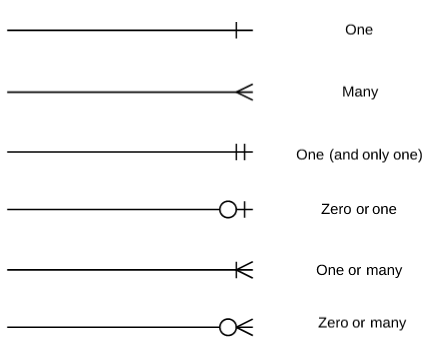

# Getting metadata about and from the database (21)

```{r setup, echo=FALSE, message=FALSE, warning=FALSE}
# library(here)
# source(here("r-database-docker/book-src/standard-package-list.R"))
source("book-src/standard-package-list.R")
``` 
Note that `tidyverse`, `DBI`, `RPostgres`, `glue`, and `knitr` are loaded.  Also, we've sourced the [`db-login-batch-code.R`]('r-database-docker/book-src/db-login-batch-code.R') file which is used to log in to PostgreSQL.

```{r echo=FALSE}
read_chunk("book-src/db-login-batch-code.R")

# use when debugging outside of knitr
# source('r-database-docker/book-src/db-login-batch-code.R')
# source('r-database-docker/book-src/db-login-interactive-code.R')
```
For this chapter R needs the `dbplyr` package to access `alternate schemas`.  A [schema](http://www.postgresqltutorial.com/postgresql-server-and-database-objects/) is an object that contains one or more tables.  Most often there will be a default schema, but to access the metadata, you need to explicitly specify which schema contains the data you want.

```{r}
library(dbplyr)
```

```{r get_postgres_connection, eval=TRUE, echo=FALSE}

```
## Always look at the data

Assume that the Docker container with PostgreSQL and the dvdrental database are ready to go.
```{r}
system2("docker", "start sql-pet", stdout = TRUE, stderr = TRUE)

con <- wait_for_postgres(
  user = Sys.getenv("DEFAULT_POSTGRES_USER_NAME"),
  password = Sys.getenv("DEFAULT_POSTGRES_PASSWORD"),
  dbname = "dvdrental",
  seconds_to_test = 10
)
```
### Look at the data itself

So far in this books we've most often looked at the data by listing a few observations or using a tool like `glimpse`.
```{r}
rental <- dplyr::tbl(con, "rental")

kable(head(rental))
glimpse(rental)
```

### Look at what R sends to `postgreSQL`

```{r}
rental %>% dplyr::show_query()
```
For large or complex databases, however, you need to use both the available documentation for your database (e.g.,  [the dvdrental](http://www.postgresqltutorial.com/postgresql-sample-database/) database) and the other empirical tools that are available.  For example it's worth learning to interpret the symbols in an [Entity Relationship Diagram](https://en.wikipedia.org/wiki/Entity%E2%80%93relationship_model):



The `information_schema` is a trove of information *about* the database.  Its format is more or less consistent across the different SQL implementations that are available.   Here we explore some of what's available using several different methods.  Postgres stores [a lot of metadata](https://www.postgresql.org/docs/current/static/infoschema-columns.html).

### Look at what `information_schema` conains
For this chapter R needs the `dbplyr` package to access alternate schemas.  A [schema](http://www.postgresqltutorial.com/postgresql-server-and-database-objects/) is an object that contains one or more tables.  Most often there will be a default schema, but to access the metadata, you need to explicitly specify which schema contains the data you want.

### Look at the tables first
The simplest way to get a list of tables is with 
```{r}
kable(DBI::dbListTables(con))
```
Often we want more detail than just a list of tables.
```{r}
# table_catalog is the same as `database`.

table_info_schema_table <- tbl(con, dbplyr::in_schema("information_schema", "tables"))
table_info_schema_table %>%
  filter(table_schema == "public") %>%
  select(table_catalog, table_schema, table_name, table_type) %>%
  arrange(table_type, table_name) %>%
  collect() %>%
  kable()

table_info_schema_table %>%
  filter(table_schema == "public") %>%  # See alternative below
  select(table_catalog, table_schema, table_name, table_type) %>%
  arrange(table_type, table_name) %>%
  show_query()


# notice that VIEWS are composites made up of one or more BASE TABLES
```

Get list of database objects
 SophieYang: is `rs` your shorthand for `result`?

Also: 

  WHERE ("table_schema" = 'public') 

is the same as 

  where table_schema not in ('pg_catalog','information_schema')
```{r}

rs <- dbGetQuery(
  con,
  "select table_catalog,table_schema,table_name,table_type 
  from information_schema.tables 
  where table_schema not in ('pg_catalog','information_schema')
  order by table_type, table_name 
  ;"
)
# Get list of tables
kable(rs)
```

### Drill down into the columns

Of course, the `DBI` package has the simplest way to get a little metadata.
```{r}

DBI::dbListFields(con, "rental")

columns_info_schema_table <- tbl(con, dbplyr::in_schema("information_schema", "columns")) 

columns_info_schema_info <- columns_info_schema_table %>%
  filter(table_schema == "public") %>% 
  select(
    table_name, column_name, data_type, ordinal_position,
    character_maximum_length, column_default
  ) %>%
  collect(n = Inf)

glimpse(columns_info_schema_info)
```
With a data frame from the `columns` table in `information_schema`, we can answer a number of questions
```{r}

columns_info_schema_info %>%
  filter(table_name == "rental") %>% 
  kable()

```


Pull out some rough-and-ready but useful statistics about your database.  Since we are in SQL-land we talk about variables as `columns`.

### Create a list of tables names and a count of the number of columns that each one contains.

```{r}

columns_info_schema_table %>%
  filter(table_schema == "public") %>%
  count(table_name, sort = TRUE) %>%
  kable()

# For the same query, show the SQL code that dplyr sends to PostgreSQL

columns_info_schema_table %>%
  filter(table_schema == "public") %>%
  count(table_name, sort = TRUE) %>%
  show_query()
```

How many column names are shared across tables (or duplicated)?
```{r}

columns_info_schema_info %>% count(column_name, sort = TRUE) %>% filter(n > 1)
```

How many column names are unique?
```{r}
columns_info_schema_info %>% count(column_name) %>% filter(n > 1)
```

What data types are found in the database?
```{r}

columns_info_schema_info %>% count(data_type)
```

### Submitting SQL statements directly
```{r}

table_schema_query <- glue(
  "SELECT ",
  "table_name, column_name, data_type, ordinal_position, character_maximum_length, column_default",
  " FROM information_schema.columns ",
  "WHERE table_schema = 'public'"
)

rental_meta_data <- dbGetQuery(con, table_schema_query)

glimpse(rental_meta_data)
```

```{r}
rs <- dbGetQuery(
  con
  , "select table_catalog||'.'||table_schema||'.'||table_name table_name
                         ,column_name,ordinal_position seq --,data_type
                         ,case when data_type = 'character varying' 
                               then data_type || '('|| character_maximum_length||')'
                               when data_type = 'real'
                               then data_type || '(' || numeric_precision ||','||numeric_precision_radix||')'
                               else data_type
                          end data_type
--                         ,character_maximum_length,numeric_precision,numeric_precision_radix
                     from information_schema.columns
                    where table_name in (select table_name
                                           from information_schema.tables
                                         where table_schema not in ('pg_catalog','information_schema')
                                         )
                   order by table_name,ordinal_position;

                  ;"
)
kable(head(rs, n = 20))
```
There are {r dim(rs)[1]} rows in the catalog.

```{r}
rs <- dbGetQuery(
  con,
  "
--SELECT conrelid::regclass as table_from
select table_catalog||'.'||table_schema||'.'||table_name table_name
,conname,pg_catalog.pg_get_constraintdef(r.oid, true) as condef
FROM information_schema.columns c,pg_catalog.pg_constraint r
WHERE 1 = 1 --r.conrelid = '16485' 
  AND r.contype  in ('f','p') ORDER BY 1
;"
)

kable(head(rs))
```

```{r}
rs <- dbGetQuery(
  con,
  "select conrelid::regclass as table_from
      ,c.conname
      ,pg_get_constraintdef(c.oid)
  from pg_constraint c
  join pg_namespace n on n.oid = c.connamespace
 where c.contype in ('f','p')
   and n.nspname = 'public'
order by conrelid::regclass::text, contype DESC;
"
)
kable(head(rs))
dim(rs)[1]
```


```{r}
rs <- dbGetQuery(
  con,
  "SELECT r.*,
  pg_catalog.pg_get_constraintdef(r.oid, true) as condef
FROM pg_catalog.pg_constraint r
WHERE 1=1 --r.conrelid = '16485' AND r.contype = 'f' ORDER BY 1;
"
)

head(rs)
```

### What is the difference between `VIEW`s and `BASE TABLE`s?
```{r}
table_info_schema_table %>%
  filter(table_schema == "public" & table_type == "VIEW") %>%  # See alternative below
  select(table_name) %>% 
  left_join(columns_info_schema_table, by = c("table_name" = "table_name")) %>% 
  select(
    table_name, column_name, data_type, ordinal_position,
    character_maximum_length, column_default
  ) %>%
  collect(n = Inf) %>% 
  filter(str_detect(table_name, "cust")) %>% 
  kable()

table_info_schema_table %>%
  filter(table_schema == "public" & table_type == "BASE TABLE") %>%  # See alternative below
  select(table_name) %>% 
  left_join(columns_info_schema_table, by = c("table_name" = "table_name")) %>% 
  select(
    table_name, column_name, data_type, ordinal_position,
    character_maximum_length, column_default
  ) %>%
  collect(n = Inf) %>% 
  filter(str_detect(table_name, "cust")) %>% 
  kable()
 
```

