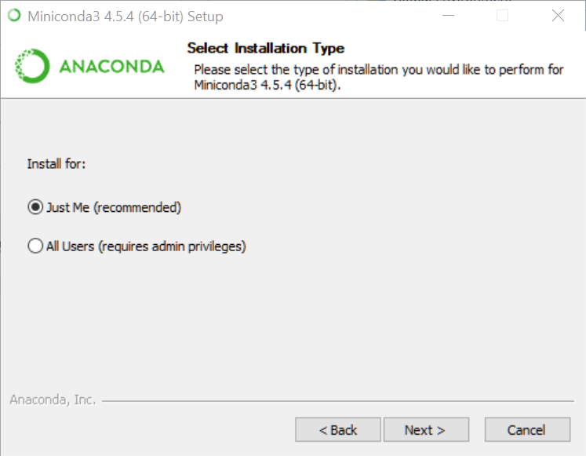

--- 
title: "R, Databases and Docker"
author: "M. Edward (Ed) Borasky, editor"
date: "`r Sys.Date()`"
site: bookdown::bookdown_site
documentclass: book
bibliography: [book.bib, packages.bib]
biblio-style: apalike
link-citations: yes
description: "A collection of tutorials for integrating R with databases using Docker"
---
--- 
title: "R, Databases and Docker"
author: "M. Edward (Ed) Borasky, editor"
date: "`r Sys.Date()`"
site: bookdown::bookdown_site
documentclass: book
bibliography: [book.bib, packages.bib]
biblio-style: apalike
link-citations: yes
description: "A collection of tutorials for integrating R with databases using Docker"
---

# Prerequisites
* R, and
* Docker hosting.

The database we use is PostgreSQL 10, but you do not need to install that - it's installed via a Docker image. RStudio 1.2 is highly recommended but not required.

```{r include=FALSE}
# automatically create a bib database for R packages
knitr::write_bib(c(
  .packages(), 'bookdown', 'knitr', 'rmarkdown'
), 'packages.bib')
```

<!--chapter:end:index.Rmd-->

---
title: "Docker Hosting for Windows"
output: github_document
---

```{r setup, include=FALSE}
knitr::opts_chunk$set(echo = TRUE)
```

## Hardware requirements
You will need an Intel or AMD processor with 64-bit hardware and the hardware virtualization feature. Most machines you buy today will have that, but older ones may not. You will need to go into the BIOS / firmware and enable the virtualization feature. You will need at least 4 gigabytes of RAM!

## Software requirements
You will need Windows 7 64-bit or later. If you can afford it, I highly recommend upgrading to Windows 10 Pro.

### Windows 7, 8, 8.1 and Windows 10 Home (64 bit)
Install Docker Toolbox. The instructions are here: <https://docs.docker.com/toolbox/toolbox_install_windows/>. Make sure you try the test cases and they work!

### Windows 10 Pro
Install Docker for Windows *stable*. The instructions are here: <https://docs.docker.com/docker-for-windows/install/#start-docker-for-windows>. Again, make sure you try the test cases and they work.

## Docker for Windows settings

### Shared drives
If you're going to mount host files into container filesystems, you need to set up shared drives. Open the Docker settings dialog and select `Shared Drives`. Check the drives you want to share. In this screenshot, the `D:` drive is my 1 terabyte hard drive.


### Kubernetes
Kubernetes is a container orchestration / cloud management package that's a major DevOps tool. It's heavily supported by Red Hat and Google, and as a result is becoming a required skill for DevOps.

However, it's overkill for this project at the moment, and it doesn't seem to be compatible with the Docker Compose we're using. So you should make sure it's not enabled.

Go to the `Kubernetes` dialog and make sure the `Enable Kubernetes` checkbox is cleared.


## Git, GitHub and line endings
Git was originally developed for Linux - in fact, it was created by Linus Torvalds to manage hundreds of different versions of the Linux kernel on different machines all around the world. As usage has grown, it's achieved a huge following and is the version control system used by most large open source projects.

If you're on Windows, there are some things about Git and GitHub you need to watch. First of all, there are quite a few tools for running Git on Windows, but the RStudio default and recommended one is Git for Windows (<https://git-scm.com/download/win>).

By default, text files on Linux end with a single linefeed (`\n`) character. But on Windows, text files end with a carriage return and a line feed (`\r\n`). See <https://en.wikipedia.org/wiki/Newline> for the gory details.

Git defaults to checking files out in the native mode. So if you're on Linux, a text file will show up with the Linux convention, and if you're on Windows, it will show up with the Windows convention.

Most of the time this doesn't cause any problems. But Docker containers usually run Linux, and if you have files from a repository on Windows that you've sent to the container, the container may malfunction or give weird results.

In particular, executable `sh` or `bash` scripts will fail in a Docker container if they have Windows line endings. You may see an error message with `\r` in it, which means the shell saw the carriage return (`\r`) and gave up. But often you'll see no hint at all what the problem was.

So you need a way to tell Git that some files need to be checked out with Linux line endings. See <https://help.github.com/articles/dealing-with-line-endings/> for the details. Summary:

1. You'll need a `.gitattributes` file in the root of the repository.
2. In that file, all text files (scripts, program source, data, etc.) that are destined for a Docker container will need to have the designator `<spec> text eol=lf`, where `<spec>` is the file name specifier, for example, `*.sh`.

## Installing the R [`docker`](https://bhaskarvk.github.io/docker/) package
First, if you haven't already, install Miniconda3 and `reticulate`. The instructions are at <https://github.com/smithjd/sql-pet/blob/master/Howtos/miniconda_integration.md>.

Now, install `docker`:
```{r}
if (!require(docker)) install.packages("docker")
library(docker)
```

Create a `conda` virtual environment:
```{r}
library(reticulate)
conda_remove(envname = "docker")
conda_create(envname = "docker")
conda_install(envname = "docker", packages = "docker", pip = TRUE)
use_condaenv("docker")
```

Did it work?
```{r}
library(docker)
client <- docker$from_env()
s <- client$containers$run("alpine", 'echo -n "Hello World!"', remove=TRUE)
print(s$decode("UTF-8"))
```

<!--chapter:end:01-docker_hosting_for_windows.Rmd-->

---
title: "Miniconda Integration"
output: github_document
---

```{r setup, include=FALSE}
knitr::opts_chunk$set(echo = TRUE)
```

## Why do this?

A number of R deep learning packages use Python under the hood. RStudio's [`keras`](https://keras.rstudio.com/) package, for example, works this way. Also, the R [`docker`](https://bhaskarvk.github.io/docker/) package works by calling a Python Docker API library from R via [`reticulate`](https://rstudio.github.io/reticulate/). And, of course, you'll probably end up receiving a Jupyter notebook or two even if you're a die-hard RStudio user. 

[`Miniconda`](https://conda.io/miniconda.html) is a bare-bones minimalist version of the rather large Anaconda environment. If you're doing Python data science, you probably have the full Anaconda installed already. But for R programmers, we only want enough Python for the R packages that use Python libraries to work. So ... here we go!

## Install the `installr` package.
There's an R package called [`installr`](https://github.com/talgalili/installr
) that can run a Windows installer.
```{r}
if (!require(installr)) install.packages("installr")
library(installr)
```

## Install `Miniconda3`
The following R code chunk will install `Miniconda3.` I've commented it out because I already ran it.

```{r}
#install.URL("https://repo.continuum.io/miniconda/Miniconda3-latest-Windows-x86_64.exe")
```

Here are the screenshots you'll see:

```{r echo=FALSE}
knitr::include_graphics("screenshots/2018-08-31 16_12_57-Miniconda3 4.5.4 (64-bit) Setup.png")
```
<br>Click `Next`.

***

```{r echo=FALSE}
knitr::include_graphics("screenshots/2018-08-31 16_13_57-Miniconda3 4.5.4 (64-bit) Setup.png")
```
<br>Click `I Agree`.

***

```{r echo=FALSE}

```
<br>`Just Me`, `Next`.

***

```{r echo=FALSE}
knitr::include_graphics("screenshots/2018-08-31 16_16_11-Miniconda3 4.5.4 (64-bit) Setup.png")
```
<br>Choose the install location. The default is your home directory, which on my laptop is a small SSD. So I changed it to the `D` drive, which is a terabyte spinning disk. After you've set the install location, click `Next`.

***

```{r echo=FALSE}
knitr::include_graphics("screenshots/2018-08-31 16_18_47-Miniconda3 4.5.4 (64-bit) Setup.png")
```
<br>Clear both check boxes and click `Install`.

***

```{r echo=FALSE}
knitr::include_graphics("screenshots/2018-08-31 16_21_12-Miniconda3 4.5.4 (64-bit) Setup.png")
```
<br>Click `Next`.

***

```{r echo=FALSE}
knitr::include_graphics("screenshots/2018-08-31 16_21_44-Miniconda3 4.5.4 (64-bit) Setup.png")
```
<br>Clear the check boxes and click `Finish`.

## Install `reticulate`
```{r}
if (!require(reticulate)) install.packages("reticulate")
library(reticulate)
```
<br>Did it work?
```{r}
py_discover_config()
```


<!--chapter:end:02-miniconda_integration.Rmd-->

`r if (knitr::is_html_output()) '
# References {-}
'`

<!--chapter:end:90-references.Rmd-->

