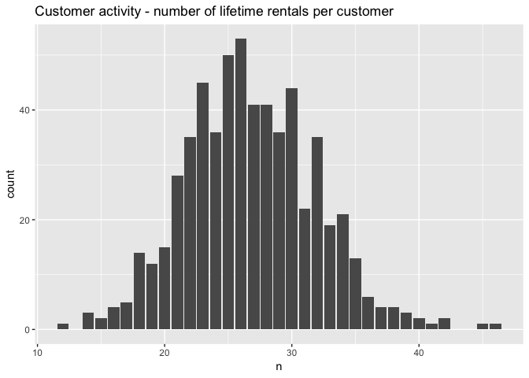

This runs after the dvdrental database is created by
\\3\_install\_dvdrental-in-postgres-b.Rmd

Bring up Docker-compose with Postgres running the dvdrental database

    system2("docker", "start pet", stdout = TRUE, stderr = TRUE)

    ## [1] "pet"

Connect to Postgres

    Sys.sleep(5) # need to wait for Docker & Postgres to come up before connecting.
    con <- DBI::dbConnect(RPostgres::Postgres(),
                          host = "localhost",
                          port = "5432",
                          user = "postgres",
                          password = "postgres",
                          dbname = "dvdrental" ) # note that the dbname is specified

    dbListTables(con)

    ##  [1] "actor_info"                 "customer_list"             
    ##  [3] "film_list"                  "nicer_but_slower_film_list"
    ##  [5] "sales_by_film_category"     "sales_by_store"            
    ##  [7] "staff"                      "inventory"                 
    ##  [9] "country"                    "store"                     
    ## [11] "staff_list"                 "language"                  
    ## [13] "actor"                      "category"                  
    ## [15] "city"                       "rental"                    
    ## [17] "film_actor"                 "address"                   
    ## [19] "film_category"              "film"                      
    ## [21] "customer"                   "payment"

    dbListFields(con, "rental")

    ## [1] "rental_id"    "rental_date"  "inventory_id" "customer_id" 
    ## [5] "return_date"  "staff_id"     "last_update"

Explore one table a bit, starting with “rental”

    rental <- tbl(con,  "rental") 

    rental %>% count() %>% collect(n = Inf)

    ## # A tibble: 1 x 1
    ##   n              
    ##   <S3: integer64>
    ## 1 16044

    rental_df <- rental %>% 
      collect(n = Inf)

    rental_df %>% 
      summarize(start_date = min(rental_date, na.rm = TRUE),
                end_date = max(return_date, na.rm = TRUE)) 

    ## # A tibble: 1 x 2
    ##   start_date          end_date           
    ##   <dttm>              <dttm>             
    ## 1 2005-05-24 22:53:30 2005-09-02 02:35:22

    str(rental_df)

    ## Classes 'tbl_df', 'tbl' and 'data.frame':    16044 obs. of  7 variables:
    ##  $ rental_id   : int  2 3 4 5 6 7 8 9 10 11 ...
    ##  $ rental_date : POSIXct, format: "2005-05-24 22:54:33" "2005-05-24 23:03:39" ...
    ##  $ inventory_id: int  1525 1711 2452 2079 2792 3995 2346 2580 1824 4443 ...
    ##  $ customer_id : int  459 408 333 222 549 269 239 126 399 142 ...
    ##  $ return_date : POSIXct, format: "2005-05-28 19:40:33" "2005-06-01 22:12:39" ...
    ##  $ staff_id    : int  1 1 2 1 1 2 2 1 2 2 ...
    ##  $ last_update : POSIXct, format: "2006-02-16 02:30:53" "2006-02-16 02:30:53" ...

    glimpse(rental_df)

    ## Observations: 16,044
    ## Variables: 7
    ## $ rental_id    <int> 2, 3, 4, 5, 6, 7, 8, 9, 10, 11, 12, 13, 14, 15, 1...
    ## $ rental_date  <dttm> 2005-05-24 22:54:33, 2005-05-24 23:03:39, 2005-0...
    ## $ inventory_id <int> 1525, 1711, 2452, 2079, 2792, 3995, 2346, 2580, 1...
    ## $ customer_id  <int> 459, 408, 333, 222, 549, 269, 239, 126, 399, 142,...
    ## $ return_date  <dttm> 2005-05-28 19:40:33, 2005-06-01 22:12:39, 2005-0...
    ## $ staff_id     <int> 1, 1, 2, 1, 1, 2, 2, 1, 2, 2, 2, 1, 1, 1, 2, 1, 2...
    ## $ last_update  <dttm> 2006-02-16 02:30:53, 2006-02-16 02:30:53, 2006-0...

    rental_df %>%
      count(customer_id) %>%
      mutate(n = as.numeric(n)) %>%
      ggplot(aes(n)) +
        geom_bar() +
        ggtitle("Customer activity - number of lifetime rentals per customer")

Always disconnect from the database and close down docker:

    dbDisconnect(con)

    system2('docker', 'stop pet',
            stdout = TRUE, stderr = TRUE)

    ## [1] "pet"
