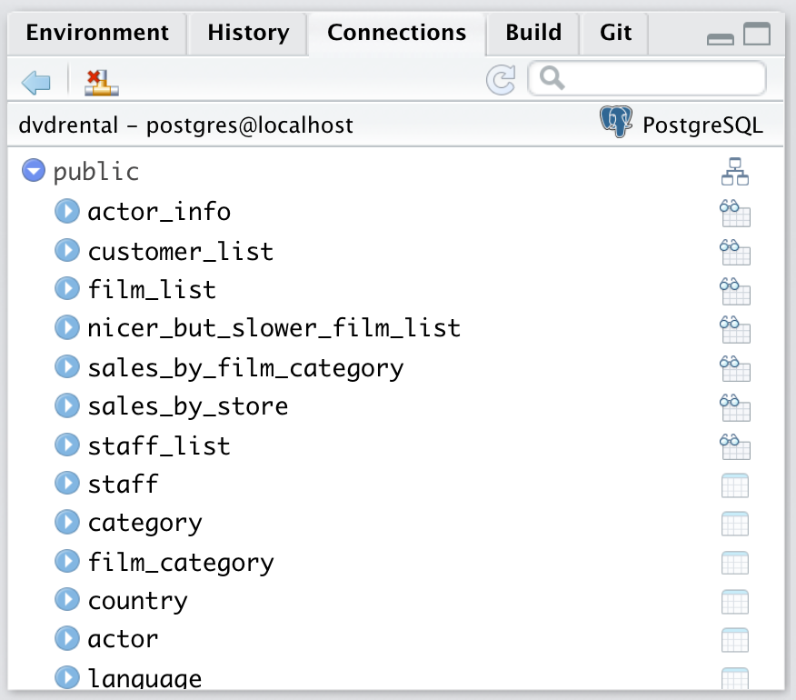
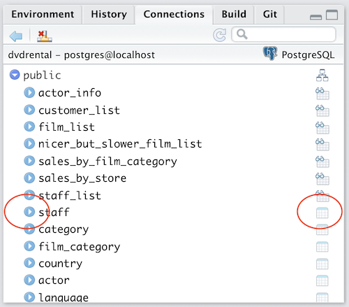
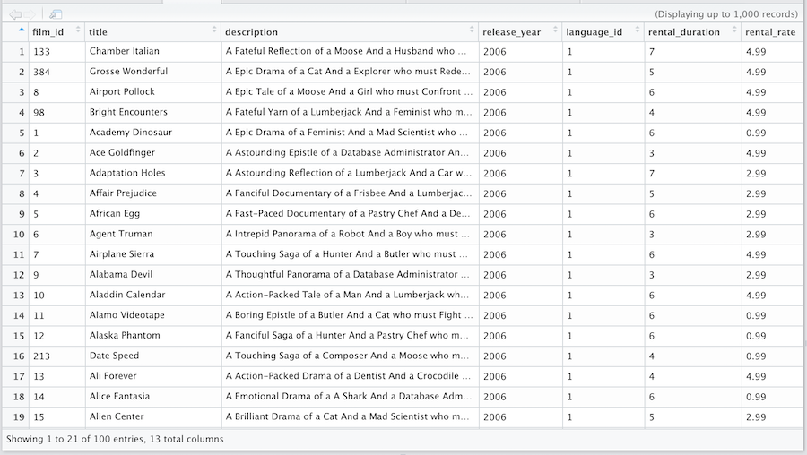
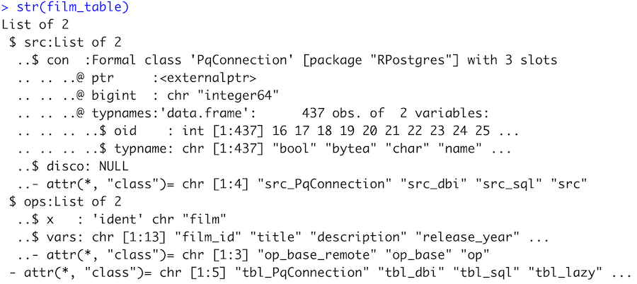
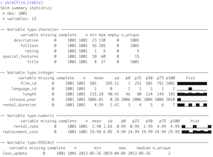

## Overview

This part of the workshop covers:

* Firing up the Docker container and logging onto PostgreSQL
* See what's in the database
* Data retrieval basics
* Getting a table snapshot
* *Lazy retrieval* (kind of like lazy loading & lazy evaluation )
* Basics of dplyr query construction

## Package setup
These packages are called in this part of the tutorial:

```{r setup, echo=TRUE, message=FALSE, warning=FALSE}
library(tidyverse)
library(DBI)
library(RPostgres)
library(dbplyr)
library(sqlpetr)
library(here)
require(knitr)
library(skimr)
# Occasionally need:
#sp_check_that_docker_is_up()
#sp_show_all_docker_containers()

```

## Setup the sandbox environment

Assume that Docker is set up, that packages are updated, and that the `sqlpetr` package is installed.

### Fire up PostgreSQL in Docker:

```{r}

sp_docker_start("sql-pet")
```

If that fails, you may need to recreate the container with: 
```
source(file = 
  here::here('book-src','setup-dvdrental-docker-container.R'),
  echo = FALSE)
```

## Check your log-in credentials:

To avoid putting passwords and login credentials in your code, store DBMS login credentials in your `.Renviron` file:


Edit your **.Renviron** file to include lines such as:

```
DEFAULT_POSTGRES_PASSWORD=postgres
DEFAULT_POSTGRES_USER_NAME=postgres
```
## Connect to PostgreSQL:

Connect to the postgreSQL using the `sp_get_postgres_connection` function:

```{r}
con <- sp_get_postgres_connection(
  user = Sys.getenv("DEFAULT_POSTGRES_USER_NAME"),
  password = Sys.getenv("DEFAULT_POSTGRES_PASSWORD"),
  dbname = "dvdrental",
  seconds_to_test = 30, 
  connection_tab = TRUE)
```
When you've connected, the `con` connection object will have a lot of information that R uses to communicate with postgreSQL.  It's a snapshot so that you must re-connect if the database structure has changed in the meantime.

## Show what tables are in the database

```{r}
DBI::dbListTables(con)
```

Store the list of tables in a vector:
```{r}
table_list <- DBI::dbListTables(con) 
```
## The Connections tab also lists tables



## The Connections tab is clickable



## Click on a table name to show the columns:


## Click on the table icon to View a sample



## Mapping from SQL to 
You can check on how R data types are represented in the SQL environment with:
```{r}
dbDataType(ANSI(), Sys.time())
```
And similarly you can check:
```{r data types, eval= FALSE}
dbDataType(ANSI(), 1:5)
dbDataType(ANSI(), TRUE)
dbDataType(ANSI(), Sys.Date())
dbDataType(ANSI(), 1:5)
dbDataType(ANSI(), c("x", "abc"))
dbDataType(ANSI(), Sys.time() - as.POSIXct(Sys.Date()))
dbDataType(ANSI(), list(raw(10), raw(20)))
dbDataType(ANSI(), I(3))
```
The SQL equivalent of an R factor is a separate table with a common key

## Table and Column information is available with R code in your console:

All the fields (or *columns* or *variables*) in a table with:
```{r}
DBI::dbListFields(con, "film")
```
Put the `film` table definition in an object for multiple uses:
```{r}
film_table <- tbl(con, "film")
```

## The film_table object is a list



## Reusing table information

Once the table connection object is stored in an object, it can be manipulated in R code:
```{r}
film_table %>% 
  head(n = 4)
```
## DBI::dbReadTable downloads an entire table
```{r}
film_tibble <- DBI::dbReadTable(con, "film")
str(film_tibble)
```

## Examining data is R's strength

Once you've downloaded data from the DBMS, R resources for examining data are vast.

<div class="columns-2">

Some functions to get you started:

* skimr::skim()



* str() # the workhorse
 
* head(),  View(), or gt::gt()
 
* summary() # elementary stats
 
* tibble::glimpse() # handy!

</div>
## R is lazy and comes with guardrails

By design, R is both a language and an interactive development environment (IDE).  As a language, R tries to be as efficient as possible.  As an IDE, R creates some guardrails to make it easy and safe to work with your data. 

SQL is a Structured Query Language that returns a table from a database (and manages database structure, etc.)  SQL can easily return more data in a query than your computer can handle.

## Introduction to Lazy Queries

* R's lazy behaviors

  * Lazy Loading: package functions loaded at the last minute

  * Lazy Evaluation: symbols evaluated when actually needed

  * Lazy Retrieval: data retrieved from the DBMS at the last possible moment

## dplyr behavior as guard rails

When working with databases, dplyr tries to be as lazy as possible:

* It never pulls data into R unless you explicitly ask for it.

* It delays doing any work until the last possible moment: it collects together everything you want to do and then sends it to the database in one step.

* The `collect()` function forces R to pull data from the DBMS

## It can be tricky, so we experiment

We store a query in an object called `Q`
```{r}
film_table <- tbl(con, "film")
film_category_table <- tbl(con, "film_category")
category_table <- tbl(con, "category") %>% 
  rename(category = name)

Q <- film_table %>%
  dplyr::left_join(film_category_table, 
                   by = c("film_id" = "film_id")) %>%
  dplyr::left_join(category_table, 
                   by = c("category_id" = "category_id")) %>% 
  dplyr::select(title, length, rating, category)
```

Both `category_table` and `Q` contain multiple dplyr verbs, suggesting how you can construct queries step by step.

## Q is a complex list

```{r}
str(Q, max.level = 2)
```

## Q %>% print()

Remember that `Q %>% print()` is equivalent to `print(Q)` and the same as just entering `Q` on the command line.  
```{r}
Q %>% print()
```

## Q %>% nrow() vs tally()

The `nrow` function returns `NA` because it requires a data frame not a list, so it does not execute a query. `tally` counts all the rows:
```{r}
Q %>% nrow()
Q %>% dplyr::tally()
```

## Q %>% dplyr::collect()

The [collect](https://dplyr.tidyverse.org/reference/compute.html) function triggers a call to the `DBI:dbFetch()` function, which forces R to download the data:
```{r}
Q %>% dplyr::collect(n = 20) %>% head()
```
The `n` parameter determines the number of rows to download.  If absent, `collect()` defaults to the entire table.

## Collect is the point of demarcation 

String as many objects together with ` %>% ` but consider that:

* Typically these dplyr verbs go before `collect`:

  * select
  * filter
  * rename
  * various kinds of joins
  * group_by
  * case_when

## After collect your code is local R, not translated to SQL

* These dplyr verbs can go before `collect` but often go after:
  * mutate
  * ungroup

* Some dplyr verbs make no sense before `collect`:
  * bind_cols
  * bind_rows

* There are some functions like `date` that exist on both sides, so are passed to SQL as SQL code if before `collect` but are executed by R if they appear afterward.

## Q %>% ggplot 

Passing the `Q` object to `ggplot` executes the query and plots the result.
```{r}

Q %>% ggplot2::ggplot(aes(category)) + geom_bar() + coord_flip()

```

It's obvious that when creating our phony `dvdrental` database, phony films were assigned to a category pretty randomly.

## Q %>% dplyr::show_query() 

```{r}
Q %>% dplyr::show_query()
```
SQL is "inside-out" compared to dplyr. Hand-written SQL code to do the same job can  look a lot simpler and could be more efficient, but functionally `dplyr` does the job as SQL.

## Disconnect from PostgreSQL and close Docker
```{r disconnect and close down}
DBI::dbDisconnect(con)
sqlpetr::sp_docker_stop("sql-pet")
```
